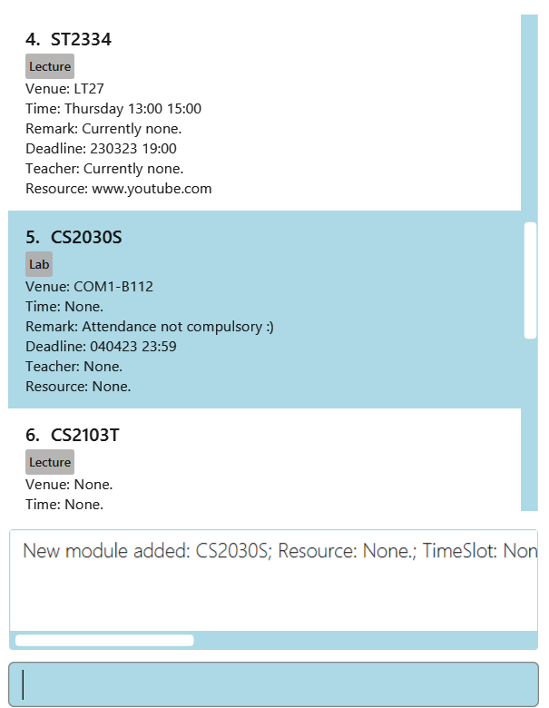
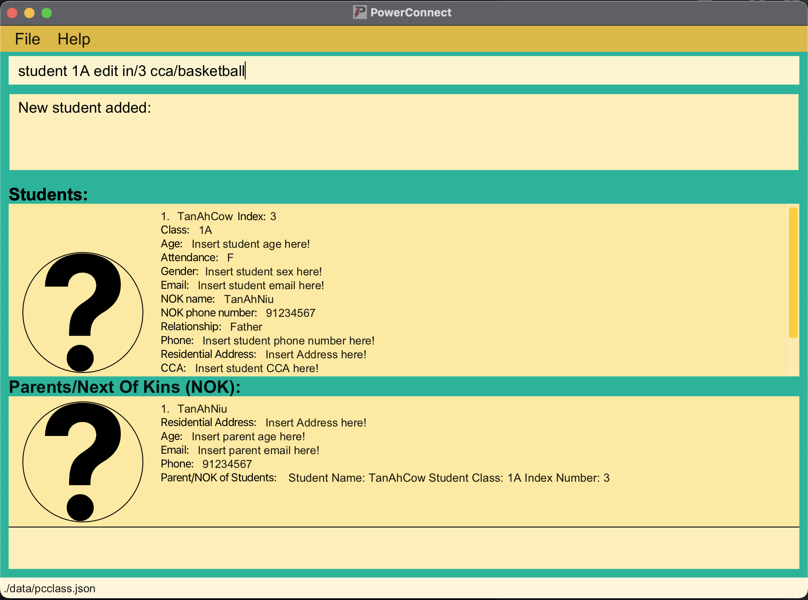

## PowerConnect User Guide

Greetings! Welcome to PowerConnect!  

Are you looking for a simple and all in one solution for your teaching needs? Look no further.  

PowerConnect is a fully customized offline application for tuition and school teachers to manage students' and parents' administrative details. We are still working to scale our features, so we mainly target tuition teachers currently. However, school teachers, do still give us a try. While our
features are limited at this stage, we are working hard to scale them and be a useful tool in conjunction with [Learning Management System (LMS)](#glossary) tools currently in the market.  

We aim to make PowerConnect as simple as possible for you to use with a focus on command line interface where you don't
have to navigate complex user menus to access the features you need, especially if you can type fast.  

Without further ado, let's get started!

----------------------------------------------------------------------------------------------------------------

<a name="table-of-contents"/>

## Table of Contents
1. [Quick Start](#quick-start)
2. [Glossary](#glossary)
3. [Features](#features)
    1. [Legend](#legend)
    2. [Student Features: `student`](#student)
         1. [Add student: `add`](#adding-a-student-student-class-add)
         2. [Add attendance to students: `attendance`](#attendance)
         3. [Add students' grade: `grade`](#gradestudent)
         4. [Deletes students' grade: `gradedelete`](#gradedelete)
         5. [Add comments to students: `comment`](#commentstudent)
         6. [Listing all students in a particular class: `list`](#liststudent)
         7. [Editing a student's particulars: `edit`](#editstudent)
         8. [Searching students: `find`](#findstudent)
         9. [Deleting a student: `delete`](#deletestudent)
    3. [Parent Features: `parent`](#parent)
        1. [Add Parent/Next-of-Kin: `add`](#addparent)
        2. [Listing all Parents/Next-of-Kins: `list`](#listparent)
        3. [Editing a Parent/Next-of-Kin particulars: `edit`](#editparent)
        4. [Searching Parents/Next-of-Kins: `find`](#findparent)
        5. [Deleting a Parent/Next-of-Kin: `delete`](#deleteparent)
    4. [General Features](#general)
       1. [List all students / parents](#listing)
       2. [Viewing help: `help`](#help)
       3. [Exiting program: `exit`](#exit)
4. [Saving the data](#savingdata)
5. [Editing the data file](#editdatafile)
6. [Clearing the data](#clearing-the-data)
7. [Images](#images)
8. [FAQ](#faq)
9. [Command Summary](#command-summary)
   1. [Command Summary for Student](#command-summary-for-student-student-class)
   2. [Command Summary for Parent](#command-summary-for-parent--nok-parent-)
   3. [Prefix Summary](#prefix-summary)

--------------------------------------------------------------------------------------------------------------------

<a name="quickstart"/>

## Quick Start

1. Ensure you have Java `11` or above installed in your Computer.

2. Download the latest `PowerConnect.jar` from [here](https://github.com/AY2223S2-CS2103T-T09-1/tp/releases).

3. Copy the file to the folder you want to use as the _home folder_ for PowerConnect.

4. In the same folder, create a new folder named “images” and another folder named "student" and "parent" in the "images folder". e.g. student image and parent image. For the student image, it should be named `<STUDENT_NAME><CLASS><INDEX NUMBER>.png`. For the parent image, it should be named `<PARENT_NAME>.png`. More details [here.](#images)

5. Open a command terminal, `cd` into the folder you put the jar file in, and use the `java -jar PowerConnect.jar` command to run the application. 
   A GUI similar to the below should appear in a few seconds. Note how the app contains some sample data. 
   

6. Type the command in the command box and press Enter to execute it. e.g. typing **`help`** and pressing Enter will open the help window. 
   Some example commands you can try:

    * `list student` : Lists all students.

    * `student 1A add n/Tan Ah Cow in/13 s/M pn/Tan Ah Niu pnP/91234567 rls/Father` : Adds a student in class 1A named `Tan Ah Cow` to PowerConnect.

    * `student 1A delete in/13` : Deletes the student with index number 13 in class 1A

    * `student 1A grade in/13 test/CA1 score/75 deadline/15/05/2023 weightage/20`: Adds a test named CA1, score of 75, deadline of 15/05/2023, weightage 20% to student index number 13 in class 1A
    * `student 1A gradedelete in/13 test/CA1`: Deletes a test named CA1 for student in class 1A with index 13
    * `exit` : Exits the app.

7. Refer to the [Features](#features) below for details of each command.
8. To clear the student and parent list, make use of student [delete](#deletestudent) and parent [delete](#deleteparent) commands.

--------------------------------------------------------------------------------------------------------------------

<a name="glossary"/>

## Glossary

1. Absolute Path to Image: Location where the image is stored.  
   By default, it should be stored in the images folder as mentioned [here](#images).   
2. Attributes: General particulars of a student/parent.  
   For example, name, phone number, email address etc.   
3. Parameters: The actual information of a student/parent.  
   For example, Tan Ah Kow, 91234567 etc.   
4. CCA: Co-curricular activities.   
5. CLI: Command Line Interface.   
6. Hard disk: Non-volatile data storage device, your OS's storage in short.   
7. JSON: JavaScript Object Notation, open standard file format for storing text.  
   Examples of other commonly known file formats: `.TXT`, `.DOC`, `.PDF`, `.XLS`, `.HTML` etc.   
8. LMS: Learning Management System, application used by schools to provide students a platform to access their lessons materials online.  
   Examples of LMS: Canvas, LumiNUS, Blackboard, Google Classroom, Quizlet.   
9. NOK: Next-of-kin, could be either blood related family members or guardian.   
10. OS: Operating System.  
   Examples of OS: Windows, Linux, Mac etc.   

[Back to Table of Contents](#table-of-contents)

--------------------------------------------------------------------------------------------------------------------

<a name="features"/>

## Features

This section aims to provide a brief overview of the features available in PowerConnect and the appropriate [CLI](#glossary) command to call them.  

### Legend
* Command lines supplied by the teachers are case-sensitive. You need to ensure that you have typed the command in the correct case.
  e.g. in the list feature, you can call it via this method:
  `student 5A list`.   

* Words in `UPPER_CASE` are the parameters to be supplied by the teachers.
  e.g. in `…add <NAME>...`, `NAME` is a parameter which can be used as `…add John…`.   

* Items in `<>` brackets are the values that the teachers should fill in and is compulsory.
  e.g. in `…add <NAME>…` , `NAME` is a parameter that needs to be included, can be used as `…add John…`.   

* All items in the square brackets are OPTIONAL.
  e.g. in `…add…[..c/[CCA].. ]...` , `CCA` is an optional parameter that need not be given by the teachers and can be skipped, can be used as `…add…`  or `…add…c/Mathematics Club nok/…`.   

* `Names` **may** contain **numbers**! PowerConnect supports this flexibility as we understand some parents name their child after numbers.  

* You **SHOULD** choose **VALID** values (positive numbers) for `Age` although you are **NOT LIMITED** to setting it to **0** or other non-conventional values like **999**. 

* PowerConnect does not verify if the input phone number is valid for the country (e.g. Singapore), please ensure that you input the phone number correctly.

* Phone numbers should only contain numbers and must be at least 3 digits long. 

* Student Particulars:
  * Compulsory:
    - Name n/<**NAME**>
      -  Student's name
    - Class <**CLASS**>
      - Student's class
    - Index Number in/<**INDEX_NUMBER**>
      - Number value of student's index number
    - Parents/ Next-of-kin pn/<**PARENT/NOK**>
      - Parent's/ Next-of-kin's name
    - Parents/ Next-of-kin pnP/<**PARENT/NOK_PHONE_NUMBER**>
      - Parent's/ Next-of-kin's phone number
      - Should not include country code
    - Parents/ Next-of-kin rls/<**RELATIONSHIP**>
      - Relationship between student and parent/ Next-of-kin
  * Optional:
    - Age ageS/[**AGE**]
        - Numerical value of student's age
    - Sex s/[**SEX**]
      - Student's gender
      - Should be either M or F (case-insensitive)
    - CCA c/[**CCA**]
      - Student's CCA
    - Comments com/[**COMMENTS**]
      - Student's comments
    - Image imgS/[**IMAGE**]
      - Student's image
      - Should be in .png format
      - Should be named <STUDENT_NAME><CLASS><INDEX NUMBER>.png
      - Should be stored in the image folder
    - Residential address a/[**RESIDENTIAL_ADDRESS**]
      - Student's residential address
    - Email e/[**EMAIL**]
      - Student's email address
    - Phone number pnS/[**PHONE_NUMBER**]
      - Student's phone number
      - Should not include country code

  *  Academics:
      - Attendance att/<**ATTENDANCE**>
          - Can be T/F/`Date`
      - Test test/<**TEST_NAME**>
        - String value of test name
      - Homework hw/<**HOMEWORK**>
          - String value of homework name
      - Grade gde/<**GRADE**>
          - String value of grade results
      - Tags t/<**TAGS**>
          - String value of tags

* Parent / Guardians Particular
  * Compulsory:
    - Name n/<**NAME**>
      -  Parent's name
    - Phone number pnP/<**PHONE_NUMBER**>
      - Parent's phone number
      - Should not include country code
  * Optional:
    - Age ageP/[**AGE**]
      - Numerical value of parent's/NOK age
    - Image imgP/[**IMAGE**]
      - Parent's image
      - Should be in .png format
      - Should be named <PARENT_NAME>.png
      - Should be stored in the image folder
    - Email e/[**EMAIL**]
      - Parent's email address
    - Residential address a/[**RESIDENTIAL_ADDRESS**]
      - Parent's residential address

[Back to Table of Contents](#table-of-contents)

----------------------------------------------------------------------------------------------------------------

<a name="student"/>

## General Command for Student Related features

* For all following features that are related to `students`, start first by typing `student <CLASS>` before adding the respective command for the feature. 
* Compulsory field are inside <> while optional fields are in []

----------------------------------------------------------------------------------------------------------------

<a name="addstudent"/>

### Adding a Student: `student <class> add`

Adds a student to the database.

Format: `student <class> add n/<NAME> in/<INDEX_NUMBER> pn/<NOK_NAME> pnP/<NOK_CONTACT_NUMBER> rls/<NOK_RELATIONSHIP_TO_STUDENT> [s/[SEX] a/[RESIDENTIAL_ADDRESS] ageS/[AGE] imgS/[ABSOLUTE_PATH_TO_IMAGE] eS/[EMAIL_ADDRESS] pnS/[PHONE_NUMBER] cca/[CCA] ]`

***Click [HERE](#images) to find out more on what to input for inserting image!!!***

***Click [HERE](#glossary) to understand `ABSOLUTE PATH TO IMAGE`!!!***

:bulb: **Tip:**
A person with the same name and same class but different index number can exist.

Examples:
* `student 1A add n/TanAhCow in/03 pn/TanAhNiu pnP/91234567 rls/Father`  

  *Above is a situation where some of the student's information is not given!
* `student 1A add n/Tan Ah Cow in/13 s/M pn/Tan Ah Niu pnP/91234567 rls/Father a/Blk 456 Ang Mo Kio Avenue 6 #11-800 S(560456) ageS/14 eS/tanahcow@gmail.com pnS/91234567 cca/Captain Ball att/T `

**Expected Outcome:**
* `New student added:`
  

**For student image:**
* `Advanced` CLI users could specify the absolute file path.
* `beginners` could add the image to the images folder and use images/<STUDENT_NAME><STUDENT_CLASS>.png as input.

**If the source of the image is not specified:**
* A Default Image of a question mark will be displayed.  

:exclamation: Caution:  
1. You cannot create two students of the same index number and same class.  
2. Upon creation of a student, a new parent is also created if the parent does not exist based on the particulars given for the parent. Otherwise, the student will get bound to the matching parent.  
3. If the image does not exist, the default image will be shown and if you choose to update the image using the folder [method](#images) after specifying the exact image location when using the student <CLASS> add command</CLASS>, it will not update.  
Please delete the student and add without the image source path specified in the student <CLASS> add command</CLASS>.  
4. If you have entered the `ABSOLUTE PATH TO IMAGE`, note that once the image changes location, the picture will not render properly.  
It is recommended to store the images using the folder [method](#images) instead.  
5. Student names and Parent/NOK names **may** contain **numbers**! PowerConnect supports this flexibility as we understand some parents name their child after numbers. 
6.You **SHOULD** choose **VALID** values (positive numbers) for `Age` although you are **NOT LIMITED** to setting it to **0** or other non-conventional values like **999**. 
7.PowerConnect does not verify if the input phone number is valid for the country (e.g. Singapore), please ensure that you input the phone number correctly. 
8.Phone numbers should only contain numbers and must be at least 3 digits long.  
9. As we **ALLOW** you to create `CCA` containing **numbers** due to our beliefs that **CCAs* could have **numbers**, it is **HENCE** reliant on you to ensure the field for `CCA` is keyed in correctly.  
10. By default, `Attendance` is set to `F`, representing **ABSENT**.  
11. Attendance information displayed in the application is `Attendance` for **TODAY's** date and will be reset on a **DAILY** basis (midnight at 0000 hours).

[Back to Table of Contents](#table-of-contents)

----------------------------------------------------------------------------------------------------------------

<a name = "attendance"/>

### Marking attendance for student: `student <class> attendance`

Marks the student as being present or allow you to define that the student was present.
Ensure that if you mark the same date for the same student as being present, it will prompt that you have indeed added the same date (for verification).

Format : `student <class> attendance in/<INDEX_NUMBER> att/<DATE_PRESENT>`

Examples:
* `student 3A attendance in/25 att/T`
* `student 3A attendance in/25 att/25/02/2023`

**Expected Outcome:**
* `Attendance marked as present`
  

:bulb: **Tip:**  
Date is in DD/MM/YYYY format  
This date can be set to:  
* T (Indicates that the student was present today)  
* F (Default when adding student)  
* Specific date (Used when you want to update the attendance of the student in the past)  

:exclamation: **Caution:**  
Attendance information displayed in the application is `Attendance` for **TODAY's** date and will be reset on a **DAILY** basis (0000 hours). Hence, updating `Attendance` for past dates will not be reflected in the application. It is however still be **SAVED** in PowerConnect. Future releases will further improve the `Attendance` feature, allowing teachers to view **PAST** attendances.   
Future release of PowerConnect will also provide you with a wider range of attendance **TYPES* to choose from for a particular `Student`'s attendance, such as `Late`, `Left school early`, `On MC`.   

[Back to Table of Contents](#table-of-contents)

----------------------------------------------------------------------------------------------------------------

<a name="gradestudent"/>

### Adding a grade for student : `student <class> grade`

Adds a test OR homework grade for the student corresponding to the `INDEX_NUMBER` in the `CLASS`.

You cannot have different test/homework with the same name.

Format:

`student <class> grade in/<INDEX_NUMBER> test/<TEST_NAME> [score/[score] deadline/[DEADLINE(DD/MM/YYYY)] weightage/[WEIGHTAGE] ]`

`student <class> grade in/<INDEX_NUMBER> hw/<HOMEWORK_NAME> [score/[score] deadline/[DEADLINE(DD/MM/YYYY)] weightage/[WEIGHTAGE] hwdone/[HOMEWORK_DONE(true/false)] ]`
Examples:
* `student 1A grade in/13 test/CA1 score/75 weightage/10`
* `student 1A grade in/13 hw/homework1 score/75 deadline/25/04/2023 weightage/10 hwdone/true`  

**Expected Outcome:**
* `New test added:`

* `New homework added:`

:exclamation: **Caution:**
* Test or Homework name is compulsory for the command to work and must not be duplicate of current tests/homework in student. 
   * Duplicate test/homework is checked through having the same name.  
* hwdone is compulsory for homework. 
* Score is out of 100 
* Weightage is out of 100% 

Note:
* Score is out of 100. 
* Weightage is out of 100%.

[Back to Table of Contents](#table-of-contents)

----------------------------------------------------------------------------------------------------------------

<a name = "gradedelete"/>

### Deleting a grade for student : `student <class> gradedelete`

Deletes a test OR homework grade for the student corresponding to the `INDEX_NUMBER` in the `CLASS`.

Duplicate test/homework is checked through having the same name.

:exclamation: **Caution:**
Please specify only one test or homework name. Multiple names would result in PowerConnect taking the last name.

Format:

`student <class> gradedelete in/<INDEX_NUMBER> test/<TEST_NAME>`

`student <class> gradedelete in/<INDEX_NUMBER> hw/<HOMEWORK_NAME>`

Examples:
* `student 1A gradedelete in/13 hw/Chapter 1`

**Expected Outcome:**
* `Homework deleted successfully`

[Back to Table of Contents](#table-of-contents)

----------------------------------------------------------------------------------------------------------------

<a name = "commentstudent"/>

### Adding comments for student : `student <class> comment`

Adds a comment for the student corresponding to the `INDEX_NUMBER` in the `CLASS`.

Format: `student <class> comment in/<INDEX_NUMBER> com/<COMMENT>`

Examples:

* `student 3A comment in/25 com/Quiet person, needs to interact more with classmates`

:exclamation: **Caution:**  
If an existing comment is already available for the selected student, the new comment will **OVERWRITE** the old comment! 
You should check on existing comments before adding a new comment!   

[Back to Table of Contents](#table-of-contents)

----------------------------------------------------------------------------------------------------------------

<a name = "liststudent"/>

### Listing all students in the selected class: `student <class> list`

Shows a list of all students in the selected class in the database.

Format: `student <class> list`

Examples:
* `student 1A list`
* `student 1B list`

**Expected Outcome:**

[Back to Table of Contents](#table-of-contents)

----------------------------------------------------------------------------------------------------------------

<a name = "editstudent" />

### Edit Student:  `student <class> edit`

Edits personal details of students for the student corresponding to the `INDEX_NUMBER` in the `CLASS` based on the particulars given by the teacher.

Format: `student <class> edit in/<INDEX_NUMBER> [nn/[NEW_NAME] nin/[NEW_INDEX_NUMBER] nc/[NEW_CLASS] s/[SEX] ageS/[STUDENT_AGE]
imgS/[ABSOLUTE_PATH_TO_IMAGE] cca/[CCA] com/[COMMENTS] pnS/[STUDENT_PHONE_NUMBER] eS/[STUDENT_EMAIL] a/[ADDRESS] npn/[NEW_PARENT_NAME] npnP/[NEW_PARENT_PHONE_NUMBER] rls/[RELATIONSHIP] ]`

***Click [HERE](#glossary) to understand `ABSOLUTE PATH TO IMAGE`!!!***

Examples:
* `student 1A edit in/3 cca/basketball`
* `student 1B edit in/4 cca/badminton ageS/23`

**Expected Outcome:**

* `Edited student: TanAhCow; Class: 1A; Index Number: 3;`
* `Edited student: Bernice; Class: 1B; Index Number: 4;`

`Student list before edit:`

`Student list after edit:`

:exclamation: **Caution:**  
If you want to change the parent for this student only, please kindly fill in the **NEW** parent/NOK **NAME**, **PHONE NUMBER** and **RELATIONSHIP**.   
If you want to update all students under this student's parent, please kindly use the [PARENT EDIT COMMAND](#editparent) instead!!!   
As we **ALLOW** you to create `CCA` containing **numbers** due to our beliefs that **CCAs* could have **numbers**, it is **HENCE** reliant on you to ensure the field for `CCA` is keyed in correctly.  

[Back to Table of Contents](#table-of-contents)

----------------------------------------------------------------------------------------------------------------

<a name = "findstudent"/>

### Locating students by name:  `student <class> find`

Finds and generates all students with matching student name and class.

Format: `student <class> find <NAME>  `

Examples:
* `student 3B find Russel`
* `student 3B find Joseph`
* 

:bulb: **Tip:**  
To list back all students, use the [general list](#listing)command!   

**Expected Outcome:**
* Student found: Russel Ong class:3B cca: swimming grade: [sci:A, maths:B] id:26 age:14 email:ro@outlook.com ph:85349633 attendance: 2023-01-01 [y] hw: ip [x] notes:extroverted nok: David Ong
* Student found: Joseph Tan class:3B cca: basketball grade: [sci:A, maths:C] id:27 age:14 email:jo@outlook.com ph:92103134 attendance: 2023-01-01 [x] hw: ip [x] notes:shy  nok: David Tan   

[Back to Table of Contents](#table-of-contents)

----------------------------------------------------------------------------------------------------------------

<a name = "deletestudent"/>

### Deleting student: `student <class> delete`

Deletes student corresponding to the `INDEX_NUMBER` in the `CLASS`  from the database.

Format: `student <class> delete in/<INDEX_NUMBER>`

Examples:
* `student 1A delete in/13`
* `student 1B delete in/23`

**Expected Outcome:**

* `Deleted Student: Tan Ah Cow; Class: 1A; Index Number: 13;`
* `Deleted Student: Tan Ah Niu; Class: 1B; Index Number: 23;`

[Back to Table of Contents](#table-of-contents)

----------------------------------------------------------------------------------------------------------------

<a name = "parent" />

## General Command for parent related features

* For all following features that are related to `parent`, start first by typing `parent`  before adding the respective command for the feature.

* Note that it is possible to have multiple students with the same parent and parents are identified via their phone number and *HENCE* `student class` is not used for identification.

----------------------------------------------------------------------------------------------------------------

<a name="addparent"/>

### Adding a Parent/NOK: `parent add`

Adds a Parent/[NOK](#glossary) to the database.

Format: `parent add n/<PARENT_NAME/NOK_NAME> pnP/<PHONE_NUMBER> [ageP/[AGE] imgP/[ABSOLUTE_PATH_TO_IMAGE] e/[EMAIL_ADDRESS] a/[RESIDENTIAL_ADDRESS] ]`

***Click [HERE](#images) to find out more on what to input for inserting image!!!***

***Click [HERE](#glossary) to understand `ABSOLUTE PATH TO IMAGE`!!!***

Examples of Full Command:
* `parent add n/TanAhNiu pnP/91234567`
* `parent add n/Tan Ah Niu pnP/91234567 ageP/30 e/tanahcow@gmail.com a/Blk 456 Ang Mo Kio Avenue 6 #11-800 S(560456)`   

**Expected outcome:**
* `New parent added:`

:exclamation: **Caution:** 
1. You cannot create two parents with the same `phone number`.  
2. If the image does not exist, the default image will be shown and if you choose to update the image using the folder [method](#images), it will not update.  
Please delete the parent and add without the image source path.  
3. If you have entered the `ABSOLUTE PATH TO IMAGE`, note that once the image changes location, the picture will not render properly.  
It is recommended to store the images using the folder [method](#images) instead.  
4. You **SHOULD** choose **VALID** values for `Age` (positive numbers) although you are **NOT LIMITED** to setting it to **0** or other non-conventional values like **999**.

[Back to Table of Contents](#table-of-contents)

----------------------------------------------------------------------------------------------------------------

<a name = "listparent" />

### Listing all Parents/NOKs : `parent list`

Shows a list of all Parents/[NOKs](#glossary) in the database with their corresponding particulars.

Format: `list`

Examples of Full Command:
* `list parent`  

**Expected Outcome:**

[Back to Table of Contents](#table-of-contents)

----------------------------------------------------------------------------------------------------------------

<a name = "editparent" />

### Edit Parent: `parent edit`

Edits personal details of Parent/[NOK](#glossary) with corresponding NAME and PARENT_PHONE_NUMBER.

Format: `Format: parent edit n/<PARENT_NAME/NOK_NAME> pnP/<PHONE_NUMBER> [nn/[NEW_NAME] npnP/[NEW_PHONE_NUMBER] ageP/[NEW_AGE] imgP/[NEW_IMAGE] e/[NEW_EMAIL_ADDRESS] a/[NEW_RESIDENTIAL_ADDRESS] ]`

Examples of Full Command:
* `parent edit n/TanAhNiu pnP/91234567 npnP/65656565`
* `parent edit n/Tan Ah Niu pnP/91234567 nn/Tan Ah Seng npnP/91274444 ageP/31 e/tanahcow@gmail.com a/Blk 245 Ang Mo Kio Avenue 1 #11-800 S(560245)`

**Expected Outcome:**
* `Edited Parent: TanAhNiu; Phone number: 65656565;`
* `Edited Parent: Tan Ah Niu; Phone number: 91234567;`   

:exclamation: **Caution:**  
You **SHOULD** choose **VALID** values for `Age` (positive numbers) although you are **NOT LIMITED** to setting it to **0** or other non-conventional values like **999**.  

[Back to Table of Contents](#table-of-contents)

----------------------------------------------------------------------------------------------------------------

<a name = "findparent" />

### Locating parent by name:  `parent find`

Finds and generates all parents with matching parent name.

Format: `parent find <NAME>  `

Examples:
* `parent find Russel`
* `parent find Joseph`
*

:bulb: **Tip:**  
To list back all parent, use the [general list](#listing)command!   

**Expected Outcome:**
* 1 parent listed!
* 2 parents listed!   

  

[Back to Table of Contents](#table-of-contents)

----------------------------------------------------------------------------------------------------------------

<a name = "deleteparent" />

### Deleting Parent: `parent delete`

Deletes parent with corresponding `NAME` and `PHONE_NUMBER` from the database.

Format: `parent delete n/NAME pnP/PHONE_NUMBER`

Examples:
* `parent delete n/TanAhCow pnP/91234566`  
* `parent delete n/Tan Ah Niu pnP/91234567`  

**Expected Outcome:**

* `Deleted Parent: TanAhCow; Phone Number: 91234566;`
* `Deleted Parent: Tan Ah Niu; Phone Number: 91234567;`

**Note:**
1. You *CANNOT* delete the parent/[NOK](#glossary) if the parent/[NOK](#glossary) has students *BOUND* to him/her. System will display an error message for this.   
   
[Back to Table of Contents](#table-of-contents)

----------------------------------------------------------------------------------------------------------------

<a name = "general"/>

## General Features  

<a name = "listing"/>

### Listing students / parents: `list`

Lists all students / parents as specified in command.  

Format: `list student` `list parent`   

**Expected Outcome:**

[Back to Table of Contents](#table-of-contents)

----------------------------------------------------------------------------------------------------------------

<a name = "help"/>

### Viewing help : `help`

Provides a link to our UserGuide.

Format: `help`  

[Back to Table of Contents](#table-of-contents)

----------------------------------------------------------------------------------------------------------------

<a name = "exit"/>

### Exiting the program : `exit`

Exits the program.

Format: `exit`   

[Back to Table of Contents](#table-of-contents)

----------------------------------------------------------------------------------------------------------------

<a name = "savingdata"/>

## Saving the data

PowerConnect data are saved in the [hard disk](#glossary) automatically after any command that changes the data. There is no need to save manually.   

[Back to Table of Contents](#table-of-contents)

----------------------------------------------------------------------------------------------------------------

<a name = "editdatafile"/>

## Editing the data file

PowerConnect data are saved as a [JSON](#glossary) file `[JAR file location]/data/parents.json` and `[JAR file location]/data/pcclass.json` for respectively parents/NOKs and students. Advanced users are welcome to update data directly by editing that data file.addressbook.json`. Advanced users are welcome to update data directly by editing that data file.

:exclamation: **Caution:**
If your changes to the data file makes its format invalid, PowerConnect will discard all data and start with an empty data file at the next run.   

[Back to Table of Contents](#table-of-contents)

----------------------------------------------------------------------------------------------------------------

<a name = "clearing-the-data"/>

## Clearing the data

While PowerConnect do not currently support the `clear` function in this version, you may clear all saved `Students'` and `Parents'/NOKs'` information in the following 2 ways:
1. Locate the folder `data`, double click into it and ***REMOVE*** these two files `parents.json` and `pcclass.json`.
2. Locate the folder `data`, double click into it, ***OPEN*** both files `parents.json` and `pcclass.json` and ***MANUALLY*** clear all data inside and save both files as ***EMPTY*** files.

:exclamation: **Caution:**  
If you happen to mess up the file data while ***EDITING*** the files mentioned above (**NOT RECOMMENDED** to edit this way **EVEN IF** you are an **EXPERIENCED USER**), you should always follow the steps above to perform a **FULL CLEAR** of data using the steps above to avoid any unwanted errors!   

:bulb: **Tip:**  
You should also locate the folder `images`, and **REMOVE** all images within the folder to save storage space!   

[Back to Table of Contents](#table-of-contents)

----------------------------------------------------------------------------------------------------------------

<a name = "images"/>

## Images (Recommended method to store student and parent/NOK images)

1. In the same folder as your PowerConnect.jar file, create a new file called `images` if it does not exist.  

2. Place all your student images in this format: `images/student/<STUDENT_NAME><STUDENT_CLASS>.png`  

    Place all your parent images in this format: `images/parent/<PARENT_NAME>.png`   

    Location of where images folder should be at. (Same directory of PowerConnect.jar)

3. Inside the images' folder, create a folder called `student` and `parent` if it does not exist.

    Sample of student image naming format. `images/student/<STUDENT_NAME><STUDENT_CLASS>.png`

    Sample of parent image naming format. `images/parent/<PARENT_NAME>.png`

[Back to Table of Contents](#table-of-contents)

--------------------------------------------------------------------------------------------------------------------
<a name = "faq"/>

## FAQ

Feel free to ask any questions [here](https://docs.google.com/forms/d/e/1FAIpQLScpZ7Gg52KQ8LRsaq_6rXoPG4nYCClzmXKeRK6lyoYP1ZQV0w/viewform), and we will get back to you as soon as possible.

--------------------------------------------------------------------------------------------------------------------

**Q**: Where is the information stored? 
**A**: Data is stored locally in the ./data folder. The student and class information is stored in the file pcclass.json whereas the parents information is stored in parents.json.

**Q**: What is CLI? 
**A**: Command Line Interface (CLI) is a text based user interface used to run the
program. Essentially you do not need a mouse to run this program at all!

**Q**: Do I need to pay for this product? 
**A**: No! We made a commitment to keep this program free for all teachers. Feel free to run and use our program, but remember to like, share and comment down below any feedback.

**Q**: Why is my command not working? 
**A**: PowerConnect is particular with the prefixes (/) and they need to be in the exact format as specified in the user guide. Don’t worry, with practice, it would be second nature to you.

**Q**: There are some terms that I do not understand in the User Guide... 
**A**: You may refer to our [Glossary section](#glossary) to better understand the terminologies used in this User Guide!

[Back to Table of Contents](#table-of-contents)

--------------------------------------------------------------------------------------------------------------------
<a name = "command-summary"/>

## Command Summary

<a name = "command-summary-for-student-student-class"/>

### Command Summary for Student `student <CLASS>`

:exclamation: **Caution:**
Need to add **student** and **class** before each command!

| Action         | Format, Examples                                                                                                                                                                                                                                                                                                             |
|----------------|------------------------------------------------------------------------------------------------------------------------------------------------------------------------------------------------------------------------------------------------------------------------------------------------------------------------------|
| **Add**        | `add n/<NAME> in/<INDEX_NUMBER> pn/<NOK_NAME> pnP/<NOK_CONTACT_NUMBER> rls/<RELATIONSHIP> [ s/[SEX] a/[RESIDENTIAL_ADDRESS] ageS/[AGE] imgS/[ABSOLUTE_PATH_TO_IMAGE] eS/[EMAIL_ADDRESS] pnS/[PHONE_NUMBER] cca/[CCA] att/[ATTENDANCE] ]`                                                                                     |
| **Attendance** | `attendance in/<INDEX_NUMBER> att/<DATE_PRESENT>`                                                                                                                                                                                                                                                                            |
| **Grade**      | `grade in/<INDEX_NUMBER> test/<TEST_NAME> or hw/<HOMEWORK_NAME> [score/[SCORE] deadline/[DEADLINE] weightage/[WEIGHTAGE] hwdone/[HOMEWORK DONE OR NOT] ]`                                                                                                                                                                    |
| **Comment**    | `comment in/<INDEX_NUMBER> com/<COMMENT>`                                                                                                                                                                                                                                                                                    |
| **List**       | `list`                                                                                                                                                                                                                                                                                                                       |
| **Edit**       | `edit in/<INDEX_NUMBER> [nn/[NEW_NAME] nin/[NEW_INDEX_NUMBER] nc/[NEW_CLASS] s/[SEX] ageS/[STUDENT_AGE] id/[INDEX_NUMBER] imgS/[ABSOLUTE_PATH_TO_IMAGE] cca/[CCA] att/[ATTENDANCE] com/[COMMENTS] pnS/[STUDENT_PHONE_NUMBER] eS/[STUDENT_EMAIL] a/[ADDRESS] pn/[PARENT_NAME] pnP/[PARENT_PHONE_NUMBER] rls/[RELATIONSHIP] ]` |
| **Find**       | `find <NAME> `                                                                                                                                                                                                                                                                                                               |
| **Delete**     | `delete in/<INDEX_NUMBER>`                                                                                                                                                                                                                                                                                                   |

[Back to Table of Contents](#table-of-contents)

<a name = "command-summary-for-parent--nok-parent-"/>

### Command Summary for Parent / NOK `parent`

:exclamation: **Caution:**

Need to add parent before each command!!

| Action     | Format, Examples                                                                                                                                                                           |
|------------|--------------------------------------------------------------------------------------------------------------------------------------------------------------------------------------------|
| **Add**    | `add n/<PARENT_NAME/NOK_NAME> pnP/<PHONE_NUMBER> [ageP/[AGE] imgP/[ABSOLUTE_PATH_TO_IMAGE] e/[EMAIL_ADDRESS] a/[RESIDENTIAL_ADDRESS]`                                                      |
| **List**   | `list`                                                                                                                                                                                     |
| **Edit**   | `edit n/<PARENT_NAME/NOK_NAME> pnP/<PHONE_NUMBER> [nn/[NEW_NAME] npnP/[NEW_PHONE_NUMBER] ageP/[NEW_AGE] imgP/[ABSOLUTE_PATH_TO_IMAGE] e/[NEW_EMAIL_ADDRESS] a/[NEW_RESIDENTIAL_ADDRESS] ]` |
| **Delete** | `delete n/<NAME> pnP/<PHONE>`                                                                                                                                                              |

[Back to Table of Contents](#table-of-contents)

### General Command Summary

| Action     | Format, Examples             |
|------------|------------------------------|
| **List**   | `list student` `list parent` |
| **Help**   | `help`                       |
| **Exit**   | `exit`                       |

[Back to Table of Contents](#table-of-contents)

<a name = "prefix-summary"/>

### Prefix Summary

| Prefix        | Prefix Details                     | Notes                                                                                                                               |
|---------------|------------------------------------|-------------------------------------------------------------------------------------------------------------------------------------|
| `add`         | Add Command                        | Used to identify command as an Add Command;   Used in Student Add and Parent/NOK Add commands                                 |
| `attendance`  | Attendance Command                 | Used in Student Attendance Command;   Used to input attendance for `Student`s                                                 |
| `comment`     | Comment Command                    | Used in Student Comment Command;   Used to input comment for `Student`                                                        |
| `delete`      | Delete Command                     | Used to identify command as a Delete Command;   Used in Student Delete and Parent/NOK Delete commands                         |
| `edit`        | Edit Command                       | Used to identify command as an Edit Command;   Used in Student Edit and Parent Edit commands                                  |
| `find`        | Find Command                       | Used to identify command as a Find Command;   Used in Student Find and Parent Find commands                                   |
| `grade`       | Grade Command                      | Used in Student Grade Command;   Used to input `Student`'s assessments / assignment grades                                    |
| `gradedelete` | Grade Delete Command               | Used in Student Grade Delete Command;   Used to remove `Student`'s grades for assessments / assignments                       |
| `list`        | List Command                       | Used to identify command as a List Command;   Used in List Parent/NOK and List Student commands                               |
| `n/`          | Name                               | Used to retrieve `Name` of individual (`Student` / `Parent / NOK`)                                                                  |
| `nn/`         | New Name                           | Used to retrieve **NEW** `Name` of individual (`Student` / `Parent / NOK`)                                                          |
| `pn/`         | Parent/NOK Name                    | Used to retrieve `Parent/NOK`'s `Name`                                                                                              |
| `npn/`        | New Parent/NOK Name                | Used to retrieve **NEW** `Name` of `Parent/NOK`;  Used in the case where `Parent/NOK` and/or `Student` can have **NEW** names |
| `ageS`        | Student's Age                      | Used to retrieve `Student`'s `Age`                                                                                                  |
| `ageP/`       | Parent's/NOK's Age                 | Used to retrieve `Parent/NOK`'s `Age`                                                                                               |
| `att/`        | Attendance                         | Used to retrieve `Student`'s Attendance for a particular date or current date (by default)                                          |
| `cca/`        | CCA                                | Used to retrieve `Student`'s co-curricular activity                                                                                 |
| `com/`        | Comment                            | Used to retrieve `Student`'s comment                                                                                                |
| `e/`          | Parent's/NOK's Email Address       | Used to retrieve email `Address` of `Parent / NOK`                                                                                  |
| `eS/`         | Student's Email Address            | Used to retrieve email `Address` of `Student`                                                                                       |
| `a/`          | Residential Address                | Used to retrieve residential `Address` of individual (`Student` / `Parent / NOK`)                                                   |
| `hw/`         | Homework                           | Used to retrieve `Student`'s homework                                                                                               |
| `imgS/`       | Student's Image                    | Used to retrieve `Student`'s image                                                                                                  |
| `imgP/`       | Parent's Image                     | Used to retrieve `Parent`'s image                                                                                                   |
| `in/`         | Index Number                       | Used to retrieve `Student`'s `Index Number`                                                                                         |
| `nin/`        | New Index Number                   | Used to retrieve `Student`'s **NEW** `Index Number`                                                                                 |
| `nc/`         | New Class                          | Used to retrieve `Student`'s **NEW** `Class`                                                                                        |
| `pnS/`        | Student phone number               | Used to retrieve `Student`'s phone number                                                                                           |
| `pnP/`        | Parent/NOK phone number            | Used to retrieve `Parent/NOK`'s phone number                                                                                        |
| `npnP/`       | New Parent/NOK phone number        | Used to retrieve `Parent/NOK`'s **NEW** phone number                                                                                |
| `rls/`        | Parent/NOK relationship to Student | Used to retrieve the relationship between the `Student` and specified `Parent/NOK`                                                  |
| `s/`          | Gender                             | Used to retrieve `Student`'s gender                                                                                                 |
| `t/`          | Tag                                | Used to retrieve individual's tag (`Student` / `Parent / NOK`)                                                                      |
| `test/`       | Assessment                         | Used to retrieve `Student`'s assessments (includes tests and exams)                                                                 |
| `score/`      | Assessment Score                   | Used to retrieve `Student`'s score for assessment                                                                                   |
| `deadline/`   | Deadline                           | Used to retrieve deadline for `Student`'s assignments                                                                               |
| `weightage/`  | Weightage                          | Used to retrieve weightage for `Student`'s assignments/assessments                                                                  |
| `hwdone/`     | Completion Status for Assignments  | Used to retrieve the completion status for `Student`'s assignments                                                                  |

[Back to Table of Contents](#table-of-contents)

--------------------------------------------------------------------------------------------------------------------
