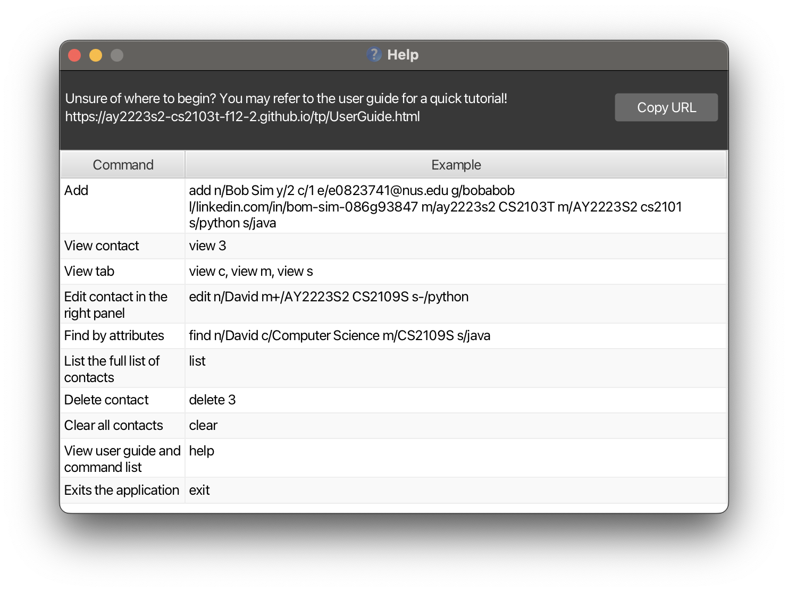
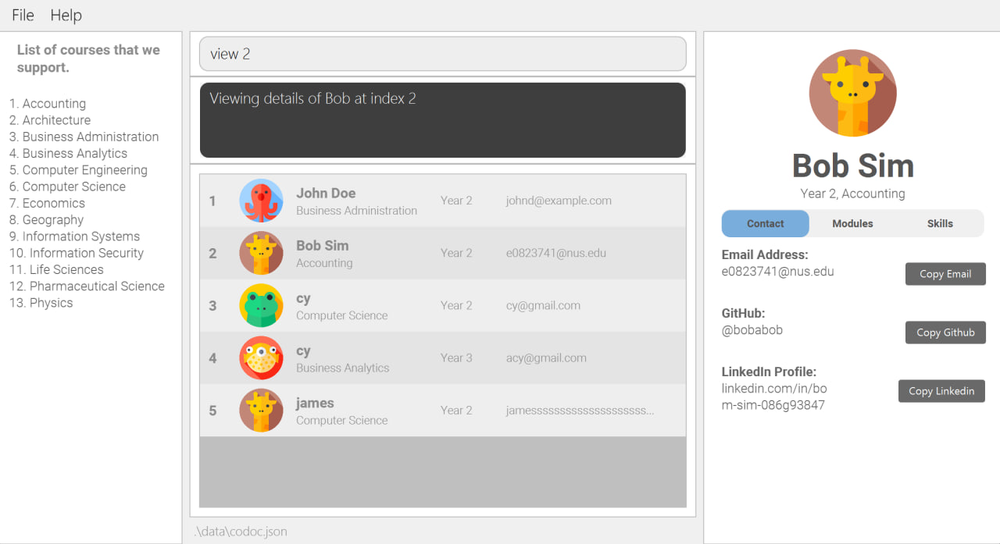

# CoDoc User Guide
#### Welcome to CoDoc, a desktop app for students in NUS to connect with each other for the benefit of their course of study.
CoDoc is **optimized for** use via a **Command Line Interface (CLI)** while still having the **benefits of** a **Graphical User Interface (GUI)**. 
If you can type fast, CoDoc can get your **contact management** tasks **done faster** than traditional GUI apps.

CoDoc is more than just a traditional contact management app. Save useful information such as **modules taken** or
**skills possessed** by a person to greatly improve your **networking experience**.

**Spend less time** _keeping track of your contacts_ or _searching through chats_, and **more time** making _meaningful
connections_ and _accomplishing your goals_!

**For first-time users, we heavily recommend going through the [Quick Start](#quick-start) to familiarize your self with
CoDoc.** 

--------------------------------------------------------------------------------------------------------------------

# Table of Contents
- [Navigating the User Guide](#navigating-the-user-guide)
- [Glossary](#glossary)
- [Quick Start](#quick-start)
  - [Download and Installation](#download-and-installation)
  - [Navigation](#navigation)
  - [Tutorial](#codoc-tutorial-your-first-steps)
    - [Adding a person](#1-adding-a-person)
    - [Viewing a person's modules](#2-viewing-a-person)
    - [Editing a person's modules](#3-editing-a-persons-details)
    - [Finding a person by their modules](#4-finding-a-person)
- [Notes about the command format](#notes-about-the-command-format)
- [Commands](#commands)
  - [Viewing help : `help`](#1-viewing-help--help)
  - [Adding a person : `add`](#2-adding-a-person--add)
  - [Viewing a person/Changing tabs : `view`](#3-viewing-a-personchanging-tabs--view)
  - [Editing a person : `edit`](#4-editing-a-person--edit)
  - [Finding a person : `find`](#5-finding-a-person--find)
  - [Listing all persons/Resetting filters : `list`](#6-listing-all-personsresetting-filters--list)
  - [Deleting a person : `delete`](#7-deleting-a-person--delete)
  - [Clearing all entries : `clear`](#8-clearing-all-entries--clear)
  - [Exiting the program : `exit`](#9-exiting-the-program--exit)
- [Data Management](#data-management)
- [FAQ](#faq)
- [Upcoming Features](#upcoming-features)
- [Command Summary](#command-summary)
- [Additional Resources](#additional-resources)
  - [How To Check Java Version](#how-to-check-java-version)
  - [How to Open CoDoc For Mac](#how-to-open-codoc-for-mac)
  - [How to Open CoDoc For Windows](#how-to-open-codoc-for-windows)

--------------------------------------------------------------------------------------------------------------------
## Navigating the User Guide
Before you start using CoDoc, you are recommended to read the
[Glossary](#glossary), [Quick Start](#quick-start) and the [Notes about the command format](#notes-about-the-command-format)

sections, which will provide the necessary information to allow you to familiarise yourself with the structure of this
User Guide and help you navigate it with ease.

If you are first time users of CoDoc, we highly recommend that you read through the **entire user guide** in order to become 
**familiar** with CoDoc and to gain the most out of your experience.

We have provided a quick tutorial on how to [download and install](#download-and-installation) CoDoc, 
how to make sense of the [interface](#navigation), as well as how to [properly use each command](#codoc-tutorial-your-first-steps). 

If you are proficient with the command types and are looking for a quick summary of our commands, you may jump to our [Command Summary](#command-summary) that contains relevant examples.

If you are looking for a detailed explanation of each individual command, you may jump to the [Commands Section](#commands).
Each command is complete with:
1. What the command does
2. The format of the command
3. Examples of the command
4. Picture of the command in action
5. Any additional tips or warnings

If you have questions regarding storing of information, you may proceed to our [Data Management Section](#data-management).

Should you have more questions, you may proceed to our [FAQ](#faq). We hope it will be sufficient to clarify your doubts.

Whenever you are in doubt, forget the command formats for any feature, need help troubleshooting, 
or you simply want to maximise your use of this application, do remember to revisit this User Guide.
Thank you for choosing CoDoc, and we hope you have a pleasant experience :+1:

[Scroll back to *Table of Contents*](#table-of-contents)

## Glossary
<table>
  <tr>
    <th><strong>Terminology</strong></th>
    <th><strong>Meaning / Purpose</strong></th>
  </tr>
  <tr>
    <td><strong>Command Line Interface (CLI)</strong></td>
    <td>
      A text-based interface that is used to operate software (such as CoDoc) and operating systems. CLI
      allows a user to perform tasks by entering commands.  
      Users enter the specific command, press “Enter”, and then wait for a response.
      After receiving the command, the CLI processes it accordingly and shows the output/result on the screen.
    </td>
  </tr>
  <tr>
    <td><strong>Graphical User Interface (GUI)</strong></td>
    <td>
      A system of interactive visual components for computer software. A GUI displays objects that convey information,
      and represent actions that can be taken by the user. The objects change color, size, or visibility when the user
      interacts with them.
    </td>
  </tr>
  <tr>
    <td><strong>Index</strong></td>
    <td>
      An identifier which is the number corresponding to order of which your contacts and courses are listed out, 
      and used in conjunction with the commands to specify the contact with the given index. Each contact and course 
      is identified with a unique index. Index must be a positive integer 1, 2, 3, ...
    </td>
  </tr>
  <tr>
    <td><strong>Prefix</strong></td>
    <td>
      An identifier that indicates which field our input is meant for. It is denoted by a letter or symbol followed by a slash <code>/</code>. E.g. <code>n/</code> indicates name, <code>c/</code> indicates course, <code>m+/</code> indicates addition of a module, <code>s-/</code> indicates deletion of a skill ...
    </td>
  </tr>
  <tr>
    <td><strong>Parameter</strong></td>
    <td>
      An input that you as the user, will give to the command. These can be in the form of an integer, or a name, 
      or an email.
      Some commands take in a parameter after the prefix,
      some commands take in a parameter without a prefix, and some commands don't take in parameters.
    </td>
  </tr>
  <tr>
    <td><strong>:bulb: Tip</strong></td>
    <td>
      To provide you with suggestions on how to use the commands as well as address potential confusions when using
      these commands, so you will be able to better understand how the commands work.
    </td>
  </tr>
  <tr>
    <td><strong>:warning: Caution</strong></td>
    <td>
      To inform you of some unintended consequences that may occur when you use the commands, so you will be
      able to use them appropriately.
    </td>
  </tr>
</table>

As recommended in the introduction, we would like to direct you to read the [Quick Start](#quick-start) section next.

[Scroll back to *Table of Contents*](#table-of-contents)

---

## Quick Start

First time using CoDoc? Welcome aboard! Follow the steps below to familiarize yourself with CoDoc.

### Download and Installation

Before you can use CoDoc, you need to download it. To do this, follow these steps:

1. Ensure you have `Java 11` or above installed in your Computer. -> [How To Check Java Version](#how-to-check-java-version)
   * If not, you can download it from [here](https://www.oracle.com/java/technologies/downloads/#java11)
   
    
2. Download the latest version of `codoc.jar` [here](https://github.com/AY2223S2-CS2103T-F12-2/tp/releases/), where you will be redirected
to our GitHub Releases page. Find the latest release and download the latest version.

     

    

     

3. Copy the file to the folder you want to use as the _home folder_ for CoDoc. 
   For example,
   1. Create a new folder where you want CoDoc to be (Desktop, My Documents...anywhere you wish)—this folder will then be the _home folder_.
   2. Place `codoc.jar` into the newly created folder.
   
     
   
   Once you have completed these steps, it should look something like this:

    

     
   
4. Launch CoDoc.

   * For users familiar with command terminal:
     1. `cd` into the folder you put the jar file in (_home folder_).
     2. `java -jar codoc.jar` to launch the application.
     3. CoDoc should launch in a few seconds.
   
   * For Windows users who prefer clicking in folder to launch:
     1. Create a .bat file in the folder you put the jar file in (_home folder_).
     2. Write `java -jar codoc.jar` into the .bat file.
     3. Click on the .bat file and CoDoc should launch in a few seconds.
     
    
   
   For a more detailed guide with examples, refer to [How to Open CoDoc For Windows](#how-to-open-codoc-for-windows) or [How to Open CoDoc For Mac](#how-to-open-codoc-for-mac) and

If you have managed to complete all steps, congratulations! You should be seeing CoDoc application 
launched in its factory state as shown below.

         

[Scroll back to *Table of Contents*](#table-of-contents)

---

### Navigation

If it's your first time using this program, the starting screen could seem a little overwhelming.

Before we begin, let's familiarize ourselves with the different parts of the CoDoc interface.
We recommend **maximizing** the program window to have a clearer view.
This way you can see more content as well.

Below is the breakdown of the CoDoc screen:

- **Menu Bar:** if you ever feel stuck, you can always click on the `Help` button here or enter `help` in the command box. 
- **Command Box:** this is where you can type in commands.
- **Result Display:** shows the result of a command that you have executed.
- **Person List Panel:** here are your contacts in CoDoc.
- **Course List Panel:** you can refer to this list when adding a person.
- **Info Panel:** displays information about a selected person, such as their contact details, modules, and skills, which are presented as tabs.

[Scroll back to *Table of Contents*](#table-of-contents)

---

### CoDoc Tutorial: Your first steps

Now that you know how to navigate CoDoc, we recommend you try the following steps to familiarize with 
available features of CoDoc.

 

#### 1. Adding a person

You probably notice a list of contacts already into the database. How can I add one on my own?

Let's say you got to know Bob in school and want to add him to CoDoc. You find out that **Bob**, is a **year 2** student,
taking **Computer Science** and his email address is **e0823741@u.nus.edu**. Here is how you can use CoDoc's
[Add command](#2-adding-a-person--add) to do so:

In the command box, enter the command `add n/Bob y/2 c/6 e/e0823741@u.nus.edu` and press the `enter` key.
This will add a new person named Bob to our contact list.

After executing the command, we see that Bob has been added below the list.

**Note:** You must specify minimally, the person's _name_, _email_, _year_ and _course_ when adding a person.

> 💡 **Understanding commands**:
> As you can see, we first specified the `add` command, followed by the _prefix_ `n/` and the _name_ that we want to add
> i.e. `Bob`. The same goes for the _year_, _course_ and _email_. This `n/` and `Bob` pair, is the _prefix_ and _parameter_
> pair that occurs frequently in other commands too. Refer to [Glossary](#glossary) for more info.

Here, you may have noticed we entered `c/6` and wonder why the parameter for _course_ was `6` instead of `Computer Science`.

To save time typing out the full course and also standardize formatting, we have coded the command so that you just
have to type its _index_ as the parameter, which you can refer to the [**Course List Panel**](#navigation) to identify. 

If you want to, you can add additional details of the person such as _GitHub username_, _LinkedIn profile URL_, _modules_ and _skills_.

Related: [Adding a person: `add`](#2-adding-a-person--add)

**Note:** Profile pictures shown here might not be identical to yours as they are randomised.

 

#### 2. Viewing a person

Now that you have added Bob into CoDoc, you can view his details by using the [View command](#2-viewing-a-person).
This will load Bob's details into the [**Info Panel**](#navigation).

To do so, let's first identify Bob's _index_. From the [**Person List Panel**](#navigation), we can tell that Bob is
numbered `8` in this example. This is his _index_.

Now enter `view 8` into the command box.
His _contact_ details will then be shown in the **Info Panel**.

You may try loading another person's details by using different _index_ (e.g. `view 2`). 

>💡 **Tip**: CoDoc also supports GUI, so you can just click the person in the list to view his details.

 

Remember that we said CoDoc offers more than just a traditional contact management app? So far, you have only viewed
the _detailed contacts_ tab, showing basic contact details.

Now let's try viewing other tabs in **Info Panel**. 
To do so, enter `view m` in the command box. This will show Bob's **modules taken** under _detailed modules_ tab.

Note that you do not see anything of value, and that is because we have not added any modules Bob has taken so far
(don't worry, we will show how you can add onto this list below).

You can enter `view s` as well to view Bob's _skills_ to see a similar empty list, or enter `view c` to go back to Bob's
contact information.

>💡 **Tips**: CoDoc also supports GUI, so you can click on the name of different tabs to switch between tabs.

**Related:** [Viewing a person/Changing tabs: `view`](#2-viewing-a-person)

 

#### 3. Editing a person's details

To use CoDoc to its fullest potential, you can add Bob's **modules taken** or **skills possessed** to the database.

Let's say you met Bob while taking _CS2101_ and _CS2103T_ modules. To update this information in the database, you can use
CoDoc's [Edit command](#4-editing-a-person--edit).

First make sure that Bob is shown in the right panel using the View command. In this example, we can enter `view 8` to
do so.

>**Why is this step necessary?:** Editing only works on the person shown in the info panel. Make sure you are viewing
> the correct person with the [View command](#2-viewing-a-person) (or with a click) before you enter
> the [Edit command](#4-editing-a-person--edit).

After you see Bob in the **Info Panel**, enter `edit m/ay2223s2 cs2101 m/ay2223s2 cs2103t` in the command box. 

You can now see that Bob's list of **modules taken** has been updated to contain modules _CS2101_ and _CS2103T_
(enter `view m` if you're not on the _modules_ tab).

>💡 **Tip**: You do not have to be on _modules_ tab to edit it as long as you are viewing the correct person (i.e. you
> can be viewing Bob's contacts as you add modules). However, switching to _modules_ tab will definitely make it easy
> for you to edit **modules taken**!

If you want to save the hassle of editing _modules_ only after adding a person, you can include them in the initial
[Add command](#2-adding-a-person--add) to do so.

As the name suggests, [Edit command](#4-editing-a-person--edit) is capable of editing other details of the person such as
_name_, _year_, _GitHub username_, etc. Use this to fix your mistakes or update your database as you progress your studies!

**Related:** [Adding a person: `add`](#2-adding-a-person--add),
[Viewing a person: `view`](#2-viewing-a-person),
[Editing a person: `edit`](#4-editing-a-person--edit)

 

#### 4. Finding a person

You have been using CoDoc for months and have expanded the database greatly. You realize that finding a person in the
contacts is getting increasingly difficult and wishes there is an easier way to do so.

That is exactly what CoDoc's [Find command](#5-finding-a-person--find) is for! Use this to filter people in the contacts.

Let's try to find people that are taking/have taken CS2103T. To do so, we have to first clear existing filters if they
have been applied. We can do this by entering `list` into the command box. This shows us all existing contacts in CoDoc. 

Then enter `find m/cs2103t`. This will make **Person List Panel** show only the people who have CS2103T in their module
list. On successful execution, you will see something like below.

If you tried the examples for previous commands, Bob would be shown as well.

Our `find` command is pretty powerful; it works for other attributes, like _year_, _skills_, etc. and you can find by
multiple attributes. To learn more about it, you can take a look at [Finding a person: `find`](#5-finding-a-person--find).

**Related docs:** [Finding a person: `find`](#5-finding-a-person--find), [Listing all persons/Resetting filters: `list`](#6-listing-all-personsresetting-filters--list)

 

### **Congrats! You have completed the tutorial 🎉** 

The pre-existing contacts that come when you first launch are just some examples that you can play around with. 
Now, you may enter `clear` in the command box to clear all contacts and start off with a fresh database.

>💡 **Tip**: Be careful not to accidentally enter the `clear` command, it will not ask twice before wiping your database!

If you need more info on the usage of each command, you can refer to the relevant sections below. 

[Scroll back to *Table of Contents*](#table-of-contents)

 

---

### Notes about the command format

* Words in `UPPER_CASE` are the parameters to be **supplied by you**. \
  e.g. in `add n/NAME`, `NAME` is a parameter which can be used as `add n/John Doe`.
* Items in square brackets are **optional**. \
  e.g. `n/NAME [s/SKILL]` can be used as `n/John Doe s/Python` or as `n/John Doe`.
* Items with `…`​ after them can be used **multiple times including zero times**. \
  e.g. `[m/MODULE]…​` can be used as ` ` (i.e. 0 times), `m/AY2223S2 CS2103T`, `m/AY2122S1 CS1101S m/AY2223S2 CS2103T` etc.
* Parameters can be **in any order**. \
  e.g. if the command specifies `n/NAME e/EMAIL`, `e/EMAIL n/NAME` is also acceptable.
* If a parameter is expected only once in the command, but you specified it multiple times, **only the last occurrence of the parameter will be taken**. \
  e.g. if you specify `g/johnny g/john`, only `g/john` will be taken.
* Extraneous parameters for commands that do not take in parameters (such as `help`, `list`, `exit` and `clear`) will be ignored. \
  e.g. if the command specifies `help 123`, it will be interpreted as `help`.

[Scroll back to top](#table-of-contents)

---

## Commands

Here is a list of available commands and its details.

 

### 1. Viewing help : `help`

Forgotten the commands? Open the help menu!  

Equivalent to clicking Help > Help F1 via the GUI  
`help` 
> 

[Scroll back to *Table of Contents*](#table-of-contents)

### 2. Adding a person : `add`

Met a new friend? Add their contact into your CoDoc application! 

There are **compulsory** parameters that must be specified to create the new contact.
Once the person has been created, the result display will show a confirmation message and the person can be seen at the bottom of the person list panel.

`add n/NAME e/EMAIL y/YEAR c/COURSE_INDEX [OPTIONAL/PARAMETER]...` 
>
> **Compulsory parameters:**
> - n/NAME (eg. n/John Doe)
> - e/EMAIL (eg. e/johndoe123@email.com)
> - y/YEAR (eg. y/3)
> - c/COURSE_INDEX (eg. c/1)
>
> **Optional parameters:**
> - g/GITHUB (eg.g/johnny)
> - l/LINKED (eg. l/linkedin.com/in/john-doe)
> - m/MODULE YEAR (eg. m/AY2223S1 CS2103T, m/AY2122S2 CS2101)
> - s/SKILL (eg. s/C++, s/Rust)
>
> 💡 **Tip:** A person can have any number of [OPTIONAL/PARAMETER] (including 0)
>
> **Examples:**
> - `add` n/Betsy Crowe e/betsycrowe@example.com y/4 c/1 g/betsy123 l/linkedin.com/in/betsy-123
>   
> - `add` n/John Doe e/johnd@example.com y/2 c/3
    

[Scroll back to *Table of Contents*](#table-of-contents)

### 3. Viewing a person/Changing tabs : `view`

Want to look a contact with greater detail? Use view to see more information on the right panel!  

If an `integer` is specified, the person displayed on the right will be the person in the person list that has the **same index** as the integer given.

If `c` is specified, the tab on the right will switch to the **contact information**.

If `m` is specified, the tab on the right will switch to the **modules taken**.

If `s` is specified, the tab on the right will switch to the **skills** that the person has.

`view <PARAMETERS>` 

> 
> **Acceptable parameters:**
> - Any index number within the length of the person list (e.g. view 2)
> - c (e.g. view c)
> - m (e.g. view m)
> - s (e.g. view s)
>
> 💡 **Tip:** If the right panel is showing a person's module, changing the person by typing `view 3` for example, will result in the right panel displaying the module tab of the person at index 3. The same applies for skills.
>
> **Examples:**
> - `view` 2
     
> - `view` m
     

[Scroll back to *Table of Contents*](#table-of-contents)

### 4. Editing a person : `edit`

Does one of your contact have outdated information? Overwrite them in the view panel with the edit command! 
>:warning: **Caution:** Existing values will be <b><u>overwritten</u></b> by the input values. 
> Use m+/ or s+/ to <b><u>append</u></b> information instead

At least one of the optional fields must be provided.

- You can remove a person's GitHub by typing `g/` without specifying any GitHub username after it
- You can remove a person's LinkedIn by typing `l/` without specifying any LinkedIn URL after it
- You can remove all the person’s modules by typing `m/` without specifying any modules after it
- You can remove all the person’s skills by typing `s/` without specifying any skills after it

`edit [OPTIONAL/PARAMETER]...` 

> **Acceptable Parameters**
> - n/NAME (eg. n/John Doe)
> - e/EMAIL (eg. e/johndoe123@email.com)
> - y/YEAR (eg. y/3)
> - c/COURSE_INDEX (eg. c/1)
> - g/GITHUB (eg.g/johnny)
> - l/LINKED (eg. l/linkedin.com/in/john-doe)
> - m/MODULE YEAR (eg. m/AY2223S1 CS2103T, m/AY2122S2 CS2101)
>> - m+/MODULE YEAR (eg. m+/AY2223S1 CS2103T, m+/AY2122S2 CS2101)
>> - m-/MODULE YEAR (eg. m-/AY2223S1 CS2103T, m-/AY2122S2 CS2101)
> - s/SKILL (eg. s/C++, s/Rust)
>> - s+/SKILL (eg. s+/C++, s+/python)
>> - s-/SKILL (eg. s-/C++, s-/python)
>
> 💡 **Tip:** If `s/` or `m/` is present in the edit command, this will take precedence over `s+/ s-/ m+/ m-/`.
> 
> 
> **Examples:**
> - `edit` g/johndoeee e/johndoeee@example.com will edit the GitHub username and email address of the person to be johndoeee and johndoeeee@example.com respectively.
> 
> - `edit` s/java s+/python resets the skill list to contain only java and ignores the python skill addition.
>
> - `edit` m-/ay2223s2 cs3230 displays an error message as the module does not exist.
> 

[Scroll back to *Table of Contents*](#table-of-contents)

### 5. Finding a person : `find`
Want to find people with certain qualities? Use find command to find people that contain the given constraints!  
- `find` supports continuous search by allowing constraints to stack, (refer to example below to find out more)
- All constraints applied are shown in *Result Display*.
- To remove all constraints, use `list`. 
- At least one of the optional fields must be provided.
- All constraints are case-insensitive.

`find [OPTIONAL/PARAMETER]...` 
> **Acceptable Parameters used as Constraints**
> * n/NAME (e.g. n/Jo will load all people whose names contain Jo such as Jo, John, Joleen.
> * y/YEAR (e.g. y/2 will load all persons who are in year 2)
> * c/COURSE (e.g. c/Computer will load all people enrolled in Computer Engineering and Computer Science)
>   * Notes that this is different from `add` and `edit` which uses c/COURSE_INDEX. To find out why, refer to our [faq](#faq)
> * m/MODULES (e.g. m/CS2103 will load all person with CS2103 including CS2103T and CS2103R)
>   * m/ACADEMIC_YEAR MODULES (e.g. m/AY2223S1 CS2103 will load all person with AY2223S1 CS2103 including AY2223S1 CS2103T and AY2223S1 CS2103R in their module list)
>   * 💡 **Tip:** You can input as many MODULES and ACADEMIC_YEAR MODULES as you want.   For example,  m/`cs1101 cs1231` `AY2223S1 cs2040` `AY2223S2 cs2090 cs3230` will load all person that have taken
>     * cs1101, cs1231 regardless of academic year
>     * cs2040 in AY2223S1
>     * cs2090, cs3230 in AY2223S2
> * s/SKILLS (e.g. s/java will load all person that contains java in their skill list such as java and javascript)
>   * 💡 **Tip:** Similar to m/MODULES you can add in as many skills as you want to separate by a space.
> 
>
> **Examples:**
> - execute `find y/2` to find all persons from year 2.   
> - execute `find n/cs1101 s/java c` to further narrow down the filtered list thereby **stacking the constraints.**   
> - Finally, execute `list` to get back every contact in Codoc

[Scroll back to *Table of Contents*](#table-of-contents)

### 6. Listing all persons/Resetting filters : `list`

Want to see all your contacts? Display everyone stored in Codoc with the list command! 

`list` 

💡 **Tip:** Use this command to revert back to the original list after performing the `find` command to shorten the list displayed.
> * `list`
> 

[Scroll back to *Table of Contents*](#table-of-contents)

### 7. Deleting a person : `delete`

Want to remove a contact from Codoc? Delete them at the specified INDEX with the delete command! 

INDEX refers to an index currently shown in the displayed person list. You may check out our [Glossary](#glossary) for more information. 

E.g. `delete 1` will delete the current person at index 1 as shown in the list panel. 

`delete <INDEX>` 

> * `delete 6` deletes Betsy Crowe who was at index 6
> 

[Scroll back to *Table of Contents*](#table-of-contents)

### 8. Clearing all entries : `clear`
`clear` 
> * :warning: Clears **all** entries from CoDoc. 
> 

[Scroll back to *Table of Contents*](#table-of-contents)

### 9. Exiting the program : `exit`

Want to quit? Use exit command to exit the program!  
Equivalent to clicking the close button via the GUI.  

>`exit` 

[Scroll back to *Table of Contents*](#table-of-contents)

 

---

## Data Management
**Q**: How do I save my person list? 
**A**: CoDoc automatically saves your person list after every successful `add`, `edit` and `clear`.

**Q**: How do I transfer my data to another Computer? 
**A**: Install CoDoc on the other computer and overwrite the empty data file it creates with the file that contains the data of your previous CoDoc home folder.

**Q**: Where is the data file stored? 
**A**: CoDoc data are saved as a JSON file at ***[JAR file location]*****/data/codoc.json**. Advanced users are welcome to update data directly by editing that data file.

:warning:
If your changes to the data file make its format invalid,
CoDoc will discard all data and start with an empty data file at the next run.

[Scroll back to *Table of Contents*](#table-of-contents)

 

---

## FAQ

**Q: I have added a person with wrong details. How do I change it?**

A: Use CoDoc's [Edit command](#4-editing-a-person--edit) to update the details. If you have also forgotten to add certain
details, you may use the same command to add them (e.g. `edit m+/AY2223S2 CS2101` to add module _CS2101_).

 

**Q: My edit command is not working/changes are not shown.**

A: Check that you have entered the command in correct format and command result shown in the **Results Panel** is not
showing any errors.

 

**Q: My edit command is editing the wrong person.**

A: Edit command works on the current person you are viewing. Change the viewed person with the [View command](#3-viewing-a-personchanging-tabs--view)
and view the correct person you want to edit before entering the command.

 

**Q: Why is it `find c/COURSE` and not `c/COURSE_INDEX` like `add` and `edit`?**

A: This is done as it speeds up the adding and editing process since there is no need for you to manually keep track of how courses are inputted—CS vs Computer Science.
Also, this avoids clashing acronyms such as CS which could be interpreted as Chinese Studies too.

 

**Q: My find command is not showing correct list of people**

A: This could be because there is existing list of filters before you entered the [Find command](#5-finding-a-person--find).
Try clearing all filters with [List command](#6-listing-all-personsresetting-filters--list) then re-enter the Find command.

 

**Q: I cannot find the course I want to add in the Course List Panel.**

A: We understand that the current list of courses available is limited. This is because this program is initially designed
to be used mainly by _Computer Science_ students, hence it only lists courses of people which they may encounter during
their studies. We are currently working to add as many courses as possible so that the program can be used by users
outside _Computer Science_. Meanwhile, you would have to assign any other courses to the person and remember it.

[Scroll back to *Table of Contents*](#table-of-contents)

 

---

## Upcoming Features

### Automated bulk edits `[coming in v2.0]`
_Details coming soon ..._

### Archiving data files `[coming in v2.0]`

_Details coming soon ..._

 

[Scroll back to *Table of Contents*](#table-of-contents)

 

---

## Command Summary 

| Actions                          | Description                                                                                                                                 |
|----------------------------------|---------------------------------------------------------------------------------------------------------------------------------------------|
| Add a person                     | add n/Bob Sim y/2 c/1 e/e0823741@nus.edu g/bobabob l/linkedin.com/in/bom-sim-086g93847 m/ay2223s2 CS2103T m/AY2223S2 cs2101 s/python s/java |
| Clear all persons                | clear                                                                                                                                       |
| Delete person at index 3         | delete 3                                                                                                                                    |
| Edit contact in the right panel  | edit n/David m+/AY2223S2 CS2109S s-/python                                                                                                  |
| Find by attributes               | find n/David c/Computer Science m/CS2109S s/java                                                                                            |
| List the full list of contacts   | list                                                                                                                                        |
| View contact                     | view 3                                                                                                                                      |
| View tab                         | view c, view m, view s                                                                                                                      |
| View user guide and command list | help                                                                                                                                        |

[Scroll back to *Table of Contents*](#table-of-contents)

--------------------------------------------------------------------------------------------------------------------

## Additional Resources
### How To Check Java Version

[Scroll back to *Downloading CoDoc*](#download-and-installation)
### How to Open CoDoc for Mac

1. Create your *home folder* and place the jar file into it. In this example,  
   * we create a new folder called *CoDoc* 
   * and place our `codoc.jar` into it
   
   

   :information_source: **Note:** The folder CoDoc is now our *home folder*.
   

2. Create an empty text file and **leave it open for now.**
   * <kbd>CMD</kbd> + <kbd>Space</kbd> > type *textEdit.app* >  <kbd>Enter</kbd> (to open textEdit)
   * <kbd>CMD</kbd> + <kbd>SHIFT</kbd> + <kbd>T</kbd> (to toggle textEdit to plain text)
   * Your window should look like the image below
   
3. Right-click on your home folder and navigate to `New Terminal at Folder`. This will open a terminal window.
   
4. Then, 
    * type `pwd` > <kbd>Enter</kbd>
    * copy the output which is yourHomeFolderPath
    * **leave this window open too**
   
5. Next,
   * paste `cd yourHomeFolderPath*`
   * as well as `java -jar codoc.jar` 
   * and save it as a `.command file`
   
6. Place the newly created `.command file` into your *home folder*.
   
7. Finally, on your opened terminal from step 4, type `chmod 777 start.command` > <kbd>Enter</kbd>.
   

   :information_source: **Note:** Replace start with whatever you name your `.command` file from step 5*.
   

   
8. You can now double-click on your `.command` file to open CoDoc. 
   

   :bulb: **Tip**: You can place the `.command` file anywhere. It does not have to stay in your *home folder*.
   

   
  
   :warning: **Caution**: If you decide to change the location of your *home folder*, repeat from step 2.
   

[Scroll back to *Downloading CoDoc*](#download-and-installation)

### How to Open CoDoc for Windows

Batch file method for Windows users:
1. Right-click the empty space in the _home folder_ and create new _text file_.

    

2. Open the _text file_ with any text editor (notepad is fine) and write in `java -jar codoc.jar`. Save and close the file.

    

3. Rename the file to `start.bat`. Make sure that file extension gets changed too, if you do not know how to see the file 
extension, see [here](https://www.howtogeek.com/205086/beginner-how-to-make-windows-show-file-extensions/).
    
    

    **Note**: You may see a warning message below. This is because you are converting a text file to a batch file.

    
   
    Press "Yes" to continue renaming the file.

4. If done correctly, you should now see a file with an icon similar to below. Double-click the renamed batch file `start.bat` to launch CoDoc.

    

[Scroll back to *Downloading CoDoc*](#download-and-installation)

--------------------------------------------------------------------------------------------------------------------
[Scroll back to *Table of Contents*](#table-of-contents)
