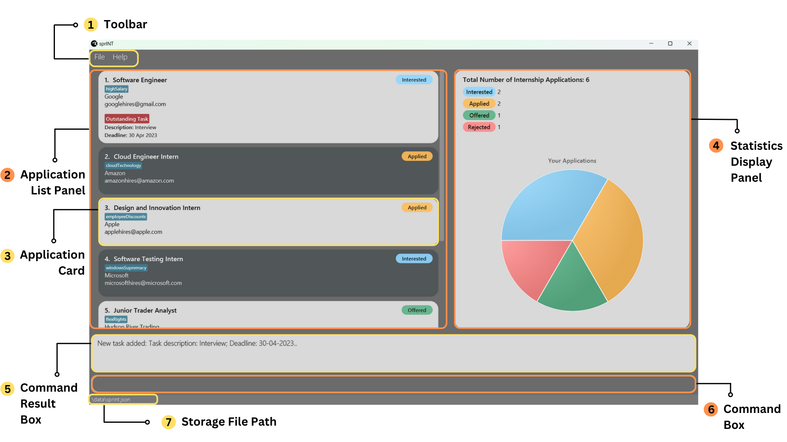
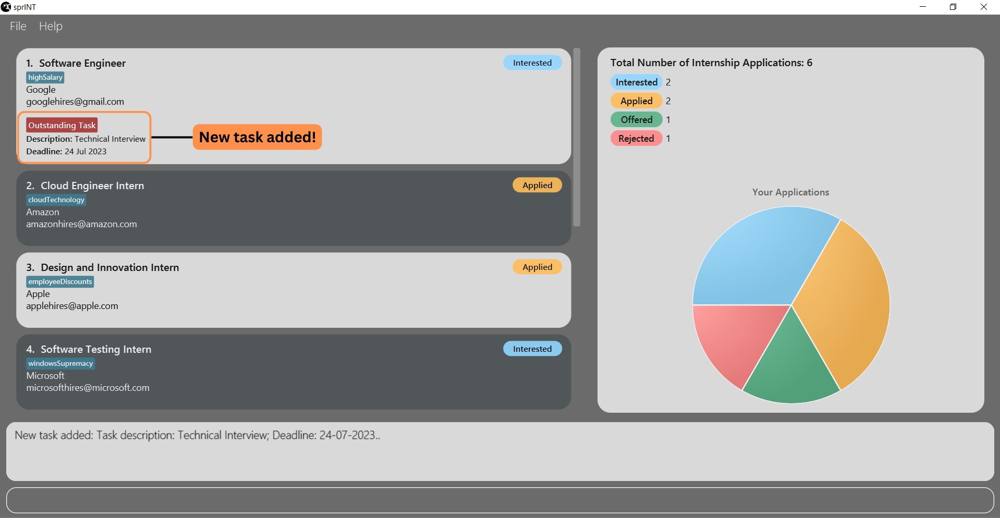

## Table of Contents
 
{:toc}

--------------------------------------------------------------------------------------------------------------------

## **1. Introduction**

Are you a student who wants to avoid the hassle of managing internship applications? Look no further than sprINT, 
the ideal tool for streamlining this daunting process!

sprINT is a **desktop application** that can help YOU track your internship applications.
Optimised for use by typing while offering a beautiful user interface, it will be a **_great_** asset in your internship 
application journey.

--------------------------------------------------------------------------------------------------------------------

## **2. About the User Guide** 

In this section, you will find information pertaining to the user guide (the document you are reading now!). It includes 
details about who this guide is meant for and how to navigate this guide effectively.  

### **2.1 Target Audience**
This user guide is meant for anyone who wants to use sprINT. It is designed to provide clear and concise instructions
for beginners to kickstart their sprINT journey, as well as for existing or more advanced users who wish to explore 
the full range of features that sprINT has to offer. Whether you are a new or seasoned sprINT user, this guide will be 
your best companion to help you get the most out of sprINT. 

### **2.2 Using the Guide**  
If you are a new user, we recommend you to check out the **[Quick start](#2-quick-start)** section to learn how to set up 
sprINT quickly, before reading through the section on **[Basics](#3-basics)** to pick up a few simple commands. 

If you have already used sprINT before, feel free to use the **[Table of Contents](#table-of-contents)** to navigate to 
the section you are interested in, or skip to a specific command in **[Features](#4-features)** you wish to learn more 
about.

### **2.3 Understanding Notations**
Throughout the rest of this user guide, you may encounter certain notations like the ones below. Here's how you should
interpret them: 

**Tips**

Tips are useful suggestions that will help you become a seasoned sprINT user more quickly.

:bulb:
**Tip:** Tips are can give you a better experience with sprINT.

**Notes**

Notes are important information that you should pay attention to when using sprINT.

:information_source:
**Note:** Take notes when you see this icon.

**Caution**

Cautions are in place to warn you of potential pitfalls new users may encounter.

:exclamation:
**Caution:** Stop and read carefully when you see this!

--------------------------------------------------------------------------------------------------------------------

## **3. About sprINT**

In this section, you will find _everything_ you need to know about the sprINT app. It's been further organised into 
sub-sections for greater readability and navigability. 

### **3.1 Quick start**

Step 1: Ensure you have Java `11` or above installed in your computer.

Step 2: Download the latest `sprINT.jar` file [here](https://github.com/AY2223S2-CS2103T-T13-3/tp/releases/tag/v1.3.1).

Step 3: Copy the file to the folder you want to use as the [home folder](#home-folder) for your sprINT application.

Step 4: Double-click on the jar file to run the application.
If it doesn't work, open a [command terminal](#command-terminal), enter `cd` with the path to the folder you put the jar file in,
and type: `java -jar sprINT.jar` to run the application. 

:bulb:
**Tip:** `cd` stands for "change directory". It is a command that allows you to navigate to another folder on your computer.

An interface similar to the one shown below should appear in a few seconds. Note how the app contains some sample data already. 

:bulb:
**Tip:** The app should work for any laptop or computer regardless of the operating system (e.g., Windows, Linux, etc.)!

### **3.2 The User Interface**

We understand that using an app for the first time can be a daunting experience. This is why we have an entire 
section for you to get acquainted with sprINT's user interface.

The following diagram illustrates the general layout of sprINT's app window. 

The table below describes the function(s) of each component. Don't worry if you can't understand or remember everything;
sprINT is designed to have an intuitive interface that you should be able to familiarise yourself with in no time. 
You are also welcome to revisit this section again anytime. 

| No. | Component                | Description                                                                                                                                                                                                                |
|-----| :------------------------|:---------------------------------------------------------------------------------------------------------------------------------------------------------------------------------------------------------------------------|
| 1   | Toolbar                  | Contains buttons to exit sprINT (through the File button) and view help information quickly.                                                                                                                               |
| 2   | Application List Panel   | Displays the list of all/filtered/sorted applications, depending on the command issued.                                                                                                                                    |
| 3   | Application Card         | Displays information about each application, including the role, company, company email, status and tags or outstanding task (if any).                                                                                     |
| 4   | Statistics Display Panel | Displays statistics about your internship applications, including a pie chart that will update immediately after every command you execute (so there's no need to worry about updating it manually). _Pretty neat, right?_ |
| 5   | Command Result Box       | Displays feedback immediately after executing a command, indicating if you have executed it successfully, and if not, what went wrong (e.g. incorrect formatting).                                                         |
| 6   | Command Box              | This is where you type all your commands; press Enter to execute them.                                                                                                                                                     |
| 7   | Storage File Path        | Displays the path of your sprINT storage file.                                                                                                                                                                             |

### **3.3 About sprINT's Commands** 

Before we delve into the individual features, here are some useful notes about the general format of all commands in 
sprINT:

**:information_source: Notes about the command format:** 

* **Commands in sprINT are composed minimally of a [command word](#command-word). Most, but not all, commands also 
    consist of [prefixes](#prefix) and [parameters](#parameter).** 

* **Words in `UPPER_CASE` are the parameters you need to supply.** 
  e.g. in `add c/COMPANY_NAME`, `COMPANY_NAME` is a parameter which can be used as `add c/Google`.

* **Items encapsulated within square brackets are optional.** 
  e.g. `c/COMPANY_NAME [t/TAG]` can be used as `c/Google t/highsalary` or as `c/Google` only.

* **Items that come with `(s)` means multiple parameters for the same prefix can be added, as long as they are separated by a space.** 
  e.g. `[t/TAG(s)]` can be used as `t/creditBearing t/highSalary` or as `t/creditBearing` only.

:exclamation:
**Caution:** Be aware of the difference between `(s)` and `[]`. The former allows for multiple arguments, the latter represents
an optional argument.

* **Command words and prefixes are case-sensitive.** 
  e.g. `UNDO` will not be recognised as a valid command for the undo operation. Similarly, `bY/` (instead of `by/`)
  will not be recognised as a valid prefix for the `add-task` command.

* **Parameters can be entered in any order.** 
  e.g. if the command specifies `r/ROLE c/COMPANY_NAME`, `c/COMPANY_NAME r/ROLE` is also acceptable.

* **If a parameter is expected only once in the command, but you specified it multiple times, only the last occurrence of the parameter will be taken.** 
  e.g. if you specify `r/SWE Intern r/Software Intern`, only `r/Software Intern` will be taken.

* **Extraneous parameters for commands that do not take in parameters (such as `help`, `list`, `exit` and `clear`) will be ignored.** 
  e.g. if the command specifies `help 123`, it will be interpreted as `help`.

### **3.4 Short Tutorial**
Can't wait to try sprINT out? Here is a sample sequence of commands to get you started:

1. `add-app r/Software Engineering Intern c/Google e/google_careers@gmail.com s/interested`: Adds a new
  application for a **Software Engineering Intern** position at **Google** to the internship book, with the status set
  to **Interested**. A new Application Card should appear at the top of the Application List Panel. 
2. `delete-app 3`: Removes the 3rd application shown on the Application List Panel.
3. `undo`: Reverts the previous delete operation. 
4. `add-task 2 d/Interview by/30-05-2023`: Adds a new **Interview** task with deadline **30 May 2023** to the 2nd 
    application shown on the Application List Panel. 
5. `exit`: Exits sprINT. Notice that there is no need to save your data manually, as sprINT does it for you automatically. 

Congratulations on completing the tutorial! For the complete list of commands, you can refer to the 
**[Command Summary](#7-command-summary)** section. For more details about each command, you can read on for the next
section on **[Features](#4-features)**.

--------------------------------------------------------------------------------------------------------------------

## **4. Features**

### 4.1 Managing applications

#### 4.1.1 Adding an application : `add-app`

Adds an internship application to be tracked.

Format: `add-app r/ROLE c/COMPANY_NAME e/COMPANY_EMAIL s/STATUS [t/TAG(s)]​`

You can refer to our **[Glossary](#6-glossary)** for more information about each field (ROLE, COMPANY_NAME, etc.) and
other sprINT-specific terminology.

:bulb: **Tip:**
Tag is an optional field when adding an application.
An application can have multiple tags or none at all.

Refer to the following section [here](#413-adding-and-editing-tags-for-an-application--using-add-app-and-edit-app) 
to learn more about adding tags to your application entries.

Examples:
* `add-app r/SWE Intern c/Google e/google_careers@gmail.com s/interested t/creditBearing`
* `add-app r/Data Analyst Intern c/Bloomberg e/bloomberg_hires@bloomberg.com s/applied`

#### 4.1.2 Editing an application : `edit-app`

Edits an existing internship application to be tracked.

Format: `edit-app INDEX [r/ROLE] [c/COMPANY_NAME] [e/COMPANY_EMAIL] [s/STATUS] [t/TAG(s)]​`

* Edits the internship application at the specified `INDEX`. The index here refers to the index number shown in the displayed application list. The index **must be a positive number**: 1, 2, 3, …​
* At least one of the optional fields must be provided.
* Existing values of the application entry will be updated to what you have inputted.
* Refer to the following section [here](#413-adding-and-editing-tags-for-an-application--using-add-app-and-edit-app)
  to learn more about editing an application's tags.

Examples:
*  `edit-app 1 r/Cloud Engineer e/googleHR@example.com` Edits the role and email address of the 1st application to be `Cloud Engineer` and `googleHR@gmail.com` respectively.
*  `edit-app 2 s/Rejected` Edits the status of the 2nd application to be `Rejected`.

#### 4.1.3 Adding and editing tags for an application : Using `add-app` and `edit-app`

* To add an application with tags, you can use `add-app` as described in the section on 
[adding an application](#411-adding-an-application--add-app).

:exclamation: **Caution:** 
When adding and editing tags of an application, the tag must be inputted as a single word with no spacing and symbols.

This means that for example, if you wish to tag an application to remind yourself that it is to your dream company, 
you have to use `t/dreamCompany` or `t/dreamcompany`, instead of `t/dream company`, `t/dream-company` and so on.

**Example:**
`add-app r/SWE Intern c/Google e/google_careers@gmail.com s/interested t/creditBearing t/overseas`
* Later on, you can remove all of an application’s tags simply by typing `t/` without specifying any values after it.

**Example:**
`edit-app 1 t/`
* You can also change an existing application's tags by using `edit-app`.

**Example:**
`edit-app 1 t/overseas t/dreamCompany` changes the tags of the 1st application in the displayed list to
`overseas` and `dreamCompany`.

:exclamation: **Caution:** 
When editing tags of an application, the existing tags for that application will be removed! 
i.e., The adding of tags is not cumulative.

This means that for example, if an application has an existing `highSalary` tag, executing the command `edit-app 1 t/creditBearing` 
would remove the original `highSalary` tag, replacing it with the `creditBearing` tag.

#### 4.1.4 Deleting an application : `delete-app`

Deletes the specified application from the internship book.

Format: `delete-app INDEX`

* Deletes the application at the specified `INDEX`.
* The index here refers to the index number of the application shown in the displayed application list.
* The index **must be a positive number**: 1, 2, 3, …​

Examples:
* `list` followed by `delete-app 2` deletes the 2nd application in the internship book.
* `find Google` followed by `delete-app 1` deletes the 1st application shown in the results of the `find` command.

--------------------------------------------------------------------------------------------------------------------

### 4.2 Managing application tasks

#### 4.2.1 Adding an application task : `add-task`

Adds an upcoming task to an existing application.

Format: `add-task INDEX d/DESCRIPTION by/DEADLINE`

* Adds a task to the application at the specified `INDEX`.
* The index here refers to the index number of the application shown in the displayed application list.
* The index **must be a positive number**: 1, 2, 3, …​
* The deadline must be in **DD-MM-YYYY** format.

Example:
I have recently applied to `Google` for their `Software Engineer` role, and made an entry for it in the internship book.
Then, `Google` reaches out to me for a technical interview on the 24th July 2023. I can add this
as a task to the application entry I have created before (suppose it is showing up as the first one in the list) by typing:
`add-task 1 d/Technical Interview by/24-07-2023`

You can see how the new task will then appear for the 1st application entry in the list:

#### 4.2.2 Editing an application task : `edit-task`

Edits an upcoming task for an application entry.

Format: `edit-task INDEX [d/DESCRIPTION] [by/DEADLINE]`

* Edits the internship application at the specified `INDEX`. 
* The index here refers to the index number shown in the displayed
  application list. 
* The index **must be a positive number**: 1, 2, 3, …​
* Existing description and/or deadline of the task will be updated to what you have inputted.

Example:
`edit-task 1 d/Accept offer by/09-07-2023` Edits the description and deadline of the task for the 1st application to be
`Accept offer` and `09-07-2023` respectively.

#### 4.2.3 Deleting an application task : `delete-task`

Deletes the task of the specified application.

Format: `delete-task INDEX`

* Deletes the task of the application at the specified `INDEX`.
* The index here refers to the index number shown in the displayed application list.
* The index **must be a positive number**: 1, 2, 3, …​

:bulb: **Tip:**
Deleting an application's task will not delete the underlying application entry itself.
Refer to the command delete-app if you wish to delete an application entry entirely and all its information (including its task).

Examples:
* `list` followed by `delete-task 2` deletes the task for the 2nd application.
* `find Google` followed by `delete-task 1` deletes the task of the 1st application to be shown in the results of the `find` command.

--------------------------------------------------------------------------------------------------------------------

### 4.3 Managing display for applications

#### 4.3.1 Listing all applications : `list`

Shows a list of all internship applications, in the order of when they are added. Application
entries that are added more recently will be shown on top.

Format: `list`

#### 4.3.2 Finding applications : `find`

Finds internship applications with information containing any of the given keywords.

Format: `find keywords(s)` or `find [r/keyword(s)] [c/keyword(s)] [s/keyword(s)]`

* The keywords are case-insensitive. e.g. You can type `GOoGlE` and it will match with `Google`.
* In `find keyword(s)`, when none of the prefixes is specified, the keyword(s) will be searched globally in the information for all prefixes.
* In `find [r/keyword(s)] [c/keyword(s)] [s/keyword(s)]`, `r/`, `c/` and `s/` are prefixes that stand for `ROLE`, `COMPANY NAME` and `STATUS` respectively.
* When at least one prefix is provided, the keyword(s) is searched according to the information under that particular prefix.
* Only full words will be matched e.g. `Han` will not match `Hans` but `Google` will match with `Google LLC`.

Examples:
* `find Google` returns internship applications for `Google` and `Google LLC`.
* `find Google Meta` returns internship applications for `Google LLC`, `Meta Platforms`. 
* `find r/SWE Intern c/Meta s/Offered` returns internship application(s) for the role of `SWE Intern` at `Meta` that is of the status `Offered`. 

#### 4.3.3 Sorting applications : `sort`

Sorts internship applications in the order you want.

Format: `sort SEQUENCE ORDER`

* Type either `a` or `d` for `SEQEUENCE`. They refer to **ascending** and **descending** respectively. 
Currently, there are two orders you can choose:
* Type either `alphabetical` or `deadline` for `ORDER`.
1. Choosing `alphabetical` will sort applications by their roles in alphabetical order. Should
   there be multiple application entries with the same role, they will be ranked alphabetically by their company names.
2. Choosing `deadline` will display applications with tasks (and therefore, deadlines) only. The applications will be sorted by their task's deadline. 

Examples:
* `sort a deadline` will show applications with task deadlines. Those with earlier deadlines will be higher up in the list.
* `sort d alphabetical` will show applications in descending alphabetical order. (Z to A)

--------------------------------------------------------------------------------------------------------------------

### 4.4 Miscellaneous

#### 4.4.1 Viewing help : `help`

Displays a pop-up window with a simple summary of all the commands and their formats.

Format: `help`

The help window that pops up will also have a button you can click to access the URL to this guide.

#### 4.4.2 Undoing a command : `undo`

Undo the previous command that you have typed in.

This command works for all the commands made in the period that you opened sprINT for.

:bulb: **Tip:**
You can use this command if you have accidentally deleted an application entry or cleared the entire internship book, 
and you wish to retrieve them back.

Format: `undo`

#### 4.4.3 Redoing a command : `redo`

Redo the previous command that you have undo-ed.

:exclamation: **Caution:** 
If you executed another command immediately after undo, you will no longer be able to redo the undo-ed command.

Format: `redo`

#### 4.4.4 Clearing all applications : `clear`

Clears all entries from the internship book.

Format: `clear`

:exclamation: **Caution:** 
The `clear` command must be used with extreme caution, as it might potentially lead to highly undesirable outcomes.
If you accidentally issued the `clear` command, use the `undo` command to revert to the previous state.

#### 4.4.5 Exiting the program : `exit`

Exits the program.
Alternatively, you can exit the program by clicking the top-right X button to close the window. sprINT updates
your data [periodically](#446-saving-the-data), so you don't have to worry about unsaved or possible loss of data when exiting the program.

Format: `exit`

#### 4.4.6 Saving the data

Data in the internship book are automatically saved in your local storage after any command that modifies the data. There is no need to save manually.

#### 4.4.7 Editing the data file **(for Advanced users)**

Data in the internship book are actually saved as a JSON file `[JAR file location]/data/sprint.json`. Advanced users are welcome to update their data directly by editing that data file.

:exclamation: **Caution:**
If your changes to the data file makes its format invalid, the internship book will discard all data and start with an empty data file at the next run.

--------------------------------------------------------------------------------------------------------------------

## **5. FAQ**

**Q**: How do I transfer my data to another computer? 
**A**: Install the app in the other computer and overwrite the empty data file it creates with the file that contains the data of your previous internship book's home folder.

--------------------------------------------------------------------------------------------------------------------

## **6. Glossary**

### **6.1 sprINT-related Terminology**

#### Application
Represents an internship application entry in the internship book. Each application contains minimally a role,
company name, company email and one of four possible statuses. An application can also have 1 or more tags and 1 task
associated with it. 

#### Command word
Refers to the first word in a valid user command. Examples include `add-app`, `undo` and `sort`. Non-examples include `edit`, `hello` and `12345`.  

#### Prefix
Refers to a short sequence of characters ending in a slash ('/') that precedes a [parameter](#parameter) value. It indicates 
the type of information that follows. For example, `r/` is the prefix for the `role` parameter and `s/` is the prefix 
for the `status` parameter.  

#### Parameter
Refers to a specific input value from the user that provides details to execute a command. Most parameters, other than 
the index parameter, are identified by its [prefix](#prefix). Examples include `d/DESCRIPTION` and `by/DEADLINE`.

#### Status
Represents the current stage of the internship application. Can be one of 4 values:
* **Interested**: An internship that the user is interested in, but has yet to apply to.
* **Applied**: An internship that the user has applied to, but has yet to receive an offer or rejection for.
* **Offered**: An internship that the user has received an offer for.
* **Rejected**: An internship that the user has been rejected for.

#### Task
Represents additional milestones that are part of the internship application process. Examples include online
assessment, technical interview, etc.

### **6.2 Others**

#### Command terminal
A program on your computer that enables you to interact with your computer with text commands, instead of through a 
graphical interface. On Windows, this is either the Command Prompt or Powershell. On Mac, this is the Terminal. 

#### Home folder
The folder that will contain all sprINT-related data (including the application itself). 

#### Integer
A whole number like 1, 3, 5, 8 etc. Numbers with decimals like 2.1, 4.002 are not considered integers. 

#### JSON (Javascript Object Notation)
JSON is a way of storing and sharing data in a simple and standardised format that can be easily read by computers and
understood by humans. sprINT uses JSON to store your internship book because it is _lightweight_, which means that
sprINT can process your data more quickly! 

--------------------------------------------------------------------------------------------------------------------

## **7. Command Summary**

| Action                      | Format, Examples                                                                                                                                                               |
|-----------------------------|--------------------------------------------------------------------------------------------------------------------------------------------------------------------------------|
| **Add**   Application   | `add-app INDEX r/ROLE c/COMPANY_NAME e/COMPANY_EMAIL s/STATUS [t/TAG(s)]​`   e.g. `add-app r/Teaching Assistant c/NUS SOC e/ta_portal@nus.edu.sg s/Offered t/creditBearing` |
| **Edit**  Application   | `edit-app INDEX [r/ROLE] [c/COMPANY_NAME] [e/COMPANY_EMAIL] [s/STATUS] [t/TAG(s)]`   e.g. `edit-app 1 r/Cloud Engineer e/googleHR@example.com`                             |
| **Delete**  Application | `delete-app INDEX`   e.g. `delete-app 1`                                                                                                                                   |
| **Add**   Task          | `add-task d/DESCRIPTION by/DEADLINE`   e.g. `add-task d/Technical Interview by/01-05-2023`                                                                                  |
| **Edit**   Task         | `edit-task INDEX [d/DESCRIPTION] [by/DEADLINE]`   e.g. `edit-task 1 d/Accept offer by/09-07-2023`                                                                          |
| **Delete**   Task       | `delete-task INDEX`   e.g. `delete-task 1`                                                                                                                                 |
| **List**                    | `list`                                                                                                                                                                         |
| **Find**                    | `find [keyword(s)]`   e.g. `find Meta`   `find [r/keyword(s)] [c/keyword(s)] [s/keyword(s)]`   e.g. `find r/SWE Intern c/Meta s/Offered`                           |
| **Sort**                    | `sort SEQUENCE ORDER`   e.g. `sort d alphabetical` or `sort a deadline`                                                                                                    |
| **Help**                    | `help`                                                                                                                                                                         |
| **Undo**                    | `undo`                                                                                                                                                                         |
| **Redo**                    | `redo`                                                                                                                                                                         |
| **Clear**                   | `clear`                                                                                                                                                                        |
| **Exit**                    | `exit`                                                                                                                                                                         |

