# Introduction

Streamline your patient management with lightning-fast efficiency using HospiSearch - the CLI optimized GUI desktop app.

HospiSearch is a **desktop app for managing hospital/clinic patients' particulars, optimized for use via a Command Line Interface** (CLI) while still having the benefits of a **Graphical User Interface (GUI)**. If you can type fast, HospiSearch can get your contact management tasks done faster than traditional GUI apps.

Our target audience is hospital and clinical administrative staff who deal with the management of large physical patient records and seek a more efficient and streamlined solution.

## About this Guide

The purpose of this user guide document is to provide staff with a clear understanding of the features and benefits of HospiSearch. The guide aims to assist users in effectively utilizing HospiSearch's features to streamline their patient management tasks and improve overall efficiency.

:information_source: **Note:** Messages in this format are important!

💡**Tip**:
  Messages in this format include information that may be useful to the user.

# Table of Contents:

- [Setup](#setup)
- [GUI Information](#gui-information)
- [Command Prefixes](#command-prefixes)
- [Features](#features)
  - [Help](#viewing-help--help): `help`
  - [Undo](#undoing-previous-command-undo): `undo`
  - [Redo](#redoing-previous-undo-redo): `redo`
  - [Add patient](#adding-a-patient-record-add): `add`
  - [View patient particulars](#viewing-a-patient-detailed-particulars-view): `view`
  - [Edit patient](#editing-a-patient-record-edit): `edit`
  - [Delete patient](#deleting-a-patient-record-delete): `delete`
  - [List all patients](#listing-all-patients-list): `list`
  - [Filter patients](#filtering-patients-by-attribute-find): `find`
  - [Backup patient records](#backing-up-patient-records-backup): `backup`
  - [Load backups](#loading-data-load): `load`
  - [View backups](#viewing-backup-data-viewbackups): `viewbackups`
  - [Delete backups](#deleting-backup-data-deletebackup): `deletebackup`
  - [Clear all data](#clearing-all-data-clear): `clear`
  - [Light mode](#switching-to-light-mode-light): `light`
  - [Dark mode](#switching-to-dark-mode-dark): `dark`
- [FAQ](#faq)
- [Command Summary](#command-summary)

--------------------------------------------------------------------------------------------------------------------

## Setup

1. Ensure you have Java `11` or above installed in your Computer.

2. Download the latest `HospiSearch.jar` from [here](https://github.com/AY2223S2-CS2103T-T11-4/tp/releases).

3. Copy the file to the folder you want to use as the _home folder_ for your HospiSearch.

4. Open a command terminal, `cd` into the folder you put the jar file in, and use the `java -jar hospisearch.jar`command to run the application. 

   A GUI similar to the below should appear in a few seconds. Note how the app contains some sample data. 
   

5. Type in a command in the command box to execute it. Some commands to try:
    1. `help` opens up the help menu.

6. Refer to the [Features](#features) below for details of each command.

Note: HospiSearch is compatible with Windows, MacOS and Ubuntu.

[return to table of contents](#table-of-contents)

## GUI Information

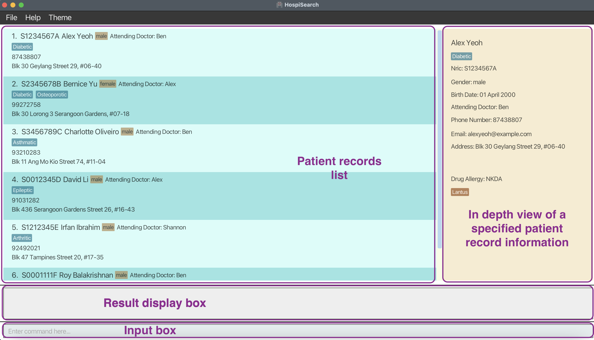

--------------------------------------------------------------------------------------------------------------------

## Command Prefixes

| Patient Record Field | Prefix |
|----------------------|--------|
| NRIC                 | i/     |
| Date Of Birth        | dob/   | 
| Name                 | n/     |  
| Phone                | p/     |  
| Gender               | g/     |  
| Doctor               | ad/    |  
| Email                | e/     |  
| Address              | a/     | 
| Tag                  | t/     |
| Drug Allergy         | d/     |
| Medicine             | m/     |
| Backup description   | b/     |

[return to table of contents](#table-of-contents)

## Features

### Notes:

- Input words in `UPPER_CASE` are the parameters to be supplied by the user. e.g. in `add n/NAME`, `NAME` is a parameter which can be used as `add n/John Doe`.

- Commands in square brackets are optional. e.g. `n/NAME [t/TAG]` can be used as `n/John Doe t/friend` or as `n/John Doe`.

- Commands separated by `|` within `()` suggest that only one of the commands must be present to be valid.

- Items with `…` after them can be used multiple times, including zero. e.g., [t/TAG] …​ can be used
  (i.e. 0 or more times), t/friend t/family etc.

- Parameters can be in any order. e.g. if the command specifies `n/NAME p/PHONE_NUMBER`, `p/PHONE_NUMBER n/NAME` is also acceptable.

- Extraneous parameters for commands that do not take in parameters (such as `help`, `list`, `exit` and `clear`) will be ignored. e.g., if the command specifies `help 123`, it will be interpreted as `help`.

:information_source: **Note:** All commands from this point onwards are to be
executed in lower case. E.g., `find` is valid, but `FIND` or `FinD` is considered as invalid. Keywords following commands do
not need to be in lower case.

### Viewing help : `help`

Lists out all the commands available, along with a brief description.

Format: `help`

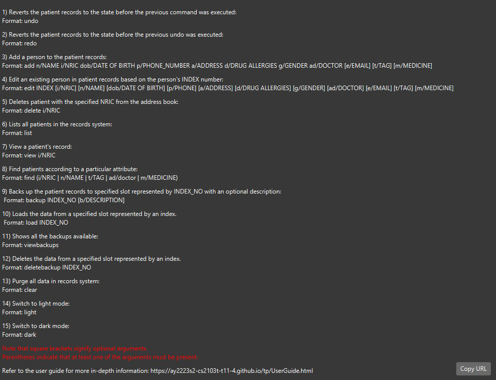

Above is the view of help window after the input `help`.

### Undoing previous command: `undo`

Reverts the patient records to the state before the previous command was executed.

Format: `undo`

:information_source: **Note:** The initial starting state will be upon
launch of HospiSearch application. Undo can be executed up to the initial starting state.

For example, after deleting a patient, `undo` will make the patient appear in the records again.

### Redoing previous undo: `redo`

Reverts the patient records to the state before the previous undo was executed.

:information_source:**Note:** Redo can only be executed if undo command
has been executed.

Format: `redo`

Following the above example for `undo`, `redo` would subsequently delete the patient again.

### Adding a patient record: `add`

Adds a person to the patient records.

Format: `add i/NRIC n/NAME dob/DATE OF BIRTH p/PHONE a/ADDRESS d/DRUGALLERGIES g/GENDER ad/DOCTOR [e/EMAIL] [t/TAG]…​ [m/MEDICINE]…​`

:information_source: **Note:** Do take note which patient details are
optional.

💡**Tip**:
 The drug allergies field is required however if the patient you are registering does not have any drug allergies, type in NKDA(No Known Drug Allergies)
 A patient can have any number of tags and medicine (including 0).
 A patient can leave out the email prefix should they not want to share it.

Examples:

* `add i/T0012345A n/John Doe dob/20/12/2000 p/98765432 a/John street, block 123, #01-01 d/NKDA g/Male ad/Alex t/Diabetic m/Lantus`
* `add i/T0012345B n/Betsy Crowe dob/18/12/1998 p/1234567 a/Newgate Prison d/Panadol g/Female ad/Shannon e/betsycrowe@example.com t/Dyslexic`

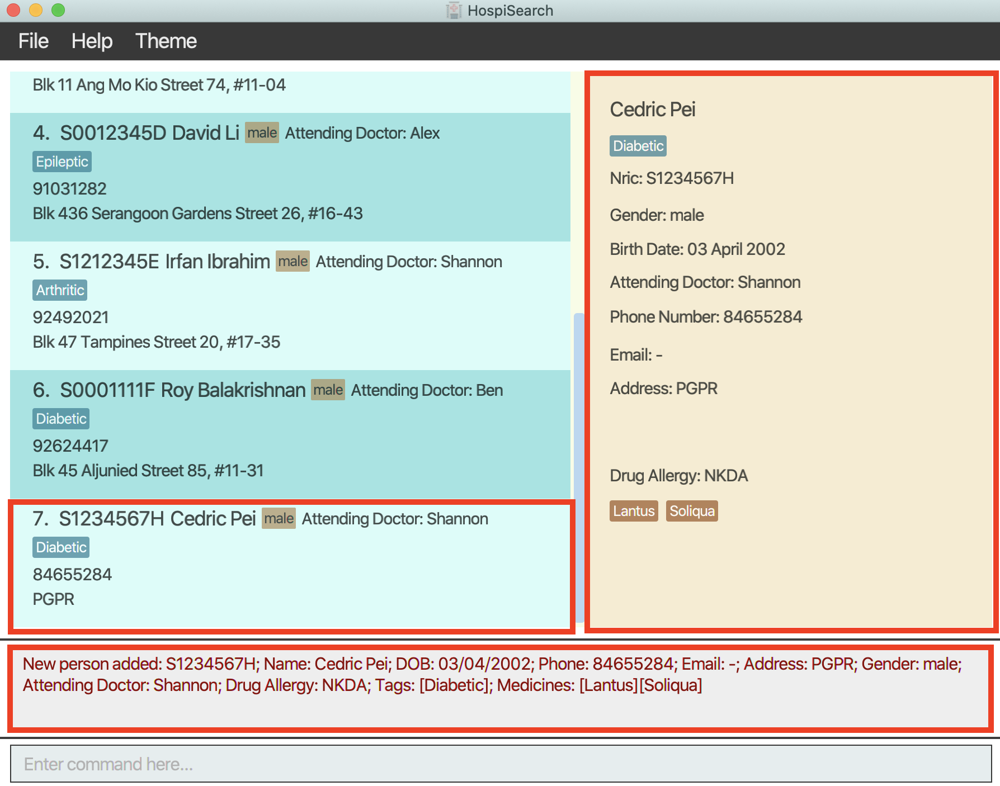

Above is the execution result of the input `add i/S1234567H n/Cedric Pei dob/03/04/2002 p/84655284 a/PGPR g/Male d/NKDA ad/Shannon t/Diabetic m/Lantus m/Soliqua`.

### Editing a patient record: `edit`

Edits an existing patient in the patient records.

Format: `edit INDEX [i/NRIC] [n/NAME] [dob/DATE OF BIRTH] [p/PHONE] [e/EMAIL] [a/ADDRESS] [d/DRUGALLERGIES] [g/GENDER] [ad/DOCTOR] [t/TAG]…​ [m/MEDICINE]…​`

:information_source: **Note:** Only include the prefixes for the specific
patient detail you would like to edit.

💡**Tip**:
 You can remove all the patient’s tags/medicine by typing t/ or m/ respectively, without specifying any tags/medicine after it.

Examples:

* `edit 1 p/91234567 e/johndoe@example.com` edit the phone number and email address of the patient at index 1 to be 91234567 and johndoe@example.com respectively.

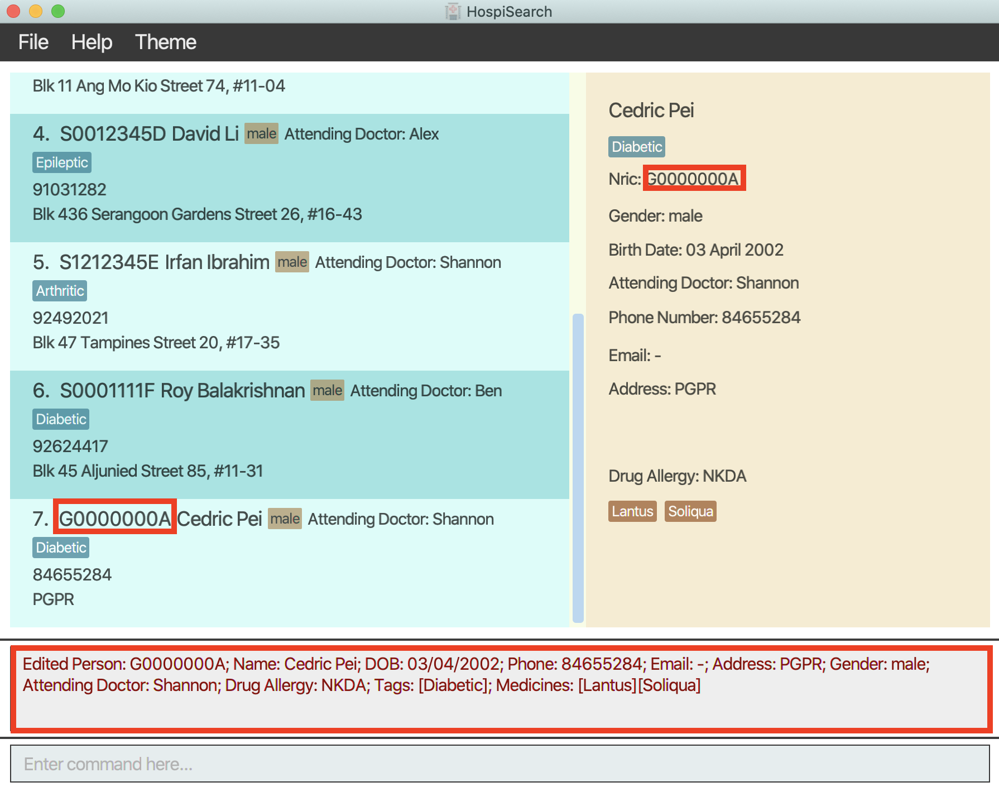

Above is the execution result of the input `edit 7 i/G0000000A`.

### Viewing a patient detailed particulars: `view`

Views a patient detailed particulars.

Format : `view i/NRIC`

:information_source: **Note:** For other commands, the view pane will show the particulars of the first patient in our system by default.
But after ADD or EDIT command, the view pane will show the corresponding patient's particulars.

Examples:
* `view i/G0000000A` shows detailed information about the patient on the view pane.

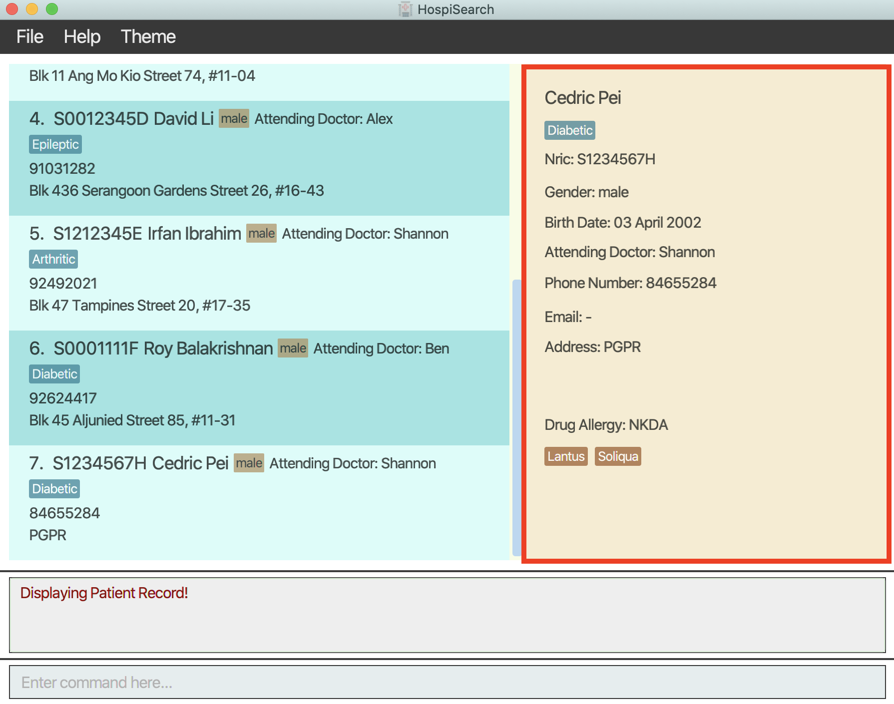

Above is the execution result of the input `view i/S1234567H`.

### Deleting a patient record: `delete`

Deletes the specified patient from the patient records.

Format: `delete i/NRIC…​`

:information_source: **Note:** If multiple deletes are made in a single
command, `undo` command will not undo all deletes made, but only **one** at a time.

Examples:

* `delete i/S1234567A` deletes the patient with NRIC S1234567A from patient records system.

### Listing all patients: `list`

Shows a list of all patients in the patient records.

Format: `list`

:information_source: **Note:** List returns the entire current database
that you have loaded.

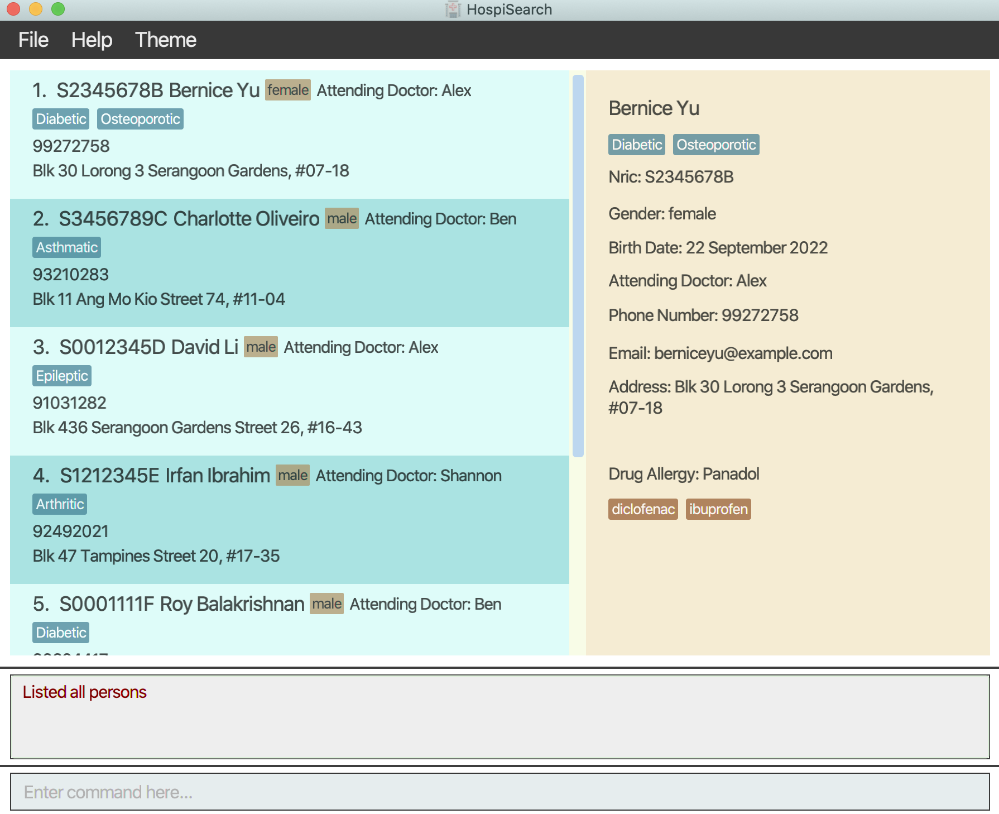

Above is the execution result of the input `list`.

### Filtering patients by attribute: `find`

Find patients according to a particular command prefix stated followed by the change.

Command Prefixes that can be searched:

* name(`n/`)
* nric(`i/`)
* tag(`t/`)
* doctor(`ad/`)
* medicine(`m/`)

Format: `find (n/NAME | i/NRIC | t/TAG | ad/DOCTOR | m/MEDICINE ) [MORE_KEYWORDS]`

:information_source:
**Note:** `find` searches by **complete strings** and not **substrings**. The search will only be carried out for
**one** given attribute.

:information_source:
**Note:** The search is **case-insensitive**. The order of the keywords does not matter.

Examples (The following results are based of the sample data provided):

* `find n/john` returns `John Lim` and `John Doe` who both contain the name `John` in their names.
* `find n/yu bernice` returns `Bernice Yu` as the order of keywords does not matter
* `find i/S0078957G` returns `Alice Tan` who has an NRIC of `S0078957G`.
* `find t/Diabetic Osteoporotic` returns all persons with the tag `Diabetic` or `Osteoporotic` or both.
* `find ad/Shannon` returns all persons with attending doctor `Shannon`.

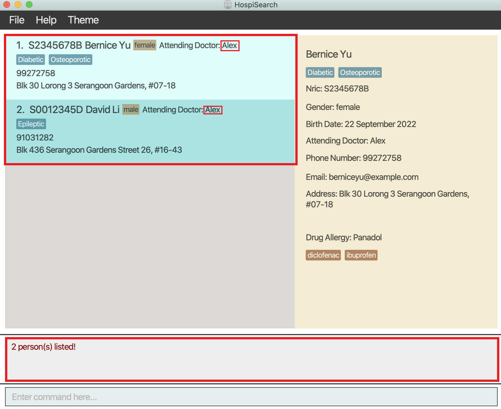

Above is the execution result of the input `find ad/Alex`.

### Backing up patient records: `backup`

Backs up the patient records to a specified slot represented by an index. Can add a description to the backup.

Format: `backup INDEX_NO [b/DESCRIPTION]`

💡**Tip**:
 Backing up without a description will leave the description field empty.

Format: `backup INDEX_NO [b/DESCRIPTION]`

Examples:

* `backup 3 b/Test` backups the data to the 3rd slot with description 'Test'.

:information_source: **Note:**: INDEX_NO can only be an integer between 1 and 10

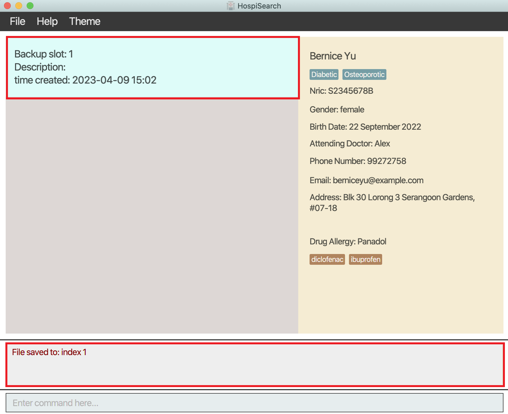

Above is the execution result of the input `backup 1`.

### Loading data: `load`

Loads the data from a specified slot represented by an index.

:information_source: **Note:** Allows access to a specific backup.

Format: `load INDEX_NO`

Example:

* `load 3` loads the data from the 3rd slot.

Above is the execution result of the input `load 1`.

### Viewing backup data: `viewbackups`

Shows all the backups available.

Format: `viewbackups`

💡**Tip**:
 You can exit the backups page by typing the command `list`.

Above is the execution result of the input `viewbackups`.

### Deleting backup data: `deletebackup`

Deletes the data from a specified slot represented by an index.

:information_source: **Note:** Deleted backups cannot be retrieved after
deletion.

Format: `deletebackup INDEX_NO`

Example:

* `deletebackup 3` deletes the data from the 3rd slot.

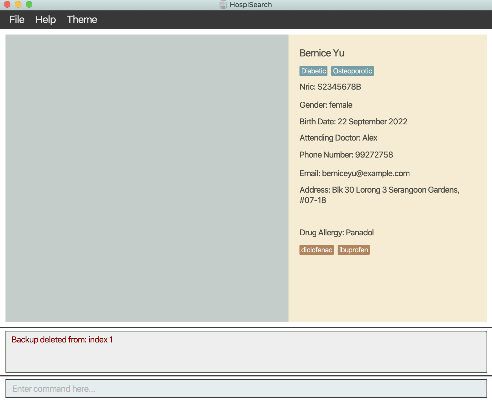

Above is the execution result of the input `deletebackup 1`.

### Clearing all data: `clear`

Purges all data from the database.

:information_source: **Note:** Data cannot be retrieved after clearing.
Use this command with caution.

Format: `clear`

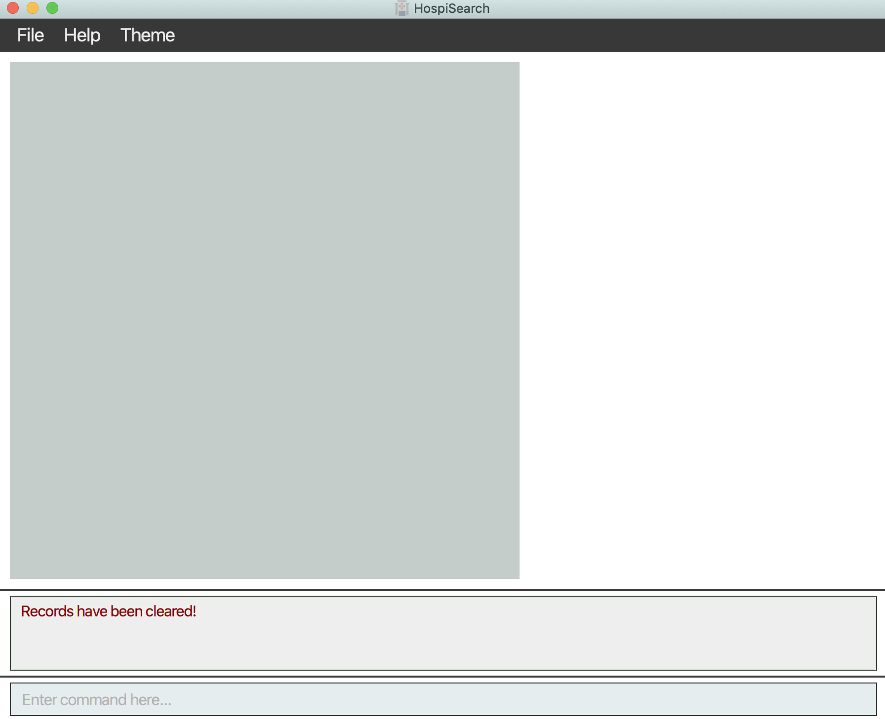

Above is the execution result of the input `clear`.

### Switching to light mode: `light`

Switches the GUI to light mode.

Format: `light`

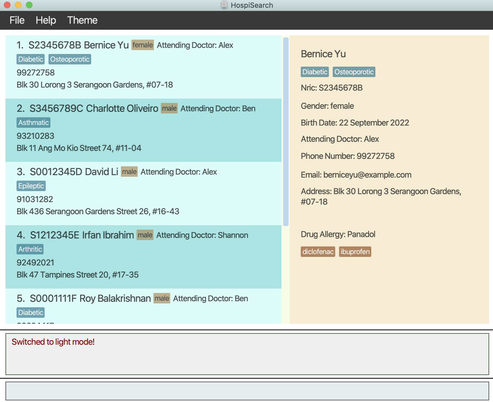

Above is the execution result of the input `light`.

### Switching to dark mode: `dark`

Switches the GUI to dark mode.

Format: `dark`

💡**Tip**:
 The default GUI is light mode. Use these commands and see which is your preferred GUI!

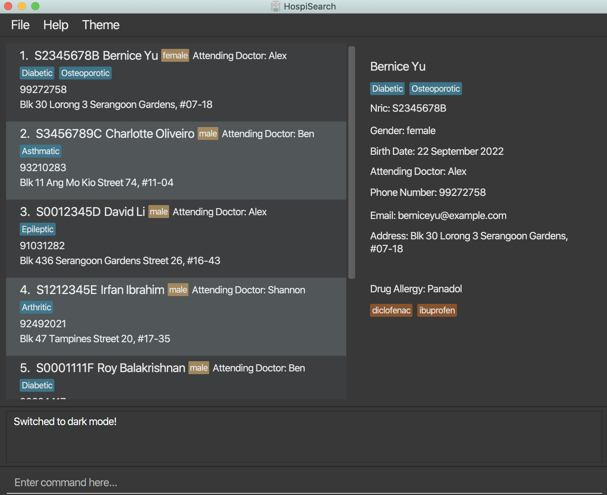

Above is the execution result of the input `dark`.

--------------------------------------------------------------------------------------------------------------------
[return to table of contents](#table-of-contents)

## FAQ

**Q**: How do I transfer my data to another Computer?  
**A**: Install the app on the other computer and overwrite all files in the `data` directory it creates with the files from your previous HospiSearch `data` directory.

**Q**: Where is my HospiSearch `data` directory?  
**A**: The `data` directory is created in the same folder your HospiSearch Jar file is opened in.

--------------------------------------------------------------------------------------------------------------------
[return to table of contents](#table-of-contents)

## Command summary

| Action             | Format, Examples                                                                                                                                                                                                                |
|--------------------|---------------------------------------------------------------------------------------------------------------------------------------------------------------------------------------------------------------------------------|  
| **Help**           | `help`                                                                                                                                                                                                                          |  
| **Undo**           | `undo`                                                                                                                                                                                                                          |  
| **Redo**           | `redo`                                                                                                                                                                                                                          |  
| **Add**            | `add i/NRIC n/NAME dob/DATE OF BIRTH p/PHONE a/ADDRESS d/DRUGALLERGIES g/GENDER ad/DOCTOR [e/EMAIL] [t/TAG]…​ [m/MEDICINE]…​`   e.g. add i/T0012345A n/John Doe dob/20/12/2000 p/98765432 a/John street, block 123, #01-01 d/NKDA g/Male ad/Alex t/Diabetic m/Lantus | 
| **Edit**           | `edit INDEX [i/NRIC] [n/NAME] [dob/DATE OF BIRTH] [p/PHONE] [e/EMAIL] [a/ADDRESS] [d/DRUGALLERGIES] [g/GENDER] [ad/DOCTOR] [t/TAG]…​ [m/MEDICINE]…​`   e.g. edit 1 p/91234567 e/johndoe@example.com                         |  
| **Delete**         | `delete i/NRIC…​`   e.g. delete i/T0012345A                                                                                                                                                                                 |  
| **List**           | `list`                                                                                                                                                                                                                          |  
| **Find**           | `find attribute/KEYWORD [MORE_KEYWORDS]`   e.g. find a/Alex    e.g. find t/diabetic                                                                                                                                     |  
| **Backup**         | `backup INDEX_NO`   e.g. backup 3                                                                                                                                                                                           |  
| **Load**           | `load INDEX_NO`   e.g. load 3                                                                                                                                                                                               |  
| **View backups**   | `viewbackups`                                                                                                                                                                                                                   |  
| **Delete backups** | `deletebackup INDEX_NO`   e.g. deletebackup 3                                                                                                                                                                               |  
| **Clear all**      | `clear`                                                                                                                                                                                                                         |  
| **Light**          | `light`                                                                                                                                                                                                                         |  
| **Dark**           | `dark`                                                                                                                                                                                                                          |

[return to table of contents](#table-of-contents)
