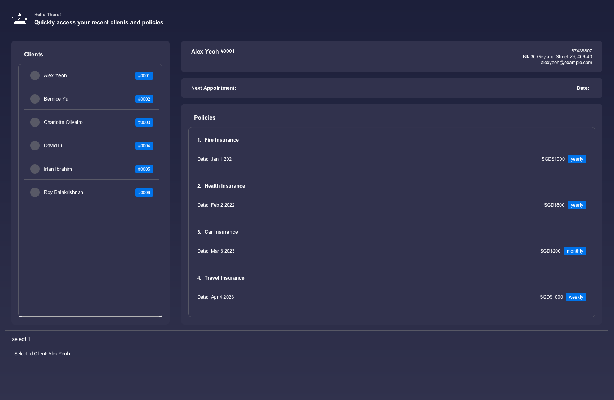
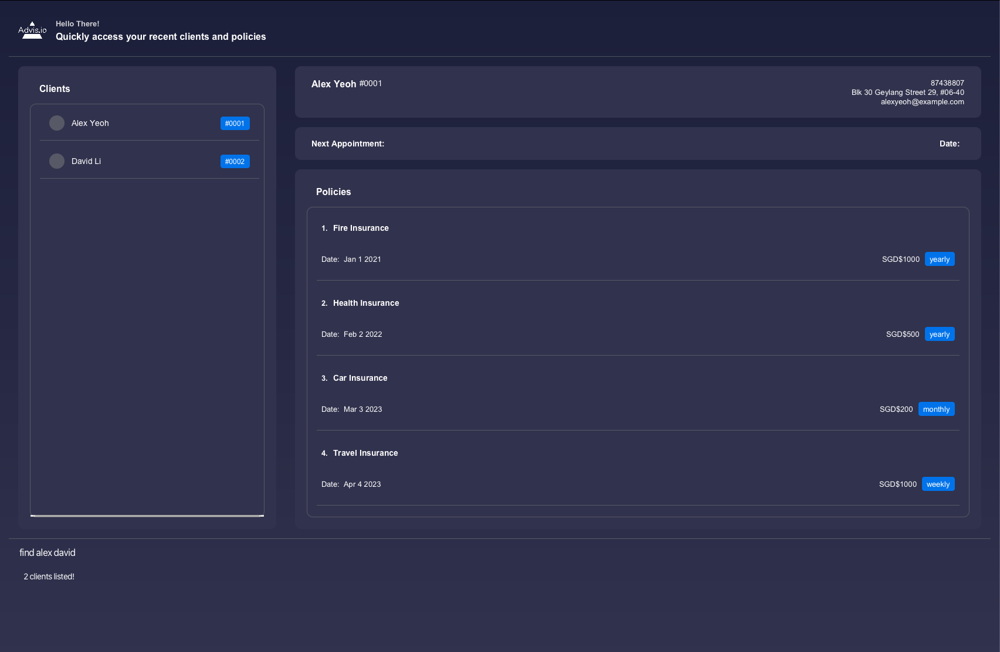
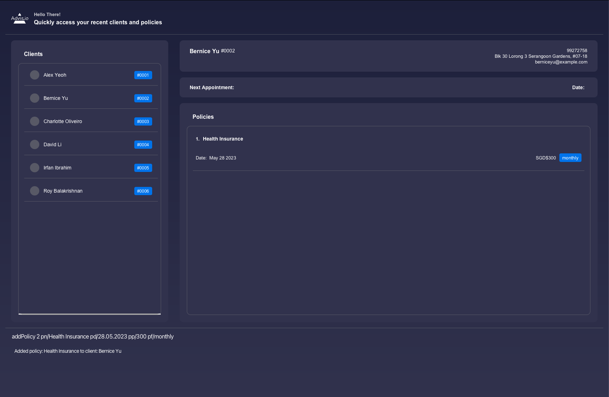

## What is Advis.io?

As a financial advisor, you know that managing your clients and their policies can be time-consuming and overwhelming. But what if there was a solution that made it easier for you to keep track of your clients' needs and provide the best possible service?

That's where Advis.io (AIO) comes in. AIO is an all-in-one solution designed to help you manage your clients more efficiently and effectively than ever before. With AIO, you'll be able to keep track of your clients' policies and appointment dates, giving you more time to focus on what you do best - providing expert financial advice.

Whether you're a seasoned financial advisor or just starting out, AIO is the tool you need to stay organized, increase productivity, and take your business to the next level. With an intuitive command line interface and a user-friendly graphical interface, AIO is the perfect solution for anyone looking to streamline their workflow and build a larger, more satisfied client base.

So why wait? Try AIO today and see how it can transform your business! :credit_card:

---
**Advis.io**<br>
By students, for advisors

---

## Table of Contents

* [**How to Get Started**](#how-to-get-started)
    * [**Features**](#features)
        * [**General Management**](#general-management)
            * Viewing help : `help`
            * Undo previous operation : `undo`
            * Redo previous operation : `redo`
            * Clear all entries : `clear`
            * Exiting the program : `exit`
            * Saving the data
            * Editing the data file
        * [**Client Management**](#client-management)
            * Adding a client: `add`
            * Selecting a client: `select`
            * Listing all clients : `list`
            * Editing a client : `edit`
            * Filtering clients by name: `find`
            * Deleting a client : `delete`
            * Sorting Clients by Email address : `sortClientEmail`
            * Sorting Clients by Name : `sortClientName`
            * Sorting Clients by Phone Number : `sortClientPhone`
        * [**Policy Management**](#policy-management)
            * Adding a policy: `addPolicy`
            * Editing a policy : `editPolicy`
            * Deleting a policy : `deletePolicy`
        * [**Appointment Management**](#appointment-management)
            * Adding an appointment: `addApt`
            * Deleting an appointment: `deleteApt`
* [**FAQ**](#faq)
* [**Command Summary**](#command-summary)

---
## How to Get Started

#### 1. Ensure you have Java `11` or above installed in your Computer.
* To check if you have Java `11` installed, follow these steps
* `java -version` <br>
* You should have the following output:


#### 2. Download the latest `advisio.jar` from [here](https://github.com/AY2223S2-CS2103T-T09-4/tp/releases).

#### 3. Copy the file to the folder you want to use as the _home folder_ for Advisio.

#### 4. Open a command terminal, `cd` into the folder you put the jar file in, and use the command to run the application. <br>
* To open up the command terminal, follow these steps
* **Mac**: `Cmd + space` to open up spotlight, now search terminal and press `Enter`.
* **Windows**: `Windows + R` top open 'Run' box. Type `cmd` and then click 'ok'.

```
java -jar advisio.jar
```

A GUI similar to the below should appear in a few seconds. Note how the app contains some sample data.<br>


#### 5. Type the command in the command box and press Enter to execute it. e.g. typing `help` and pressing Enter will open the help window.<br>

Some example commands you can try:

* `list` : Lists all contacts.

* `add n/John Doe p/98765432 e/johnd@example.com a/John street, block 123, #01-01` : Adds a client named `John Doe`
  to Advisio clientele.

* `delete 3` : Deletes the 3rd contact shown in the current list.

* `undo` : Undo the previous command `delete 3`. Thus original 3rd client shown in list will come back

* `redo` : Redo the previous command `delete 3`. Thus 3rd client will be deleted again from list

* `clear` : Deletes all clients.

* `exit` : Exits the app.
* `select 1` : Selects the client indexed as `#0001`.
* `addPolicy 1 pn/Fire Insurance pd/01.01.2023 pp/1000 pf/monthly` : Adds a policy named `Fire Insurance` into the
  client indexed as `#0001`.
* `addApt 1 an/Discussion ad/05.07.2023` : Adds an appointment called Discussion on 5 July 2023.

#### 6. Refer to the [Features](#features) below for details of each command.

--------------------------------------------------------------------------------------------------------------------

## Features

<div markdown="block" class="alert alert-info">

**Some notes about the command format**<br>

* Words in the grey box are commands or parameters that the user are able to type into the application.

* Words in `UPPER_CASE` are the parameters to be supplied by the user.<br>
  e.g. in `add n/NAME`, `NAME` is a parameter which can be used as `add n/John Doe`.

* Items in square brackets are optional.<br>
  e.g. `edit INDEX n/[NAME] p/[PHONE]` can be used as `edit 1 n/John Doe p/1234578` or as `edit 1 n/John Doe`.

* Items with `…`​ after them can be used multiple times including zero times.<br>
  e.g. `find KEYWORD [KEYWORD]...` can be used as `find alice`, `find alice ben` etc.

* Parameters can be in any order.<br>
  e.g. if the command specifies `n/NAME p/PHONE_NUMBER`, `p/PHONE_NUMBER n/NAME` is also acceptable.

* If a parameter is expected only once in the command but you specified it multiple times, only the last occurrence of
  the parameter will be taken.<br>
  e.g. if you specify `p/12341234 p/56785678`, only `p/56785678` will be taken.

* Extraneous parameters for commands that do not take in parameters (such as `help`, `list`, `exit` and `clear`) will be
  ignored.<br>
  e.g. if the command specifies `help 123`, it will be interpreted as `help`.

</div>

<br>
<br>
<br>
<br>

---


## General Management

### Viewing help : `help`

Shows a message explaining how to access the help page.


Format: `help`

### Undo previous command : `undo`

Undo one previous command and restore that version of clientele

Format: `undo`

* Restore the specific clientele before the command took place
* `Undo success` will be shown in the display
* If current clientele is **already the newest**, `There is no more operations to undo!` will be shown in display to
  remind of undo failure

#### **Special Note for undo and redo**

Undo/Redo Command will only work if previous command **modifies the data of Clients or Policies**.

Thus following commands can't be called to Undo/Redo

* `Exit`
* `Help`
* `List`
* `Select`
* `Find`

### Redo previous command : `redo`

Redo one previous command and restore that version of clientele.

Format: `redo`

* Restore the specific clientele before the undo command took place
* `Redo success` will be shown in the display
* If current clientele is **already the latest**, `There is no more operations to redo!` will be shown in display to
  remind of redo failure

### Clearing all entries : `clear`

Clears all entries from the clientele.

Format: `clear`

### Exiting the program : `exit`

Exits the program.

Format: `exit`

### Saving the data

clientele data are saved in the hard disk automatically after any command that changes the data. There is no need to
save manually.

### Editing the data file

clientele data are saved as a JSON file `[JAR file location]/data/addressbook.json`. Advanced users are welcome to
update data directly by editing that data file.

<div markdown="span" class="alert alert-warning">:exclamation: <b>Caution:</b>
If your changes to the data file makes its format invalid, AddressBook will discard all data and start with an empty data file at the next run.
</div>

### Archiving data files `[coming in v2.0]`

_Details coming soon ..._

<br>
<br>
<br>
<br>

---

## Client Management

### Adding a client: `add`

To add a client to your list of client profiles.

Format: `add n/NAME p/PHONE_NUMBER e/EMAIL a/ADDRESS`

Examples:

- `add n/John Doe p/98765432 e/johnd@example.com a/John street, block 123, #01-01`
- `add n/Betsy Crowe t/friend e/betsycrowe@example.com a/Newgate Prison p/1234567`

<div markdown="span" class="alert alert-warning">:book:
<b>Note:</b>
To add a policy to the client, please refer to <a href="#policy-management">Policy Management</a>
</div>

### Selecting a client: `select`

To select a particular client from your clientele to display on your client dashboard, as well as their corresponding policies on your policy dashboard.

Format: `select INDEX`

Examples:

- `select 1` returns client with index 1 (`Alex Yeoh`), displaying his policies in the policy dashboard



### Listing all clients: `list`

To show a list of your client profiles.

Format: `list`

### Editing a client : `edit`

To edit an existing client from your list of client profiles.

Format: `edit INDEX [n/NAME] [p/PHONE] [e/EMAIL] [a/ADDRESS]`

* Edits the client at the specified `INDEX`. The index refers to the index number shown in the displayed client
  list. The index **must be a positive integer** 1, 2, 3, …​
* At least one of the optional fields must be provided.
* Existing values will be updated to the input values.

Examples:

- `edit 1 p/91234567 e/johndoe@example.com` Edits the phone number and email address of the 1st client to be 91234567
  and johndoe@example.com respectively.

<div markdown="span" class="alert alert-warning">:exclamation: <b>Note:</b>
If you accidentally edited a client's information, you can use the <code>undo</code>  command to retrieve the previous information.
</div>

<div markdown="span" class="alert alert-warning">:book:
<b>Note:</b>
To edit a policy, please refer to <a href="#policy-management">Policy Management</a>
</div>


### Filtering clients by name: `find`

To find one of your client whose name contains any of the given keywords.

Format: `find KEYWORD \[MORE_KEYWORDS\]`

* The search is case-insensitive. e.g `hans` will match `Hans`
* The order of the keywords does not matter. e.g. `Hans Bo` will match `Bo Hans`
* Only the name is searched.
* Only full words will be matched e.g. `Han` will not match `Hans`
* Clients matching at least one keyword will be returned (i.e. `OR` search).
  e.g. `Hans Bo` will return `Hans Gruber`, `Bo Yang`

Examples:

- `find John` returns `john` and `John Doe`

- `find alex david` returns `Alex Yeoh, David Li`



<div markdown="span" class="alert alert-warning">:exclamation: <b>WARNING:</b>
`find` gives you a temporary view of the filtered client list. Calling `clear` after `find` will clear the entire client list <b>NOT</b> the filtered client list. You can use `undo` if you accidentally cleared the entire client list.
</div>

### Deleting a client : `delete`

To delete one of your specified client from your clientele.

Format: `delete INDEX`

* Deletes the client at the specified `INDEX`.
* The index refers to the index number shown in the displayed client list.
* The index **must be a positive integer** 1, 2, 3, …​

Examples:

* `list` followed by `delete 2` deletes the 2nd client in the list of clients list.
* `find Betsy` followed by `delete 1` deletes the 1st client in the results of the `find` command.

<div markdown="span" class="alert alert-warning">:exclamation: <b>Note:</b>
If you accidentally delete a client, you can use the <code>undo</code>  command to retrieve the deleted client.
</div>
<div markdown="span" class="alert alert-warning">:book:
<b>Note:</b>
To delete a policy, please refer to <a href="#policy-management">Policy Management</a>
</div>

### Sorting clients by their email : `sortClientEmail`

Format: `sortClientEmail INDEX`

* Sorts your list of clients based on their email
* The index refers to whether sorting will be done in ascending order or descending order
* The index can be any number

Examples:

* `sortClientEmail 1` sorts the client list based on client's email address in **ascending** order
* `sortClientEmail 0` sorts the client list based on client's email address in **descending** order

### Sorting clients by their name : `sortClientName`

Format: `sortClientName INDEX`

* Sorts your list of clients based on their name
* The index refers to whether sorting will be done in ascending order or descending order
* The index can be any number

Examples:

* `sortClientName 1` sorts the client list based on client's name in **ascending** order
* `sortClientName 0` sorts the client list based on client's name in **descending** order

### Sorting clients by their phone : `sortClientPhone`

Format: `sortClientPhone INDEX`

* Sorts your list of clients based on their phone number
* The index refers to whether sorting will be done in ascending order or descending order
* The index can be any number

Examples:

* `sortClientPhone 1` sorts the client list based on client's phone number in **ascending** order
* `sortClientPhone 0` sorts the client list based on client's phone number in **descending** order

<br>
<br>
<br>
<br>

---

## Policy Management

While you can manage your clients, we also provide a way to manage the client's policies.

Policy refers to the insurance plan/contract that the client has purchased from you.

The policy contains the following fields:

- Policy Name
- Policy Start Date
- Policy Premium (The amount of money the client pays you for the policy)
- Policy Frequency (The frequency of the premium payment)

Using Advis.io, you can add, edit, delete, and view the policies for your clients very easily! Here's how.

### Adding a policy : `addPolicy`

To add a policy to one of your specified client.

Format: `addPolicy INDEX pn/POLICY_NAME pd/START_DATE pp/PREMIUM pf/FREQUENCY`

* Do note that the Policy Name should be from the following list:
    - Health Insurance
    - Life Insurance
    - Medical Insurance
    - Fire Insurance
    - Car Insurance
    - Travel Insurance

* The Policy Start Date should be in the following format: `dd.mm.yyyy`

* The Policy Premium should be a positive integer.

* The Policy Frequency should be one of the following: `weekly`, `monthly`,`yearly`

Examples: `addPolicy 1 pn/Health Insurance pd/28.05.2023 pp/300 pf/monthly`

You will then be able to view the policies on the right side under 'Policies'



### Editing a policy : `editPolicy`

To edit one of your specified policy from one of your client in your clientele.

Format: `editPolicy INDEX pi/POLICY_INDEX [pn/POLICY_NAME] [pd/START_DATE] [pp/PREMIUM] [pf/FREQUENCY`]

* Edits the client at the specified `INDEX`. The index refers to the index number shown in the displayed client
  list. The index **must be a positive integer** 1, 2, 3, …​
* The `POLICY_INDEX` refers to the index number shown in the displayed policy list. The same constraints as `INDEX`
  apply.
* At least one of the optional fields must be provided.
* Existing values will be updated to the input values.

Examples:

- `editpolicy 1 pi/1 pn/Fire Insurance` edits the 1st client's 1st policy's name to `Fire Insurance`
- `editpolicy 1 pi/2 pn/Car Insurance pd/28.05.2023 pp/300 pf/yearly` edits the 1st client's 2nd
  policy information`

<div markdown="span" class="alert alert-warning">:exclamation: <b>Note:</b>
If you accidentally edit a policy, you can use the <code>undo</code>  command to retrieve the previous policy's information.
</div>

### Deleting a policy `deletePolicy`

To delete one of your specified policy from one of your clientale.

Format: `deletePolicy INDEX pi/POLICY_INDEX`

Examples: `deletePolicy 1 pi/2` deletes the 1st client's 2nd policy in the list

<div markdown="span" class="alert alert-warning">:exclamation: <b>Note:</b>
If you accidentally delete a policy, you can use the <code>undo</code>  command to retrieve the deleted policy.
</div>

<br>
<br>
<br>
<br>

---

## Appointment Management

While you can manage your clients, we also provide a way to manage client appointments.

Appointment refers to the meeting that the client or the financial advisor scheduled to discuss their goals on a
scheduled date.

The appointment contains the following fields:

* Appointment Name
* Appointment Meetup Date

Using Advis.io, you can add, delete and view the appointments for your clients very easily! Here's how.

### Adding an appointment: `addApt`

To add an appointment to one your specified client.

Format: `addApt INDEX an/APPOINTMENT_NAME ad/MEETUP_DATE`

* The Meetup Date should be in the following format: `dd.mm.yyyy`.
* The Meetup Date should be after the present date.

Examples: `addApt 1 an/Review on goals ad/05.06.2023`

You will then be able to view the appointments under

### Deleting an appointment: `deleteApt`

To delete one of the appointment from a specific client.

Format: `deleteApt INDEX`

* Deletes the appointment from the client at the specified `INDEX`
* The index refers to the index number shown in the displayed client list
* The index **must be a positive integer** 1,2,3,...

Examples: `deleteApt 1`

* `list` followed by `deleteApt 1` deletes the appointment from the 1st client in the list of clients list.

<br>
<br>
<br>
<br>

--------------------------------------------------------------------------------------------------------------------

## FAQ

**Q**: My computer doesn't have Java 11 installed, what should I do?<br>
**A**: You can install Java 11
from [Oracle](https://docs.oracle.com/en/java/javase/11/install/overview-jdk-installation.html). All you have to do now
is find your operating systems and follow the steps given! Alternatively, you can also install Java 11
from [OpenJDK](https://openjdk.org).

**Q**: How do I transfer my data to another Computer?<br>
**A**: Install the app in the other computer and overwrite the empty data file it creates with the file that contains
the data of your previous clientele home folder.

**Q**: Do I need an internet connection use Advisio?<br>
**A**: Advisio is a local application that does not require an internet connection! Feel free to use our application
anywhere and anytime as you see fit!

**Q**: Is my data stored on the cloud? How can I ensure that I do not lose such critical information?<br>
**A**:Unfortunately, Advisio does not support cloud support. However, you can follow these steps to store your data
safely in existing cloud services such as Icloud or Google Drive. Firstly, locate the data
file `<JAR file location>/data/clientbook.json`. Secondly, copy the file into your preferred cloud service.

**Q**: I would like to add a new policy, however the application doesn't allow me to add a policy other than those that
are supported by the application. What should I do?<br>
**A**: We restricted the policies to a limited few for the convenience of Financial Advisors so that they wouldn't find
themselves in a situation where they can't remember the policy that was added. The engineering team for your company
should be able to add a new general policy if it's required.

**Q**: Is there a limit to the number of clients or policies that I can add?<br>
**A**: There is approximately a 2 million limit for both clients and policies separately. We have analysed and
interviewed veteran Financial Advisors and have concluded that it is very unlikely for a Financial Advisor to to exceed
those thresholds. However, the limit can be expanded in the future if necessary.

--------------------------------------------------------------------------------------------------------------------

## Command summary

| Action                    | Format, Examples                                                                                                                                                      |
|---------------------------|-----------------------------------------------------------------------------------------------------------------------------------------------------------------------|
| **Add**                   | `add n/NAME p/PHONE_NUMBER e/EMAIL a/ADDRESS [t/TAG]…​` <br> e.g., `add n/James Ho p/22224444 e/jamesho@example.com a/123, Clementi Rd, 1234665 t/friend t/colleague` |
| **Select**                | `select INDEX` <br> e.g., `select 3`                                                                                                                                  |
| **Clear**                 | `clear`                                                                                                                                                               |
| **Delete**                | `delete INDEX`<br> e.g., `delete 3`                                                                                                                                   |
| **Edit**                  | `edit INDEX [n/NAME] [p/PHONE_NUMBER] [e/EMAIL] [a/ADDRESS] [t/TAG]…​`<br> e.g.,`edit 2 n/James Lee e/jameslee@example.com`                                           |
| **Find**                  | `find KEYWORD [MORE_KEYWORDS]`<br> e.g., `find James Jake`                                                                                                            |
| **List**                  | `list`                                                                                                                                                                |
| **Undo**                  | `undo`                                                                                                                                                                |
| **Redo**                  | `redo`                                                                                                                                                                |
| **Help**                  | `help`                                                                                                                                                                |
| **Add a Policy**          | `addPolicy INDEX pn/POLICY-NAME pd/START-DATE pp/PREMIUM pf/FREQUENCY` <br> e.g., `addPolicy INDEX pn/Health Insurance pd/28.05.2023 pp/300 pf/monthly`               |
| **Delete a Policy**       | `deletePolicy n/NAME INDEX` <br> e.g., `deletePolicy n/John Doe 1`                                                                                                    |
| **Edit a Policy**         | `editPolicy INDEX pi/POLICY INDEX[pn/POLICY NAME] [pd/START DATE] [pp/PREMIUM] [pf/FREQUENCY]` <br> e.g., `editPolicy 1 pn/Travel Insurance pp/2000`                  |
| **Add an appointment**    | `addApt INDEX an/APPOINTMENT_NAME ad/APPOINTMENT_MEETUP_DATE` <br> eg., `addApt 1 an/Review of goals ad/01.01.2024`                                                   |
| **Delete an appointment** | `deleteApt INDEX`<br> eg., `deleteApt 1`                                                                                                                              |
| **Sort Client by Email**  | `sortClientEmail INDEX(Any Integer)`<br> e.g.,`sortClientEmail 1`                                                                                                     |
| **Sort Client by Name**   | `sortClientName INDEX(Any Integer)`<br> e.g.,`sortClientName 1`                                                                                                       |
| **Sort Client by Phone**  | `sortClientPhone INDEX(Any Integer)`<br> e.g.,`sortClientPhone 1`                                                                                                     |
