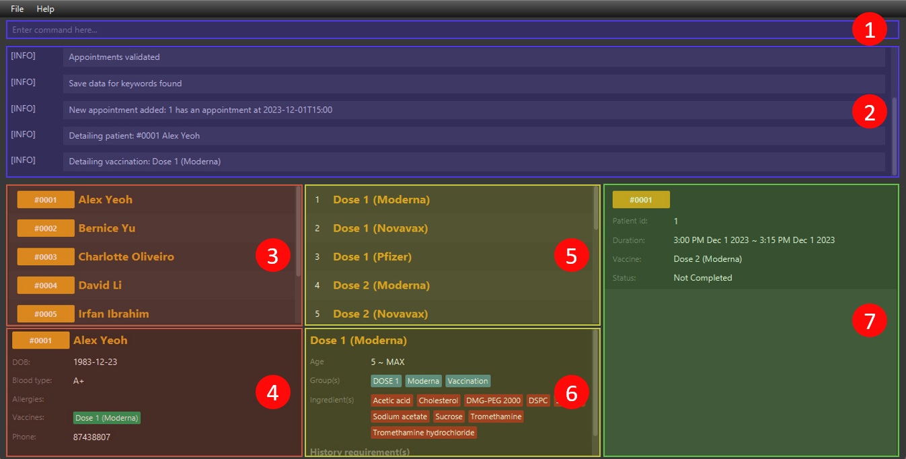

An increasing number of vaccinations now have more complicated prerequisites to take them, and Vaccination Management System (VMS) aims to make this validation easier. VMS is a **desktop application for validating and keeping track of vaccination appointments**; its operations are **optimized for fast typists who prefer using a Command Line Interface (CLI)** while maintaining the benefits of a Graphical User Interface (GUI). If you type fast, VMS can efficiently validate your vaccination appointment!vaccination appointment validated with great efficiency!

* Table of Contents
{:toc}

--------------------------------------------------------------------------------------------------------------------

## Start up

1. Ensure that java `11` or above is properly installed on your device.
2. Download the latest [`VMS.jar`](https://github.com/AY2223S2-CS2103-F11-3/tp/releases).
3. Copy the file to an appropriate folder for VMS to execute in.
4. Open the command terminal, `cd` into the folder in step 3 and start VMS with `java -jar vms.jar` command. A GUI similar similar to what is shown below should appear in a few seconds.<br>
   

<div markdown="block" class="alert alert-info" id="start-up-warning-info">
:information_source: **Start up warning messages**

If this is your first time starting up the application, you might be greeted with a few warning messages. However, do not be alarmed as this is to protect your save data. They will only show if VMS is unable to find or load your save data for whatever reason.

Any successful command execution will save the current state of VMS and stop the warning messages from showing, assuming that the data files are not tempered with. You can try entering the `help` or `exit` commands to initialize the starting data files.

View the [data files section](#data-files) to learn more about these data files.
</div>

<div markdown="block" class="alert alert-danger" id="start-up-warning-warning">
:warning: **Potential loss of data**

If this is not your first time using VMS, do **<u>NOT</u>** attempt to execute any commands. Review the warning messages first ensuring that the warnings are expected due to intentional tempering with the data files (eg. deleting the entire data folder or one of the data files) before continuing.

**If any commands were to successfully be executed, <u>ALL</u> previous data in the data folder, if present, will be overwritten and lost forever.**
</div>

## GUI of VMS



| Number                                | Name                     | Detail                                       |
| ------------------------------------- | ------------------------ | -------------------------------------------- |
| <span class="circled-number">1</span> | Command input field      | Where commands are entered                   |
| <span class="circled-number">2</span> | Message panel            | Where messages are displayed                 |
| <span class="circled-number">3</span> | Patient list panel       | A list view of patients                      |
| <span class="circled-number">3</span> | Patient detail panel     | Panel where patients are shown in detail     |
| <span class="circled-number">5</span> | Vaccination list panel   | A list view of vaccinations                  |
| <span class="circled-number">6</span> | Vaccination detail panel | Panel where vaccinations are shown in detail |
| <span class="circled-number">7</span> | Appointment list panel   | A list view of appointments                  |

## Usage guide

##### Initializing

Before diving into VMS, first initialize the data of the vaccinations that your clinic supports.

* VMS is initialized with a few COVID-19 vaccinations by default. If your clinic do not offer these vaccinations, these data can be purged by running vaccination's [`clear`](#clear---clear-all-vaccination-data) command.
* See [`add`](#add---add-a-vaccination) on how you can add a vaccination.

##### Normal usage

After initializing the vaccination data of your clinic, you are ready to go! All you will have to do is follow these simple steps and VMS will ease your receptionist duties.

1. Wait for a patient to call in to book an appointment for a vaccination.
2. If they do not exist in the system yet, add them into the system using patient's [`add`](#add---add-a-patient) command.
3. Schedule an appointment for them by running appointment's ['add'](#add---add-an-appointment) command.
4. If the patient is eligible to take the vaccination that they want, the appointment will be added into VMS. Otherwise, an error message will show and you can inform them about their ineligibility to take the vaccination.
5. If you wish to retrieve a patient's contact number, maybe to remind them of their upcoming appointment, you can retrieve it by using patient's ['detail'](#detail---view-details-of-a-patient) command. The patient's ID number is conveniently displayed on the appointment card for easy reference.

##### Example scenario

Here is an scenario example usage using <u>VMS start up sample data</u> immediately after [start up](#start-up):

1. A patient calls, he provides information that his name is **Tan Xiao Ming**, born on **1999 April 15**, blood type **A+**, allergic to nothing and has already taken **Dose 1 (Moderna)**. From your clinic phone, the number is **97643158**. The following command will add this patient into the system:
```text
patient add --n Tan Xiao Ming --p 97643158 --d 1999-04-15 \
        --b A+ --v Dose 1 (Moderna)
```
<sub>:clipboard: <code>patient add --n Tan Xiao Ming --p 97643158 --d 1999-04-15 --b A+ --v Dose 1 (Moderna)</code></sub>
2. He mentions that he wishes to take **Dose 2 (Pfizer)** on **2024 March 5th at 1600**. You clinic's average vaccination appointment take roughly about 30mins. From step 2, it is shown that Xiao Ming has an ID of **7** as well. The following command will attempt to schedule an appointment for him:
```text
appointment add --p 7 --v Dose 2 (Pfizer) --s 2024-3-5 1600 --e 2024-3-5 1630
```
3. Uah! An error message shows saying that the he cannot take that vaccination. According to MOH, this is so as patient's first and second COVID-19 vaccination doses must be of the same brand. You inform him of this and he decides that he will take Dose 2 (Moderna) instead. Without scrolling, you see that this vaccination is in index **4** of the vaccination list panel. To attempt to schedule this new appointment for Xiao Ming, enter the following command:
```text
appointment add --p 7 --v 4 --s 2024-3-5 1600 --e 2024-3-5 1630
```
4. The appointment get successfully added and you inform him that you have schedule the appointment for him.

<div markdown="span" class="alert alert-info">
:information_source: **INFO**: The backslash character (`\`) in step 1 is just for presentation purposes. Only the text after the clipboard (:clipboard:) should be copied and paste into VMS. See <a href="#CLI-presentation-format">CLI presentation format</a> for more information.
</div>

With this, VMS has automated the validation of patient's appointment scheduling, making your receptionist duties easier!

This example also highlights the adaptive nature of VMS CLI syntax from steps 2 and 3. See the [features](#features) to understand more about VMS full capabilities.

--------------------------------------------------------------------------------------------------------------------

## Features

<div markdown="block" class="alert alert-info" id="CLI-presentation-format">

**:information_source: Command syntaxes presentation**<br>

* **Pink italicized bolded capitalized words** represents _placeholders_ that the reader will have to replace with a variable. For example, <code><var>PATIENT_ID</var></code> will represent a patient ID in commands or example outputs.
* **Backslash** (`\`) before line breaks represents a _command continuation_ where the following line break and backslash are to be replaced with an EMPTY character. For example,<br>
  <pre>
  appointment add --p <var>PATIENT_ID</var> \
      --s <var>START_TIME</var> --e <var>END_TIME</var> \
      --v <var>VAX_NAME</var>
  </pre>
  would have the same meaning as this
  <pre>
  appointment add --p <var>PATIENT_ID</var> --s <var>START_TIME</var> --e <var>END_TIME</var> --v <var>VAX_NAME</var>
  </pre>
  For CLI input examples, a clipboard (:clipboard:) will follow which represents the copy and paste version.
* **Square brackets** (`[` and `]`) around arguments indicate that the argument is _optional_. For example,
  <br><code>[--n <var>NEW_NAME</var>]</code> would mean that <code>--n <var>NEW_NAME</var></code> is optional.
* **Three dots with no space** (`...`) <u>after</u> arguments indicates that multiple of the same type of argument can be repeated. For example <code>[--r <var>REQUIREMENT</var>]...</code> would mean that <code>--r <var>REQUIREMENT</var></code> can appear multiple times.
* **Plus** (`+`) indicates that the argument before must occur at least once but may be repeated multiple times.
* **Three dots with no space** (`...`) <u>before</u> and <u>after</u> an argument would indicate that a _list_ of that argument is required. The elements of a list are delimited by commas (`,`) and the keyword `<EMPTY>` (case sensitive) is used to represent an empty list. For example, <code>--g ...<var>GROUP</var>...</code> would mean that a list of <code><var>GROUP</var></code> is required. Accepted arguments may be <code>--g <var>GROUP_1</var>, <var>GROUP_2</var>, <var>GROUP_3</var></code> for a list of 3 groups or `--g <EMPTY>` for an empty list of groups.
* **Triangle brackets** (`<` and `>`) around words represent a [type](#types).
* **Braces** (`{` and `}`) are represents _argument groups_.
* **Pipe** (`|`) represents _mutually exclusive arguments_. For example,<br>
  <pre>
  {<var>PATIENT_NAME</var> | [--<var>ATTRIBUTE_FLAG</var> <var>FLAG_ARGUMENT</var>]+}
  </pre>
  would mean that the user will have to choose between entering the argument of the form <code><var>PATIENT_NAME</var></code> or <code>[--<var>ATTRIBUTE_FLAG</var> <var>FLAG_ARGUMENT</var>]+</code> but not both.

</div>

### General command syntax

The general command line syntax is as follows:<br>

<pre>
<var>COMPONENT</var> <var>COMMAND_WORD</var> <var>PREAMBLE</var> [--<var>FLAG</var> <var>ARGUMENT</var>]...
</pre>

* <code><var>COMPONENT</var></code> is a variable of type [`<component>`](#component). It may be omitted if it is
  [`basic`](#basic---applications-basic-features).
* <code><var>PREAMBLE</var></code> is any text after <code><var>COMMAND_WORD</var></code> to the end of the command or
  the first `--` flag delimiter. Its type is command dependent and will be taken to be empty if
  <code><var>COMMAND_WORD</var></code> is immediately followed by `--`.
* <code><var>COMMAND_WORD</var></code> and <code><var>FLAG</var></code> are single word arguments that do no accept
  spaces.

##### Additional points

* `--` is used to delimit flags and cannot be present in any of the argument placeholders.
* Some arguments may require parts which are delimited by `::`.
* Leading and trailing white spaces in <code><var>ARGUMENTS</var></code> and elements in lists will be ignored.
* For flag arguments, if the command only requires one occurrence of it but multiple are given, only the last argument will be taken.
  * Example: If a command only requires one <code>--force <var>IS_FORCE</var></code>, but `--force false --force true` is present in the command input, only the last argument, `--force true`, will be taken.

### Types

#### `<component>`

The list of available components are given in the [components section](#components).

#### `<boolean>`

Represents logical `true` or `false`. Only an input "true" (case insensitive) will result in logical `true`. All other values will result in `false`.

Therefore, the following values are allowed an will evaluate to `false`:

* `false`
* `true with additional characters`
* `123`
* A blank argument.

#### `<integer>`

An integer value between `-2147483648` and `2147483647`.

#### `<index>`

An extension of `<integer>` allowing only positive non-zero values (ie. `x > 0`).

#### `<age>`

An extension of `<integer>`, allowing only positive values (ie. `x >= 0`). Age also has a max value of `200` which is
allowed to be exceeded, provided it conforms to `<integer>` restrictions as well. All values of age that exceed the max
value will be evaluated to be equal.

#### `<string>`

Strings can take on any character sequence that do not contain `--` or new line characters.

#### `<main-keyword>`

Only these values (case sensitive) are allowed:

* `patient`
* `vaccination`
* `appointment`

#### `<keyword>`

A non-empty string that takes on any character sequence that do not contain spaces.

The following values and characters (case sensitive) are not allowed:
* `patient`
* `vaccination`
* `appointment`
* `keyword`
* `basic`
* `help`
* `exit`
* `*`
* `(`
* `)`
* `-`
* `+`
* `,`

The following characters (non-exhaustive) are allowed:
* `~`
* <code>`</code>
* `!`
* `#`
* `$`
* `%`
* `^`
* `&`
* `_`
* `=`
* <code>\\</code>
* `|`
* `;`
* `:`
* `'`
* `"`
* `.`
* `?`
* `/`


#### `<group-name>`

A non-blank character sequence consisting of only alphanumeric character and all brackets excluding triangle brackets
(`<` and `>`). The character limit is **30** characters.

#### `<name>`

A non-blank character sequence consisting of only alphanumeric character. There is no character limit and does not limit the amount of spaces between the words.

#### `<blood-type>`

The list of blood types are:

* A+
* A-
* B+
* B-
* AB+
* AB-
* O+
* O-

All other values will be rejected

#### `<date>`

The supported date formats are:

* `yyyy-mm-ddThh:mm`<br>
  eg. 2023-05-03T04:45
* `yyyy-m-d hhmm` - single and double digit day and months are supported.<br>
  eg. 2023-5-3 0455

<div markdown="block" class="alert alert-info" id="date-limitation-info">
:information_source: **Day and month restrictions**

**Month** can only take the values <u>1 to 12 inclusive</u>. Any other number are not allowed.

**Days of the month** can take any values from <u>1 to 31 inclusive</u>. Any other numbers are not allowed. If the entered day of the month is greater than the number of days in that month, the last day of that month will be assumed. Meaning, `2023-2-31` (Feb 31st) will become `2023-2-28` (Feb 28th).
</div>

#### `<phone-number>`

Any number that is at least three digits long is allowed. So that anyone, regardless of nationality, are allowed to be vaccinated. Only digits are allowed.

#### `<vax-retriever>`

`<vax-retriever>` or vaccination retriever aids in referring to a vaccination stored in the system. Vaccination may be referred to either by their names or the index that they are displayed in.

The syntax of a vaccination retriever is as follows:

<pre>
[<var>RETRIEVER_TYPE</var> :: ] <var>RETRIEVER_VALUE</var>
</pre>

* <code><var>RETRIEVER_TYPE</var></code> : `<retriever-type>` - the type of the retriever.
* <code><var>RETRIEVER_VALUE</var></code> : `<string>` - the value of the retriever.

If <code><var>RETRIEVER_TYPE</var></code> is omitted, its value will be inferred from <code><var>RETRIEVER_VALUE</var></code>. It will be `INDEX` if <code><var>RETRIEVER_VALUE</var></code> contains only the digits 0 to 9 and `NAME` otherwise.

Specifying the <code><var>RETRIEVER_TYPE</var></code> will override the inference and retrieve the vaccination based on the type specified. Thus, to refer to a vaccination whose name contains only digits, use <code>NAME :: <var>VAX_NAME</var></code> to avoid the inference.

#### `<retriever-type>`

Only the following values are allowed:

* `INDEX` - to retrieve a vaccination by its index that it is displayed in the vaccination list view.
* `NAME` - to retrieve a vaccination by its name.

These values are not case sensitive.

#### `<req>`

Represents a requirement that is used to evaluate if a patient's vaccination records meets a vaccination history
requirement. It contains a [`<req-type>`](#req-type) and a set of [`<group-name>`](#group-name), which represents its requirement set.

The general syntax is as follows:

<pre>
<var>REQ_TYPE</var> :: ...<var>REQUIREMENT</var>...
</pre>

* <code><var>REQ_TYPE</var></code> : `<req-type>` - The type of the requirement.
* <code><var>REQUIREMENT</var></code> : `<group-name>` - An element that makes up the requirement set.

#### `<req-type>`

Only the following values are allowed:

* `ALL` - all groups of the requirement set must be present to pass.
  * **Example**: a vaccination requirement of `G1, G2, G3` will require a patient to have taken a vaccination with all 3 groups. A vaccination with `G1, G2, G3` and `G1, G2, G3, G4` will pass but a vaccination with `G1, G2` groups will not.
  * Displayed as a blue tag (<span class="tag tag-all">ALL</span>).
* `ANY` - at least one group within the requirement set must be present to pass.
  * **Example**: a vaccination requirement of `G1, G2, G3` will require the patient to have taken a vaccination that has any of the 3 groups. A vaccination with `G1` and `G1, G3` will pass but a vaccination with `G4, G5` groups will not.
  * Displayed as a green tag (<span class="tag tag-any">ANY</span>).
* `NONE` - none of the groups within the requirement set must be present to pass.
  * **Example**: a requirement with `G1, G2, G3` will require the patient to not have taken any vaccination that are classified as any of the 3 groups. A vaccination with `G1` and `G1, G3` will fail while a vaccination with `G4, G5` will pass. A failure on this type will break the testing process of the patient and the patient will immediately fail the history requirement of the vaccination. In other words, the patient will not be able to take that vaccination.
  * Displayed as a red tag (<span class="tag tag-none">NONE</span>).

## Components

Below shows a list of components, their supported command words and their usage.

### `basic` - Application's basic features

#### `exit` - Exit the program

```text
exit
```

#### `help` - Display help page

```text
help
```

### `keyword` - Keyword functionalities

Keywords are identified by their sub and main keywords. Following is the list of the attributes that a keyword has.

* **Keyword name** : `<keyword>` - the name of the user-defined keyword.
* **Main Keyword** : `<main-keyword>` - the main keyword that the user-defined keyword is paired to.

Default keywords implemented are shown in the list below.
* pat-->patient
* appt-->appointment
* vacc-->vaccination

`<main-keyword>` is limited to the following values (case sensitive):
* `patient`
* `vaccination`
* `appointment`

The following values (case sensitive) are not allowed for `<keyword>`:
* `patient`
* `vaccination`
* `appointment`
* `keyword`
* `basic`
* `help`
* `exit`

#### `add` - Add a keyword

Adds a new keyword as defined in the command into the system.

##### Syntax

<pre>
keyword add --k <var>MAIN_KEYWORD</var> --n <var>KEYWORD</var>
</pre>

* <code><var>MAIN_KEYWORD</var></code> : `<main-keyword>`
* <code><var>KEYWORD</var></code> : `<string>`

##### Example

Example assumes that the keyword does not exist yet.

```text
keyword add --k patient --n pa
```

Output:

```text
[INFO] New keyword added: pa-->patient
```

#### `delete` - Delete a keyword

Deletes a keyword as defined in the command in the system.

##### Syntax

<pre>
keyword delete <var>KEYWORD</var>
</pre>

* <code><var>KEYWORD</var></code> : `<string>`

##### Example

Example assumes that the keyword already exists.

```text
keyword delete pa
```

Output:

```text
[INFO] Deleted keyword: pa-->patient
```

### `patient` - Patient functionalities

A patient is uniquely identified by a generated `PATIENT_ID`. Duplicate patients are **allowed** in the system as there might be patients with the exact same attributes that want to be vaccinated.

##### Patient data

| Variable      | Is needed | Type                   | Accept multiple |
| ------------- | --------- | ---------------------- | --------------- |
| `name`        | YES       | `<name>`               | NO              |
| `phone`       | YES       | `<phone-number>`       | NO              |
| `dateOfBirth` | YES       | `<date>`               | NO              |
| `bloodType`   | YES       | `<blood-type>`         | NO              |
| `allergies`   | NO        | list of `<group-name>` | YES             |
| `vaccines`    | NO        | list of `<group-name>` | YES             |

###### dateOfBirth

It accepts any `<date>` that is before current system time.

#### `add` - Add a patient

Adds a new Patient type as defined in the command into the system. If any of the optional arguments are omitted, the list will be empty.

`vaccines` and `vaccinations` are different. The Patient allows any vaccines to be added as they may want to include other vaccinations that they have taken to check for conflicts during the new vaccination. Patients are **allowed** to have vaccines that are not offered in this vaccination center.

##### Syntax

<pre>
patient add --n <var>PATIENT_NAME</var> --p <var>PHONE</var> --d <var>DATE_OF_BIRTH</var> \
    --b <var>BLOODTYPE</var> [--a ...<var>ALLERGIES</var>...]... [--v ...<var>VACCINES</var>...]...
</pre>

* <code><var>PATIENT_NAME</var></code> : `<name>`
* <code><var>PHONE</var></code> : `<phone>`
* <code><var>DATE_OF_BIRTH</var></code> : `<date>`
* <code><var>BLOODTYPE</var></code> : `<blood-type>`
* <code><var>ALLERGIES</var></code> : `<group-name>`
* <code><var>VACCINES</var></code> : `<group-name>`

##### Example

```text
patient add --n John Doe --p 98765432 --d 2001-03-19 \
    --b B+ --a catfur --a pollen --v covax
```

```text
patient add --n John Doe --p 98765432 --d 2001-03-19 --b B+
```

Output:

```text
[INFO] New patient added: John Doe
```


#### `detail` - View details of a patient

##### Syntax

<pre>
patient detail <var>PATIENT_ID</var>
</pre>

##### Example

Example assumes none of the default start-up patients are deleted yet.

```text
patient detail 1
```

Output:

```text
[INFO] Detailing patient: #0001 Alex Yeoh
```


##### Restrictions

* <code><var>PATIENT_ID</var></code> must exist in the system.

#### `list` - List all patients

Resets the view of the patient pane to display all the Patients. Useful command after using the find command.

##### Syntax

<pre>
patient list
</pre>

Output:

```text
[INFO] Listed all patients
```


#### `find` - Locate a patient

Finds patients whose names contain the given keywords. You can also include flags to search based on the patient's attributes. If no flags are given, the search string given will be assumed to be searching the patient's name. Multiple flags can be used concurrently! At least one flag or `PATIENT_NAME` must be present.

##### Syntax

<pre>
patient find {<var>PATIENT_NAME</var> | [--<var>ATTRIBUTE_FLAG</var> <var>FLAG_ARGUMENT</var>]+}
</pre>

* <code><var>PATIENT_NAME</var></code> : `<string>`

<div markdown="span" class="alert alert-warning">
:exclamation: **WARNING**: If both <code><var>PATIENT_NAME</var></code> and <code><var>ATTRIBUTE_FLAG</var></code> are used in the same command, it will ignore <code><var>PATIENT_NAME</var></code> and warn the user that <code><var>PATIENT_NAME</var></code> is not being used.
</div>

##### Find by flag

<code><var>ATTRIBUTE_FLAG</var></code> and their corresponding <code><var>FLAG_ARGUMENT</var></code> have similar mappings and requirements to to patient's [`add`](#add---add-a-patient). That is,

* `--n` -> <code><var>PATIENT_NAME</var></code> : `<name>`
* `--p` -> <code><var>PHONE</var></code> : `<phone>`
* `--d` -> <code><var>DATE_OF_BIRTH</var></code> : `<date>`
* `--b` -> <code><var>BLOODTYPE</var></code> : `<blood-type>`
* `--a` -> <code><var>ALLERGIES</var></code> : `<group-name>`
* `--v` -> <code><var>VACCINES</var></code> : `<group-name>`

Where the right side of `->` represents <code><var>ATTRIBUTE_FLAG</var></code> and the left represent <code><var>FLAG_ARGUMENT</var></code>

However, the following exceptions apply:

* Only one `ALLERGIES` flag can be used at one find command.
* Only one `VACCINES` flag can be used at one find command.

##### Example

```text
patient find john
```

```text
patient find --n john --b B+
```

Output:

```text
[INFO] 1 patients listed!
```


#### `edit` - Edit a patient

Updates the Patient using it's PATIENT_ID. It will update the attributes of the specified patient to the attributes provided. If any of the optional arguments are omitted, the values will not be updated.

<div markdown="span" class="alert alert-warning">
:exclamation: **WARNING**: VMS does not re-check if the edited patient is still able to take the vaccinations of the active appointments that they have been scheduled if any. As such if the patient is updated such that they are now ineligible to take the vaccination of their upcoming appointment, no warning or error messages will show and the state of all appointment will remain.
</div>

##### Syntax

<pre>
patient edit <var>PATIENT_ID</var> [--n <var>PATIENT_NAME</var>] [--p <var>PHONE</var>] [--d <var>DATE_OF_BIRTH</var>] \
    [--b <var>BLOODTYPE</var>] [--a ...<var>ALLERGIES</var>...]... [--v ...<var>VACCINES</var>...]...
</pre>

* <code><var>PATIENT_NAME</var></code> : `<name>`
* <code><var>PHONE</var></code> : `<phone>`
* <code><var>DATE_OF_BIRTH</var></code> : `<date>`
* <code><var>BLOODTYPE</var></code> : `<blood-type>`
* <code><var>ALLERGIES</var></code> : `<group-name>`
* <code><var>VACCINES</var></code> : `<group-name>`
* <code><var>IS_SET</var></code> : `<boolean>`
  * `true` to replace all list-like patient attributes (**ALLERGIES**, and **VACCINES**) with the one specified in the command or `false` to append them.
  * It is `false` by default.

##### Example

Basic edit, changing patient's attributes that is not related to list-like attributes

```text
patient edit 7 --n John Deer
```

Output:

```text
[INFO] Edited Patient: John Deer
```


###### Append example

Appending patient's allergies and vaccination details

```text
patient edit 7 --n John Deere --p 98765432 --d 2001-03-19 --b B+ \
    --a dogfur --a fern --v norovax
```

<sub>:clipboard: : <code>patient edit 7 --n John Deere --p 98765432 --d 2001-03-19 --b B+ --a dogfur --a fern --v norovax</code></sub>

Output:

```text
[INFO] Edited Patient: John Deere
```


###### Set example

Setting patient's allergies and vaccination details, values prior will be overridden

```text
patient edit 7 --n John Der --p 98765432 --d 2001-03-19 --b B+ \
    --a nofur --a grass --v protovax --set true
```
<sub>:clipboard: : <code>patient edit 7 --n John Der --p 98765432 --d 2001-03-19 --b B+ --a nofur --a grass --v protovax --set true</code></sub>

Output:

```text
[INFO] Edited Patient: John Der
```


##### Restrictions

* <code><var>PATIENT_ID</var></code> must exist in the system.

#### `delete` - Delete a patient

Deletes the patient using the PATIENT_ID

##### Syntax

<pre>
patient delete <var>PATIENT_ID</var>
</pre>

##### Example

```text
patient delete 7
```

Output:

```text
[INFO] Deleted Patient: John Der
```

##### Restrictions

* <code><var>PATIENT_ID</var></code> must exist in the system.

#### `clear` - Clear all patient data

Deletes all Patients from VMS. It is for users to clear the dummy patients out from VMS

##### Syntax

<pre>
patient clear
</pre>

##### Example

```text
patient clear
```

Output:

```text
[INFO] Patients successfully cleared
```

### `vaccination` - Vaccination functionalities

Vaccinations are uniquely identified by their names. The following is a list of the attributes that a vaccination has and their description:

* **Name** : `<group-name>` - the name of the vaccination.
* **Groups** : list of `<group-name>` - The groups the vaccination classifies under.
  * Default value = `empty list`.
* **Minimum age** : `<age>` - the minimum age (inclusive) allowed to take the vaccination.
  * Default value = `0`.
* **Maximum age** : `<age>` - the maximum age (inclusive) allowed to take the vaccination.
  * Default value = `200`.
* **Ingredients** : list of `<group-name>` - ingredients of the vaccination. Similar to patient's allergies.
  * Default value = `empty list`.
* **History requirements** : list of `<req>` - the list requirements of vaccination groups to take the vaccination.
  * Default value = `empty list`.
  * Requirements need not be unique, ie. a requirement of 2 `ANY :: grp1, grp2` is allowed. This would mean that to take this vaccination, the patient will have to have taken at least 2 vaccinations that satisfies that requirement.

<div markdown="block" class="alert alert-info" id="vaccination-case-sensitive-name-info">
:information_source: **Case sensitivity of names in vaccinations**

Vaccination **name** and the names of their **ingredients** are <u>case sensitive</u> to differentiate between simple chemical formulas, company names containing the same characters but in different case or certain serial numbers that are case sensitive.

Therefore these vaccination names are different:

* `VAX ABC (No CO)` - "CO" for carbon monoxide.
* `VAX ABC (No Co)` - "Co" for cobalt.

</div>

In order for a patient to take a specific vaccination, the patient will have to satisfy <u>ALL</u> of the following:

* Patient's age should be between the vaccination's **minimum age** and **maximum age** range inclusive.
* The patient should not be allergic to any of the **ingredients** of the vaccination.
* The patient should have a vaccination history record that satisfies <u>ALL</u> requirements of the vaccination's **history requirements**.

<div markdown="block" class="alert alert-info" id="vaccination-history-requirement-check-info">
:information_source: **History requirement checks**

When checking if a patient satisfies the history requirements of a vaccination, the group classifications of the vaccination that the patient has taken will be extracted and tested against the requirement's group set. The requirement [type](#req-type) of the requirement will decide if the requirement is satisfied.

In other words, a patient can satisfy a requirement by taking vaccinations with certain group types for `ALL` and `ANY` requirement types or not taking any vaccinations with certain group types for `NONE` requirement types.
</div>

#### `add` - Add a vaccination

Adds a new vaccination as defined in the command into the system. If any of the optional arguments are omitted,
they will be set to their default values.

##### Syntax

<pre>
vaccination add <var>VAX_NAME</var> [--g ...<var>GROUP</var>...]... \
    [--lal <var>MIN_AGE</var>] [--ual <var>MAX_AGE</var>] \
    [--a ...<var>INGREDIENT</var>...]... \
    [--h <var>HISTORY_REQ</var>]...
</pre>

* <code><var>VAX_NAME</var></code> : `<group-name>`
* <code><var>GROUP</var></code> : `<group-name>`
* <code><var>MIN_AGE</var></code> : `<age>`
* <code><var>MAX_AGE</var></code> : `<age>`
* <code><var>INGREDIENT</var></code> : `<group-name>`
* <code><var>HISTORY_REQ</var></code> : `<req>`

<div markdown="block" class="alert alert-info" id="vaccination-min-max-age-flag">
:information_source: **Age flags**

The flags `--lal` and `--ual` for minimum and maximum age stand for **<u>L</u>ower <u>A</u>ge <u>L</u>imit** and **<u>U</u>pper <u>A</u>ge <u>L</u>imit** respectively.
</div>

<div markdown="block" class="alert alert-success" id="vaccination-add-command-tip">
:bulb: **Breaking up vaccination `add` syntax**

Attempting to add the entire data of a vaccination may result in very long input which is error prone. Users may and are advised to break the arguments up into smaller and more manageable pieces with the aid of the [`edit`](#edit---edit-a-vaccination) command.

This can be done by:

1. Adding a vaccination with only its name and without the rest of its attributes.
2. Editing the added vaccination in step 1 to add an attribute.
3. Repeating step 2 until all desired attributes are added to the vaccination.

For example, to add the same vaccination as in the <a href="#vaccination-add-example">example</a>, one can execute commands in the following order:

1. `vaccination add ABC VAX`
2. `vaccination edit ABC VAX --g ABC, VACCINATION`
3. `vaccination edit ABC VAX --lal 5 --ual 50`
4. `vaccination edit ABC VAX --i ALC-0315, ALC-0159`
5. `vaccination edit ABC VAX --h NONE::ABC`

<span id="vax-filter-no-reset-usage">**Using `find` to improve efficiency**</span><br>
If the name of the vaccination is long, one can use the vaccination's [`find`](#find---locate-vaccinations) to filter down to that vaccination and then use indexing to refer to that vaccination while editing. This step can be done before adding or editing the vaccination. So to perform the same action as before one can execute the following sequence of commands:

1. `vaccination find ABC VAX`
2. `vaccination add ABC VAX`
3. `vaccination edit 1 --g ABC, VACCINATION`
4. The remaining follow a similar pattern by replacing `ABC VAX` with `1`.

</div>

<h5 id="vaccination-add-example">Example</h5>

Example assumes that the vaccination `ABC VAX` does not exist yet.

```text
vaccination add ABC VAX --g ABC, VACCINATION \
    --lal 5 --ual 50 \
    --i ALC-0315, ALC-0159 \
    --h NONE::ABC
```

<sub>:clipboard: : <code>vaccination add ABC VAX --g ABC, VACCINATION --lal 5 --ual 50 --i ALC-0315, ALC-0159 --h NONE::ABC</code></sub>

Output:

```text
[INFO] Vaccination: ABC VAX added
```


##### Restrictions

* The name of the vaccination being added must not exist in the system.

#### `detail` - View details of a vaccination

##### Syntax

<pre>
vaccination detail <var>VACCINATION</var>
</pre>

* <code><var>VACCINATION</var></code> : `<vax-retriever>`

##### Example

Example assumes none of the default start-up vaccinations are deleted yet.

```text
vaccination detail Dose 1 (Moderna)
```

Output:

```text
[INFO] Detailing vaccination: Dose 1 (Moderna)
```


##### Restrictions

* <code><var>VACCINATION</var></code> must exist in the system.

#### `list` - List all vaccination

Clears previously set filters and list all vaccinations in the list view.

##### Syntax

<pre>
vaccination list
</pre>

#### `find` - Locate vaccinations

Given a `<string>`, search and filter out only vaccination whose names contains the character sequence of the given `<string>` in the given order. Whitespace characters within the given `<string>` are ignored and taken to be that any number of characters may between the two character sequences that the whitespace separates. The search is case-insensitive.

For example, if given `Dose Dose 1`, the following will match:

* `Dose Dose 1`
* `Dose abc dose abc 1`

However, the following will not:

* `Dose 1` - Missing a `dose`.
* `1 Dose Dose` - Wrong order.
* `Dose dose` - Missing `1`.

<div markdown="block" class="alert alert-info">
:information_source: **Filter does not reset on `add` or `edit`**

The filters applied by the last `find` command will not be resetting by vaccination's `add` or `edit` commands. Vaccinations added or edited by might not show up on the vaccination list panel. This is intended to allow for a more efficient `edit`. See <a href="#vax-filter-no-reset-usage">here</a> on how one can utilize this feature.

To reset the filters applied, use the vaccination's [`list`](#list---list-all-vaccination) command.
</div>

##### Syntax

<pre>
vaccination find <var>VAX_NAME</var>
</pre>

* <code><var>VAX_NAME</var></code> : `<string>`
  * The character sequence in the vaccination's name to search for.

##### Example

Example assumes that none of the start-up vaccination data are deleted yet.

```text
vaccination find dose 1
```

Output:

```text
[INFO] 3 vaccinations listed!
```


##### Restrictions

* <code><var>VAX_NAME</var></code> cannot be blank.

#### `edit` - Edit a vaccination

Updates the attributes of the specified vaccination to the attributes specified. If any of the optional arguments
are omitted, they will be set to what they were before.

<div markdown="span" class="alert alert-warning">
:exclamation: **WARNING**: VMS does not re-check the eligibility of patients with active appointments of the edited vaccination. As such, if a vaccination is edited such that a patient with an active appointment is now unable to take that vaccination, no warning or error messages will be shown and the state of all appointments will remain.
</div>

##### Syntax

<pre>
vaccination edit <var>VACCINATION</var> [--n <var>NEW_NAME</var>] [--g ...<var>GROUP</var>...] \
    [--lal <var>MIN_AGE</var>] [--ual <var>MAX_AGE</var>] \
    [--a ...<var>INGREDIENT</var>...]... [--h <var>HISTORY_REQ</var>]... \
    [--set <var>IS_SET</var>]
</pre>

* <code><var>VACCINATION</var></code> : `<vax-retriever>`
* <code><var>NEW_NAME</var></code> : `<group-name>`
* <code><var>GROUP</var></code> : `<group-name>`
* <code><var>MIN_AGE</var></code> : `<age>`
* <code><var>MAX_AGE</var></code> : `<age>`
* <code><var>INGREDIENT</var></code> : `<group-name>`
* <code><var>HISTORY_REQ</var></code> : `<req>`
* <code><var>IS_SET</var></code> : `<boolean>`
  * `true` to replace all list-like vaccination attributes (**Groups**, **Ingredients** and **History requirements**) with the one specified in the command or `false` to append them.
  * It is `false` by default.

##### Example

Following examples are independent of each other and follow after vaccination <a href="#vaccination-add-example">add</a> example.

###### Set example

```text
vaccination edit INDEX::1 --lal 5 --ual 25 --i NaOH --set true
```

Output:

```text
[INFO] Vaccination: ABC VAX updated
```


###### Append example

```text
vaccination edit INDEX::1 --lal 5 --ual 25 --i NaOH
```

Output:

```text
[INFO] Vaccination: ABC VAX updated
```


##### Restrictions

* <code><var>VACCINATION</var></code> must exist in the system.
* <code><var>NEW_NAME</var></code> must be a name that does not yet exist in the system unless it is the same as the vaccination being updated.

#### `delete` - Delete a vaccination

Deletion of a vaccination may cause appointments to be come invalid as the vaccination will no longer exist in the system. `VMS` will check for this and prevent such deletions from happening. However, an additional `--force true` argument will force the change to happen which will delete all invalid appointments after the change.

##### Syntax

<pre>
vaccination delete <var>VACCINATION</var> [--force <var>IS_FORCE</var>]
</pre>

* <code><var>VACCINATION</var></code> : `<vax-retriever>`
* <code><var>IS_FORCE</var></code> : `<boolean>`
  * `true` to force the change that the command will make and `false` to not.
  * By default, its value is `false`.

##### Example

Examples follow after vaccination [`clear`](#clear---clear-all-vaccination-data) and then [`add`](#add---add-a-vaccination) command examples.

```text
vaccination delete 1
```

```text
vaccination delete INDEX::1
```

```text
vaccination delete ABC VAX
```

```text
vaccination delete NAME::ABC VAX
```

Output:

```text
vaccination: ABC VAX deleted
```

##### Restrictions

* <code><var>VACCINATION</var></code> must exist in the system.

#### `clear` - Clear all vaccination data

Similar to vaccination delete, deletion of vaccinations may cause some appointment to become invalid. Add an additional `--force true` to force the change.

##### Syntax

<pre>
vaccination clear --force <var>IS_FORCE</var>
</pre>

* <code><var>IS_FORCE</var></code> : `<boolean>`

##### Example

```text
vaccination clear
```

Output:

```text
[INFO] Vaccinations successfully cleared
```

### `appointment` - Appointment functionalities

| Attribute     | Type           | Description                                |
| ------------- | -------------- | ------------------------------------------ |
| Patient id    | `<index>`      | The patient id of the appointment.         |
| Starting time | `<date>`       | The starting time of the appointment.      |
| Ending time   | `<date>`       | The ending time of the appointment.        |
| Vaccination   | `<group-name>` | The vaccine type used for the appointment. |
| Status        | `<boolean>`    | The completion status of the appointment.  |

#### `add` - Add an appointment

Adds a new appointment to the appointment manager

##### Syntax

<pre>
appointment add --p <var>PATIENT_ID</var> --s <var>STARTING_TIME</var> --e <var>ENDING_TIME</var> --v <var>VACCINATION</var>
</pre>

* <code><var>PATIENT_ID</var></code> : `<index>`
* <code><var>STARTING_TIME</var></code> : `<date>`
* <code><var>ENDING_TIME</var></code> : `<date>`
* <code><var>VACCINATION</var></code> : `<vax-retriever>`

##### Example

```text
appointment add --p 5 --s 2023-05-01 0700 --e 2023-05-01 0800 --v Dose 1 (Moderna)
```

##### Restrictions

* <code><var>PATIENT_ID</var></code> must refer to an existing patient in the system.
* The patient referred to by <code><var>PATIENT_ID</var></code> must not have any upcoming appointments that are not yet completed.
* <code><var>START_TIME</var></code> must be after the current locale time.
* <code><var>END_TIME</var></code> must be after the given starting time.
* <code><var>VACCINATION</var></code> must refer to an existing vaccination in the system.

#### `list` - List all appointments

Resets the view of the appointment pane to display all the appointments. Useful command after using the find command.

##### Syntax

<pre>
appointment list
</pre>

#### `find` - Locate appointments

List all the appointments that matches the predicates provided.

* <code><var>PATIENT_ID</var></code> : List appointments of a specific patient
* <code><var>STARTING_TIME</var></code> : List appointments after the starting time
* <code><var>ENDING_TIME</var></code> : List appointments before the ending time
* <code><var>VAX_NAME</var></code> : List appointments that uses the specific vaccination
* <code><var>KEYWORDS</var></code> : List appointments that matches the keywords

##### Syntax

<pre>
appointment find {...<var>KEYWORDS</var>... | [--<var>ATTRIBUTE_FLAG</var> <var>FLAG_ARGUMENT</var>]+}
</pre>

* <code><var>KEYWORD</var></code> : `<string>`

##### Find by flag

<code><var>ATTRIBUTE_FLAG</var></code> and their corresponding <code><var>FLAG_ARGUMENT</var></code> have similar mappings and requirements to to appointment's [`add`](#add---add-an-appointment). That is,

* `--p` -> <code><var>PATIENT_ID</var></code> : `<integer>`
* `--s` -> <code><var>STARTING_TIME</var></code> : `<date>`
* `--e` -> <code><var>ENDING_TIME</var></code> : `<date>`
* `--v` -> <code><var>VAX_NAME</var></code> : `<group-name>`

##### Example

```text
appointment find --p 1
```

```text
appointment find Dose 1
```

#### `edit` - Edit an appointment

Edits the details of an existing appointment.

##### Syntax

<pre>
appointment edit <var>APPOINTMENT_ID</var> [--p <var>PATIENT_ID</var>] \
    [--s <var>STARTING_TIME</var>] [--e <var>ENDING_TIME</var>] \
    [--v <var>VACCINATION</var>]
</pre>

* <code><var>APPOINTMENT_ID</var></code> : `<index>`
* <code><var>PATIENT_ID</var></code> : `<index>`
* <code><var>STARTING_TIME</var></code> : `<date>`
* <code><var>ENDING_TIME</var></code> : `<date>`
* <code><var>VACCINATION</var></code> : `<vax-retriever>`

##### Example

```text
appointment edit 1 --p 5 --s 2024-03-05 0700 --e 2024-03-05 0800 --v Dose 1 (Pfizer)
```

##### Restrictions

* <code><var>APPOINTMENT_ID</var></code> must be an existing index in the appointment manager.
* <code><var>APPOINTMENT_ID</var></code> must be of an appointment that has not yet passed.
* <code><var>PATIENT_ID</var></code> must refer to an existing patient in the system.
* The patient referred to by <code><var>PATIENT_ID</var></code> must not have any upcoming appointments that are not yet completed.
* <code><var>START_TIME</var></code> must be after the current locale time.
* <code><var>END_TIME</var></code> must be after the given starting time.
* <code><var>VACCINATION</var></code> must refer to an existing vaccination in the system.

#### `mark` - Mark an appointment as completed

Marks an existing appointment as completed.

##### Syntax

<pre>
appointment mark <var>APPOINTMENT_ID</var>
</pre>

* <code><var>APPOINTMENT_ID</var></code> : `<index>`

##### Example

```text
appointment mark 1
```

##### Restrictions

* The <code><var>APPOINTMENT_ID</var></code> must be an existing index in the appointment manager.
* The specified appointment should not already be done.

#### `unmark` - Unmark a completed appointment

Changes the completion status to not done.

<div markdown="span" class="alert alert-warning">
:exclamation: **WARNING**: VMS does not check if the patient is still eligible to take the vaccination of the unmarked appointment. Thus, no warming messages or error messages will show if the patient is unable to take the vaccination of the unmarked appointment.
</div>

##### Syntax

<pre>
appointment unmark <var>APPOINTMENT_ID</var>
</pre>

* <code><var>APPOINTMENT_ID</var></code> : `<index>`

##### Example

```text
appointment unmark 1
```

##### Restrictions

* The <code><var>APPOINTMENT_ID</var></code> must be an existing index in the appointment manager.
* The specified appointment should already be done.

#### `delete` - Delete an appointment

Removes the specified appointment from the appointment manager.

##### Syntax

<pre>
appointment delete <var>APPOINTMENT_ID</var>
</pre>

* <code><var>APPOINTMENT_ID</var></code> : `<index>`

##### Example

```text
appointment delete 5
```

##### Restrictions

* The <code><var>APPOINTMENT_ID</var></code> must be an existing index in the appointment manager.

## Data files

VMS automatically saves your data after every successful command execution to `[JAR file location]/data`. They are saved as JSON files and users are welcomed to update the data directly by editing these files.

<div markdown="block" class="alert alert-warning">
:exclamation: **Errors while editing JSON file**

In most cases, if there are errors present in the data file, VMS will ignore these files and start with the default start up data for that component with some exceptions to appointment. However, a warning message will always show and and users should review them to ensure that they are expected before executing any commands.

**If any commands were to successfully be executed, <u>ALL</u> previous data in the data folder, if present, will be overwritten and lost forever.**
</div>

<div markdown="block" class="alert alert-info">
**:information_source: JSON syntax presentation**

* The following will have the same meaning as <a href="#CLI-presentation-format">CLI presentation</a>.
  * **Pink italicized bolded capitalized words** (<code><var>PLACEHOLDER_EXAMPLE</var></code>)
  * **Three dots with no spaces** (<code><var>ARG</var>...</code> and <code>...<var>ARG</var>...</code>)
  * **Triangle brackets** (`<` and `>`)
* **Square brackets** (`[` and `]`) and **braces** (`{` and `}`) will have no unique meaning other than being a required character for JSON syntax.

</div>

### Keyword data files

Keyword data are stored in `[JAR file location]/data/keyword.json`.

##### Overall file format

<pre>
{
  "keywords": [...<var>KEYWORD</var>...]
}
</pre>

##### `<keyword>` format

<pre>
{
  "keyword": <var>KEYWORD</var>,
  "mainKeyword": <var>MAIN_KEYWORD</var>
}
</pre>

* <code><var>KEYWORD</var></code> : `<keyword>`
* <code><var>MAIN_KEYWORD</var></code> : `<main-keyword>`


###### Restrictions

On top of the type restrictions of the parameters, if these restrictions are violated, it will render the patient invalid. In all cases, VMS will ignore the entire patient data file if an invalid patient is present.
* <code><var>keyword</var></code> must not contain any newline characters, e.g. `\n`.


### Patient data files

Patient data are stored in `[JAR file location]/data/patientmanager.json`.

##### Overall file format

<pre>
{
  "datas": [...<var>PATIENT</var>...]
}
</pre>

* <code><var>PATIENT</var></code> : [`<patient>`](#patient-format)

##### `<patient>` format

<pre>
{
  "isActive": <var>IS_ACTIVE</var>,
  "id": <var>PATIENT_ID</var>,
  "patient": {
    "name": <var>PATIENT_NAME</var>,
    "phone": <var>PHONE</var>,
    "dob": <var>DATE_OF_BIRTH</var>,
    "bloodType": <var>BLOODTYPE</var>,
    "allergies": [...<var>ALLERGY</var>...],
    "vaccines": [...<var>VACCINE</var>...]
  }
}
</pre>

* <code><var>IS_ACTIVE</var></code> : `<boolean>`
  * This value does not do anything but there to aid in future developments.
* <code><var>PATIENT_ID</var></code> : `<integer>`
  * **0 based** indexing.
* <code><var>NAME</var></code> : `<name>`
* <code><var>PHONE</var></code> : `<phone-number>`
* <code><var>DATE_OF_BIRTH</var></code> : `<date>`
* <code><var>BLOODTYPE</var></code> : `<blood-type>`
* <code><var>ALLERGY</var></code> : `<group-name>`
* <code><var>VACCINE</var></code> : `<group-name>`

###### Restrictions

On top of the type restrictions of the parameters, if these restrictions are violated, it will render the patient invalid. In all cases, VMS will ignore the entire patient data file if an invalid patient is present.

* <code><var>DATE_OF_BIRTH</var></code> must be a date before the time the application is launched.

##### Example

```json
{
  "datas" : [ {
    "isActive" : true,
    "id" : 0,
    "patient" : {
      "name" : "Alex Yeoh",
      "phone" : "87438807",
      "dob" : "1983-12-23T00:00:00",
      "bloodType" : "A+",
      "allergies" : [ ],
      "vaccines" : [ "Dose 1 (Moderna)" ]
    }
  } ]
}
```

### Vaccination data files

Vaccination data are stored in `[JAR file location]/data/vaxtype.json`.

##### Overall file format

<pre>
{
  "types": [...<var>VACCINATION</var>...]
}
</pre>

* <code><var>VACCINATION</var></code> : [`<vaccination>`](#vaccination-format)

##### `<vaccination>` format

<pre>
{
  "name": <var>VAX_NAME</var>,
  "groups": [...<var>GROUP</var>...],
  "minAge": <var>MIN_AGE</var>,
  "maxAge": <var>MAX_AGE</var>,
  "ingredients": [...<var>INGREDIENT</var>],
  "historyReqs": [...<var>REQUIREMENT</var>...]
}
</pre>

* <code><var>VAX_NAME</var></code> : `<group-name>`
* <code><var>GROUP</var></code> : `<group-name>`
* <code><var>MIN_AGE</var></code> : `<age>`
* <code><var>MAX_AGE</var></code> : `<age>`
* <code><var>INGREDIENT</var></code> : `<group-name>`
* <code><var>REQUIREMENT</var></code> : [`<req>`](#req-format)

<div markdown="span" class="alert alert-info">
:information_source: **INFO**: All nodes are optional except for "name". If the optional nodes are omitted, they will be assumed to be their default values as described [here](#vaccination---vaccination-functionalities).
</div>

###### Restrictions

On top of the type restrictions of the parameters, if these restrictions are violated, it will render the vaccination invalid. In all cases, VMS will ignore the entire vaccination data file if an invalid vaccination is present.

* <code><var>MIN_AGE</var></code> must not be greater than <code><var>MAX_AGE</var></code>.

##### `<req>` format

<pre>
{
  "reqType": <var>REQ_TYPE</var>,
  "reqSet": [...<var>REQUIREMENT</var>...]
}
</pre>

* <code><var>REQ_TYPE</var></code> : `<req-type>`
* <code><var>REQUIREMENT</var></code> : `<group-name>`

##### Example

```json
{
  "types" : [ {
    "name" : "Dose 3 (Pfizer)",
    "groups" : [ "Pfizer", "Vaccination", "DOSE 3" ],
    "minAge" : 5,
    "maxAge" : 200,
    "ingredients" : [
      "ALC-0159",
      "DSPC",
      "Sucrose",
      "Phosphate",
      "ALC-0315",
      "Tromethamine hydrochloride",
      "Cholesterol",
      "Tromethamine" ],
    "historyReqs" : [ {
      "reqType" : "NONE",
      "reqSet" : [ "DOSE 3" ]
    }, {
      "reqType" : "ANY",
      "reqSet" : [ "DOSE 2" ]
    } ]
  } ]
}
```

### Appointment data files

Appointment data are stored in `[JAR file location]/data/appointment.json`.

##### Overall file format

<pre>
{
  "datas": [...<var>APPOINTMENT</var>...]
}
</pre>

* <code><var>APPOINTMENT</var></code> : [`<appointment>`](#appointment-format)

##### `<appointment>` format

<pre>
{
  "isActive": <var>IS_ACTIVE</var>,
  "id": <var>APPOINTMENT_ID</var>,
  "appointment": {
    "patientId": <var>PATIENT_ID</var>,
    "startTime": <var>START_TIME</var>,
    "endTime": <var>END_TIME</var>,
    "vaccine": <var>VAX_NAME</var>,
    "isComplete": <var>IS_COMPLETE</var>
  }
}
</pre>

* <code><var>IS_ACTIVE</var></code> : `<boolean>`
  * This value does not do anything but there to aid in future developments.
* <code><var>APPOINTMENT_ID</var></code> : `<integer>`
  * **0 based** indexing.
* <code><var>PATIENT_ID</var></code> : `<integer>`
  * **1 based** indexing.
* <code><var>START_TIME</var></code> : `<date>`
* <code><var>END_TIME</var></code> : `<date>`
* <code><var>VAX_NAME</var></code> : `<group-name>`
* <code><var>IS_COMPLETE</var></code> : `<boolean>`

###### Restrictions

On top of the type restrictions of the parameters, if these restrictions are violated, it will render the appointment invalid. In all cases unless specified, VMS will ignore the entire appointment data file if an invalid appointment is present.

* <code><var>APPOINTMENT_ID</var></code> must not be negative.
* Within the entire data file, there should not be a case where there are duplicated <code><var>APPOINTMENT_ID</var></code>.
* Within the entire data file, there should not be a case where a patient has 2 active appointments.
* <code><var>PATIENT_ID</var></code> must map to an existing patient.
  * This error will only cause that appointment to not be loaded.
* <code><var>VAX_NAME</var></code> must map to an existing vaccination.
  * This error will only cause that appointment to not be loaded.
* <code><var>START_TIME</var></code> must be before <code><var>END_TIME</var></code>.

##### Example

```json
{
  "datas" : [ {
    "isActive" : true,
    "id" : 1,
    "appointment" : {
      "patientId" : 1,
      "startTime" : "2024-03-05T16:00:00",
      "endTime" : "2024-03-05T16:30:00",
      "vaccine" : "Dose 2 (Moderna)",
      "isCompleted" : false
    }
  } ]
}
```

## Planned features

1. Delete and edit specific elements in list like attributes such as patient's **allergies** or vaccination's **history requirements**.
2. Auto add vaccination to the patient's vaccination records when marking appointments as complete.
3. Validations and warning to check if the patient can still take the vaccination on these scenarios:
   1. Unmarking a previously marked appointment.
   2. Changing the requirements of a vaccination while there are still patients with appointments for that vaccination.
   3. Changing the patients records while that patient still has upcoming appointments.
4. Command to clear all marked appointments.
5. Command to clear all appointments.

## FAQ

### How do I delete/edit a specific element in list like attributes?

At the moment, VMS does not offer a quick CLI way to delete/edit specific elements in such lists. However, this is a <u>planned feature</u> in future updates!

A work around this is to **edit the data files directly**.

### I added a vaccination but it does not appear in the the vaccination list panel

The filters applied from your last [`find`](#find---locate-vaccinations) command are most likely still active. Use vaccination's [`list`](#list---list-all-vaccination) command to clear the filters.

This feature is intended to increase the efficiency of vaccination's [`edit`](#edit---edit-a-vaccination). Specifically the referring to vaccinations by indexes. You can learn more about this <a href="#vax-filter-no-reset-usage">here</a>.
