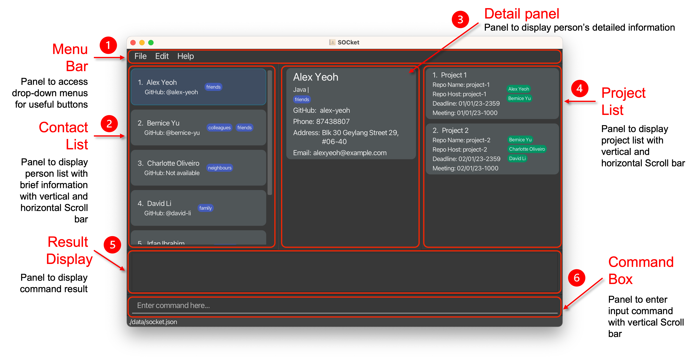
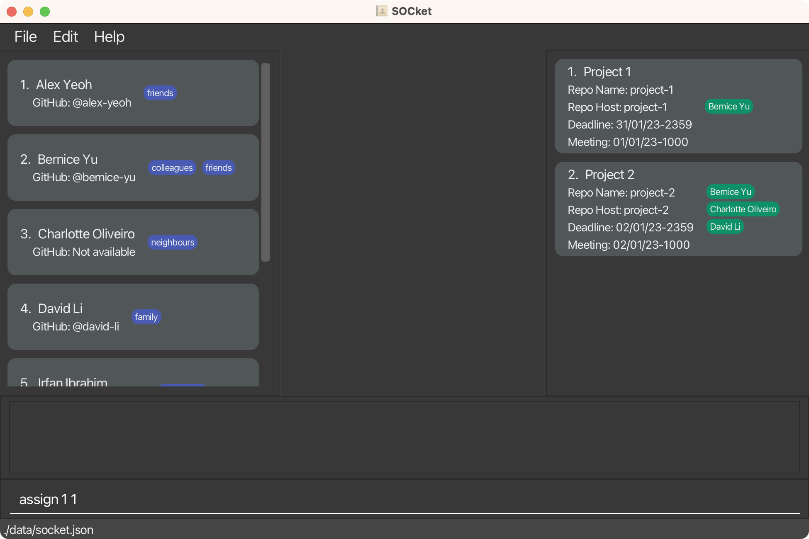
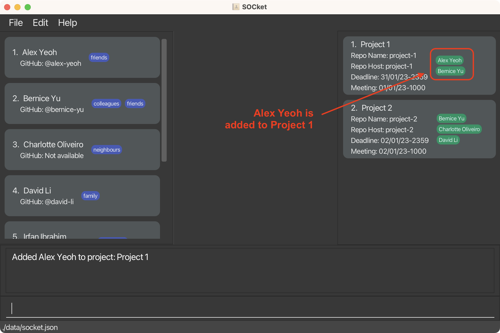
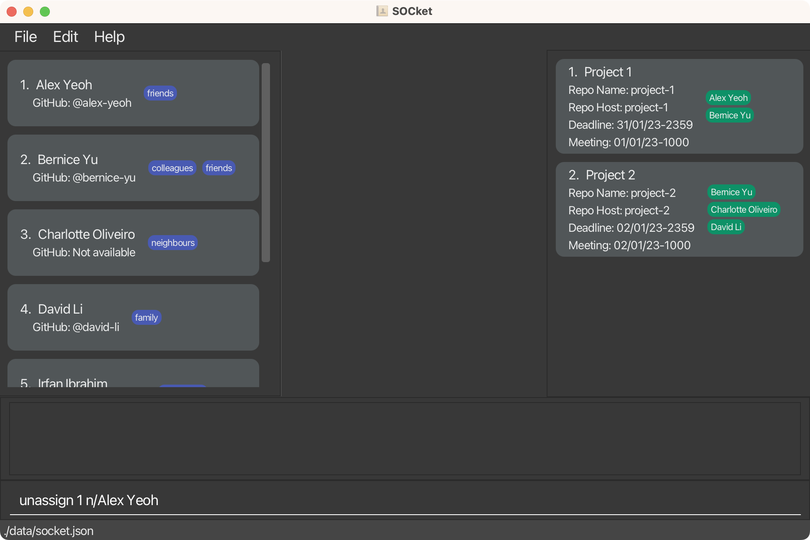
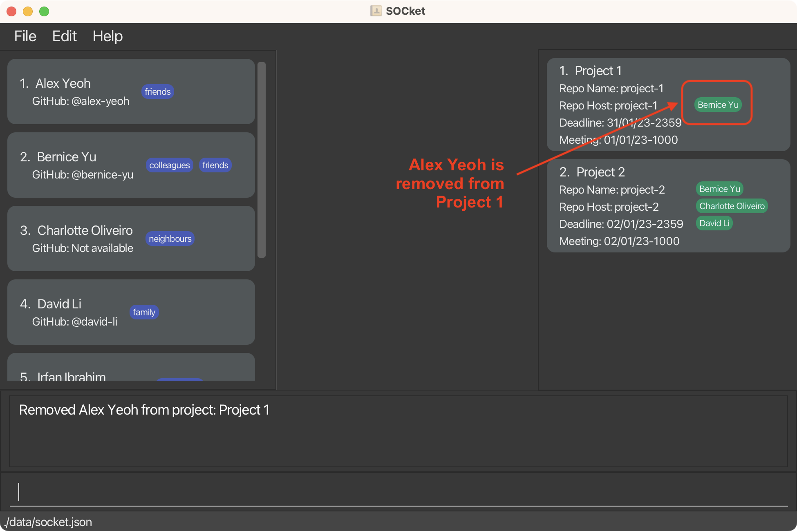

## Table of Contents

* Table of Contents
  {:toc}

--------------------------------------------------------------------------------------------------------------------

## Introduction

SOCket is a **desktop app for NUS Software Engineering Students to manage the contact information of their peers and professors**. With SOCket, you can easily organize and access contact information. SOCket also allows you to efficiently manage information on projects you are involved in.

SOCket is optimized for use via a Command Line Interface (CLI) while still having the benefits of a Graphical User Interface (GUI). If you can type fast, SOCket can get your contact management tasks done faster than traditional GUI apps.

--------------------------------------------------------------------------------------------------------------------

## About this User Guide

The SOCket User Guide helps you quickly familiarise yourself with the features and command syntax of SOCket, imparting the knowledge necessary for you to utilise SOCket's functions. More experienced users can use the **[Command summary](#command-summary)** as a quick reference for the syntax of SOCket's commands.

You can use the links in the **[Table of Contents](#table-of-contents)** to quickly navigate through this document. To help you get started, refer to the **[Quick start](#quick-start)** section of the SOCket User Guide.

--------------------------------------------------------------------------------------------------------------------

## Introduction

SOCket is a **desktop app for NUS Software Engineering Students to manage the contact information of their peers and professors**. With SOCket, you can easily organize and access contact information. SOCket also allows you to efficiently manage information on projects you are involved in.

SOCket is optimized for use via a Command Line Interface (CLI) while still having the benefits of a Graphical User Interface (GUI). If you can type fast, SOCket can get your contact management tasks done faster than traditional GUI apps.

--------------------------------------------------------------------------------------------------------------------

## About this User Guide

The SOCket User Guide helps you quickly familiarise yourself with the features and command syntax of SOCket, imparting the knowledge necessary for you to utilise SOCket's functions. More experienced users can use the **[Command summary](#command-summary)** as a quick reference for the syntax of SOCket's commands.

You can use the links in the **[Table of Contents](#table-of-contents)** to quickly navigate through this document. To help you get started, refer to the **[Quick start](#quick-start)** section of the SOCket User Guide.

--------------------------------------------------------------------------------------------------------------------

## Quick start

1. Ensure you have Java `11` or above installed in your Computer.

1. Download the latest `socket.jar` from [here](https://github.com/AY2223S2-CS2103T-T12-4/tp/releases).

1. Copy the file to the folder you want to use as the _home folder_ for your SOCket.

1. Open a command terminal, `cd` into the folder you put the jar file in, and use the `java -jar socket.jar` command to run the application. 
   A GUI containing __6 main components__ should appear as below in a few seconds. Note how the app contains some sample data. 
   

1. Type the command in the command box and press Enter to execute it. e.g. typing **`help`** and pressing Enter will open the help window. 
   Some example commands you can try:

    * `list` : Lists all contacts.

    * `add n/John Doe p/98765432 e/johnd@example.com a/John street, block 123, #01-01` : Adds a contact named `John Doe` to SOCket.

    * `delete 3` : Deletes the 3rd contact shown in the current list.

    * `clear` : Deletes all contacts.

    * `exit` : Exits the app.

1. Refer to the [Features](#features) below for details of each command.

--------------------------------------------------------------------------------------------------------------------

## Features

**:information_source: Notes about the command format:** 

* `INDEX` must be a positive integer starting from 1 and ending with corresponding number of Person in SOCket. e.g. `1,2,...`

* Words in `UPPER_CASE` are the parameters to be supplied by the user. 
  e.g. in `add n/NAME`, `NAME` is a parameter which can be used as `add n/John Doe`.

* Words in `UPPER_CASE` supplied to remove commands `remove` and `removepj`, are optional. 
  e.g. in `remove 1 p/PHONE`, `PHONE` can be left empty.

* Items in square brackets are optional. 
  e.g `n/NAME [t/TAG]` can be used as `n/John Doe t/friend` or as `n/John Doe`.

* Items with `…`​ after them can be used multiple times including zero times. 
  e.g. `[t/TAG]…​` can be used as ` ` (i.e. 0 times), `t/friend`, `t/friend t/family` etc.

* Parameters can be in any order. 
  e.g. if the command specifies `n/NAME p/PHONE_NUMBER`, `p/PHONE_NUMBER n/NAME` is also acceptable.

* If a parameter is expected only once in the command but you specified it multiple times, only the last occurrence of the parameter will be taken. 
  e.g. if you specify `p/12341234 p/56785678`, only `p/56785678` will be taken.

* Extraneous parameters for commands that do not take in parameters (such as `help`, `list`, `exit` and `clear`) will be ignored. 
  e.g. if the command specifies `help 123`, it will be interpreted as `help`.

### General Commands

General commands to improve your experience with SOCket.

#### Viewing help : `help`

Displays window showing the list of commands and a clickable URL to access help page.

Format: `help`

#### Undoing a change : `undo`

Undoes the last change made to SOCket.

Format: `undo`
* A message is shown if no changes were made to SOCket

#### Redoing an undone change : `redo`

Restores a previously undone change made to SOCket

Format: `redo`
* A message is shown if no undone changes exist

:bulb: **Tip:**
Changes made to SOCket are **not** saved upon exit.

#### Exiting the program : `exit`

Exits the program.

Format: `exit`

### Person Commands

Commands that help you make changes to the contact list.

#### Adding a person: `add`

Adds a person to SOCket.

Format: `add n/NAME [p/PHONE_NUMBER] [e/EMAIL] [a/ADDRESS] [g/GITHUB_PROFILE] [l/LANGUAGE] [t/TAG]…​`

:bulb: **Tip:**
A person can have any number of languages/tags (including 0)

Examples:
* `add n/John Doe p/98765432 e/johnd@example.com a/John street, block 123, #01-01 g/johndoe l/Python`
  
* `add n/Betsy Crowe t/friend e/betsycrowe@example.com a/Newgate Prison p/1234567 t/criminal`

#### Listing all persons : `list`

Lists all persons in SOCket or based on language and tag.

Format: `list [l/LANGUAGE] [t/TAG]`

* The search for language or tag is case sensitive.
* If no language or tag are given, all persons are displayed.
    * e.g. `list` will list out all persons
* There can be one or more keywords for each field (language/ tag).
    * e.g. `list l/Python l/Java` will match out all persons whose language contains `Python` AND `Java`
    * e.g. `list l/Python t/friend` will match out all persons whose language contains `Python` AND tag contains `friend`
* Languages and tags given are specific.
    *  e.g. `list t/school` will not match `list t/school friend`
* Persons with field values matching all keyword for that respective field will be returned (i.e. `AND` search).
    * e.g. `list t/friend l/C++` will return Persons containing tag `friend` AND language `C++`
* Each person is accompanied by an index number in the list
* The list by default is sorted by time added  i.e most recently added person being last in the list

#### Editing a person : `edit`

Edits an existing person in SOCket.

Format: `edit INDEX [n/NAME] [p/PHONE_NUMBER] [e/EMAIL] [a/ADDRESS] [g/GITHUBPROFILE] [l/LANGUAGE] [t/TAG]…​`

* Edits the person at the specified `INDEX`.
* The index refers to the index number shown in the displayed person list.
* At least one of the optional fields must be provided.
* Existing values will be updated to the input values.
* When editing languages, the existing languages of the person will **not** be removed i.e. adding of languages is cumulative
* When editing tags, the existing tags of the person will be removed i.e adding of tags is **not** cumulative.
* You can remove all the person’s tags by typing `t/` without specifying any tags after it.

Examples:
*  `edit 1 p/91234567 e/johndoe@example.com` Edits the phone number and email address of the 1st person to be `91234567` and `johndoe@example.com` respectively.
   
* `edit 2 n/Betsy Crower t/` Edits the name of the 2nd person to be `Betsy Crower` and clears all existing tags.

#### Locating persons by keyword(s): `find`

Finds persons stored in SOCket based on the given keyword(s) for the respective fields.

Format: `find [n/NAME] [p/PHONE_NUMBER] [e/EMAIL] [a/ADDRESS] [g/GITHUBPROFILE] [l/LANGUAGE] [t/TAG]`

* The search for keyword(s) is case-insensitive.
    * e.g `find n/hans` will match `find n/Hans`
    * e.g `find t/cs2103t` will match `find t/CS2103T`
* There can be one or more keyword(s) for each field.
    * e.g. `find n/Hans Bo` will match all persons whose name contains either `Hans` or `Bo`
* The order of the keyword(s) and field(s) does not matter.
    * e.g. `find n/Hans Bo` will match `find n/Bo Hans`
    * e.g. `find n/Hans Bo t/cs2103t` will match `find t/cs2103t n/Hans Bo`
* Only full words will be matched.
    * e.g. `Han` will not match `Hans`
    * e.g. `t/2103t` will not match `t/cs2103t`
* Persons with field values matching at least one keyword for that respective field will be returned (i.e. `OR` search).
    * e.g. `find n/Hans Bo` will return `Hans Gruber`, `Bo Yang`
    * e.g. `find n/Hans l/Java` will return persons whose name contains `Hans` or language contains `Java` or both
    * e.g. `find t/friend` will return persons who have either tag `friend` or `best friend` or both
* If no field is specified, zero persons will be returned.

Example:
* `find n/alex david` returns `Alex Yeoh`, `David Li`
  

#### Deleting a person : `delete`

Deletes the specified person from SOCket.

Format: `delete INDEX`

* Deletes the person at the specified `INDEX`.
* The index refers to the index number shown in the displayed person list.

Examples:
* `list` followed by `delete 2` deletes the 2nd person in the SOCket.
* `find Betsy` followed by `delete 1` deletes the 1st person in the results of the `find` command.

#### Removing a person's field : `remove`

Removes the specific field value based on the given person

Format: `remove INDEX [p/[PHONE]] [p/[GITHUBPROFILE]] [e/[EMAIL]] [a/[ADDRESS]] [l/[LANGUAGE]] [t/[TAG]]...`

* Removes field value of person at the specific `INDEX`.
* At least one of the optional fields must be provided.
* Removes all the corresponding field value in respect of the `KEYWORD`.
    * e.g. `l/Java` will remove `Java` in person’s languages.
* Removes the entire field value when that field has no keyword provided.
    * e.g. `t/` will remove all the tags associate to the person.

Examples: 
* `remove 1 p/ l/Java` Removes phone number and `Java` from languages from first person in the list.

#### Clearing all persons or tags : `clear`

Clears all persons' entries from the SOCket based on the given tags; if tag is not included, clears all persons in SOCket.

Format: `clear [t/TAG]...`

* Removes all the persons related to the specific tags.
* Tag included is **case-insensitive**.
    * e.g. `t/CS2103T` is equivalent to `t/cs2103t`.
* The tags **must be an existing tag** in SOCket.
* If tags are provided, only remove existing tags.
    * e.g. `clear t/cs2103t t/cs2103` will only remove the persons associated with `t/cs2103t` if there exists the `cs2103t` tag but not `cs2103` in SOCket.
* If no tag is provided, remove all the persons in SOCket.
* A confirmation prompt will be asked before removal of persons.

#### Sorting persons (by other fields) : `sort`

Sorts and displays the persons according to the provided category. Sorts the list of persons by name if no argument is provided.

Format: `sort [CATEGORY]`

* If no category is provided, the persons are sorted by their names alphanumerically
* If a category is provided, the persons are sorted by that category alphanumerically
    * e.g. `sort address` will sort the persons by their addresses alphanumerically. Persons without addresses will be at the bottom.

Examples: 
* `sort` Sort the person list by **Name**

* `sort address` Sort the person list by **Address**

#### Viewing a person's detailed infomation: `view`

Views a person's details whose in the filtered list

Format: `view INDEX`
* Views the person's detailed information at the specified `INDEX`.
* The index refers to the index number shown in the displayed person list.
* Alternatively, click on the person in contact list to view detailed information.

### Project Commands

Commands that help you make changes to the project list.

#### Adding a project: `addpj`

Adds a project to SOCket.

Format: `addpj n/PROJECT_NAME h/REPO_HOST r/REPO_NAME d/DEADLINE [m/MEETING]`

* If a field flag is specified, it cannot be blank.
    * e.g `n/  ` is not allowed
* Project Name should contain only alphanumeric & space.
    * e.g `n/project 1`
* Repository Host should:
    * contain alphanumeric & hyphens only.
    * not start or end with hyphen.
    * not exceed 39 characters.
    * e.g `h/project-1`
* Repository Name should:
    * contain alphanumeric, periods, hyphens, or underscores only.
    * not exceed 100 characters.
    * e.g `r/project_1`
* Deadline & Meeting should be given in a date format (dd/MM/yy-HHmm).
    * e.g `d/ 30/03/22-2045` would be *30th March 2022, 8:45 p.m.
* A project is considered to be the same if it has the same project name.

Examples:
* `addpj n/test proj h/t-proj r/test_proj d/ 30/03/22-2045` 
  

#### Editing a project: `editpj`

Edits an existing project in SOCket.

Format: `editpj INDEX [n/NAME] [h/REPO HOST] [r/REPO NAME] [d/DEADLINE] [m/meeting]`

* Edits the project at the specified `INDEX`.
* The index refers to the index number shown in the displayed project list.
* At least one of the optional fields must be provided.
* Existing values will be updated to the input values.

Examples:
* `editpj 1 n/Project Alpha d/02/01/23-2359`Edits the project name and deadline of the first project to be `Project Alpha` and `02/01/2023-2359` respectively.

#### Deleting a project: `deletepj`

Deletes the specified project from SOCket.

Format: `deletepj INDEX`

* Deletes the project at the specified `INDEX`.
* The index refers to the index number shown in the displayed project list.

Examples:
* `deletepj 2` deletes the 2nd project in SOCket.

#### Removing a project's field: `removepj`

Removes the specific field based on the given project in SOCket. 

Format: `removepj INDEX [h/REPO HOST] [r/REPO NAME] [d/DEADLINE] [m/MEETING]`

* Removes field value of project at the specific `INDEX`.
* At least one of the optional fields must be provided.
* Removes all the corresponding field value in respect of the `KEYWORD`.
    * e.g. `r/alex-yeoh` will remove project’s repository name.
* Removes the entire field value when that field has no keyword provided.
    * e.g. `m/` will remove project's meeting.

Examples: 
* `removepj 1 r/` Removes repository name from first project in the project list.
  
* `removepj 1 d/02/01/23-2359 m/` Removes deadline `02/01/23-2359` and meeting from first project in the project list.
  

#### Clearing all projects: `clearpj`

Clears all the projects in SOCket.

Format: `clearpj`

#### Sorting projects (by other fields): `sortpj`

Sorts and displays the projects according to the provided category. Sorts the list of projects by deadline if no argument is provided.

Format: `sortpj [CATEGORY]`

* If no category is provided, the projects are sorted by their deadlines alphanumerically
* If a category is provided, the projects are sorted by that category alphanumerically
    * e.g. `sortpj reponame` will sort the projects by their Repository Names alphanumerically. Projects without Repository Names will be at the bottom.

Examples:
* `sortpj deadline` Sort the project list by **Deadline**
  
* `sortpj name` Sort the project list by **Project Name**
  

#### Assign a person to a project: `assign`

Format: `assign PERSON_INDEX PROJECT_INDEX`

* `PERSON_INDEX` refers to the index number shown in the displayed person list.
* `PROJECT_INDEX` refers to the index number shown in the displayed project list.

Examples:
* Before Assigned
  
* After Assigned
  

#### Unassign a person from a project: `unassign`

Removes the specified person from the specified project.

Format: `unassign INDEX n/NAME`

* Removes the person with the specified `NAME` from the project with the specified `INDEX`.
* `INDEX` refers to the index number shown in the displayed project list.
* `NAME` is case-insensitive.
* `NAME` must match in full.

Examples:
* Before Unassigned
  
* After Unassigned
  

### Saving the data

SOCket data is saved in the hard disk automatically after any command that changes the data. There is no need to save manually.

### Editing the data file

SOCket data is saved as a JSON file `[JAR file location]/data/socket.json`. Advanced users are welcome to update data directly by editing that data file.

:exclamation: **Caution:**
If your changes to the data file makes its format invalid, SOCket will discard all data and start with an empty data file at the next run.

--------------------------------------------------------------------------------------------------------------------

## FAQ

**Q**: How do I transfer my data to another Computer? 
**A**: Install the app in the other computer and overwrite the empty data file it creates with the file that contains the data of your previous SOCket home folder.

--------------------------------------------------------------------------------------------------------------------

## Command summary

| Action          | Format, Examples                                                                                                                                                                                            |
|-----------------|-------------------------------------------------------------------------------------------------------------------------------------------------------------------------------------------------------------| 
| **Add**         | `add n/NAME [p/PHONE_NUMBER] [e/EMAIL] [a/ADDRESS] [g/GITHUB_PROFILE] [l/LANGUAGE] [t/TAG]…​`   e.g. `add n/John Doe p/98765432 e/johnd@example.com a/John street, block 123, #01-01 g/johndoe l/Python` |
| **Clear**       | `clear [t/TAG]...`  e.g. `clear t/cs2103t`                                                                                                                                                                |
| **Delete**      | `delete INDEX`                                                                                                                                                                         |
| **Remove**      | `remove INDEX [p/[PHONE]] [p/[GITHUBPROFILE]] [e/[EMAIL]] [a/[ADDRESS]] [l/[LANGUAGE]] [t/[TAG]]…​`   e.g. `remove 1 t/ l/Java e/`                                                                       |
| **Edit**        | `edit INDEX [n/NAME] [p/PHONE_NUMBER] [e/EMAIL] [a/ADDRESS] [g/GITHUBPROFILE] [l/LANGUAGE] [t/TAG]…​`  e.g. `edit 2 n/James Lee e/jameslee@example.com`                                                  |
| **Sort**        | `sort [CATEGORY]`  e.g. `sort address`                                                                                                                                                                   |
| **Find**        | `find KEYWORD [MORE_KEYWORDS]…​ [t/TAG]…​`  e.g. `find James Jake t/cs2103t`                                                                                                                             |
| **List**        | `list [l/language] [t/tag]`  e.g. `list l/Java`                                                                                                                                                          |
| **Add Project** | `addpj n/PROJECT_NAME h/REPO_HOST r/REPO_NAME d/DEADLINE [m/MEETING]`  e.g. `addpj n/test proj h/t-proj r/test_proj d/ 30/03/22-2045`                                                                    |
| **Clear Projects** | `clearpj`                                                                                                                                                                                                   |
| **Delete Project** | `deletepj INDEX`                                                                                                                                                                                            |
| **Remove Project** | `removepj INDEX [h/REPO_HOST] [r/REPO_NAME] [d/DEADLINE] [m/MEETING]`   e.g. `removepj 2 r/ d/ m/`                                                                                                       |    
| **Edit Project** | `editpj INDEX [n/NAME] [h/REPO_HOST] [r/REPO_NAME] [d/DEADLINE] [m/MEETING]`  e.g. `editpj 2 n/Project Bravo r/bravo-project`                                                                            |
| **Assign**      | `assign PERSON_INDEX PROJECT_INDEX`  e.g. `assign 1 1`                                                                                                                                                   |
| **Unassign**    | `unassign INDEX n/NAME`   e.g. `unassign 1 n/John Doe`                                                                                                                                                   |
| **Sort Projects** | `sortpj [CATEGORY]`  e.g. `sortpj reponame`                                                                                                                                                              | 
| **View**        | `view INDEX`                                                                                                                                                                                                      |
| **Undo**        | `undo`                                                                                                                                                                                                      |
| **Redo**        | `redo`                                                                                                                                                                                                      |
| **Help**        | `help`                                                                                                                                                                              |
| **Exit**        | `exit`                                                                                                                                                                                                      |
