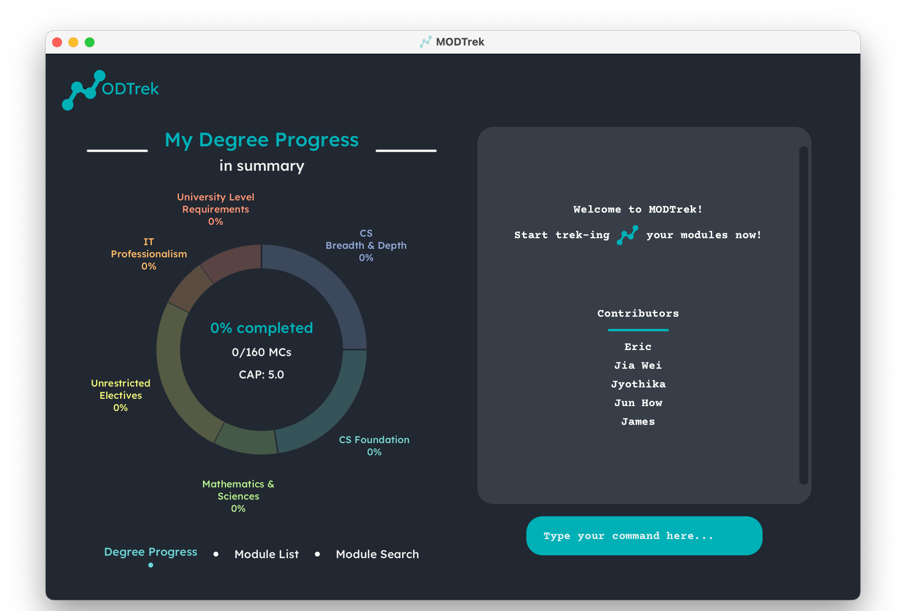
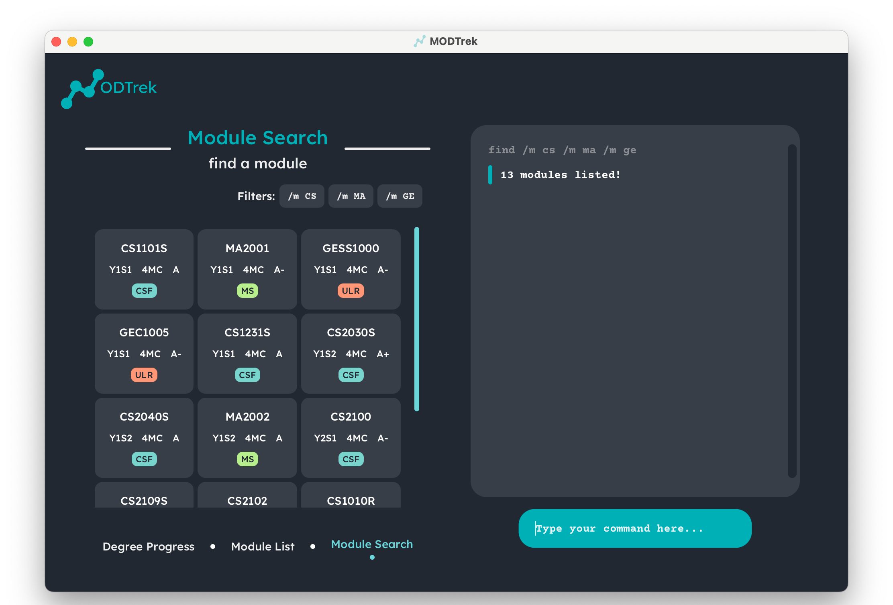
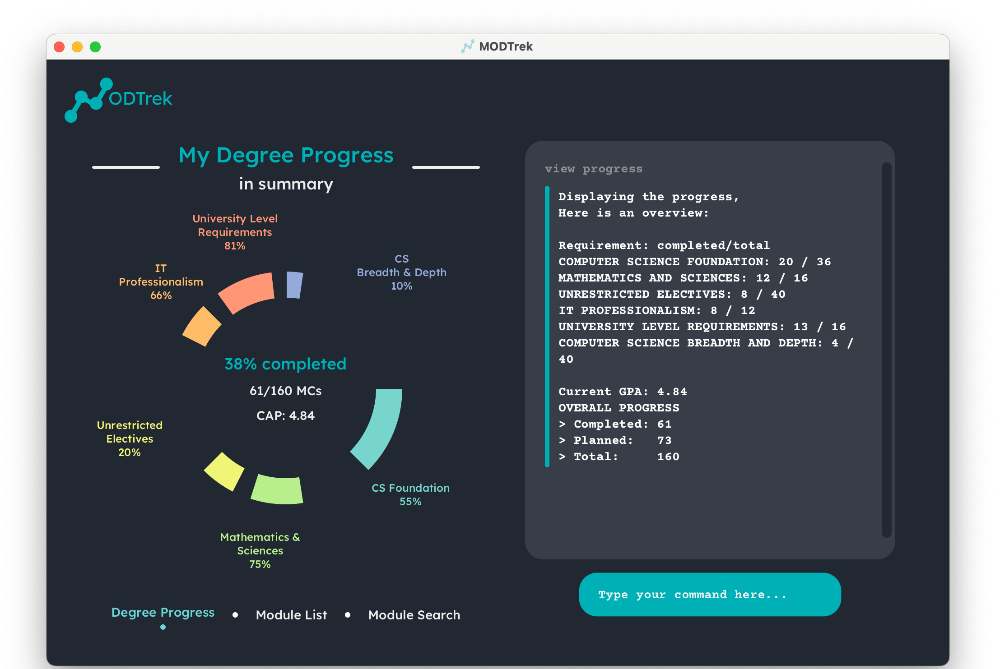
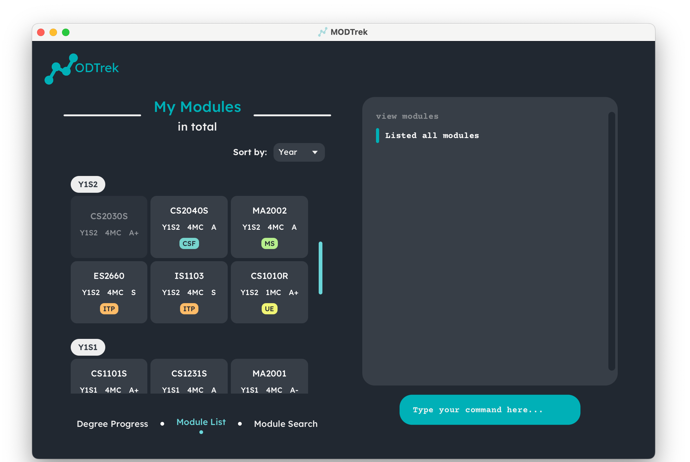

 
 

Are you a university student struggling to manage your modules or classes and track your degree progress? Introducing **MODTrek**, here to help you with that!

Say goodbye to the days of learning complicated spreadsheet formulas and manual grade average calculations! **MODTrek** is a desktop application for managing your modules and degree progress, optimised for Command Line Interface (CLI) users who prefer typing over using their mouse. Equipped with an eye-catching Graphical User Interface (GUI), the app provides a convenient platform for you to access and update your modules within presses of a keyboard. Module and degree progress tracking have never been easier!

Disclaimer: This application is currently geared towards NUS Computer Science Students of the AY2021-2022 cohort. To other students, fret not! We plan to expand our application’s scope to more majors, cohorts and universities in the coming years, so keep a lookout!

--------------------------------------------------------------------------------------------------------------------

## Table of Contents 

1. [How To Use This Guide](#how-to)
2. [Quick Start](#quick-start)
3. [GUI Overview](#gui-overview)
4. [Short Tutorial](#short-tutorial)
5. [Features](#features) 
   5.1 [Add a module:](#add-module) `add` 
   5.2 [Delete module(s):](#delete-module) `delete` 
   5.3 [Edit a module:](#edit-module) `edit` 
   5.4 [Tag a module:](#tag-module) `tag` 
   5.5 [Find module(s) by keyword(s):](#find-module) `find` 
   5.6 [Sort all modules:](#sort-module) `sort` 
   5.7 [Toggle between module list and degree progress:](#change-view) `view` 
   5.8 [View help](#view-help) `help` 
   5.9 [Exit the program:](#exit-app) `exit` 
   5.10 [Save the data](#save-data) 
   5.11 [Edit the data file](#edit-data)
6. [Frequently Asked Questions (FAQ)](#faq)
7. [Command Summary](#command-summary)

--------------------------------------------------------------------------------------------------------------------

## 1. How to Use This Guide 

Not sure how to start using **MODTrek**? This user guide will give you all the information you need so
that you can use **MODTrek** to its full potential.

To get started, we have prepared a [Quick Start](#quick-start) section to help you set up the **MODTrek** with ease.

You may also familiarize yourself with the GUI in our [GUI Overview](#gui-overview) section where you will get a 
quick breakdown of our GUI.

Confused about how to get rolling within **MODTrek**? We have composed a [Short Tutorial](#short-tutorial) to help you kick-start your module tracking.

Not sure what features **MODTrek** has or how to use them? Our [Features](#features) section provides an in depth
explanation of **MODTrek** can do and how you can use them effectively. Alternatively, you can go to our [Command Summary](#command-summary)
section for a quick overview of all the commands.

Commonly asked questions and answers can be found in our [FAQ](#faq) but if you are still unable to find what you are
looking for, feel free to contact us via our [GitHub page](https://github.com/AY2223S2-CS2103T-T13-1/tp).

Before going any further, here are some useful notations that you should know.

**Tips**

Tips are useful suggestions that will help you become a seasoned **MODTrek** user more quickly.

:bulb: **Tip:** Tips are useful information. They can give you a better experience with **MODTrek**.

**Notes**

Notes are important information that you should pay attention to when using **MODTrek**.

:information_source: **Note:** Take notes when you see this icon.

**Caution**

Cautions are in place to warn you of potential pitfalls new users may encounter.

:exclamation: **Caution:** Stop and read carefully when you see this!

[Back to Table of Contents](#toc)

--------------------------------------------------------------------------------------------------------------------

## 2. Quick Start 

1. Ensure that you have Java 11 or above installed in your Computer.
2. Download `modtrek.jar` [here](https://github.com/AY2223S2-CS2103T-T13-1/tp/releases).
3. Copy the file to the folder you want to use as the _home folder_ for **MODTrek**.
4. Launch the app by double-clicking the file or by navigating to the folder containing the file using your command terminal, and
running `java -jar modtrek.jar` in your terminal. 
5. An interface similar to the one below should appear in a few seconds. 

<em>GUI of MODTrek</em> 

6. Great! **MODTrek** is running and ready to track your modules. You may type commands into the text box on the bottom right and press enter to execute them. For a list of executable commands, refer to the [Command Summary](#command-summary) section.
We recommend you to follow our [Short Tutorial](#short-tutorial) to start off.

[Back to Table of Contents](#toc)

--------------------------------------------------------------------------------------------------------------------

## 3. GUI Overview 

The following is an annotated breakdown of **MODTrek's** GUI:

<em>Breakdown of GUI</em> 

1. **Command Input:** This is where you input your commands. Press enter to execute them.
2. **Command Screen:** Relevant messages from the application will be displayed here. This includes success messages, error
messages and results.
3. **Results Section:** This panel shows your degree progression by default. This panel can be changed using the `view` command
to toggle between the module list in **MODTrek** or the user's degree progression. Using the `find` command when making 
a query on the module list will navigate you to the module search screen.    

The following shows the various screens of the Results Section in **MODTrek's** GUI:

<em>Screens of Results Section</em> 

1. **Degree Progress Screen:** This screen shows the completion progress of the degree and individual sub requirements of the 
degree. Your total MCS completed and CAP are also displayed in a doughnut chart.
2. **Module List Screen:** This screen shows all your current modules tracked by MODTrek. Here, you can customise the 
way you want to categorise your modules. Refer to the section on [Sort all modules](#sort-module) for more details!
3. **Module Search Screen:** This screen shows your filtered list of modules. You can customise the filters to search
for your target modules. Refer to the section on [Find module(s) by keyword(s)](#find-module) for more details!

[Back to Table of Contents](#toc)

--------------------------------------------------------------------------------------------------------------------

## 4. Short Tutorial 

Excited to try **MODTrek** out? Here is a sequence of basic commands to help you start tracking your modules:

1. `add /m CS1101S /c 4 /y Y1S1`: Adds the module CS1101S to the list. The Results Section should display the Module List, with a Module Card created for CS1101S, placed within a Module Group categorised as Y1S1 (sorted by year-sem by default).
2. `add /m CS1231S /c 4 /y Y1S1`: Adds the module CS1231S to the list. A Module Card should be created for CS1231S and reside beside CS1101S.
3. `edit /m CS1101S /g A /t CSF`: Edits the module CS1101S to record the grade as "A" and the tag as "Computer Science Foundation". Feel free to input the appropriate grade to suit the one you attained.
4. `add /m MA1521 /c 4 /y Y1S1`: Adds the module MA1521 to the list. A Module Card should be created for MA1521 and reside beside CS1231S.
5. `delete /m MA1521`: Deletes the module MA1521 from the list. The Module Card for MA1521 should no longer exist.
6. `exit`: Exits **MODTrek**. Don't worry, your data is saved automatically for you, so the next time you start up **MODTrek**, your data should be successfully restored.

Congratulations, you have completed this tutorial! Do continue exploring the functions within **MODTrek**. For the complete list of commands, you can refer to the [Command Summary](#command-summary) section. For more details about each command, you can refer to the next section on [Features](#features).

[Back to Table of Contents](#toc)

--------------------------------------------------------------------------------------------------------------------

## 5. Features 

:information_source: **Notes about command format:** 

* Words enclosed by `<>` are the parameters you, as the user, should provide. 
E.g. In `add /m <code>`, `<code>` is a parameter which can be replaced by `CS2030S` to give the command `add /m CS2030S`.
  
* Parameters encapsulated in between round brackets are optional. 
E.g. In `delete /m <code1> (/m <code2>...)`, one or more modules can be deleted. It can be used as `delete /m CS1101S` or as`delete /m CS1101S /m CS1231`.

* Parameters with `...` after them can be used 1 or more times. 
E.g. In `(/t <tag>...)`, one or more tags can be provided. It can be used as `/t ULR`, `/t ULR /t CSF`.

* Extra parameters for single-word commands that do not take in parameters (such as `exit`, `help`) will be ignored.
E.g. If the command specifies `exit 123`, it will be interpreted as `exit.`

### MODTrek supports the following features:

#### 5.1 Add a module : `add` 

Like all students, you would have taken or are currently taking some classes (hopefully) that you would like to add to your tracker. Add a module to the module list in **MODTrek** with this command. This will kickstart your **MODTrek** journey.

**Syntax:** `add /m <code> /c <credits> /y <year-semester> (/g <grade>) (/t <tag>...)`

Additional details:
* `<code>` refers to the module code. Format of module code should be <2-4 alphabets><4 numbers>(<1 alphabet>). Refer to [NUSMODS](https://nusmods.com/modules?sem[0]=1&sem[1]=2&sem[2]=3&sem[3]=4) for a list of valid module codes.
* `<credits>` refers to the module's credits (usually this in an integer from 1 to 12). We only support positive integers.
* `<year-semester>` refers to the year and semester the module is taken. We only support years from 0 to 5 and semesters `s1`(Semester 1), `s2`(Semester 2), `st1`(Special Semester 1) and `st2`(Special Semester 2).
* `<grade>` refers to the grade obtained for the module. Ranges from A+ to U, excluding the W, CS, CU grade.
* `<tag>` refers to the requirement that the module fulfils. This includes:
   * `ULR` University Level Requirements
   * `CSF` Computer Science Foundation
   * `CSBD` Computer Science Breadth & Depth
   * `UE` Unrestricted Electives
   * `ITP` IT Professionalism
   * `MS` Mathematics & Sciences

:bulb: **Tip:** A module can have more than 1 tag (satisfying 2 or more degree requirements).

:bulb: **Tip:** To add a planned module, simply omit the grade. Then it won't be counted to your degree progression! You can always add the grade later with the `edit` command so don't worry.

:information_source: **Note:** You cannot add 2 modules with the same module code into **MODTrek**. Modules must have distinct module codes.
If there are reasons you need to add a module with the same module code (e.g. retaken module, MOOCs) refer to this [faq](#faq3) for suggested workaround.

**Example:** 
* `add /m CS2103T /c 4 /y y2s2 /g A /t CSF` (counted as a completed module)
* `add /m GESS1025 /c 4 /y y1s2 /t ULR` (counted as a planned module)

[Back to Table of Contents](#toc)

#### 5.2 Delete module(s) : `delete` 

As students, it is ok to make mistakes, even when tracking your modules! Delete specific module(s) from the module list with this command. You may also choose to delete all the modules from the module list.
For example, you may want to delete a planned module which you have decided not to take.

**Syntax:**
* _To delete specific modules:_ `delete /m <code1> (/m <code2>...)`
* _To delete all modules:_ `delete all`

:bulb: **Tip:** You may use a single delete command to delete more than 1 module at a time but at least
1 module to be deleted must be specified.

**Example:**
* `delete /m CS2100 /m CS2040S`
* `delete /m MA1521`
* `delete all`

[Back to Table of Contents](#toc)

#### 5.3 Edit a module : `edit` 

Perhaps you want to key in your recent grades into your module tracker right when you get them? You may use this command to rectify any mistakes or add in any details you have omitted. This command edits details of a module you have previously added.

**Syntax:** `edit <existing code> <toEdit>...`

Specify one or more parameters in `<toEdit>` that you want to edit. This can be:
* `/m <new code>`
* `/c <credit>`
* `/y <year-semester>`
* `/g <grade>`
* `/t <tag>`

:exclamation: **Caution:** Previous module information will be overwritten and not be saved!

**Example:**
* `edit ES2660 /m CS2101 /g B+ /t MS`
* `edit CS2107 /y y3s1`

[Back to Table of Contents](#toc)

#### 5.4 Tag a module : `tag` 

How does **MODTrek** track which requirements I have fulfilled? Here at **MODTrek**, we know that requirements that modules fall under can change from time to time so we give you a flexible way to track this with tags! 

Tag a module to include or remove one or more degree requirements (e.g. University Level Requirements, Computer Science Foundation etc) that the module may or may not fulfil with this command.
For example, after completing a planned module, you may want to include a tag for the module with up-to-date tags of degree requirements it fulfills.  
Refer to [Add a module](#add-module) for the tags that you can use.

**Syntax:**
* _To include tags:_ `tag <code> include /t <tag1> (/t <tag2>...)`
* _To remove tags:_ `tag <code> remove /t <tag1> (/t <tag2>...)`

**Example:**
* `tag CS2030S include /t CSF`
* `tag ES2660 remove /t ULR /t ITP`

[Back to Table of Contents](#toc)

#### 5.5 Find module(s) by keyword(s) : `find` 

Life as a student can be pretty hectic and sometimes you just need information on specific modules quickly! Well, **MODTrek** can do exactly that. 

Display specific module(s) and their details previously logged by the user satisfying the keyword(s) you include with this command.
You may use this command to find modules that match the keywords you are interested in without needing to manually scroll through the list of modules.
For example, you may want to find out the core modules which you obtained a good grade (A+, A, A-) for, so that you can choose your strongest area to potentially specialise in.

**Syntax:** `find <keyword>...` or `find <module-code>`

Specify one or more parameters in `<keyword>...` that you want to find your modules by. This parameter can be from the following category:
* `/m <code-prefix>`
* `/c <credit>`
* `/y <year-semester>`
* `/g <grade>`
* `/t <tag>`

Alternatively, you may find a specific module by its module code. You might need this when you just to need to make sure you keyed in some information right in one of those late night study sessions when you half asleep zzz.

:information_source: **Note:** Code prefix refers to the first alphabetic part of a module code.
E.g. CS is the code prefix of Computer Science modules like CS1101S and CS2106.

:bulb: **Tip:** Using more keywords from different categories will filter the results you want to find further.
Using more keywords from the same category will return you all the modules that satisfy at least one of those keywords in that parameter.

**Example:**
* `find /c 4 /g A+`
* `find /y y2s2`
* `find cs1101s`
* `find /m cs /m ma /m ge` 

<em>Result of find command</em> 

[Back to Table of Contents](#toc)

#### 5.6 Sort all modules : `sort` 

Sometimes, you want your module list to look a certain way. Sort the modules according to the category indicated by the user. You may use this command if you want to view the modules
for each level of the category that you are interested in.
For example, you may want to sort your modules by tag to see which degree requirements you need to take classes for next semester!

**Syntax:** `sort <category>`

Categories that modules can be sorted by are:
* `/m` to sort by module code prefix
* `/c` to sort by credit
* `/y` to sort by year-semester
* `/g` to sort by grade
* `/t` to sort by tag

:bulb: **Tip:** You can also use the drop-down menu on the top-right hand corner of the results panel to choose what
category to sort by when **MODTrek** is in the module list screen.

**Example:** `sort /g`

<em>Result of sort command</em> 

[Back to Table of Contents](#toc)

#### 5.7 Toggle screens : `view` 

Changing between interfaces is simple in **MODTrek**! Toggle between the display of degree progress or module list with this command. You may either view your degree progression or list of modules recorded.

**Syntax:**
* _To view degree progress:_ `view progress` 

<em>Degree progress screen</em> 

* _To view module list:_ `view modules` 

<em>Module list screen</em> 

:bulb: **Tip:** You can also click the different screen names at the bottom of the results panel to navigate between the different screens. 

:bulb: **Interpreting data:** You may find that the total MCs for the modules you have included does not match the MC total as shown. The MC total shown indicates the "meaningful" credits, which are those that are counted towards your degree progression, based on the degree requirements. Any credits beyond the limit by the requirement is not "meaningful", and therefore not counted into the total.

For more detailed information on the calculations, please refer to this [section](DeveloperGuide.md#generation-of-degree-progression-data) in our developer guide.

[Back to Table of Contents](#toc)

#### 5.8 View help : `help` 

Displays a list of help commands or a summary of a specific command's usage and format.

**Syntax**
* _To display a list of help commands:_ `help`
* _To display a summary of a specific command's usage and format:_ `help <command>`

Specify exactly one parameter in `<command>`. This can be from one of the commands:
* `add`
* `delete`
* `edit`
* `tag`
* `find`
* `sort`
* `view`
* `exit`

**Example**: `help add`

[Back to Table of Contents](#toc)

#### 5.9 Exit MODTrek : `exit` 

Once you're done keying in your modules and their details, you can use this command to exit **MODTrek**. Alternatively, you may exit by clicking the top-right X button to close the window.

**Syntax:** `exit`

[Back to Table of Contents](#toc)

#### 5.10 Save MODTrek data 

As a student, we often have limited time. We cannot be re-entering information again and again! The modified data regarding the modules is saved into the hard disk automatically after any command that changes the data is executed. There is no need to save it manually through any other method.

[Back to Table of Contents](#toc)

#### 5.11 Edit MODTrek data 

ModTrek data is saved as a JSON file [JAR file location]/data/modtrek.json. Advanced users are welcome to update data directly by editing that data file.

:information_source: **Note:** This can only be done when the application is not running. Otherwise, changes to JSON file will be overridden by the application!

:exclamation: **Caution:** If your changes to the data file makes its format invalid, **MODTrek** will discard all data and start with an empty data file at the next run.

[Back to Table of Contents](#toc)

--------------------------------------------------------------------------------------------------------------------

## 6. Frequently Asked Questions (FAQ) 

**Q**: Why is it that I can add in modules not offered in NUS? 
**A**: Unfortunately, we do not have a database to store all the available modules in NUS.
We can only check if the module code is formatted correctly, and we trust users to key in modules that
are provided only by NUS.

**Q**: Why are the old terms (modules, CAP, MCs) used when referring to modules information? 
**A**: We used these terms to specifically cater to our target audience, who are CS students matriculated in AY 21/22.

**Q**: Why is it that I cannot add a module I intend to retake in upcoming semester?  
**A**: Unfortunately as per our add command, we do not allow 2 modules with the same module code to be present in our app
as of now. We understand that the NUS curriculum is **very** flexible so the application tries to accommodate as many curriculums as possible.
Any deviations from these constraints for any reason (eg. Exchange modules, Retaken modules or MOOCs) should be mapped to modules within the application's constraints.
For example, one may use dummy module codes like TEST1001 to include these modules in their degree progression and CAP calculation.

**Q**: Why is "W" grade not allowed? 
**A**: We did not believe "W" grades in the application would be essential. It is equivalent to deleting the module from the
record since credits will no longer count towards degree progression.

**Q**: Why are "CS", "CU" grades not allowed? 
**A**: We did not believe adding "CS", "CU" grades would be essential. They function similarly to "S" and "U" grades respectively, 
where "CS" and "S" count towards MCs completed, while "CU" and "U" do not count towards MCs completed. All of them do not affect the CAP as well.
Hence, you may record "CS" and "CU" grades as "S" and "U" respectively.

[Back to Table of Contents](#toc)

--------------------------------------------------------------------------------------------------------------------

## 7. Command Summary 

| Action     | Format, Examples                                                                                                                                                       |
|------------|------------------------------------------------------------------------------------------------------------------------------------------------------------------------|
| **Add**    | `add /m <code> /c <credits> /y <year-semester> (/g <grade>) (/t <tag>...)`  e.g. `add /m CS2103T /c 4 /y y2s2 /g A /t ULR`                                          |
| **Delete** | `delete /m <code1> (/m <code2>...)` or `delete all`  e.g. `delete /m CS2100 /m CS2040S`                                                                             |
| **Edit**   | `edit <existing code> (/m <new code>) (/c <credits>) (/y <year-semester>) (/g <grade>) (/t <tag>...)`   e.g. `edit ES2660 /m CS2101`                                |
| **Tag**    | `tag <code> include /t <tag1> (/t <tag2>...)` or `tag <code> remove /t <tag1> (/t <tag2>...)`   e.g. `tag CS2030S include /t CSF`, `tag ES2660 remove /t ULR /t ITP` |
| **Find**   | `find <code>` or `find (/m <code-prefix>) (/c <credits>) (/y <year-semester>) (/g <grade>)`   e.g. `find CS1101S`, `find /g A+`                                     |
| **Sort**   | `sort <category>`, where category = "/m" or "/c" or "/y" or "/g" or "/t"   e.g. `sort /m`                                                                           |
| **View**   | `view progress` or `view modules`                                                                                                                                      |
| **Help**   | `help` or `help <command>`  e.g. `help add`                                                                                                                         |
| **Exit**   | `exit`                                                                                                                                                                 |

:information_source: **Note:** Parameters encapsulated in between brackets `()` are optional.

For `edit`, at least one optional parameter has to be specified for it to work! For `find`, if not finding a single module, at least one optional parameter has to be specified.

[Back to Table of Contents](#toc)
