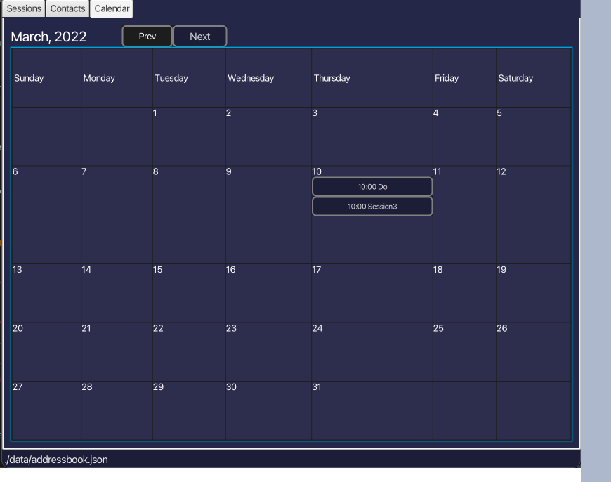

_Ez-Schedule_ is a **desktop application for managing and scheduling of events, optimized for use via a Command Line
Interface** (CLI) while still providing an easy way to visualize all events through a Graphical User Interface (GUI).

_Ez-Schedule_ will benefit a fast typist who needs to plan and track upcoming events.

<h1 id="index">Index</h1>
-------------------------
* [Quick Start](#quick-start)
* [Features](#features)
  * [Command Summary](#command-summary)
    * [Add new event](#add) : `add` command
    * [Repeat existing event](#recur) : `recur` command
    * [Edit event](#edit) : `edit` command
    * [Delete event](#delete) : `delete` command
    * [List all events](#list) : `list` command
    * [Retrieve next event](#next) : `next` command
    * [Locate events by keyword](#find) : `find` command
    * [Undo previous command](#undo) : `undo` command
    * [View help](#help) : `help` command
    * [Exit application](#exit) : `exit` command
  * [GUI](#gui)
    * [Command Box](#command-box)
    * [Response Box](#response-box)
    * [Event List](#event-list)
    * [Upcoming Events](#upcoming)
    * [Calendar](#calendar)
* [Limitations](#limitations)
* [FAQ](#faq)

<h1 id="quick-start">Quick Start</h1>
-------------------------------------
1. Ensure you have Java `11` or above installed in your Computer.
2. Download the latest `Ez-Schedule.jar` from [here](https://github.com/AY2223S2-CS2103-W17-3/tp/releases).
3. Copy the file to the folder you want to use as the *home folder* for your _Ez-Schedule_.
4. Open a command line terminal, `cd` into the folder you put the jar file in
5. Use the `java -jar Ez-Schedule.jar` command to run the application.

<h1 id="features">Features</h1>
-------------------------------

<h2 id="command-summary">Command Summary</h2>

| Action | Command Format                                                    |
|:-------|:------------------------------------------------------------------|
 | Add    | `add n/<event> d/<date> s/<start time> e/<end time>`              |
| Repeat | `recur <index> d/<end date> every/<RECUR FACTOR>`                 |
| Edit   | `edit <index> n/<name> d/<date> s/<start time> e/<end time>`      |
| Delete | `delete <index>` or `delete <index index ... index>`              |
| List   | `list`                                                            |
| Next   | `next` or `next <count>`                                          |
| Find   | `find n/<name> d/<date>`                                          |
| Undo   | `undo`                                                            |
| Help   | `help`                                                            |
| Exit   | `exit`                                                            |

:exclamation: **Date Format:** Dates should follow a `YYYY-MM-DD` format

:exclamation: **Time Format:** Time should be in 24-hour `HH:mm` format,
ranging from `00:00` to `23:59`. Leading zero are required. 

[[Back to top](#index)]

<h3 id="add">Add New Event</h3>

Adds an event into the Scheduler.

Format: `add n/<event> d/<date> s/<start time> e/<end time>`

Parameters:  
`n/`: Name or description of event  
`d/`: Date of the event  
`s/`: Start time of the event  
`e/`: End time of the event

:information_source: **Note:**  
Name/Description is alphanumeric only.  
Start time should come before end time.  
Adding of events that overlaps in time is not allowed.

Example: `add n/booked tennis court d/2023-02-01 s/15:00 e/17:00`

[[Back to top](#index)]

<h3 id="recur">Repeat Existing Event</h3>

Recurs an event from the Scheduler until an end date.

Format: `recur <index> d/<end date> every/<recur factor>`

Parameters:  
`d/`: Ending date of recurrence for the event in `YYYY-MM-DD` format  
`every/`: Recur factor to recur the event, given by `day/week/month`

:information_source: **Note:**  
Event must first exist in the scheduler.  
Recurring of events not existing in scheduler is not allowed.  
End date should come after current event date.  

Example: `recur 1 d/2024-01-01 every/month`

[[Back to top](#index)]

<h3 id="edit">Edit An Event</h3>

Edits an event in the Scheduler.

Format: `edit <index> n/<event> d/<date> s/<start time> e/<end time>`

Parameters:  
`n/`: Name or description of event  
`d/`: Date of the event  
`s/`: Start time of the event  
`e/`: End time of the event

:information_source: **Note:** At least one field must be provided.

Example: `edit 1 n/tennis` or `edit 3 d/2023-06-01 s/10:00`

[[Back to top](#index)]

<h3 id="delete">Delete Event</h3>

Deletes the event(s) in the Scheduler.

Format: `delete <index>` or `delete <index index ... index>`

Example: `delete 1` or `delete 1 4 5`

[[Back to top](#index)]

<h3 id="list">Listing All Events</h3>

Displays all events currently saved in the Scheduler.

Format: `list`

Example: `list`

[[Back to top](#index)]

<h3 id="next">Retrieve next event</h3>

Shows the next upcoming event(s).

Format: `next <count>`

Parameter:  
`<count>`: Number of upcoming events to show.
           Optional - if not indicated, only the next one event is shown.

:information_source: **Note:** If count is larger than the number of existing events, then all events are shown.

Example: `next` or `next 2`

[[Back to top](#index)]

<h3 id="find">Locate events by name and/or date</h3>

Finds the Scheduler for the task, returns all events containing the relevant keyword.

Format:`find n/<name> d/<date>`

Parameters:  
`n/`: Name or description of event  
`d/`: Date of the event

:information_source: **Note:** At least one field must be provided.

Example: `find n/tennis` or `find d/2023-03-01` or `find n/tennis d/2023-03-01`

[[Back to top](#index)]

<h3 id="undo">Undo Previous Command</h3>

Undo previous valid command.
(Only applicable for `add`, `delete`, `edit` and `recur` commands).

Format: `undo`

Example: `undo`  

[[Back to top](#index)]

<h3 id="help">View Help</h3>

Provide a link to access this website.

Format: `help`

Example: `help`  

[[Back to top](#index)]

<h3 id="exit">Exit Application</h3>

Exits the application.

Format: `exit`

Example: `exit`  

[[Back to top](#index)]

<h2 id="gui">GUI</h2>

<h3 id="command-box">Command Box</h3>

Allows you to type the command in the command box and press Enter to execute the command. 
E.g., typing help and pressing Enter will open the help window

[[Back to top](#index)]

<h3 id="response-box">Response Box</h3>

Displays to you the feedback of the command you typed into the command box.

[[Back to top](#index)]

<h3 id="event-list">Event List</h3>

Displays to you all the events that you have.
Use commands such as `list` and `find` to show you the events you have in your list.

:information_source: **Note:**  
Events that have past is marked with a completed label and check mark.   
Events are displayed in chronological order.  

[[Back to top](#index)]

<h3 id="upcoming">Upcoming Events</h3>

Displays ongoing (in case you have not start on it yet) and upcoming events you have. 

:bulb: **Tip:**
While the default is one upcoming event,
you can use the `next` command to change the number of upcoming events shown.

[[Back to top](#index)]

<h3 id="calendar">Calendar</h3>

Provides an overview of all the event that you have.

Functionality:  
1. Events that are added will be shown in its respective calendar box.
2. On click of `now` button will jump you directly back to the current date.
3. On click of any calendar date boxes that have events will display the events in event list.
4. `find` command will highlight the calendar boxes that has the event.

[[Back to top](#index)]

<h1 id="limitations">Limitations</h1>
-------------------------------------
* Currently, we only support same-day events.
  Events which stretches across multiple days are not supported.
* `undo` can only undo the most recent valid command.

[[Back to top](#index)]

<h1 id="faq">FAQ</h1>
---------------------
**Q:** On a scale of 1 to 10, how awesome is _Ez-Schedule_?  
**A:** I would say off the charts, but it looks like 10 is the highest :v:

**Q:** What is one example of someone who would use this?  
**A:** A secretary who needs to keep track the boss's meetings,
       and inform the boss of what the next meeting is for.

**Q:** I am not allowed to add an event with no start/end time. Why?  
**A:** Events with no start/end time are not the focus of _Ez-Schedule_,
       since these events inherently cannot be scheduled.

**Q:** The `recur` feature only allow me to repeat in certain frequency. It does not have the frequency I want.  
**A:** Oh no, that is sad to hear. As a extra feature designed for user convenience,
       we cannot possibly support everyone's preferred frequency. 
       In case that you really need to have events repeating at an unsupported frequency,
       you can manually add the events one by one. (You type fast, right? :sunglasses:)

**Q:** The calendar only displays a one or two events only, 
       even though I have more events on that day. Is this a bug?  
**A:** As with other conventional calendar applications (eg. Google/Outlook calendar), 
       the UI has limited space and thus almost impossible to display all events on that day.

**Q:** You say this is optimised for CLI use, but there is no command to transverse the calendar?  
**A:** The calendar UI is a value-added feature and is not meant to totally replace the `find` feature, 
       which allows the user to focus directly to a specific day.

[[Back to top](#index)]
