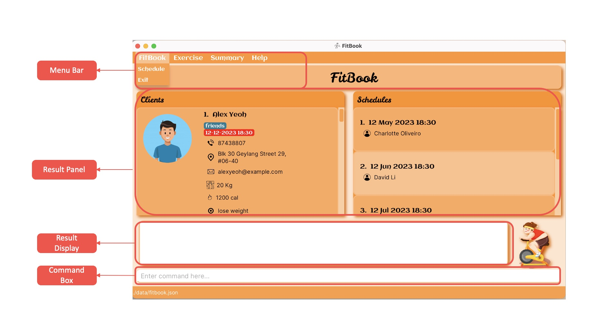

<h2>
About FitBook
</h2>

FitBook is a **desktop application for managing clients, optimized for use via a Command Line Interface** (CLI) while still having the benefits of a Graphical User Interface (GUI). If you can type fast, Fitbook can get your client management tasks done faster than traditional GUI apps.

This User Guide provides brief documentation on how you can install the application and describes how each feature should be used. Start by looking at the [quick start](#quick-start) guide to get you started.
* Table of Contents
{:toc}

--------------------------------------------------------------------------------------------------------------------

## Quick start

1. Before using FitBook, make sure to install **Java** `11` or later version in your Computer. This is required to ensure proper functionality of the application. Please install the correct Java version to use FitBook. 
   * To check Java version, please follow the instructions [here](https://blog.hubspot.com/website/check-java-verison).
   * If your computer does not have java installed, or if the version is older than Java 11, you may refer to the guide [here](https://docs.oracle.com/en/java/javase/11/install/overview-jdk-installation.html#GUID-8677A77F-231A-40F7-98B9-1FD0B48C346A).

2. **Download** the latest `fitbook.jar` from [here](https://github.com/AY2223S2-CS2103T-T15-2/tp/releases).

3. **Copy** the file to the folder you want to use as the _home folder_ for your FitBook.

4. Open a command terminal, `cd` into the folder you put the jar file in, and use the `java -jar fitbook.jar` command to run the application. 
   A GUI similar to the below should appear in a few seconds. Note how the app contains some sample data. 
   * If you are unsure how to open the command terminal, you may refer to the guide below.
   
     • [Windows](https://www.businessinsider.com/guides/tech/how-to-open-command-prompt)
   
     • [Mac](https://support.apple.com/en-sg/guide/terminal/apd5265185d-f365-44cb-8b09-71a064a42125/mac#:~:text=Click%20the%20Launchpad%20icon%20in,%2C%20then%20double%2Dclick%20Terminal)
   
     
   

5. Type the command in the command box and press Enter to execute it. e.g. typing **`help`** and pressing Enter will open the help window. 
   Some example commands you can try:

   * `listClients` : Lists all Clients.

   * `add n/John Doe p/98765432 e/johnd@example.com a/John street, block 123, #01-01 w/50 g/M` : Adds a contact named `John Doe` to the FitBook.

   * `delete 3` : Deletes the 3rd contact shown in the current list.

   * `clear` : Deletes all contacts.

   * `export` : Exports all Client's details in FitBook into a csv file.

   * `exportRoutine` : Exports all Routine details in FitBook into a csv file.

   * `addRoutine r/Cardio ex/3x5 1km Jog ex/3x10 Jumping Jacks` : Adds a new routine named `Cardio` with 2 exercises `3x5 1km Jog` and `3x10 Jumping Jacks`.

   * `exit` : Exits the app.

6. Refer to the [Features](#features) below for details of each command.

--------------------------------------------------------------------------------------------------------------------

## User Interface Introduction

This section provides a brief overview of the graphical user interface (GUI) components that are present in FitBook. These components are designed to provide an easy-to-use interface that enables users to track and improve their clients fitness goals.

### Menu Bar

The menu bar is typically located at the top of the user interface and is primarily used for navigation purposes. It provides users with access to various features and functions within the application or dashboard, allowing them to easily move between different sections or pages. The menu bar is commonly used in user guides to help users understand how to navigate and use the different features within the application.

#### Schedule
* 'Schedule' menu item allows you to switch to Schedule panel.

#### Exit
* Directly exits out of the application

#### Exercise
* 'Exercise' menu item allows you to switch to Exercise panel.

#### Summary
* 'Summary' menu item allows you to switch to Summary panel.

#### Help
* Provides a new tab outside FitBook with the link to the User Guide.

### Result Display

Panels are _empty_ when the data for that specific panel is _empty_.

#### Schedule
* Left panel (`Schedule` Panel) displays the list of clients basic information.
* Right panel (`Schedule` Panel) displays the list of appointments sorted chronologically. (Refresh the page by changing tabs or reopening FitBook to see the appointment get removed after it passes its deadline.)
  

  

#### Exercise
* Left panel (`Exercise` Panel) displays the list of clients basic information including weight, average calories, goal, any unique routines and exercises.
* Right panel (`Exercise` Panel) displays the list of routines added.

  

#### Summary
* Left panel (`Sumamary` Panel) displays the list of clients basic information including name and schedule appointments.
* Right panel (`Summary` Panel) displays all information about the selected client. (Using the view command)

  

### Feedback Box
When you enter a command into the Command Box of the application, the system will provide a feedback message to you through the display. This feedback message is designed to inform you of the status of the command you entered, such as whether it was executed successfully or encountered an error. The feedback message may also include additional information related to the command, such as the results of the command's execution or any other relevant details.
### Command Box
The Command Box is where you can type in your commands. To execute the command, simply press the "Enter" button on your keyboard. This will send the command to the system for processing.

---

## Features

**:information_source: Notes about the command format:** 

* These rules apply to all commands including for Clients and Routines.

* Words in `UPPER_CASE` are the parameters to be supplied by the user. 
  e.g. in `add n/NAME`, `NAME` is a parameter which can be used as `add n/John Doe`.

* Items in square brackets are optional. 
  e.g `n/NAME [t/TAG]` can be used as `n/John Doe t/friend` or as `n/John Doe`.

* Items with `…`​ after them can be used multiple times including zero times. 
  e.g. `[t/TAG]…​` can be used as ` ` (i.e. 0 times), `t/friend`, `t/friend t/family` etc.

* Parameters can be in any order. 
  e.g. if the command specifies `n/NAME p/PHONE_NUMBER`, `p/PHONE_NUMBER n/NAME` is also acceptable.

* If a parameter is expected only once in the command but you specified it multiple times, only the last occurrence of the parameter will be taken. 
  e.g. if you specify `p/12341234 p/56785678`, only `p/56785678` will be taken.

* Extraneous parameters for commands that do not take in parameters (such as `help`, `list`, `exit`, `export`, `exportRoutine`, `listRoutines`, `clearRoutines` and `clear`) will be ignored. 
  e.g. if the command specifies `help 123`, it will be interpreted as `help`.

* Client list can be found in the Client panel. Routine list can be found in the Routine Panel of the `Routine` tab.

### Prefixes for Client Commands

| Prefix   | Compulsory field for adding client | Multiple allowed? | Prefix Meaning                                   | Characters restrictions                                     |
|----------|------------------------------------|-------------------|--------------------------------------------------|-------------------------------------------------------------|
| `n/`     | Yes                                | No                | Name of Client                                   | AlphaNumeric and spaces                                     |
| `p/`     | Yes                                | No                | Phone number                                     | At least 3 digits                                           |
| `e/`     | Yes                                | No                | Email                                            | local-part@domain                                           |
| `a/`     | Yes                                | No                | Address                                          | Any characters except blank                                 |
| `w/`     | Yes                                | No                | Weight                                           | Positive number from 0.1 to 999.9 with 0 or 1 decimal place |
| `g/`     | Yes                                | No                | Gender                                           | M or F (not case sensitive)                                 |
| `c/`     | No                                 | No                | Recommended Calories                             | At least 4 digits long                                      |
| `gl/`    | No                                 | No                | Goal for Client                                  | Any characters except blank                                 |
| `r/`     | No                                 | Yes               | Routines for Client (Must be in Exercise Routine | Valid routine names in exercise routine portion             |
| `t/`     | No                                 | Yes               | Tag                                              | AlphaNumeric                                                |
| `app/`   | No                                 | Yes               | Appointment                                      | dd-mm-yyyy HH:mm format that is after current date time     |
| `d/`     | NA                                 | No                | Date used for adding weight                      | dd-mm-yyyy HH:mm format that is before current date time    |

### Prefixes for Routine Commands

| Prefix   | Compulsory field for adding routine | Multiple allowed? | Prefix Meaning | Characters restrictions |
|----------|-------------------------------------|-------------------|----------------|-------------------------|
| `r/`     | Yes                                 | No                | Routine Name   | AlphaNumeric and spaces |
| `ex/`    | No                                  | Yes               | Exercise Name  | AlphaNumeric and spaces |
| `exno/`  | NA                                  | No                | Exercise index | Numeric                 |

---

### Client Commands

#### Adding a client: `add`



Format: `add n/NAME p/PHONE_NUMBER e/EMAIL a/ADDRESS w/WEIGHT g/GENDER
[cal/RECOMMENDED_CALORIES_INTAKE] [g/GOAL] [r/ROUTINE]…​ [app/APPOINTMENT_TIME]…​ [t/TAG]…​`

* A client can have any number of `tags`, `appointments` and `exercise routines` (including 0).
* A user cannot add an exercise routine to client that does not exist in the exercise routine list in the `Exercise` tab.
* `APPOINTMENT` needs to be later than the current time, or it will get deleted.

:bulb: **Tip:** `Gender` should be either M or F (not case-sensitive). 

:bulb: **Tip:** `Routine` is case sensitive. 

:bulb: **Tip:** `Weight` is specified in kilograms (Kg). 

Examples:
* `add n/John Doe p/98765432 e/johnd@example.com a/John street, block 123, #01-01 w/50 g/M r/Cardio` (Cardio routine has to exist in exercise routine).
* `add n/Betsy Crowe t/friend e/betsycrowe@example.com a/Newgate Prison p/93125841 t/John's Friend w/55 g/F`
* `add n/Betsy Crowe app/12-12-2030 12:00 cal/2300 g/F e/betsycrowe@example.com a/Newgate Prison p/93125841 t/Friend`

#### Listing all clients : `listClients`



Format: `listClients`

:bulb: **Tip:** To list all clients in the client panel after using find.

* Initiate the command with `listClients`
* All clients in FitBook has been listed once again!

#### Editing a client : `edit`



Format: `edit CLIENT_INDEX n/NAME p/PHONE_NUMBER e/EMAIL a/ADDRESS w/WEIGHT g/GENDER
[cal/RECOMMENDED_CALORIES_INTAKE] [g/GOAL] [r/ROUTINE]…​ [app/APPOINTMENT_TIME]…​ [t/TAG]…​`

* Edits the client at the specified `CLIENT_INDEX`. The index refers to the index number shown in the displayed client list.
* The index **must be a positive integer** 1, 2, 3, …​ 
* The index must not contain signs +1, +2, +3, …​
* The index must not be larger than `Integer.MAX_VALUE` i.e. 2147483647
* At least one of the optional fields must be provided.
* Existing values will be updated to the input values.
* When editing `tags`,`appointments` and `routines`, the existing `tags`,`appointments` and `routines` of the client will be removed i.e adding of `tags`,`appointments` and `routines` are not cumulative.
* You can remove all the client’s tags by typing `t/` without specifying any tags after it. (same for `appointments` with `/app` prefix and `routines` with `/r`)
* `APPOINTMENT` needs to be later than the current time, or it will get deleted.

:bulb: **Tip:** `Gender` should be either M or F (not case-sensitive). 

:bulb: **Tip:** `Routine` is case sensitive. 

Examples:
*  `edit 1 p/91234567 e/johndoe@example.com` Edits the phone number and email address of the 1st client to be `91234567` and `johndoe@example.com` respectively.
*  `edit 2 n/Betsy Crower t/` Edits the name of the 2nd client to be `Betsy Crower` and clears all existing tags.
*  `edit 3 w/23.0` Edits the weight of the 3rd client to `23.0`.
*  `edit 4 w/25.0 g/m` Edits the weight and gender of the 4th client to `25.0` and `m`.

#### Locating clients by fields: `find`



Format: `find n/NAME p/PHONE e/EMAIL a/ADDRESS w/WEIGHT g/GENDER cal/CALORIE t/TAG
app/APPOINTMENT gl/GOAL…​`

:bulb: **Tip:** The search is case-insensitive. e.g `hans` will match `Hans` 

:bulb: **Tip:** Details containing the keyword will also be matched, even if both do not match exactly. e.g. `Han` will match `Hans`, `John` will match `John Li` and `John Tan`, `19` will match `1900` and `0190` 

Available Prefixes:
* `n` filters by Name
* `p` filters by Phone
* `e` filers by Email
* `a` filters by Address
* `t` filters by Tag
* `w` filters by Weight
* `g` filters by Gender
* `gl` filters by Goal
* `cal` filters by Calorie
* `app` filters by Appointment

Examples:
* `find n/Alex` returns every client with 'Alex' in their name.
* `find p/91234567` returns every client with phone numbers that match or contains '91234567'.
* `find n/Alex p/91234567` returns every client with 'Alex' in their name OR with phone numbers that match or contain
  '91234567'

#### Deleting a client : `delete`



Format: `delete INDEX`

* Deletes the client at the specified `INDEX`.
* The index refers to the index number shown in the displayed client list.
* The index **must be a positive integer** 1, 2, 3, …​
* The index must not contain signs +1, +2, +3, …​
* The index must not be larger than `Integer.MAX_VALUE` i.e. 2147483647

Examples:
* `list` followed by `delete 2` deletes the 2nd client in the FitBook.
* `find Betsy` followed by `delete 1` deletes the 1st client in the results of the `find` command.

#### Viewing a client summary: `view`



Format: `view INDEX`

* Views the summary of the client at the specified `INDEX`.
* The index refers to the index number shown in the displayed client list.
* The index **must be a positive integer** 1, 2, 3, …​
* The index must not contain signs +1, +2, +3, …​
* The index must not be larger than `Integer.MAX_VALUE` i.e. 2147483647

Examples:
* `view 1` views the summary of the first client in the FitBook.
* `find n/Alex` followed by `view 1` views the summary of the 1st client in the results of the `view` command.

#### Clearing all entries : `clear`


Format: `clear`

#### Exporting Client details : `export`



Format: `export`

* The exported client data includes:  
    * Name of Client
    * Phone number of Client
    * Email of Client
    * Address of Client
    * Weight of Client
    * Gender of Client
* Example generated CSV file when opened using Microsoft Excel:

  

### Client's Weight Commands

#### Adding new weight to a client: `addWeight`



Format: `addWeight INDEX w/WEIGHT d/DATE`

* Adds weight to the weight history of the client at the specified `INDEX`.
* The index refers to the index number shown in the displayed client list.
* The index must not contain signs +1, +2, +3, …​
* The index must not be larger than `Integer.MAX_VALUE` i.e. 2147483647
* The new `DATE` must be specified in `dd-MM-yyyy HH:mm` format.
* `DATE` field must be a date that has passed.
* `WEIGHT` field is specified in kilograms (Kg).

Examples:
* `addWeight 1 w/70 d/10-03-2023 18:00` adds weight 70kg to the weight history of the first client in the FitBook and dates the weight at 10 March 2023, 6pm.
* `find n/Alex` followed by `addWeight 1 w/70 d/10-03-2023 18:00` adds weight 70kg, dated 10 March 2023, 6pm to the weight history of the 1st client in the results of the `find` command.

#### Plotting weight history graph for a client: `graph`



Format: `graph INDEX`

* Plots the weight history of the client at the specified `INDEX`.
* The index refers to the index number shown in the displayed client list.
* The index **must be a positive integer** 1, 2, 3, …​
* The index must not contain signs +1, +2, +3, …​
* The index must not be larger than `Integer.MAX_VALUE` i.e. 2147483647
* The weight history graph will be shown only for weights dated within one month of the current date and time.

Examples:
* `graph 1` plots the weight history of the first client in the FitBook.
* `find n/Alex` followed by `graph 1` plots the weight history of the 1st client in the results of the `find` command.

Example:

---

### Exercise Routine Commands

* All routines and exercises must be in AlphaNumeric characters and spaces between characters are allowed.

#### Adding a routine: `addRoutine`



Format: `addRoutine r/ROUTINE_NAME [ex/EXERCISE]…​`

:bulb: **Tip:** A client can have any number of `Exercise` (including 0). 

Examples:
* `addRoutine r/Cardio`
* `addRoutine r/HIIT ex/3x10sets of Jumping ropes`

Example: (Adding Routine without any exercises)

#### Editing a routine : `editRoutine`



Format: `editRoutine ROUTINE_INDEX r/ROUTINE_NAME` or `editRoutine INDEX exno/EXERCISE_INDEX ex/EXERCISE`

* Edits the routine at the specified `ROUTINE_INDEX`. The index refers to the index number shown in the displayed routine list.
* The index **must be a positive integer** 1, 2, 3, …​
* The index must not contain signs +1, +2, +3, …​
* The index must not be larger than `Integer.MAX_VALUE` i.e. 2147483647
* At least one of the two types should be used. No mixture of the two types is not allowed.
* This command only allows the editing existing Routine's name or existing Exercise's name.

Examples:
*  `editRoutine 1 r/Cardio` Edits the routine name of the 1st routine to be `Cardio` respectively.
*  `editRoutine 2 exno/1 ex/3x10sets dumbbells` Edits the exercise of the 2nd routine to be `3x10sets dumbbells`.

#### Listing all Routines in FitBook : `listRoutines`



Format: `listRoutines`

* Initiate the command with 'listRoutines'
* All Routines in FitBook has been listed once again!

#### Locating Routines by name: `findRoutine`



Format: `findRoutine KEYWORD`

:bulb: **Tip:** The search is case-insensitive. e.g `cardio` will match `Cardio`. 

:bulb: **Tip:** The order of the keywords does not matter. e.g. `Fun swimming` will match `Swimming fun`. 

Examples:
* `findRoutine OPM`

Example:

#### Clearing all Routine entries : `clearRoutines`



Format: `clearRoutines`

#### Deleting a routine : `deleteRoutine`



Format: `deleteRoutine ROUTINE_INDEX`

* Deletes the routine at the specified `ROUTINE_INDEX`.
* The index refers to the index number shown in the displayed Routine list in the `Exercise panel`.
* The index **must be a positive integer** 1, 2, 3, …​
* The index must not contain signs +1, +2, +3, …​
* The index must not be larger than `Integer.MAX_VALUE` i.e. 2147483647

Examples:
* `listRoutines` followed by `deleteRoutine 2` deletes the 2nd Routine in FitBook.
* `findRoutine Cardio` followed by `deleteRoutine 1` deletes the 1st Routine in the results of the `findRoutine` command.

#### Adding an Exercise : `addExercise`



Format: `addExercise ROUTINE_INDEX ex/EXERCISE_NAME`

* Adds an exercise `EXERCISE_NAME` to the Routine in FitBook at the specified `ROUTINE_INDEX`.
* The `ROUTINE_INDEX` refers to the index number shown in the displayed Routine list in the exercise panel.
* The `ROUTINE_INDEX` **must be a positive integer** 1, 2, 3, …​
* The index must not contain signs +1, +2, +3, …​
* The index must not be larger than `Integer.MAX_VALUE` i.e. 2147483647

Examples:
* `listRoutines` followed by `addExercise 1 ex/push ups` adds the exercise `push ups` to the first Routine in the exercise list in FitBook.

#### Deleting an Exercise : `deleteExercise`



Format: `deleteExercise ROUTINE_INDEX EXERCISE_INDEX`

* Deletes the exercise specified by the `EXERCISE_INDEX` of the Routine in FitBook specified by `ROUTINE_INDEX`.
* The `ROUTINE_INDEX` refers to the index number shown in the displayed Routine list in the exercise panel.
* The `EXERCISE_INDEX` refers to the index number shown in the displayed Routine exercise list in the exercise panel.
* Both `ROUTINE_INDEX` and `EXERCISE_INDEX` **must be a positive integer and a valid integer according to the list displayed** 1, 2, 3, …​
* Both `ROUTINE_INDEX` and `EXERCISE_INDEX` must not contain signs +1, +2, +3, …​
* Both `ROUTINE_INDEX` and `EXERCISE_INDEX` must not be larger than `Integer.MAX_VALUE` i.e. 2147483647

Examples:
* `listRoutines` followed by `deleteExercise 1 2` deletes the exercise specified at index `2` from the Routine specified at index `1` in the Routine list in FitBook.
* `findRoutine Cardio` followed `deleteExercise 1 1` deletes the exercise specified at index `1` from the Routine specified at index `1` in the results of the `findRoutineCardio` command.

#### Exporting Routine details : `exportRoutines`



Format: `exportRoutines`

* The exported client data includes:  
    * Name of Routine
    * Exercises in the Routine

* Example generated CSV file when opened using Microsoft Excel:

  

---

### FitBook Miscellaneous Commands

#### Viewing help : `help`



Format: `help`

#### Exiting the program : `exit`



Format: `exit`

---

### FitBook Storage Usage

#### Saving the data

FitBook data are saved in the hard disk automatically after any command that changes the data. There is no need to save manually.

#### Editing the data file

FitBook data are saved as a JSON file `[JAR file location]/data/fitbook.json`. Advanced users are welcome to update data directly by editing that data file.

:exclamation: **Caution:**
If your changes to the data file makes its format invalid, FitBook will discard all data and start with an empty data file at the next run.

--------------------------------------------------------------------------------------------------------------------

## FAQ

**Q**: How do I transfer my data to another computer? 
**A**: Install the app in the other computer and overwrite the empty data file it creates with the file that contains the data of your previous FitBook home folder.

**Q**: Must I exit the FitBook app through the `exit` command? 
**A**: There is no need to exit the FitBook app through the `exit` command as everything is saved after each action changes to the list.

**Q**: Why can I not tag the exercise routine to the client? 
**A**: The exercise routine is probably not inside the list of routines or the routine name is wrong. The routine name is case-sensitive.

**Q**: When I try to edit my weight a few times, and it updates in the client panel, but the data does not show up on the graph? 
**A**: To view historical weight data on the line graph, more values of weight must be added using addWeight command. edit command only changes the latest weight of the client.

--------------------------------------------------------------------------------------------------------------------

## Command summary

| Action                                  | Format, Examples                                                                                                                                                                                                                                                                        |
|-----------------------------------------|-----------------------------------------------------------------------------------------------------------------------------------------------------------------------------------------------------------------------------------------------------------------------------------------|
| **Add**                                 | `add n/NAME p/PHONE_NUMBER e/EMAIL a/ADDRESS w/WEIGHT g/GENDER [cal/RECOMMENDED_CALORIES_INTAKE] [g/GOAL] [r/ROUTINE_NAME]…​ [app/APPOINTMENT_TIME]…​ [t/TAG]…​`   e.g., `add n/James Ho p/22224444 e/jamesho@example.com a/123, Clementi Rd, 1234665 t/friend t/colleague w/55 g/M` |
| **Clear all client entries in FitBook** | `clear`                                                                                                                                                                                                                                                                                 |
| **Delete**                              | `delete INDEX`  e.g., `delete 3`                                                                                                                                                                                                                                                     |
| **Edit**                                | `edit CLIENT_INDEX n/NAME p/PHONE_NUMBER e/EMAIL a/ADDRESS w/WEIGHT g/GENDER [cal/RECOMMENDED_CALORIES_INTAKE] [gl/GOAL] [r/ROUTINE_NAME]…​ [app/APPOINTMENT_TIME]…​ [t/TAG]…​`  e.g.,`edit 2 n/James Lee e/jameslee@example.com`                                                    |
| **Find**                                | `find n/NAME p/PHONE e/EMAIL a/ADDRESS w/WEIGHT g/GENDER cal/CALORIE t/TAG app/APPOINTMENT gl/GOAL`  e.g., `find n/James Jake e/jamesjake@example.com`                                                                                                                               |
| **List**                                | `listClients`                                                                                                                                                                                                                                                                           |
| **Help**                                | `help`                                                                                                                                                                                                                                                                                  |
| **Export Client Details**               | `export`                                                                                                                                                                                                                                                                                |
| **Add Exercise**                        | `addExercise ROUTINE INDEX ex/EXERCISE`   e.g, `addExercise 1 ex/4 x 3 sprints`                                                                                                                                                                                                      |
| **Add Routine**                         | `addRoutine r/ROUTINE_NAME [ex/EXERCISE]…​`   e/g, `addRoutine r/Cardio ex/3x5 1km Jog ex/3x10 Jumping Jacks `                                                                                                                                                                       |
| **Edit Routine** (routine name)         | `editRoutine ROUTINE_INDEX r/ROUTINE_NAME`   e/g, `editRoutine 1 r/Cardio`                                                                                                                                                                                                           |
| **Edit Routine** (exercise)             | `editRoutine INDEX exno/EXERCISE_INDEX ex/EXERCISE`   e/g, `editRoutine 1 exno/1 ex/3x10sets of Dumbbell curls`                                                                                                                                                                      |
| **Delete Exercise**                     | `deleteExercise ROUTINE INDEX EXERCISE INDEX`   e.g, `deleteExercise 1 2`                                                                                                                                                                                                            |
| **Delete Routine**                      | `deleteRoutine ROUTINE INDEX `   e.g, `deleteRoutine 1`                                                                                                                                                                                                                              |
| **List Routine**                        | `listRoutines`                                                                                                                                                                                                                                                                          |
| **Clear Routine**                       | `clearRoutines`                                                                                                                                                                                                                                                                         |
| **Find Routine**                        | `findRoutine ROUTINE NAME`   e.g, `findRoutine Cardio`                                                                                                                                                                                                                               |
| **Export Routine Details**              | `exportRoutine`                                                                                                                                                                                                                                                                         |
| **Add weight**                          | `addWeight INDEX w/WEIGHT d/DATE`  e.g., `addWeight 1 w/70 d/10-10-2023 18:00`                                                                                                                                                                                                       |
| **Graph**                               | `graph INDEX`  e.g., `graph 1`                                                                                                                                                                                                                                                       |
| **View**                                | `view INDEX`  e.g., `view 1`                                                                                                                                                                                                                                                         |

