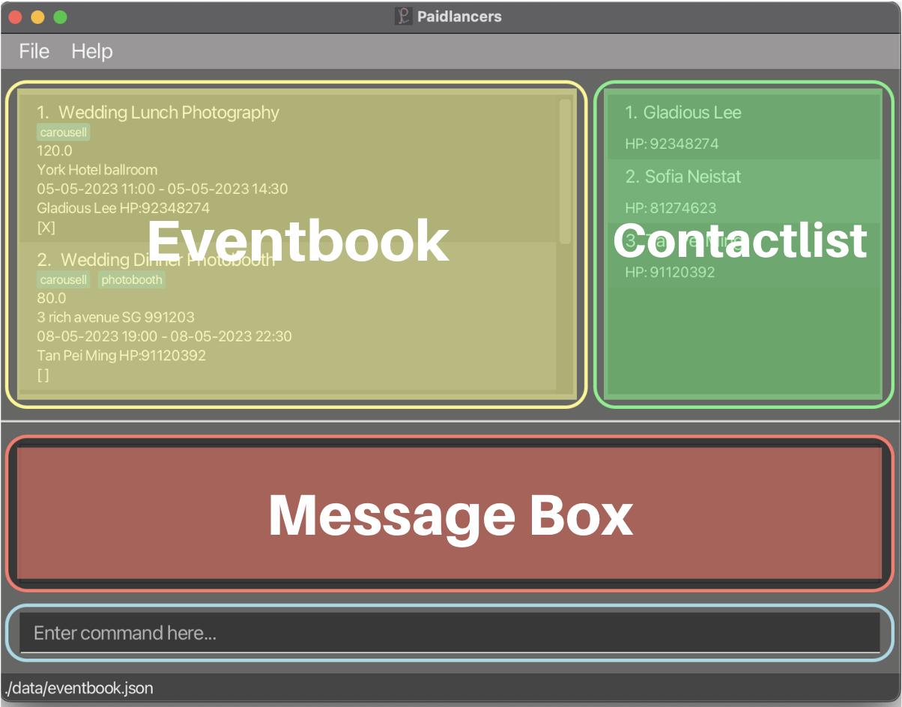

Welcome to the Paidlancers User Guide! This user guide is targeted towards freelancers who are new to using Paidlancers
or freelancers who need a reference guide to help them achieve the full potential of Paidlancers.

We're really thrilled to have you here! At Paidlancers, we know that freelancing can be both rewarding and challenging.
As freelancers ourselves, we understand the unique obstacles and opportunities that come with freelancing. That's why we
created Paidlancers – a desktop app designed to help you streamline your freelancing event management tasks.

## Introducing Paidlancers

Paidlancers is a **desktop app for keeping track of your freelancing events, optimised for use via a Command Line
Interface (CLI)** while still having the benefits of a Graphical User Interface (GUI). Paidlancers is optimised for fast
typists to get event management tasks done faster than traditional GUI apps!

This user guide will help you get up to speed in no time!

## Table of Contents
- [Using the examples in this Guide](#using-the-examples-in-this-guide)
- [User Interface](#user-interface)
- [Quick Start](#quick-start)
- [Features](#features)
  <!-- <details>
    <summary>Click to expand</summary>
   -->
    * [Add a Contact](#add-a-contact)
    * [Clear all Events](#clear-all-events)
    * [Create New Event](#create-new-event)
    * [Delete an Event](#delete-an-event)
    * [Edit an Event](#edit-an-event)
    * [Exit application](#exit-application)
    * [Find Event](#find-event)
    * [Link Contact to Event](#link-contact-to-event)
    * [List all Events](#list-all-events)
    * [Mark Event as Done](#mark-event)
    * [Unmark an Event](#unmark-event)
    * [View Total Revenue](#view-total-revenue)
    * [View Upcoming Events](#view-upcoming-events)
    * [Save data](#save-data)
<!-- 
    </details> -->
- [FAQ](#faq)
- [Features Summary](#features-summary)


--------------------------------------------------------------------------------------------------------------------

## Using the examples in this Guide
The examples given in this guide are formatted with the following conventions:

`commandword PARAMETERS`

**Command Word**
- Command word is the first word in any command.
- It is written in lowercase.
- These include examples such as `linkcontact` or `edit`.

**Parameters**
- Parameters are the words that follow the command word.
- Parameters are written in UPPERCASE.
- These include examples such as `INDEX` or `PHONE`.
- Parameters are meant to be replaced by the user with the relevant information.
- All parameters are required unless wrapped with `[square brackets]`.

**Example**
- Examples are shown in the format `commandword parameters`.
- This is followed by the expected outcome of the command.
- These include examples such as `newcontact n/John Doe p/98765432`.
- These are meant to be used as a reference for the user to see how the command should be formatted.
- The expected action of this command is written behind.

--------------------------------------------------------------------------------------------------------------------
## User Interface

At Paidlancers, we understand that time is money, and every second matters for freelancers.
That's why we've designed our app with a user interface (UI) that optimizes productivity, streamlines workflows,
and ensures freelancers can get the most out of every moment.


The UI is split into 4 main parts
- Eventbook
  - This is where the events that you specified are displayed.
- Contactlist
  - This is where the contacts you have stored are displayed.
- Message Box
  - This is where the messages regarding the status of your commands are displayed.
- Command Box
  - This is where you can enter your commands. Press `Enter` to execute the command.

--------------------------------------------------------------------------------------------------------------------
## Quick start

1. Ensure you have Java `11` or above installed in your Computer.
    * If you think that you have Java installed. you can input command `java -version` into the command terminal to
   display current version of java installed.
      * If the command is not recognized, you can install Java `11` from this link
      [here](https://www.oracle.com/java/technologies/javase-jdk11-downloads.html).
      * Any version that is under the Java version `11` will work. (E.G. `11.0.1`, `11.1.5`).
    * Mac Users are encouraged to use the Azul build of OpenJDK11 version found
      [here](https://www.azul.com/downloads/?version=java-11-lts&os=macos&architecture=arm-64-bit&package=jdk-fx).
    * Choose the `JDK FX` version and not any other version.

2. Download the latest `Paidlancers.jar` from [here](https://github.com/AY2223S2-CS2103T-T11-3/tp/releases).

3. Copy the file to the folder you want to use as the _main folder_ for Paidlancers. (Do note that the application will
create other folders and files in this folder as well.)

4. Open Terminal / Command Prompt, `cd <foldername>` to into the folder you put the jar file in, and use the `java -jar
Paidlancers.jar` command to run the application.<br>
   - A GUI similar to the screenshot below should appear in a few seconds. Note how the app contains some sample data.<br>
      

<div markdown="span" class="alert alert-primary">:bulb: Tip:
A command prompt is a text-based interface in which you can enter commands to interact with your computer. It's a way to
give your computer specific instructions by typing commands into a text field rather than using a graphical user
interface (GUI) with icons and menus!
</div>

5. Type the command in the command box and press Enter to execute it.
   Some example commands you can try:

    * `list` : Lists all events.

    * `newcontact n/John Doe p/98765432` : Adds a contact named `John Doe` to the contact list.

    * `delete 3` : Deletes the 3rd event shown in the current list.

6. Refer to the [Features](#features) below for details of each command.

7. When you are ready to start, you can use the `clear` command to clear all the sample data.

8. Happy ~~free~~Paidlancing!

--------------------------------------------------------------------------------------------------------------------

## Features

### Add a Contact: `newcontact` <a id = "add-a-contact"></a>

This command allows you to add client contacts.

You can add the contacts of your clients to the contact list so that you can easily refer to them when you are
viewing events.

**Format**: `newcontact n/NAME p/NUMBER`

- Creates a new contact with specified `NAME` and `NUMBER`

**Note**:
- `NAME` should only contain alphanumeric characters and spaces.
- `NUMBER` should only contain numbers between 8 and 15 digits long.

**Example**:
- `newcontact n/Deborah Tan p/91234567`
  - This command will create a new contact named `Deborah Tan` with phone number `91234567`.
  - Example expected output:
  ```
  New contact added: Deborah Tan; Phone: 91234567
  ```
<br/>

- `newcontact n/Tan Jun Wei p/82828234`
  - This command will create a new contact named `Tan Jun Wei` with phone number `82828234`.
  - Example expected output:
  ````
    New contact added: Tan Jun Wei; Phone: 82828234
  ````
  
 
Before adding Deborah Tan into the contact list


After adding Deborah Tan into the contact list

### Clear all Events and Contacts: `clear` <a id = "clear-all-events"></a>

This command will clear all events in Paidlancers.

You may wish to use this command to clear all events and contacts in Paidlancers
once you get familiarized with Paidlancers!

**Format**: `clear`

<div markdown="span" class="alert alert-warning">:exclamation: Caution:
This is a destructive command. Once you clear all events and contacts, there is no way to recover them!
Please be careful when using this command.
</div>

### Create new Event: `newevent` <a id = "create-new-event"></a>

This command will add a new event into Paidlancers.

You may wish to use this command to add new events into Paidlancers.

**Format**: `newevent n/NAME r/RATE a/ADDRESS ds/START_TIME de/END_TIME [t/TAG]…`
- Creates a new event with specified `NAME`, `RATE`, `ADDRESS`, `START_TIME`, `END_TIME` and optionally `TAGS`.

**Note**:
- `NAME` should only contain alphanumeric characters and spaces.
- `RATE` must be a positive number
- `RATE` must be below 1,000,000.
- `ADDRESS` can be in any form, "John's House".
- Both `START_TIME` and `END_TIME` must have the format `dd-MM-yyyy HH:mm`.

**Example**:
- `newevent n/DJ at wedding r/100 a/311, Clementi Ave 2, #02-25 ds/11-03-2023 11:00 de/11-03-2023 17:00 t/friends t/dj`
  - This command will create a new event named `DJ at wedding` with rate `100` at address `311, Clementi Ave 2, #02-25` from `11-03-2023 11:00` to `11-03-2023 17:00` with tags `friends` and `dj` as shown below:
  ````
  New event added: DJ at wedding; Rate: 100.00; Address: 311, Clementi Ave 2, #02-25; Timing: 11-03-2023 11:00 to 11-03-2023 17:00; Mark: [ ]; Tags: [dj][friends]
  ````


### Delete an Event: `delete` <a id = "delete-an-event"></a>

You can delete specified events in Paidlancers.

**Format**: `delete INDEX`

- Deletes the event at the specified `INDEX`

**Note**:
- The `INDEX` refers to the index number shown in the displayed event list.
- The `INDEX` must be a positive integer 1, 2, 3, …
- The `INDEX` must be below 1,000,000.

**Example**:
- `delete 2`
  - This command will delete the 2nd event in the event list.
  - Example expected output:
  ````
  Deleted Event: DJ at wedding; Rate: 100.00; Address: 311, Clementi Ave 2, #02-25; Timing: 11-03-2023 11:00 to 11-03-2023 17:00; Mark: [ ]; Tags: [dj][friends]
  ````


Before deleting 2nd event


After deleting 2nd event

### Edit an Event: `edit` <a id = "edit-an-event"></a>

This command allows you to edit the existing events in Paidlancers.

This command is helpful if you have made any mistakes when creating the event.

**Format**: `edit INDEX [n/NAME] [r/RATE] [a/ADDRESS] [ds/TIMING] [de/TIMING] [t/TAG]...`

- Edits the event at the specified `INDEX`

**Note**:
- The `INDEX` refers to the index number shown in the displayed event list.
- The `INDEX` must be a positive integer 1, 2, 3, …
- The `INDEX` must be below 1,000,000.
- `[]` are optional parameters.
- At least one of the optional fields must be provided.
- Tags can be removed by typing `t/` without specifying any tags after it.
- Existing tags will be removed when editing tags, it will be necessary to input all the existing tags during the edit.
- Do note that `edit` is only for editing the event details, not the contact details.
- To link the event to a new contact, consider using [`linkcontact`](#link-contact-to-event) instead.

**Example**:
- `edit 2 r/100`
  - This command will edit the rate of the 2nd event to be `100`.
  - Example expected output:
  ````
  Edited Event: DJ at wedding; Rate: 100.00; Address: 311, Clementi Ave 2, #02-25; Timing: 11-03-2023 11:00 to 11-03-2023 17:00; Mark: [ ]; Tags: [dj][friends]
  ````
- `edit 2 n/Wedding Dinner t/`
  - This command will edit the name of the 2nd event to be `Wedding Dinner` and remove all tags.
  - Example expected output:
  ````
  Edited Event: Wedding Dinner; Rate: 100.00; Address: 311, Clementi Ave 2, #02-25; Timing: 11-03-2023 11:00 to 11-03-2023 17:00; Mark: [ ]
  ````
- `edit 2 n/Wedding Lunch`
  - This command will edit the name of the 2nd event to be `Wedding Lunch`.
  - Example expected output:
  ````
  Edited Event: Wedding Lunch; Rate: 100.00; Address: 311, Clementi Ave 2, #02-25; Timing: 11-03-2023 11:00 to 11-03-2023 17:00; Mark: [ ]
  ````
  

Before editing 1st event to Wedding Dinner Photography at Carlton Hotel ballroom


After editing 1st event to Wedding Dinner Photography at Carlton Hotel ballroom


### Exit application: `exit` <a id = "exit-application"></a>

This command will close Paidlancers! Alternatively, you may wish to exit through the close button on your application!

**Format**: `exit`


### Find Event: `find` <a id = "find-event"></a>

This command will find event(s) from the event book based on the given search string.

You can use this command to search through the event list.

**Format**: `find KEYWORD [MORE_KEYWORDS]`

- Finds the event using the specified `KEYWORD`

**Note**:
- The `KEYWORD` refers to the string to search the event list for.
- `[]` are optional parameters.
- `find` will return all events that contain the `KEYWORD` in their name.
- `find` is case-insensitive.

**Example**:
- `find wedding`
  - This command will find and list all events that contains 'wedding' in its name.
- `find wedding dinner`
  - This command will find and list all events that contains 'wedding' or 'dinner' in its name.

### Link Contact to Event: `linkcontact` <a id = "link-contact-to-event"></a>

This command will link a client contact to an event.

You may wish to link a contact to an event if you have already added the contact to Paidlancers.

**Format**: `linkcontact INDEX PHONE`

- Links contact using `PHONE` to the event at the specified `INDEX`

**Note**:
- The `INDEX` refers to the index number in the displayed events list.
- The `INDEX` must be a positive integer 1, 2, 3, …
- The `INDEX` must be below 1,000,000.
- The `PHONE` must be a valid phone number in the contact list.

**Example**:
- `linkcontact 2 91234567`
  - This command will link the contact with phone number `91234567` to the 2nd event in the event list.
  - Example expected output:
  ````
  Successfully linked! Wedding Lunch; Rate: 100.00; Address: 311, Clementi Ave 2, #02-25; Timing: 11-03-2023 11:00 to 11-03-2023 17:00; Mark: [ ]
  ````


Before linking 2nd event to contact with phone number 91234567


After linking 2nd event to contact with phone number 91234567

### List all Events: `list` <a id = "list-all-events"></a>

Displays all events.

**Format**: `list`

### Mark Event as Done: `mark` <a id = "mark-event"></a>

This command marks a specified event in Paidlancers as done.

You may wish to indicate that an event has been completed using this command!

**Format**: `mark INDEX`

- Marks the event at the specified `INDEX` as done

**Note**:
- The `INDEX` refers to the index number in the displayed events list.
- The `INDEX` must be a positive integer 1, 2, 3, …
- The `INDEX` must be below 1,000,000.

**Example**:
- `mark 2`
  - This command will mark the 2nd event in the event list as done.
  - Example expected output:
  ````
  Marked event: Wedding Lunch; Rate: 100.00; Address: 311, Clementi Ave 2, #02-25; Timing: 11-03-2023 11:00 to 11-03-2023 17:00; Mark: [X]; Contact: Gladious Lee; Phone: 92348274
  ````
  

Before marking 1st event


After marking 1st event


### Unmark an Event: `unmark` <a id = "unmark-event"></a>

This command unmarks a specified event in Paidlancers.

You may wish to undo the mark command using this!

**Format**: `unmark INDEX`

- Unmarks the event at the specified `INDEX`

**Note**:
- The `INDEX` refers to the index number in the displayed events list.
- The `INDEX` must be a positive integer 1, 2, 3, …
- The `INDEX` must be below 1,000,000.

**Example**:
- `unmark 2`
  - This command will unmark the 2nd event in the event list.
  - Example expected output:
  ````
  Unmarked event: Wedding Lunch; Rate: 100.00; Address: 311, Clementi Ave 2, #02-25; Timing: 11-03-2023 11:00 to 11-03-2023 17:00; Mark: [ ]; Contact: Gladious Lee; Phone: 92348274
  ````

### View Total Revenue: `revenue` <a id = "view-total-revenue"></a>

Displays the total revenue based on all the events marked as done.

**Format**: `revenue`
- Example expected output:
  ````
  The total revenue is: 200.00
  ````

### View Upcoming Events: `remind` <a id = "view-upcoming-events"></a>

Displays events that start within a specified number of days.

You may wish to use this command to find out the events that are coming up soon!

**Format**: `remind DAYS`

- Displays events that start within the specified number of `DAYS`

**Note**:
- `DAYS` must be a positive integer 1, 2, 3, …
- `DAYS` must be below 1,000,000.
- Only events that start after the current date and time will be displayed.
- The number of days to an event are the days from today's date to the event's start date. Their times are not considered.

**Example**:

Assume the current date and time is 22-03-2023 11:00.

- `remind 2`
  - This command will display events that start within 2 days. These are events that start on:
    * 22-03-2023 after 11:00
    * 23-03-2023 the whole day
    * 24-03-2023 the whole day
  - Note that 24-03-2023 is within 2 days of 22-03-2023, so events on 24-03-2023 that start more than 48 hours from the current date and time are displayed.

### Save data: <a id = "save-data"></a>

Paidlancers data are saved in the hard disk automatically on command issue. There is no need to save manually.


--------------------------------------------------------------------------------------------------------------------

## FAQ

**Q**: How do I transfer my data to another Computer?
1. Follow the [quickstart](#quick-start) guide until step 3.
2. In the same _main folder_ as your Paidlancers, copy the old data folder from your old computer to the new computer.
   - Your _main folder_ should contain the following files and folders:
    ```
       Paidlancers.jar
       data/
           contactlist.json
           eventbook.json
    ```
3. Run the jar file as per usual!

--------------------------------------------------------------------------------------------------------------------

## Features Summary
|                      Features                      |                                Features Format                                |                                                     Example Usage                                                     |
|:--------------------------------------------------:|:-----------------------------------------------------------------------------:|:---------------------------------------------------------------------------------------------------------------------:|
|          [Add a Contact](#add-a-contact)           |                         `newcontact n/NAME p/NUMBER`                          |                                         `newcontact n/Deborah Tan p/91234567`                                         |
| [Clear all Events and Contacts](#clear-all-events) |                                    `clear`                                    |                                                        `clear`                                                        |
|       [Create New Event](#create-new-event)        |     `newevent n/NAME p/rate a/ADDRESS ds/START_TIME de/END_TIME [t/TAG]…`     | `newevent n/DJ at wedding p/100 a/311, Clementi Ave 2, #02-25 ds/11-03-2023 11:00 de/11-03-2023 17:00 t/friends t/dj` |
|        [Delete an Event](#delete-an-event)         |                                `delete INDEX`                                 |                                                      `delete 2`                                                       |
|          [Edit an Event](#edit-an-event)           | `edit INDEX [n/NAME] [r/RATE] [a/ADDRESS] [ds/TIMING] [de/TIMING] [t/TAG]...` |                                                    `edit 2 r/100`                                                     |
|       [Exit application](#exit-application)        |                                    `exit`                                     |                                                        `exit`                                                         |
|             [Find Event](#find-event)              |                        `find KEYWORD [MORE_KEYWORDS]`                         |                                                 `find wedding dinner`                                                 |
|  [Link Contact to Event](#link-contact-to-event)   |                          `linkcontact INDEX CONTACT`                          |                                               `linkcontact 2 91234567`                                                |
|        [List all Events](#list-all-events)         |                                    `list`                                     |                                                        `list`                                                         |
|         [Mark Event as Done](#mark-event)          |                                 `mark INDEX`                                  |                                                       `mark 2`                                                        |
|          [Unmark an Event](#unmark-event)          |                                `unmark INDEX`                                 |                                                      `unmark 2`                                                       |
|     [View Total Revenue](#view-total-revenue)      |                                   `revenue`                                   |                                                       `revenue`                                                       |
|   [View Upcoming Events](#view-upcoming-events)    |                                 `remind DAYS`                                 |                                                      `remind 2`                                                       |
|              [Save data](#save-data)               |                                      NIL                                      |                                                          NIL                                                          |

Thank you for taking the time to read through this user guide :smile: ! We hope that it has provided you with the
information you need to make the most out of Paidlancers! :innocent:

We sincerely hope that you will enjoy using Paidlancers! If you have any question or feedback :thought_balloon:, please
contact us [here](https://github.com/AY2223S2-CS2103T-T11-3/tp/issues/new) by raising a new issue via GitHub! (Do note
that you may need a GitHub account to do so.)

We value your feedback and are always looking for ways to improve our product and user experience. Thank you for
using Paidlancers, and we look forward to serving you in the future. All the best fellow Paidlancers! :muscle:

<div style="position: fixed; font-size: large; bottom: 25px; right: 50px; background-color: #d8d8d8">
  <a href="#top">Back to top</a>
</div>
<br>
