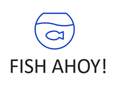

Fish Ahoy! Is a **desktop app for managing your fish, fish tanks, and relevant tasks, optimized for use via a Command Line Interface** (CLI) while still having the benefits of a Graphical User Interface (GUI).

* Table of Contents 
  * [Quickstart](#quick-start)
  * [Features](#features)
    * [Help](#viewing-help--help)
    * [Adding a tank `add tank`](#adding-a-tank-add)
    * [Adding a fish `add fish`](#adding-a-fish-add)
    * [Adding a task `add task`](#adding-a-task-add)
    * [Listing tanks `list tank`](#listing-tanks-list-tank)
    * [Listing fishes `list fish`](#listing-fishes-list-fish)
    * [Listing fishes in a tank `list fish /tank`](#listing-fishes-in-a-tank-list-fish-tank)
    * [Listing tasks `list task`](#listing-tasks-list-task)
    * [Deleting a tank `delete tank`](#deleting-a-tank-delete-tank)
    * [Deleting a fish `delete fish`](#deleting-a-fish-delete-fish)
    * [Deleting a task `delete task`](#deleting-a-task-delete-task)
  * [FAQ](#faq)
  * [Summary](#command-summary)

--------------------------------------------------------------------------------------------------------------------

## Quick start

1. Ensure you have Java 11 or above installed in your Computer.
2. Download the latest fishahoy.jar from here.
3. Copy the file to the folder you want to use as the home folder for Fish Ahoy!.
4. Open a command terminal, `cd` into the folder you put the jar file in, and use the `java -jar fishahoy.jar` command to run the application.

A GUI similar to the below should appear in a few seconds. Note how the app contains some sample data.

   

5. Type a command in the command box and press Enter to execute it.
   Some examples:
   * `add fish /name guppy /tank Freshwater tank 1`: Add a fish to your fish book.

6. Refer to the [Features](#Features) below for details of each command.

--------------------------------------------------------------------------------------------------------------------

## Features

**:information_source: Notes about the command format:** 

### Viewing help : `help`

Shows a message explaning how to access the help page.

Format: `help`

### Adding a tank: `add`

Adds a tank to the app.

Format: `add tank /tank <TANK_NAME>`

### Adding a fish: `add`

Adds a fish to the app.

Format: `add fish /name <FISH_NAME> /tank <TANK_NAME>`

:bulb: **Tip:**
A fish can belong to a tank

### Adding a task: `add`

Adds a task to the app.

Format: `add task /name <TASK_NAME> /by <DD/MM/YYYY>`

### Listing tanks: `list tank`

Lists all tanks created.

Format: `list tank`

### Listing fishes: `list fish`

Lists all fishes owned.

Format: `list fish`

### Listing fishes in a tank: `list fish /tank`

Lists all fishes in a specific tank.

Format: `list fish /tank <TANK_NAME>`

### Listing tasks: `list task`

Lists all tasks created.

Format: `list task`

### Deleting a fish: `delete fish`

Deletes a fish entry from the app.

Format: `delete fish /name <FISH_NAME>`

### Deleting a tank: `delete tank`

Delete a tank entry from the app.

Format: `delete tank /tank <TANK_NAME>`

### Deleting a task: `delete task`

Delete a task entry from the app.

Format: `delete task /name <TASK_NAME>`

### Saving the data

App data is saved in the hard disk automatically after any command that changes the data. There is no need to save manually.

### Editing the data file

App data are saved as a JSON file `[JAR file location]/data/fishahoy.json`. Advanced users are welcome to update data directly by editing that data file.

:exclamation: **Caution:**
If your changes to the data file makes its format invalid, Fish Ahoy! will discard all data and start with an empty data file at the next run.

### Archiving data files `[coming in v2.0]`

_Details coming soon ..._

--------------------------------------------------------------------------------------------------------------------

## FAQ

**Q**: How do I transfer my data to another Computer? 
**A**: Install the app in the other computer and overwrite the empty data file it creates with the file that contains the data of your previous Fish Ahoy! home folder.

--------------------------------------------------------------------------------------------------------------------

## Command summary

Action | Format, Examples
--------|------------------
**Add** | `add  fish` etc.
**Clear** | `clear` **Coming soon**
**Delete** | `delete INDEX`  e.g., `delete 3`
**Edit** | **Coming soon**
**Find** | `find KEYWORD [MORE_KEYWORDS]`  **Coming soon**
**List** | `list`
**Help** | `help`
