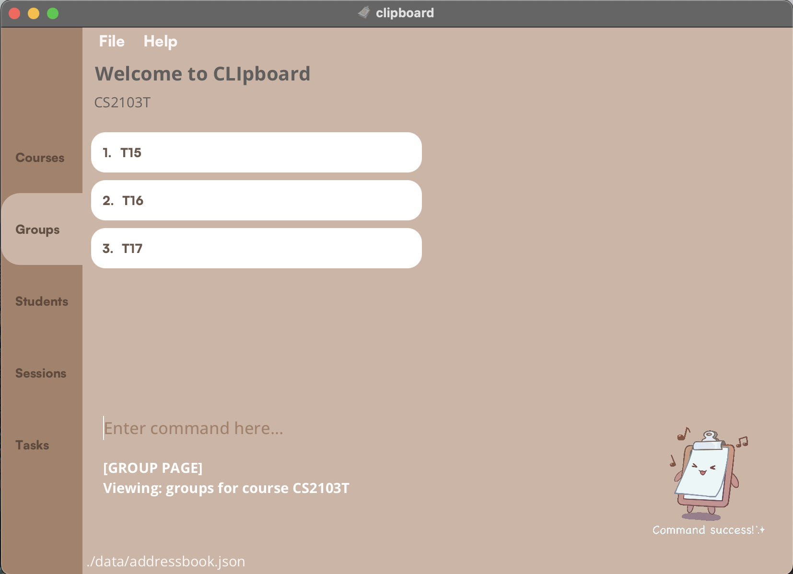

## Welcome

<div style="display: flex; align-items: center;">
  <p>CLIpboard is a user-friendly desktop application that helps educators manage their students' particulars. </p>
  
</div>
CLIpboard was created with love by real teachers who faced the everyday challenge of managing large amounts of class information. We hope that CLIpboard will be able to serve you as reliably as it has for us.

ClIpboard will be great for you too if:

1. You have to manage lots of students and classes
2. You prefer typing
3. You dislike dealing with boring spreadsheets

In this guide, we will walk you through the entire CLIpboard experience, whether you're a beginner learning to set up, or you're an advanced user looking to take your skills to the next level, you're in the right place.

Let's dive in!

- [Definitions](#definitions)
- [Getting Started](#getting-started)
  - [Setting Up](#setting-up)
  - [Quick Start](#quick-start)
  - [Visual Guide](#visuals)
  - [Navigation Guide](#navigation)
- [Features](#features)
  - [Commands](#commands)
  - [General Features](#general-features)
  - [Managing Courses](#managing-courses)
  - [Managing Groups](#managing-groups)
  - [Managing Students](#managing-students)
  - [Managing Sessions](#managing-sessions)
  - [Managing Attendance](#managing-the-attendance-of-a-session)
  - [Managing Tasks](#managing-tasks)
  - [Managing Grades](#managing-the-grades-of-a-task)
- [Further Help and Support](#further-help-and-support)

---

## Definitions
In this guide, you may come across some terms and conventions that you may be unfamiliar with. This section serves as a quick reference for these concepts.

* **Command**: A line of text that CLIpboard recognises as an instruction to execute.
* **Path**: A line of text that describes a file location on a computer.
  - Example: `C:/Users/AlexYeoh/Desktop/A0123456X.png` is a file path.
* **Navigate**: Switching between the multiple pages that CLIpboard offers. (See the [Navigation Guide](#navigation) for more information)
* Text formatted like `this` represents a program-related element. Depending on context, it can mean:
  1. A command that CLIpboard recognises
     - Example: `add group t15-4` is a valid command you can execute.
  2. A file path
  3. A keyboard key
  4. An element in the visual interface (See the [Visuals](#visuals) section for more details)
* **">" (Forward Angle Bracket)**: Indicates a sequence of actions for you to take.
  - Example: "Click on `File > Exit`" means you should click on `File`, then `Exit`.
* **Note**: Important information to be aware of.

<div markdown="span" class="alert alert-info">:information_source: **Note:**
 A note looks like this.
</div>

* **Tip**: Useful information to help you enhance your skills with CLIpboard.

<div markdown="span" class="alert alert-primary">:bulb: **Tip:**
A tip looks like this.
</div>

* **Caution**: Critical information about how CLIpboard behaves. Disregarding these might cause CLIpboard to not behave as you would expect.

<div markdown="span" class="alert alert-warning">:exclamation: **Caution:**
A caution looks like this.
</div>

---

## Getting started

### Setting up
#### Installation
1. Ensure you have Java 11 or above installed on your Computer.
2. Download the latest `clipboard.jar` from [here](https://github.com/AY2223S2-CS2103T-T15-4/tp/releases).
3. Copy `clipboard.jar` to the folder you want to use as the home folder of CLIpboard.

#### Launching CLIpboard
*Option 1*:
* Double-click on `clipboard.jar` to run it. If this does not work, go to *Option 2*.

*Option 2*:
1. Open a command terminal. [Guide to open a command terminal (External link)](https://www.ionos.com/help/email/troubleshooting-mail-basicmail-business/access-the-command-prompt-or-terminal/#:~:text=Open%20Command%20Prompt%20in%20Windows,cmd%22%20and%20then%20click%20OK.).
2. Copy the file path of the **folder** you put `clipboard.jar` in.
    * Guides for getting a file path (External links):
      * [On Windows](https://www.howtogeek.com/670447/how-to-copy-the-full-path-of-a-file-on-windows-10/)
      * [On MacOS](https://support.apple.com/en-sg/guide/mac-help/mchlp1774/mac#:~:text=Show%20the%20path%20to%20a%20file%20or%20folder&text=Choose%20View%20%3E%20Show%20Path%20Bar,bottom%20of%20the%20Finder%20window.)
      * [On Linux](https://www.tutorialspoint.com/get-the-full-path-of-a-file-in-linux)
3. In the command terminal, type `cd <FILE_PATH>`, where `<FILE_PATH>` is the file path you found in step 2.
4. Type `java -jar clipboard.jar` into the command terminal and press `ENTER` to launch CLIpboard.&nbsp;

If you see something like this, you're good to go!<br>

<br>
*CLIpboard contains some sample data if there is no initial data, as is the case when you first launch it.*

### Quick Start

1. When you first launch CLIpboard, you will be brought to the `Course page`.
2. Type your command in the [`Command Box`](#visuals) and press `ENTER/RETURN` to execute it.
   <br>e.g. typing `help` and pressing the `ENTER/RETURN` key will open the help window.
   <br>Some example commands you can try:
   1. `select 1` : Selects the first course displayed (eg. `CS2103T`) on the `Course Page`. You will be redirected to the `Group Page`.
   2. `select 1` : Selects the first group displayed (eg. `T15`) on the `Group Page`. You will be redirected to the `Student Page`.
   3. `add student n/John Doe p/98765432 e/johnd@example.com sid/A1234567X` : Adds a student named `John Doe` with the particulars into the list on the `Student Page`.
   4. `delete student 3` : Deletes the third student (eg. "Lim Kim Choo") shown in the student list.
   5. `undo` : Returns to the state before the previous `delete student` command you entered. The deleted student (eg. "Lim Kim Choo") should be back on the list.
   6. `exit` : Exits the app.
3. Refer to the [Features](#features) section below for a detailed description for each command.

### Visuals

Before diving in, it might be useful to take a moment to understand some of CLIpboard's visual elements. It will make it an even more of a breeze to use CLIpboard effectively!


<br>

**1. Toolbar**
   * To close the app, you can simply click on `File > Exit`.
   * To open the help window, click on `Help > Help`.

**2. Page Tabs**
   * The `Page Tabs` give you a quick summary of the type of page you are on.
   * Refer to the [Navigation Guide](#navigation) below to find out more about the different pages in CLIpboard.

**3. Navigation Bar**
   * You can view your selected items in the `Navigation Bar`.

**4. Left Pane**
   * This is where you will see your lists of `Courses`, `Groups`, `Students`, `Sessions`, and `Tasks`.

**5. Right Pane**
   * The `Right Pane` will appear when you are on the `Attendance Page` or `Task Page`. It will show your list of students so you can mark their attendance or assign them a grade.

**6. Command Box**
   * Type your commands here!

**7. Result Display**
   * After entering a command, you can view it's status and feedback in the `Result Display`.
   * If your command fails, you will also find help messages here.

**8. Status Bar Footer**
   * The `Status Bar Footer` displays the file path of the data file used by CLIpboard to store or load your information.

**9. CLIppy Indicator**
   * The `CLIppy Indicator` helps you know whether you have entered a valid command.
     If the command is valid, CLIppy will be happy. Otherwise, CLIppy will be sad.

### Navigation

Navigating between pages is made effortless with CLIpboard's intuitive navigation commands.
Simply choose from a selection of `select`, `back`, `session`, or `task` commands.

Here's a handy navigation map to get around CLIpboard.


<br>

Here's a hypothetical workflow that might help you better understand the figure above:<br>
*Say you wish to assign the grades for a task in one of your tutorial groups.*

1. You'll first start on the `Course Page`.
2. Enter the command `select 1` to select the *first* course in the course list. You'll then be brought to the `Group Page` to view the groups of your selected course.
3. You see now that the group you wish to select is the *second* group in the list, so you enter the command `task 2`, and you'll be brought to the `Task Page` of your selected group. Here, you can choose from the tasks that are available, and subsequently enter the grades for your individual students.

*Now, you wish to work on something else, like marking the attendance for another group.*
4. From where we left off, simply enter the command `back` and you'll be brought back to the `Group Page`.
5. From here, you can use `session 4` to view the `Session Page` of the fourth group, and you can then mark their attendance for your selected session.

---

## Features

Here is a list of amazing features that CLIpboard supports:

- [General Features: ](#general-features)
  - [Showing the home page: ](#showing-the-home-page-home) `home`
  - [Going back to the previous page: ](#going-back-to-the-previous-page-back) `back`
  - [Undoing the last command you did: ](#undoing-the-last-command-you-did-undo) `undo`
  - [Help: ](#help-help) `help`
  - [Scrolling through command history: ](#scrolling-through-command-history-up-or-down-arrow-key) `UP` or `DOWN` arrow key
  - [Clearing all entries: ](#clearing-all-entries-clear) `clear`
  - [Exiting the program: ](#exiting-the-program-exit) `exit`
- [Managing Courses: ](#managing-courses)
  - [Adding a course: ](#adding-a-course-add-course) `add course`
  - [Deleting a course: ](#deleting-a-course-delete-course) `delete course`
  - [Editing a course: ](#editing-a-course-edit-course) `edit course`
  - [Selecting a course to display its Group Page: ](#selecting-a-course-select) `select`
  - [Finding a course: ](#finding-a-course-find-course) `find course`
- [Managing Groups: ](#managing-groups)
  - [Adding a group: ](#adding-a-group-add-group) `add group`
  - [Deleting a group: ](#deleting-a-group-delete-group) `delete group`
  - [Editing a group: ](#editing-a-group-edit-group) `edit group`
  - [Selecting a group to display its Student Page: ](#selecting-a-group-select) `select`
  - [Displaying sessions of a group: ](#displaying-the-sessions-of-a-group-session) `session`
  - [Displaying tasks of a group: ](#displaying-the-tasks-of-a-group-task) `task`
  - [Finding a group: ](#finding-a-group-find-group) `find group`
- [Managing Students: ](#managing-students)
  - [Adding a student: ](#adding-a-student-add-student) `add student`
  - [Deleting a student: ](#deleting-a-student-delete-student) `delete student`
  - [Editing a student: ](#editing-a-student-edit-student) `edit student`
  - [Copying a student&#39;s email: ](#copying-a-students-email-copy) `copy`
  - [Finding students by name or student ID: ](#finding-students-by-name-or-student-id-find-student) `find student`
  - [Sorting list of students: ](#sorting-list-of-students-sort) `sort`
  - [Display a student's information:  ](#display-a-students-information-select) `select`
  - [Adding or deleting a remark: ](#adding-or-deleting-a-remark-remark) `remark`
  - [Uploading a student's photo: ](#uploading-a-students-photo-upload) `upload`
  - [Display a summary of a student's attendance: ](#viewing-a-students-attendance-throughout-the-course-attendance) `attendance`
- [Managing Sessions: ](#managing-sessions)
  - [Adding a session: ](#adding-a-session-add-session) `add session`
  - [Deleting a session: ](#deleting-a-session-delete-session) `delete session`
  - [Editing a session: ](#editing-a-session-edit-session) `edit session`
  - [Selecting a session to start attendance-taking: ](#selecting-a-session-to-start-attendance-taking-select) `select`
  - [Finding a session: ](#finding-a-session-find-session) `find session`
- [Managing Attendance: ](#managing-the-attendance-of-a-session)
  - [Marking students as present: ](#marking-students-as-present-mark) `mark`
  - [Marking students as absent: ](#marking-students-as-absent-unmark) `unmark`
  - [View the overall attendance of a session: ](#view-the-overall-attendance-of-a-session-attendance) `attendance`
- [Managing Tasks: ](#managing-tasks)
  - [Adding a task: ](#adding-a-task-add-task) `add task`
  - [Deleting a task: ](#deleting-a-task-delete-task) `delete task`
  - [Editing a task: ](#editing-a-task-edit-task) `edit task`
  - [Selecting a task to assign grades: ](#selecting-a-task-to-assign-grades-select) `select`
  - [Finding a task: ](#finding-a-task-find-task) `find task`
- [Managing Grades: ](#managing-the-grades-of-a-task)
  - [Assigning a grade: ](#assigning-a-grade-to-a-student-assign) `assign`

### Commands

Features in CLIpboard are supported by commands.
Commands are like giving instructions to CLIpboard on what to do.

A typical command would look like this:
<br>


**Command keyword(s)**: Typically 1 or 2 words, they specify the type of action for CLIpboard to execute.<br>
**Supplementary command information**: These provide additional context about a command you wish to execute. Conventionally, these are referred to as "arguments" or "parameters".

Putting it all together for the above example, `find course` would tell CLIpboard that you're looking for a course, and "cs2101" tells CLIpboard which specific course you're looking for.

<div markdown="block" class="alert alert-warning">:exclamation: **Caution:** <br>

* If a command expects a parameter to be input only once, but multiple instances of it are included, only the last occurrence of the parameter will be taken.<br>
  * e.g. if you specify `p/12341234 p/56785678`, only `p/56785678` will be taken.
* Extraneous parameters for commands that do not expect any parameters will be ignored.<br>
  * e.g. if you input the command `help 123`, CLIpboard will interpret it simply as `help`.

</div>

#### Understanding Command Formats
To help you understand how CLIpboard recognises commands, these are some of the conventions used in this guide when specifying command formats.

- **Supplementary command information**: These are represented in uppercase and enclosed by angle brackets (`<>`).<br>
  - e.g. in `add course <COURSE>`, `<COURSE>` is a parameter. `<COURSE>` can be replaced with a course code to form the command `add course CS2103T`.
- **Square brackets (`[]`)**: Parameters in square brackets are optional.<br>
  - e.g If the parameters are specified as `[n/<NAME>] [p/<PHONE_NUMBER>]`, omitting these parameters are acceptable.
- **Elipses (`…`)**: Parameters postfixed by `…` can have multiple inputs.<br>
  - e.g. `mark <INDEX>…` can be used as `mark 1` or `mark 1,2,3` etc.
- **Index**: CLIpboard displays items like courses and groups as numbered lists. The *index* of an item in the list might be required as a parameter for some commands.
  - e.g. if the specified command format is `delete course <INDEX>`, and you enter `delete course 3`, CLIpboard will delete the *third* course in the course list.
- **Multiple Parameters**: Some commands require multiple parameters. In such cases, each parameter would require a specific corresponding prefix to denote the type of information it is.
  - e.g When adding a student, there may be multiple pieces of information tied to a student.
    Thus, a typical command for adding a student might look like `add student n/john doe p/12345678`.
    In this command,
    - The prefix `n/` in `n/john doe` tells CLIpboard that this parameter is the student's name.
    - The prefix `p/` in `p/12345678` tells CLIpboard that this parameter is the student's phone number.
- **Parameters can be input in any order**<br>
  - If the command format specifies the required parameters as `n/NAME p/PHONE_NUMBER`, an alternative format like `p/PHONE_NUMBER n/NAME` is also acceptable.

<div markdown="span" class="alert alert-info">
  :information_source: **Note:** It is important to enter commands exactly in their required formats in order for CLIpboard to understand them.<br>
</div>

---

## General Features

General features are features that may be used anywhere on CLIpboard, regardless of what page you're on.

### Showing the home page: `home`

Brings you to the home page, which is the `Course Page` of CLIpboard.

**Command Format:**

```
home
```

[Back to list of features](#features)

### Going back to the previous page: `back`

Brings you back to the previous page you were at.

**Command Format:**

```
back
```

[Back to list of features](#features)

### Undoing the last command you did: `undo`
Because everyone makes mistakes.

<div markdown="span" class="alert alert-info">:information_source: **Note:** You may `undo` up to 5 previous commands.
</div>
<br>


**Command Format:**

```
undo
```

[Back to list of features](#features)

### Help: `help`
When you're feeling lost or unsure of how to do something, use this command to open the help window.
There, you can see a list of available commands on your current page, as well as a link to this User Guide.

**Command Format:**

```
help
```

[Back to list of features](#features)

### Clearing all entries: `clear`

Clears all entries in the list of the current page. Useful for when you've ended the curriculum and you wish to delete all data.

**Command Format:**

```
clear
```

<div markdown="span" class="alert alert-primary">:bulb: **Tip:**
Accidentally cleared your data? Don't worry, just run the <code>undo</code> command!
</div>

<div markdown="span" class="alert alert-warning">:exclamation: **Caution:**
Be very careful with this command. Deleted data may not be recovered after closing the application or if you've gone beyond the `undo` limit (`undo` only works up to 5 previous commands).
</div>

[Back to list of features](#features)

### Scrolling through command history: `UP` or `DOWN` arrow key

You're feeling lazy and the commands you need to run are only slightly different from each other. No fret.

1. You can scroll through your past commands using the `UP` or `DOWN` arrow keys.
2. You may then use the `LEFT` or `RIGHT` arrow keys to edit your previous command.
3. Finally, press `ENTER` to execute the command.

[Back to list of features](#features)

### Exiting the program: `exit`
Goodbye! We hope you've enjoyed using CLIpboard 😄

**Command Format:**

```
exit
```

[Back to list of features](#features)

---

## Managing Courses
In the following sections, you will find the features that are available to you on the `Course Page`.
A `Course Page` typically looks like this:


<br>


### Adding a course: `add course`
If you're teaching a new course, you can use this command to add it to the `Course Page`.

**Command Format:**

```
add course <COURSE>
```

<div markdown="block" class="alert alert-info">:information_source: **Note:**<br>

  * Adding courses with the same course code is not possible.
  * Course codes can contain alphanumeric and special characters. e.g. "AY2223S2-CS2103T"
  * Course codes cannot contain white spaces.
  * Course codes are case-sensitive. e.g. "CS2103T" and "cs2103t" are treated as different courses.
</div>

Examples:

- `add course CS2103T` will add a new course with course code `CS2103T`
- `add course CS2105` will add a new course with course code `CS2105`


<br>

[Back to list of features](#features)

### Deleting a course: `delete course`
If you're done teaching a course, you can remove it with this command.

**Command Format:**

```
delete course <INDEX>
```

Examples:

- `delete course 1` will delete your first course listed in your course list.

[Back to list of features](#features)

### Editing a course: `edit course`

Use this command to change the course code of an existing course.

**Command Format:**

```
edit course <INDEX> <NEW_COURSE_CODE>
```

Examples:

- `edit course 1 CS2106` will rename your first course listed in your course list to "CS2106".

[Back to list of features](#features)

### Finding a course: `find course`
You can filter your course list to show only courses that contain specific keywords.

**Command Format:**

```
find course <KEYWORD> [<MORE_KEYWORDS>]
```

<div markdown="block" class="alert alert-info">:information_source: **Note:**<br>

* Keywords are case-insensitive. (e.g. `find course CS2103T` and `find course cs2103t` will give you the same result)
* Keywords are separated by spaces.
</div>
<br>

Example:
  If your course list contains 2 courses "CS2103T" and "CS2101":
  - `find course CS` will show "CS2103T", "CS2101".
  - `find course 03` will show "CS2103T".

[Back to list of features](#features)

### Selecting a course: `select`
This command allows you to select a course and navigates you to its corresponding `Group Page`.

**Command Format:**

```
select <INDEX>
```

Examples:

- `select 1` will display a list of groups from the first course.

[Back to list of features](#features)

---

## Managing Groups
In the following sections, you will find the features that are available to you on the `Group Page`.
A `Group Page` typically looks like this:


<br>

### Adding a group: `add group`

Use this command to a new group to a course you've selected.

**Command Format:**

```
add group <GROUP>
```

<div markdown="block" class="alert alert-info">:information_source: **Note:**<br>

  * Adding groups with the same group name is not possible.
  * Group names can contain alphanumeric and special characters. e.g. "LO3-2"
  * Group names cannot contain white spaces.
  * Group names are case-sensitive. e.g. "t15" and "T15" are treated as different groups.
</div>

Examples:

- `add group T15` will add a new group with group name `T15`
- `add group L08` will add a new group with group name `L08`


[Back to list of features](#features)

### Deleting a group: `delete group`

This removes a group from your selected course.

**Command Format:**

```
delete group <INDEX>
```

Examples:

- `delete group 1` will delete the first group listed in your group list.

[Back to list of features](#features)

### Editing a group: `edit group`

Use this command to edit the name of an existing group.

**Command Format:**

```
edit group <INDEX> <NEW_GROUP_NAME>
```

Examples:

- `edit group 1 T16` will rename the first group listed in your group list to `T16`.

[Back to list of features](#features)

### Selecting a group: `select`

This command allows you to select a group and navigates you to its corresponding `Student Page`.

**Command Format:**

```
select <INDEX>
```

Examples:

- `select 1` will show you your list of students from the first group.

[Back to list of features](#features)

### Displaying the Sessions of a Group: `session`
Use this command to view the sessions of a particular group.

**Command Format:**

```
session <INDEX>
```

<div markdown="span" class="alert alert-warning">:exclamation: **Caution:**
  Adding a new student to a group will automatically add them to all existing sessions, but deleting a student from a group will NOT delete them from existing sessions (to preserve historical data).
</div>
<br>

Examples:

- `session 1` will show you your list of sessions from the first group.

[Back to list of features](#features)

### Displaying the Tasks of a Group: `task`
Use this command to view the tasks of a particular group.

**Command Format:**

```
task <INDEX>
```

<div markdown="span" class="alert alert-warning">:exclamation: **Caution:**
  Adding a new student to a group will automatically add them to all existing tasks, but deleting a student from a group will NOT delete them from existing tasks (to preserve historical data).
</div>
<br>

Examples:

- `task 1` will show you your list of tasks for the first group.

[Back to list of features](#features)

### Finding a group: `find group`
You can filter your group list to show only groups that contain specific keywords.

**Command Format:**

```
find group <KEYWORD> [<MORE_KEYWORDS>]
```

<div markdown="block" class="alert alert-info">:information_source: **Note:**<br>

* Keywords are case-insensitive. (e.g. `find course T15` and `find course t15` will give you the same result)
* Keywords are separated by spaces.
</div>

Examples:

- `find group 15` returns `T15`.

[Back to list of features](#features)

---

## Managing Students
In the following sections, you will find the features that are available to you on the `Student Page`.
A `Student Page` typically looks like this:


<br>

<div markdown="span" class="alert alert-warning">:exclamation: **Caution:**<br>
  Some commands for managing students require multiple parameters.<br>
  As described in [Understanding Command Formats](#understanding-command-formats), these parameters would require specific prefixes to indicate the type of information they represent. There are also some restrictions on the inputs for these parameters.<br>

  **Please refer to the table below**
</div>
<br>


| Prefix | Prefix meaning              | Input Restrictions                                                                                                                                                                                                                                                                                                                                                                                                                                                                                                                                                                                                                                                                                               |
| ------ | --------------------------- | ---------------------------------------------------------------------------------------------------------------------------------------------------------------------------------------------------------------------------------------------------------------------------------------------------------------------------------------------------------------------------------------------------------------------------------------------------------------------------------------------------------------------------------------------------------------------------------------------------------------------------------------------------------------------------------------------------------------- |
| n/     | Name                        | Names should only contain alphanumeric characters and spaces, and it should not be blank.                                                                                                                                                                                                                                                                                                                                                                                                                                                                                                                                                                                                                        |
| p/     | Phone Number                | Phone numbers should only contain numbers, and it should be at least 3 digits long.                                                                                                                                                                                                                                                                                                                                                                                                                                                                                                                                                                                                                              |
| e/     | Email                       | Emails should be of the format local-part@domain and adhere to the following constraints: <br/> 1. The local-part should only contain alphanumeric characters and these special characters, excluding the parentheses, (+_.-). The local-part may not start or end with any special characters. <br/> 2. This is followed by a '@' and then a domain name. The domain name is made up of domain labels separated by periods. The domain name must: <br/> - end with a domain label at least 2 characters long <br/> - have each domain label start and end with alphanumeric characters <br/> - have each domain label consist of alphanumeric characters, separated only by hyphens, if any. |
| sid/   | Student Identification (ID) | Student IDs should be alphanumeric with no special characters.                                                                                                                                                                                                                                                                                                                                                                                                                                                                                                                                                                                                                                                   |

### Adding a student: `add student`

Use this command to add a new student to a selected group.

**Command Format:**

```
add student n/<NAME> p/<PHONE_NUMBER> e/<EMAIL> sid/<STUDENT_ID>
```

<div markdown="block" class="alert alert-info">:information_source: **Note:**<br>

  * Adding students with the same student id is not possible.
  * The same student can exist in multiple groups. For example, a student can be in both tutorial group "T1" and a project group "Team15" at the same time.
</div>
<br>

Examples:

- `add student n/Tan Wei Xuan p/81776544 e/twx@example.com sid/A6788796F`
- `add student n/Amirul Bin Othman p/98884417 e/amirul@example.com sid/A1324356G`

[Back to list of features](#features)

### Deleting a student: `delete student`

This removes a student from a selected group.

**Command Format:**

```
delete student <INDEX>
```

Examples:

- `delete student 1` will delete your first student listed in your student list.

[Back to list of features](#features)

### Editing a student: `edit student`

If your student has changed their phone number, or any other student information, you may edit it with this command.

**Command Format:**

```
edit student <INDEX> [n/<NAME>] [p/<PHONE_NUMBER>] [e/<EMAIL>] [sid/<STUDENT_NUMBER>]
```
<div markdown="block" class="alert alert-info">:information_source: **Note:**<br>

  * At least one parameter `[n/<NAME>]`, `[p/<PHONE_NUMBER>]`, `[e/<EMAIL>]` or `[sid/<STUDENT_NUMBER>]` must be provided.
</div>


<div markdown="span" class="alert alert-primary">:bulb: **Tip:** Made a typo? Try the <code>undo</code> command!
</div>
<br>

Examples:

- `edit student 1 n/John Doe` will replace the name of your first student listed in your student list to `John Doe`.
- `edit student 4 p/99887766 e/john@gmail.com` will replace the phone number and email of your fourth student listed in your student list with `99887766` and `john@gmail.com` respectively.

[Back to list of features](#features)

### Copying a student's email: `copy`

To quickly get the email of a student, use this command to copy a student's email.
Then, simply use `CTRL+V` or `Right-Click > Paste` to paste their email.

**Command Format:**

```
copy <INDEX>
```

Examples:

- `copy 1` will copy the email of your first student in your student list to your clipboard.

[Back to list of features](#features)

### Finding students by name or student ID: `find student`

You can filter your student list to show only students whose names or student IDs contain any of the given keywords.

**Command Format:**

```
find student <KEYWORD> [<MORE_KEYWORDS>]
```
<div markdown="block" class="alert alert-info">:information_source: **Note:**<br>

* You can find students using either `name` or `student ID` for the keyword(s).
* Keywords are separated by spaces.
* Keywords are case-insensitive.
</div>
<br>

Examples:

- `find student John` returns `John`.
- `find student Alex Yu` returns `Alex Yeoh`, `Bernice Yu`.
- `find student A123` returns students whose student ID contains `A123`, such as `A123` and `A1234567X`.

[Back to list of features](#features)

### Sorting list of students: `sort`

You can sort your students either by their names or their student ID.

**Command Format:**

```
sort <CATEGORY>
```
- `<CATEGORY>` is either `name` or `id`

Examples:

- `sort name` will sort your list of students alphabetically according to name.
- `sort id` will sort your list of students alphanumerically according to student ID.


<br>

<br>

[Back to list of features](#features)

### Display a student's information: `select`

This command allows you to select a student and display their full particulars.
The selected student will be shown like this:


**Command Format:**

```
select <INDEX>
```

Examples:

- `select 1` will select your first student in your student list and displays their particulars.

[Back to list of features](#features)

### Adding or deleting a remark: `remark`

You can use this command to add, edit or remove remarks from a student.

**Command Format for Adding/Editing a remark:**

```
remark <INDEX> <REMARK>
```

<div markdown="span" class="alert alert-warning">:exclamation: **Caution:** If there is already an existing remark, it will be replaced with the new remark.
</div>


**Command Format for deleting a remark:**

```
remark <INDEX>
```

<div markdown="span" class="alert alert-primary">:bulb: **Tip:**
  Accidentally deleted a remark? Don't worry, Try using the <code>undo</code> command!
</div>
<br>

Examples:

- `remark 1 Loves watching Sci-Fi movies` will add a remark of "Loves watching Sci-Fi movies" to your first student.
  listed in the student list.
- `remark 2` will delete the remark from the second student listed in the student list.

[Back to list of features](#features)

### Uploading a student's photo: `upload`

You can upload an image to be displayed as a student's profile picture.

**Command Format:**

```
upload <LOCAL_FILE_PATH>
```
<div markdown="block" class="alert alert-info">:information_source: **Note:**<br>

* For an image to be displayed as the profile picture of a student in CLIpboard, the image must be named after the said
  student's student ID and must be a `.png` file (i.e. `<STUDENT_ID>.png`)
* If a new image is uploaded to CLIpboard, and it has the same name as an existing image, the existing image will be replaced.
</div>
<br>

<div markdown="block" class="alert alert-primary">:bulb: **Tip:**

* If you're on Windows, you can get the file path of a file by clicking it with `SHIFT + Right-Click > 'Copy as Path'`.
* You can upload the student images before actually adding the student. CLIpboard will still match the images to the student once they're added (if the file name matches their student ID).
</div>
<br>

Examples:

- `upload C:/Users/AlexYeoh/Desktop/A0123456X.png` will upload `A0123456X.png` to the CLIpboard data folder and the
  photo will be displayed in the profile of student with student ID `A0123456X`

[Back to list of features](#features)

### Viewing a student's attendance throughout the course: `attendance`

You can view a summary of a student's attendance like this:


**Command Format:**

```
attendance
```

<div markdown="block" class="alert alert-info">:information_source: **Note:** To edit a student's attendance for a particular session, you can navigate to their [Attendance Page](#attendance-page-commands).
</div>
<br>

[Back to list of features](#features)

---

## Managing Sessions

In the following sections, you will find the features that are available to you on the `Session Page`.
A `Session Page` typically looks like this:

<br>

### Adding a session: `add session`

This adds a new session to your selected group.

**Command Format:**

```
add session <SESSION>
```

<div markdown="block" class="alert alert-info">:information_source: **Note:**<br>

* Adding sessions with the same session name is not possible.
* Session names can contain alphanumeric and special characters. e.g. "T15-Session-1.2"
* Session names cannot contain white spaces.
* Session names are case-sensitive. e.g. "session1" and "SESSION1" are treated as different sessions.
</div>
<br>

Examples:

- `add session Tutorial4`
- `add session Lab3`

[Back to list of features](#features)

### Deleting a session: `delete session`

This removes a session from your selected group.

**Command Format:**

```
delete session <INDEX>
```

Examples:

- `delete session 1` will delete the first session listed in the session list panel of CLIpboard.

[Back to list of features](#features)

### Editing a session: `edit session`

You can edit the name of an existing session in your session list.

**Command Format:**

```
edit session <INDEX> <NEW_SESSION_NAME>
```

Examples:

- `edit session 1 Tutorial1` will rename your first session listed to `Tutorial1`.

[Back to list of features](#features)

### Finding a session: `find session`

You can filter your session list to show only sessions that contain specific keywords.

**Command Format:**

```
find session <KEYWORD> [<MORE_KEYWORDS>]
```

<div markdown="block" class="alert alert-info">:information_source: **Note:**<br>

* Keywords are case-insensitive. (e.g. `find session tutorial1` and `find session Tutorial1`
  will give you the same result)
* Keywords are separated by spaces.
</div>
<br>

Examples:

- `find session 1` returns `Tutorial1` and `Lab1`.

[Back to list of features](#features)

### Selecting a session to start attendance-taking: `select`

This command allows you to select a session and view its student attendance.

**Command Format:**

```
select <INDEX>
```

Examples:

- `select 1` will return a list of your students from the first session.

[Back to list of features](#features)

---

## Managing the attendance of a session

In the following sections, you will find the features that are available to you after you have selected a session while on the `Session Page`.
Your current page would look similar to this:

<br>

<div markdown="span" class="alert alert-warning">:exclamation: **Caution:** The attendance for all students will be set to ABSENT when a session is created. Make sure to check that you have marked the attendance of all students, so that no one's attendance is accidentally left as absent.
</div>

### Marking students as present: `mark`

This marks your selected students' attendance as present for your selected session.

**Command Format:**

```
mark <INDEX>
mark <INDEX>...
```

Examples:

- `mark 1` will mark the first student as present.
- `mark 2,4,5,6` will mark the second, fourth, fifth and sixth students as present.

[Back to list of features](#features)

### Marking students as absent: `unmark`

This marks your selected students' attendance as absent for your selected session.

**Command Format:**

```
unmark <INDEX>
unmark <INDEX>...
```

Examples:

- `unmark 1` will mark your first student as absent.
- `unmark 2,3,4` will mark your second, third and fourth students as absent.

[Back to list of features](#features)

### View the overall attendance of a session: `attendance`

You can view the overall attendance of a session that you've selected, which will be shown like this:


<br>

**Command Format:**

```
attendance
```

[Back to list of features](#features)

---

## Managing Tasks
In the following sections, you will find the features that are available to you on the `Task Page`.
A `Task Page` typically looks like this:

<br>

### Adding a task: `add task`

This adds a new task to your selected group.

**Command Format:**

```
add task <TASK_NAME>
```

<div markdown="block" class="alert alert-info">:information_source: **Note:**<br>

* Adding tasks with the same task name is not possible.
* Task names can contain alphanumeric, special characters and white spaces. e.g. "AY2223S2-Midterm Practice Paper"
* Task names are case-sensitive. e.g. "task1" and "TASK1" are treated as different tasks.
</div>

Examples:

- `add task OP3` will add a new task named "OP3".
- `add task Critical Reflection 3`

[Back to list of features](#features)

### Deleting a task: `delete task`

This removes a task from your selected group.

**Command Format:**

```
delete task <INDEX>
```

Examples:

- `delete task 1` will delete your first task listed.

[Back to list of features](#features)

### Editing a task: `edit task`

You can edit the name of an existing task in your task list.

**Command Format:**

```
edit task <INDEX> <NEW_TASK_NAME>
```

Examples:

- `edit task 1 CA5` will rename your first task listed to `CA5`.

[Back to list of features](#features)

### Finding a task: `find task`

You can filter your task list to show only tasks that contain specific keywords.

**Command Format:**

```
find task <KEYWORD> [<MORE_KEYWORDS>]
```

<div markdown="block" class="alert alert-info">:information_source: **Note:**<br>

* Keywords are case-insensitive. (e.g. `find task op1` and `find task OP1`
  will give you the same result)
* Keywords are separated by spaces.
</div>
<br>

Examples:

- `find task 1` will show `OP1` and `Critical Reflection 1`.

[Back to list of features](#features)

### Selecting a task to assign grades: `select`

This command allows you to select a task and view the grades of your students with that task.

**Command Format:**

```
select <INDEX>
```

Examples:

- `select 1` will show a list of students who were assigned the first task on the list.

[Back to list of features](#features)

---

## Managing the Grades of a Task
In the following sections, you will find the features that are available to you after you have selected a task while on the `Task Page`.
Your current page would look similar to this:

<br>

<div markdown="span" class="alert alert-warning">:exclamation: **Caution:** The grades for all students will be set to ZERO when a task is created. Make sure to check that you have assigned grades to all students, so that no one's grade is accidentally left as 0.
</div>

### Assigning a grade to a student: `assign`

This assigns a grade to a student.

**Command Format:**

```
assign <INDEX> <GRADE>
```
<div markdown="span" class="alert alert-info">:information_source: **Note:** A grade must be a number between `0 and 100`.
</div>
<br>

Examples:

- `assign 1 78` will assign your first student on the `Right Pane` the grade of 78.
- `assign 3 0` will assign your third student on your `Right Pane` the grade of 0.

[Back to list of features](#features)

---

## Further Help and Support
  
If you run into any issues or bugs with CLIpboard, don't hesitate to check out our [GitHub Issues Page](https://github.com/AY2223S2-CS2103T-T15-4/tp/issues) to see if anyone else has faced similar problems.<br> You can also submit a new issue and we will get back to you as quickly as we can.
  
Please feel free to also reach us at <a href="mailto:t154clipboard@gmail.com?subject=CLIpboard%20Support">t154clipboard@gmail.com</a> if you have any enquiries or require any further assistance. 
  
Thank you for using CLIpboard!
