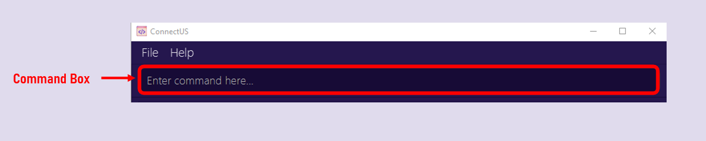

## 1. Welcome to ConnectUS!

ConnectUS is the ultimate **contact management system** for your everyday needs. If you're a School of Computing student, this app is for you. With ConnectUS, you can **connect with people** without the stress of remembering who you met where (on top of the stress of a growing assignment backlog — ~~_trust us, we know!_~~) holding you back from socialising.

We're focused on:
- **Efficiency**: Optimized for use via a Command Line Interface (CLI), you can **easily view and edit your contacts** at your fingertips with ConnectUS.
- **User-friendliness**: With the benefits of having a Graphical User Interface (GUI), **easily navigate through your contact information** to find exactly what you need to **connect** with others.

This User Guide will provide you with an in-depth documentation for you to easily integrate ConnectUS into your daily life. It covers **step-by-step instructions** on setting up ConnectUS, core ConnectUS features and commands, and a glossary for definitions of terms used in ConnectUS.

So what are you waiting for? Get ready to **Connect** with others and let **US** handle the rest!

## 2. Table of Contents

  * Table of Contents
  {:toc}

---

## 3. Using this guide

Thank you for choosing ConnectUS! We are delighted to have you onboard with us as a user.

We **highly recommend** that you read through our User Guide in a sequential order.

### 3.1 Notation

Some special notations are used throughout this guide:

- [Links in blue](#31-notation) will help you navigate through this document, or take you to places on the Internet.
- **Bolded words** are phrases that you should pay attention to.
- <u>Underlined words</u> are commonly used terms in ConnectUS, and can be found in the [glossary](#11-glossary).

### 3.2 Navigation

- If this is your **first time** using ConnectUS, head over to our [installation](#4-installation) guide for instructions on setting up ConnectUS, and our [quick start guide](#5-quick-start-guide) to begin using ConnectUS.

- If you need a **refresher on command syntax**, head over to the [command summary](#9-command-summary) for a reference table of commands, or the [prefix summary](#10-prefix-summary) for a reference table of prefixes.

- For detailed instructions about the features we offer and how to use each command, please refer to [Features](#6-features).

- For detailed information about the different information fields that you can assign to a contact, please refer to [Information Fields & Prefixes](#7-information-fields--prefixes).

- Refer to the [glossary](#11-glossary) for definitions of terms used in ConnectUS.

[↑ Back to top of section](#3-using-this-guide)

[↑ Back to table of contents](#2-table-of-contents)

## 4. Installation

If you have yet to install ConnectUS, simply follow these steps to set it up:

1. Ensure you have Java `11`(found [here](https://www.oracle.com/sg/java/technologies/javase/jdk11-archive-downloads.html)) installed in your computer.

2. Download the latest `ConnectUS.jar` from [here](https://github.com/AY2223S2-CS2103T-W15-1/tp/releases).  
   

3. Copy the file to the folder you want to use as the _home folder_ for your ConnectUS app. 
   

4. Double-click the `ConnectUS.jar` file to start the app. 
   A GUI similar to the below should appear in a few seconds. Note how the app contains some sample data. 
   

Congratulations! You have successfully set up ConnectUS.

[↑ Back to top of section](#4-installation)

[↑ Back to table of contents](#2-table-of-contents)

## 5. Quick Start Guide

### 5.1 Layout

### 5.2 Key Definitions

### 5.3 Command Format

**:information_source: Notes about the command format:** 

* Words in `UPPER_CASE` are the parameters to be supplied by the user. 
  e.g. in `add n/NAME`, `NAME` is a parameter which can be used as `add n/John Doe`.

* Items in square brackets are optional. 
  e.g `n/NAME [b/BIRTHDAY]` can be used as `n/John Doe b/14/02/2000` or as `n/John Doe`.

* Items with `…`​ after them can be used multiple times including zero times. 
  e.g. `[mod/MODULE_CODE]…​` can be used as ` ` (i.e. 0 times), `mod/CS2103T`, `mod/CS2103T mod/CS2107` etc.

* Information fields can be in any order. 
  e.g. if the command specifies `n/NAME p/PHONE_NUMBER`, `p/PHONE_NUMBER n/NAME` is also acceptable.

* If an information field is expected only once in the command, but you specify it multiple times, only the last occurrence of the parameter will be taken. 
  e.g. if you specify `p/12341234 p/56785678`, only `p/56785678` will be taken.

* Extraneous information fields for commands that do not take in parameters (such as `help`, `list`, `exit` and `clear`) will be ignored. 
  e.g. if the command specifies `list 123`, it will be interpreted as `list`.

* Commands are case-sensitive! 
  e.g. if you specify `ADD n/James` or `aDd n/James` instead of `add n/James`, ConnectUS will not register it as a valid command.

### 5.4 How to Use the CLI

Type the command in the command box and press Enter to execute it. e.g. typing **`help`** and pressing Enter will open the help window. 
     
   Some example commands you can try:

   * `list` : Lists all contacts.

   * `add n/James p/12345678 e/james@example.com a/Clementi tg/itsjameshere b/14/02/2000` : Adds a contact named `James` to ConnectUS.

   * `delete 3` : Deletes the 3rd contact shown in the current list.

   * `clear` : Deletes all contacts.

   * `exit` : Exits the app.

Refer to the [Features](#6-features) below for details of each command.

[↑ Back to top of section](#5-quick-start-guide)

[↑ Back to table of contents](#2-table-of-contents)

---

## 6. Features

- [6.1 Viewing help: `help`](#61-viewing-help--help)
- [6.2 Adding a contact: `add`](#62-adding-a-contact-add)
- [6.3 Listing all contacts : `list`](#63-listing-all-contacts--list)
- [6.4 Editing a contact : `edit`](#64-editing-a-contact--edit)
- [6.5 Deleting a contact : `delete`](#65-deleting-a-contact--delete)
- [6.6 Searching for contact information : `search`](#66-searching-for-contact-information--search)
- [6.7 Clearing all entries : `clear`](#67-clearing-all-entries--clear)
- [6.8 Exiting the program : `exit`](#68-exiting-the-program--exit)
- [6.9 Saving the data](#69-saving-the-data)
- [6.10 Editing the data file](#610-editing-the-data-file)

### 6.1 Viewing help : `help`

If you are lost while using ConnectUS, simply use the `help` command!

Using the `help` command alone will show a message explaining how to access this User Guide.

If you want to know the usage instructions of a specific command, simply use `help [COMMAND]`, where `[COMMAND]` is the command that you need help with.

Format: `help [COMMAND]`

Examples: `help`, `help add`, `help list`

[↑ Back to feature list](#6-features)

### 6.2 Adding a contact: `add`

Adds a contact to the ConnectUS app.

Format: `add n/NAME [p/PHONE_NUMBER] [a/ADDRESS] [e/EMAIL] [tg/TELEGRAM] [ig/INSTAGRAM] [wa/WHATSAPP] [b/BIRTHDAY] [mod/MODULE_CODE]…​ [cca/CCA]…​ [ccapos/POSITION]…​ [t/TAG]…​`

:bulb: **Tip:**
A contact can have any number of tags, modules and CCAs! (including 0)

Examples:
* `add n/James` would create a contact named James without any other contact information.
* `add n/James p/12345678` would create a contact named James with a phone number 12345678.
* `add n/James e/james@example.com ig/itsjameshere b/01/01/2000` would create a contact named James with an email james@example.com, an Instagram of `itsjameshere` and a birthday of January 1st, 2000.
* `add n/James tg/itsjameshere mod/CS2103T mod/CS2101 cca/NUS Hackers` would create a contact named James with Telegram `itsjameshere`, the module tags of CS2103T and CS2101, and the CCA of NUS Hackers.

Please refer to **[this section](#7-additional-information-regarding-specific-fields)** for details on how to use each information field prefix.

[↑ Back to feature list](#6-features)

### 6.3 Listing all contacts : `list`

Shows a list of all contact in the ConnectUS app.

Format: `list`

[↑ Back to feature list](#6-features)

### 6.4 Editing a contact : `edit`

Edits an existing contact in the ConnectUS app.

Format: `edit INDEX [n/NAME] [p/PHONE_NUMBER] [a/ADDRESS] [e/EMAIL] [tg/TELEGRAM] [ig/INSTAGRAM] [wa/WHATSAPP] [b/BIRTHDAY] [mod/MODULE_NUMBER]…​ [t/TAG]…​`

* Edits the contact at the specified `INDEX`. The index refers to the index number shown in the displayed contact list.
* The index **must be a positive integer** e.g. 1, 2, 3, …​
* At least one of the optional fields must be provided.
* Existing values will be updated to the input values.
* You can remove all the contact’s tags by typing `edit -t` without specifying any tags after it.

Examples:
* `edit 1 p/12345678 e/james@example.com` Edits the phone number and email address of the 1st contact to be `12345678` and `james@example.com` respectively.
* `edit 2 n/Betsy Crower -t` Edits the name of the 2nd contact to be `Betsy Crower` and clears all existing tags.

Please refer to **[this section](#7-additional-information-regarding-specific-fields)** for details on how to use each information field prefix.

[↑ Back to feature list](#6-features)

### 6.5 Deleting a contact : `delete`

Deletes the specified contact from the ConnectUS app.

Format: `delete INDEX`

* Deletes the contact at the specified `INDEX`.
* The index refers to the index number shown in the displayed contact list.
* The index **must be a positive integer** e.g. 1, 2, 3, …​

Examples:
* `list` followed by `delete 2` deletes the 2nd contact in the ConnectUS app.
* `search Betsy` followed by `delete 1` deletes the 1st contact in the results of the `search` command.

[↑ Back to feature list](#6-features)

### 6.6 Searching for contact information : `search`

Finds contacts whose information fields and tags contain any of the given keywords.

Format: `search KEYWORD`

Examples:
* `search january` returns all contacts whose information fields contain the keyword `january`.
* `search alex may` returns all contacts whose information fields contain the keywords `alex` and `may`.

* The keywords are case-insensitive! This means that `search january`, `search JANUARY` and `search jAnUaRy` will all return the contacts whose information fields contain the keyword `january`.

[↑ Back to feature list](#6-features)

### 6.7 Clearing all entries : `clear`

Clears all contacts from the ConnectUS app.

Format: `clear`

[↑ Back to feature list](#6-features)

### 6.8 Exiting the program : `exit`

Exits the program.

Format: `exit`

[↑ Back to feature list](#6-features)

### 6.9 Saving the data

ConnectUS data is saved in the hard disk automatically after any command that changes the data. There is no need to save manually.

[↑ Back to feature list](#6-features)

### 6.10 Editing the data file

ConnectUS data is saved as a JSON file `[JAR file location]/data/ConnectUS.json`. Advanced users are welcome to update data directly by editing that data file.

:exclamation: **Caution:**
If your changes to the data file makes its format invalid, ConnectUS will discard all data and start with an empty data file at the next run.

[↑ Back to feature list](#6-features)

[↑ Back to table of contents](#2-table-of-contents)

## 7. Information Fields & Prefixes

- [7.1 Name](#71-name)
- [7.2 Phone](#72-phone)
- [7.3 Email](#73-email)
- [7.4 Address](#74-address)
- [7.5 Instagram](#75-instagram)
- [7.6 Telegram](#76-telegram)
- [7.7 WhatsApp](#77-whatsapp)
- [7.8 Birthday](#78-birthday)
- [7.9 Module](#79-module)
- [7.10 CCA](#710-cca)
- [7.11 Tag](#711-tag)

### 7.1 Name:
* Name is a *compulsory* field, i.e. a contact cannot exist if it does not have a name.
* The prefix for a name is `n/`.
* Names should only contain alphanumeric characters and spaces.

[↑ Back to prefix list](#7-information-fields--prefixes)

### 7.2 Phone:
* Phone is an *optional* field, i.e. a contact can exist even if it does not have a phone number.
* The prefix for a phone is `p/`.
* Phone numbers should only contain numeric characters.
* Phone numbers should be at least 3 digits long.

[↑ Back to prefix list](#7-information-fields--prefixes)

### 7.3 Email
* Email is an *optional* field, i.e. a contact can exist even if it does not have an email.
* The prefix for an email is `e/`.
* Emails should be of the format local-part@domain and adhere to the following constraints:
    * The local-part should only contain alphanumeric characters and these special characters:`+_.-`. The local-part may not start or end with any special characters.
    * This is followed by a '@' and then a domain name. The domain name is made up of domain labels separated by periods.
      The domain name must:
        - end with a domain label at least 2 characters long
        - have each domain label start and end with alphanumeric characters
        - have each domain label consist of alphanumeric characters, separated only by hyphens, if any.

[↑ Back to prefix list](#7-information-fields--prefixes)

### 7.4 Address
* Address is an *optional* field, i.e. a contact can exist even if it does not have an address.
* The prefix for an address is `a/`.
* Addresses can take any values, including special characters.

[↑ Back to prefix list](#7-information-fields--prefixes)

### 7.5 Instagram
* Instagram is an *optional* field, i.e. a contact can exist even if it does not have an Instagram.
* The prefix for an Instagram username is `ig/`.
* Instagram usernames should be of the format john.123.doe and adhere to the following constraints:
    * The username should only contain alphanumeric characters and the special character: `.`.
    * The dots `.` must not be consecutive or at the end.
    * The username should contain at most 30 characters.

[↑ Back to prefix list](#7-information-fields--prefixes)

### 7.6 Telegram
* Telegram is an *optional* field, i.e. a contact can exist even if it does not have a Telegram.
* The prefix for a Telegram username is `tg/`.
* Telegram usernames should be of the format johndoe and adhere to the following constraints:
    * The username should only contain alphanumeric characters and the special character `_`.
    * The username should contain at least 5 characters.

[↑ Back to prefix list](#7-information-fields--prefixes)

### 7.7 WhatsApp
* WhatsApp is an *optional* field, i.e. a contact can exist even if it does not have a WhatsApp.
* The prefix for adding a WhatsApp is `wa/`.
* A WhatsApp's user identifier is a phone number, which should adhere to the following constraints:
    * Phone numbers should only contain numeric characters.
    * Phone numbers should be at least 3 digits long.

[↑ Back to prefix list](#7-information-fields--prefixes)

### 7.8 Birthday
* Birthday is an *optional* field, i.e. a contact can exist even if it does not have a birthday.
* The prefix for a birthday is `b/`.
* Birthdays should be of the format DD/MM/YYYY:
  * `01/01/2000` would correspond to January 1st, 2000
  * `16/05/1990` would correspond to May 16th, 1990.

[↑ Back to prefix list](#7-information-fields--prefixes)

### 7.9 Module
* Module is an *optional* field, i.e. a contact can exist even if it does not have a module.
* The prefix for a module is `mod/`.
* Module names should be alphanumeric.
* A contact can have any number of modules assigned to it.

[↑ Back to prefix list](#7-information-fields--prefixes)

### 7.10 CCA
* CCA is an *optional* field, i.e. a contact can exist even if it does not have a CCA.
* The prefix for a CCA is `cca/`.
* CCA names should be alphanumeric.
* A contact can have any number of CCAs assigned to it.

[↑ Back to prefix list](#7-information-fields--prefixes)

### 7.11 Tag
* Tag is an *optional* field, i.e. a contact can exist even if it does not have a tag.
* The prefix for a tag is `t/`.
* Tag names should be alphanumeric.
* A contact can have any number of tags assigned to it.
* Tags are used for assigning other information to a contact, e.g. their Year of Study, Faculty, Company etc.

[↑ Back to prefix list](#7-information-fields--prefixes)

[↑ Back to top](#2-table-of-contents)

---

## 8. FAQ

**Q**: How do I transfer my data to another Computer? 
**A**: Install the app in the other computer and overwrite the empty data file it creates with the file that contains the data of your previous ConnectUS home folder.

[↑ Back to top](#2-table-of-contents)

--------------------------------------------------------------------------------------------------------------------

## 9. Command Summary

| Command    | Format                                                                                                                                                                       | Example                                                                               |
|------------|------------------------------------------------------------------------------------------------------------------------------------------------------------------------------|---------------------------------------------------------------------------------------|
| **Add**    | `add n/NAME [p/PHONE_NUMBER] [a/ADDRESS] [e/EMAIL] [tg/TELEGRAM] [ig/INSTAGRAM] [wa/WHATSAPP] [b/BIRTHDAY] [mod/MODULE_NUMBER]…​`                                            | `add n/James p/12345678 e/james@example.com tg/itsjameshere b/14/02/2000 mod/CS2103T` |
| **Clear**  | `clear`                                                                                                                                                                      |                                                                                       |
| **Delete** | `delete INDEX`                                                                                                                                                               | `delete 3`                                                                            |
| **Edit**   | `edit INDEX [n/NAME] [p/PHONE_NUMBER] [a/ADDRESS] [e/EMAIL] [tg/TELEGRAM] [ig/INSTAGRAM] [wa/WHATSAPP] [b/BIRTHDAY] [mod/MODULE_NUMBER]…​ [cca/CCA]…​ [ccap/CCA: POST]…​ -t` | `edit 1 p/12345678 e/james@example.com tg/itsjameshere`                               |
| **List**   | `list`                                                                                                                                                                       |                                                                                       |
| **Help**   | `help`                                                                                                                                                                       |                                                                                       |
| **Search** | `search KEYWORD`                                                                                                                                                             | `search alex january`                                                                 |
| **Exit**   | `exit`                                                                                                                                                                       |                                                                                       |

[↑ Back to top](#2-table-of-contents)

## 10. Prefix Summary

| Information Field | Prefix | Example                      |
|-------------------|--------|------------------------------|
| **Address**       | a/     | a/Blk 456, Den Road, #01-355 |
| **Birthday**      | b/     | b/01/01/2000                 |
| **CCA**           | cca/   | cca/NUS Hackers              |
| **Email**         | e/     | e/johndoe@example.com        |
| **Instagram**     | ig/    | ig/john.doe                  |
| **Module**        | mod/   | mod/CS2103T                  |
| **Name**          | n/     | n/John Doe                   |
| **Phone**         | p/     | p/91234567                   |
| **Tag**           | t/     | t/School of Computing        |
| **Telegram**      | tg/    | tg/johndoe                   |
| **WhatsApp**      | wa/    | wa/91234567                  |

[↑ Back to top](#2-table-of-contents)

## 11. Glossary

[↑ Back to top](#2-table-of-contents)
