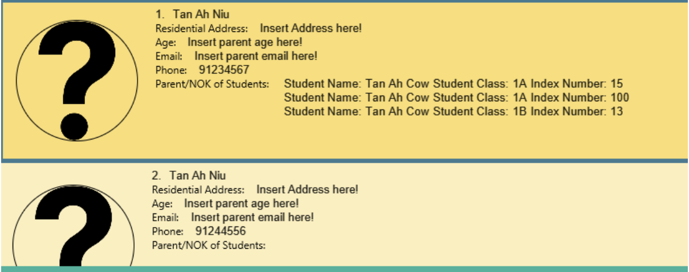

## PowerConnect User Guide

Greetings! Welcome to PowerConnect! <br>

Looking for a simple and all in one solution for your teaching needs? Look no further. <br>


PowerConnect is a fully customized offline application for tuition and school teachers to manage students' and parents' administrative details. We are still working to scale our features so we mainly target tuition teachers currently. However, school teachers, do still give us a try. While our
features are limited at this stage, we are working hard to scale them and be a useful tool in conjunction with [Learning Managment System (LMS)](#glossary) tools currently in the market. <br>

We aim to make PowerConnect as simple as possible for you to use with a focus on command line interface where you don't
have to navigate complex user menus to access the features you need, especially if you can type fast. <br>

Without further ado, let's get started!

<div style="page-break-after: always;"></div>

----------------------------------------------------------------------------------------------------------------

<a name="tableofcontents"/>

## Table of Contents
1. [Quick Start](#quick-start)
2. [Glossary](#glossary)
3. [Features](#features)
    1. [Legend](#legend)
    2. [Student Features: `student`](#student)
         1. [Add student: `add`](#addstudent)
         2. [Add attendance to students: `attendance`](#attendance)
         3. [Add students' grade: `grade`](#gradestudent)
         4. [Deletes students' grade: `gradedelete`](#gradedelete)
         5. [Add comments to students: `comment`](#commentstudent)
         6. [Listing all students in a particular class: `list`](#liststudent)
         7. [Editing a student's particulars: `edit`](#editstudent)
         8. [Searching students: `find`](#findstudent)
         9. [Deleting a student: `delete`](#deletestudent)
       3. [Parent Features: `parent`](#parent)
           1. [Add Parent/Next-of-Kin: `add`](#addparent)
           2. [Listing all Parents/Next-of-Kins: `list`](#listparent)
           3. [Editing a Parent/Next-of-Kin particulars: `edit`](#editparent)
           4. [Deleting a Parent/Next-of-Kin: `delete`](#deleteparent)
       4. [General Features](#general)
          1. [List all students / parents](#listing)
          2. [Viewing help: `help`](#help)
          3. [Exiting program: `exit`](#exit)
4. [Saving the data](#savingdata)
5. [Editing the data file](#editdatafile)
6. [Images](#images)
7. [FAQ](#faq)
8. [Command Summary](#summary)
   1. [Command Summary for Student](#summarystudent)
   2. [Command Summary for Parent](#summaryparent)

<div style="page-break-after: always;"></div>

--------------------------------------------------------------------------------------------------------------------

<a name="quickstart"/>

## Quick Start

1. Ensure you have Java `11` or above installed in your Computer.

2. Download the latest `PowerConnect.jar` from [here](https://github.com/AY2223S2-CS2103T-T09-1/tp/releases).

3. Copy the file to the folder you want to use as the _home folder_ for PowerConnect.

4. In the same folder, create a new folder named “image” and store all images to be used for the program in this folder. eg student image and parent image. For the student image, it should be named `<STUDENT_NAME><CLASS><INDEX NUMBER>.png`. For the parent image, it should be named `<PARENT_NAME>.png`

5. Open a command terminal, `cd` into the folder you put the jar file in, and use the `java -jar PowerConnect.jar` command to run the application.<br>
   A GUI similar to the below should appear in a few seconds. Note how the app contains some sample data.<br>
   

6. Type the command in the command box and press Enter to execute it. e.g. typing **`help`** and pressing Enter will open the help window.<br>
   Some example commands you can try:

    * `list student` : Lists all students.

    * `student 1A add n/Tan Ah Cow in/13 s/M pn/Tan Ah Niu pnP/91234567 rls/Father` : Adds a student in class 1A named `Tan Ah Cow` to PowerConnect.

    * `student 1A delete in/13` : Deletes the student with index number 13 in class 1A

    * `student 1A grade in/13 test/CA1 score/75 deadline/15/05/2023 weightage/20`: Adds a test named CA1, score of 75, deadline of 15/05/2023, weightage 20% to student index number 13 in class 1A
    * `student 1A gradedelete in/13 test/CA1`: Deletes a test named CA1 for student in class 1A with index 13
    * `clear` : Deletes all contacts.
    * `exit` : Exits the app.


7. Refer to the [Features](#features) below for details of each command.

<div style="page-break-after: always;"></div>

--------------------------------------------------------------------------------------------------------------------

<a name="glossary"/>

## Glossary

1. Absolute Path to Image: Location where the image is stored <br>
   By default, it should be stored in the images folder as mentioned [here](#images). <br><br>
2. Attributes: Information of a student / parent. <br>
   For example, name, phone number, email address etc <br><br>
3. CLI: Command Line Interface <br><br>
4. Hard disk: Non-volatile data storage device, your OS's storage in short. <br><br>
5. JSON: JavaScript Object Notation, open standard file format for storing text. <br>
   Examples of other commonly known file formats: `.TXT`, `.DOC`, `.PDF`, `.XLS`, `.HTML` etc <br><br>
6. LMS: Learning Management System, application used by schools to provide students a platform to access their lessons materials online. <br>
   Examples of LMS: Canvas, LumiNUS, Blackboard, Google Classroom, Quizlet <br><br>
7. NOK: Next-of-kin, could be either blood related family members or guardian <br><br>
8. OS: Operating System <br>
   Examples of OS: Windows, Linux, Mac etc <br><br>

[Back to Table of Contents](#table-of-contents)

<div style="page-break-after: always;"></div>

--------------------------------------------------------------------------------------------------------------------

<a name="features"/>

## Features


This section aims to provide a brief overview of the features available in PowerConnect and the appropriate [CLI](#glossary) command to call them. <br>

### Legend
* Command lines supplied by the user are NOT case-sensitive. User needs to be ensure they have typed in the command in the correct case.
  E.g. in the list feature, user can call it via this method:
  `student 5A list`


* Words in `UPPER_CASE` are the parameters to be supplied by the user.
  e.g. in `…add <NAME>...`, `NAME` is a parameter which can be used as `…add John…`.


* Items in `<>` brackets are the values that the user should fill in and is compulsory.
  e.g. in `…add <NAME>…` , `NAME` is a parameter that needs to be included, can be used as `…add John…`.


* All items in the square brackets are OPTIONAL.

  e.g. in `…add…[..c/<CCA>.. ]...` , `CCA` is an optional parameter that need not be given by the user and can be skipped, can be used as `…add…`  or `…add…c/Mathematics Club nok/…` .


* Student Particulars:
  * Compulsory:
    - Name n/<**NAME**>
      -  Student's name
    - Class <**CLASS**>
      - Student's class
    - Index Number in/<**INDEX_NUMBER**>
      - Number value of student's index number
    - Parents/ Next-of-kin pn/<**PARENT/NOK**>
      - Parent's name
    - Parents/ Next-of-kin pnP/<**PARENT/NOK_PHONE_NUMBER**>
      - Parent's phone number
      - Should not include country code
    - Parents/ Next-of-kin rls/<**RELATIONSHIP**>
      - Relationship between student and parent
  * Optional:
    - Age ageS/[**AGE**]
        - Numerical value of student's age
    - Sex s/[**SEX**]
      - Student's gender
      - Should be either M or F
    - CCA c/[**CCA**]
      - Student's CCA
    - Comments com/[**COMMENTS**]
      - Student's comments
    - Image imgS/[**IMAGE**]
      - Student's image
      - Should be in .png format
      - Should be named <STUDENT_NAME><CLASS><INDEX NUMBER>.png
      - Should be stored in the image folder
    - Residential address a/[**RESIDENTIAL_ADDRESS**]
      - Student's residential address
    - Email e/[**EMAIL**]
      - Student's email address
    - Phone number pnS/[**PHONE_NUMBER**]
      - Student's phone number
      - Should not include country code

  *  Academics:
      - Attendance att/<**ATTENDANCE**>
          - Can be T/F/`Date`
      - Test test/<**TEST_NAME**>
        - String value of test name
      - Homework hw/<**HOMEWORK**>
          - String value of homework name
      - Grade gde/<**GRADE**>
          - String value of grade results
      - Tags t/<**TAGS**>
          - String value of tags

* Parent / Guardians Particular
  * Compulsory:
    - Name n/<**NAME**>
      -  Parent's name
    - Phone number pnP/<**PHONE_NUMBER**>
      - Parent's phone number
      - Should not include country code
  * Optional:
    - Age ageP/[**AGE**]
      - Numerical value of parent's/NOK age
    - Image imgP/[**IMAGE**]
      - Parent's image
      - Should be in .png format
      - Should be named <PARENT_NAME>.png
      - Should be stored in the image folder
    - Email e/[**EMAIL**]
      - Parent's email address
    - Residential address a/[**RESIDENTIAL_ADDRESS**]
      - Parent's residential address

[Back to Table of Contents](#table-of-contents)

<div style="page-break-after: always;"></div>

----------------------------------------------------------------------------------------------------------------

<a name="student"/>

## General Command for Student Related features

* For all following features that are related to `students`, start first by typing `student <CLASS>` before adding the respective command for the feature.<br>
* Compulsory field are inside <> while optional fields are in []

----------------------------------------------------------------------------------------------------------------

<a name="addstudent"/>

### Adding a Student: `add`

Adds a student to the database

Format: `add n/<NAME> in/<INDEX_NUMBER> pn/<NOK_NAME> pnP/<NOK_CONTACT_NUMBER> rls<NOK_RELATIONSHIP_TO_STUDENT> [s/<SEX> a/<REISDENTIAL_ADDRESS> ageS/<AGE> imgS/<ABSOLUTE_PATH_TO_IMAGE> eS/<EMAIL_ADDRESS> pnS/<PHONE_NUMBER> cca/<CCA>]`

***Click [HERE](#images) to find out more on what to input for inserting image!!!***

***Click [HERE](#glossary) to understand `ABSOLUTE PATH TO IMAGE`!!!***

<div markdown="span" class="alert alert-primary">:bulb: **Tip:**
A person with the same name and same class but different index number can exist.
</div>

Examples:
* `student 1A add n/TanAhCow in/03 pn/TanAhNiu pnP/91234567 rls/Father` <br>

  *Above is a situation where some of the student's information is not given!
* `student 1A add n/Tan Ah Cow in/13 s/M pn/Tan Ah Niu pnP/91234567 rls/Father a/Blk 456 Ang Mo Kio Avenue 6 #11-800 S(560456) ageS/14 imgS/C:// eS/tanahcow@gmail.com pnS/91234567 cca/Captain Ball att/T `

**Expected Outcome:**
* `New student added:`

Image source will be displayed in decreasing priority: <br>
* Absolute or relative file path
* images/<STUDENT_NAME><STUDENT_CLASS>.png
* Default Image (?) <br>

Note: <br>
1. User cannot create two students of the same index number and same class
2. Upon creation of a student, a new parent is also created if the parent does not exist based on the particulars given for the parent. Otherwise, the student will get binded to the matching parent.
3. If the image does not exist, the default image will be shown and if you choose to update the image using the folder [method](#images), it will not update. 
Please delete the student and add without the image source path. 
4. If you have entered the `ABSOLUTE PATH TO IMAGE`, note that once the image changes location, the picture will not render properly.
It is recommended to store the images using the folder [method](#images) instead.

[Back to Table of Contents](#table-of-contents)

<div style="page-break-after: always;"></div>

----------------------------------------------------------------------------------------------------------------

<a name = "attendance"/>

### Marking attendance for student: `attendance`

Marks the student as being present or allow you to define that the student was present
Ensure that if you mark the same date for the same student as being present, it will prompt that you have indeed added the same date (for verification)

Format : `attendance in/<INDEX_NUMBER> att/<DATE_PRESENT>`

Examples:
* `student 3A attendance in/25 att/T`
* `student 3A attendance in/25 att/25/02/2023`

**Expected Outcome:**
* `Attendance marked as present`

Date is in DD/MM/YYYY format <br>
This date can be set to:
* T (Indicates that the student was present today)
* F (Default when adding student)
* Specific date (Used when you want to update the attendance of the student in the past)

[Back to Table of Contents](#table-of-contents)

<div style="page-break-after: always;"></div>

----------------------------------------------------------------------------------------------------------------

<a name="gradestudent"/>

### Adding a grade for student : `grade`

Adds a test OR homework grade for the student corresponding to the `INDEX_NUMBER` in the `CLASS`

You cannot have different test/homework with the same name

Format: `grade in/<INDEX_NUMBER> [test/<TEST_NAME> OR hw/<HOMEWORK_NAME>] [score/<score> deadline/<DEADLINE(DD/MM/YYYY)> weightage/<WEIGHTAGE>] [hwdone/<HOMEWORK_DONE(true/false)>]`

Examples:
* `student 1A grade in/13 test/CA1 score/75 weightage/10`
* `student 1A grade in/13 hw/homework1 score/75 deadline/25/04/2023 weightage/10 hwdone/true`<br><br>

**Expected Outcome:**
* `New test added:`
* `New homework added:`

<div markdown="span" class="alert alert-primary">:bulb: **Tip:**
1. Test or Homework name is compulsory for the command to work and must not be duplicate of current tests/homework in student.
2. hwdone is compulsory for homework.
3. Score is out of 100
4. Weightage is out of 100%
</div>

[Back to Table of Contents](#table-of-contents)

<div style="page-break-after: always;"></div>

----------------------------------------------------------------------------------------------------------------

<a name = "gradedelete"/>

### Deleting a grade for student : `gradedelete`

Deletes a test OR homework grade for the student corresponding to the `INDEX_NUMBER` in the `CLASS`

Duplicate test/homework  is checked through having the same name

Format: `gradedelete in/<INDEX_NUMBER> [test/<TEST_NAME> OR hw/<HOMEWORK_NAME>]`

Examples:
* `student 1A gradedelete in/13 test/CA1`

**Expected Outcome:**
* `Test deleted successfully`

[Back to Table of Contents](#table-of-contents)

----------------------------------------------------------------------------------------------------------------

<a name = "commentstudent"/>

### Adding comments for student : `comment`

Adds a comment for the student corresponding to the `INDEX_NUMBER` in the `CLASS`

Format: `comment in/<INDEX_NUMBER> com/<COMMENT>`

Examples:

* `student 3A comment in/25 com/Quiet person, needs to interact more with classmates`

Note: <br>
If an existing comment is already available for the selected student, the new comment will OVERRIDE the old comment! Hence, users should check on existing comments before adding a new comment!
<a name = "liststudent"/> <br><br>

[Back to Table of Contents](#table-of-contents)

<div style="page-break-after: always;"></div>

----------------------------------------------------------------------------------------------------------------

<a name = "liststudent"/>

### Listing all students in the selected class: `list`

Shows a list of all students in the selected class in the database

Format: `list`

Examples:
* `student 1A list`
* `student 1B list`

**Expected Outcome:**


[Back to Table of Contents](#table-of-contents)

<div style="page-break-after: always;"></div>

----------------------------------------------------------------------------------------------------------------

<a name = "editstudent" />

### Edit Student:  `edit`

Edits personal details of students for the student corresponding to the `INDEX_NUMBER` in the `CLASS` based on the particulars given by the user.

Format: `edit in/<INDEX_NUMBER (of student)> [nn/<NEWNAME> nin/<NEWINDEXNUMBER> nc/<NEWCLASS> s/<SEX> ageS/<STUDENT AGE>
imgS/<IMAGE> cca/<CCA> att/<ATTENDANCE> com/<COMMENTS> pnS/<STUDENT PHONE NUMBER> eS/<STUDENT EMAIL> a/<ADDRESS>
npn/<NEW PARENT NAME> npnP/<NEW PARENT PHONE NUMBER> rls/<RELATIONSHIP>]`

***Click [HERE](#glossary) to understand `ABSOLUTE PATH TO IMAGE`!!!***

Examples:
* `student 1A edit in/03 cca/basketball`
* `student 1A edit in/03 cca/badminton ageS/23`

**Expected Outcome:**
* Edited student: TanAhCow; Student Class: 1A; Index Number: 03; Sex: M; Student Age: Insert student age here!; Image Path: Insert student image here!; Student Email: Insert student email here!; Student Phone: Insert student phone number here!; CCA: basketball
* Edited student: TanAhCow; Student Class: 1B; Index Number: 03; Sex: M; Student Age: 23; Image Path: Insert student image here!; Student Email: Insert student email here!; Student Phone: Insert student phone number here!; CCA: badminton

[Back to Table of Contents](#table-of-contents)

<div style="page-break-after: always;"></div>

----------------------------------------------------------------------------------------------------------------

<a name = "findstudent"/>

### Locating students by name:  `find`

Finds and generates all students with matching student name and class

Format: `find <INDEX_NUMBER>  `

Examples:
* `student 3B find 26`
* `student 3B find 27`

**Expected Outcome:**
* Student found: Russel Ong class:3B cca: swimming grade: [sci:A, maths:B] id:26 age:14 email:ro@outlook.com ph:85349633 attendance: 2023-01-01 [y] hw: ip [x] notes:extroverted nok: David Ong
* Student found: Joseph Tan class:3B cca: basketball grade: [sci:A, maths:C] id:27 age:14 email:jo@outlook.com ph:92103134 attendance: 2023-01-01 [x] hw: ip [x] notes:shy  nok: David Tan <br><br>

[Back to Table of Contents](#table-of-contents)

<div style="page-break-after: always;"></div>

----------------------------------------------------------------------------------------------------------------

<a name = "deletestudent"/>

### Deleting student: `delete`

Deletes student corresponding to the `INDEX_NUMBER` in the `CLASS`  from the database

Format: `delete in/<INDEX_NUMBER>`

Examples:
* `student 1A delete in/14`
* `student 1B delete in/23`

**Expected Outcome:**

* Deleted Student: TanAhCow; Student Class: 1A; Index Number: 14; Sex: M; Student Age: Insert student age here!; Image Path: Insert student image here!; Student Email: Insert student email here!; Student Phone: Insert student phone number here!; CCA: Insert student CCA here!
* Deleted Student: TanAhCow; Student Class: 1B; Index Number: 23; Sex: M; Student Age: Insert student age here!; Image Path: Insert student image here!; Student Email: Insert student email here!; Student Phone: Insert student phone number here!; CCA: Insert student CCA here!

[Back to Table of Contents](#table-of-contents)

<div style="page-break-after: always;"></div>

----------------------------------------------------------------------------------------------------------------

<a name = "parent" />

## General Command for parent related features

* For all following features that are related to `parent`, start first by typing `parent`  before adding the respective command for the feature.

* Note that it is possible to have multiple students with the same parent and parents are identified via their phone number and *HENCE* `student class` is not used for identification.

----------------------------------------------------------------------------------------------------------------

<a name="addparent"/>

### Adding a Parent/NOK: `add`

Adds a Parent/[NOK](#glossary) to the database

Format: `add n/<PARENT_NAME/NOK_NAME> pnP/<PHONE_NUMBER> [ageP/[AGE] imgP/[ABSOLUTE_PATH_TO_IMAGE] e/[EMAIL_ADDRESS] a/[RESIDENTIAL_ADDRESS] ]`

***Click [HERE](#images) to find out more on what to input for inserting image!!!***

***Click [HERE](#glossary) to understand `ABSOLUTE PATH TO IMAGE`!!!***

Examples of Full Command:
* `parent add n/TanAhNiu pnP/91234567`
* `parent add n/Tan Ah Niu pnP/91234567 ageP/30 imgP/C:// e/tanahcow@gmail.com a/Blk 456 Ang Mo Kio Avenue 6 #11-800 S(560456)` <br><br>

**Expected outcome:**
* `New parent added:`

[Back to Table of Contents](#table-of-contents)

<div style="page-break-after: always;"></div>

----------------------------------------------------------------------------------------------------------------

<a name = "listparent" />

### Listing all Parents/NOKs : `list`

Shows a list of all Parents/[NOKs](#glossary) in the database with their corresponding particulars

Format: `list`

Examples of Full Command:
* `list parent` <br>

**Expected Outcome:**


[Back to Table of Contents](#table-of-contents)

<div style="page-break-after: always;"></div>

----------------------------------------------------------------------------------------------------------------

<a name = "editparent" />

### Edit Parent: `edit`

Edits personal details of Parent/[NOK](#glossary) with corresponding NAME and PARENT_PHONE_NUMBER

Format: `Format: edit n/<PARENT_NAME/NOK_NAME> pnP/<PHONE_NUMBER> [nn/[NEW_NAME] npnP/[NEW_PHONE_NUMBER] ageP/[NEW_AGE] imgP/[NEW_IMAGE] e/[NEW_EMAIL_ADDRESS] a/[NEW_RESIDENTIAL_ADDRESS] ]`

Examples of Full Command:
* `parent edit n/Tan Ah Niu pnP/91234567 npnP/65656565`
* `parent edit n/Tan Ah Niu pnP/91234567 nn/Tan Ah Seng npnP/91274444 ageP/31 imgP/C:// e/tanahcow@gmail.com a/Blk 245 Ang Mo Kio Avenue 1 #11-800 S(560245)`

**Expected Outcome:**
* `Edited Parent: Tan Ah Niu; Phone: 65656565…`
* `Edited Parent: Tan Ah Niu; Parent Age: 31; Address: Blk 245 Ang Mo Kio Avenue 1 #11-800 S(560245); Image Path: C://; Parent Email: tanahcow@gmail.com; Parent Phone: 91234567…` <br><br>

[Back to Table of Contents](#table-of-contents)

<div style="page-break-after: always;"></div>

----------------------------------------------------------------------------------------------------------------

<a name = "deleteparent" />

### Deleting Parent: `delete`

Deletes parent with corresponding `NAME` and `PARENT_PHONE_NUMBER` from the database

Format: `delete n/NAME pnP/PHONE [ageP/[AGE] imgP/[PARENT_IMAGE] e/[EMAIL a/ADDRESS] ]`

Examples:
* `parent delete n/TanAhCow pnP/91234567` <br>
* `parent delete n/TanAhNiu pnP/91234566 e/bestniuinthetown@gmail.com` <br>

Expected Outcome: <br>
```
Deleted Parent: TanAhCow; Parent Age: Insert parent age here!; Address: Insert Address here!; Image Path: Insert parent image here!; Parent Email: Insert parent email here!; Parent Phone: 91234567;
```
```
Deleted Parent: TanAhNiu; Parent Age: Insert parent age here!; Address: Insert Address here!; Image Path: Insert parent image here!; Parent Email: bestniuinthetown@gmail.com; Parent Phone: 91234566;
```
**Note:**
1. User *CANNOT* delete the parent/[NOK](#glossary) if the parent/[NOK](#glossary) has students *BINDED* to him/her. System will display an error message for this. <br><br>

[Back to Table of Contents](#table-of-contents)

<div style="page-break-after: always;"></div>

----------------------------------------------------------------------------------------------------------------

<a name = "general"/>

## General Features <br>

<a name = "listing"/>

### Listing students / parents: `list`

Lists all students / parents as specified in command <br>

Format: `list student` `list parent` <br><br>

[Back to Table of Contents](#table-of-contents)

----------------------------------------------------------------------------------------------------------------

<a name = "help"/>

### Viewing help : `help`

Provides a link to our UserGuide.


Format: `help` <br>

[Back to Table of Contents](#table-of-contents)

----------------------------------------------------------------------------------------------------------------

<a name = "exit"/>

### Exiting the program : `exit`

Exits the program.

Format: `exit` <br><br>

[Back to Table of Contents](#table-of-contents)

<div style="page-break-after: always;"></div>

----------------------------------------------------------------------------------------------------------------

<a name = "savingdata"/>

## Saving the data

PowerConnect data are saved in the [hard disk](#glossary) automatically after any command that changes the data. There is no need to save manually. <br><br>

[Back to Table of Contents](#table-of-contents)

----------------------------------------------------------------------------------------------------------------

<a name = "editdatafile"/>

## Editing the data file

PowerConnect data are saved as a [JSON](#glossary) file `[JAR file location]/data/addressbook.json`. Advanced users are welcome to update data directly by editing that data file.

<div markdown="span" class="alert alert-warning">:exclamation: **Caution:**
If your changes to the data file makes its format invalid, AddressBook will discard all data and start with an empty data file at the next run. <br><br>
</div>

[Back to Table of Contents](#table-of-contents)

<div style="page-break-after: always;"></div>

----------------------------------------------------------------------------------------------------------------

<a name = "images"/>

## Images

In the same folder as your PowerConnect.jar file, create a new file called `images` if it does not exist. <br>

Place all your student images in this format: `images/student/<STUDENT_NAME><STUDENT_CLASS>.png` <br>

Place all your parent images in this format: `images/parent/<PARENT_NAME>.png` <br><br>

Location of where images folder should be at. (Same directory of PowerConnect.jar)


Inside the images folder, create a folder called `student` and `parent` if it does not exist.


Sample of student image naming format. `images/student/<STUDENT_NAME><STUDENT_CLASS>.png`


Sample of parent image naming format. `images/parent/<PARENT_NAME>.png`


[Back to Table of Contents](#table-of-contents)

<div style="page-break-after: always;"></div>

--------------------------------------------------------------------------------------------------------------------
<a name = "faq" />

## FAQ

Feel free to ask any questions [here](https://docs.google.com/forms/d/e/1FAIpQLScpZ7Gg52KQ8LRsaq_6rXoPG4nYCClzmXKeRK6lyoYP1ZQV0w/viewform).

--------------------------------------------------------------------------------------------------------------------

**Q**: Where is the information stored?<br>
**A**: Data is stored locally in the ./data folder. The student and class information is stored in the file pcclass.json whereas the parents information is stored in parents.json

**Q**: What is CLI?<br>
**A**: Command Line Interface (CLI) is a text based user interface used to run the
program. Essentially you do not need a mouse to run this program at all!

**Q**: Do I need to pay for this product?<br>
**A**: No! We made a commitment to keep this program free for all users. Feel free to run and use our program, but remember to like, share and comment down below any feedback.

**Q**: Why is my command not working?<br>
**A**: PowerConnect is particular with the prefixes (/) and they need to be in the exact format as specified in the user guide. Don’t worry, with practice, it would be second nature to you.

**Q**: There are some terms that I do not understand in the User Guide...
**A**: You may refer to our [Glossary section](#glossary) to better understand the terminologies used in this User Guide!


[Back to Table of Contents](#table-of-contents)

<div style="page-break-after: always;"></div>

--------------------------------------------------------------------------------------------------------------------
<a name = "summary" />

## Command Summary

### Command Summary for Student `student <CLASS>`

| Action      | Format, Examples                                                                                                                                                                                                                                                                                                       |
|-------------|------------------------------------------------------------------------------------------------------------------------------------------------------------------------------------------------------------------------------------------------------------------------------------------------------------------------|
| **Add**     | `add n/<NAME> in/<INDEX_NUMBER> pn/<NOK_NAME> pnP/<NOK_CONTACT_NUMBER> rls/<RELATIONSHIP> [ s/[SEX] a/[RESIDENTIAL_ADDRESS] ageS/[AGE] imgS/[ABSOLUTE_PATH_TO_IMAGE] eS/[EMAIL_ADDRESS] pnS/[PHONE_NUMBER] cca/[CCA] att/[ATTENDANCE] ]`                                                                               |
| **Attendance** | `attendance in/<INDEX_NUMBER> att/<DATE_PRESENT>`                                                                                                                                                                                                                                                                                                                       |
| **Grade**   | `grade in/[INDEX_NUMBER] test/[TEST_NAME] hw/[HOMEWORK_NAME] [score/[SCORE] deadline/[DEADLINE] weightage/[WEIGHTAGE] hwdone/[HOMEWORK DONE OR NOT] ]`                                                                                                                                                                 |
| **Comment** | `comment in/<INDEX_NUMBER> com/<COMMENT>`                                                                                                                                                                                                                                                                              |
| **List**    | `list`                                                                                                                                                                                                                                                                                                                 |
| **Edit**    | `edit in/<INDEX_NUMBER (of student)> [nn/[NEWNAME] nin/[NEWINDEXNUMBER] nc/[NEWCLASS] s/[SEX] ageS/[STUDENT AGE] id/[INDEX_NUMBER] imgS/[IMAGE] cca/[CCA]  att/[ATTENDANCE] com/[COMMENTS] pnS/[STUDENT PHONE NUMBER] eS/[STUDENT EMAIL] a/[ADDRESS] pn/[PARENT NAME] pnP/[PARENT PHONE NUMBER] rls/[RELATIONSHIP] ] ` |
| **Find**    | `find <NAME> `                                                                                                                                                                                                                                                                                                         |
| **Delete**  | `delete in/<INDEX_NUMBER>`                                                                                                                                                                                                                                                                                             |

### Command Summary for Parent / NOK `parent`

| Action     | Format, Examples                                                                                                                                 |
|------------|--------------------------------------------------------------------------------------------------------------------------------------------------|
| **Add**    | `add n/<PARENT_NAME/NOK_NAME> pnP/<PHONE_NUMBER> [ageP/[AGE] imgP/[ABSOLUTE_PATH_TO_IMAGE] e/[EMAIL_ADDRESS] a/[RESIDENTIAL_ADDRESS]`            |
| **List**   | `list`                                                                                                                                           |
| **Edit** | `edit n/<PARENT_NAME/NOK_NAME> pnP/<PHONE_NUMBER> [nn/[NEW_NAME] npnP/[NEW_PHONE_NUMBER] ageP/[NEW_AGE] imgP/[NEW_IMAGE] e/[NEW_EMAIL_ADDRESS] a/[NEW_RESIDENTIAL_ADDRESS] ]` |
| **Delete** | `delete n/NAME pnP/PHONE [ageP/[AGE] imgP/[PARENT_IMAGE] e/[EMAIL a/ADDRESS] ]` |

[Back to Table of Contents](#table-of-contents)

--------------------------------------------------------------------------------------------------------------------
