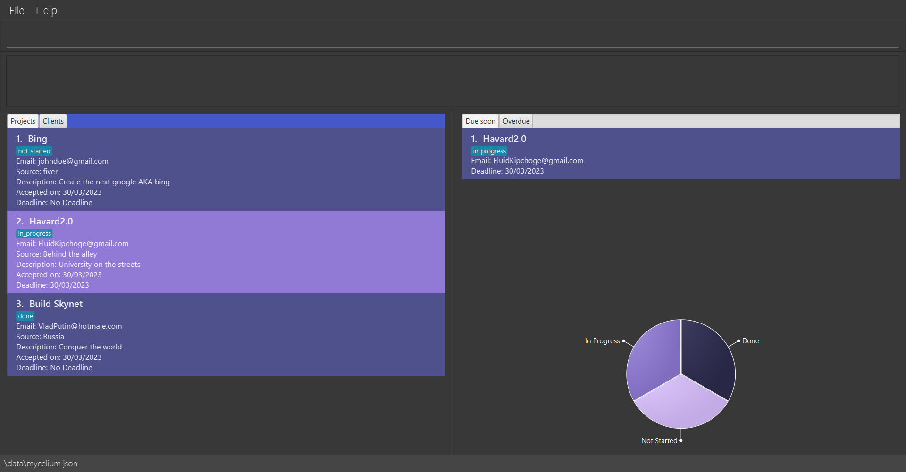

Mycelium is a desktop application aimed at helping **freelance web developers
manage clients and projects** from multiple online sources. All interactions
with Mycelium are through text commands, allowing for efficient manipulation of
data while benefiting from the ease of viewing offered by the Graphical User
Interface.

## Using this Guide

If it is your first time here, the easiest way to get started is to head over
to [Quick Start](#quick-start), which will guide you through the installation
process and basic usage.

Alternatively, you may wish to use this guide as a reference for commands and
hotkeys. The three main parts of this guide contain descriptions on how to use
commands for managing [clients](#managing-clients) and
[projects](#managing-projects), as well as the available [hotkeys](#hotkeys).

### Icons and conventions

The following typographical conventions are used in this guide.

* (KEYCAP) - Indicates a literal set of keys, e.g. (CTRL+F) refers to the
  combination of the 'Control' and 'F' keys.

<div markdown="span" class="alert alert-success">
:bulb: This box signifies a tip or suggestion.
</div>

<div markdown="span" class="alert alert-info">
:information_source: This box signifies a general note.
</div>

<div markdown="span" class="alert alert-danger">
:warning: This box indicates a warning or caution.
</div>

* Table of Contents
{:toc}

### Quick Start

Mycelium runs on Java 11, so you should first head over to [Oracle's
website](https://www.oracle.com/java/technologies/downloads/) to install Java
11 if your system does not already have it installed. Alternatively, you might
be able to install Java 11 from your preferred package manager, such as
[Homebrew](https://formulae.brew.sh/formula/openjdk@11) for Mac or
[Pacman](https://archlinux.org/packages/extra/x86_64/jdk11-openjdk/) for Arch
Linux.

Once you have Java 11, we can get started with our first steps using Mycelium.

1. Download the latest release from our [releases
   page](https://github.com/AY2223S2-CS2103T-W14-1/tp/releases)
1. Place the `.jar` file in an *empty directory* of your choice
1. In a terminal, navigate to the directory, and run the following command

```
java -jar mycelium.jar
```

If you see a window like the one shown below, then you have successfully
installed and launched Mycelium! Notice that some mock data has been populated
to help you get a feel for the application. Feel free to delete them later. 



At this point, we recommend that you jump over to the [Command
Summary](#command-summary) and [HotKeys](#hotkeys) section to get an overview
of the commands and hotkeys which are the bread and butter of Mycelium.
Alternatively, you may continue reading for a guided look at how Mycelium
works.

--------------------------------------------------------------------------------------------------------------------

## Main View - Projects and Clients

**TODO: update this**

Mycelium has two main tabs. One tab lists all existing projects, and the other lists existing clients.

### Projects Tab

The Projects tab lists all the projects you've created. Each project block contains the project’s

- Name
- Status, which would be either **not started, in progress, or done**
- Client
- Source, e.g. Fiverr
- Description
- Accepted date
- Deadline

### Clients Tab

The Clients tab lists all the clients you've created. Each client block contains the client’s

- Name or username
- Year of birth
- Email
- Phone number
- List of associated platforms

--------------------------------------------------------------------------------------------------------------------

## Command Layout

Commands in Mycelium take the general form of `command_name [arguments...]`.
Arguments may be compulsory or optional. If you do not provide the optional
arguments, Mycelium will use sensible defaults in their place.

All arguments take the structure of `-arg arg_data`. Some commands may take
multiple arguments, in which case you may specify them in any order.
Furthermore, if duplicate argument flags are provided, then only the *last one*
is used. Finally, note that `arg_data` can consist of multiple whitespace
separated tokens.

As an example, the command below creates a new project with the name *Mycelium
Desktop*, for client *Spiderman*, and sourced from *fiverr.com*. (Don't worry
about what the arguments mean for now, this example is just meant to
demonstrate the layout.) 

```bash
p -pn Mycelium Desktop -e spiderman@gmail.com -src fiverr.com
```

You will also discover that all command names in Mycelium are at most two
characters long. This terseness is *intentional* to allow for faster
keystrokes.

<div markdown="span" class="alert alert-info"> 
:information_source: **A note on dates:** some arguments are in the form of
dates. For these, Mycelium only accepts input of the format dd/MM/yyyy. For
example, "14/03/2023" is okay, but "14/3/2023", or "14-03-2023" are not okay.
</div>

--------------------------------------------------------------------------------------------------------------------

## Managing Clients

### Creating a client contact: `c`

Creates a new client contact.

**Compulsory Arguments**

- **`-cn client_name`**
    - The client’s name.
- **`-e email`**
    - The client’s email. Must be unique in Mycelium. Case sensitive.

**Optional Arguments**

- **`-y year_of_birth`**
    - The client’s year of birth.
    - **Default**: *null*
- **`-src source`**
    - The platform the client is sourced from, such as Fiverr. This can be any arbitrary non-empty string.
    - **Default:** *null*
- **`-mn mobile_number`**
    - The client’s mobile number.
    - **Default:** *null*

**Examples**

The following command creates a new client with name *Alice Baker*, whose email is *alice_baker@bakers.com*, born in the year *2000*.

```bash
c -cn Alice Baker -e alice_baker@bakers.com -y 2000
```
You should see the following output if the client is created successfully.

```bash
New client added: Alice Baker (alice_baker@bakers.com)
```

### Deleting a client contact: `dc`

Deletes an *existing* client contact.

**Notes**

- You should not add any quotation marks around any of the attributes.
- An error message will be shown with an attempt to create a client with an existing email
in Mycelium.

**Compulsory Arguments**

- **`-e email`**
    - Email of the client to delete.

**Examples**

The command `dc -e alice_baker@bakers.com`  deletes the contact with the corresponding email.

Expected output:
```bash
Deleted Client: Alice Baker (alice_baker@bakers.com)
```

### Updating a client: `uc`

Updates an *existing* client contact.

**Compulsory Arguments**
- **`-e email`**
  - Email of the client to update.

**Optional Arguments**

At least one of the following arguments must be provided:
- **`-cn client_name`**
  - The client’s new name.
  - **Default:** *null*
- **`-e2 new email`**
  - THe client's new email. Must be unique in Mycelium. Case sensitive.
  - **Default:** *null*
- **`-y year_of_birth`**
  - The client’s new year of birth.
  - **Default:** *null*
- **`-src source`**
  - The client’s new digital service platform, e.g. Fiverr.
  - **Default:** *null*
- **`-mn mobile_number`**
  - The client’s new mobile number.
  - **Default:** *null*

**Examples**

The command `uc -e alice_bakers@bakers.com -cn Bobby Baker` updates the client with email *alice_bakers@bakers.com* to have the name *Bobby Baker*.

**Expected output:**
```bash
Updated Client: Bobby Baker (alice_baker@bakers.com)
```
--------------------------------------------------------------------------------------------------------------------

## Managing Projects

### Creating a project: `p`

Creates a new project.

**Compulsory Arguments**

* `-pn project_name`
    * The project’s name, which must be *unique*. Case sensitive.
* `-e client_email`
    * The email of the client who submitted this project. Note that this client
      does not need to exist in Mycelium.

**Optional Arguments**

- `-s status`
    - Here `status` should be set, to one of `not_started`, `in_progress`, or
      `done`.
    - **Default:** `not_started`
- `-src source`
    - The platform the project is sourced from, such as Fiverr. This can be any
      arbitrary non-empty string.
    - **Default:** *null*
- `-d description`
    - A short description of the project.
    - **Default:** *null*
- `-ad accepted_date`
    - The date that the project was accepted, in the format dd/MM/yyyy.
    - **Default**: the current date
- `-dd deadline_date`
    - The deadline of the project, in the format dd/MM/yyyy.
    - **Default:** *null*

**Example**

The following command creates a new project whose name is *Mycelium Desktop*,
submitted from the client *spiderman@gmail.com* and sourced from *fiverr.com*,
with a deadline on *30 February, 2075*.

```
p -pn Mycelium Desktop -e spiderman@gmail.com -src fiverr.com -dd 30/02/2075
```

If the project is added successfully, you should see the following message in
the output box:

```
New project added: Mycelium Desktop from client spiderman@gmail.com
```

<div markdown="span" class="alert alert-tip">
:bulb: The project's status is not case sensitive. Meaning you may key in
`not_started` as `NOT_STARTED` or `nOT_sTArtED`.
</div>

<div markdown="span" class="alert alert-info">
:information_source: The client specified by the `-e` argument does not need to
exist in Mycelium. You can add them later if you wish.
</div>

<div markdown="span" class="alert alert-info">
:information_source: If you attempt to create a project with a name which already exists
in Mycelium, an error will be displayed to block the operation.
</div>

### Deleting a project: `dp`

Deletes an existing project.

**Compulsory Arguments**

- `-pn project_name`
    - Name of the project to delete. Case sensitive.

**Example**

The following command deletes a project with name *Mycelium Desktop*.

```
dp -pn Mycelium Desktop
```

If successful, you should see the following message in the output box. (In this
example, the project's client is *spiderman@gmail.com*.)

```
Deleted Project: Mycelium Desktop from client spiderman@gmail.com
```

<div markdown="span" class="alert alert-info">
:information_source: If you attempt to delete a project which does not exist in
Mycelium, an error will be displayed and no changes will be made to your data.
</div>

<div markdown="span" class="alert alert-danger">
:warning: Deletion is irreversible! Mycelium does not provide a mechanism to
undo deletions.
</div>

### Updating a project: `up`

Performs partial updates an existing project.

**Compulsory Arguments**

* `-pn project_name`
    * Name of the project to update. Case sensitive.

**Optional Arguments**

* `-pn2 new_project_name`
    * A new project name.
    * **Default:** *null*
* `-e client_email`
    * A new client email.
    * **Default:** *null*
* `-s status`
    * A new project status. Should be set, to one of `not_started`,
      `in_progress`, or `done`.
    * **Default:** *null*
* `-src source`
    * A new source for the project. Can be any arbitrary non-empty string.
    * **Default:** *null*
* `-d description`
    * A new description for the project.
    * **Default:** *null*
* `-ad accepted_date`
    * A new accepted-on date for the project.
    * **Default:** *null*
* `-dd deadline_date`
    * A new deadline for the project.
    * **Default:** *null*

Each of these arguments, if specified, will be used to (paritially) update the
target project.

<div markdown="span" class="alert alert-tip">
:bulb: Notice that the arguments here are similar to that of creating a
project. You may refer to the section above on [creating a
project](#creating-a-project:-p) for more details on what each argument means.
</div>

**Example**

Suppose we have a project named *Mycelium Desktop*, and wish to update

1. its name to *Mycelium Mobile*; and
1. its status to `in_progress`.

The following command will do the trick.

```
up -pn Mycelium Desktop -pn2 Mycelium Mobile -s in_progress
```

If successful, you should see the following message in the output box. (Here we
assume the project came from client *foo@bar.com*.)

```
Updated project: Mycelium Mobile from client foo@bar.com
```

<div markdown="span" class="alert alert-info">
:information_source: If the project's name is updated, then it must be a unique
name. Suppose we currently have the projects *foo* and *bar*. An attempt to
update *foo*'s name to *bar* will result in an error, and the operation will be
blocked.
</div>

<div markdown="span" class="alert alert-info">
:information_source: The target project should already exist in Mycelium.
Otherwise, an error will be displayed and no changes are made to the data.
</div>

<div markdown="span" class="alert alert-danger">
:warning: It is not possible to "unset" an optional field. For example,
Mycelium allows projects to have deadlines. Suppose that you have a project,
which currently has a deadline. Then it is not possible to use the `up` command
to unset the deadline.
</div>

## Fuzzy Search

Fuzzy search allows us to find projects or clients which match *closely* to
some query, rather than *exactly*. This is useful if you are, for instance,
trying to find a project whose name you only remember partial bits of, or how
it sounds in your head.

Mycelium supports fuzzy finding for both projects and clients. For projects,
the query is matched against the project's name, while for clients, the query
is matched against the client's email. Furthermore, the search is
*interactive*. This means that the UI automatically updates as you type your
query into the command box.

Please take note of these details for fuzzy search:

* Closer matches will be placed at the top;
* Projects or clients which do not match at all will not be shown;
* Fuzzy search is *not* case-sensitive.

The following two sections will walk through performing fuzzy search on
projects and clients.

<div markdown="span" class="alert alert-success">
:bulb: Note that by "do not match at all", we refer to the case where literally
not a single character matches. As long as at least one character matches, the
project or client will be listed (although possibly ranked very low).
</div>

### Fuzzy searching projects

We will now demonstrate fuzzy searching through an example. Let us assume we
have the following projects in Mycelium:


<div markdown="span" class="alert alert-info">
:information_source: Recall that Mycelium supports fuzzy search for projects by
their *names* only!
</div>

First, press (CTRL+F) to toggle to **search mode** (if you are not already in
search mode). You should see the command box turn teal; now we can begin
searching. Suppose we wanted to search for *Clash of Clans* listed at the
bottom in the screenshot above. With the power of fuzzy matching, just typing
*coc* is enough, as shown below.


If we queried a term which matches nothing at all, then no results will be
listed.


Once we are done, pressing (CTRL+F) again switches us back to command mode.

<div markdown="span" class="alert alert-info">
:information_source: The example we have here is quite trivial. But you can
imagine having tens or hundreds of projects and clients; fuzzy search would be
quite a quality-of-life feature!
</div>

<div markdown="span" class="alert alert-success">
:bulb: Confused about search mode? You may check out the [section
below](#ctrlf-search) for more information.
</div>

### Fuzzy searching clients

This works exactly the same as as fuzzy searching projects, described above.
The only difference to note is that the query is matched against the clients'
emails, and not their names.

### Gotchas

In general, fuzzy search in Mycelium should feel familiar to most developers,
since it is similar to, for example, finding files in IDEs, or the well known
[fzf](https://github.com/junegunn/fzf) tool. However, here are a few things you
might wish to note:

* Each fuzzy query will be applied to both clients and project. That is, when
  you query for something, say, "coc", this query is applied to both the client
  and project tabs, regardless of which tab is currently being displayed.
* You might experience some input lag while in search mode. This is expected to
  improve as we refine the implementation.

--------------------------------------------------------------------------------------------------------------------

## HotKeys

> We will refer to the left panel containing the project and client tabs as the **Entity panel** 
> and the right panel containing the overdued projects and projects due soon as the **statistic panel**.

HotKeys are keyboard short cuts supported by Mycelium to enable faster navigation and editing of commands with the keyboard. This allows for Mycelium to be fully keyboard driven. The following are the supported hotkeys:

### (F1) Help

This shortcut allows you to quickly access the help page.

### (CTRL+Q) Quit

This shortcut allows you to quickly quit Mycelium.

### (CTRL+W) Start of Line

This shortcut allows you to quickly navigate to the start of the line in the command box.

### (CTRL+E) End of Line

This shortcut allows you to quickly navigate to the end of the line in the command box.

### (CTRL+D) Clear line

This shortcut allows you to quickly clear the current line in the command box. The command also clears the command log found below the command box.

### (CTRL+S) Switch Panels

This shortcut allows you to quickly switch the focus between the main panel and the statistic panel. 
The panel in focus will be highlighted with a blue header.

### (CTRL+L) Switch Tabs

This shortcut allows you to quickly switch between the tabs of panel that is currently in focus. 
If the main panel is in focus, then the tabs will be the projects and clients tabs. 
If the right statistic panel is in focus, then the tabs will be the overdued and due soon tabs.

### (CTRL+J) Select next

This shortcut allows you to quickly select the next item on the currently selected list in the 
currently selected panel, either the main panel or statistic panel.

Within the tab that is in focus, the next item in the list will be selected. If there was no item originally selected, then the first item in the list will be selected.

### (CTRL+K) Select previous

This shortcut allows you to quickly select the previous item on the currently selected list in the currently selected panel, either the main panel or statistic panel.

Within the tab that is in focus, the previous item in the list will be selected. If there was no item originally selected, then the last item in the list will be selected.

### (CTRL+F) Search

This shortcut allows you toggle the command box between **search mode** and **command mode** (default).

In **command mode**, the input in the command box is used to execute the command. 

In **search mode**, the command box is highlighted light blue and the input is used to *interactively* search for the closest matching project or client by name in the **main panel only**. *Interactively* would mean that the search results are updated in the projects and client list as you type. On entering **search mode**, the main panel will be put into focus automatically.

If you have a project or client selected, pressing (ENTER) in **search mode** switches back to **command mode** and appends the name or email of the selected project or client to the command box respectively. This is useful if you want to quickly reference a project or client in your command.

<div markdown="span" class="alert alert-danger">
:warning: You cannot execute any commands while in **search mode**. Similary,
no searching can be done while in **command mode**.
</div>

# Command summary

Action | Format
--------|------------------
**Create new client** | c -cn client_name -e email -y year_of_birth -src source -mn mobile_number <br> e.g., `c -cn 'Alice Baker' -e alice_baker@bakers.com -y 2000`
**Delete an existing client** | dc -e email <br> e.g., `dc -e alice_baker@bakers.com`
**Create a project** | p -pn project_name -e client_email -s status -src source -d description -ad accepted_date -dd deadline_date <br> e.g., `p -pn 'Mycelium Desktop' -e spiderman@gmail.com -src fiverr.com -dd 30/02/2075`
**Delete a project** | dp -pn project_name <br> `e.g., dp -pn Mycelium`
