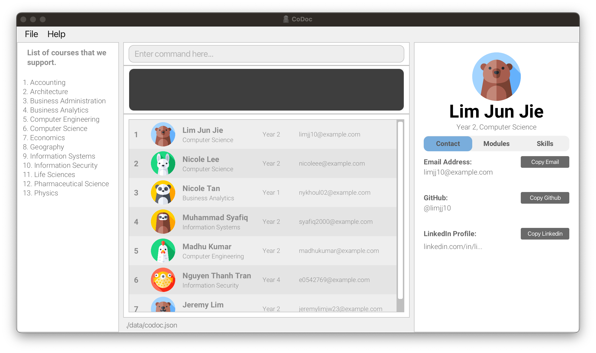

# CoDoc User Guide
#### Welcome to CoDoc, a desktop app for students in SoC to connect with each other for the benefit of their course of study.
CoDoc is optimized for use via a **Command Line Interface (CLI)** while still having the benefits of a **Graphical User Interface (GUI)**. 
If you can type fast, CoDoc can get your contact management tasks done **faster** than traditional GUI apps, **improving** your **networking experience**.

You can spend **less time** _keeping track of your contacts_ and _searching through chats_, and spend **more time** making _meaningful connections_ and _accomplish your goals_.

--------------------------------------------------------------------------------------------------------------------

# Table of Contents
- [Navigating the user guide](#navigating-the-user-guide)
- [Glossary](#glossary)
- [Quick Start](#quick-start)
  - [Download and Installation](#download-and-installation)
  - [Navigation](#navigation)
  - [Tutorial](#tutorial)
    - [Adding a person](#1-adding-a-person)
    - [Viewing a person's modules](#2-viewing-a-persons-modules)
    - [Editing a person's modules](#3-editing-a-persons-modules)
    - [Finding a person by their modules](#4-finding-a-person-by-their-modules)
- [Commands](#commands)
  - [Viewing help : `help`](#viewing-help--help)
  - [Adding a person : `add`](#adding-a-person--add)
  - [Viewing a person/Changing tabs : `view`](#viewing-a-personchanging-tabs--view)
  - [Editing a person : `edit`](#editing-a-person--edit)
  - [Finding a person : `find`](#finding-a-person--find)
  - [Lising all persons/Resetting filters : `list`](#listing-all-personsresetting-filters--list)
  - [Deleting a person : `delete`](#deleting-a-person--delete)
  - [Clearing all entries : `clear`](#clearing-all-entries--clear)
  - [Exiting the program : `exit`](#exiting-the-program--exit)
- [Data Management](#data-management)
- [FAQ](#faq)
- [Upcoming Features](#upcoming-features)
- [Command Summary](#command-summary)
- [Additional Resources](#additional-resources)
  - [How To Check Java Version](#how-to-check-java-version)
  - [How to Open CoDoc](#how-to-open-codoc)

--------------------------------------------------------------------------------------------------------------------
## Navigating the User Guide
Before you start using CoDoc, you are recommended to read the
[Glossary](#glossary), [Quick Start](#quick-start) as well as [Notes about the command format](#notes-about-the-command-format)
sections, which will provide the necessary information to allow you to familiarise yourself with the structure of this
User Guide and help you navigate it with ease.

If you are first time users of CoDoc, we highly recommend that you read through the **entire user guide** in order to become 
**familiar** with CoDoc and to gain the most out of your experience.

We have provided a quick tutorial on how to [download and install](#download-and-installation) CoDoc, 
how to make sense of the [interface](#navigation), as well as how to [properly use each command](#tutorial). 

If you are proficient with the command types and are looking for a quick summary of our commands, you may jump to our [Command Summary](#command-summary) that contains relevant examples.

If you are looking for a detailed explanation of each individual command, you may jump to the [Commands Section](#commands).
Each command is complete with:
1. What the command does
2. The format of the command
3. Examples of the command
4. Picture of the command in action
5. Any additional tips or warnings

If you have questions regarding storing of information, you may proceed to our [Data Management Section](#data-management).

Should you have more questions, you may proceed to our [FAQ](#faq). We hope it will be sufficient to clarify your doubts.

Whenever you are in doubt, forget the command formats for any feature, need help troubleshooting
or you simply want to maximise your use of this application, do remember to revisit this User Guide.
Thank you for choosing CoDoc, and we hope you have a pleasant experience :+1:

[Scroll back to *Table of Contents*](#table-of-contents)

## Glossary
<table>
  <tr>
    <th><strong>Terminology</strong></th>
    <th><strong>Meaning / Purpose</strong></th>
  </tr>
  <tr>
    <td><strong>Command Line Interface (CLI)</strong></td>
    <td>
      A text-based interface that is used to operate software (such as CoDoc) and operating systems. CLI
      allows a user to perform tasks by entering commands.  
      Users enter the specific command, press “Enter”, and then wait for a response.
      After receiving the command, the CLI processes it accordingly and shows the output/result on the screen.
    </td>
  </tr>
  <tr>
    <td><strong>Graphical User Interface (GUI)</strong></td>
    <td>
      A system of interactive visual components for computer software. A GUI displays objects that convey information,
      and represent actions that can be taken by the user. The objects change color, size, or visibility when the user
      interacts with them.
    </td>
  </tr>
  <tr>
    <td><strong>Prefix</strong></td>
    <td>
      An identifier that indicates which field our input is meant for. It is denoted by a letter or symbol followed by a slash <code>/</code>. E.g. <code>n/</code> indicates name, <code>c/</code> indicates course, <code>m+/</code> indicates addition of a module, <code>s-/</code> indicates deletion of a skill ...
    </td>
  </tr>
  <tr>
    <td><strong>Index</strong></td>
    <td>
      An identifier which is the number corresponding to order of which your contacts and courses are listed out, 
      and used in conjunction with the commands to specify the contact with the given index. Each contact and course 
      is identified with a unique index. Index must be a positive integer 1, 2, 3, ...
    </td>
  </tr>
  <tr>
    <td><strong>Parameter</strong></td>
    <td>
      An input that you as the user, will give to the command. These can be in the form of an integer, or a name, 
      or an email.
      Some commands take in a parameter after the prefix,
      some commands take in a parameter without a prefix, and some commands don't take in parameters.
    </td>
  </tr>
  <tr>
    <td><strong>:bulb: Tip</strong></td>
    <td>
      To provide you with suggestions on how to use the commands as well as address potential confusions when using
      these commands, so you will be able to better understand how the commands work.
    </td>
  </tr>
  <tr>
    <td><strong>:warning: Caution</strong></td>
    <td>
      To inform you of some unintended consequences that may occur when you use the commands, so you will be
      able to use them appropriately.
    </td>
  </tr>
</table>

As recommended in the introduction, we would like to direct you to read the [Quick Start](#quick-start) section next.

[Scroll back to *Table of Contents*](#table-of-contents)

## Quick Start

### Download and Installation

Before you can use CoDoc, you need to download it. To do this, follow these steps:

1. Ensure you have `Java 11` or above installed in your Computer. -> [How To Check Java Version](#how-to-check-java-version)
   * If not, you can download it from [here](https://www.oracle.com/java/technologies/downloads/#java11)
2. Download the latest version of `codoc.jar` [here](https://github.com/AY2223S2-CS2103T-F12-2/tp/releases/tag/v1.3.trial).
3. Copy the file to the folder you want to use as the _home folder_ for CoDoc. 
   For example,
   1. Create a new folder in your Desktop—this folder will then be the _home folder_.
   2. Place `codoc.jar` into the newly created folder.
4. Open a command terminal -> [How to Open CoDoc](#how-to-open-codoc)
   1. `cd` into the folder you put the jar file in.
   2. `java -jar codoc.jar` to run the application. 
   3. A window similar to the one below should appear in a few seconds.

      
       

[Scroll back to *Table of Contents*](#table-of-contents)

### Navigation

Before we begin, let's familiarize ourselves with the different parts of the CoDoc interface.
Maximise the screen to have a clearer view.
This way you can see more content as well.

- **Menu Bar:** if you ever feel stuck, you can always click on the `Help` button here or enter `help` in the command box. 
- **Command Box:** this is where you can type in commands.
- **Result Display:** shows the result of a command that you have executed.
- **Person List Panel:** here are your contacts in CoDoc.
- **Course List Panel:** you can refer to this list when adding a person.
- **Info Panel:** displays information about a selected person, such as their contact details, modules, and skills, which are presented as tabs.

[Scroll back to *Table of Contents*](#table-of-contents)

### Tutorial

Now that you know how to navigate CoDoc, let's start by adding a person to our contact list! To do this, follow these steps:

#### 1. Adding a person

Let's start by adding a person named Bob, a year 2 student taking Computer Science with the email e0823741@nus.edu. 

Enter the command `add n/Bob y/2 c/6 e/e0823741@nus.edu` into the command box. This will add a new person named Bob to our contact list. 

**Note:** You must specify minimally, the person's _name_, _email_, _year_ and _course_ when adding a person.

As you can see, we first specify the `add` command followed by the _name prefix_ `n/` and the _name_ that we want to add i.e. `Bob`. Same goes for the _year_, _course_ and _email_. 

**Note:** The person's _course_ corresponds to its index in the course list panel.

Here we used `c/6`, because if you look at the course list panel on the left, Computer Science refers to index `6`. 

If you want to, you can add other details of the person such as his/her _GitHub username_, _LinkedIn profile URL_, _modules_ and _skills_.

Related docs: [Adding a person: `add`](#adding-a-person--add)

If you followed the steps above correctly, you would see Bob added at the bottom of the person list panel:

**Note:** Your profile pictures and the profile pictures shown here might not be exactly the same as they are randomised.

#### 2. Viewing a person's modules

To view Bob in the right info panel, enter `view 8`.
His _contact_ details will then be shown in the info panel, under the _contact_ tab. We use `8` here because Bob's index is 8 in the person list panel.

**Note:** The specified index used with the `view` command must correspond to the index of the person that you want to `view` in the person list panel.

Now let's change to his _modules_ tab: enter `view m` in the command box.
As shown below, he does not have any _modules_ currently.

You can enter `view s` as well if you want to see Bob's _skills_. You can also view other contacts by specifying the person's index in the list i.e. `view 2` would load Nicole Lee in the info panel.

**Related docs:** [Viewing a person/Changing tabs: `view`](#viewing-a-personchanging-tabs--view)

#### 3. Editing a person's modules

To update Bob's module list to have let's say CS2101 and CS2103T, first make sure that Bob is shown in the right info panel, by entering `view 8`. 

Then enter `edit m/ay2223s2 cs2101 m/ay2223s2 cs2103t` in the command box. 

**Note:** Editing only works on the person shown in the info panel. If the person you want to edit is not shown in the info panel, you have to use the `view` command first to view that person, then edit as you wish. Also, _modules_ must follow a certain format to be successfully added/edited.

**Related docs:** [Viewing a person/Changing tabs: `view`](#viewing-a-personchanging-tabs--view), [Editing a person: `edit`](#editing-a-person--edit)

Bob's updated module list (enter `view m` if you're not on the _modules_ tab) would look like this after you entered the `edit` command:

You might be thinking why not we just add Bob's _modules_ in the first place when adding him? You can do that! But for this tutorial, we have separated it to show how you can use the `edit` command. 

You can also edit other details of the person such as his/her _name_, _year_, _GitHub username_, etc., not just their _modules_.

**Related docs:** [Adding a person: `add`](#adding-a-person--add), [Editing a person: `edit`](#editing-a-person--edit)

#### 4. Finding a person by their modules

Let's try to find contacts that are taking/have taken CS2103T. First, let's reset all existing filters if they have been applied. We can do this by entering `list`. This shows us all the contacts in CoDoc. 

Then enter `find m/cs2103t`. This would show the contacts in the person list panel that have CS2103T in their module list:

Here, if you followed the previous steps correctly, Bob would be shown as well.

Our `find` command is pretty powerful; it works for other attributes, like _year_, _skills_, etc. and you can find by multiple attributes. To learn more about it, you can take a look at [Finding a person: `find`](#finding-a-person--find)

**Related docs:** [Finding a person: `find`](#finding-a-person--find), [Listing all persons/Resetting filters: `list`](#listing-all-personsresetting-filters--list)

**Congrats! You have completed the tutorial 🎉** 

The pre-existing contacts are just some examples that you can play around with, but if you want to start with a fresh contact list, enter `clear` to clear all contacts. 

Lastly, if you need more info on the usage of each command, you can refer to the relevant sections below. 

[Scroll back to *Table of Contents*](#table-of-contents)

## Commands

### Viewing help : `help`

`help` 
> 
> * Opens help menu  
> * Equivalent to clicking Help > Help F1 via the GUI  

[Scroll back to *Table of Contents*](#table-of-contents)

### Adding a person : `add`

Adds a new contact into your CoDoc application. 

There are **compulsory** parameters that must be specified to create the new contact.
Once the person has been created, the result display will show a confirmation message and the person can be seen at the bottom of the person list panel.

`add n/NAME e/EMAIL y/YEAR c/COURSE_INDEX [OPTIONAL/PARAMETER]...` 
>
> **Compulsory parameters:**
> - n/NAME (eg. n/John Doe)
> - e/EMAIL (eg. e/johndoe123@email.com)
> - y/YEAR (eg. y/3)
> - c/COURSE_INDEX (eg. c/1)
>
> **Optional parameters:**
> - g/GITHUB (eg.g/johnny)
> - l/LINKED (eg. l/linkedin.com/in/john-doe)
> - m/MODULE YEAR (eg. m/AY2223S1 CS2103T, m/AY2122S2 CS2101)
> - s/SKILL (eg. s/C++, s/Rust)
>
> 💡 **Tip:** A person can have any number of [OPTIONAL/PARAMETER] (including 0)
>
> **Examples:**
> - `add` n/Betsy Crowe e/betsycrowe@example.com y/4 c/1 g/betsy123 l/linkedin.com/in/betsy-123
>   
> - `add` n/John Doe e/johnd@example.com y/2 c/3
    

[Scroll back to *Table of Contents*](#table-of-contents)

### Viewing a person/Changing tabs : `view`

Controls the what is displayed in the right panel. 

If an `integer` is specified, the person displayed on the right will be the person in the person list that has the **same index** as the integer given.

If `c` is specified, the tab on the right will switch to the **contact information**.

If `m` is specified, the tab on the right will switch to the **modules taken**.

If `s` is specified, the tab on the right will switch to the **skills** that the person has.

`view <PARAMETERS>` 

> 
> **Acceptable parameters:**
> - Any index number within the length of the person list (e.g. view 2)
> - c (e.g. view c)
> - m (e.g. view m)
> - s (e.g. view s)
>
> 💡 **Tip:** If the right panel is showing a person's module, changing the person by typing `view 3` for example, will result in the right panel displaying the module tab of the person at index 3. The same applies for skills.
>
> **Examples:**
> - `view` 2
     
> - `view` m
     

[Scroll back to *Table of Contents*](#table-of-contents)

### Editing a person : `edit`

Edits the person displayed in the view panel. Existing values will be updated to the input values.

At least one of the optional fields must be provided.

- You can remove a person's Github by typing `g/` without specifying any Github username after it
- You can remove a person's Linkedin by typing `l/` without specifying any Linkedin URL after it
- You can remove all the person’s modules by typing `m/` without specifying any modules after it
- You can remove all the person’s skills by typing `s/` without specifying any skills after it

`edit [OPTIONAL/PARAMETER]...` 

> **Acceptable Parameters**
> - n/NAME (eg. n/John Doe)
> - e/EMAIL (eg. e/johndoe123@email.com)
> - y/YEAR (eg. y/3)
> - c/COURSE_INDEX (eg. c/1)
> - g/GITHUB (eg.g/johnny)
> - l/LINKED (eg. l/linkedin.com/in/john-doe)
> - m/MODULE YEAR (eg. m/AY2223S1 CS2103T, m/AY2122S2 CS2101)
>> - m+/MODULE YEAR (eg. m+/AY2223S1 CS2103T, m+/AY2122S2 CS2101)
>> - m-/MODULE YEAR (eg. m-/AY2223S1 CS2103T, m-/AY2122S2 CS2101)
> - s/SKILL (eg. s/C++, s/Rust)
>> - s+/SKILL (eg. s+/C++, s+/python)
>> - s-/SKILL (eg. s-/C++, s-/python)
>
> 💡 **Tip:** If `s/` or `m/` is present in the edit command, this will take precedence over `s+/ s-/ m+/ m-/`.
> 
> 
> **Examples:**
> - `edit` g/johndoeee e/johndoeee@example.com will edit the Github username and email address of the person to be johndoee and johndoe@example.com respectively.
> 
> - `edit` s/java s+/python Clears resets the skill list to contain only java and ignores the python skill addition.
>
> - `edit` m-/ay2223s2 cs3230 Displays an error message as the module does not exist.
> 
> 
[Scroll back to *Table of Contents*](#table-of-contents)

### Finding a person : `find`
`find [OPTIONAL/PARAMETER]...` 
>> find KEYWORD [MORE_KEYWORDS]
> * The search is case-insensitive. e.g `hans` will match `Hans`
> * The order of the keywords does not matter. e.g. `Hans Bo` will match `Bo Hans`
> * Only the name is searched.
> * Only full words will be matched e.g. `Han` will not match `Hans`
> * Persons matching at least one keyword will be returned (i.e. `OR` search).
    e.g. `Hans Bo` will return `Hans Gruber`, `Bo Yang`
>
> **Examples:**
> - `find John` returns `john` and `John Doe`
> - `find alex david` returns `Alex Yeoh`, `David Li` 
    

[Scroll back to *Table of Contents*](#table-of-contents)

### Listing all persons/Resetting filters : `list`

Displays the full list of all persons stored in the person list panel. 

`list` 

💡 **Tip:** Use this command to revert back to the original list after performing the `find` command to shorten the list dsiplayed.
> * `list`
> 

[Scroll back to *Table of Contents*](#table-of-contents)

### Deleting a person : `delete`

Deletes the person at the specified INDEX. 

INDEX refers to an index currently shown in the displayed person list. You may check out our [Glossary](#glossary) for more information. 

E.g. `delete 1` will delete the current person at index 1 as shown in the list panel. 

`delete <INDEX>` 

> * `delete 6` deletes Betsy Crowe who was at index 6
> 

[Scroll back to *Table of Contents*](#table-of-contents)

### Clearing all entries : `clear`
`clear` 
> * :warning: Clears **all** entries from CoDoc. 
> 

[Scroll back to *Table of Contents*](#table-of-contents)

### Exiting the program : `exit`

Exits the program.  
Equivalent to clicking the close button via the GUI.  

>`exit` 
 

[Scroll back to *Table of Contents*](#table-of-contents)

## Data Management
**Q**: How do I save my person list? 
**A**: CoDoc automatically saves your person list after every successful `add`, `edit` and `clear`.

**Q**: How do I transfer my data to another Computer? 
**A**: Install CoDoc in the other computer and overwrite the empty data file it creates with the file that contains the data of your previous CoDoc home folder.

**Q**: Where is the data file stored? 
**A**: CoDoc data are saved as a JSON file at ***[JAR file location]*****/data/codoc.json**. Advanced users are welcome to update data directly by editing that data file.

:warning: If your changes to the data file makes its format invalid, CoDoc will discard all data and start with an empty data file at the next run.

[Scroll back to *Table of Contents*](#table-of-contents)

## FAQ

[Scroll back to *Table of Contents*](#table-of-contents)

## Upcoming Features

### Automated bulk edits `[coming in v2.0]`
_Details coming soon ..._

### Archiving data files `[coming in v2.0]`

_Details coming soon ..._

 

[Scroll back to *Table of Contents*](#table-of-contents)

## Command Summary 

| Actions                          | Description                                                                                                                                 |
|----------------------------------|---------------------------------------------------------------------------------------------------------------------------------------------|
| Add a person                     | add n/Bob Sim y/2 c/1 e/e0823741@nus.edu g/bobabob l/linkedin.com/in/bom-sim-086g93847 m/ay2223s2 CS2103T m/AY2223S2 cs2101 s/python s/java |
| Clear all persons                | clear                                                                                                                                       |
| Delete person at index 3         | delete 3                                                                                                                                    |
| Edit contact in the right panel  | edit n/David m+/AY2223S2 CS2109S s-/python                                                                                                  |
| Find by attributes               | find n/David c/2 m/CS2109S s/java                                                                                                           |
| List the full list of contacts   | list                                                                                                                                        |
| View contact                     | view 3                                                                                                                                      |
| View tab                         | view c, view m, view s                                                                                                                      |
| View user guide and command list | help                                                                                                                                        |

[Scroll back to *Table of Contents*](#table-of-contents)

--------------------------------------------------------------------------------------------------------------------

## Additional Resources
### How To Check Java Version
[Scroll back to *Downloading CoDoc*](#downloading-codoc)
### How to Open CoDoc
[Scroll back to *Downloading CoDoc*](#downloading-codoc)

--------------------------------------------------------------------------------------------------------------------
[Scroll back to *Table of Contents*](#table-of-contents)
