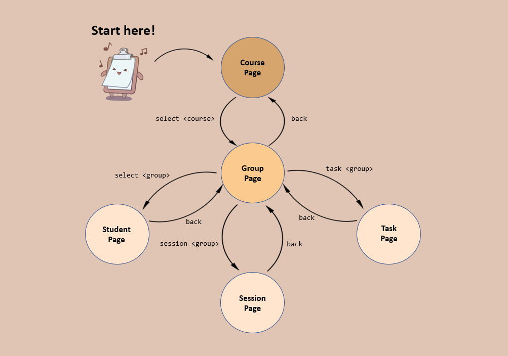

## Welcome

<div style="display: flex; align-items: center;">
  <p>CLIpboard is a user-friendly desktop application that helps educators manage their students' particulars. </p>
  
</div>
ClIpboard is great for you if:

1. You have to manage lots of students and classes
2. You prefer typing
3. You dislike dealing with boring spreadsheets

In this guide, we will walk you through the entire CLIpboard experience, whether you're a beginner learning to set up, or you're looking to take your skills to the next level, you're in the right place.

Let's dive in!

- [Definitions](#definitions)
- [Getting Started](#getting-started)
  - [Setting Up](#setting-up)
  - [Quick Start](#quick-start)
  - [Visual Guide](#visuals)
  - [Navigation Guide](#navigation)
- [Features](#features)
  - [Commands](#commands)
  - [General Features](#general-features)
  - [Managing Courses](#managing-courses)
  - [Managing Groups](#managing-groups)
  - [Managing Students](#managing-students)
  - [Managing Sessions](#managing-sessions)
  - [Managing Attendance](#managing-the-attendance-of-a-session)
  - [Managing Tasks](#managing-tasks)
  - [Managing Grades](#managing-the-grades-of-a-task)
- [Glossary](#glossary)

---

## Definitions

* **Command**: A line of text that CLIpboard recognises as an instruction to execute.
* **Path**: A line of text that describes a file location on a computer.
  - Example: `C:/Users/AlexYeoh/Desktop/A0123456X.png` is a file path.
* **Navigate**: Switching between the multiple pages that CLIpboard offers. (See: [`select`](#selecting-a-course-select) or [`back`](#displaying-the-previous-page-you-were-at-back) commands)
* Text formatted like `this` represents a program-related element. Depending on context, it can mean:
  1. A command that CLIpboard recognises
     - Example: `add group t15-4` is a valid command you can execute.
  2. A file path
  3. A keyboard key
  4. An element in the visual interface (See the [Visuals](#visuals) section for more details)
* **">" (Forward Angle Bracket)**: Indicates a sequence of actions for you to take.
  - Example: "Click on `File > Exit`" means you should click on `File`, then `Exit`.
* **Note**: Important information to be aware of.

<div markdown="span" class="alert alert-info">:information_source: **Note:**
 A note looks like this.
</div>

* **Tip**: Useful information to help you enhance your skills with CLIpboard.

<div markdown="span" class="alert alert-primary">:bulb: **Tip:**
A tip looks like this.
</div>

* **Caution**: Critical information about how CLIpboard behaves. Disregarding these might cause CLIpboard to not behave as you would expect.

<div markdown="span" class="alert alert-warning">:exclamation: **Caution:**
A caution looks like this.
</div>

* Please see the [Glossary](#glossary) section for more detailed and specific definitions.

---

## Getting started

### Setting up

1. Ensure you have Java 11 or above installed on your Computer.
2. Download the latest `clipboard.jar` from [here](https://github.com/AY2223S2-CS2103T-T15-4/tp/releases).
3. Copy the file to the folder you want to use as the *home folder* for your CLIpboard.
4. Open a command terminal, `cd` into the folder you put the jar file in, and use the `java -jar clipboard.jar` command to run the application.&nbsp;
   <br>e.g. your `clipboard.jar` is stored in the `user/app/task/` directory. You run `cd user/app/task/`, then `java -jar clipboard.jar`.
   <br>A GUI similar to [*Figure 1(TO FIX)*](#to fix) should appear in a few seconds.
   <br>*Note how the app contains some sample data.*

### Quick Start

1. When you first launch CLIpboard, you will be brought to the `Course page`.
2. Type your command in the `command box` and press Enter/Return to execute it.
   <br>e.g. typing `help` and pressing the Enter/Return key will open the help window.
   <br>Some example commands you can try:
   1. `select 1` : Selects the first course displayed (eg. `CS2103T`) on the `Course Page`. You will be redirected to the `Group Page`.
   2. `select 1` : Selects the first group displayed (eg. `T15`) on the `Group Page`. You will be redirected to the `Student Page`.
   3. `add student n/John Doe p/98765432 e/johnd@example.com sid/A1234567X` : Adds a student named `John Doe` with the particulars into the list on the `Student Page`.
   4. `delete student 3` : Deletes the 3rd student (eg. `Lim Kim Choo`) shown in the student list.
   5. `undo` : Returns to the state before the previous `delete student` command you entered. The deleted student (eg. `Lim Kim Choo`) should be back on the list.
   6. `exit` : Exits the app.
3. Refer to the [commands list](#commands) below for a detailed description for each command.

### Visuals

Before diving in, it might be useful to take a moment to understand some of CLIpboard's visual elements. It will make it an even more of a breeze to use CLIpboard effectively!

The image below depicts how some of the visual elements are referred to in this guide.

<a name="figure2"></a>

<br>
<span style="font-size: 10px; font-style: italic;">Figure 2</span>

### Navigation

Navigating between pages is made effortless with CLIpboard's intuitive navigation commands.
Simply choose from a selection of `select`, `back`, `session`, or `task` commands.

Here's a handy navigation map to get around CLIpboard.

<a name="figure3"></a>

<br>

Here's a hypothetical workflow that might help you better understand the figure above:<br>
*Say you wish to assign the grades for a task in one of your tutorial groups.*

1. You'll first start on the `Course Page`.
2. Enter the command `select 1` to select the *first* course in the course list. You'll then be brought to the `Group Page` to view the groups of your selected course.
3. You see now that the group you wish to select is the *second* group in the list, so you enter the command `task 2`, and you'll be brought to the `Task Page` of your selected group. Here, you can choose from the tasks that are available, and subsequently enter the grades for your individual students.

*Now, you wish to work on something else, like marking the attendance for another group.*
4. From where we left off, simply enter the command `back` and you'll be brought back to the `Group Page`.
5. From here, you can use `session 4` to view the `Session Page` of the fourth group, and you can then mark their attendance for a selected session.

---

## Features

Here is a list of features that CLIpboard supports:

- [General Features: ](#general-commands)
  - [Displaying the home page: ](#displaying-the-home-page-home) `home`
  - [Displaying the previous page: ](#displaying-the-previous-page-you-were-at-back) `back`
  - [Undoing the last command you did: ](#undoing-the-last-command-you-did-undo) `undo`
  - [Help: ](#help-help) `help`
  - [Scrolling through command history: ](#scrolling-through-command-history-up-or-down-arrow-key) `UP` or `DOWN` arrow key
  - [Clearing all entries: ](#clearing-all-entries-clear) `clear`
  - [Exiting the program: ](#exiting-the-program-exit) `exit`
- [Managing Courses: ](#course-page-commands)
  - [Adding a course: ](#adding-a-course-add-course) `add course`
  - [Deleting a course: ](#deleting-a-course-delete-course) `delete course`
  - [Editing a course: ](#editing-a-course-edit-course) `edit course`
  - [Selecting a course to display its Group Page: ](#selecting-a-course-select) `select`
  - [Finding a course: ](#finding-a-course-find-course) `find course`
- [Managing Groups: ](#group-page-commands)
  - [Adding a group: ](#adding-a-group-add-group) `add group`
  - [Deleting a group: ](#deleting-a-group-delete-group) `delete group`
  - [Editing a group: ](#editing-a-group-edit-group) `edit group`
  - [Selecting a group to display its Student Page: ](#selecting-a-group-select) `select`
  - [Displaying sessions of a group: ](#displaying-sessions-of-a-group-session) `session`
  - [Displaying tasks of a group: ](#displaying-tasks-of-a-group-task) `task`
  - [Finding a group: ](#finding-a-group-find-group) `find group`
- [Managing Students: ](#students-page-commands)
  - [Adding a student: ](#adding-a-student-add-student) `add student`
  - [Deleting a student: ](#deleting-a-student-delete-student) `delete student`
  - [Editing a student: ](#editing-a-student-edit-student) `edit student`
  - [Copying a student&#39;s email: ](#copying-a-students-email-copy) `copy`
  - [Finding students by name or student ID: ](#finding-students-by-name-or-student-id-find-student) `find student`
  - [Sorting list of students: ](#sorting-list-of-students-sort) `sort`
  - [Displays a student&#39;s information:  ](#displays-a-students-information-select) `select`
  - [Adding or deleting a remark: ](#adding-or-deleting-a-remark-remark) `remark`
  - [Upload a student&#39;s photo: ](#uploading-a-students-photo-upload) `upload`
  - [Displays a summary of a student&#39;s attendance: ](#viewing-a-students-attendance-throughout-the-course-attendance) `attendance`
- [Managing Sessions: ](#session-page-commands)
  - [Adding a session: ](#adding-a-session-add-session) `add session`
  - [Deleting a session: ](#deleting-a-session-delete-session) `delete session`
  - [Editing a session: ](#editing-a-session-edit-session) `edit session`
  - [Selecting a session to start attendance-taking: ](#selecting-a-session-to-start-attendance-taking-select) `select`
  - [Finding a session: ](#finding-a-session-find-session) `find session`
- [Managing Attendance: ](#attendance-page-commands)
  - [Marking attendance of a selected students: ](#marking-selected-students-as-present-mark) `mark`
  - [Unmarking attendance of a selected students: ](#marking-selected-students-as-absent-unmark) `unmark`
  - [View the overall attendance of the session: ](#view-the-overall-attendance-of-the-session-attendance) `attendance`
- [Managing Tasks: ](#task-page-commands)
  - [Adding a task: ](#adding-a-task-add-task) `add task`
  - [Deleting a task: ](#deleting-a-task-delete-task) `delete task`
  - [Editing a task: ](#editing-a-task-edit-task) `edit task`
  - [Selecting a task to assign grades: ](#selecting-a-task-to-assign-grades-select) `select`
  - [Finding a task: ](#finding-a-task-find-task) `find task`
- [Managing Grades: ](#grades-page-commands)
  - [Assigning a grade: ](#assigning-a-grade-to-student-assign) `assign`

### Commands

Features in CLIpboard are supported by commands.
Commands are like giving instructions to CLIpboard on what to do.

A typical command would look like this:
<br>


**Command keyword(s)**: Typically 1 or 2 words, they specify the type of action for CLIpboard to execute
**Supplementary command information**: These provide additional context about a command you wish to execute. Conventionally, these are referred to as "arguments" or "parameters".

Putting it together for the above example, `find course` would tell CLIpboard that you're looking for a course, and "cs2101" tells CLIpboard which specific course you're looking for.

<div markdown="block" class="alert alert-warning">:exclamation: **Caution:** <br>

* If a command expects a parameter to be input only once, but multiple instances of it are included, only the last occurence of the parameter will be taken.<br>
  * e.g. if you specify `p/12341234 p/56785678`, only `p/56785678` will be taken.
* Extraneous parameters for commands that do not expect any parameters will be ignored.<br>
  * e.g. if you input the command `help 123`, CLIpboard will interpret it simply as `help`.

</div>

#### Understanding Command Formats

- **Supplementary command information**: These are represented in uppercase and enclosed by angle brackets (`<>`).<br>
  - e.g. in `add course <COURSE>`, `COURSE` is a parameter which can be used as `add course CS2103T`.
- **Square brackets (`[]`)**: Parameters in square brackets are optional.<br>
  - e.g If the parameters are specified as `[n/<NAME>] [p/<PHONE_NUMBER>]`, omitting these parameters are acceptable.
- **Elipses(`...`)**: Parameters postfixed by `…` can have multiple inputs.<br>
  - e.g. `mark <INDEX>…` can be used as `mark 1` or `mark 1,2,3` etc.
- **Index**: CLIpboard displays items like courses and groups as numbered lists. The *index* of an item in the list might be required as a parameter for some commands.
  - e.g. if the specified command format is `delete course <INDEX>`, and you enter `delete course 3`, CLIpboard will delete the *third* course in the course list.
- **Multiple Parameters**: Some commands require multiple parameters. In such cases, each parameter would require a specific corresponding prefix to denote the type of information it is.
  - e.g When adding a student, there may be multiple pieces of information to tied to a student.
    Thus, a typical command for adding a student might look like `add student n/john doe p/12345678`.
    In this command,
    - The prefix `n/` in `n/john doe` tells CLIpboard that this parameter is the student's name.
    - The prefix `p/` in `p/12345678` tells CLIpboard that this parameter is the student's phone number.
- **Parameters can be input in any order**<br>
  - If the command format specifies the required parameters as `n/NAME p/PHONE_NUMBER`, an alternative format like `p/PHONE_NUMBER n/NAME` is also acceptable.

<div markdown="span" class="alert alert-info">
  :information_source: **Note:** It is important to enter commands exactly in their required formats in order for CLIpboard to understand them.<br>
</div>

---

## General Features

General features are features that may be used anywhere on CLIpboard, regardless of the page you're on.

### Showing the home page: `home`

Brings you to the home page, which is the `Course Page` of CLIpboard.

**Command Format:**

```
home
```

[Back to list of features](#commands)

### Going back to the previous page: `back`

Brings you back to the previous page you were at.

**Command Format:**

```
back
```

[Back to list of features](#features)

### Undoing the last command you did: `undo`
Because everyone makes mistakes.

You may `undo` up to 5 previous commands.

**Command Format:**

```
undo
```

[Back to list of features](#features)

### Help: `help`
When you're feeling lost or unsure of how to do something, use this command to open the help window.
There, you can see a list of available commands on your current page, as well as a link to this User Guide.

**Command Format:**

```
help
```

[Back to list of features](#features)

### Clearing all entries: `clear`

Clears all entries in the list of the current page. Useful for when you've ended the curriculum and you wish to delete all data.

<div markdown="span" class="alert alert-primary">:bulb: **Tip:**
Accidentally cleared your data? Don't worry, just run the <code>undo</code> command!
</div>

<div markdown="span" class="alert alert-warning">:exclamation: **Caution:**
Be very careful with this command. Deleted data may not be recovered after closing the application or if you've gone beyond the `undo` limit.
</div>

**Command Format:**

```
clear
```

[Back to list of features](#features)

### Scrolling through command history: `UP` or `DOWN` arrow key

You can scroll through your past commands using the `UP` or `DOWN` arrow keys.
You may then use the `LEFT` or `RIGHT` arrow keys to edit the command.
Press `ENTER` to execute the command.

[Back to list of features](#features)

### Exiting the program: `exit`
Goodbye!
**Command Format:**

```
exit
```

[Back to list of features](#features)

---

## Managing Courses
In the following sections, you will find the features that are available to you on the `Course Page`.
The `Course Page`, typically looks like this:


<br>
<span style="font-size: 10px; font-style: italic;">Figure 4</span>


### Adding a course: `add course`
If you're teaching a new course, you can use this command to add it to the `Course Page`.

**Command Format:**

```
add course <COURSE>
```

- Adding a course with the same module code is not allowed.
  - For example, if a course with module code `CS2103T` already exists in CLIpboard, entering `add course CS2103T` will display an error message inside the result display.

<div markdown="block" class="alert alert-info">
This command is case-sensitive.<br>
e.g. <code>CS2103T</code> and <code>cs2103t</code> are treated as different courses.
</div>

Examples:

- `add course CS2103T` will add a new course with module code `CS2103T`
- `add course CS2105` will add a new course with module code `CS2105`

<div markdown="span" class="alert alert-info">:information_source: **Note:**
  Course codes can contain alphanumeric and special characters. e.g. "AY2223S2-CS2103T"
</div>

<br>

[Back to list of features](#features)

### Deleting a course: `delete course`
If you wish to remove a course, use this command to delete it.

**Command Format:**

```
delete course <INDEX>
```

Examples:

- `delete course 1` will delete the first course listed in the course list.

[Back to list of features](#features)

### Editing a course: `edit course`

Use this command to edit the name of an existing course.

**Command Format:**

```
edit course <INDEX> <NEW COURSE NAME>
```

Examples:

- `edit course 1 CS2106` will rename the first course listed in the course list to `CS2106`.

[Back to list of features](#features)

### Selecting a course: `select`
To view the groups within a course, use `select` to select a course. This navigates you to its corresponding `Group Page`.

**Command Format:**

```
select <INDEX>
```

Examples:

- `select 1` will display a list of groups from the first course.

[Back to list of features](#features)

### Finding a course: `find course`

Finds course(s) that contains any of the given keywords(s) in the module code.

**Command Format:**

```
find course <KEYWORD> [<MORE_KEYWORDS>]
```

- This command is case-insensitive. (e.g. `find course CS2103T` and `find course cs2103t` will give you the same result)
- Keywords are separated by spaces.

Example:
  If my course list contains 2 courses "CS2103T" and "CS2101":
  - `find course CS` will show "CS2103T", "CS2101".
  - `find course 03` will show "CS2103T".

[Back to list of features](#features)

---

## Managing Groups
In the following sections, you will find the features that are available to you on the `Group Page`.
The `Group Page`, typically looks like this:


<br>
<span style="font-size: 10px; font-style: italic;">Figure 5</span>

### Adding a group: `add group`

Adds a group to the list of groups in the group page.

**Command Format:**

```
add group <GROUP>
```

- Adding a group with the same group name is not allowed.
  - For example, if a group with group name `T15` already exists in CLIpboard,
    entering `add group T15` will display an error message inside the result display.

<div markdown="block" class="alert alert-info">
This command is case-sensitive.<br>
e.g. <code>T15</code> and <code>t15</code> are treated as different groups.
</div>

Examples:

- `add group T15` will add a new group with group name `T15`
- `add group L08` will add a new group with group name `L08`

<div markdown="span" class="alert alert-info">:information_source: **Note:**
  Group names can contain alphanumeric and special characters. e.g. "AY2223S2-T15"
</div>

<br>

[Back to list of features](#features)

### Deleting a group: `delete group`

Deletes a group from the list of groups in the group page.

**Command Format:**

```
delete group <INDEX>
```

Examples:

- `delete group 1` will delete the first group listed in the group list panel of CLIpboard.

[Back to list of features](#features)

### Editing a group: `edit group`

Edits an existing group in the group list.

**Command Format:**

```
edit group <INDEX> <NEW GROUP NAME>
```

- Edits the group name of the group at index specified in `<INDEX>`.

Examples:

- `edit group 1 T16` will rename the first group listed in the group list to `T16`.

[Back to list of features](#features)

### Selecting a group: `select`

Selects an existing group to display its corresponding Student Page.

**Command Format:**

```
select <INDEX>
```

- Selects the group at index specified in `<INDEX>` and displays list of students in that group.

Examples:

- `select 1` will return a list of students from the first group.

[Back to list of features](#features)

### Displaying sessions of a group: `session`

Selects an existing group to display its corresponding Session Page.

**Command Format:**

```
session <INDEX>
```

- Selects the group at index specified in `<INDEX>` and displays list of sessions in that group.

Examples:

- `session 1` will return a list of sessions from the first group.

<div markdown="span" class="alert alert-primary">:exclamation: **Note:**
 Adding new student under a group will propagate to session, but deleting a student will NOT propagate to session.
</div>
<br>

[Back to list of features](#features)

### Displaying tasks of a group: `task`

Selects an existing group to display its corresponding Task Page.

**Command Format:**

```
task <INDEX>
```

- Selects group at index specified in `<INDEX>` and displays list of tasks assigned to that group.

Examples:

- `task 1` will return a list of tasks for the first group.

<div markdown="span" class="alert alert-primary">:exclamation: **Note:**
 Adding new student under a group will propagate to task, but deleting a student will NOT propagate to task.
</div>
<br>

[Back to list of features](#features)

### Finding a group: `find group`

Finds group(s) that contains any of the given keywords(s) in the group name.

**Command Format:**

```
find group <KEYWORD> [<MORE_KEYWORDS>]
```

- This command is case-insensitive. (e.g. `find group T15` and `find group t15` will give you the same result)
- Keywords are separated by spaces.

Examples:

- `find group 15` returns `T15`.

[Back to list of features](#features)

---

## Managing Students

To manage your students, you will have to be on the `Student Page`, which typically looks like this:


<br>
<span style="font-size: 10px; font-style: italic;">Figure 6</span>

The following sections contain the features that are available to you on the `Student Page`.

<div markdown="span" class="alert alert-warning">:exclamation: **Caution:**<br>
  Some commands for managing students require multiple parameters.<br>
  As described in [Understanding Command Formats](#understanding-command-formats), these parameters would require specific prefixes to indicate the type of information they represent. There are also some restrictions on the input for these parameters.<br>

  **Please refer to the table below**
</div>
<br>


| Prefix | Prefix meaning              | Input Restrictions                                                                                                                                                                                                                                                                                                                                                                                                                                                                                                                                                                                                                                                                                               |
| ------ | --------------------------- | ---------------------------------------------------------------------------------------------------------------------------------------------------------------------------------------------------------------------------------------------------------------------------------------------------------------------------------------------------------------------------------------------------------------------------------------------------------------------------------------------------------------------------------------------------------------------------------------------------------------------------------------------------------------------------------------------------------------- |
| n/     | Name                        | Names should only contain alphanumeric characters and spaces, and it should not be blank.                                                                                                                                                                                                                                                                                                                                                                                                                                                                                                                                                                                                                        |
| p/     | Phone Number                | Phone numbers should only contain numbers, and it should be at least 3 digits long.                                                                                                                                                                                                                                                                                                                                                                                                                                                                                                                                                                                                                              |
| e/     | Email                       | Emails should be of the format local-part@domain and adhere to the following constraints:`` 1. The local-part should only contain alphanumeric characters and these special characters, excluding the parentheses, (+_.-). The local-part may not start or end with any special characters. `` 2. This is followed by a '@' and then a domain name. The domain name is made up of domain labels separated by periods. The domain name must: `` - end with a domain label at least 2 characters long `` - have each domain label start and end with alphanumeric characters `` - have each domain label consist of alphanumeric characters, separated only by hyphens, if any. |
| sid/   | Student Identification (ID) | Student IDs should be alphanumeric with no special characters.                                                                                                                                                                                                                                                                                                                                                                                                                                                                                                                                                                                                                                                   |

### Adding a student: `add student`

Adds a student to the student roster.

**Command Format:**

```
add student n/<NAME> p/<PHONE_NUMBER> e/<EMAIL> sid/<STUDENT_ID>
```

- Adding a student with the same student ID is not allowed.
  - For example, if a student with a student ID of `A0123456X` already exists in CLIpboard, entering `add student n/Tom p/99887766 e/tom@example.com sid/A0123456X` will display an error message inside the result display.

Examples:

- `add student n/Tan Wei Xuan p/81776544 e/twx@example.com sid/A6788796F`
- `add student n/Amirul Bin Othman p/98884417 e/amirul@example.com sid/A1324356G`

<div markdown="span" class="alert alert-info">:information_source: **Note:**
  The same student can exist in multiple groups. For example, a student can be in both tutorial group "T1" and a project group "Team15" at the same time.
</div>


<br>

[Back to list of features](#features)

### Deleting a student: `delete student`

Deletes a student from the student roster.

**Command Format:**

```
delete student <INDEX>
```

Examples:

- `delete student 1` will delete the first student listed in the student list panel of CLIpboard.

[Back to list of features](#features)

### Editing a student: `edit student`

If your student has changed their phone number, or if you misspelled their name, you may edit them with this command.

**Command Format:**

```
edit student <INDEX> [n/<NAME>] [p/<PHONE_NUMBER>] [e/<EMAIL>] [sid/<STUDENT_NUMBER>]
```

- Edits student at index specified in `<INDEX>`.
- At least one field `[n/<NAME>]`, `[p/<PHONE_NUMBER>]`, `[e/<EMAIL>]` or `[sid/<STUDENT_NUMBER>]` must be provided.
- Fields entered following `edit <INDEX>` will replace the original fields.
- Fields not entered will not replace the original fields.

<div markdown="span" class="alert alert-primary">:bulb: **Tip:**
Made a typo? Try <code>undo</code> command!
</div>

Examples:

- `edit student 1 n/John Doe` will replace the name of the first student listed in the student list to `John Doe`.
- `edit student 4 p/99887766 e/john@gmail.com` will replace the phone number and email of the fourth student listed in the student list to `99887766` and `john@gmail.com` respectively.

[Back to list of features](#features)

### Copying a student's email: `copy`

Copies a student's email to your clipboard.

**Command Format:**

```
copy <INDEX>
```

Examples:

- `copy 1` will copy the email of the first student in the list to your clipboard.

[Back to list of features](#features)

### Finding students by name or student ID: `find student`

Finds students whose names or student IDs contain any of the given keywords(s).

**Command Format:**

```
find student <KEYWORD> [<MORE_KEYWORDS>]
```

- You can find students using either `name` or `student ID` for the keyword(s).
- Keywords are separated by spaces.
- This command is key-insensitive.

Examples:

- `find student John` returns `John`.
- `find student Alex Yu` returns `Alex Yeoh`, `Bernice Yu`.
- `find student A123` returns students whose student ID contains `A123`, such as `A123` and `A1234567X`.

[Back to list of features](#features)

### Sorting list of students: `sort`

Sorts list of students in student roster.

**Command Format:**

```
sort <CATEGORY>
```

- Current possible categories are `name` and `id`

Examples:

- `sort name` will sort list of students alphabetically according to name.
- `sort id` will sort list of students alphanumerically according to student ID.


[Back to list of features](#features)

### Displays a student's information: `select`

Select a particular student and display his / her particulars.
The selected student will be shown like this:


**Command Format:**

```
select <INDEX>
```

Examples:

- `select 1` will select the 1st student in the student list and display his / her particulars on the view panel on the right.

[Back to list of features](#features)

### Adding or deleting a remark: `remark`

Format for adding / editing a remark:

```
remark <INDEX> [<REMARK>]
```

- Adds a remark to student in the student list whose index is specified in the `<INDEX>` field.
- If there is already an existing remark, this command will replace current remark with `<REMARK>`.

Format for deleting a remark:

```
remark <INDEX>
```

- Deletes a remark from a student in the student list whose index is specified in the `<INDEX>` field.

Examples:

- `remark 1 Loves watching Sci-Fi movies` will add a remark of 'Loves watching Sci-Fi movies' to the first student
  listed in the student list.
- `remark 2` will delete the remark from the second student listed in the student list.

<div markdown="span" class="alert alert-primary">:bulb: **Tip:**
  Accidentally deleted a remark? Don't worry, Try using <code>undo</code> command!
</div>

[Back to list of features](#features)

### Uploading a student's photo: `upload`

Uploads a student's photo to be displayed in the student roster.

**Command Format:**

```
upload <LOCAL_FILE_PATH>
```

- File path to the photo can be either absolute file path or relative file path.
- For student photo to be displayed as the profile picture of a student in CLIpboard, photo must be named after the said
  student's student ID (i.e. `<STUDENT_ID>.png`)
- If a new photo with the same name as an existing photo in CLIpboard is uploaded, existing photo will be replaced.
- Only images of file type `.png` can be uploaded

<div markdown="span" class="alert alert-primary">:bulb: **Tip:**
Images not named correctly can still be uploaded (e.g. <code>Alex.png</code>), but only those named correctly
(e.g. <code>A0123456X.png</code>) will be displayed in the profile of corresponding student.
</div>

Examples:

- `upload C:/Users/AlexYeoh/Desktop/A0123456X.png` will upload `A0123456X.png` to the CLIpboard data folder and the
  photo will be displayed in the profile of student with student ID `A0123456X`

[Back to list of features](#features)

### Viewing a student's attendance throughout the course: `attendance`

Shows a summary of a student's attendance like this:


**Command Format:**

```
attendance
```

TO ADD NOTE: To mark a student's attendance for a particular session, you can navigate to the [Attendance Page](#attendance-page-commands).

[Back to list of features](#features)

---

## Managing Sessions

To manage your sessions of a paritcular group, you will have to be on its respective `Session Page`, which typically looks like this:


<br>
<span style="font-size: 10px; font-style: italic;">Figure 9</span>

The following sections contain the features that are available to you on the `Session Page`.

### Adding a session: `add session`

Adds a session to the list of session in the session page.

**Command Format:**

```
add session <SESSION>
```

- Adding a session with the same session name is not allowed.
  - For example, if a session with name `Tutorial1` already exists in CLIpboard,
    entering `add session Tutorial1` will display an error message inside the result display.
  - Whitespaces are not allowed in session names.

Examples:

- `add session Tutorial4`
- `add session Lab3`

<div markdown="span" class="alert alert-info">:information_source: **Note:**
  Session names can contain alphanumeric and special characters. e.g. "T15-Session-1.2"
</div>


[Back to list of features](#features)

### Deleting a session: `delete session`

Deletes a session from the list of session in the session page.

**Command Format:**

```
delete session <INDEX>
```

Examples:

- `delete session 1` will delete the first session listed in the session list panel of CLIpboard.

[Back to list of features](#features)

### Editing a session: `edit session`

Edits an existing session in the session list.

**Command Format:**

```
edit session <INDEX> <NEW SESSION NAME>
```

Examples:

- `edit session 1 Tutorial1` will rename the first session listed to `Tutorial1`.

[Back to list of features](#features)

### Finding a session: `find session`

Finds session(s) that contains any of the given keywords(s) in the session name.

**Command Format:**

```
find session <KEYWORD> [<MORE_KEYWORDS>]
```

- This command is case-insensitive. (e.g. `find session tutorial1` and `find session Tutorial1`
  will give you the same result)
- Keywords are separated by spaces.

Examples:

- `find session 1` returns `Tutorial1` and `Lab1`.

[Back to list of features](#features)

### Selecting a session to start attendance-taking: `select`

Selects an existing session to start taking attendance for that session by displaying Student Page of that session on the right panel.

**Command Format:**

```
select <INDEX>
```

- Selects session at specified index and displays list of students in that session.

Examples:

- `select 1` will return a list of students from the first session.

[Back to list of features](#features)

---

## Managing the Attendance of a Session

To manage the attendance of a particular session, you will have to be on its respective `Attendance Page`, which typically looks like this:


<br>
<span style="font-size: 10px; font-style: italic;">Figure 10</span>

The following sections contain the features that are available to you on the `Attendance Page`.

### Marking students as present: `mark`

Marks selected students' attendance as present for current session.

**Command Format:**

```
mark <INDEX>
mark <INDEX>, <INDEX>, ...
```

Examples:

- `mark 1` will mark the first student as present.
- `mark 2, 4, 5, 6` will mark the 2nd, 4th, 5th and 6th students as present.

[Back to list of features](#features)

### Marking students as absent: `unmark`

ADD NOTE THAT STUDENTS ARE ABSENT BY DEFAULT

Marks selected students' attendance as absent for current session.

**Command Format:**

```
unmark <INDEX>
unmark <INDEX>, <INDEX>, ...
```

Examples:

- `unmark 1` will mark the first student as absent.
- `unmark 2,3,4` will mark the 2nd, 3rd and 4th students as absent.

[Back to list of features](#features)

### View the overall attendance of the session: `attendance`

Displays the overall attendance of the session you are at in the command box, which will be shown like this:


<br>
<span style="font-size: 10px; font-style: italic;">Figure 11</span>

**Command Format:**

```
attendance
```

[Back to list of features](#features)

---

## Managing Tasks

To manage the tasks of a particular group, you will have to be on its respective `Task Page`, which typically looks like this:


<br>
<span style="font-size: 10px; font-style: italic;">Figure 12</span>

The following sections will contain the features that are available to you on the `Task Page`.

### Adding a task: `add task`

Adds a new task into the task page.

**Command Format:**

```
add task <TASK NAME>
```

- Adding a task with the same task name is not allowed.
  - For example, if a task with name `OP1` already exists in CLIpboard,
    entering `add task OP1` will display an error message inside the result display.

Examples:

- `add task OP3`
- `add task Critical Reflection 3`

<div markdown="span" class="alert alert-info">:information_source: **Note:**
  Task names can contain alphanumeric and special characters. e.g. "AY2223S2-Midterm Practice Paper"
</div>
<br>

[Back to list of features](#features)

### Deleting a task: `delete task`

Deletes a task from the current list of tasks.

**Command Format:**

```
delete task <INDEX>
```

Examples:

- `delete task 1` will delete the first task listed.

[Back to list of features](#features)

### Editing a task: `edit task`

Edits an existing task in the task list.

**Command Format:**

```
edit task <INDEX> <NEW TASK NAME>
```

Examples:

- `edit task 1 CA5` will rename the first task listed to `CA5`.

[Back to list of features](#features)

### Finding a task: `find task`

Finds task(s) that contains any of the given keywords(s) in the task name.

**Command Format:**

```
find task <KEYWORD> [<MORE_KEYWORDS>]
```

- This command is case-insensitive. (e.g. `find task op1` and `find task OP1`
  will give you the same result)
- Keywords are separated by spaces.

Examples:

- `find task 1` returns `OP1` and `Critical Reflection 1`.

[Back to list of features](#features)

### Selecting a task to assign grades: `select`

Selects an existing task to assign students their grades for that task, by displaying the Student Page on the right panel.

**Command Format:**

```
select <INDEX>
```

- Selects task at specified index and displays list of students with the task.

Examples:

- `select 1` will return a list of students who was assigned the first task on the list.

[Back to list of features](#features)

## Managing the Grades of a Task

To manage the grades of a particular task, you will have to be on its respective `Grades Page`, which typically looks like this:


<br>
<span style="font-size: 10px; font-style: italic;">Figure 13</span>

The following sections contain the features that are available to you on the `Grades Page`.

ADD CAUTION THAT GRADES ARE 0 BY DEFAULT

### Assigning a grade to student: `assign`

Assigns a grade to a student.

**Command Format:**

```
assign <INDEX> <GRADE>
```

- Assigns a grade to the student specified at `<INDEX>` as seen from the Student Page on the right.
- Grade must be a number between `0 and 100`, inclusive of `0 and 100`.

Examples:

- `assign 1 78` will assign the first student on the Student Page the grade of 78.
- `assign 3 0` will assign the third student on the Studet Page the grade of 0.

[Back to list of features](#features)

---

## Glossary

| **Term**              | **Definition**                                                                                      | **Example(s)**                    |
| --------------------------- | --------------------------------------------------------------------------------------------------------- | --------------------------------------- |
| **Course**            | A module that provides a certain level of understanding in a subject area.                                | CS2103T, CS2105                         |
| **Group**             | A group of students in a Course that can be categorised according to their tutorial, project group, etc.  | T15, Team15                             |
| **Session**           | A period of class for a Group which can be tutorial session, lab session etc.                             | Tutorial1, Lab3                         |
| **Task**              | An assignment dedicated to a Group which can be presentation, reflection etc.                             | OP1, Critical Reflection 2              |
| **Absolute Path**     | A path that always contains the root element and the complete directory list required to locate the file. | C:/Users/AlexYeoh/Desktop/A0123456X.png |
| **Relative Path**     | A hierarchical path that locates a file or folder on a file system starting from the current directory.   | ../A1234567X.png                        |
| **Special Character** | A character that does not fall under the category of either alphabet or a number.                         | -,+,*                                   |
| **Student ID**        | A unique identification number given to a student.                                                        | A1234567X                               |
