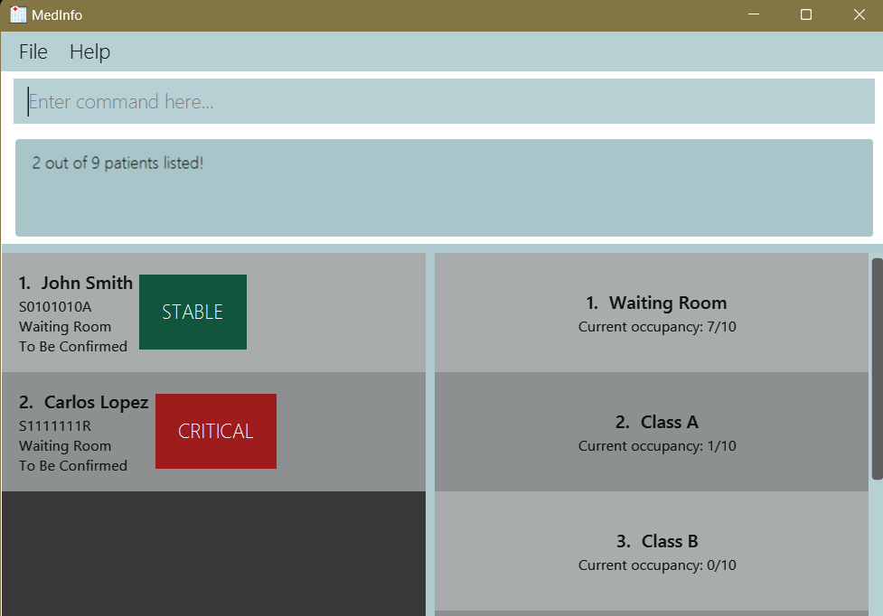

## Introduction
Welcome to the MedInfo User Guide!

MedInfo is a desktop application for **private hospital administrative staff** to 
help manage patients and wards.

This User Guide will guide you through installing the app, getting familiarised with its features and using it.
If this is your first time using this Guide, you may refer to this segment
on [how to use our User Guide](#how-to-use-the-user-guide)

## Table of Contents
* Table of Contents
{:toc}

---
## About MedInfo
MedInfo is a simple application that will help you manage your patients' **statuses, wards, 
discharge dates**, and ward **occupancies**.  
 
Considering the time-critical nature of hospital services, patient and ward management are
of utmost priority, where the smallest delays or lapses in updating information can affect
how your hospital attends to your patients. **MedInfo** was designed with this in mind.
It has simplified and optimized patient and ward management, allowing you to in-process, update, and move patients 
around while still being able to view overall stats of the hospital at a glance. 
 
[Back to Table of Contents](#table-of-contents)

---

## Getting Started
Below, you'll find everything you need to install and set up MedInfo.

### System Requirements
For the best possible experience, we recommend that you use MedInfo on one of the following operating systems:
- Windows
- macOS
- Linux

To run MedInfo, you will need to have Java 11 or above installed on your system. If you don't, you can find the 
appropriate version for your system [here](https://www.oracle.com/java/technologies/downloads/).

### Quick Start
1. Download the latest `medinfo.jar` from [here](https://github.com/AY2223S2-CS2103T-T12-2/tp/releases).

2. Copy the file to the folder you want to use as the _home folder_ for your MedInfo.

3. Run the application by
   2. Double-clicking the `.jar` file or 
   3. Opening a command terminal, `cd` into the folder you put the jar file in, and use the `java -jar medinfo.jar`
command to run the application. 
4. A GUI similar to the one below should appear in a few seconds. Note how the app contains some sample data. 
      

5. Type the command in the command input box and press <kbd>Enter</kbd> to execute it. e.g. typing **`help`** and pressing 
<kbd>Enter</kbd> will open the help window. 
   Some example commands you can try:

   - `list` : Lists all patients.

   - `add nric/S1234567A name/John Doe` : Adds a patient named `John Doe` to MedInfo.

   - `delete 1` : Deletes the first patient on the currently displayed list

   - `exit` : Exits the app.

7. Refer to the [Features](#features) section below for details on each command.

[Back to Table of Contents](#table-of-contents)

---
## User Interface Overview

The main GUI has 7 sections as highlighted above.
- **_Menu Bar_**: File and Help buttons to exit or get help.
- **_Command Input_**: Key in commands here and press <kbd>Enter</kbd> to execute.
- **_Result Display_**: Responses from the application including error and success messages appear here.
- **_Adjustable Panels_**: Click and drag on the purple highlighted areas to customize the panel sizes to your preference.
- **_Patient List_**: List of patients you have.
- **_Ward List_**: List of wards you have.
- **_Save Location and Stats_**: Status bar which displays the location of data storage and some statistics of your hospital.

[Back to Table of Contents](#table-of-contents)

---
## How to use the User Guide

### Navigation
This Guide contains detailed explanations on the **commmands** available and what they do. If you wish to navigate to 
any section within this Guide, the [**Table of Contents**](#table-of-contents) above provides a quick way to do so.
Each section in the User Guide comes with a [Back to Table of Contents](#table-of-contents) link in the footer to 
take you back to the Table of Contents.

If you know what you're looking for, press <kbd>Ctrl</kbd> + <kbd>F</kbd> to search anywhere within this Guide 
for a keyword.

### Symbols used

| Symbol               | Meaning                                                     |
|----------------------|-------------------------------------------------------------|
| :information_source: | General information/notes.                                  |
| :bulb:               | Tips that will optimize your usage of MedInfo.              |
| :exclamation:        | Information that is crucial to know before using a command. |

## Features

The section below describes the commands available in MedInfo. The commands fall under 3 categories:
- [Patient Features](#patient-features)
- [Ward Features](#ward-features)
- [Utility Features](#utility-features)

Our commands follow a certain format for ease of use. If you are new to MedInfo, do take some time to familiarise 
yourself with the command format from the notes below.

**:information_source: Notes about the command format:** 

- Words in `UPPER_CASE` are the parameters to be supplied by the user. 
  e.g. in `add nric/NRIC name/NAME`, `NRIC` and `NAME` are parameters which can be used as `add nric/S1234567A name/John Doe`.

- Items in square brackets are optional. 
  e.g `name/NAME [s/STATUS]` can be used as `name/John Doe s/GREEN` or as `name/John Doe`.

[//]: # 'Might be used in future features'
[//]: # '- Items with `…` after them can be used multiple times including zero times. '
[//]: # '  e.g. `[t/TAG]…` can be used as `` (i.e. 0 times), `t/friend`, `t/friend t/family` etc.'

- Parameters can be in any order. 
  e.g. if the command specifies `name/NAME s/STATUS`, `s/STATUS name/NAME` is also acceptable.

- If a parameter is expected only once in the command, but you specified it multiple times, only the last occurrence of
  the parameter will be taken. 
  e.g. if you specify `nric/S1234567X nric/S1234567A`, only `nric/S1234567A` will be taken.

- Commands that do not take in parameters (such as `help`, `list`, and `exit`) will ignore any parameters supplied
  along with it. 
  e.g. if the command specifies `help 123`, it will be interpreted as `help`.

## Patient Features
### Adding a patient to the system: `add`

Adds the patient (NRIC, name and status).

Format: `add nric/NRIC name/NAME [s/STATUS]`

<!-- EXAMPLE OF TIP -->

:bulb: **Tips:**  
- The default condition is set to `GRAY`.  
- The default ward is set to `Waiting Room`.  
- No discharge date is added by default.

Examples:

- `add nric/S1234567A name/John Doe s/RED`

[Back to Table of Contents](#table-of-contents)

### Listing all patients in the system: `list`

Shows a list of all patients with their details in the system.

Format: `list`

[Back to Table of Contents](#table-of-contents)

### Editing a patient’s details in the system: `edit`

Edit an existing patient’s status or ward or discharge date-time.

Format: `edit INDEX [s/STATUS] [w/WARD] [d/DISCHARGE]`

- Edits the patient's details at the specified index as of the currently displayed list.
- The status of a patient is either `GRAY` or `GREEN` or `YELLOW` or `RED`.
- The ward allocated to a patient is represented as an alphanumeric string. E.g `A01`.
- The discharge date-time is of the `dd/MM/yyyy HHmm` format. E.g `12/03/2023 1200` is interpreted as 12th March 2023 1200hrs.

Examples:

- `edit 1 s/GREEN` Edits the status of the first currently displayed patient to be `GREEN`.
- `edit 5 w/A01` Edits the ward of the fifth currently displayed patient to be `A01`.
- `edit 4 d/27/07/2023 1600` Edits the discharge date-time of the fourth currently displayed patient to be `27/07/2023 1600` which is read as 27th July 2023 1600hrs.

[Back to Table of Contents](#table-of-contents)

### Sorting all patients in the system: `sort`

Sorts all the patients with the specified field and order in the system.

Format: `sort FIELD/ORDER`

Examples:

- `sort s/asc`

[Back to Table of Contents](#table-of-contents)

### Finding patients by name in the system: `find`

Shows a list of all patients with their details that match input name or NRIC.

Format: `find name/NAME`, `find nric/NRIC`, `find s/STATUS`

- The search is case-insensitive. e.g `hans` will match `Hans`
- The order of the keywords does not matter. e.g. `Hans Bo` will match `Bo Hans`
- Either only the name or only the NRIC is searched.
- Only full words will be matched e.g. `Han` will not match `Hans`
- Persons matching at least one keyword will be returned (i.e. `OR` search).
  e.g. `Hans Bo` will return `Hans Gruber`, `Bo Yang`

Examples:

- `find name/John` returns `john` and `John Smith`
- `find name/john carlos` returns `John Smith`, `Carlos Lopez` 
  

[Back to Table of Contents](#table-of-contents)

### Deleting a patient from the system: `delete`

:exclamation: **Caution:**
Once deleted, a patient cannot be recovered.

Deletes a patient by index.

Format: `delete INDEX`

- Deletes the patient at the specified index as of the currently displayed list.

Examples:

`delete 1`

[Back to Table of Contents](#table-of-contents)

## Ward Features
### Adding a ward to the system: `addward`

Adds the ward (name and capacity).

Format: `addward w/WARD [c/CAPACITY]`

- The ward name is represented as an alphanumeric string. E.g `A01`.
- The capacity is a positive integer. E.g `50`.

<!-- EXAMPLE OF TIP -->

:bulb: **Tip:**
The default capacity is set to 10.

Examples:

- `addward w/A01 c/25` Adds the ward with name `A01` and capacity `25` to the system.

[Back to Table of Contents](#table-of-contents)

### Editing a ward's details in the system: `editward`

Edit an existing ward's name or capacity.

Format: `editward INDEX [w/WARD] [c/CAPACITY]`

- Edits the ward's details at the specified index as of the currently displayed list.
- The given capacity has to be an integer.
- The given capacity has to be greater or equal to the ward's current occupancy

Examples:

- `editward 1 w/A02` Edits the name of the first currently displayed ward to be `A02`.
- `editward 5 c/35` Edits the capacity of the fifth currently displayed ward to be `35`.

[Back to Table of Contents](#table-of-contents)

### Deleting a ward from the system: `deleteward`

:exclamation: **Caution:**
Once deleted, a ward cannot be recovered.

Deletes a ward by index.

Format: `deleteward INDEX`

- Deletes the ward at the specified index as of the currently displayed list.

Examples:

`deleteward 1`

[Back to Table of Contents](#table-of-contents)

## Utility Features
### Clearing all data : `clear`

:exclamation: **Caution:**
Once cleared, MedInfo data cannot be recovered!

Clears all data (patients and wards) stored in MedInfo.

Format: `clear`

[Back to Table of Contents](#table-of-contents)

### Viewing help : `help`

Shows a message explaining how to access the help page.

<!-- INSERT SCREENSHOT PREVIEW HERE -->

Format: `help`

[Back to Table of Contents](#table-of-contents)

### Exiting the program : `exit`

Exits the program.

Format: `exit`

[Back to Table of Contents](#table-of-contents)

### Saving the data
MedInfo data are saved in the hard disk automatically after any command that changes the data. There is no need to save manually.

[Back to Table of Contents](#table-of-contents)

### Editing the data file

MedInfo data are saved as a JSON file `[JAR file location]/data/medinfo.json`. Advanced users are welcome to update the data directly by editing that data file.

:exclamation: **Caution:**
Edit the data file at your own risk! Any changes that make the data invalid will lead to MedInfo clearing 
all data and starting anew.

[Back to Table of Contents](#table-of-contents)

---

## FAQ :raising_hand:

**Q**: I keep forgetting the commands, is there a quick way to get help? 

**A**: Yes! Entering the `help` command will show a message explaining how to access the help page. 
 

**Q**: Why can't I remove the waiting room? 

**A**: As every hospital would have some pre-screening room for patients to wait in, and to make it easier 
to start entering patients into the system, the waiting room is made un-deletable. 
 

**Q**: How do I transfer my data to another device/computer? 

**A**: Install the app in the other device/ computer and overwrite the empty data file it creates with 
the file that contains the data of your previous MedInfo home folder. 
 

[Back to Table of Contents](#table-of-contents)

---

## Command summary

| Action          | Format, Examples                                                                           |
|-----------------|--------------------------------------------------------------------------------------------|
| **Add**         | `add nric/NRIC name/NAME [s/STATUS]`   e.g., `add nric/S1234567A name/John Doe s/GREEN` |
| **List**        | `list`                                                                                     |
| **Edit**        | `edit INDEX [s/STATUS] [w/WARD] [d/DISCHARGE]`  e.g.,`edit 1 s/GREEN`                   |
| **Sort**        | `sort FIELD/ORDER`   e.g., `sort name/asc`                                              |
| **Find**        | `find name/NAME` or `find nric/NRIC` or `find s/STATUS`  e.g., `find name/John`         |
| **Delete**      | `delete INDEX`  e.g., `delete 1`                                                        |
| **Add Ward**    | `addward w/WARD [c/CAPACITY]`   e.g., `addward w/S1234567A c/25`                        |
| **Edit Ward**   | `editward INDEX [w/WARD] [c/CAPACITY]`   e.g., `editward 1 w/A02 c/35`                  |
| **Delete Ward** | `deleteward INDEX`   e.g., `deleteward 1`                                               |
| **Clear**       | `clear`                                                                                    |
| **Help**        | `help`                                                                                     |
| **Exit**        | `exit`                                                                                     |

[Back to Table of Contents](#table-of-contents)