
CareFlow is a **desktop application for patient and drug inventory management, optimised for use via a Command Line Interface** (CLI) while benefiting from a Graphical User Interface (GUI).

If you are a receptionist at a GP clinic and are comfortable typing, CareFlow can streamline you with daily patient and drug management tasks, saving you from tedious daily routines and allowing you to focus on what really matters —— your patients' well-being!

* Table of Contents
{:toc}

--------------------------------------------------------------------------------------------------------------------

# Quick start

1. Ensure you have Java 11 installed in your Computer.
   * [Installing Java 11 on Windows](https://docs.oracle.com/en/java/javase/11/install/installation-jdk-microsoft-windows-platforms.html#GUID-371F38CC-248F-49EC-BB9C-C37FC89E52A0)
     * To install Java 11 on Window, you have to first download the jdk installer and then run the jdk installer to install Java 11.
     * Step 1: To download jdk installer, click on the link above and scroll down to `Downloading the JDK installer` section:
       * 
     * Step 2: Click on the `Java SE Downloads` link, which leads you to this page:
       * 
     * Step 3: Scroll down to this section, then, click on the `Java 11` tab in the top left corner:
       * 
     * Step 4: Click on the download linked circled out in the following picture. Note that you will be promoted to register an Oracle account. After registration, the download will start automatically.
       * 
       * 
     * Step 5: Locate the downloaded file and double-click the icon to `run the jdk installer`. Then, simply follow the instructions provided by the installer.
       * 
   * [Installing Java 11 on macOS](https://docs.oracle.com/en/java/javase/11/install/installation-jdk-macos.html)
     * Scroll down to `Installing JDK on macOS` and simply follow the instructions there!
       * 
2. Download the latest `careflow.jar` jar file from [here](https://github.com/AY2223S2-CS2103T-W09-3/tp).

3. Copy the jar file to the folder you want to use as the home folder for your careflowBook. For instance, you can create a folder `CareFlow` on your desktop and put the jar file inside.

4. Open a `command terminal`
   * For macOS:
     * Click on the `spotlight search` icon in the top right corner of your navigation bar, you'll see a search bar popping out.
       * 
     * Type `terminal.app` into the search bar, and simply hit `enter`
       * 
     * You're now looking at the `command terminal`, good job!
       * 
   * For Windows:
     * _To Be Added_
5. Navigate into the folder you put the jar file in with the `cd` command
   * Suppose you have adopted the suggestion to put the jar file inside a folder called `CareFlow` on your desktop, you should type:`cd desktop/CareFlow` into your `command terminal` and hit `enter`.
   * For keen learners, you can take a look at the short video below to learn more about the `cd` command
     * For macOS: <a href="https://www.youtube.com/watch?v=VJZ9mk6D6pw">Change Directories in MacOS Terminal (cd command)</a>
     * For Windows: <a href="https://www.youtube.com/watch?v=Q3XQpnQTy6Y">How to Use CD Command in CMD</a>
6. Type the `java -jar careflow.jar` command into your `command terminal` and hit `enter` to run the application. A GUI similar to the below should appear in a few seconds. Note how the app contains some sample data.
   * 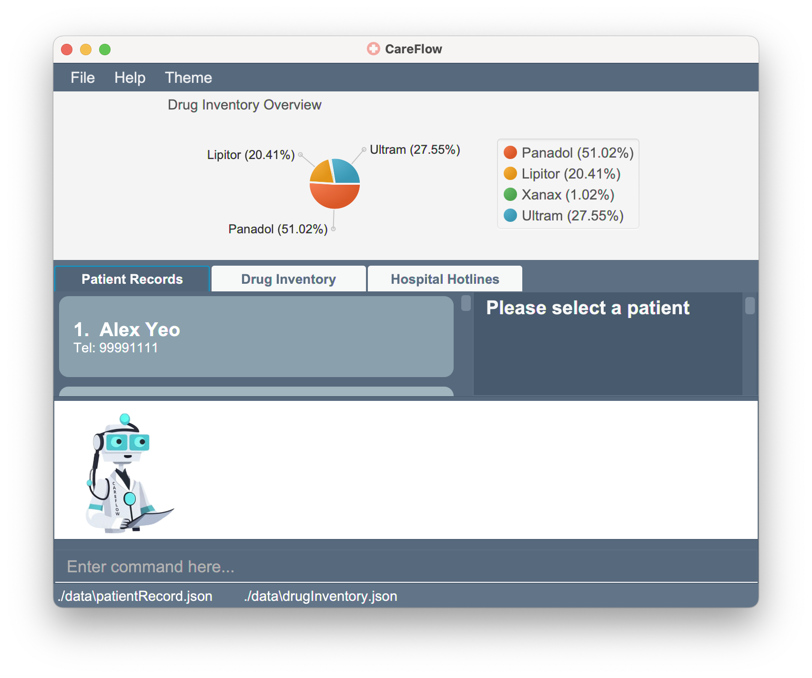
7. Type some command in the command box at the bottom and press Enter to execute it. e.g. typing **`help`** and pressing Enter will open the help window. 
   Some example commands you can try:
   * `p list` : Lists all patients.

   * `d list` : Lists all drugs.

   * `add -n John Doe -ph 98765432 -em johnd@example.com -ad John Street, Block 123, #01-01 -dob 21-01-2000 -g male -ic T3871918C` : Adds a patient named `John Doe` to the patient records.

   * `p delete 3` : Deletes the 3rd patient record shown in the current list.

   * `p clear` : Deletes all patient records.

   * `d clear` : Deletes all drug records

   * `exit` : Exits the app.

#### Notes about command format:
* Words in UPPER CASE are the parameters to be supplied by the user.
e.g. in add -n NAME, NAME is a parameter which can be used as add -n John Doe.

[Back to top](#top)

--------------------------------------------------------------------------------------------------------------------

# Features

**:information_source: Notes about the command format:** 

* Words in `UPPER CASE` are the parameters that you need to supply to the system.
  e.g. in `add -n NAME`, NAME is a parameter which can be used as `add -n John Doe`.

[Back to top](#top)

## General Operations
### View help : `g help`
Shows all valid command formats and their functionalities.

Format: `g help`

[Back to top](#top)

### Exit the program : `g exit`
Exits the program.

Format: `g exit`

[Back to top](#top)

## Patient Operations
### Add a Patient record:  `p add`
Adds a patient to the list of patients.

Format: `p add -n PATIENT_NAME -ph PHONE_NUMBER -em EMAIL -ad ADDRESS -dob DATE_OF_BIRTH -g GENDER -ic NRIC [-da DRUG_ALLERGY] [-ec EMERGENCY_CONTACT_NUMBER]`

Examples:
* `p add -n John Doe -ph 98765432 -em johnd@example.com -ad John Street, Block 123, #01-01 -dob 21-01-2000 -g male -ic T3871918C -da Xanax -ec 81234567`
* `p add -n Betsy Crowe -ph 92478963 -em betsycrowe@example.com -ad Sambal Street, Block 72, #04-12 -dob 01-01-2001 -g female -ic T8837191D -da Aspirin -ec 12345678`

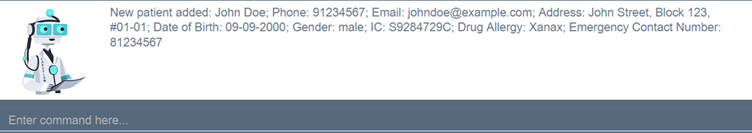

[Back to top](#top)

### Delete a Patient record by NRIC: `p delete`
Deletes the specified patient from the patient list.

Format: `p delete -ic PATIENT_NRIC`

Examples:
* `p delete -ic T3871918C`

Command Input:

Patient to be Deleted:

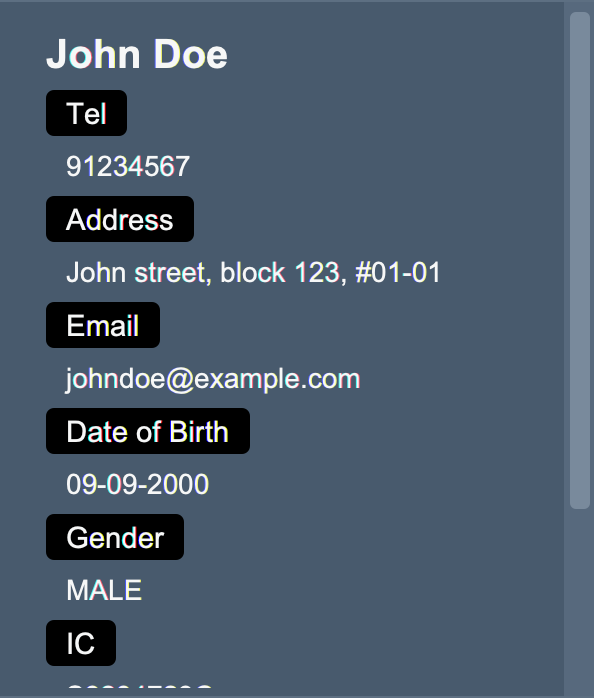

Command Result:
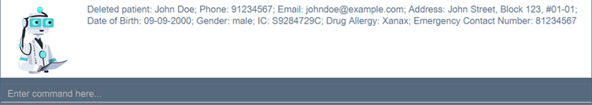

[Back to top](#top)

### Delete a Patient record by index: `p delete`
Deletes the person at the specified INDEX.
* The index refers to the index number shown in the displayed person list.
* The index must be a positive integer 1, 2, 3, …​

Format: `p delete -i PATIENT_INDEX`

Example:
* list followed by p delete 2 will delete the 2nd person in the patient list.
* `p delete -i 8`

Command Input:

Patient to be Deleted:

Command Result:
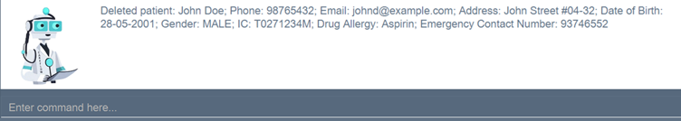

[Back to top](#top)

### Update a patient by name: `p update`

Edits an existing patient in the careflow.

Format: `p update PATIENT_NAME [-n NEW_NAME] [-ph NEW_PHONE_NUMBER] [-em NEW_EMAIL] [-ad NEW_ADDRESS] [-dob NEW_DATE_OF_BIRTH] [-g GENDER] [-ic IC] [-da PATIENT_DRUG_ALLERGY] [-ec NEW_EMERGENCY_CONTACT_NUMBER]`

Example:
* `p update John Doe -ph 91234567 -em johndoe@example.com -ec 98765432`
* Edits the phone number, email address, emergency contact number of John to be 91234567, johndoe@example.com and 98765432 respectively.
* `p update Bety -n Betsy Crower -da Aspirin`
* Edits the name and drug allergy of Bety to be Betsy Crowers and Aspirin respectively.

Command Input:

Patient to be Updated:

Command Result:
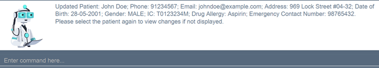

[Back to top](#top)

### Retrieve a Patient record by name: `p find`
Finds patients whose names contain any of the given keywords.

Format: `p find PATIENT_NAME`
* The search is case-insensitive. e.g hans will match Hans
* Only the name is searched.

Examples:
* `p find Doe` returns David Doe and John Doe
* `p find alex david` returns Alex Yeoh, David Li

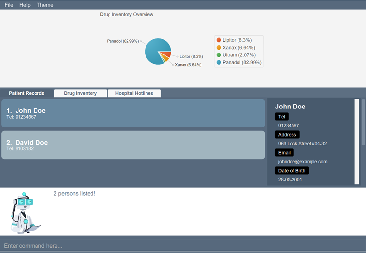

[Back to top](#top)

### Clear all Patient records : `p clear`

Clears all records for patients.

Format: `p clear`

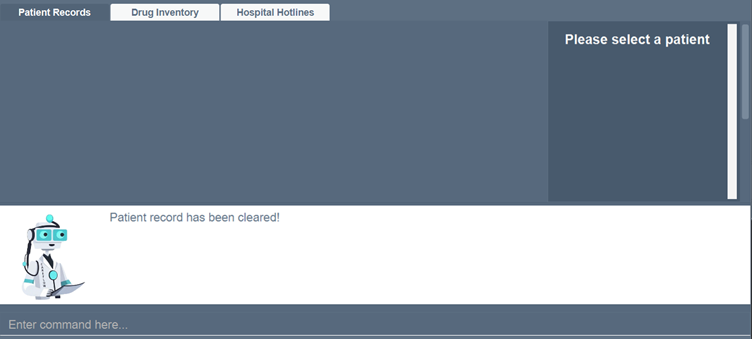

[Back to top](#top)

### List all Patient records : `p list`

Shows a list of all patients in the CareFlow system in alphabetical order.

Format: `p list`

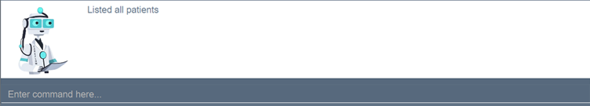

[Back to top](#top)

### View a patient by index: `p view`

The index refers to the index number shown in the displayed patient list.
View detailed information of a patient in the careflow. The full detail of the selected patient will be shown on the left side of the User Interface under the patient tab.

Format: `p view -i PATIENT_INDEX`

Example:
* `p view -i 1`
*  view details/all information of the patient at index 1.

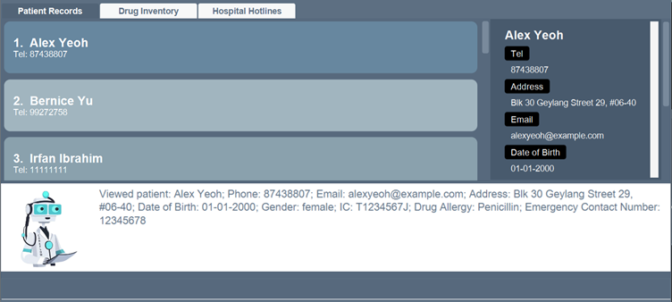

[Back to top](#top)

## Drug Operations

### Add a Drug entry: `d add`
Adds a drug entry to the list of drugs.
Format: `d add -tn TRADE_NAME -ai ACTIVE_INGREDIENT -dir DIRECTIONS -pur PURPOSE -se SIDE_EFFECTS -sc STORAGE_COUNT`

Examples:
* `d add -tn Panadol -ai Paracetamol -dir Adults and children above 12 years old, 1-2 capsules every 4-6 hours -pur treat fever, headache, toothache, rheumatic and muscle pains -se dizziness, fatigue -sc 500`

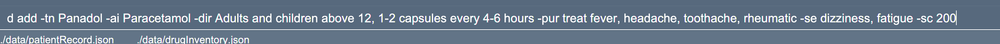

[Back to top](#top)

### Delete a Drug entry by TRADE_NAME: `d delete`
Deletes the specified drug entry that matches the trade name keyword from the drug list.

Format: `d delete -tn TRADE_NAME`

Examples:
* `d delete -tn Panadol`

Input Command:

Drug to be Deleted:

Command Result:

[Back to top](#top)

### Delete a Drug entry by INDEX : `d delete`
Deletes the specified drug entry from the drug list based on the index of the drug list.

Format: `d delete -i DRUG_INDEX`

Examples:
* `d delete -i 4`
* This deletes the 4th drug entry in the most recently shown list

Drug to be Deleted:

Command Input:

Command Result:

[Back to top](#top)

### Update storage count of a Drug entry: `d update`
Updates the storage count of specified drug entry based on trade name keyword (case-sensitive) from drug list.
* NOTE: concatenate + or - in front of value for addition/subtraction respectively

Format:
 `d update TRADE_NAME -by +VALUE`   OR  
`d update TRADE_NAME -by -VALUE`

Examples:
* `d update Panadol -by -10`
    * This **decreases** storage count of the drug entry with trade name matching "Panadol Flu Max" by **10**
* `d update Tylenol PM -by +50`
    * This **increases** storage count of the drug entry with trade name matching "Tylenol PM" by **50**

Drug to be Updated:

Command Input:

Command Result:

[Back to top](#top)

### Retrieve a Drug entry by TRADE_NAME: `d find`
Finds drug(s) whose trade_name contains any of the given keywords.

Format: `d find TRADE_NAME`
* The search is case-insensitive. e.g panadol will match Panadol.
* Only the trade name is searched.

Examples:
* `d find Panadol`

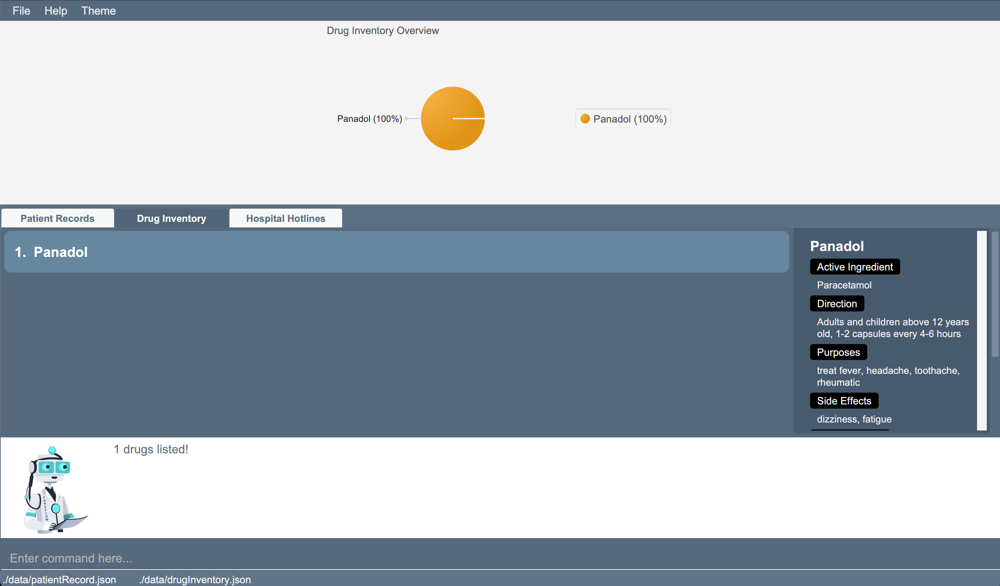

[Back to top](#top)

### Clear all Drug entries : `d clear`
Clears all entries for drugs.

Format: `d clear`

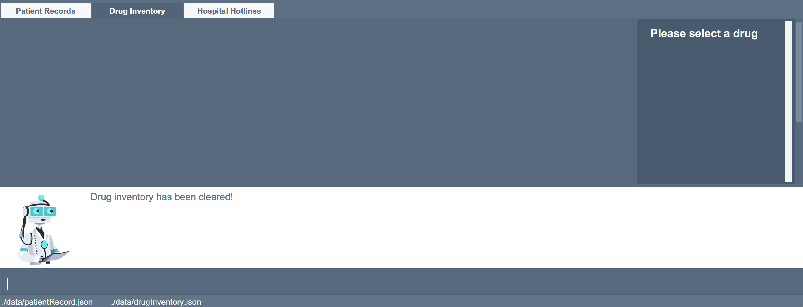

[Back to top](#top)

### List all Drug entries: `d list`
Shows a list of all drug entries in the CareFlow system in alphabetical order.

Format: `d list`

[Back to top](#top)

### View a drug by index: `d view`

The index refers to the index number shown in the displayed drug list.
View detailed information of a drug in the careflow. The full details of the selected drug will be shown on the left side of the User Interface under the drug tab.

Format: `d view -i DRUG_INDEX`

Example:
* `d view -i 1`
* view details/all information of the drug at index 1.

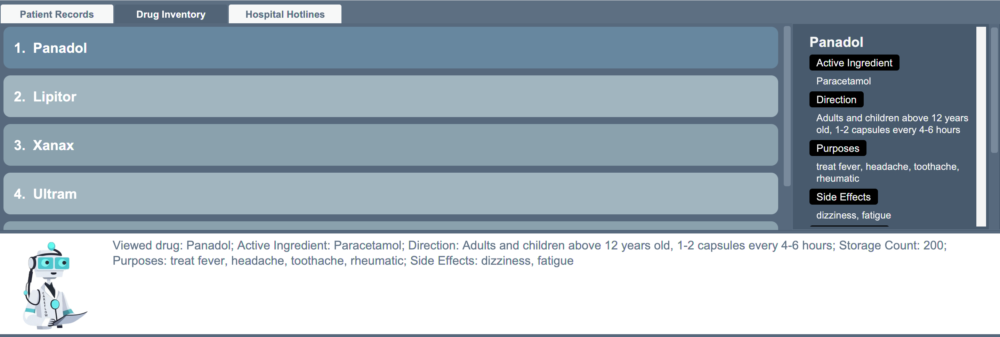

[Back to top](#top)

### Saving the data

CareFlow data is saved in the hard disk automatically after any command that changes the data. There is no need to save manually.

[Back to top](#top)

### Editing the data file

All CareFlow data is saved as a JSON file `[JAR file location]/data/careflow.json`. Advanced users are welcome to update data directly by editing that data file.

:exclamation: **Caution:**
If your changes to the data file makes its format invalid, CareFlow will discard all data and start with an empty data file at the next run.

[Back to top](#top)

## Archiving data files `[coming in v2.0]`

_Details coming soon ..._

--------------------------------------------------------------------------------------------------------------------

# FAQ

**Q**: How do I transfer my data to another Computer? 
**A**: You can install the app in the other computer and **replace** the empty data file it creates with the file that contains the data of your previous CareFlow home folder.

[Back to top](#top)

--------------------------------------------------------------------------------------------------------------------

# Command Summary

| Action                        | Format, Examples                                                                                                                                                                                                                                                                                |
|-------------------------------|-------------------------------------------------------------------------------------------------------------------------------------------------------------------------------------------------------------------------------------------------------------------------------------------------|
| **Help**                      | `g help`                                                                                                                                                                                                                                                                                        |
| **Exit**                      | `g exit`                                                                                                                                                                                                                                                                                        |
| **Add patient**               | `p add -n PATIENT_NAME -ph PHONE_NUMBER -em EMAIL -ad ADDRESS -dob DATE_OF_BIRTH -g GENDER -ic NRIC [-da DRUG_ALLERGY] [-ec EMERGENCY_CONTACT_NUMBER]`   e.g., `add -n John Doe -ph 98765432 -em johnd@example.com -ad John Street, Block 123, #01-01 -dob 21-01-2000 -g male -ic T3871918C` |
| **Delete patient by index**   | `p delete PATIENT_INDEX`   e.g., `delete -i 3`                                                                                                                                                                                                                                               |
| **Delete patient by NRIC**    | `p delete -ic PATIENT_NRIC`   e.g., `delete -ic T0021248C`                                                                                                                                                                                                                                   |
| **Update patient by name**    | `p update PATIENT_NAME [-n NEW_NAME] [-ph NEW_PHONE_NUMBER] [-em NEW_EMAIL] [-ad NEW_ADDRESS] [-dob NEW_DATE_OF_BIRTH] [-g GENDER] [-ic IC] [-da PATIENT_DRUG_ALLERGY] [-ec NEW_EMERGENCY_CONTACT_NUMBER]`                                                                                      |
| **Find patient by name**      | `p find PATIENT_NAME`   e.g., `p find John` returns `john` and `John Doe`                                                                                                                                                                                                                    |
| **Clear all patient**         | `p clear`                                                                                                                                                                                                                                                                                       |
| **List patient**              | `p list`                                                                                                                                                                                                                                                                                        |
| **View patient by index**     | `p view -i PATIENT_INDEX`                                                                                                                                                                                                                                                                       |                                                                                                                                                                                                                                                                                        
| **Add a drug**                | `d add -tn TRADE_NAME -ai ACTIVE_INGREDIENT -dir DIRECTIONS -pur PURPOSE -se SIDE_EFFECTS -sc STORAGE_COUNT`   e.g., `d add -tn Panadol -ai paracetamol, sodium -dir Adults, 1-2 capsules -pur treat fever, headache -se dizziness -sc 500`                                                  |
| **Delete drug by trade name** | `d delete -tn TRADE_NAME`  e.g., `d delete -tn Panadol Flu Max`                                                                                                                                                                                                                              |
| **Delete drug by index**      | `d delete -i INDEX`  e.g.,`d delete -i 7`                                                                                                                                                                                                                                                    |
| **Update drug storage count** | `d update TRADE_NAME -by +-VALUE`  e.g.,`d update -tn Panadol Flu Max -by +90`                                                                                                                                                                                                               |
| **Find drug by trade name**   | `d find TRADE_NAME`   e.g., `d find Panadol`                                                                                                                                                                                                                                                 |
| **Clear all drugs**           | `d clear`                                                                                                                                                                                                                                                                                       |
| **List drug**                 | `d list`                                                                                                                                                                                                                                                                                        |
| **View drug by index**        | `d view -i DRUG_INDEX`                                                                                                                                                                                                                                                                          |                                                                                                                                                                                                                                                                                        

[Back to top](#top)
