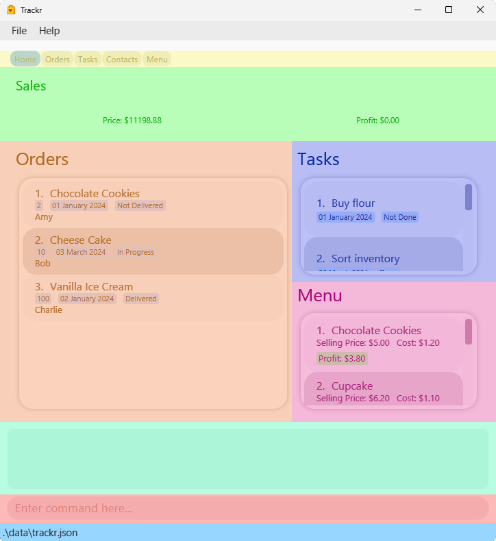

# Overview

Introducing **Trackr - the ultimate desktop application** designed to simplify the delivery management process for your home business!

With Trackr, you can seamlessly manage your suppliers, orders and tasks.

It utilizes a Command Line Interface (CLI), while still enjoying the benefits of a user-friendly Graphical User Interface (GUI).

Say goodbye to the hassle of Excel and the stress of time constraints! Whether you're a busy home business owner or simply looking for an efficient and streamlined solution, Trackr is the perfect fit for you.
Experience the convenience of delivery management like never before with Trackr.

# About This Guide

This guide shows you the relevant information for setting up and using Trackr to manage your suppliers, orders and tasks.

You can click on any of the links below to navigate to the respective sections for more information.

# Table of Contents

<!-- TOC -->
* [Overview](#overview)
* [About This Guide](#about-this-guide)
* [Table of Contents](#table-of-contents)
* [1 Quick start](#1-quick-start)
  * [1.1 Prerequisites](#11-prerequisites)
    * [1.1.1 Java](#111-java)
    * [1.1.2 Glossary](#112-glossary)
  * [1.2 Installation](#12-installation)
  * [1.3 Utilisation](#13-utilisation)
  * [1.4 Navigating the User Interface](#14-navigating-the-user-interface)
    * [1.4.1 Home Page](#141-home-page)
    * [1.4.2 Data Tab](#142-data-tab)
* [2 Commands](#2-commands)
  * [2.1 Add](#21-add)
    * [2.1.1 Adding a supplier: `add_supplier`](#211-adding-a-supplier-addsupplier)
    * [2.1.2 Adding an order: `add_order`](#212-adding-an-order-addorder)
    * [2.1.3 Adding a task: `add_task`](#213-adding-a-task-addtask)
    * [2.1.4 Adding a menu item: `add_item`](#214-adding-a-menu-item-additem)
  * [2.2 Edit](#22-edit)
    * [2.2.1 Editing a supplier: `edit_supplier`](#221-editing-a-supplier-editsupplier)
    * [2.2.2 Editing an order: `edit_order`](#222-editing-an-order-editorder)
    * [2.2.3 Editing a task: `edit_task`](#223-editing-a-task-edittask)
    * [2.2.4 Editing a menu item: `edit_item`](#224-editing-a-menu-item-edititem)
  * [2.3 Find](#23-find)
    * [2.3.1 Finding a supplier: `find_supplier`](#231-finding-a-supplier-findsupplier)
    * [2.3.2 Finding an order: `find_order`](#232-finding-an-order-findorder)
    * [2.3.3 Finding a task: `find_task`](#233-finding-a-task-findtask)
    * [2.3.4 Finding a menu item: `find_item`](#234-finding-a-menu-item-finditem)
  * [2.4 Delete](#24-delete)
    * [2.3.1 Deleting a supplier: `delete_supplier`](#231-deleting-a-supplier-deletesupplier)
    * [2.3.2 Deleting an order: `delete_order`](#232-deleting-an-order-deleteorder)
    * [2.3.3 Deleting a task: `delete_task`](#233-deleting-a-task-deletetask)
    * [2.3.4 Deleting a menu item: `delete_item`](#234-deleting-a-menu-item-deleteitem)
  * [Sort](#sort)
    * [Sorting a task: `sort_task`](#sorting-a-task-sorttask)
    * [Sorting a order: `sort_order`](#sorting-a-order-sortorder)
  * [List](#list)
    * [Listing all suppliers: `list_supplier`](#listing-all-suppliers-listsupplier)
    * [Listing all orders: `list_order`](#listing-all-orders-listorder)
    * [Listing all tasks: `list_task`](#listing-all-tasks-listtask)
    * [Listing all menu items: `list_menu`](#listing-all-menu-items-listmenu)
  * [Clear](#clear)
    * [Clear all supplier entries: `clear_supplier`](#clear-all-supplier-entries-clearsupplier)
    * [Clear all order entries: `clear_order`](#clear-all-order-entries-clearorder)
    * [Clear all task entries: `clear_task`](#clear-all-task-entries-cleartask)
    * [Clear all menu item entries: `clear_menu`](#clear-all-menu-item-entries-clearmenu)
  * [Switch](#switch)
    * [Switching tabs: `tab`](#switching-tabs-tab)
  * [Others](#others)
    * [Viewing help: `help`](#viewing-help-help)
    * [Uploading a csv file](#uploading-a-csv-file)
    * [Exiting the program: `exit`](#exiting-the-program-exit)
* [Data](#data)
    * [Saving the data](#saving-the-data)
    * [Editing the data file](#editing-the-data-file)
    * [Upcoming features `[coming soon]`](#upcoming-features-coming-soon)
* [FAQ](#faq)
* [5 Summary](#5-summary)
* [5.1 Prefix Summary](#51-prefix-summary)
  * [5.2 Command Summary](#52-command-summary)
<!-- TOC -->

--------------------------------------------------------------------------------------------------------------------
<div style="page-break-after: always;"></div>

# 1 Quick start

## 1.1 Prerequisites

### 1.1.1 Java

Ensure you have <ins>[Java `11`](https://www.oracle.com/sg/java/technologies/javase/jdk11-archive-downloads.html)</ins> or above installed.

<div markdown="block" class="alert alert-tip">

:bulb: **Tip**

**How to check your current Java version:**

**Step 1.** Open up **Command Prompt** (Windows) or **Terminal** (Mac and Linux).

**Step 2.** Type and run the command `java -version`.

**Step 3.** Check the version number provided (`xxx`) is at least `11`.

An example is shown below.

  ```
  > java -version
  java version "xxx" <Other information>
  ```

</div>

### 1.1.2 Glossary

* **Mainstream OS**: Windows, Linux, Mac
* **CLI**: Command-Line Interface
* **GUI**: Graphical User Interface
* **Supplier**: Supplier refers to someone whom the user seasonally or frequently orders goods from
* **Customer**: Customer refers to someone whom the user receives an order from
* **Order**: Order refers to the customers' orders the user accepts
* **Task**: Task refers to any to-dos the user may have, it need not be related to suppliers or orders (For instance, it can be about tidying inventory)
* **Menu Item**: Menu Item refers to any inventory/ stock that the user is selling to customers.
* **Tag**: Tags are associated with suppliers, users can tag the supplier with any keyword they want, number of tags are not restricted
* **Status**: Statuses are associated with tasks and orders, one entry of task/order can only have one status and the type of status that can be added is restricted

## 1.2 Installation

**Step 1.** Download the latest `trackr.jar` from [here](https://github.com/AY2223S2-CS2103T-W15-2/tp/releases).

**Step 2.** Copy the file to the folder where you will use Trackr.

**Step 3.** Double-click on the `trackr.jar` file.

<div markdown="block" class="alert alert-tip">

:bulb: **Tip**

**Trackr does not open?**

**Step 1.** Open a command terminal.

**Step 2.** Type in `java -jar ` (Keep in mind of the space at the end).

**Step 3.** Drag and drop `trackr.jar` into the command terminal.

**Step 4.** Press enter and execute the command.

An example of the final command is displayed below.

  ```
  > java -jar xxxx/xxxx/trackr.jar
  ```

</div>

A GUI similar to the below should appear in a few seconds, with the following areas:

* <span style="background-color:rgba(252.4, 248.4, 124.1, 0.5)">Tabs</span>
* <span style="background-color:rgba(0.0, 255.0, 0.0, 0.5)">Sales (Total Revenue and Profit)</span>
* <span style="background-color:rgba(246.2, 149.6, 28.3, 0.5)">Simplified Orders</span>
* <span style="background-color:rgba(8.7, 68.0, 237.2, 0.5)">Simplified Tasks</span>
* <span style="background-color:rgba(237.2, 8.7, 176.5, 0.5)">Simplified Menu</span>
* <span style="background-color:rgba(0.0, 255.0, 197.0, 0.5)">Command Result Screen</span>
* <span style="background-color:rgba(255.0, 0.0, 0.0, 0.5)">Command Input Box</span>
* <span style="background-color:rgba(128.9, 0.0, 255.0, 0.5)">Data List</span>

For more information on how to navigate the User Interface (UI), you can go [here](#14-navigating-the-user-interface)

<p align="center">
  
  <br>Figure 1.2.1: Trackr Home Tab UI
</p>

<p align="center">
  
  <br>Figure 1.2.2: Trackr Data Tab UI
</p>

<div markdown="block" class="alert alert-warning">

:warning: **Warning**<br>

`Trackr` will create a `data` folder with `tracker.json` data file inside.

If you are a _new_ user, do not edit this file.

Otherwise, you can check out how to edit it [here](#editing-the-data-file)

</div>

## 1.3 Utilisation

**Step 1:** Enter your command into the <span style="background-color:rgba(255.0, 0.0, 0.0, 0.5)">Command Input Box</span>.

You can try the following commands to add a task:

* `tab TASKS`
* `add_task n/Buy eggs d/12/12/2040`

**Step 2:** Observe the changes, with the output of the command inside the <span style="background-color:rgba(0.0, 255.0, 197.0, 0.5)">Command Result Screen</span>.

<div markdown="block" class="alert alert-tip">

:bulb: **Tip**

You can find out all the usable commands [here](#2-commands) or return to the [Table of Contents](#table-of-contents) to find your desired command.

</div>

## 1.4 Navigating the User Interface

Here, we will explain how you can navigate around our application.

**<span style="background-color:rgba(255.0, 0.0, 0.0, 0.5)">Command Input Box</span>**

You can input your commands into the command input box, press **Enter** for your command to execute. A result message would be shown at the <span style="background-color:rgba(0.0, 255.0, 197.0, 0.5)">Command Result Screen</span>.

If there is an error with the command, the input would turn **<span style="color:red">red</span>** and you can refer to the <span style="background-color:rgba(0.0, 255.0, 197.0, 0.5)">Command Result Screen</span> for help.

**<span style="background-color:rgba(0.0, 255.0, 197.0, 1)">Command Result Screen</span>**

Command result screen shows the success message for your command that executed successfully.

Otherwise, it would show an error message with hints on what issues the command you entered has.

**<span style="background-color:rgba(252.4, 248.4, 124.1, 1)">Tabs</span>**

We provide multiple tabs for you to use. This includes the home page, with the data tabs that display your data for the respective information (i.e. Order, Tasks, Contacts, Menu).

You can navigate between them by clicking on the tab itself, or input the command `tab` with the respective tab.

For more information, you can go [here](#switching-tabs-tab).

### 1.4.1 Home Page

Upon starting the application, you will see a convenient dashboard with summarised information that you need for your business.

**<span style="background-color:rgba(0.0, 255.0, 0.0, 0.5)">Sales (Total Revenue and Profit)</span>**

Trackr keeps track of all orders submitted and automatically updates the total revenue and profit that your business has generated with us.

**<span style="background-color:rgba(246.2, 149.6, 28.3, 0.5)">Simplified Orders</span>**

Order list shows a condensed preview of your outstanding orders, with their relevant details (i.e. customer name, promised delivery date and your progress).

**<span style="background-color:rgba(8.7, 68.0, 237.2, 0.5)">Simplified Tasks</span>**

Task list shows all outstanding miscellaneous tasks that you may have for your current operations.

**<span style="background-color:rgba(237.2, 8.7, 176.5, 0.5)">Simplified Menu</span>**

Menu list shows all the items that you have up for sale currently, with their details (cost price, selling price and profit margin) at a glance.

### 1.4.2 Data Tab

**<span style="background-color:rgba(128.9, 0.0, 255.0, 0.5)">Data List</span>**

Data list contains all of your respective data labelled out in full. The layout of the respective data information can be seen below:

* Orders

< Labelled Order Card Figure Here >

* Tasks

< Labelled Task Card Figure Here >

* Contacts

< Labelled Contact Card Figure Here >

* Menu

< Labelled Menu Card Figure Here >

--------------------------------------------------------------------------------------------------------------------

# 2 Commands

<div markdown="block" class="alert alert-info">

:information_source: **Notes about the command format:**

* All command keywords must be in lower-case and are case-sensitive.<br>
  e.g. For add supplier command:<br>
  :heavy_check_mark: `add_supplier` is valid.<br>
  :x: `ADD_SUPPLIER` and `Add_Supplier` are invalid.<br>

* Words in `UPPER_CASE` are the parameters to be supplied by you.<br>
  e.g. in `add_supplier n/NAME`, you fill in the `NAME` parameter with the supplier name (i.e. `add_supplier n/John Doe`).

* Prefixes of the parameters must be in lower-case and are case-sensitive.<br>
  e.g. `n/` in `add_s n/NAME` is case-sensitive (i.e. `N/` is an invalid prefix).

* Items in square brackets are optional.<br>
  e.g. `n/NAME [t/TAG]` can be used as `n/John Doe t/friend` or as `n/John Doe`.

* Items with `…​` after them can be used any number of times within the command.<br>
  e.g. `[t/TAG]…​` can be used as ` ` (omitted), `t/flour`, `t/flour t/sugar` etc.

* Parameters can be in any order.<br>
  e.g. if the command specifies `n/NAME p/PHONE_NUMBER`, `p/PHONE_NUMBER n/NAME` is also acceptable.

* If a parameter is expected only once in the command, but you specified it multiple times, only the **last** occurrence of the parameter will be taken.<br>
  e.g. if you specify `p/12341234 p/56785678`, only `p/56785678` will be taken.

* Extraneous parameters will be ignored.<br>
  e.g. if the command specifies `help 123`, it will be interpreted as `help`.

</div>

<div markdown="block" class="alert alert-tip">

:bulb: **Tip**

* General format of commands:<br>
  <div style="background-color:silver; font-weight:bold">
  <span style="color:darkblue">&lt;command&gt;</span>
  <span> </span>
  <span style="color:indigo">&lt;index&gt;</span>
  <span> </span>
  <span style="color:brown">&lt;prefix/paramater&gt; &lt;prefix/paramater&gt; ...</span>
  </div>
  
  * Index depends on the command.
  * Number of parameters depend on the command.

* All command keywords have shortcut alternatives. They are the command type and the first letter of the information type.<br>
  For example:<br>
  * `add_s` is the same as `add_supplier`
  * `edit_o` is the same as `edit_order`
  * `list_t` is the same as `list_task`

* You can find out the constraints for the parameters with their corresponding prefix [here](#51-prefix-summary).

</div>

## 2.1 Add

Adding of an information to the specific list. Below are the specific add commands for supplier, order, task and menu item.

### 2.1.1 Adding a supplier: `add_supplier`

Adds a supplier to the list of suppliers.

Syntax: `add_supplier n/NAME p/PHONE_NUMBER e/EMAIL a/ADDRESS [t/TAG]…​`

<div markdown="block" class="alert alert-example">

:clipboard: **Example 1: Standard command without tags**

* `add_supplier n/John Doe p/98765432 e/johnd@example.com a/John Street`<br>
  Adds a supplier with the following details:
  * Supplier Name: `John Doe`
  * Phone Number: `98765432`
  * Email: `johnd@example.com`
  * Address: `John Street`
  * Tags: Empty

:clipboard: **Example 2: Shortcut command with tags**

* `add_s n/Betsy Cow t/diary e/betsycow@example.com a/Betsy Street p/12345678 t/meat`<br>
  Adds a supplier with the following details:
  * Supplier Name: `Betsy Cow`
  * Phone Number: `12345678`
  * Email: `betsycow@example.com`
  * Address: `Betsy Street`
  * Tags: `Diary`, `Meat`

</div>

### 2.1.2 Adding an order: `add_order`

Adds an order into the list of orders.

Syntax: `add_order on/ORDER_ITEM q/QUANTITY d/DEADLINE n/CUSTOMER_NAME a/CUSTOMER_ADDRESS p/CUSTOMER_PHONE_NUMBER [s/STATUS]`

<div markdown="block" class="alert alert-tip">

:information_source: **Information**

* Statuses available for setting are
  * `N` or `n` for `Not Delivered`
  * `I` or `i` for `In Progress`
  * `D` or `d` for `Delivered`
* If no status is provided, it is **defaulted** to `Not Delivered`.

</div>

<div markdown="block" class="alert alert-example">

:clipboard: **Example 1: Standard command without status**

* `add_order on/Cupcake q/5 d/01/12/2024 n/John Cat p/91234567 a/John Street`<br>
  Adds an order with the following details:
  * Order Item: `Cupcake`
  * Quantity: `5`
  * Deadline: `01/12/2024`
  * Name: `John Cat`
  * Phone Number: `91234567`
  * Address: `John Street`
  * Status: `Not Delivered` (Default)

:clipboard: **Example 2: Shortcut command with status**

* `add_o on/Chocolate Cookies q/10 d/02/10/2024 n/Dolly Sheep p/91827364 a/Dolly Street s/I`<br>
  Adds a supplier with the following details:
  * Order Item: `Chocolate Cookies`
  * Quantity: `10`
  * Deadline: `02/10/2024`
  * Name: `Dolly Sheep`
  * Phone Number: `91827364`
  * Address: `Dolly Street`
  * Status: `In Progress`

</div>

### 2.1.3 Adding a task: `add_task`

Adds a task to the list of tasks.

Syntax: `add_task n/TASK_NAME d/DEADLINE [s/STATUS]`

<div markdown="block" class="alert alert-tip">

:information_source: **Information**

* Statuses available for setting are
  * `N` or `n` for `Not Done`
  * `D` or `d` for `Done`
* If no status is provided, it is **defaulted** to `Not Done`.

</div>

<div markdown="block" class="alert alert-example">

:clipboard: **Example 1: Standard command without status**

* `add_task n/Buy cookie cutter d/22/12/2024`<br>
  Adds a task with the following details:
  * Task Name: `Buy cookie cutter`
  * Deadline: `22/12/2024`
  * Status: `Not Done` (Default)

:clipboard: **Example 2: Shortcut command with status**

* `add_t n/Buy a card d/23/12/2024 s/D`<br>
  Adds a task with the following details:
  * Task Name: `Buy a card`
  * Deadline: `23/12/2024`
  * Status: `Done`

</div>

### 2.1.4 Adding a menu item: `add_item`

Adds a menu item to the menu.

Syntax: `add_item n/ITEM_NAME pr/PRICE c/COST`

<div markdown="block" class="alert alert-tip">

:information_source: **Information**

* When entering price and cost values, you may choose to
  1. input **positive** integer numbers
  2. input **positive** decimal numbers (up to 2 decimal point). For example:<br>
     :heavy_check_mark: `5.1` or `5.03`<br>
     :x: `5.034`
  
* The item can have a positive or negative profit margin (Profit Margin = Price - Cost). Specifically:
  * Negative profit margin means you are making a **loss**
  * Positive profit margin means you are making a **profit**

</div>

<div markdown="block" class="alert alert-example">

:clipboard: **Example 1: Standard command with integer values**

* `add_item n/Chocolate cake pr/5 c/2`<br>
  Adds an order item with the following details:
  * Item Name: `Chocolate cake`
  * Price: `5`
  * Cost: `2`

:clipboard: **Example 2: Shortcut command with decimal values**

* `add_i n/Limited Time Strawberry Cake pr/20.55 c/25.2`<br>
  Adds an order item with the following details:
  * Item Name: `Limited Time Strawberry Cake`
  * Price: `20.55`
  * Cost: `25.2`

</div>

## 2.2 Edit

Editing of an information to the specific list. Below are the specific edit commands for supplier, order, task and menu item.

<div markdown="block" class="alert alert-tip">

:information_source: **Information**

* Edits the information at the specified `INDEX`.
* The `INDEX` **must be a positive integer** 1, 2, 3, …​
* All existing values will be replaced with the new values given.

</div>

<div markdown="span" class="alert alert-danger">

:exclamation: **Danger**<br>

Editing of information is one-way (i.e. You cannot revert your command).<br>

We are working to have an undo feature in the future. Sorry for the inconvenience caused.

</div>

### 2.2.1 Editing a supplier: `edit_supplier`

Edit an existing supplier’s information.

Syntax: `edit_supplier INDEX [n/NAME] [p/PHONE] [e/EMAIL] [a/ADDRESS] [t/TAG]…​`

<div markdown="block" class="alert alert-tip">

:information_source: **Information**

* When editing tags:
  * All existing tags will be replaced with the given tag (editing of tags is not accumulative).
  * Typing `t/` removes all the existing tags.

</div>

<div markdown="block" class="alert alert-example">

:clipboard: **Example 1: Standard command removing tags**

* `edit_supplier 1 n/Johnny p/90138482 t/`<br>
  Edits the **first** supplier information with the following details:
  * Supplier Name: `Johnny`
  * Phone Number: `90138482`
  * Tags: Empty

:clipboard: **Example 2: Shortcut command replacing tags**

* `edit_s 3 t/Supplies Flour e/mark@example.com`<br>
  Edits the **third** supplier information with the following details:
  * Email: `mark@example.com`
  * Tags: `Supplies Flour`

</div>

### 2.2.2 Editing an order: `edit_order`

Edit an existing order’s information.

Syntax: `edit_order INDEX [on/ORDER_ITEM] [q/QUANTITY] [d/DEADLINE] [n/CUSTOMER_NAME] [a/CUSTOMER_ADDRESS] [p/CUSTOMER_PHONE_NUMBER] [s/STATUS]`

<div markdown="block" class="alert alert-tip">

:information_source: **Information**

* Statuses available for setting are
  * `N` or `n` for `Not Delivered`
  * `I` or `i` for `In Progress`
  * `D` or `d` for `Delivered`

</div>

<div markdown="block" class="alert alert-example">

:clipboard: **Example 1: Standard command**

* `edit_order 1 p/91234567 d/05/05/2024`<br>
  Edits the **first** order information with the following details:
  * Customer Phone Number: `91234567`
  * Deadline: `05/05/2024`

:clipboard: **Example 2: Shortcut command updating status**

* `edit_o 3 q/20 s/I`<br>
  Edits the **third** order information with the following details:
  * Quantity: `3`
  * Status: `In Progress`

</div>

### 2.2.3 Editing a task: `edit_task`

Edit an existing task’s information.

Syntax: `edit_task INDEX [n/TASK_NAME] [d/DEADLINE] [s/STATUS]`

<div markdown="block" class="alert alert-tip">

:information_source: **Information**

* Statuses available for setting are
  * `N` or `n` for `Not Done`
  * `D` or `d` for `Done`

</div>

<div markdown="block" class="alert alert-example">

:clipboard: **Example 1: Standard command**

* `edit_task 1 n/Get creamer`<br>
  Edits the **first** task information with the following details:
  * Task Name: `Get creamer`

:clipboard: **Example 2: Shortcut command updating status**

* `edit_t 3 d/31/12/2024 s/N`<br>
  Edits the **third** task information with the following details:
  * Deadline: `31/12/2024`
  * Status: `Not Done`

</div>

### 2.2.4 Editing a menu item: `edit_item`

Edit an existing menu item’s information.

Syntax: `edit_item INDEX [n/ITEM_NAME] [pr/PRICE] [c/COST]`

<div markdown="block" class="alert alert-tip">

:information_source: **Information**

* When entering price and cost values, you may choose to
  1. input **positive** integer numbers
  2. input **positive** decimal numbers (up to 2 decimal point). For example:<br>
     :heavy_check_mark: `5.1` or `5.03`<br>
     :x: `5.034`

* The item can have a positive or negative profit margin (Profit Margin = Price - Cost). Specifically:
  * Negative profit margin means you are making a **loss**
  * Positive profit margin means you are making a **profit**

</div>

<div markdown="block" class="alert alert-example">

:clipboard: **Example 1: Standard command with integer values**

* `edit_item 1 n/Coffee pr/2 c/1`<br>
  Edits the **first** menu item information with the following details:
  * Item Name: `Coffee`
  * Price: `2`
  * Cost: `1`

:clipboard: **Example 2: Shortcut command with decimal values**

* `edit_i 3 d/Signature burger p/8.5 c/2.25`<br>
  Edits the **third** menu item information with the following details:
  * Item Name: `Signature burger`
  * Price: `8.5`
  * Cost: `2.25`

</div>

## 2.3 Find

Finding of specific information with the provided parameters. Below are the specific find commands for supplier, order, task and menu item.

### 2.3.1 Finding a supplier: `find_supplier`

Find suppliers whose information matches with any of the given parameters.

Syntax: `find_supplier NAME`

<div markdown="block" class="alert alert-tip">

:information_source: **Information**

* Search is case-insensitive (e.g. `mark` will match with `Mark`).
* Order of the keywords does not matter (e.g. `Mark Lee` will match with `Lee Mark`).
* Only full words will match (e.g. `Mar` will not match with `Mark`).
* People matching with at least one keyword will be returned (i.e. `OR` search). <br>
  (e.g. `Mark Lee` will return `Mark Tan`, `Lee Chan`)

</div>

<div markdown="block" class="alert alert-example">

:clipboard: **Example 1: Standard command**

* `find_task Prima Flour`<br>
  Finds the supplier with the following details:
  * Supplier Name contains either `Prima` or `Flour`.<br>

  Example of suppliers that match:
    * `Prima`
    * `Soon Flour Pte Ltd`
    * `PRIMA CONFECTIONARY`
  
  Example of suppliers that do not match:
    * `Prim`
    * `PrimaFlour`

:clipboard: **Example 2: Shortcut command**

* `find_s Pte`<br>
  Finds the supplier with the following details:
  * Supplier Name contains `Pte`.
  
  Example of suppliers that match:
    * `Soon Flour Pte Ltd`
    * `Tech Leong PTE LTD`

  Example of suppliers that do not match:
  * `Private`
  * `Phoon Huat PteLtd`

</div>

### 2.3.2 Finding an order: `find_order`

Find orders whose information matches with any of the given parameters.

Syntax: `find_order [on/ORDER_ITEM] [q/QUANTITY] [d/DEADLINE] [n/CUSTOMER_NAME] [a/CUSTOMER_ADDRESS] [p/CUSTOMER_PHONE_NUMBER] [s/STATUS]`

<div markdown="block" class="alert alert-tip">

:information_source: **Information**

* At least one of the optional fields must be keyed in.
* For order item:
  * Search is case-insensitive (e.g. `cookie` will match with `Cookie`).
  * Order of the keywords does not matter (e.g. `Chocolate Cookie` will match with `Cookie Chocolate`).
  * Only full words will match (e.g. `Chocolate` will not match with `Choco`).
  * People matching with at least one keyword will be returned (i.e. `OR` search). <br>
    (e.g. `Chocolate Cake` will return `Chocolate Cookie`, `Strawberry Cake`)

</div>

<div markdown="block" class="alert alert-example">

:clipboard: **Example 1: Standard command with single fields**

* `find_order on/Chocolate Cake`<br>
  Finds the order with the following details:
  * Order Item contains `Chocolate` or `Cake`<br>

  Example of suppliers that match:
  * `Chocolate Cookie`
  * `Chocolate Cake`
  * `CAKE WITH VANILLA`

  Example of suppliers that do not match:
  * `Choco`
  * `ChocolatePie`

:clipboard: **Example 2: Shortcut command with multiple fields**

* `find_s on/Cake d/01/01/2023`<br>
  Finds the order with the following details:
  * Supplier Name contains `Cake`
  * Deadline is on `01/01/2023`<br>

  Example of orders that match:
  * `on/Chocolate Cake d/01/01/2023`
  * `on/CAKE WITH VANILLA AND CHOCOLATE d/01/01/2023`

  Example of orders that do not match:
  * `on/Chocolate Cake d/03/03/2024`
  * `on/VANILLA CAKES d/01/01/2023`

</div>

### 2.3.3 Finding a task: `find_task`

Find tasks with information that matches with any of the given parameters.

Syntax: `find_task [n/TASK_NAME] [d/DEADLINE] [s/STATUS]`

<div markdown="block" class="alert alert-tip">

:information_source: **Information**

* At least one of the optional fields must be keyed in.
* For task name:
  * Search is case-insensitive (e.g. `sugar` will match with `Sugar`).
  * Order of the keywords does not matter (e.g. `Flour Sugar` will match with `Sugar Flour`).
  * Only full words will match (e.g. `Sugar` will not match with `Sugars`).
  * People matching with at least one keyword will be returned (i.e. `OR` search). <br>
    (e.g. `Order Flour` will return `Order Sugar`, `Order 10kg Flour`)

</div>

<div markdown="block" class="alert alert-example">

:clipboard: **Example 1: Standard command with single fields**

* `find_task s/N`<br>
  Finds all task that are `Not Done`.

:clipboard: **Example 2: Shortcut command with multiple fields**

* `find_t n/Buy eggs d/17/02/2023`<br>
  Finds the order with the following details:
  * Task Name contains `Buy eggs`.
  * Deadline is on `17/02/2023`

  Example of tasks that match:
  * `n/Buy eggs d/17/02/2023`
  * `n/Buy flour d/17/02/2023`

  Example of tasks that do not match:
  * `n/Make eggcream d/17/02/2023`
  * `n/Buy flour d/30/03/2024`

</div>

### 2.3.4 Finding a menu item: `find_item`

Find tasks with information that matches with any of the given parameters.

Syntax: `find_item ITEM_NAME`

<div markdown="block" class="alert alert-tip">

:information_source: **Information**

* Search is case-insensitive (e.g. `cookie` will match with `Cookie`).
* Order of the keywords does not matter (e.g. `Chocolate Cookie` will match with `Cookie Chocolate`).
* Only full words will match (e.g. `Chocolate` will not match with `Choco`).
* People matching with at least one keyword will be returned (i.e. `OR` search). <br>
  (e.g. `Chocolate Cake` will return `Chocolate Cookie`, `Strawberry Cake`)

</div>

<div markdown="block" class="alert alert-example">

:clipboard: **Example 1: Standard command**

* `find_item vanilla cupcake`<br>
  Finds the supplier with the following details:
  * Supplier Name contains either `Prima` or `Flour`.<br>

  Example of order items that match:
  * `Strawberry cupcake`
  * `CAKE WITH VANILLA`

  Example of order item that do not match:
  * `chocolate cake`

:clipboard: **Example 2: Shortcut command**

* `find_i Cake`<br>
  Finds the menu item with the following details:
  * Item Name contains `Cake`.

  Example of order items that match:
  * `Strawberry Cake`
  * `CAKE WITH VANILLA`

  Example of order item that do not match:
  * `Vanilla Cupcake`

</div>

## 2.4 Delete

Deleting of an information to the specific list. Below are the specific delete commands for supplier, order, task and menu item.

<div markdown="block" class="alert alert-tip">

:information_source: **Information**

* Deletes the information at the specified `INDEX`.
* The `INDEX` **must be a positive integer** 1, 2, 3, …​
* All values at the `INDEX` will be deleted.

</div>

<div markdown="span" class="alert alert-danger">

:exclamation: **Danger**<br>

Deleting of information is one-way (i.e. You cannot revert your command).<br>

We are working to have an undo feature in the future. Sorry for the inconvenience caused.

</div>

### 2.3.1 Deleting a supplier: `delete_supplier`

Deletes the specified supplier from the contact list.

Syntax: `delete_supplier INDEX`

<div markdown="block" class="alert alert-example">

:clipboard: **Example 1: Standard command**

* `delete_supplier 2`<br>
  Deletes the **second** supplier from the visible contact list

:clipboard: **Example 2: Shortcut command after using `find_supplier`**

* `find_supplier n/John` followed by `delete_s 1`<br>
  * `find_supplier n/John` lists all suppliers with name `John` inside them
  * `delete_s 1` deletes the **first** supplier with the name `John` from the visible contact list

</div>

### 2.3.2 Deleting an order: `delete_order`

Deletes the specified order from the order list.

Syntax: `delete_order INDEX`

<div markdown="block" class="alert alert-example">

:clipboard: **Example 1: Standard command**

* `delete_order 2`<br>
  Deletes the **second** order from the visible order list

:clipboard: **Example 2: Shortcut command after using `find_order`**

* `find_order on/Cake` followed by `delete_o 1`<br>
  * `find_order on/Cake` lists all orders with item name `Cake` inside them
  * `delete_o 1` deletes the **first** order with the item name `Cake` from the visible order list

</div>

### 2.3.3 Deleting a task: `delete_task`

Deletes the specified task from the task list.

Syntax: `delete_task INDEX`

<div markdown="block" class="alert alert-example">

:clipboard: **Example 1: Standard command**

* `delete_task 2`<br>
  Deletes the **second** task from the visible task list

:clipboard: **Example 2: Shortcut command after using `find_task`**

* `find_task n/flour` followed by `delete_t 1`<br>
  * `find_task n/flour` lists all tasks with task name `flour` inside them
  * `delete_t 1` deletes the **first** task with the task name `flour` from the visible task list

</div>

* `delete_task 2` deletes the first task
* `find_t flour` followed by `delete_t 3` deletes the 1st task in the result of the `find_t` command

### 2.3.4 Deleting a menu item: `delete_item`

Deletes the specified menu item from the menu.

Syntax: `delete_item INDEX`

<div markdown="block" class="alert alert-example">

:clipboard: **Example 1: Standard command**

* `delete_menu 2`<br>
  Deletes the **second** menu item from the visible menu

:clipboard: **Example 2: Shortcut command after using `find_item`**

* `find_item cupcake` followed by `delete_m 1`<br>
  * `find_item cupcake` lists all menu items with item name `cupcake` inside them
  * `delete_m 1` deletes the **first** menu item with the item name `cupcake` from the visible menu

</div>

## Sort

### Sorting a task: `sort_task`

Syntax: `sort_task [c/CRITERIA]`

* Sorts all the tasks according to a criteria.
* Criteria available are: `Time_added`, `Deadline`, `Status`, `Name` and `Status_and_deadline`.
* Criteria is case-insensitive (i.e. `time_added`, `TIME_ADDED` `Time_Added` are all valid).
* The default criteria (when no criteria is specified) is `Status_and_deadline`.

* Sorting by `Time_added` puts the tasks added first at the top and tasks added later below.
* Sorting by `Deadline` puts the tasks with the earlier deadlines on the top of tasks with further deadlines.
* Sorting by `Status` puts the tasks with "Not Done" status on top and tasks with "Done" status below.
* Sorting by `Name` sorts the tasks in a lexicographical order (ignoring-case)
  (i.e. A task with the task name "a" will be placed on top of a different task with the task name"B").
* Sorting by `Status_and_deadline` puts the tasks that are not done and have the earliest deadlines
  on top and tasks done and have the furthest deadlines below.<br>
  (i.e. The tasks will be sorted in the order:
  Not done and earliest deadline > Not done and latest deadline > Done and earliest deadline > Not Done and latest deadline)

Examples:

* `sort_t` sorts all tasks by their status and deadline
* `sort_task c/deadline` sorts all tasks by their deadlines
* `find_t s/N` followed by `sort_t` would sort all the tasks but only the sorted result of the `find_t` command will be displayed<br>
  (to get the sorted list of all the items, use the `list_t` command)

### Sorting a order: `sort_order`

Syntax: `sort_order [c/CRITERIA]`

* Sorts all the orders according to a criteria.
* Criteria available are: `Time_added`, `Deadline`, `Status`, `Name` and `Status_and_deadline`.
* Criteria is case-insensitive (i.e. `time_added`, `TIME_ADDED` `Time_Added` are all valid).
* The default criteria (when no criteria is specified) is `Status_and_deadline`.

* Sorting by `Time_added` puts the orders added first at the top and tasks added later below.
* Sorting by `Deadline` puts the orders with the earlier deadlines on the top of tasks with further deadlines.
* Sorting by `Status` puts the orders in the order of "Not Delivered" > "In Progress" > "Delivered" (with orders that are "Not Delivered" placed on top).
* Sorting by `Name` sorts the orders in a lexicographical order (ignoring-case)
  (i.e. A order with the order name "a" will be placed on top of a different order with the order name "B").
* Sorting by `Status_and_deadline` first sorts the orders using their status and then sort them with deadlines.<br>
  (i.e. The orders will first be sorted in the order of: Not delivered > In progress > Delivered,<br>
  then, among orders of the same status, they will be sorted in the order of: earliest deadline to furthest deadline)

Examples:

* `sort_o` sorts all orders by their status and deadline
* `sort_order c/status` sorts all orders by their deadlines
* `find_o s/N` followed by `sort_o` would sort all the orders but only the sorted result of the `find_o` command will be displayed<br>
  (to get the sorted list of all the orders, use the `list_o` command)

<p align="center">
  
  <br>Figure 2: `sort_o` Example
</p>

## List

### Listing all suppliers: `list_supplier`

Shows a list of all suppliers in the supplier list.

Syntax `list_supplier`

### Listing all orders: `list_order`

Shows a list of all orders in the order list.

Syntax `list_order`

### Listing all tasks: `list_task`

Shows a list of all tasks in the task list.

Syntax `list_task`

### Listing all menu items: `list_menu`

Shows a list of all menu items in the menu item list.

Syntax `list_menu`

## Clear

### Clear all supplier entries: `clear_supplier`

Clears all supplier entries from the supplier list.

Syntax: `clear_supplier`

### Clear all order entries: `clear_order`

Clears all order entries from the order list.

Syntax: `clear_order`

### Clear all task entries: `clear_task`

Clears all task entries from the task list.

Syntax: `clear_task`

### Clear all menu item entries: `clear_menu`

Clears all menu item entries from the menu item list.

Syntax: `clear_menu`

## Switch

### Switching tabs: `tab`

Switch to another tab.

Syntax: `tab t/TAB`

* The available tabs are: `Home`, `Orders`, `Contacts`, `Menu`

Examples:

* `tab t/HOME` switches the tab to the `Home` tab

## Others

### Viewing help: `help`

Shows a message explaining how to access the help page.


Syntax: `help`

### Uploading a csv file

Uploads a valid csv file onto Trackr and parses each add command for `Task`, `Order` and `Suppliers`, and adds them to their respective lists. It is important that a strict format is used in order for the commands to be parsed correctly.

* First indicate what item is to be added. (i.e. `Orders`)
* List out the item fields in the next row. (i.e. `OrderName`, `Quanity`, `Deadline`, etc.)
* Fill in the valid values for each field. (i.e. `Chocolate Cookies`, `10`, `10/01/2023`, etc.)
* If there are any optional fields (i.e. `Suppler`'s `Tag` field), indicate it with a '-' if you don't wish to put any values in that particular field.

<p align="center">
  
  <br>Figure 3: Valid csv file Example
</p>

### Exiting the program: `exit`

Exits the program.

Syntax: `exit`

# Data

### Saving the data

Save changes after any command executed successfully. There is no need to save manually.

### Editing the data file

Trackr data are saved as a JSON file `[JAR file location]/data/trackr.json`. Advanced users are welcome to update data directly by editing that data file.

<div markdown="span" class="alert alert-warning">
:exclamation: **Caution:**
If your changes to the data file makes its format invalid, Trackr will discard all data and start with an empty data file at the next run.
</div>

### Upcoming features `[coming soon]`

* Highlight overdue orders.
* View sales (tabulated or GUI) to track your business’s growth.

--------------------------------------------------------------------------------------------------------------------

# FAQ

**Q**: How do I transfer my data to another Computer?<br>
**A**: Install the app in the other computer and overwrite the empty data file it creates with the file that contains the data of your previous Trackr home folder.

--------------------------------------------------------------------------------------------------------------------

# 5 Summary

# 5.1 Prefix Summary

| Parameter | Prefix | Rules |
|-----------|--------|-------|
|           |        |       |
|           |        |       |
|           |        |       |


## 5.2 Command Summary

| Action     | Format, Examples                                                                                                                                                                                                                                                                                                                                                                               |
|------------|------------------------------------------------------------------------------------------------------------------------------------------------------------------------------------------------------------------------------------------------------------------------------------------------------------------------------------------------------------------------------------------------|
| **Add**    | `add_supplier / add_s` <br> e.g., `add_s n/Betsy Cow t/diary e/betsycow@example.com a/Betsy Street p/1234567 t/meat` <br> <br> `add_order / add_o` <br> e.g., `add_o n/John Doe l/John Street d/2023-12-12 q/10 on/Cupcakes` <br> <br> `add_task / add_t` <br> e.g., `add_t d/Buy a card d/2023-12-23 s/Completed` <br> <br> `add_item / add_i` <br> e.g., `add_i n/Chocolate Cake pr/30 c/10` |
| **Edit**   | `edit_supplier / edit_s` <br> e.g., `edit_s 3 t/Supplies Flour e/mark@example.com` <br> <br> `edit_order / edit_o` <br> e.g., `edit_o 3 q/20` <br> <br> `edit_task / edit_t` <br> e.g., `edit_t 1 s/` <br> <br> `edit_item / edit_i` <br> e.g., `edit_i 2 n/Chocolate Chip Cookie`                                                                                                             |
| **Delete** | `delete_supplier / delete_s` <br> e.g., `delete_s 2` <br> <br> `delete_order / delete_o` <br> e.g., `delete_o 1` <br> <br> `delete_task / delete_t` <br> e.g., `delete_t 4` <br> <br> `delete_item / delete_i` <br> e.g., `delete_i 2`                                                                                                                                                         |
| **Find**   | `find_supplier / find_s` <br> e.g., `find_s n/PHOON t/eggs` <br> <br> `find_order / find_o` <br> e.g., `find_order on/Chocolate` <br> <br> `find_task / find_t` <br> e.g., `find_t s/N` <br> <br> `find_item / find_i` <br> e.g., `find_i Chocolate`                                                                                                                                           |
| **Sort**   | `sort_task` / `sort_t` <br> e.g., `sort_t c/Deadline` <br> <br> `sort_order / sort_o` <br> e.g., `sort_order c/Deadline`                                                                                                                                                                                                                                                                       |
| **List**   | `list_supplier` <br> <br> `list_order` <br> <br> `list_task` <br> <br> `list_menu`                                                                                                                                                                                                                                                                                                             |
| **Clear**  | `clear_supplier` <br> <br> `clear_order` <br> <br> `clear_task` <br> <br> `clear_menu`                                                                                                                                                                                                                                                                                                         |
| **Tab**    | `tab` <br> e.g., `tab Home`                                                                                                                                                                                                                                                                                                                                                                    |
| **Help**   | `help`                                                                                                                                                                                                                                                                                                                                                                                         |
| **Exit**   | `exit`                                                                                                                                                                                                                                                                                                                                                                                         |
