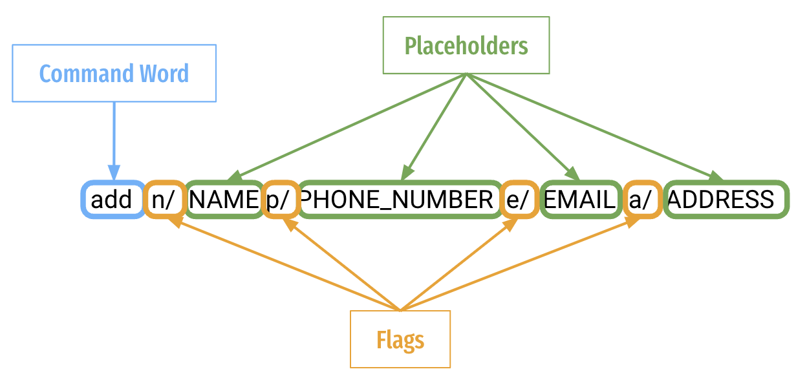

## Table of Contents

* [About HMHero](#about-hmhero)
* [Overview of Key Features](#overview-of-key-features)
   * [Applicant Management System](#applicant-management-system)
   * [Hiring Process Analytics](#hiring-process-analytics)
* [How to use this User Guide](#how-to-use-this-user-guide)
   * [Icons and Hyperlinks](#icons-and-hyperlinks)
   * [Purpose of User Guide](#purpose-of-user-guide)
* [Installation](#installation)
* [Quick Start](#quick-start)
   * [User Interface](#user-interface)
   * [Key Definitions](#key-definitions)
     * [Applicant](#applicant)
     * [Notes](#notes)
     * [Flags](#flags)
     * [Placeholders](#placeholders)
   * [Command Format](#command-format)
   * [Trying your First Command](#trying-your-first-command)
* [Commands](#commands)
   * [Applicant Commands](#applicant-commands)
     * [Create a new applicant `add`](#create-a-new-applicant-add)
     * [Search for an applicant `find`](#search-for-an-applicant-find)
     * [List all applicants `list`](#list-all-applicants-list)
     * [Delete an applicant `delete`](#delete-an-applicant-delete)
     * [Advance an applicant `advance`](#advance-an-applicant-advance)
     * [Reject an applicant `reject`](#reject-an-applicant-reject)
     * [List all interview dates of applicants `interview`](#list-all-interview-dates-of-applicants-interview)
     * [Edit an existing applicant `edit`](#edit-an-existing-applicant-edit)
     * [Remind upcoming interviews `remind`](#get-reminders-for-upcoming-interviews-remind)
     * [Filter applicants with specific skill(s) `skill`](#filter-applicants-with-specific-skill--s--skill)
   * [Statistic Commands](#statistics-commands)
     * [Summary Statistics `summary`](#summary-statistics-summary)
   * [General Commands](#general-commands)
     * [Receive help during usage `help`](#receive-help-during-usage-help)
     * [Exit HMHero `exit`](#exit-hmhero-exit)
* [Command summary](#command-summary)
   * [Applicant Commands](#applicant-commands)
   * [Statistics Commands](#statistics-commands)
   * [General Commands](#general-commands)
* [Troubleshooting](#troubleshooting)
* [FAQ](#faq)
* [Acknowledgements](#acknowledgements)
* [Glossary](#glossary)

---
<div style="page-break-after: always;"></div>

## About HMHero

Have you ever found it difficult to manage the constant influx of applicants during each application cycle?
Have you ever found it strenuous filtering through countless applicants to find those that fit specific job requirements?
HMHero is here to help!

## Overview of key features

There are two core features that HMHero provides:

1. Applicant Management System
2. Hiring Process Analytics


### Applicant Management System

HMHero empowers you to manage applicants during hiring process.<br>
You can:
1. Easily add, edit, delete, and view your applicants.
2. Quickly advance applicants through application statuses or reject them.
3. Filter shortlisted applicants and sort them by interview date.
4. Filter all applicants based on their skill-sets.
5. View all applicants that have interviews coming up in three days.


### Hiring Process Analytics

HMHero provides analysis on your hiring process. <br>
You can:
1. Find out how many applicants are accepted out of total applicants.
2. Find out the average time taken to process each applicant.


[Back to Table of Contents](#table-of-contents)

---

## How to use this User Guide

### Icons and Hyperlinks

You may come across colored boxes containing text that will aid you in better understanding how to use each feature.

<div markdown="span" class="alert alert-info" role="alert">:information_source: <strong>Info:</strong> <br>
Highlight and display information you should pay attention to. </div>


<div markdown="span" class="alert alert-success" role="alert">:bulb: <strong>Tip:</strong> <br>
Highlight tips which you might find useful. </div>


<div markdown="span" class="alert alert-danger" role="alert">:exclamation: <strong>Caution:</strong> <br>
Highlight dangers and things to look out for. </div>


Other than the icons mentioned above, you maye also come across <a href> Phrases coloured in blue </a> are hyperlinks
that will bring you to another part of this documentation that is relevant to the phrase.

[Back to Table of Contents](#table-of-contents)

---
<div style="page-break-after: always;"></div>

### Purpose of User Guide

If you are a **new user**, head over to the [Installation](#installation) section to download the application.


<div markdown="span" class="alert alert-info" role="alert">:information_source: <strong>Info:</strong> <br>
We highly recommend that you read through this User Guide in **sequential order** to get a thorough understanding
of how to use HMHero.
</div>


Next, you can find the necessary information to get started in the [Quick Start](#quick-start) section!

If you are an **experienced user**, you may head over to the [Command Summary](#command-summary) to get a quick overview
of all the commands available in HMHero!

If you are stuck, please refer to the section on [Troubleshooting](#troubleshooting) or [FAQ](#faq).

You can also refer to the [Glossary](#glossary) for definitions of commonly used terminologies in HMHero.

<div markdown="span" class="alert alert-success" role="alert">:bulb: <strong>Tip:</strong> <br>
To aid in your navigation, we have included the a <a href="#table-of-contents">Back to Table of Contents</a> link in every
sub-section in this User Guide so that it is easy for you to jump across different sections!
</div>


[Back to Table of Contents](#table-of-contents)

---

## Installation

1. Ensure you have downloaded `Java 11` or above installed in your computer. If you have not, you may download it [here](https://docs.oracle.com/en/java/javase/11/install/overview-jdk-installation.html).
2. Download the latest `HMHero` from [here](https://github.com/AY2223S2-CS2103T-W14-4/tp/releases).
3. Copy the file to an empty folder. This folder is where all the information needed for the HMHero application
will reside in.
4. Double-click on the jar file to launch HMHero.
5. A GUI similar to the one below should appear in a few seconds. Note how the app contains some sample data.


<div markdown="span" class="alert alert-danger" role="alert">:exclamation: <strong>Caution:</strong> <br>
Ensure that the file is added to an empty folder as additional data and configuration files will be created when HMHero
is launched for the first time in your computer!
</div>

<div markdown="span" class="alert alert-danger" role="alert">:exclamation: <strong>Caution:</strong> <br>
You will notice that a folder called "data" would have been created in the same folder as <code>hmhero.jar</code>.
Do not edit this file because doing so might result in a corruption of your data, causing the application to fail!
</div>

The following section on [Quick Start](#quick-start) is a tutorial on how to use HMHero
after you have launched it for the first time. Feel free to skip to the next section on [Commands](#commands) if you
are already familiar with the application!

[Back to Table of Contents](#table-of-contents)

---
<div style="page-break-after: always;"></div>

## Quick Start
This section covers everything you should know about HMHero, as well as a tutorial on 
[trying your first command](#trying-your-first-command). Take note that  the
[Key Definitions](#key-definitions) and [Command Format](#command-format) sections covers essential knowledge to using HMHero's features.


### User Interface
When you launch HMHero, HMHero appears on your screen as a Graphical User Interface(GUI). Let's explore the
layout of the different components of HMHero.

HMHero's GUI consists of a single main window consisting of 3 main sections.
1. [Command Input Box](#command-input-box): Input command text field
2. [Command Output Box](#command-output-box): Command result
3. [Applicant List Box](#applicant-list-box): List of applicants 

The following picture of the main window shows the three components, numbered accordingly:


HMHero also has the Help Window. It is not part of the main GUI and is only
shown after a [Help Command](#receive-help-during-usage-help) is run.

The Help Window looks like the following:


[Back to Table of Contents](#table-of-contents)

---
<div style="page-break-after: always;"></div>

### Key Definitions

#### Applicant

An applicant in HMHero represents an individual that applied for a job at your company. HMHero tracks various
attributes of an applicant. Compulsory attributes would include their name, phone number, address and email.

The following are the attributes stored for each `Applicant`
* Name
* Phone Number
* Address
* Email
* Application Date
* Interview Date
* Notes

Applicants are unique by name and phone number and are case sensitive.
This means you cannot add two or more applicants of the same name and phone number.


[Back to Table of Contents](#table-of-contents)

---

#### Notes

A note in HMHero serves as a means of labelling the skills of an applicant. These tags
are unique and case-sensitive.

We can tag multiple applicants with the same note and each applicant can have multiple notes. These notes
are optional.

Feel free to make use of notes as you fit to highlight skill-sets of an applicant. Examples of such notes
can include:

  * Technical proficiency, e.g. `Python`, `Java`, `Flask`
  * Soft Skills, e.g. `Project Management`, `Event Planning`

HMHero's Notes are unique by name and are case-sensitive. This means you cannot add two or more notes of
the same name.

[Back to Table of Contents](#table-of-contents)

---

#### Flags
Flags are delimiters that enable HMHero to distinguish different parameters without ambiguity.

You could put in the corresponding [Placeholder](#placeholders) immediately after each flag.

<div markdown="span" class="alert alert-success" role="alert">:bulb: <strong>Tip:</strong> <br>
You may find the following image taken from the subsequent <a href="#53-command-format"> Command Format </a> section helpful:

</div>

Placeholder refers to the UPPER_CASE words that can be replaced by valid user input supplied.
These placeholders follow immediately after a [Flag](#flags).


[Back to Table of Contents](#table-of-contents)

---

<div style="page-break-after: always;"></div>

#### Placeholders
Placeholder refers to the UPPER_CASE words that can be replaced by valid user input supplied.
These placeholders follow immediately after a [Flag](#flags).

Please refer to the subsequent [Command Format](#command-format) 
section to see how Flags and Placeholders are used together.

| Placeholder          | Corresponding Flag | Description                                                                                                        | Restrictions                                                                                                                                                                                                                                                                                                                                                                                                                                                                                                |
|----------------------|--------------------|--------------------------------------------------------------------------------------------------------------------|-------------------------------------------------------------------------------------------------------------------------------------------------------------------------------------------------------------------------------------------------------------------------------------------------------------------------------------------------------------------------------------------------------------------------------------------------------------------------------------------------------------|
| INDEX                | (Not Applicable)   | The INDEX of an item is the number to the left of the applicant's name in the Item List Box.                       | The INDEX is restricted to the number of applicants in HMHero and cannot be negative.                                                                                                                                                                                                                                                                                                                                                                                                                       |
| NAME                 | n/                 | The NAME is the text we use to identify an Applicant.                                                              | The NAME of an applicant must be alphabetic characters and no numbers are allowed.                                                                                                                                                                                                                                                                                                                                                                                                                          |
| PHONE                | p/                 | The PHONE is the text we use to represent the phone number of the Applicant.                                       | The PHONE of an applicant must have at least 3 numbers and must be numeric characters.                                                                                                                                                                                                                                                                                                                                                                                                                      |
| EMAIL                | e/                 | The EMAIL is the text we use to represent the email of the Applicant.                                              | EMAIL must be in the format username@domain  <br><br>   `username`:    <li>Should only contain alphanumeric characters and these special characters (`+`, `_`, `.`, `-`) </li>     <li>Should not start or end with any special characters. </li>  <br> `domain`:   <li>Should be at least 2 characters long. </li>    <li>Each domain label should start and end with alphanumeric characters. </li>    <li>Each domain label consists of alphanumeric characters, separated only by hyphens, if any.</li> |
| NOTE                 | note/              | The NOTE is the text we use to identify a skill of an Applicant.                                                   | NOTE cannot be longer than 45 characters long.                                                                                                                                                                                                                                                                                                                                                                                                                                                              |
| APPLICATION DATETIME | applied/           | The APPLICATION DATETIME is the text we use to represent the date and time that the Applicant applied for the job. | Format of datetime is `DD-MM-YYYY HH:mm`                                                                                                                                                                                                                                                                                                                                                                                                                                                                    |
| INTERVIEW DATETIME   | d/                 | The INTERVIEW DATETIME is the text we use to represent the date and time of the Applicant's interview.             | Format of datetime is `DD-MM-YYYY HH:mm` <br><br> INTERVIEW DATETIME can only be scheduled after the APPLICATION DATETIME.                                                                                                                                                                                                                                                                                                                                                                                  |

[Back to Table of Contents](#table-of-contents)

---
<div style="page-break-after: always;"></div>

### Command Format
Before you delve into the different commands in Commands, let’s learn what a command consists of.

Here is an example:

A command consists of:
Command Word: Tells HMHero what action you wish to execute. These actions are covered in [Commands](#commands).<br>
[Flags](#flags): Distinguishes between inputs. A flag is usually followed by a placeholder.<br>
[Placeholders](#placeholders): Represents data that you wish to input. Replace this with valid data.<br>
For example, `NAME` in `n/NAME` can be replaced with `n/John`.

[Back to Table of Contents](#table-of-contents)

---
<div style="page-break-after: always;"></div>

### Trying your First Command

To let you become more familiar with HMHero, let's practise executing some commands.

One of the available commands in HMHero is the command to create a new applicant.

**Format:** `add n/NAME p/PHONE e/EMAIL a/ADDRESS [applied/APPLIED DATE TIME] [note/NOTE]`
<br>
<br>

**What does the format mean?**
* `add` tells HMHero that this is the command to create a new applicant
* [Flags](#flags) such as `n/` and `p/` are delimiters that enable HMHero to distinguish different
parameters supplied by you without ambiguity
* [Placeholders](#placeholders) such as `NAME` and `PHONE` shows you what you should place in each portion of the 
command

Notice that there is a pair of square brackets `[]` surrounding some parameters like `note/NOTE` and `applied/APPLICATION DATE TIME`
in the format. This indicates that the parameter is **optional**. Each of these placeholders in the parameters 
have a default value based on the commands. These are documented in the [Commands](#commands) section for each command.


<div markdown="span" class="alert alert-info" role="alert">:information_source: <strong>Info:</strong> <br>
The <a href="#placeholders">Placeholder</a> section covers the restrictions for respective placeholders. For example, 
the format of PHONE, certain characters you cannot use and the limit and precision of numbers. 
</div>

**Let's try an example!**

Suppose you just add Thomas, 98765432, thomas@gmail.com, living at 1 Sims Drive (s)543210, and you do not
feel the need to record a note for this applicant.

`NAME`: Thomas

`PHONE`: 98765432

`EMAIL`: thomas@gmail.com

`ADDRESS`: 1 Sims Drive (s)543210

The command you would like to enter into the command box would be:

```
add n/Thomas p/91918153 e/thomas@gmail.com a/6 Sims Drive (s)543230
```

Find out more about restrictions in the sections [Flags](#flags), [Placeholders](#placeholders) 
and [Commands](#commands). 

---

Here is a checklist you can use before running a command:

* [ ] I know the restrictions of the command
* [ ] I know what parameters are supplied to the command
* [ ] I know the flags for each parameter to be supplied
* [ ] I know the restrictions of each parameter
* [ ] I know the effects of not specifying each optional flag.

[Back to Table of Contents](#table-of-contents)

---


## Commands

This section shares with you on how to use each command in detail.

<div class="alert alert-info" role="alert">:information_source: <strong>Info:</strong> <br>
<ul>
    <li>Square brackets indicates an optional parameter.
</li>
    <li>In most commands, if the same parameter is repeated and only one is required, we take the last value provided.
</li> 
</ul>
</div>

[Back to Table of Contents](#table-of-contents)
<div style="page-break-after: always;"></div>

### Applicant Commands

#### Create a new applicant `add`

**Format**: `add n/NAME p/PHONE e/EMAIL a/ADDRESS [applied/APPLIED DATE TIME] [note/NOTE]`

> You can create a new applicant with the provided information

<div class="alert alert-info" role="alert">:information_source: <strong>Info:</strong> <br>
<ul>
    <li>All fields apart from <code>APPLIED DATE TIME</code> and <code>NOTE</code> are compulsory.</li>
    <li>Both <code>NAME</code> and <code>PHONE</code> together must be unique.</li>
    <li><code>NAME</code> is case-sensitive. (e.g. "Thomas" is different from "thomas").</li>
    <li><code>PHONE</code> does not require you to include the country code. Only include the numbers.</li>
    <li>The value of <code>APPLIED DATE TIME</code> will be the time you add a new applicant if it is not provided.</li>
    <li>The value of <code>NOTE</code> will be empty if it is not provided.</li>
    <li>If two or more values of the same parameter are provided, only the last value for that parameter will be taken.
</li>
    <li>However, if two or more <code>NOTE</code> are added, all the notes will be added to the applicant.
</li>
</ul> </div>


**Example:** 
<br>
* You want to create a new applicant named Adam whose information does not exist in HMHero yet.

Command Input Box: `add n/Adam p/91918153 e/adam@gmail.com a/6 Sims Drive`

What you should see:
1. Adam is added into the Applicant list.
2. Command Output Box shows that Adam is added and his details.


[Back to Table of Contents](#table-of-contents)

---


#### Search for an applicant `find`

**Format**: `find n/[NAME] p/[PHONE]`

> You can find all applicants in HMHero using name, phone or both

<div class="alert alert-info" role="alert">:information_source: <strong>Info:</strong> <br>
<ul>
    <li>We take in name, phone or both. In this case, at least <code>NAME</code> or <code>PHONE</code> is required.</li>
    <li>The <code>NAME</code> is case-insensitive. (e.g. "thomas" will match "Thomas").</li>
    <li>This means that providing both <code>NAME</code> and <code>PHONE</code> narrows down the scope.</li>
    <li> The <code>find</code> command only finds applicants which has a name, phone or both 
that fully matches the specified search of the full name, phone or both!</li>
    <li> This means that if the <code>NAME</code> <code>Thomas Lee</code> and <code>Thomas Tan</code> is in HMHero, 
executing <code>Thomas Lee</code> will only find <code>Thomas Lee</code>. </li>
    <li> This also means that if the <code>PHONE</code> <code>91918153</code> and <code>9191</code> is in HMHero, 
executing <code>91918153</code> will only find <code>PHONE</code> <code>91918153</code>. </li>
    <li> If you try to find applicants using both <code>NAME</code> and <code>PHONE</code>,
it will work the same as finding individually! </li>
    <li>If two or more values of the same parameter are provided, only the last value for that parameter will be taken.
    </li>
</ul> </div>

<div class="alert alert-success" role="alert">:bulb: <strong>Tip:</strong> <br>
<ul>
    <li> You can use the <a href="#613-list-all-applicants-list">List Command</a> in the next section to display all applicants again!</li> 
</ul> </div>

**Example:**
<br>
* You want to search for an applicant named Adam whose information exist in HMHero.

Command Input Box: `find n/Adam p/91918153`

What you should see:
1. Adam is found in the Applicant list.
2. Command Output Box shows that 1 person is listed.


[Back to Table of Contents](#table-of-contents)

---
<div style="page-break-after: always;"></div>

#### List all applicants `list`

**Format**: `list`

> You can list all applicants in HMHero

<div class="alert alert-info" role="alert">:information_source: <strong>Info:</strong> <br>
<ul>
    <li>This command is useful to view all applicants again after using the 
[Find Command](#612-search-for-an-applicant-find).</li>
</ul> </div>

**Info**
* This command is useful to view all applicants again after using the <a href="#612-search-for-an-applicant-find">
Find Command</a>


**Example:**
<br>
* You want to list all applicants who exist in HMHero.

Command Input Box: `list`

What you should see:
1. The whole list of applicants in the Applicant list.
2. Command Output Box shows the total applicants and numbers of applicants in each stage.


[Back to Table of Contents](#table-of-contents)

---


#### Delete an applicant `delete`

**Format**: `delete n/NAME p/PHONE`

> You can delete an applicant in HMHero using name and phone

<div class="alert alert-info" role="alert">:information_source: <strong>Info:</strong> <br>
<ul>
    <li>All fields are compulsory.</li>
    <li> The <code>delete</code> command only deletes <code>Applicant</code> which has a name and phone 
that fully matches the specified search.</li> 
</ul> </div>


**Example:**
<br>
* You want to delete an applicant who exist in HMHero.

Command Input Box: `delete n/Bernice Yu p/91234567`

What you should see:
1. Bernice Yu is deleted from the Applicant list.
2. Command Output Box shows that Bernice Yu is deleted and her details.


[Back to Table of Contents](#table-of-contents)

---


#### Advance an applicant `advance`

**Format**: `advance n/NAME p/PHONE [d/INTERVIEW DATETIME]`

> You can advance an applicant in HMHero using name, phone and interview datetime

<div class="alert alert-info" role="alert">:information_source: <strong>Info:</strong> <br>
<ul>
    <li>The <code>advance</code> command only advances <code>Applicant</code> which has a name and phone that
fully matches the specified search.</li> 
    <li> The <code>INTERVIEW DATETIME</code> is required to advance <code>Applicant</code> from <code>status</code>
<code>APPLIED</code> to <code>status</code> <code>SHORTLISTED</code>. 
</li> 
    <li> However, <code>INTERVIEW DATETIME</code> is not required to advance <code>Applicant</code> from <code>status
</code> <code>SHORTLISTED</code> to <code>status</code> <code>ACCEPTED</code>. </li>
</ul> </div>

<div markdown="span" class="alert alert-danger" role="alert">:exclamation: <strong>Caution:</strong>
<code>INTERVIEW DATETIME</code> cannot be earlier than current time and application date time 
when you advance an applicant! 
</div>


**Example:**
<br>
* You want to advance an applicant's status `APPLIED` who exist in HMHero.

Command Input Box: `advance n/Adam p/91918153 d/20-05-2023 12:12`

What you should see:
1. Adam is advanced from status `APPLIED` to status `SHORTLISTED` in the Applicant list.
2. Command Output Box shows that Adam is advanced, his old and new status.


**Example:**
<br>
* You want to advance an applicant's status `SHORTLISTED` who exist in HMHero.

Command Input Box: `advance n/Adam p/91918153 `

What you should see:
1. Adam is advanced from status `SHORTLISTED` to status `ACCEPTED` in the Applicant list.
2. Command Output Box shows that Adam is advanced, his old and new status.


[Back to Table of Contents](#table-of-contents)

---


#### Reject an applicant `reject`

**Format**: `reject n/NAME p/PHONE`

> You can reject an applicant in HMHero using name and phone

<div class="alert alert-info" role="alert">:information_source: <strong>Info:</strong> <br>
<ul>
    <li>All fields are compulsory.</li>
    <li> The <code>reject</code> command only rejects <code>Applicant</code> which has a name and phone that 
fully matches the specified search.</li> 
    <li> The <code>NAME</code> and <code>PHONE</code> is required to reject <code>Applicant</code> from <code>status</code> 
<code>APPLIED</code>, <code>SHORTLISTED</code> and <code>ACCEPTED</code> to <code>status</code> <code>REJECTED</code>.
    </li> 
</ul> </div>


**Example:**
<br>
* You want to reject an applicant's status `SHORTLISTED` who exist in HMHero.

Command Input Box: `reject n/Alex Yeoh p/87438807`

What you should see:
1. Adam is rejected from status `SHORTLISTED` to status `REJECTED` in the Applicant list.
2. Command Output Box shows that Adam is rejected.


<div markdown="span" class="alert alert-danger" role="alert">:exclamation: <strong>Caution:</strong>
Applicants with the status <code>REJECTED</code> cannot be rejected again!
</div>

[Back to Table of Contents](#table-of-contents)

---

#### List all interview dates of applicants `interview`

**Format**: `interview`

> You can list all interview dates of shortlisted applicants in HMHero in chronological order

<div class="alert alert-info" role="alert">:information_source: <strong>Info:</strong> <br>
<ul>
    <li>This command is useful to view all applicants again after using the [Advance Command]
(#615-advance-an-applicant-advance).</li>
</ul> </div>

**Example:**
<br>
* You want to list the interview dates of the shortlisted applicants who exist in HMHero.

Command Input Box: `interview`

What you should see:
1. All the interview dates of the shortlisted applicants in the Applicant list.


[Back to Table of Contents](#table-of-contents)

---


#### Edit an existing applicant `edit`

**Format**: `edit INDEX [n/NAME] [p/PHONE] [e/EMAIL] [a/ADDRESS] [d/INTERVIEW DATETIME] [note/NOTE]`

> You can edit an existing applicant with the provided information

<div class="alert alert-info" role="alert">:information_source: <strong>Info:</strong> <br>
<ul>
    <li>All fields apart from <code>INDEX</code> are optional. However, you need to include at least one optional 
parameter.</li>
    <li> However for <code>NOTE</code>:
        <ul> 
            <li>If two or more values for <code>NOTE</code> are provided, both parameters will be taken in.</li>
            <li>If an empty <code>NOTE</code> is provided, all notes will be removed.</li>
        </ul>
    </li>
    <li>You are allow to change <code>INTERVIEW DATETIME</code> to a time before the current time and application
date time using edit command. 
</li>
    <li>If two or more values of the same parameter are provided, only the last value for that parameter will be taken.
</li>
</ul> </div>


**Example:**
<br>
* You want to edit the phone number and notes of an applicant who exist in HMHero.

Command Input Box: `edit 2 p/91234567 note/Kotlin note/Python note/leadership`

What you should see:
1. Bernice's phone number and notes are edited in the Applicant list.
2. Command Output Box shows that Bernice is edited with her new information shown.


[Back to Table of Contents](#table-of-contents)

---
<div style="page-break-after: always;"></div>

#### Get reminders for upcoming interviews `remind`

**Format:** `remind`

> You can list all applicants with interviews within the next three days.

<div class="alert alert-info" role="alert">:information_source: <strong>Info:</strong> <br>
<ul>
    <li>Reminder for upcoming interview will show all applicants with interviews in the next three days. (e.g. On Monday, 
it will show all applicants with interviews till Thursday)</li>
</ul> </div>

**Example:**
<br>
* You want to see all the applicants with interview within the next three days who exist in HMHero.

Command Input Box: `remind`

What you should see:
1. Adam's interview date is within the next three days which is shown in the Applicant list.
2. Command Output Box shows the success message.


[Back to Table of Contents](#table-of-contents)

---


#### Filter applicants with specific skill(s) `skill`

**Format**: `skill KEYWORD(s)`

> You can filter all applicants in HMHero using specific skill keyword(s)

<div class="alert alert-info" role="alert">:information_source: <strong>Info:</strong> <br>
<ul>
    <li>We take in <code>KEYWORD</code>. In this case, at least one <code>KEYWORD</code> is required.</li>
    <li>The <code>KEYWORD</code> is case-insensitive. (e.g. "java" will match "Java").</li>
    <li>Each <code>KEYWORD</code> is separated with a space.</li>
    <li>The <code>KEYWORD</code> provided must match the whole word. (e.g. "jav" will not match "java")</li>
    <li>If two or more <code>KEYWORD</code> are provided, it will only match with applicant(s) with all the skills 
specified. 
        (e.g. if Adam has <code>python</code> and <code>java</code>, while Thomas has 
        <code>java</code> only in HMHero, executing <code>skill java python</code> will only find Adam)</li>
</ul> </div>

<div class="alert alert-success" role="alert">:bulb: <strong>Tip:</strong> <br>
<ul>
    <li> You can use the <a href="#613-list-all-applicants-list">List Command</a> to display all applicants again!</li> 
</ul> </div>

**Example:**
<br>
* You want to search for applicants with java skill that exist in HMHero.

Command Input Box: `skill java`

What you should see:
1. Adam who has java skill is found in the Applicant list.
2. Command Output Box shows that 1 person is listed.


[Back to Table of Contents](#table-of-contents)

---


### Statistics Commands

#### Summary Statistics `summary`

**Format:** `summary`

> You can show a statistical summary of the company's hiring processes.

**Example:**
<br>
* You want to see the statistics for your hiring cycle in HMHero.

Command Input Box: `summary`

What you should see:
1. A list of all applicants found in the Applicant list.
2. Command Output Box shows the statistics for your hiring cycle.


[Back to Table of Contents](#table-of-contents)

---


### General Commands

#### Receive help during usage `help`

**Format**: `help`

> You can display help window for HMHero which contains link to User Guide.

**Example:**


[Back to Table of Contents](#table-of-contents)

---


#### Exit HMHero `exit`

**Format**: `exit`

> You can exit HMHero

**Expected Outcomes:**

* All HMHero application windows will close
* Your data is saved locally in your computer.

<div markdown="span" class="alert alert-info" role="alert">:information_source: <strong>Info:</strong> <br>
If your data cannot be saved successfully, HMHero will not close in order to prevent data loss.
</div>

[Back to Table of Contents](#table-of-contents)

---


## Command Summary

### Applicant Commands

| Action                                   | Format                                                                                                                                                                        | Example                                                                     |
|------------------------------------------|-------------------------------------------------------------------------------------------------------------------------------------------------------------------------------|-----------------------------------------------------------------------------|
| Add a new applicant                      | `add n/NAME p/PHONE e/EMAIL a/ADDRESS [note/NOTE]`                                                                                                                            | `add n/Tom p/98763213 e/asd@gmail.com a/6 Sims Drive (s)532123 note/Python` |
| Search for an applicant                  | `find [n/NAME] [p/PHONE]` <br> (Minimally one of `n/NAME` or `p/PHONE` must be provided)                                                                                      | `find n/Tom p/98763213`                                                     |
| List all applicants                      | `list`                                                                                                                                                                        | `list`                                                                      |
| Delete an applicant                      | `delete n/NAME p/PHONE`                                                                                                                                                       | `delete n/Tom p/98763213`                                                   |
| Advance an applicant                     | `advance n/NAME p/PHONE [d/INTERVIEW DATETIME]` <br> <br> **Note:** You need to provide an `INTERVIEW DATETIME` to advance an applicant's status from `APPLIED` to `ACCEPTED` | `advance n/Tom p/98763213 d/20-03-2024 12:12`                               |
| Reject an applicant                      | `reject n/NAME p/PHONE`                                                                                                                                                       | `reject n/Tom p/98763213`                                                   |
| View the interview dates of applicants   | `interview`                                                                                                                                                                   | `interview`                                                                 |
| Edit the information of an applicant     | `edit INDEX [n/NAME] [p/PHONE] [e/EMAIL] [a/ADDRESS] [d/INTERVIEW DATE TIME] [note/NOTE]`                                                                                     | `edit 1 n/Marry p/98763245`                                                 |
| Remind an applicant's interview date     | `remind`                                                                                                                                                                      | `remind`                                                                    |
| Filter applicants with specific skill(s) | `skill KEYWORD(s)`                                                                                                                                                            | `skill java`                                                                |
 

[Back to Table of Contents](#table-of-contents)

---

### Statistics Commands

| Action                                  | Format    | Example   |
|-----------------------------------------|-----------|-----------|
| Displays statistics collected by HMHero | `summary` | `summary` | 

[Back to Table of Contents](#table-of-contents)

---

### General Commands

| Action                                               | Format | Example |
|------------------------------------------------------|--------|---------|
| Shows a help dialog with a link to HMHero User Guide | `help` | `help`  |
| Exits HMHero                                         | `exit` | `exit`  |

[Back to Table of Contents](#table-of-contents)

---
<div style="page-break-after: always;"></div>

## Troubleshooting

**Problem:**

The JAR file not launching even after double-clicking the file.

**Solution:**

1. Open your terminal
* Windows:
    * The default key combination to launch your terminal is <kbd>Ctrl</kbd>+<kbd>Shift</kbd>+<kbd>P</kbd>
* Mac:
    * Use <kbd>Cmd</kbd>+<kbd>Space</kbd> to open Spotlight Search
    * Search for "terminal" and click it to launch. 
2. Navigate to the location where "hmhero.jar" is stored within your terminal using `cd`. For example, `cd Downloads/`


3. On your terminal, run `java -jar hmhero.jar`

**Problem:**

The JAR file not launching in Windows Subsystem for Linux (WSL).

<div markdown="span" class="alert alert-info" role="alert">:information_source: **Info:** 
WSL does not support GUI applications by default. 
</div>

**Solution:**

1. Our recommendation is to run HMHero application on Windows and not on WSL.

**Problem:**

Unable to exit/save HMHero to data file

**Solution:**

1. This error is due to `hmhero.jar` being started in a protected folder. (Examples of write-protected folders include`C:\WINDOWS\System32` in windows and the `/etc` dir in linux) <br> Please move the `hmhero.jar` file into another folder in your computer and start HMHero application from that folder.
   

[Back to Table of Contents](#table-of-contents)

---
<div style="page-break-after: always;"></div>

## FAQ

### Q: If I do not have Java 11, how do I install it on my computer? <br>
**A:** You can navigate to this site [here](https://docs.oracle.com/en/java/javase/11/install/overview-jdk-installation.html) and download Java 11 according to your system’s specifications.

### Q: Do I need an internet connection to run HMHero? <br>
**A:** No, HMHero can boot up and run all functionalities without an internet connection.

### Q: Can I use HMHero on my mobile device?<br>
**A:** Unfortunately, HMHero is only designed to run on your desktop/laptop such that you can use the command line interface.

### Q: How do I transfer my data to another computer?<br>
**A:** Install HMHero on the other computer and overwrite the empty data file with the data file created by HMHero in your current computer.

[Back to Table of Contents](#table-of-contents)

---
<div style="page-break-after: always;"></div>

## Acknowledgements


HMHero is a brownfield software engineering project based off [AddressBook Level-3](https://nus-cs2103-ay2223s2.github.io/tp/), taken under the [CS2103T Software Engineering](https://nus-cs2103-ay2223s2.github.io/website/admin/index.html) held by School of Computing at National University of Singapore.

Java dependencies:
* [JavaFX](https://openjfx.io/) for Graphical User Interface
* [JUnit5](https://github.com/junit-team/junit5) for testing
* [Jackson](https://github.com/FasterXML/jackson) for JSON-related operations

Documentation dependencies:
* [PlantUML](https://plantuml.com/) for creating UML diagrams
* [Jekyll](https://jekyllrb.com/)  for rendering the website

[Back to Table of Contents](#table-of-contents)

---
<div style="page-break-after: always;"></div>

## Glossary

### Quick Reference
- [ADDRESS (Placeholder)](#address-placeholder)
- [Address](#address)
- [Applicant](#applicant)
- [Applicant List Box](#applicant-list-box)
- [Application Cycle](#application-cycle)
- [COMMAND_WORD (Placeholder)](#commandword-placeholder)
- [Command](#command)
- [Command Input Box](#command-input-box)
- [Command Line (CLI)](#command-line)
- [Command Output Box](#command-output-box)
- [Placeholder](#email-placeholder)
- [Email](#email)
- [Flags](#flags)
- [Graphical User Interface(GUI)](#graphical-user-interface)
- [Help Window](#help-window)
- [Hiring Manager](#hiring-manager)
- [Input](#input)
- [INTERVIEW_DATE (Placeholder)](#interviewdate-placeholder)
- [Interview Date](#interview-date)
- [KEYWORD (Placeholder)](#keyword-placeholder)
- [NAME (Placeholder)](#name-placeholder)
- [Name](#name)
- [NOTES (Placeholder)](#notes-placeholder)
- [Notes](#notes)
- [Operating System (OS)](#operating-system)
- [Output](#output)
- [Parameter](#parameter)
- [PHONE_NUMBER (Placeholder)](#phonenumber-placeholder)
- [Phone Number](#phone-number)
- [Placeholder](#placeholder)
- [STATUS (Placeholder)](#status-placeholder)
- [Status](#status)
- [Syntax](#syntax)
- [URL](#url)

---
<div style="page-break-after: always;"></div>

### A
> #### ADDRESS Placeholder
> The ADDRESS is a text representing the address of the applicants.
> <br>To view more information (limitations, examples, etc.), refer to the [Placeholder](#placeholders) table.
> #### Address
> The address of the applicant provided by the user.
> #### Applicant
> The person who apply to the company for the job.
> #### Applicant List Box
> The region located at the bottom left of the HMHero's main window.<br>
> To view more information, refer to the [User Interface](#user-interface) section of the User Guide
> #### Application Cycle
> All applicants added are at the Applied status by default. From there, hiring managers can advance their application status to Shortlisted, then to Accepted. Applicants can be rejected at any stage.


### C
> #### COMMAND_WORD Placeholder
> The COMMAND_WORD is a text indicating a command word of a command
> <br>To view more information (limitations, examples, etc.), refer to the [Placeholder](#placeholders) table.
> #### Command
> A feature or function that HMHero can perform.
> #### Command Input Box
> The region located at the top left of the HMHero's main window.<br>
> To view more information, refer to the [User Interface](#user-interface) section of the User Guide
> #### Command Line 
> The typing interface that you use to interact with HMHero. It is represented as the box where you type in commands.
> #### Command Output Box
> The region located at the right half of the HMHero's main window. <br>
> To view more information, refer to the [User Interface](#user-interface) section of the User Guide

### E
> #### EMAIL Placeholder
> The EMAIL is a text representing the email address of the applicants.
> <br>To view more information (limitations, examples, etc.), refer to the [Placeholder](#placeholders) table.
> #### Email
> The email address of the applicant provided by the user. Emails should end with a valid domain name (e.g. gmail.com, hotmail.com, etc.)

### F
> #### Flags
> A marker to identify the type of input by the user. For instance, in `n/NAME`, `n/` is the flag.

### G
> #### Graphical User Interface
> A Graphical User Interface is a graphics-based interface that uses icons, menus and a mouse (to click on the icon or pull down the menus) to manage interaction with the system. In HMHero, this presents as the window that appears when launching it.

### H
> #### Help Window
> A pop-up window containing help information, shown only after calling a <kbd>help</kbd> command.<br>
> To view more information, refer to the [User Interface](#user-interface) section of the User Guide
> #### Hiring Manager
> A person responsible for overseeing the recruitment process within an organization, from identifying staffing needs to making hiring decisions.

### I
> #### Input
> The text that a user would enter into HMHero
> #### INTERVIEW_DATE Placeholder
> The INTERVIEW_DATE is the date indicating when the applicant is having his/her interview.
> <br>To view more information (limitations, examples, etc.), refer to the [Placeholder](#placeholders) table.
> #### Interview Date
> Date where applicants are going to have their interviews. Interview date is in the format "day-month-year hour:minute", represented in the "DD-MM-YYYY HH:MM" format.

### K
> #### KEYWORD Placeholder
> The KEYWORD is the text we use search for an item. It can be `NAME` or `PHONE_NUMBER` of the applicant.


### N
> #### NAME Placeholder
> The NAME is a text representing the name of the applicants.
> <br>To view more information (limitations, examples, etc.), refer to the [Placeholder](#placeholders) table.
> #### Name
> The name of the applicant provided by the user.
> #### NOTES Placeholder
> The NOTES are some texts that use to represent the skill set of the applicants.
> <br>To view more information (limitations, examples, etc.), refer to the [Placeholder](#placeholders) table.
> #### Notes
> The skill set the applicant possesses provided by the user.

### O
> #### Operating System
> Is a software program that manages computer hardware and software resources, and provides common services for computer programs to run and interact with the computer hardware.
> #### Output
> The result after calling a Command. Results are displayed in the GUI.

### P
> #### Parameter
> Values that are passed while calling the Commands. For instance, when calling `find n/NAME`, parameter here is `n/NAME`.
> #### PHONE_NUMBER Placeholder
> The PHONE_NUMBER is an integer representing the phone number of the applicant.
> <br>To view more information (limitations, examples, etc.), refer to the [Placeholder](#placeholders) table.
> #### Phone Number
> The phone number of the applicant provided by the user.
> #### Placeholder
> Placeholders in HMHero refers to the UPPER_CASE words that appear after the flags in commands that is provided by the user. For instance, `n/NAME`, `NAME` is a placeholder

### S
> #### STATUS Placeholder
> The STATUS is a text that represent the current state of the applicant.
> <br>To view more information (limitations, examples, etc.), refer to the [Placeholder](#placeholders) table.
> #### Status
> Status has four stages, which are APPLIED, SHORTLISTED, ACCEPTED and REJECTED. Status can only be modified by using <kbd>advance</kbd> or <kbd>reject</kbd> command.
> #### Syntax
> The structure of statements/inputs users type into the Command Line.

### U
> #### URL
> A hyperlink to a website.

[Back to Table of Contents](#table-of-contents)

---

