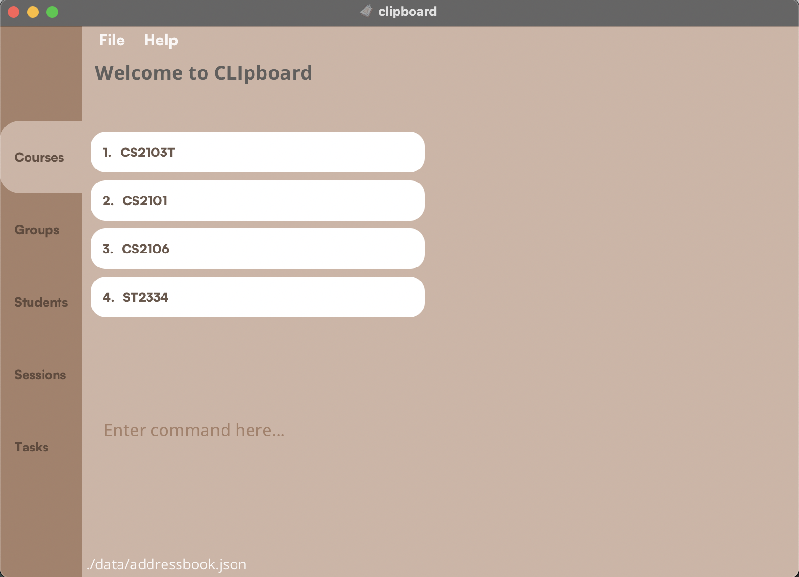

## Introduction

CLIpboard is a desktop app that helps educators (like you!), especially those that tutor multiple classes, by managing their students’ particulars<strong> in an organised manner.</strong>

CLIpboard is designed to work efficiently through typing keyword commands and also has a user-friendly interface with graphical elements. It can get your student management tasks done faster than traditional apps.

CLIpboard is optimised for keyboard users, so if you can type fast, CLIpboard can work even faster.


###### Figure 1

--------------------------------------------------------------------------------------------------------------

## Table of Contents

- [Introduction](#introduction)
- [Table of Contents](#table-of-contents)
- [Quick Start](#quick-start)
- [Visual Guide](#visual-guide)
- [Fields for Student Commands](#fields-for-student-commands)
- [Navigation Guide](#navigation-guide)
- [List of Commands](#commands)
    - [General Commands](#general-commands)
    - [Course Page Commands](#course-page-commands)
    - [Group Page Commands](#group-page-commands)
    - [Students Page Commands](#students-page-commands)
    - [Session Page Commands](#session-page-commands)
    - [Attendance Page Commands](#attendance-page-commands)
    - [Task Page Commands](#task-page-commands)
    - [Grades Page Commands](#grades-page-commands)
- [Glossary](#glossary)

--------------------------------------------------------------------------------------------------------------

## Quick Start

1. Ensure you have Java 11 or above installed in your Computer.
2. Download the latest clipboard.jar from [here](https://github.com/AY2223S2-CS2103T-T15-4/tp/releases).
3. Copy the file to the folder you want to use as the *home folder* for your CLIpboard.
4. Open a command terminal, `cd` into the folder you put the jar file in, and use the `java -jar clipboard.jar` command to run the application.&nbsp;
<br>e.g. your `clipboard.jar` is stored in the `user/app/task/` directory. You run `cd user/app/task/`, then `java -jar clipboard.jar`.
<br>A GUI similar to [<i>Figure 1</i>](#introduction) should appear in a few seconds.
<br><i>Note how the app contains some sample data.</i>
5. You will start on the `Course page` (Refer to [<i>Figure 3</i>](#navigation-guide) below for the Navigation Guide).
6. Type your command in the command box (Refer to [<i>Figure 2</i>](#visual-guide) below for the Visual Guide) and press Enter/Return to execute it.
<br>e.g. typing `help` and pressing the Enter/Return key will open the help window.
    <br>Some example commands you can try:
   1. `select 1` : Selects the first course displayed (eg. `CS2103T`) on the `Course Page`. You will be redirected to the `Group Page`.
   2. `select 1` : Selects the first group displayed (eg. `T15`) on the `Group Page`. You will be redirected to the `Student Page`.
   3. `add student n/John Doe p/98765432 e/johnd@example.com sid/A1234567X` : Adds a student named `John Doe` with the particulars into the list on the `Student Page`.
   4. `delete student 3` : Deletes the 3rd student (eg. `Lim Kim Choo`) shown in the student list.
   5. `undo` : Returns to the state before the previous `delete student` command you entered. The deleted student (eg. `Lim Kim Choo`) should be back on the list.
   6. `exit` : Exits the app.
6. Refer to the [commands list](#commands) below for a detailed description for each command.

--------------------------------------------------------------------------------------------------------------

## Visual Guide

Look through the visual guide before you get started. It will provide you with a clear and easy-to-follow overview
of the basic elements and features of the product's interface, making it easier for you to navigate and use the
product effectively.


###### Figure 2

1. Clickable File and Help Tabs
   * You can manually exit the app with your mouse by clicking `File>Exit` or open the
   help window with `Help>Help`.
2. Navigation Route
   * You can view what courses and groups you have selected, and what page you are currently on here.
3. Navigation Tabs
   * Compared to the Navigation Route, the Navigation Tabs give you a quick overview on what type of page you are currently on.
   * Refer to the [<i>Figure 3</i>](#navigation-guide) below for the Navigation Guide on the different pages in CLIpboard.
4. Command Box
   * Here is where you will type in your commands.
5. Log Box
   * Clipboard will give you feedback on whether or not your command was successful here.
   * Help messages on the valid arguments of the command you are typing will also appear here if your command has failed.

--------------------------------------------------------------------------------------------------------------
## Fields for Student Commands
| **Prefix** | **Prefix meaning**          | **Character Restrictions**                                                                |
|------------|-----------------------------|-------------------------------------------------------------------------------------------|
| n/         | Name                        | Names should only contain alphanumeric characters and spaces, and it should not be blank. |
| p/         | Phone Number                |       Phone numbers should only contain numbers, and it should be at least 3 digits long. |
| e/         | Email                       | Emails should be of the format local-part@domain and adhere to the following constraints: <br> 1. The local-part should only contain alphanumeric characters and these special characters, excluding the parentheses, (+_.-). The local-part may not start or end with any special characters. <br> 2. This is followed by a '@' and then a domain name. The domain name is made up of domain labels separated by periods. The domain name must: <br> - end with a domain label at least 2 characters long <br> - have each domain label start and end with alphanumeric characters <br> - have each domain label consist of alphanumeric characters, separated only by hyphens, if any. |
| sid/       | Student Identification (ID) | Student IDs should be alphanumeric with no special characters |


--------------------------------------------------------------------------------------------------------------

## Navigation Guide

Moving between pages is easy with our navigation tools.
Simply use a combination of `select`, `back`, `session`, and `task` commands.
If you need more information on how to use these commands, just refer to our handy navigation guide below (Figure 3).


###### Figure 3

--------------------------------------------------------------------------------------------------------------

## Commands

List of commands:

- [General Commands: ](#general-commands)
    - [Displaying the home page (Course Page): ](#displaying-the-home-page-course-page-home) `home`
    - [Displaying the previous page you were at: ](#displaying-the-previous-page-you-were-at-back) `back`
    - [Undoing the last command you did: ](#undoing-the-last-command-you-did-undo) `undo`
    - [Opening help window: ](#opening-help-window-help) `help`
    - [Scrolling through command history: ](#scrolling-through-command-history-up-or-down-arrow-key) `UP` or `DOWN` arrow key
    - [Clearing all entries: ](#clearing-all-entries-clear) `clear`
    - [Exiting the program: ](#exiting-the-program-exit) `exit`
- [Course Page Commands: ](#course-page-commands)
    - [Adding a course: ](#adding-a-course-add-course) `add course`
    - [Deleting a course: ](#deleting-a-course-delete-course) `delete course`
    - [Editing a course: ](#editing-a-course-edit-course) `edit course`
    - [Selecting a course to display its Group Page: ](#selecting-a-course-select) `select`
    - [Finding a course: ](#finding-a-course-find-course) `find course`
- [Group Page Commands: ](#group-page-commands)
    - [Adding a group: ](#adding-a-group-add-group) `add group`
    - [Deleting a group: ](#deleting-a-group-delete-group) `delete group`
    - [Editing a group: ](#editing-a-group-edit-group) `edit group`
    - [Selecting a group to display its Student Page: ](#selecting-a-group-select) `select`
    - [Displaying sessions of a group: ](#displaying-sessions-of-a-group-session) `session`
    - [Displaying tasks of a group: ](#displaying-tasks-of-a-group-task) `task`
    - [Finding a group: ](#finding-a-group-find-group) `find group`
- [Students Page Commands: ](#students-page-commands)
    - [Adding a student: ](#adding-a-student-add-student) `add student`
    - [Deleting a student: ](#deleting-a-student-delete-student) `delete student`
    - [Editing a student: ](#editing-a-student-edit-student) `edit student`
    - [Copying a student's email: ](#copying-a-students-email-copy) `copy`
    - [Finding students by name or student ID: ](#finding-students-by-name-or-student-id-find-student) `find student`
    - [Sorting list of students: ](#sorting-list-of-students-sort) `sort`
    - [Displays a student's information:  ](#displays-a-students-information-select) `select`
    - [Adding or deleting a remark: ](#adding-or-deleting-a-remark-remark) `remark`
    - [Upload a student's photo: ](#uploading-a-students-photo-upload) `upload`
    - [Displays a summary of a student's attendance: ](#viewing-a-students-attendance-throughout-the-course-attendance) `attendance`
- [Session Page Commands: ](#session-page-commands)
    - [Adding a session: ](#adding-a-session-add-session) `add session`
    - [Deleting a session: ](#deleting-a-session-delete-session) `delete session`
    - [Editing a session: ](#editing-a-session-edit-session) `edit session`
    - [Selecting a session to start attendance-taking: ](#selecting-a-session-to-start-attendance-taking-select) `select`
    - [Finding a session: ](#finding-a-session-find-session) `find session`
- [Attendance Page Commands: ](#attendance-page-commands)
    - [Marking attendance of a selected students: ](#marking-selected-students-as-present-mark) `mark`
    - [Unmarking attendance of a selected students: ](#marking-selected-students-as-absent-unmark) `unmark`
    - [View the overall attendance of the session: ](#view-the-overall-attendance-of-the-session-attendance) `attendance`
- [Task Page Commands: ](#task-page-commands)
    - [Adding a task: ](#adding-a-task-add-task) `add task`
    - [Deleting a task: ](#deleting-a-task-delete-task) `delete task`
    - [Editing a task: ](#editing-a-task-edit-task) `edit task`
    - [Selecting a task to assign grades: ](#selecting-a-task-to-assign-grades-select) `select`
    - [Finding a task: ](#finding-a-task-find-task) `find task`
- [Grades Page Commands: ](#grades-page-commands)
    - [Assigning a grade: ](#assigning-a-grade-to-student-assign) `assign`


--------------------------------------------------------------------------------------------------------------

<div markdown="block" class="alert alert-info">

**:information_source: Notes about the command format:**<br>

* Words in `UPPER_CASE` and angle brackets `<>` are the parameters to be supplied by the user.<br>
  e.g. in `add course <COURSE>`, `COURSE` is a parameter which can be used as `add course CS2103T`.

* Items in square brackets are optional.<br>
  e.g `[n/<NAME>] [p/<PHONE_NUMBER>]` can be used as `n/John Doe p/88886886` or as `n/John Doe`.

* Items with `…`​ after them can be used multiple times.<br>
  e.g. `mark <INDEX>…​` can be used as `mark 1`, `mark 1,2,3` etc.

* Parameters can be in any order.<br>
  e.g. if the command specifies `n/NAME p/PHONE_NUMBER`, `p/PHONE_NUMBER n/NAME` is also acceptable.

* If a parameter is expected only once in the command but you specified it multiple times, only the last occurrence of the parameter will be taken.<br>
  e.g. if you specify `p/12341234 p/56785678`, only `p/56785678` will be taken.

* Extraneous parameters for commands that do not take in parameters (such as `help`, `back`, `exit` and `clear`) will be ignored.<br>
  e.g. if the command specifies `help 123`, it will be interpreted as `help`.

</div>

## General Commands
Before navigating through the different pages in CLIpboard, you may familiarise yourself with general commands and features that can be used on any page.


### Displaying the home page (Course Page): `home`

Goes back to the home page, which is the Course Page of CLIpboard.

Format:
```
home
```

[Back to list of commands](#commands)

### Displaying the previous page you were at: `back`

Goes back to the previous page you were at.

Format:
```
back
```

[Back to list of commands](#commands)

### Undoing the last command you did: `undo`


Format:
```
undo
```

[Back to list of commands](#commands)

### Opening help window: `help`

Opens a window showing the list of commands available in the current page, as well as a link to this User Guide.

Format:
```
help
```

[Back to list of commands](#commands)

### Scrolling through command history: `UP` or `DOWN` arrow key

Scrolls through past commands in command box.

- Similar to Linux command-line interface, use the up or down arrow keys to scroll through previously typed commands in the command box.
- You may use the `LEFT` or `RIGHT` arrow keys to edit the command first.
- Press `ENTER` to execute the command.

[Back to list of commands](#commands)

### Clearing all entries: `clear`

Clears all entries in the list pane of the current page.

<div markdown="span" class="alert alert-warning">:exclamation: **Caution:**
After the <code>clear</code> command is executed, all entries in the current page will be deleted.
</div>

Format:
```
clear
```

<div markdown="span" class="alert alert-primary">:bulb: **Tip:**
Accidentally cleared your data? Don't worry, try <code>undo</code> command!
</div>


[Back to list of commands](#commands)

### Exiting the program: `exit`

Format:
```
exit
```

[Back to list of commands](#commands)

--------------------------------------------------------------------------------------------------------------

## Course Page Commands

###### Figure 4

### Adding a course: `add course`

Adds a course to the list of courses in the course page.

Format:
```
add course <COURSE>
```

- Adding a course with the same module code is not allowed.
    - For example, if a course with module code `CS2103T` already exists in CLIpboard, entering `add course CS2103T` will display an error message inside the log box.
<div markdown="block" class="alert alert-info">
This command is case-sensitive.<br>
e.g. <code>CS2103T</code> and <code>cs2103t</code> are treated as different courses.
</div>

Examples:
- `add course CS2103T` will add a new course with module code `CS2103T`
- `add course CS2105` will add a new course with module code `CS2105`

<div markdown="span" class="alert alert-primary">:bulb: **Did you know?:**
Course code can have special characters! i.e. "AY2223S2-CS2103T" 
</div>

[Back to list of commands](#commands)

### Deleting a course: `delete course`

Deletes a course from the list of courses in the course page.

Format:
```
delete course <INDEX>
```

Examples:
- `delete course 1` will delete the first course listed in the course list.

[Back to list of commands](#commands)

### Editing a course: `edit course`

Edits an existing course in the course list.

Format:
```
edit course <INDEX> <NEW COURSE NAME>
```

- Edits the module code of the course at index `<INDEX>`.

Examples:
- `edit course 1 CS2106` will rename the first course listed in the course list to `CS2106`.

[Back to list of commands](#commands)

### Selecting a course: `select`

Selects an existing course to display its corresponding Group Page.

Format:
```
select <INDEX>
```
- Selects course at index specified in `<INDEX>` and displays list of groups from that course.

Examples:
- `select 1` will display a list of groups from the first course.

[Back to list of commands](#commands)

### Finding a course: `find course`

Finds course(s) that contains any of the given keywords(s) in the module code.

Format:
```
find course <KEYWORD> [<MORE_KEYWORDS>]
```

- This command is case-insensitive. (e.g. `find course CS2103T` and `find course cs2103t` will give you the same result)
- Keywords are separated by spaces.

Examples:
- `find course CS` returns `CS2103T`, `CS2101`.
- `find course 03` returns `CS2103T`.

[Back to list of commands](#commands)

--------------------------------------------------------------------------------------------------------------

## Group Page Commands

###### Figure 5

### Adding a group: `add group`

Adds a group to the list of groups in the group page.

Format:
```
add group <GROUP>
```

- Adding a group with the same group name is not allowed.
    - For example, if a group with group name `T15` already exists in CLIpboard,
  entering `add group T15` will display an error message inside the log box.

<div markdown="block" class="alert alert-info">
This command is case-sensitive.<br>
e.g. <code>T15</code> and <code>t15</code> are treated as different groups.
</div>

Examples:
- `add group T15` will add a new group with group name `T15`
- `add group L08` will add a new group with group name `L08`

<div markdown="span" class="alert alert-primary">:bulb: **Did you know?:**
Group names can have special characters! i.e. "AY2223S2-T15" 
</div>

[Back to list of commands](#commands)

### Deleting a group: `delete group`

Deletes a group from the list of groups in the group page.

Format:
```
delete group <INDEX>
```
Examples:
- `delete group 1` will delete the first group listed in the group list panel of CLIpboard.

[Back to list of commands](#commands)

### Editing a group: `edit group`

Edits an existing group in the group list.

Format:
```
edit group <INDEX> <NEW GROUP NAME>
```

- Edits the group name of the group at index specified in `<INDEX>`.


Examples:
- `edit group 1 T16` will rename the first group listed in the group list to `T16`.

[Back to list of commands](#commands)

### Selecting a group: `select`

Selects an existing group to display its corresponding Student Page.

Format:
```
select <INDEX>
```
- Selects the group at index specified in `<INDEX>` and displays list of students in that group.

Examples:
- `select 1` will return a list of students from the first group.

[Back to list of commands](#commands)


### Displaying sessions of a group: `session`

Selects an existing group to display its corresponding Session Page.

Format:
```
session <INDEX>
```
- Selects the group at index specified in `<INDEX>` and displays list of sessions in that group.

Examples:
- `session 1` will return a list of sessions from the first group.

[Back to list of commands](#commands)


### Displaying tasks of a group: `task`

Selects an existing group to display its corresponding Task Page.

Format:
```
task <INDEX>
```
- Selects group at index specified in `<INDEX>` and displays list of tasks assigned to that group.

Examples:
- `task 1` will return a list of tasks for the first group.

[Back to list of commands](#commands)

### Finding a group: `find group`

Finds group(s) that contains any of the given keywords(s) in the group name.

Format:
```
find group <KEYWORD> [<MORE_KEYWORDS>]
```

- This command is case-insensitive. (e.g. `find group T15` and `find group t15` will give you the same result)
- Keywords are separated by spaces.

Examples:
- `find group 15` returns `T15`.

[Back to list of commands](#commands)

--------------------------------------------------------------------------------------------------------------

## Students Page Commands

###### Figure 6


### Adding a student: `add student`

Adds a student to the student roster.

Format:
```
add student n/<NAME> p/<PHONE_NUMBER> e/<EMAIL> sid/<STUDENT_ID>
```

- Adding a student with the same student ID is not allowed.
    - For example, if a student with a student ID of `A0123456X` already exists in CLIpboard, entering `add student n/Tom p/99887766 e/tom@example.com sid/A0123456X` will display an error message inside the log box.

Examples:
- `add student n/Tan Wei Xuan p/81776544 e/twx@example.com sid/A6788796F`
- `add student n/Amirul Bin Othman p/98884417 e/amirul@example.com sid/A1324356G`

<div markdown="span" class="alert alert-primary">:bulb: **Did you know?:**
The same student can exist in different groups, because that student can be in tutorial group T1 and project group Team15 at the same time.
</div>

[Back to list of commands](#commands)

### Deleting a student: `delete student`

Deletes a student from the student roster.

Format:
```
delete student <INDEX>
```

Examples:
- `delete student 1` will delete the first student listed in the student list panel of CLIpboard.

<div markdown="span" class="alert alert-primary">:bulb: *Note:**
 Adding new student under a group will propagate to session, but deleting a student will NOT propagate to session.
</div>

[Back to list of commands](#commands)

### Editing a student: `edit student`

Did your student change their phone number, or you realised you misspelled their name? Do not worry, because you can easily change this with the edit command.

Format:
```
edit student <INDEX> [n/<NAME>] [p/<PHONE_NUMBER>] [e/<EMAIL>] [sid/<STUDENT_NUMBER>]
```

- Edits student at index specified in `<INDEX>`.
- At least one field `[n/<NAME>]`, `[p/<PHONE_NUMBER>]`, `[e/<EMAIL>]` or `[sid/<STUDENT_NUMBER>]` must be provided.
- Fields entered following `edit <INDEX>` will replace the original fields.
- Fields not entered will not replace the original fields.

<div markdown="span" class="alert alert-primary">:bulb: **Tip:**
Made a typo? Try <code>undo</code> command!
</div>

Examples:
- `edit student 1 n/John Doe` will replace the name of the first student listed in the student list to `John Doe`.
- `edit student 4 p/99887766 e/john@gmail.com` will replace the phone number and email of the fourth student listed in the student list to `99887766` and `john@gmail.com` respectively.

[Back to list of commands](#commands)

### Copying a student's email: `copy`

Copies a student's email to your clipboard.

Format:
```
copy <INDEX>
```

Examples:
- `copy 1` will copy the email of the first student in the list to your clipboard.

[Back to list of commands](#commands)

### Finding students by name or student ID: `find student`

Finds students whose names or student IDs contain any of the given keywords(s).

Format:
```
find student <KEYWORD> [<MORE_KEYWORDS>]
```

- You can find students using either `name` or `student ID` for the keyword(s).
- Keywords are separated by spaces.
- This command is key-insensitive.

Examples:
- `find student John` returns `John`.
- `find student Alex Yu` returns `Alex Yeoh`, `Bernice Yu`.
- `find student A123` returns students whose student ID contains `A123`, such as `A123` and `A1234567X`.

[Back to list of commands](#commands)

### Sorting list of students: `sort`

Sorts list of students in student roster.

Format:
```
sort <CATEGORY>
```

- Current possible categories are `name` and `id`

Examples:
- `sort name` will sort list of students alphabetically according to name.
- `sort id` will sort list of students alphanumerically according to student ID.

[Back to list of commands](#commands)

### Displays a student's information: `select`


###### Figure 7

Select a particular student and display his / her particulars.

Format:
```
select <INDEX>
```

Examples:
- `select 1` will select the 1st student in the student list and display his / her particulars on the view panel on the right.

[Back to list of commands](#commands)

### Adding or deleting a remark: `remark`

Format for adding / editing a remark:
```
remark <INDEX> [<REMARK>]
```

- Adds a remark to student in the student list whose index is specified in the `<INDEX>` field.
- If there is already an existing remark, this command will replace current remark with `<REMARK>`.

Format for deleting a remark:
```
remark <INDEX>
```

- Deletes a remark from a student in the student list whose index is specified in the `<INDEX>` field.

Examples:
- `remark 1 Loves watching Sci-Fi movies` will add a remark of 'Loves watching Sci-Fi movies' to the first student
listed in the student list.
- `remark 2` will delete the remark from the second student listed in the student list.

<div markdown="span" class="alert alert-primary">:bulb: **Tip:**
Accidentally deleted a remark? Don't worry, Try using <code>undo</code> command!
</div>

[Back to list of commands](#commands)

### Uploading a student's photo: `upload`

Uploads a student's photo to be displayed in the student roster.

Format:
```
upload <LOCAL_FILE_PATH>
```
- File path to the photo can be either absolute file path or relative file path.
- For student photo to be displayed as the profile picture of a student in CLIpboard, photo must be named after the said
student's student ID (i.e. `<STUDENT_ID>.png`)
- If a new photo with the same name as an existing photo in CLIpboard is uploaded, existing photo will be replaced.
- Only images of file type `.png` can be uploaded

<div markdown="span" class="alert alert-primary">:bulb: **Tip:**
Images not named correctly can still be uploaded (e.g. <code>Alex.png</code>), but only those named correctly
(e.g. <code>A0123456X.png</code>) will be displayed in the profile of corresponding student.
</div>

Examples:
- `upload C:/Users/AlexYeoh/Desktop/A0123456X.png` will upload `A0123456X.png` to the CLIpboard data folder and the
photo will be displayed in the profile of student with student ID `A0123456X`

[Back to list of commands](#commands)


### Viewing a student's attendance throughout the course: `attendance`


###### Figure 8

Shows a summary of a student's attendance in the view pane.

Format:
```
attendance
```
- To mark a student's attendance for a particular session, you can navigate to the [Attendance Page](#attendance-page-commands).

[Back to list of commands](#commands)

--------------------------------------------------------------------------------------------------------------

## Session Page Commands


###### Figure 9

### Adding a session: `add session`

Adds a session to the list of session in the session page.

Format:
```
add session <SESSION>
```

- Adding a session with the same session name is not allowed.
    - For example, if a session with name `Tutorial1` already exists in CLIpboard,
      entering `add session Tutorial1` will display an error message inside the log box.
    - Note: whitespaces are not allowed in session names.

Examples:
- `add session Tutorial4`
- `add session Lab3`

<div markdown="span" class="alert alert-primary">:bulb: **Did you know?:**
Session names can have special characters! i.e. "AY2223S2-Tutorial15" 
</div>

[Back to list of commands](#commands)

### Deleting a session: `delete session`

Deletes a session from the list of session in the session page.

Format:
```
delete session <INDEX>
```

Examples:
- `delete session 1` will delete the first session listed in the session list panel of CLIpboard.

[Back to list of commands](#commands)

### Editing a session: `edit session`

Edits an existing session in the session list.

Format:
```
edit session <INDEX> <NEW SESSION NAME>
```

Examples:
- `edit session 1 Tutorial1` will rename the first session listed to `Tutorial1`.

[Back to list of commands](#commands)

### Selecting a session to start attendance-taking: `select`

Selects an existing session to start taking attendance for that session by displaying Student Page of that session on the right panel.

Format:
```
select <INDEX>
```
- Selects session at specified index and displays list of students in that session.

Examples:
- `select 1` will return a list of students from the first session.

[Back to list of commands](#commands)

### Finding a session: `find session`

Finds session(s) that contains any of the given keywords(s) in the session name.

Format:
```
find session <KEYWORD> [<MORE_KEYWORDS>]
```

- This command is case-insensitive. (e.g. `find session tutorial1` and `find session Tutorial1`
will give you the same result)
- Keywords are separated by spaces.

Examples:
- `find session 1` returns `Tutorial1` and `Lab1`.

[Back to list of commands](#commands)

--------------------------------------------------------------------------------------------------------------

## Attendance Page Commands

###### Figure 10

### Marking selected students as present: `mark`

Marks selected students' attendance as present for current session.

Format:
```
mark <INDEX>
mark <INDEX>, <INDEX>, ...
```

Examples:
- `mark 1` will mark the first student as present.
- `mark 2, 4, 5, 6` will mark the 2nd, 4th, 5th and 6th students as present.

[Back to list of commands](#commands)

### Marking selected students as absent: `unmark`

Marks selected students' attendance as absent for current session.

Format:
```
unmark <INDEX>
unmark <INDEX>, <INDEX>, ...
```

Examples:
- `unmark 1` will mark the first student as absent.
- `unmark 2,3,4` will mark the 2nd, 3rd and 4th students as absent.

[Back to list of commands](#commands)

### View the overall attendance of the session: `attendance`

Displays the overall attendance of the session you are at in the command box. (Pictured below.)


###### Figure 11

Format:
```
attendance
```

[Back to list of commands](#commands)

--------------------------------------------------------------------------------------------------------------

## Task Page Commands

###### Figure 12

### Adding a task: `add task`

Adds a new task into the task page.

Format:
```
add task <TASK NAME>
```

- Adding a task with the same task name is not allowed.
    - For example, if a task with name `OP1` already exists in CLIpboard,
      entering `add task OP1` will display an error message inside the log box.

Examples:
- `add task OP3`
- `add task Critical Reflection 3`

<div markdown="span" class="alert alert-primary">:bulb: **Did you know?:**
Task names can have special characters! i.e. "AY2223S2-Midterm Practice Paper" 
</div>

[Back to list of commands](#commands)

### Deleting a task: `delete task`

Deletes a task from the current list of tasks.

Format:
```
delete task <INDEX>
```

Examples:
- `delete task 1` will delete the first task listed.

[Back to list of commands](#commands)

### Editing a task: `edit task`

Edits an existing task in the task list.

Format:
```
edit task <INDEX> <NEW TASK NAME>
```

Examples:
- `edit task 1 CA5` will rename the first task listed to `CA5`.

[Back to list of commands](#commands)

### Selecting a task to assign grades: `select`

Selects an existing task to assign students their grades for that task, by displaying the Student Page on the right panel.

Format:
```
select <INDEX>
```
- Selects task at specified index and displays list of students with the task.

Examples:
- `select 1` will return a list of students who was assigned the first task on the list.

[Back to list of commands](#commands)

### Finding a task: `find task`

Finds task(s) that contains any of the given keywords(s) in the task name.

Format:
```
find task <KEYWORD> [<MORE_KEYWORDS>]
```

- This command is case-insensitive. (e.g. `find task op1` and `find task OP1`
  will give you the same result)
- Keywords are separated by spaces.

Examples:
- `find task 1` returns `OP1` and `Critical Reflection 1`.

[Back to list of commands](#commands)

## Grades Page Commands

###### Figure 13

### Assigning a grade to student: `assign`
Assigns a grade to a student.

Format:
```
assign <INDEX> <GRADE>
```
- Assigns a grade to the student specified at `<INDEX>` as seen from the Student Page on the right.
- Grade must be a number between `0 and 100`, inclusive of `0 and 100`.

Examples:
- `assign 1 78` will assign the first student on the Student Page the grade of 78.
- `assign 3 0` will assign the third student on the Studet Page the grade of 0.

[Back to list of commands](#commands)

## Glossary

| **Term**              | **Definition**                                                                                           | **Example(s)**                          |                                                             
|-----------------------|----------------------------------------------------------------------------------------------------------|-----------------------------------------|
| **Course**            | A module that provides a certain level of understanding in a subject area.                               | CS2103T, CS2105                         |
| **Group**             | A group of students in a Course that can be categorised according to their tutorial, project group, etc. | T15, Team15                             |
| **Session**           | A period of class for a Group which can be tutorial session, lab session etc.                            | Tutorial1, Lab3                         |
| **Task**              | An assignment dedicated to a Group which can be presentation, reflection etc.                            | OP1, Critical Reflection 2              |
| **Path**              | A string of characters used to uniquely identify a location in a directory structure.                    | C:/Users/AlexYeoh/Desktop/A0123456X.png |
| **Absolute Path**     | A path that always contains the root element and the complete directory list required to locate the file | C:/Users/AlexYeoh/Desktop/A0123456X.png |
| **Relative Path**     | A hierarchical path that locates a file or folder on a file system starting from the current directory   | ../A1234567X.png                        |
| **Special Character** | A character that does not fall under the category of either alphabet or a number                         | -,+,*                                   |                   
| **Student ID**        | A unique identification number given to a student.  | A1234567X |                              | 
