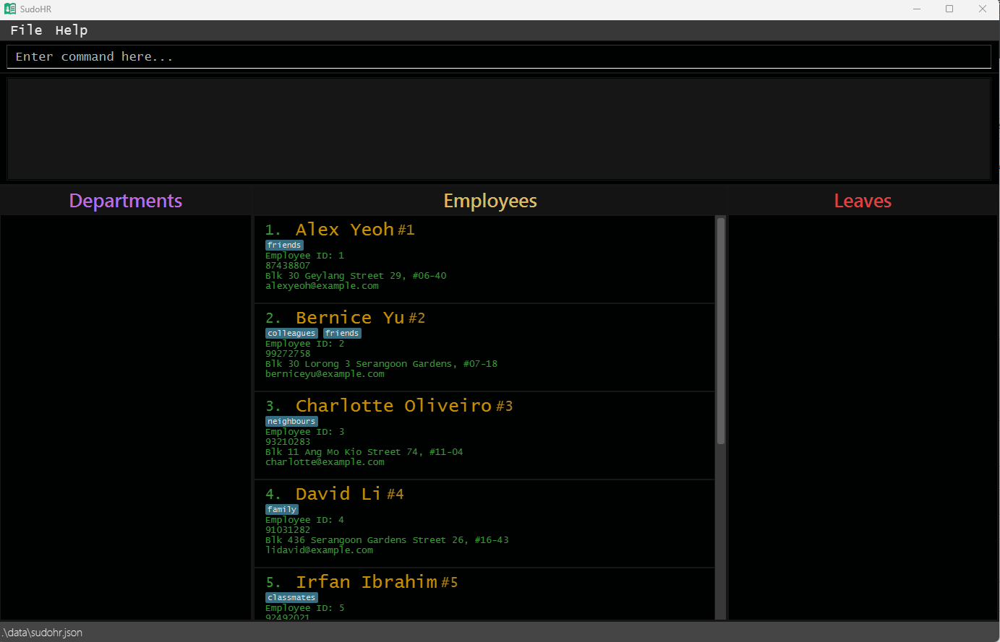

# 1. What is SudoHR?

SudoHR is a **desktop app specially catered for HR professionals in managing employees, departments and leaves data,
optimized for use via a Command Line Interface** (CLI) while still having the benefits of a Graphical User Interface
(GUI). If you can type fast, SudoHR can get your HR management tasks done faster than traditional GUI apps.

# 2. Table of Contents
Table of Contents
* TBC

[//]: # ({:toc})

--------------------------------------------------------------------------------------------------------------------

# 3. Features

There are 3 main data types in SudoHR:
* Employees
* Departments
* Leaves

SudoHR allows you to manage these components by:
1. Creating, updating, listing and deleting of the 3 data types.
2. Adding/Removing employees in departments/leaves.
3. Applying different filters on the data.

:exclamation: **WARNING:**
SudoHR can only hold up to 10,000 employees, 10,000 departments, 10,000 leaves
and 10,000 tags! Exceeding this limit will result in slower performance or unforeseen
problems.

--------------------------------------------------------------------------------------------------------------------

# 4. Quick start

1. Ensure you have Java `11` or above installed in your Computer.

1. Download the latest `sudohr.jar`.

1. Copy the file to the folder you want to use as the _home folder_ for your application.

1. Open a command terminal, `cd` into the folder you put the jar file in, and use the `java -jar sudohr.jar` command to run the application. 
   A GUI similar to the below should appear in a few seconds. Note how the app contains some sample data. 
   

1. Type the command in the command box and press Enter to execute it. e.g. typing **`help`** and pressing Enter will open the help window. 
   Some example commands you can try:

   * `exit` : Exits the app.

1. Refer to the [Features](#features) below for details of each command.

--------------------------------------------------------------------------------------------------------------------

# 5. Notations

[//]: # (Explain notations used in the UG)

You will see several types of annotations in the user guide:

:exclamation: **TIP:**
Good practices you can follow to enhance your experience using SudoHR.

:exclamation: **NOTE:**
Things to remember when using SudoHR so you don't get confused.

:exclamation: **WARNING:**
Important things to remember when using SudoHR that may cause problems.

 

--------------------------------------------------------------------------------------------------------------------

# 6. Quick Reference Guide

## 6.1. Layout

[//]: # (<-- Insert labelled UI here -->)
Our app interface consists of 5 main components:
1. Command line
2. Result display
3. Leave section
4. Employee section
5. Department section

### 6.1.1 Command line
The command line box located at the top of the application window serves to receive your typed inputs. 

To start typing a command, move your cursor over to the command line and click it.

### 6.1.2 Result display
Underneath the command line is the result display. This text box displays necessary information when executing
commands.

### 6.1.3 Departments
The leftmost panel is the Departments section. Here you can view what are is the status of the departments in your
company. The main data you can view on hand is the number of employees available.

### 6.1.4 Employees
Next to the Departments panel is the Employee section. This panel displays all the information regarding your 
employees. The information shown include the employee id, email, phone number, address, emails and tags given to the
employee

### 6.1.5 Leaves
The last panel on the right is the Leaves section. On this panel, you can view the dates in which employees have 
applied for leave. Each leave date would contain the number of employees who applied leaves on that day.

## 6.2. Key definitions

[//]: # (GENERAL FORMAT OF DATA TYPE DEFINITION:)

[//]: # (1. Explain big idea)
[//]: # (2. Explain fields)
[//]: # (3. Explain constraints)

### 6.2.1. Employee

An employee models a person in the company. Employees can be added to SudoHR to better 
track their data, involvement in the company, as well as easy retrieval of information.

An employee possesses the following attributes:
1. Employee ID
2. Name
3. Phone Number
4. Email Address
5. (Home) Address
6. [Optional] Tags

Employees are identified by their IDs. An employee's ID is a unique identification assigned by the company.
So, no two employees should share the same ID.

Similarly, email address and phone number are fields that are not intended for sharing. 
SudoHR enforces uniqueness for these two fields as well. However, do note that emails are case-sensitive.

You cannot add an employee that share any of the following fields with a different employee in SudoHR:
1. ID
2. Phone Number
3. Email Address

### 6.2.2. Department

A department is a group of employees. A department can have many employees and
an employee can be in many departments.

Every employee in a department must be unique.

The following attributes are stored for each department:
1. Department Name

Departments are unique by name and case-sensitive. You cannot add more than one
department of the same name.

### 6.2.3. Leave

[//]: # 
A leave represents a day on which an employee would be absent from the company. It is not possible for the employee to take more than 1 leave in a day.

The following attributes are stored for each leave:
1. Date

Each employee can only take a leave once per day. Leaves are unique by date.

### 6.2.4. Prefixes

[//]: # (Explain prefixes in the command and their corresponding placeholders)

Prefixes are delimiters to differentiate between different types of input.

**NOTE:**
There is currently no prefix for **KEYWORD** and **OLD_DEPARTMENT_NAME**.

| Prefix | Placeholder                |
|--------|----------------------------|
| id/    | ID                         |
| eid/   | EMPLOYEE_ID                |
| n/     | NAME   DEPARTMENT_NAME |
| p/     | PHONE_NUMBER               |
| e/     | EMAIL                      |
| a/     | ADDRESS                    |
| t/     | TAG                        |
| d/     | DATE                       |
| s/     | START_DATE                 |
| e/     | END_DATE                   |

### 6.2.5. Placeholders

[//]: # (Talk about their constraints, type, format, etc)

## 6.3. Command Format

[//]: # (Explain the general command format: command, prefixes, placeholders)

Commands are what you will work with in SudoHR, let's learn what a command is made of:

It consists of:
1. Command - Decides what your command will do and the arguments that it will accept.
2. Prefixes - They indicate what type of input to enter.
3. Placeholders - The actual data you input for the command.

[//]: # (## 6.4. Trying your first command)

[//]: # (<-- Insert example context here -->)

--------------------------------------------------------------------------------------------------------------------

# 7. Commands

## 7.1. Employee Commands

### 7.1.1. Adding an employee: `add`

Adds an employee to SudoHR.

Format: `add id/ID n/NAME p/PHONE_NUMBER e/EMAIL a/ADDRESS [t/TAG]…​`

:bulb: **TIP:**
An employee can have any number of tags (including 0)

Examples:
* `add id/132 n/John Doe p/98765432 e/johnd@example.com a/John street, block 123, #01-01`
* `add id/133 n/Betsy Crowe t/friend e/betsycrowe@example.com a/Newgate Prison p/1234567 t/criminal`

### 7.1.2. Listing all employees : `list`

Shows a list of all employees in SudoHR.

Format: `list`

### 7.1.3. Editing an employee : `edit`

Edits an existing employee in SudoHR.

Format: `edit eid/EMPLOYEE_ID [id/NEW_ID] [n/NAME] [p/PHONE] [e/EMAIL] [a/ADDRESS] [t/TAG]…​`

* Edits the employee identified by its employee ID. ID is the unique identifier for the employee. The employee must exist in SudoHR.
* At least one of the optional fields must be provided.
* Existing values will be updated to the input values.
* When an employee ID is edited, the employee will be identified by its new ID and another employee can assume the old ID.
* When editing tags, the existing tags of the employees will be removed i.e adding of tags is not cumulative.
* You can remove all the employee’s tags by typing `t/` without
    specifying any tags after it.
* The edit command can be applied on any employee in SudoHR regardless of current list view.

Examples:
* `edit eid/10 id/23 p/91234567 e/johndoe@example.com` Edits the ID, phone number and email address of the employee with ID 10 to
  `23`, `91234567`, and `johndoe@example.com` respectively.
* `edit eid/2 n/Betsy Crower t/` Edits the name of the employee with ID 2 to be `Betsy Crower` and clears all existing tags.

### 7.1.4. Find employees by name: `find`

Finds employees whose names contain any of the given keywords.

Format: `find KEYWORD [MORE_KEYWORDS]`

* The search is case-insensitive. e.g `hans` will match `Hans`
* The order of the keywords does not matter. e.g. `Hans Bo` will match `Bo Hans`
* Only the name is searched.
* Only full words will be matched e.g. `Han` will not match `Hans`
* Employees matching at least one keyword will be returned (i.e. `OR` search).
  e.g. `Hans Bo` will return `Hans Gruber`, `Bo Yang`

Examples:
* `find John` returns `john` and `John Doe`
* `find alex david` returns `Alex Yeoh`, `David Li` 
  

### 7.1.5. Find employees by ID: `feid`

Finds the employee who has the given ID.

Format: `feid eid/EMPLOYEE_ID`

Examples:
* `feid eid/100` returns Employee with ID 100.

### 7.1.6. Deleting an employee : `del`

Deletes the specified employee from SudoHR.

Format: `delete eid/EMPLOYEE_ID`

* Deletes the employee identified by its ID.
* ID is the unique identifier for the employee. The employee must exist in SudoHR.
* The delete command can be applied on any employee in SudoHR regardless of current list view.

Examples:
* `delete eid/777` Deletes the employee with employee ID 777.

## 7.2. Department Commands

### 7.2.1. Adding a department: `adep`

Adds a department by name.

Format: `adep n/DEPARTMENT_NAME`

**NOTE:**
As of now, a department only has a department name field. In the future, we plan to add other
department-level details such as manager, department start date, parent department, etc.

Examples:
* `adep n/Software Engineering`
* `adep n/Marketing`

### 7.2.2. Editing a department: `edep`

Edits an existing department.

Format: `edep OLD_DEPARTMENT_NAME n/NEW_DEPARTMENT_NAME`

Examples:
* `edep Software Engineering n/Software Development`
* `edep Marketing n/Sales`

### 7.2.3. Find departments by name: `fdep`

Finds departments whose names contain any of the given keywords.

Format: `fdep KEYWORD [MORE_KEYWORDS]`

* The search is case-insensitive. e.g `engineering` will match `Engineering`
* The order of the keywords does not matter. e.g. `Software Engineering` will match `Engineering Software`
* Only the name is searched.
* Only full words will be matched e.g. `Software` will not match `Softwares`
* Departments matching at least one keyword will be returned (i.e. `OR` search).
  e.g. `Software Engineering` will return `Software Development`, `Data Engineering`

Examples:
* `fdep Engineering` returns `Engineering` and `Software Engineering`
* `fdep software engineering` returns `Software Development`, `Data Engineering` 

### 7.2.4. Deleting a department: `ddep`

Deletes an existing department.

Format: `ddep n/DEPARTMENT_NAME`

Examples:
* `ddep n/Software Engineering`
* `ddep n/Sales`

### 7.2.5. Listing all departments: `ldep`

Lists all existing departments.

Format: `ldep`

### 7.2.6. Add employee to a department: `aetd`

Adds an employee to a department using his ID. After adding, the department window will show the department being added
to and the employee window will contain all the employees in that department.

Format: `aetd eid/EMPLOYEE_ID n/DEPARTMENT_NAME`

**NOTE:**
You cannot add an employee to a department twice.

Examples:
* `aetd eid/1 n/Software Engineering`
* `aetd eid/100 n/Sales`

### 7.2.7. Remove employee from a department: `refd`

Removes an employee from a department using his ID. After removing, the department window will show the department
being removed from and the employee window will contain all the employees in that department.

Format: `refd eid/EMPLOYEE_ID n/DEPARTMENT_NAME`

Examples:
* `refd eid/1 n/Software Engineering`
* `refd eid/100 n/Sales`

### 7.2.8. List an employee's departments: `led`

List all departments and employee is in.

Format: `led eid/EMPLOYEE_ID`

Examples:
* `leid eid/100`

### 7.2.9. List all employees in a department: `leid`

List all employees in a department.

Format: `leid n/DEPARTMENT_NAME`

Examples:
* `leid n/Software Engineering`
* `leid n/Sales`

### 7.2.10 List department headcount: `ldhc`

List all employees present in the given department on a given date. The department window will display only the given
department and the leave window will display only the given date.

Format: `ldhc n/DEPARTMENT_NAME [d/DATE]`
* If the date is not specified, employees present on the current date of inputting 
the command will be shown for the given department.
* The given date must not be before the current date of inputting the command and must be within one year 
of the current date of inputting the command. 

Examples:
* `ldhc n/Human Resources`
* `ldhc n/Engineering d/2023-03-30`

## 7.3. Leave Commands

### 7.3.1. Adding a leave: `aetl`

Adds a person's leave on a specifc day for SudoHr to track. The contact information of other employees taking leave on the same day will be displayed. The date on which the leave is added and its information will be displayed on the leave view.

Format: `aetl eid/EMPLOYEE_ID d/DATE`

**NOTE:**
The employee shouldn't have taken leave on the date provided

**NOTE:**
The input date must be of the form YYYY-MM-DD

Examples:
* `aetl eid/1 d/2023-03-05`
* `aetl eid/2 d/2023-03-05`

### 7.3.2. Adding all leaves in range : `aelr`

Adds an employee's leave from the start date to an end date inclusive for SudoHr to track. The end date can at most be 6 days away from the start date. The dates on which the leaves are added and their information will be displayed on the leave view.

Format: `aelr eid/EMPLOYEE_ID s/START_DATE e/END_DATE`

**NOTE:**
The start date must be before the end date.

**NOTE:**
The employee must not have taken leave in any of the days within the range provided.

**NOTE:**
The input start and end dates must be of the form YYYY-MM-DD

Examples:
* `aelr eid/1 s/2023-03-05 e/2023-03-08`
* `aelr eid/2 s/2023-03-05 e/2023-03-06`

### 7.3.3. Deleting a leave: `defl`
Delete a employee's leave on a specific date. The contact information of other employees taking leave on the same day will be displayed. The date on which the leave is removed and its information will be displayed on the leave view.

Format: `defl eid/EMPLOYEE_ID d/DATE`

**NOTE:**
The employee must have taken leave on the specific date provided

**NOTE:**
The input start and end dates must be of the form YYYY-MM-DD

### 7.3.4. Listing all employees on leave for a given date: `leol`

Lists all employees that are on leave on a given date.

Format: `leol d/DATE`

**NOTE:**
No employee information will be shown if no employees take leave on the specific day

Examples:
* `leol d/2023-03-05`
* `leol d/2023-03-08`

### 7.3.5. Listing all leave dates: `llve`

Displays all days where there are employees are on leave.

Format: `llve`

### 7.3.6. Listing all leaves taken by an employee: `llbe`

Lists all the leave date(s) of an employee.

Format: `llbe eid/EMPLOYEE_ID`

Examples:
* `llbe eid/1`

## 7.4. General Commands

### 7.4.1. Viewing help : `help`

Shows a message explaining how to access the help page for SudoHR.

Format: `help`

### 7.4.1. Refresh all lists : `sa`

Shows all employees, departments and leaves in SudoHR.

:bulb: **Tip:**
You can use this command to refresh SudoHR if your filters get too complicated!

Format: `sa`

### 7.4.2. Clearing all entries : `clear`

Clears all entries from SudoHR.

Format: `clear`

### 7.4.3. Exiting the program : `exit`

Exits the program.

Format: `exit`

## 7.5. Data Storage

### 7.5.1. Saving the data

SudoHR data are saved in the hard disk automatically after any command that changes the data. There is no need to save manually.

### 7.5.2 Editing the data file

SudoHR data are saved as a JSON file `[JAR file location]/data/sudohr.json`. Advanced users are welcome to update data directly by editing that data file.

:exclamation: **WARNING:**
If your changes to the data file makes its format invalid, SudoHR will discard all data and start with an empty data file at the next run.

## 7.6. Command summary

| Action                                                   | Format                                                                            |
|----------------------------------------------------------|-----------------------------------------------------------------------------------|
| **Add an employee**                                      | `add id/ID n/NAME p/PHONE_NUMBER e/EMAIL a/ADDRESS [t/TAG]…​`                     |
| **List all employees**                                   | `list`                                                                            |
| **Edit an employee**                                     | `edit eid/EMPLOYEE_ID [id/ID] [n/NAME] [p/PHONE] [e/EMAIL] [a/ADDRESS] [t/TAG]…​` |
| **Find employee by name**                                | `find KEYWORD [MORE_KEYWORDS]`                                                    |
| **Find employee by ID**                                  | `feid eid/EMPLOYEE_ID`                                                            |
| **Delete an employee**                                   | `del eid/EMPLOYEE_ID`                                                             |
| **Add a department**                                     | `adep n/DEPARTMENT_NAME`                                                          |
| **List all departments**                                 | `ldep`                                                                            |
| **Edit a department**                                    | `edep OLD_DEPARTMENT_NAME n/NEW_DEPARTMENT_NAME`                                  |
| **Find department by name**                              | `fdep KEYWORD [MORE_KEYWORDS]`                                                    |
| **Delete a department**                                  | `ddep n/DEPARTMENT_NAME`                                                          |
| **Add employee to department**                           | `aetd eid/EMPLOYEE_ID n/DEPARTMENT_NAME`                                          |
| **Remove employee from department**                      | `refd eid/EMPLOYEE_ID n/DEPARTMENT_NAME`                                          |
| **List an employee's department**                        | `led eid/EMPLOYEE_ID`                                                             |
| **List all employees in a department**                   | `leid n/DEPARTMENT_NAME`                                                          |  
| **List department headcount**                            | `ldhc n/DEPARTMENT_NAME [d/DATE]`                                                 |  
| **Add employee to leave**                                | `aetl eid/EMPLOYEE_ID d/DATE`                                                     |
| **Add employee to range of leaves**                      | `aelr eid/EMPLOYEE_ID s/START_DATE e/END_DATE`                                    |
| **Remove an employee from leave**                        | `defl eid/EMPLOYEE_ID d/DATE`                                                     |
| **Listing all employees on leave for a given date**      | `leol d/DATE`                                                                     |
| **Listing all days where employees are on leave**        | `llve`                                                                            |
| **Get help for SudoHR**                                  | `help`                                                                            |
| **Show all employees, departments and leaves in SudoHR** | `sa`                                                                              |
| **Clear all entries in SudoHR**                          | `clear`                                                                           |
| **Exit SudoHR**                                          | `exit`                                                                            |

[//]: # (Andre, Jer En, Kwang Joo, please add accordingly)

--------------------------------------------------------------------------------------------------------------------

## 8. FAQ

**Q**: How do I transfer my data to another Computer? 
**A**: Install the app in the other computer and overwrite the empty data file it creates with the file that contains the data of your previous SudoHR home folder.

[//]: # (Please add anything you think might be helpful)

[//]: # (## 9. Acknowledgements)

[//]: # (To be added before Week 13)

[//]: # (## 10. Glossary)

[//]: # (To be added before Week 13)
