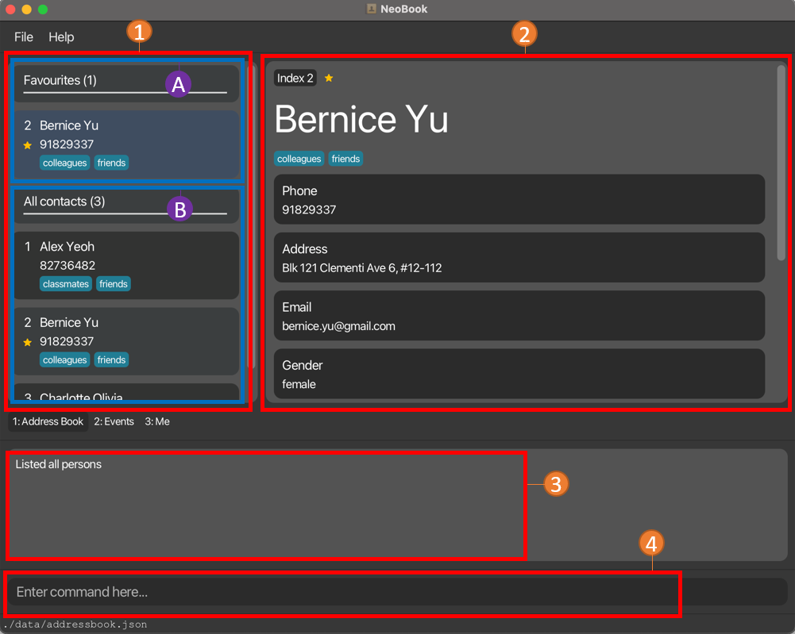
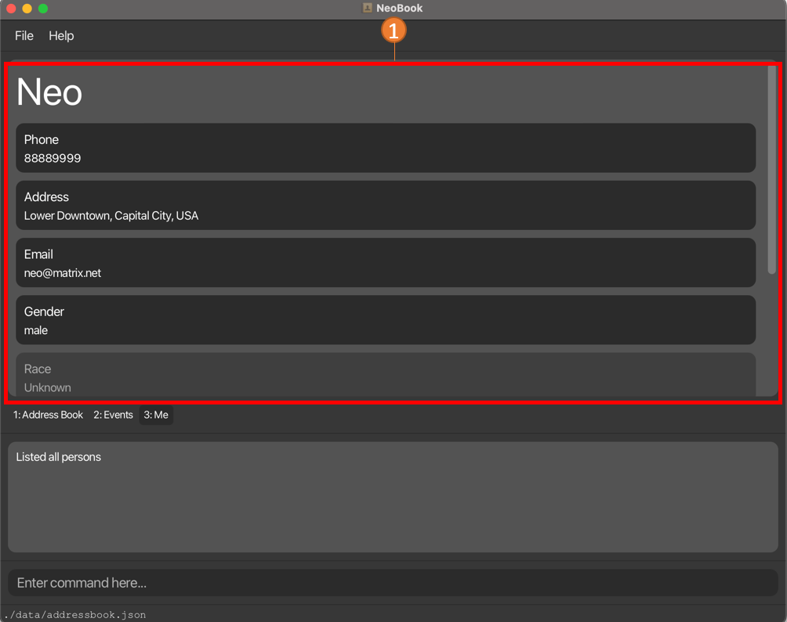

NeoBook is a **desktop app for managing contacts, optimized for use via a Command Line Interface** (CLI) while still having the benefits of a Graphical User Interface (GUI). If you can type fast, it can get your contact management tasks done faster than traditional GUI apps.

Apart from being your all-encompassing address book, NeoBook also has an Events function for you to keep track of your daily schedule.

# Table Of Contents
* Table of Contents
{:toc}

# Getting started

1. Ensure you have Java `11` or above installed in your Computer.

2. Download the latest `neobook.jar` from [here](https://github.com/AY2223S2-CS2103T-F12-3/tp/releases).

3. Copy the file to the folder you want to use as the _home folder_ for your NeoBook.

4. Open a command terminal, `cd` into the folder you put the jar file in, and use the `java -jar neobook.jar` command to run the application. 
   A GUI similar to the below should appear in a few seconds. Note how the app contains some sample data. 
   

5. Type the command in the command box and press Enter to execute it. e.g. typing **`help`** and pressing Enter will open the help window. 
   Some example commands you can try:

   * `list` : Lists all contacts.

   * `add n/John Doe p/98765432 e/johnd@example.com a/John street, block 123, #01-01` : Adds a contact named `John Doe` to the Address Book.

   * `delete 3` : Deletes the 3rd contact shown in the current list.

   *  `edit 3 n/pierce` : Edits the 3rd contact's name on the current list to pierce

   * `clear` : Deletes all contacts.

   * `exit` : Exits the app.

6. Refer to the [NeoBook Features](#neobook-features) below for details of each command.

[Back To Contents](#table-of-contents)

## User Interface

### UI Breakdown For `Tabs`
Use these tabs to toggle between the NeoBook, Events and your own information!

____________________________________________________________________________________________________________________

### UI Breakdown For `NeoBook`

1. Current Displayed List
   * Show contacts based on command parameters
   * Contains the `index` you should use to refer to each contact
   * A : Contains favorite contacts for easy access
   * B : Contains all contacts
2. Information Of Specific Contact
   * Displays all the saved information related to contact
   * Toggle between different contacts by _clicking on them in the displayed list_ or using the [select command](#select-contact-to-expand-details--select)
3. Command Results:
   * Displays the result of input command
4. Command Line:
   * Type command and press enter to execute it
   * Refer to the [NeoBook Features](#neobook-features) below for possible commands to execute

____________________________________________________________________________________________________________________

### UI Breakdown For `Events`

1. Events Display
   * Displays all events you have saved and their respective details
2. Command Results:
   * Displays the result of input command
3. Command Line
   * Type a command and press enter to execute it
   * Refer to the [Events Features](#events-features) below for possible commands to execute

____________________________________________________________________________________________________________________

### UI Breakdown For `Me`

1. Display
    * Contains your personal details

[Back To Contents](#table-of-contents)

## NeoBook Features

####  :information_source: Notes about the command format: 

* Words in `UPPER_CASE` are the parameters to be supplied by the user. 
  e.g. in `add n/NAME`, `NAME` is a parameter which can be used as `add n/John Doe`.

* Items in square brackets are optional. 
  e.g `n/NAME [t/TAG]` can be used as `n/John Doe t/friend` or as `n/John Doe`.

* Items with `…`​ after them can be used multiple times including zero times. 
  e.g. `t/TAG…​` means that we can exclude the tag prefix completely or use it as `t/friend`, `t/friend t/family` etc.

* Parameters can be in any order. 
  e.g. if the command specifies `n/NAME p/PHONE_NUMBER`, `p/PHONE_NUMBER n/NAME` is also acceptable.

* If a parameter, which isn't a FieldGroup, is expected only once in the command but you specified it multiple times, only the last occurrence of the parameter will be taken. 
  e.g. Since Phone is just a normal field, if you specify `p/12341234 p/56785678`, only `p/56785678` will be taken. 
  e.g. Since Modules is a FieldGroup, if you specify `mt/CS1231S mt/CS2040S`, all will be taken unlike the previous example.

* Extraneous parameters for commands that do not take in parameters (such as `help`, `list`, `exit` and `clear`) will be ignored. 
  e.g. if the command specifies `help 123`, it will be interpreted as `help`.

____________________________________________________________________________________________________________________

### Viewing Help : `help`

Don't know how to get started? Don't worry!

Simply use this command to get access to our help page!

#### Syntax

`help`

####  Description
Use this command when you need help!

####  Image

1. Links to the user guide you are reading right now!
2. A list of all commands and their example usages.

[Back To Contents](#table-of-contents)

____________________________________________________________________________________________________________________

### Adding A New Contact : `add`

Met a new friend?

Use this command to add him/her to your NeoBook.

#### Syntax

`add n/NAME PREFIX/PARAMETER...`

#### Description
Here are all the prefixes that can be used:

| Prefix | Name of Field                   | Optional? |
|--------|---------------------------------|-----------|
| n      | Name                            | No        |
| e      | Email address                   | Yes       |
| p      | Phone Number                    | Yes       |
| a      | Address                         | Yes       |
| m      | Major                           | Yes       |
| mt     | Mods Taken                      | Yes       |
| f      | Faculty                         | Yes       |
| g      | Gender                          | Yes       |
| r      | Race                            | Yes       |
| t      | Tags                            | Yes       |
| c      | Preferred Communication Channel | Yes       |

:bulb: **Tip:**
A person can have any number of tags and modules taken (including 0).

IMPT: If you want to add multiple tags or modules in one statement,
every tag or module has to have its corresponding prefix.

Only modules that are a part of NUS' mod systems will be allowed. This is
to prevent any messiness and also allows for future syncing with NUSMods.

#### Example Usages
* `add n/John Doe p/98765432 e/johnd@example.com a/John street, block 123, #01-01`
* `add n/Betsy Crowe t/friend e/betsycrowe@example.com mt/CS2030s mt/CS2103T`

#### Extra Notes

* If said contact identifies himself as a gender that is two words or is hyphenated like "non-binary", you can save his `Gender` as `nonbinary`.

[Back To Contents](#table-of-contents)

____________________________________________________________________________________________________________________

### Listing All Contacts : `list`

Want to see all your contacts?

Use this command to gain access to all of them!

#### Syntax

`list`

[Back To Contents](#table-of-contents)

____________________________________________________________________________________________________________________

### Favourite A Contact : `fav`

Contact someone very frequently?

Use this command to favourite it so that you have easy access to it!

#### Syntax

`fav INDEX`

#### Description

`INDEX` refers to the index of the contact you wish to favourite in the current displayed list.

#### Important Requirements
`INDEX` must be a **positive integer** (must be greater than 0).

#### Example Image
Here's how NeoBook would look like after you favourite a contact!

1. The contact will appear in the `Favourites` section.
2. A :star: will appear next to the index in the detail panel.

[Back To Contents](#table-of-contents)

____________________________________________________________________________________________________________________

### Unfavourite A Contact : `unfav`

No longer contact someone as frequently as you used to?

Use this command to unfavourite it!

#### Syntax
`unfav INDEX`

#### Description
`INDEX` refers to the index of the contact you wish to unfavorite in the current displayed list.

#### Important Requirements

`INDEX` must be a **positive integer** and (must be greater than 0).

[Back To Contents](#table-of-contents)

____________________________________________________________________________________________________________________

### Editing a contact's details : `edit`

Learnt something new about your friend? Or perhaps he/she changed a particular detail?

Use this command to edit his/her details easily!

#### Syntax

`edit INDEX PREFIX/PARAMETER...`

#### Description

`INDEX` refers to the index of the contact you wish to edit in the current displayed list.

For the following fields, they are considered a `FieldGroup`.
* Modules
* Tags

A `FieldGroup` can contain many parameters in that single field.
When using edit, the command looks for each parameter in the `FieldGroup`:
* If the parameter already exists in the `FieldGroup` it will be removed.
* Otherwise, the parameter will be added into the `FieldGroup`.

#### Important requirements

`INDEX` must be a **positive integer** (must be greater than 0).

All the fields are optional. However, at least one field must be provided.

####  Examples Usages
The first contact has `CS2103T`, `MA2001` and `GEA1000` as its modules.
* `edit 1 mt/CS2103T` removes CS2103T from the Modules field since it is already a part of its Modules field.
* So the first contact in your Neobook will have `MA2001` and `GEA1000` as its only modules
 

The second contact has the following tags `Friend`, `Amazing Coder`
* `edit 2 t/10x Coder t/Intern Friend` adds both `10x Coder` and `Intern Friend` as tags to the contact as neither existed in its Tags field.
* So the second contact in your NeoBook would have `Friend`, `Amazing Coder`, `10x Coder` and `Intern Friend` in its Tags field.

| Prefix | Name of Field                   | Optional? |
|--------|---------------------------------|-----------|
| n      | Name                            | Yes       |
| e      | Email address                   | Yes       |
| p      | Phone Number                    | Yes       |
| a      | Address                         | Yes       |
| m      | Major                           | Yes       |
| mt     | Mods Taken                      | Yes       |
| f      | Faculty                         | Yes       |
| g      | Gender                          | Yes       |
| r      | Race                            | Yes       |
| t      | Tags                            | Yes       |
| c      | Preferred Communication Channel | Yes       |

#### Example Usages:
*  `edit 1 p/91234567 e/johndoe@example.com` Edits the phone number and email address of the 1st person to be `91234567` and `johndoe@example.com` respectively.
*  `edit 2 n/Betsy Crower t/Marine` Edits the name of the 2nd person to be `Betsy Crower` and adds the tag `Marine` if it does not yet exist. If the tag `Marine` already exists on the contact, then it will be removed.

#### Extra Notes

* If said contact identifies himself as a gender that is two words or is hyphenated like "non-binary", you can save his `Gender` as `nonbinary`.

[Back To Contents](#table-of-contents)

____________________________________________________________________________________________________________________

### Finding Particular Contacts : `find`

Want to narrow down your displayed contacts to a certain few?

Use this command to find contacts by specifying the fields and corresponding keywords you wish to search!

#### Syntax

`find PREFIX/KEYWORD...`

#### Description

:bulb: **Tip:**

`KEYWORD` can contain more than 1 word.

E.g `find n/Peter James`

| Prefix | Name of Field                   | Optional? |
|--------|---------------------------------|-----------|
| n      | Name                            | Yes       |
| e      | Email address                   | Yes       |
| p      | Phone Number                    | Yes       |
| a      | Address                         | Yes       |
| m      | Major                           | Yes       |
| mt     | Mods Taken                      | Yes       |
| f      | Faculty                         | Yes       |
| g      | Gender                          | Yes       |
| r      | Race                            | Yes       |
| t      | Tags                            | Yes       |
| c      | Preferred Communication Channel | Yes       |

Above are all the prefixes you can use to find a Contact according to their fields.

####  Important Requirements
1. At least 1 field and corresponding keyword must be specified.
   * i.e `find PREFIX/KEYWORD`

2. The keywords are case-insensitive.
   * i.e. `find n/Abigail` can return people with names of 'Abigail', 'aBiGail', 'abigail', 'ABIGAIL'.

3. If multiple same prefixes are specified, as long as one of the keyword is contained
in the corresponding field, the person will be returned.
   * i.e. `find n/John n/Peter James`
     * Keywords: `john`, `peter james`
         * Can return:
           * People with names of 'John', 'Peter James', 'Peter James John'
         * Cannot return:
           * A person with name of 'Peter'

4. All unique prefixes specified must be contained within the corresponding fields of the person
 for that person to be returned.
   * i.e. `find n/Caleb p/9123`
     * Can return: 
       * A person with a name of 'Caleb' who has a phone number of '91234567'
     * Cannot return:
       * A person whose name is 'Caleb' but has a phone number of '98765432'
       * A person whose name is 'Joshua' even though his phone number is '91234567'
5. At least one field must be provided.

[Back To Contents](#table-of-contents)

____________________________________________________________________________________________________________________

### Select contact to expand details : `select`

Want to see more details about a certain contact in your list?

Use this command to expand and view more information about the selected contact.

#### Syntax

`select INDEX`

#### Description
* `INDEX` refers to the index of the contact you wish to view more information on.

#### Important requirements

* `INDEX` must be a **positive integer** (must be greater than 0).

#### Example Usages
* `select 1` expands the details of the first contact in your list.
* `select 4` expands the details of the fourth contact in your list.

[Back To Contents](#table-of-contents)

____________________________________________________________________________________________________________________

### Deleting A Contact : `delete`

No longer interact with someone in your contacts?

Use this command to delete the specified contact from your NeoBook.

#### Syntax

`delete INDEX`

#### Description
`INDEX` refers to the index of the contact you wish to delete in the current displayed list.

#### Important Requirements

`INDEX` must be a **positive integer** and (must be greater than 0).

#### Example Usages
* `list` followed by `delete 2` deletes the 2nd person in the displayed list.
* `find Betsy` followed by `delete 1` deletes the 1st person in the results of the `find` command.

[Back To Contents](#table-of-contents)

____________________________________________________________________________________________________________________

### Clearing all contacts : `clear`

Want to start from a clean slate?

Simply use this command to clear all contacts from your NeoBook.

#### Syntax

`clear`

[Back To Contents](#table-of-contents)

____________________________________________________________________________________________________________________

### Exiting NeoBook : `exit`

Finished what you needed to do?

Use this command to exit the application!

#### Syntax

`exit`

[Back To Contents](#table-of-contents)

____________________________________________________________________________________________________________________

### NeoBook Command Summary

| Action       | Format, Examples                                                                                                                                 |
|--------------|--------------------------------------------------------------------------------------------------------------------------------------------------|
| **Add**      | `add n/NAME [PREFIX/PARAMETERS]…​`   e.g., `add n/James Ho p/22224444 e/jamesho@example.com a/123, Clementi Rd, 1234665 t/friend t/colleague` |
| **Clear**    | `clear`                                                                                                                                          |
| **Delete**   | `delete INDEX`  e.g., `delete 3`                                                                                                              |
| **Edit**     | `edit INDEX [PREFIX/PARAMETERS]…​`  e.g.,`edit 2 n/James Lee e/jameslee@example.com`                                                          |
| **Fav**      | `fav INDEX`  e.g., `fav 2`                                                                                                                    |
| **Unfav**    | `unfav INDEX`  e.g., `unfav 2`                                                                                                                |
| **Find**     | `find [PREFIX/PARAMETERS]…`  e.g., `find n/James Jake mt/CS2103T a/Serangon Central`                                                          |
| **Select**   | `select INDEX`   e.g., `select 2`                                                                                                             |
| **List**     | `list`                                                                                                                                           |
| **Help**     | `help`                                                                                                                                           |
| **Exit**     | `exit`                                                                                                                                           |

[Back To Contents](#table-of-contents)

## Events Features

____________________________________________________________________________________________________________________

####  :information_source: Notes about the command format: 

Events have 4 components to them
- Description
- StartDateTime
- EndDateTime
- Recurrence

Events will auto-update to their next earliest occurrence for recurring events and will be automatically grayed out once the event has been passed.

In the case where an event is supposed to be greyed out (i.e. the time is 2359 and the event is set to end at 2358 on the same day), then inputting any command will update the event to grey.

____________________________________________________________________________________________________________________

### Adding an Event : `addevent`

Want to keep track of current events?

Use this command to add events into your Event Section of your NeoBook.

#### Syntax

`addevent d/DESCRIPTION OF EVENT s/START DATE & START TIME e/END DATE & END TIME [r/INTERVAL OF RECURRENCE]`

#### Description

| Prefix   | Name of Field                 | Optional? |
|----------|-------------------------------|-----------|
| d        | Description of Event          | No        |
| s        | Start Date and Time of Event  | No        |
| e        | End Date and Time of Event    | No        |
| r        | Recurrence Interval           | Yes       |

You can add 2 types of Events:
1. One Time Events
2. Recurring Events (of various Intervals):
    * Daily Events
    * Weekly Events
    * Monthly Events
    * Yearly Events

You can specify the Recurrence Intervals within the Command as well!

Accepted Intervals:
1. None
2. Daily
3. Weekly
4. Monthly
5. Yearly

#### Important requirements

1) `START DATE & START TIME` and `END DATE & END TIME` must follow this formatting YYYY-MM-DD HHMM.
    * `START TIME` and `END TIME` follows the 24-Hour Clock format e.g. instead of 6:00pm, you must enter 1800.
    * `START DATE & START TIME` must be before `END DATE & END TIME`
    * If the year is not a Leap Year, inputting `29-02-YYYY` will get bumped down to `28-02-YYYY` for both `START DATE` and `END DATE`
    * If the month has only 30 days, inputting `31-MM-YYYY` will get bumped down to `30-MM-YYYY` for both `START DATE` and `END DATE`
    * `2400` is also accepted as an input for `START TIME` and `END TIME`, this will roll the date input by the user to the next day
        e.g. Inputting `2023-03-10 2400` will be accepted and will be rolled over to `2023-03-11 0000` instead.
2) `INTERVAL OF RECURRENCE` doesn't need to be specified to add an event
    * If unspecified, Event will be automatically added as a `One Time Event`.

#### Example Usages
* `addevent d/CS2103T Lecture s/2023-03-30 1600 e/2023-03-30 1800 r/weekly` will add a Weekly Recurring Event of CS2103T Lecture that occurs from 1600 to 1800, starting on 2023-03-30.
* `addevent d/Catchup with John s/2023-03-30 1600 e/2023-03-30 1800 r/None` will add a One Time Event of Catchup with John that occurs from 1600 to 1800, on 2023-03-30.
* `addevent d/Dinner with Family s/2023-03-30 1600 e/2023-03-30 1800` will add a One Time Event of Dinner with Family that occurs from 1600 to 1800, on 2023-03-30.

[Back To Contents](#table-of-contents)

____________________________________________________________________________________________________________________

### Deleting An Event : `delevent`

You no longer need to track this particular event?

Use this command to delete the specified event from your NeoBook.

#### Syntax

`delevent INDEX`

#### Description
`INDEX` refers to the index of the Event you wish to delete in the current displayed Events List.

#### Important requirements
`INDEX` must be a **positive integer** (must be greater than 0).

#### Example Usage
* `delevent 2` deletes the event tagged to Index 2 in your NeoBook's Event List.

[Back To Contents](#table-of-contents)

____________________________________________________________________________________________________________________

### Editing An Event : `editevent`

Want to change the details of a particular event?

Use this command to edit the specified event in your NeoBook.

#### Syntax

`editevent INDEX PREFIX/PARAMETER...`

#### Description
`INDEX` refers to the index of the event you wish to edit in the current displayed list.

| Prefix | Name of Field                 | Optional? |
|--------|-------------------------------|-----------|
| d      | Description of Event          | Yes       |
| s      | Start Date and Time of Event  | Yes       |
| e      | End Date and Time of Event    | Yes       |
| r      | Recurrence Interval           | Yes       |

#### Important requirements

`INDEX` must be a **positive integer** (must be greater than 0).

#### Extra Notes
* If the year is not a Leap Year, inputting `29-02-YYYY` will get bumped down to `28-02-YYYY` for both `START DATE` and `END DATE`
* If the month has only 30 days, inputting `31-MM-YYYY` will get bumped down to `30-MM-YYYY` for both `START DATE` and `END DATE`
* `2400` is also accepted as an input for `START TIME` and `END TIME`, this will roll the date input by the user to the next day
    e.g. Inputting `2023-03-10 2400` will be accepted and will be rolled over to `2023-03-11 0000` instead. 
* At least one field must be provided.

#### Example Usages
*  `editevent 1 d/read book r/weekly` Edits the description and recurrence of the 1st event to be `read book` and `weekly` respectively.
*  `editevent 2 s/2023-01-01 1800 e/2023-01-02 2000` Edits the start date and end date of the 1st and 2nd event to be `20203-01-01 1800` and `2023-01-02 2000` respectively.

[Back To Contents](#table-of-contents)

____________________________________________________________________________________________________________________

### Tagging Contacts to an Event : `tagpersonevent`

Want to remember who was a part of a certain event? 

Tag their contacts
to the event using this command!

#### Syntax

`tagpersonevent et/EVENT INDEX pt/NAME`

#### Description
The EVENT INDEX is the index of the event you want to tag the person to.

NAME is the name of the person you want to tag to the event.

#### Important requirements
1) NAME is **case_sensitive**.
2) NAME must be the name of a contact already registered in NeoBook.

#### Example Usages
* Suppose you have an Event at `INDEX 3` with `DESCRIPTION: Hackathon Meeting`, `START DATE & TIME: 2023-05-04 1400`,
`END DATE & TIME: 2023-05-04 1600`, `RECURRENCE INTERVAL: WEEKLY` 

`tagpersonevent et/4 pt/Baljeet FF` Tags Baljeet FF to this Weekly Hackathon Meeting.

#### For more advanced users
* Be careful when directly editing the tagged contacts in `userdata.json`.
It may cause the person to become unlinked from the event completely.

[Back To Contents](#table-of-contents)

____________________________________________________________________________________________________________________

### Untagging Contacts from an Event : `untagpersonevent`

Want to remove somebody who was a part of a certain event?

Untag their contacts from the event using this command!

#### Syntax

`untagpersonevent et/EVENT INDEX pt/NAME`

#### Description
The EVENT INDEX is the index of the event you want to tag the person to. 

NAME is the name of the person you want to untag from the event.
#### Important requirements
1) NAME is **case_sensitive**.
2) NAME must be the name of a contact already registered in NeoBook and
tagged to that event.

Examples:
* Suppose you have an Event at `INDEX 3` with `DESCRIPTION: Hackathon Meeting`, `START DATE & TIME: 2023-05-04 1400`,
  `END DATE & TIME: 2023-05-04 1600`, `RECURRENCE INTERVAL: WEEKLY` and `Baljeet FF` tagged to this Event.

`untagpersonevent et/4 pt/Baljeet FF` untags Baljeet FF from this Weekly Hackathon Meeting.

#### For more advanced users
* Be careful when directly editing the tagged contacts in `userdata.json`.
  It may cause the person to become unlinked from the event completely.

[Back To Contents](#table-of-contents)

### Events Command Summary

| Action                     | Format, Examples                                                                                                                                                                                |
|----------------------------|-------------------------------------------------------------------------------------------------------------------------------------------------------------------------------------------------|
| **Add Event**              | `addevent d/DESCRIPTION OF EVENT s/START DATE & START TIME e/END DATE & END TIME r/INTERVAL OF RECURRENCE`   e.g., `addevent d/CS2103T Lecture s/2023-03-30 1600 e/2023-03-30 1800 r/weekly` |   
| **Delete Event**           | `delevent INDEX`   e,g., `delevent 1`                                                                                                                                                       |
| **Edit Event**             | `editevent INDEX PREFIX/PARAMETER...`   e.g.,`editevent 1 d/read book e/weekly`                                                                                                              |
| **Tag Contact to Event**   | `tagpersonevent et/EVENT_INDEX pt/NAME`   e.g., `tagpersonevent et/1 pt/John`                                                                                                                |
| **Untag Contact to Event** | `untagpersonevent et/EVENT_INDEX pt/NAME`   e.g.,`untagpersonevent et/1 pt/John`                                                                                                             |
[Back To Contents](#table-of-contents)

## User Features

____________________________________________________________________________________________________________________

### Introduction

The user features are reflected under the 'Me' tab (tab 3).

Here, you can edit personal information about yourself, the user, which can be used in future features to streamline contact exchanging.

____________________________________________________________________________________________________________________

### Editing the details of the user : `edituser`

Want to change one of your own details, perhaps something was out of date?

Use this command to edit your details easily!

#### Syntax

`edituser PREFIX/PARAMETER...`

#### Description

For the following fields, they are considered a `FieldGroup`.
* Modules
* Tags

A `FieldGroup` can contain many parameters in that single field.
When using edit, the command looks for each parameter in the `FieldGroup`:
* If the parameter already exists in the `FieldGroup` it will be removed.
* Otherwise, the parameter will be added into the `FieldGroup`.
    * e.g. `edituser mt/CS2103T` removes CS2103T from the Modules field of a contact if it already exists and adds it if it does not.
    * e.g. `edituser t/10x Coder t/Intern Friend`
        * For a contact with none of the above tags, both `10x Coder` and `Intern Friend` will be added as tags
        * For a contact which has `10x Coder` as a tag, he will have the `10x Coder` removed and `Intern Friend` added as a tag.

| Prefix | Name of Field                   | Optional? |
|--------|---------------------------------|-----------|
| n      | Name                            | Yes       |
| e      | Email address                   | Yes       |
| p      | Phone Number                    | Yes       |
| a      | Address                         | Yes       |
| m      | Major                           | Yes       |
| mt     | Mods Taken                      | Yes       |
| f      | Faculty                         | Yes       |
| g      | Gender                          | Yes       |
| r      | Race                            | Yes       |
| t      | Tags                            | Yes       |
| c      | Preferred Communication Channel | Yes       |

#### Important requirements

* At least one field must be provided.

#### Example Usages
* `edituser p/91234567 e/johndoe@example.com` Edits the user's phone number and email address to be `91234567` and `johndoe@example.com` respectively.
* `edituser n/Betsy Crower t/Marine` Edits the user's name to be `Betsy Crower` and add the tag `Marine` if it has not already been tagged to the user. If it has already been tagged, then it will instead remove the tag.

#### Extra Notes
* Tags are not shown for the user because it is not relevant. However, you can still see them in the command results.

[Back To Contents](#table-of-contents)

____________________________________________________________________________________________________________________

### User Command Summary

| Action       | Format, Examples                                                                        |
|--------------|-----------------------------------------------------------------------------------------|
| **EditUser** | `edituser [PREFIX/PARAMETERS]…​`  e.g.,`edituser n/James Lee e/jameslee@example.com` |

[Back To Contents](#table-of-contents)

## UI Features

____________________________________________________________________________________________________________________

### Switching between tabs : `tab`

Looking for a faster way to switch between NeoBook and the Events?

Use this command to navigate to the specified tab.

#### Syntax

`tab INDEX`

#### Description
* `INDEX` refers to the index of the tab to navigate to, shown before the name in the tab.

#### Important requirements
* `INDEX` must be 1, 2, or 3.
* `tab` refers to the literal word to be typed into the command line, not the key on your keyboard.

#### Example Usage
* `tab 1` switches to the Address Book tab.
* `tab 2` switches to the Events tab.

____________________________________________________________________________________________________________________

### Light Mode : `light`

Want to use a brighter version of our UI?

Use Light mode!

#### Syntax

`light`

____________________________________________________________________________________________________________________

### Dark Mode : `dark`

Want to use a darker version of our UI?

Use Dark mode!

#### Syntax

`dark`

[Back To Contents](#table-of-contents)

## Data

### Saving the data

NeoBook data are saved in the hard disk automatically after any command that changes the data. There is no need for you to save manually.

### Editing the data file

NeoBook data are saved as JSON files. Two of which will be of interest to you:
- `[JAR file location]/data/addressbook.json`.
- `[JAR file location]/data/userdata.json`.

You are welcome to update the data directly by editing that data file.
However, be careful when directly editing the tagged contacts in `userdata.json`. It may cause the person to become unlinked from the event completely.

:exclamation: **Caution:**
If you edit the taggedPerson in User data, beware that you may end up unlinking the person from any changes to the original contact in NeoBook

:exclamation: **Caution:**
If your changes to the data file makes its format invalid, NeoBook will discard all data and start with an empty data file at the next run.

[Back To Contents](#table-of-contents)

## FAQ

**Q**: How do I transfer my data to another Computer? 
**A**: Install the app in the other computer and overwrite the empty data file it creates with the file that contains the data of your previous NeoBook home folder.

**Q**: My NeoBook doesn't seem to be showing up on my screen upon load. What should I do? 
**A**: If everything is working fine (i.e. no crashes are happening and the app starts up properly), then a likely cause is that you were using a second screen. NeoBook automatically saves its last position in your screen and starts up in that same position. If you were using NeoBook on a second screen and aren't using a second screen now, the problem is likely due to you closing NeoBook at a position on the second screen. This will lead to NeoBook opening at the same position as before, but off your screen where you can't interact with it. To remedy this, go to the `preferences.json` file in NeoBook and change `windowCoordinates` to something that is within your first screen. (Typically `x:50` and `y:50` works fine).

[Back To Contents](#table-of-contents)

## Future Plans
1. Making the following fields accept multiple parameters instead of just one. 
   1. Since the groundwork was completed in the Tags and Modules fields, we considered it trivial to implement the rest of these fields to accept multiple parameters.
      - Phone
      - Address    
      - Email
      - Race
      - Communication Channels
      - Major
      - Faculty
2. Adding better input validation to Phone, Email and Address fields, such as minimum lengths or certain formats.
3. Adding duplicate names support, which is available in most contact lists.
4. Making the user's events be able to import other contact's events.
   1. Since the User is a form of Contact, it is once again trivial to extend the same functionality to other contacts
5. Making NeoBook accept more symbols and emojis.
   1. Currently, the validation regex for all the fields for contacts do not accept special symbols (and also do not render them properly). In the future, we will attempt to add-in support for this.
6. Switching to the relevant tab when a command is executed.
   1. Using commands for contacts in the events tab and vice versa may not show any visible changes, causing confusion in whether the user did anything.
   2. Certain commands should bring the user to the relevant tab, if they are not currently in said tab (e.g. `list` should navigate to the contacts tab).
7. Enhancing the `select` command to accept parameters beyond just the index of the contact.
   1. User cannot see the indices of contacts further down the list, and needs to scroll.
   2. The `select` command can integrate `find` functionality.
8. Splitting the description field of events into title and description fields, so as not to clutter the UI with long descriptions.

[Back To Contents](#table-of-contents)
