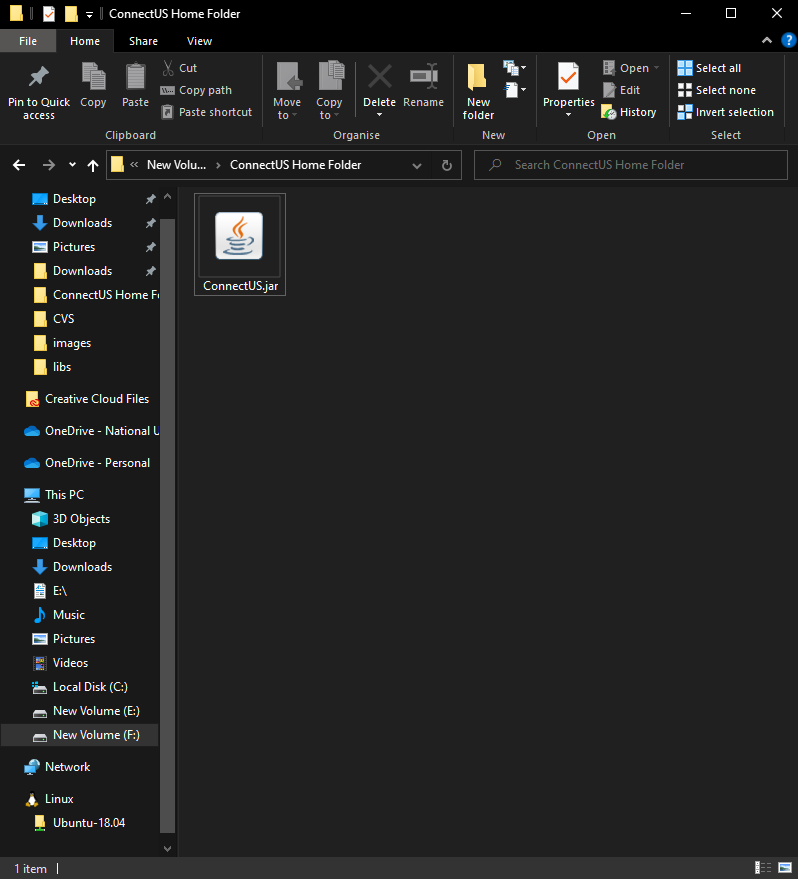
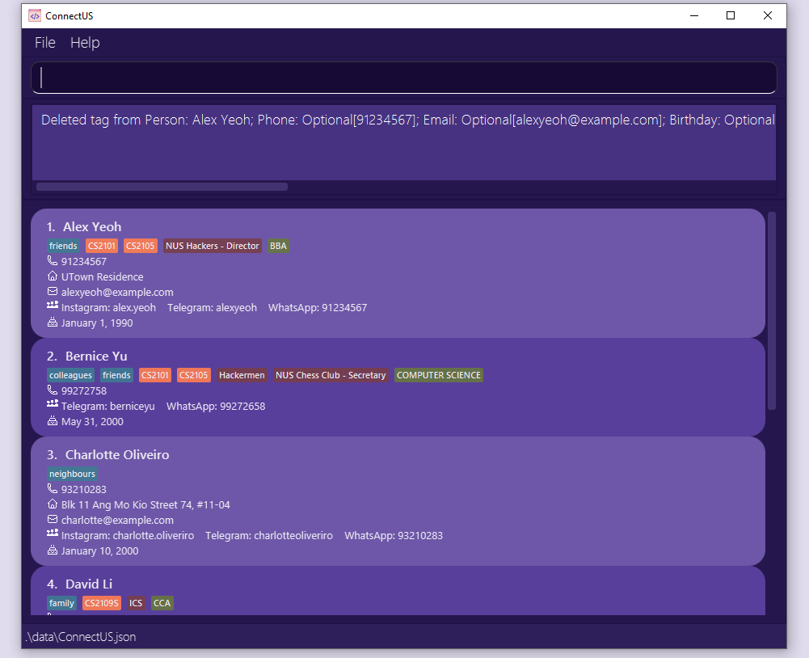
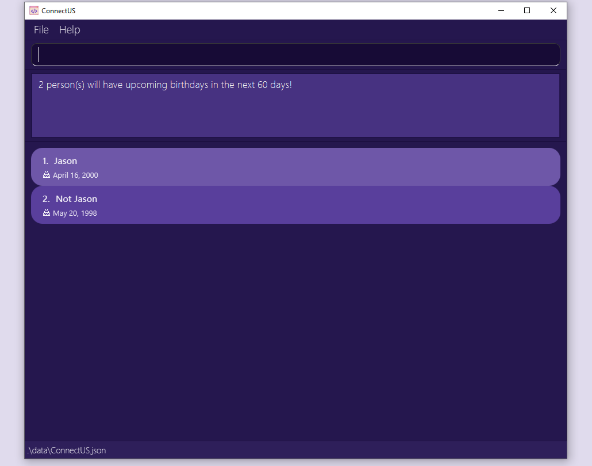
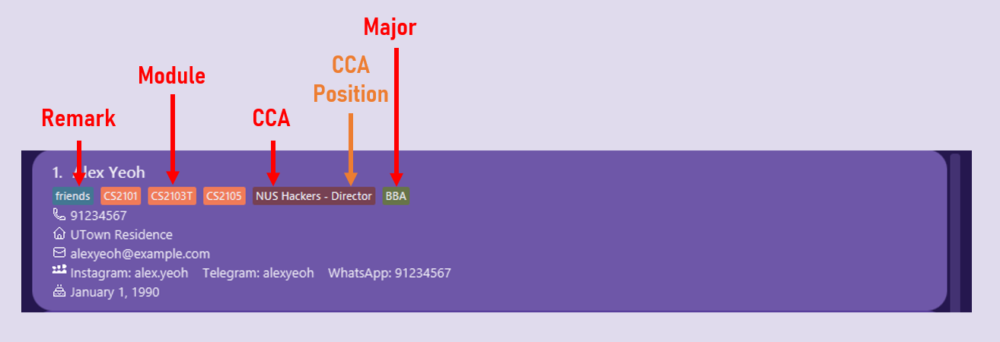

# Welcome to ConnectUS!

ConnectUS is the ultimate **contact management system** for your everyday needs. If you're an NUS School of Computing (SoC) student, this app is for you. With ConnectUS, you can **easily connect with people** without the anxiety of _remembering who you met where_ holding you back from socialising.

We're focused on:
- **Efficiency**: Optimized for use via a Command Line Interface (CLI), you can **easily view and edit your contacts** at your fingertips with ConnectUS.
- **User-friendliness**: With the benefits of having a Graphical User Interface (GUI), **easily navigate through your contact information** to find exactly what you need to **connect** with others.

This User Guide will provide you with an in-depth documentation for you to easily integrate ConnectUS into your daily life. It covers **step-by-step instructions** on setting up ConnectUS, core ConnectUS features and commands, and a glossary for definitions of terms used in ConnectUS.

So what are you waiting for? Get ready to **Connect** with others and let **US** handle the rest!

---

# Table of Contents

- [1. Using this guide](#1-using-this-guide)
  - [1.1 Notation](#11-notation)
  - [1.2 Navigation](#12-navigation)
- [2. Installation](#2-installation)
- [3. Quick Start Guide](#3-quick-start-guide)
  - [3.1 Layout](#31-layout)
    - [3.1.1 Command Box](#311-command-box)
    - [3.1.2 Command Result Feedback](#312-command-result-feedback)
    - [3.1.3 Contact List](#313-contact-list)
  - [3.2 Key Definitions](#32-key-definitions)
    - [3.2.1 Command](#321-command)
    - [3.2.2 Parameter](#322-parameter)
  - [3.3 Command Format](#33-command-format)
  - [3.4 How to Use the CLI](#34-how-to-use-the-cli)
- [4. Features](#4-features)
  - [4.1 Viewing help: `help`](#41-viewing-help-help)
  - [4.2 Listing all contacts: `list`](#42-listing-all-contacts-list)
  - [4.3 Clearing all entries: `clear`](#43-clearing-all-entries-clear)
  - [4.4 Adding a contact: `add`](#44-adding-a-contact-add)
  - [4.5 Editing a contact: `edit`](#45-editing-a-contact-edit)
  - [4.6 Adding additional tags to a contact: `add-t`](#46-adding-additional-tags-to-a-contact-add-t)
  - [4.7 Deleting tags from a contact: `delete-t`](#47-deleting-tags-from-a-contact-delete-t)
  - [4.8 Deleting a contact: `delete`](#48-deleting-a-contact-delete)
  - [4.9 Searching for contact information: `search`](#49-searching-for-contact-information-search)
  - [4.10 Opening a social media platform: `open`](#410-opening-a-social-media-platform-open)
  - [4.11 Opening a social media platform with prefilled message: `chat`](#411-opening-a-social-media-platform-with-prefilled-message-chat)
  - [4.12 View upcoming birthdays: `upcoming-b`](#412-view-upcoming-birthdays-upcoming-b)
  - [4.13 Exiting the program: `exit`](#413-exiting-the-program-exit)
  - [4.14 Saving the data](#414-saving-the-data)
  - [4.15 Editing the data file](#415-editing-the-data-file)
- [5. Information Fields & Prefixes](#5-information-fields--prefixes)
  - [5.1 Name: `n/`](#51-name-n)
  - [5.2 Phone: `p/`](#52-phone-p)
  - [5.3 Email: `e/`](#53-email-e)
  - [5.4 Address: `a/`](#54-address-a)
  - [5.5 Instagram: `ig/`](#55-instagram-ig)
  - [5.6 Telegram: `tg/`](#56-telegram-tg)
  - [5.7 WhatsApp: `wa/`](#57-whatsapp-wa)
  - [5.8 Birthday: `b/`](#58-birthday-b)
  - [5.9 Tags](#59-tags)
    - [5.9.1 Module Tags: `mod/`](#591-module-tags-mod)
    - [5.9.2 CCA Tags: `cca/`](#592-cca-tags-cca)
    - [5.9.3 Major Tags: `maj/`](#593-major-tags-maj)
    - [5.9.4 Remark Tags: `r/`](#594-remark-tags-r)
- [6. FAQ](#6-faq)
- [7. Command Summary](#7-command-summary)
- [8. Prefix Summary](#8-prefix-summary)
- [9. Glossary](#9-glossary)

---

# 1. Using this guide

Thank you for choosing ConnectUS! We are delighted to have you onboard with us as a user.

We **highly recommend** that you read through our User Guide in a sequential order.

## 1.1 Notation

Some special notations are used throughout this guide:

- [Links in blue](#11-notation) will help you navigate through this document, or take you to places on the Internet.
- **Bolded words** are phrases that you should pay attention to.
- <u>Underlined words</u> can be found in the [Glossary](#9-glossary).

## 1.2 Navigation

- If this is your **first time** using ConnectUS, head over to our [Installation](#2-installation) guide for instructions on setting up ConnectUS, and our [Quick Start Guide](#3-quick-start-guide) to begin using ConnectUS.

- If you need a **refresher on command syntax**, head over to [Command Summary](#7-command-summary) for a reference table of commands, or [Prefix Summary](#8-prefix-summary) for a reference table of prefixes.

- For detailed instructions about the features we offer and how to use each command, please refer to [Features](#4-features).

- For detailed information about the different information fields that you can assign to a contact, please refer to [Information Fields & Prefixes](#5-information-fields--prefixes).

- Refer to the [Glossary](#9-glossary) for definitions of terms used in ConnectUS.

[↑ Back to top of section](#1-using-this-guide)

[↑ Back to table of contents](#table-of-contents)

---

# 2. Installation

ConnectUS works on any mainstream OS as long as <u>Java <code>11</code></u> installed.

If you have yet to install ConnectUS, simply follow these steps to set it up:

**Step 1:** Ensure you have Java `11`(found [here](https://www.oracle.com/sg/java/technologies/javase/jdk11-archive-downloads.html)) installed in your computer.

**Step 2:** Download the latest <code><u>ConnectUS.jar</u></code> from our [releases page on <u>GitHub</u>](https://github.com/AY2223S2-CS2103T-W15-1/tp/releases).  

**Step 3:** Copy the file to the folder you want to use as the _home folder_ for your ConnectUS app.  

**Step 4:** Double-click the `ConnectUS.jar` file to start the app. 
   A GUI similar to the below should appear in a few seconds. Note how the app contains some sample data.  

Congratulations! You have successfully set up ConnectUS.

[↑ Back to top of section](#2-installation)

[↑ Back to table of contents](#table-of-contents)

---

# 3. Quick Start Guide

## 3.1 Layout

Let's take a look at the different components in ConnectUS. 

### 3.1.1 Command Box

The command box allows you to enter commands that you wish to perform. For starters, try typing the `help` command and hit enter!

### 3.1.2 Command Result Feedback

The command result feedback box will provide you with a feedback message after a command is entered. For example, after typing `help`, you should see the above feedback in your ConnectUS application, along with a new Help Window!

If you enter an unrecognized command or a command with the wrong format, an error message will be shown in this feedback box: 

You can then use the scroll bars of the feedback box to navigate through the feedback given.

### 3.1.3 Contact List

The contact list shows the contacts that exist within your ConnectUS with all their registered information fields.

* There is a scroll bar beside the contact list container for you to scroll through your contact list.
* The index beside the contact name is the contact's index. It is used for certain commands such as `delete`. More details on this can be found in [Features](#4-features).
* The list of information fields and their details can be found in [Information Fields & Prefixes](#5-information-fields--prefixes).
* You can also find a condensed summary table of these information fields in the [Prefix Summary](#8-prefix-summary).

## 3.2 Key Definitions

### 3.2.1 Command

Commands are actions that you want to perform using ConnectUS. Most commands will require user inputs, otherwise known as [parameters](#322-parameter), for ConnectUS to perform the action.

### 3.2.2 Parameter

Parameters are user inputs that ConnectUS requires to perform certain [commands](#321-command).

Example: `n/NAME`

In this case, `NAME` is the information field that you wish to input. The `n/` prefix must be used for ConnectUS to recognise that you intend on adding a `NAME` to a contact.

* The list of information fields, prefixes and their details can be found in [Information Fields & Prefixes](#5-information-fields--prefixes).
* You can also find a condensed summary of these information fields in the [Prefix Summary](#8-prefix-summary).

:memo: **Note:** 

As of now, using non-English languages (e.g. Chinese, French) as information fields are not yet supported. Be sure to look out for it in a future iteration!

## 3.3 Command Format

To use ConnectUS, type the [command](#321-command) along with its [parameters](#322-parameter), if required. You can leave the parameters empty if it is optional (i.e. if it is wrapped in square brackets like this: `help [COMMAND]`).

* The detailed list of commands and their command formats can be found in [Features](#4-features).
* You can also find a condensed summary of these commands in the [Command Summary](#7-command-summary).

**:memo: Notes about the command format:** 

* Words in `UPPER_CASE` are the information fields (referred to as *parameters*) to be supplied by the user. 
  e.g. in `add n/NAME`, `NAME` is a parameter which can be used as `add n/John Doe`.

* Items in square brackets are optional. 
  e.g `n/NAME [b/BIRTHDAY]` can be used as `n/John Doe b/14/02/2000` or as `n/John Doe`.

* Items with `…`​ after them can be used multiple times including zero times. 
  e.g. `[mod/MODULE]…​` can be used as ` ` (i.e. 0 times), `mod/CS2103T` (i.e. 1 time), `mod/CS2103T mod/CS2107` (i.e. 2 times) etc.

* Information fields can be in any order. 
  e.g. if the command specifies `n/NAME p/PHONE`, `p/PHONE n/NAME` is also acceptable.

* If a parameter is expected only once in the command, but you specify it multiple times, only the last occurrence of the parameter will be taken. 
  e.g. if you specify `p/12341234 p/56785678`, only `p/56785678` will be taken.

* Extraneous parameter for commands that do not take in parameters (such as `list`, `exit` and `clear`) will be ignored. 
  e.g. if the command specifies `list 123`, it will be interpreted as `list`.

* Commands are case-sensitive! 
  e.g. if you specify `ADD n/James` or `aDd n/James` instead of `add n/James`, ConnectUS will not register it as a valid command.

## 3.4 How to Use the CLI

To use the Command Line Interface (CLI), you can type a [command](#321-command) in the [Command Box](#311-command-box) and press Enter to execute it. For example, typing **`help`** and pressing Enter will open the help window. 
     

To familiarise yourself with ConnectUS, let's try out [the `add` command](#44-adding-a-contact-add) ! The `add` command allows you to add a new contact into the [Contact List](#313-contact-list).

**Format:** `add n/NAME [p/PHONE] [a/ADDRESS] [e/EMAIL] [tg/TELEGRAM] [ig/INSTAGRAM] [wa/WHATSAPP] [b/BIRTHDAY] [mod/MODULE]…​ [cca/CCA[#CCA_POSITION]]…​ [maj/MAJOR]…​ [r/REMARK]…​`

**What does Format mean?**

The first word of every command allows ConnectUS to distinguish different commands.

* `add` tells ConnectUS that this command is to add a new contact
* Prefixes such as `n/` and `p/` are delimiters that allow ConnectUS to distinguish different parameters from the input that you supply
* Information fields such as `NAME` and `PHONE` show you what you should place in each portion of the command.

Notice how there are square brackets `[]` surrounding certain parameters like in `[p/PHONE]`. This indicates that the parameter is **optional**, i.e. a contact can exist even if it does not have this field.

Other parameters that end with `…​` like in `[mod/MODULE]…​` indicates that this parameter can be used multiple times.

**Let's test this out!**

Suppose you have a friend whose nickname is Lineup Larry. His phone number is 91234567, and he stays on campus in UTown Residences. His Telegram username is lineuplarry, takes the modules CS2103T and CS2101, and is in the Art Club.

>`NAME`: Lineup Larry 
>`PHONE`: 91234567 
>`ADDRESS`: UTown Residences 
>`TELEGRAM`: lineuplarry 
>`MODULE`: CS2103T, CS2101 
>`CCA`: Art Club

The command you would enter into the command box would be: 
`add n/Lineup Larry p/91234567 a/UTown Residences tg/lineuplarry mod/CS2103T mod/CS2101 cca/Art Club`

Go ahead and hit enter once you've entered the command. If you have a new contact added in the Contact List as follows: 

Congratulations! You have successfully added your first contact!

There are many other features in ConnectUS. Do refer to the [Features](#4-features) below for details on each feature and command!

[↑ Back to top of section](#3-quick-start-guide)

[↑ Back to table of contents](#table-of-contents)

---

# 4. Features

ConnectUS has many features to assist you in your contact management needs. The exhaustive list of supported commands are as follows:

- [4.1 Viewing help: `help`](#41-viewing-help-help)
- [4.2 Listing all contacts: `list`](#42-listing-all-contacts-list)
- [4.3 Clearing all entries: `clear`](#43-clearing-all-entries-clear)
- [4.4 Adding a contact: `add`](#44-adding-a-contact-add)
- [4.5 Editing a contact: `edit`](#45-editing-a-contact-edit)
- [4.6 Adding additional tags to a contact: `add-t`](#46-adding-additional-tags-to-a-contact-add-t)
- [4.7 Deleting tags from a contact: `delete-t`](#47-deleting-tags-from-a-contact-delete-t)
- [4.8 Deleting a contact: `delete`](#48-deleting-a-contact-delete)
- [4.9 Searching for contact information: `search`](#49-searching-for-contact-information-search)
- [4.10 Opening a social media platform: `open`](#410-opening-a-social-media-platform-open)
- [4.11 Open a social media platform with prefilled message: `chat`](#411-opening-a-social-media-platform-with-prefilled-message-chat)
- [4.12 View upcoming birthdays: `upcoming-b`](#412-view-upcoming-birthdays-upcoming-b)
- [4.13 Exiting the program: `exit`](#413-exiting-the-program-exit)
- [4.14 Saving the data](#414-saving-the-data)
- [4.15 Editing the data file](#415-editing-the-data-file)

## 4.1 Viewing help: `help`

Format: `help [COMMAND]`

> Opens up the help window, or returns the usage instructions of a specific command.

If you are lost while using ConnectUS, simply use the `help` command! Using the `help` command alone will show a message explaining how to access this User Guide.

If you want to know the usage instructions of a specific command, simply use `help [COMMAND]`, where `[COMMAND]` is the command that you need help with. There will be feedback from the command result feedback box if the command is successfully retrieved.

Examples: `help`, `help add`, `help list`

[↑ Back to feature list](#4-features)

## 4.2 Listing all contacts: `list`

Format: `list`

> Shows a list of all contact in the ConnectUS app.

Use `list` when you need to view a list of *all* the contacts in your ConnectUS. The `list` command can be used directly without any additional parameters.

[↑ Back to feature list](#4-features)

## 4.3 Clearing all entries: `clear`

Format: `clear`

> Clears all contacts from the ConnectUS app.

ConnectUS comes with a set of default contacts. If you want to remove all default contacts, or you want to restart your ConnectUS contact list, you can use the `clear` command without any additional parameters.

:exclamation: **Caution:** 
Once the contact data in ConnectUS is cleared, it cannot be retrieved. Do proceed with caution!

**Clear Example:**

**Input in Command Box:** `clear`

**Result:** 

[↑ Back to feature list](#4-features)

## 4.4 Adding a contact: `add`

Format: `add n/NAME [p/PHONE] [a/ADDRESS] [e/EMAIL] [tg/TELEGRAM] [ig/INSTAGRAM] [wa/WHATSAPP] [b/BIRTHDAY] [mod/MODULE]…​ [cca/CCA[#CCA_POSITION]]…​ [maj/MAJOR]…​ [r/REMARK]…​`

>Adds a contact to the ConnectUS app.

You can add a contact using the `add` command followed by the parameters (as shown in the format above). While the `NAME` is mandatory, the rest of the fields (i.e. `ADDRESS`, `TELEGRAM`, `MODULE` etc.) are optional.

:bulb: **Tip:** 

* A contact can have any number of <a href=#59-tags>tags</a>, i.e. <u>modules</u>, <u>CCAs</u>, and <u>remarks</u> (including 0)!

* A contact can have at most 2 majors. If you input more than 2 majors, only the last 2 occurrences will be taken as parameters!

**Add Example 1:**

**Input in Command Box:** `add n/James`

**Result:** 

**Add Example 2:**

**Input in Command Box:** `add n/James e/james@example.com ig/itsjameshere tg/itsjameshere mod/CS2103T mod/CS2101 cca/NUS Hackers r/Year 2 b/01/01/2000`

**Result:** 

Please refer to [Information Fields & Prefixes](#5-information-fields--prefixes) for details on how to use each parameter prefix.

:bulb: **Tip:** 
ConnectUS helps you to detect duplicate contacts by checking the existing contacts for the exact same name (case-sensitive) whenever you add a new contact.

[↑ Back to feature list](#4-features)

## 4.5 Editing a contact: `edit`

Format: `edit INDEX [n/NAME] [p/PHONE] [a/ADDRESS] [e/EMAIL] [ig/INSTAGRAM] [tg/TELEGRAM] [wa/WHATSAPP] [b/BIRTHDAY]`

>Edits an existing contact in the ConnectUS app.

If you accidentally added the wrong information when [adding a contact](#44-adding-a-contact-add), or if you want to update your contacts' information, you use the `edit`  command.

:bulb: **Tip:** 

If you want to edit a contact's tags, refer to these guides on <a href="#46-adding-additional-tags-to-a-contact-add-t" class="alert-link">Adding Additional Tags</a> or <a href="#47-deleting-tags-from-a-contact-delete-t" class="alert-link">Deleting Existing Tags</a> instead!

The `edit` command:

* Edits the contact at the specified `INDEX`. The index refers to the index number shown in the displayed contact list.
* The index **must be a positive integer** e.g. 1, 2, 3, …​
* At least one of the optional fields must be provided (e.g. `n/NAME`, `tg/TELEGRAM`).
* Existing values will be updated to the input values.

**Edit Example:**

**Input in Command Box:** `edit 1 p/12345678 e/james@example.com`

**Before:** 

**After:** 

Please refer to [Information Fields & Prefixes](#5-information-fields--prefixes) for details on how to use each parameter prefix.

:bulb: **Tip:** 

ConnectUS helps you to detect duplicate contacts by checking the existing contacts for the exact same name (case-sensitive) whenever you edit an existing contact.

 

:memo: **Note:** 

As of now, removing a contact's information field is not yet supported. Be sure to look out for it in a future iteration!

[↑ Back to feature list](#4-features)

## 4.6 Adding additional tags to a contact: `add-t`

Format: `add-t PERSON_INDEX [r/REMARK] [mod/MODULE] [cca/CCA[#CCA_POSITION]] [maj/MAJOR]`

> Adds a tag to an existing contact.

If you want to add a new tag to a contact, you can use the `add-t` command.

The `add-t` command:
* Adds a tag to the contact at the specified `PERSON_INDEX`. The `PERSON_INDEX` refers to the index number shown in the displayed contact list.
* The index **must be a positive integer** e.g. 1, 2, 3, …​
* At least one of the optional fields must be provided (e.g. `r/REMARK_NAME`, `mod/MODULE_CODE`).
* A new tag will be created and assigned to the person specified at the `PERSON_INDEX`.
* No duplicate tags are allowed. This means that if there is a pre-existing **tag type** with a certain tag name, the tag will not show up in the UI.
  * e.g. If there is an existing **remark** tag for `classmates` for `PERSON_INDEX` 1, doing `add-t 1 r/classmates` _WILL NOT_ add an additional **remark** tag.

**Add Tag Example:**

**Input in Command Box:** `add-t 1 r/friends mod/CS2103T`

**Before:** 

**After:** 

[↑ Back to feature list](#4-features)

## 4.7 Deleting tags from a contact: `delete-t`

Format: `delete-t PERSON_INDEX [r/REMARK_INDEX] [mod/MODULE_INDEX] [cca/CCA_INDEX] [maj/MAJOR_INDEX]`

> Deletes an existing tag from an existing contact.

If you want to delete an existing tag from a contact, you can use the `delete-t` command.

The `delete-t` command:
* Deletes a tag from the contact at the specified `PERSON_INDEX`. The `PERSON_INDEX` refers to the index number shown in the displayed contact list.
* The `REMARK_INDEX`, `MODULE_INDEX`, `CCA_INDEX` and `MAJOR_INDEX` refer to the index of the tag shown in the respective tag types, from left to right, starting from index 1.

For example, the Module tags are indexed from 1 to 3 as follows:

* All indexes (i.e. `PERSON_INDEX`, `REMARK_INDEX`, `MODULE_INDEX`, `CCA_INDEX`, `MAJOR_INDEX`) **must be a positive integer** e.g. 1, 2, 3, …​
* At least one of the optional fields must be provided (i.e. `r/REMARK_INDEX`, `mod/MODULE_INDEX`, `cca/CCA_INDEX`, `maj/MAJOR_INDEX`).
* The specified tag will be deleted from the contact specified at the `PERSON_INDEX`.

:memo: **Note:** 

As of now, tags can only be deleted one at a time. If there is more than one occurrence of a parameter, only the last one will be taken.

**Delete Tag Example:**

**Input in Command Box:** `delete-t 1 mod/2`

**Before:** 

**After:** 

[↑ Back to feature list](#4-features)

## 4.8 Deleting a contact: `delete`

Format: `delete PERSON_INDEX`

> Deletes the specified contact from the ConnectUS app.

If you wish to remove a contact, use the `delete` command.

The `delete` command:

* Deletes the contact at the specified `PERSON_INDEX`.
* The `PERSON_INDEX` refers to the index number shown in the displayed contact list.
* The index **must be a positive integer** e.g. 1, 2, 3, …​

**Delete Example 1:**

`list` followed by `delete 2` deletes the 2nd contact in the ConnectUS app.

**Before:** 

**After:** 

**Delete Example 2:**

`search Alex` followed by `delete 1` deletes the 1st contact in the results of the `search` command.

**Before:** 

**After:** 

:bulb: **Tip:** 

To retrieve your contacts after a <code>search</code>, type <code>list</code> in the Command Box and hit enter!

[↑ Back to feature list](#4-features)

## 4.9 Searching for contact information: `search`

Format: `search [KEYWORD]... [n/NAME_KEYWORD] [p/PHONE_KEYWORD] [e/EMAIL_KEYWORD] [b/BIRTHDAY_KEYWORD] [ig/INSTAGRAM_KEYWORD] [wa/WHATSAPP_KEYWORD] [tg/TELEGRAM_KEYWORD] [r/REMARK_KEYWORD]... [mod/MODULE_KEYWORD]... [cca/CCA_KEYWORD#CCA_POSITION_KEYWORD]... [maj/MAJOR_KEYWORD]...`

> For keywords without a specified field, finds all contacts whose information from any field contains the given keywords. For keywords in a specified field, finds all contacts whose field contains given keyword.

There are 2 methods which you can use concurrently to search for a contact.

**Method 1:**

Using `search KEYWORD` will return a list of all the contacts that match the `KEYWORD` in _ANY_ of their information fields.

For example, if you have 2 contacts, one with the name January, and another with a birthday in January, `search January` will return both those contacts.

**Method 2:**

Using `search` with prefixes (e.g. `search n/NAME_KEYWORD`) will return a list of contacts with that match the information field given by the prefix.

From the earlier example, if you have 2 contacts, one with the name January, and another with a birthday in January, `search n/January` will only return the contact whose name is January.

**Additional Examples:**
* `search january` returns all contacts whose information fields contain the keyword `january`.
* `search alex may` returns all contacts whose information fields contain the keywords `alex` and `may`.
* `search may blk n\alex` returns all contacts whose name contains the keyword `alex` and which contain the keywords `may` and `blk` in any of the information fields.
* `search n\lex y`returns all contacts whose name contains the keyword `lex y`
* `search n\alex b\may` returns all contacts whose name contains the keyword `alex` and whose birthday contains the keyword `may`
* `search mod\cs mod\ma` returns all contacts who have at least one module which contains the keyword `cs` and at least one module which contain the keyword `ma`
* `search ig\al cca\chess` returns all contacts whose instagram handle contains the keyword `al` and who has at least one cca with the word `chess` in it
* `search cca\#president` returns all contacts who have a position that contains the keyword `president` in at least one cca

:bulb: **Tip:** 

* The keywords are case-insensitive! This means that `search january`, `search JANUARY` and `search jAnUaRy` will all return the contacts whose information fields contain the keyword `january`. 

* Only unspecified keywords treat space as a separator. This means `search yu alex` will search for a contact that contains both `yu` and `alex` in the information, but `search n/yu alex` will search for a contact that contains the string `yu alex` in its name.  

* If you have 2 contacts, one with the name January, and another with a birthday in January, `search n/January` will return _ONLY_ the contact whose name is January.

**Search Example 1:**

**Input in Command Box:** `search cs`

**Result:** 

**Search Example 2:**

**Input in Command Box:** `search mod/cs`

**Result:** 

:bulb: **Tip:** 

To retrieve your contacts after a <code>search</code>, type <code>list</code> in the Command Box and hit enter!

Please refer to [Information Fields & Prefixes](#5-information-fields--prefixes) for details on how to use each parameter prefix.

[↑ Back to feature list](#4-features)

## 4.10 Opening a social media platform: `open`

Format: `open PERSON_INDEX [tg/] [wa/] [ig/]`

> Opens the respective social media platform of an existing contact.

You can directly open supported social media platforms (i.e. Instagram, Telegram, WhatsApp) from the CLI.

For WhatsApp, if a handle stored is an 8-digit phone number, it will be assumed as a Singaporean number and the `65` country code will be automatically filled.

:bulb: **Tip:** 

You'll need to download the desktop applications for <a href="https://desktop.telegram.org/" class="alert-link">Telegram</a> and <a href="https://www.whatsapp.com/download" class="alert-link">WhatsApp</a> respectively if you want to use these features!

**Open Example:**

**Input in Command Box:** `open 2 tg/`

**Result:** 

[↑ Back to feature list](#4-features)

## 4.11 Opening a social media platform with prefilled message: `chat`

Format: `chat PERSON_INDEX wa/ m/MESSAGE`

> Opens the respective social media platform of an existing contact with specified message prefilled.

Due to platform constraints, only WhatsApp is supported.

Similar to `open`, if a WhatsApp handle stored is an 8-digit phone number, it will be assumed as a Singaporean number and the `65` country code will be automatically filled.

All your existing messages in the text field will be replaced.

:bulb: **Tip:** 

You'll need to download the desktop application for <a href="https://www.whatsapp.com/download" class="alert-link">WhatsApp</a> if you want to use this feature!

Note that WhatsApp might not be responsive enough to prefill the message for you. In this case, you can execute the command once again.

**Chat Example:**

**Input in Command Box:** `chat 1 wa/ m/hello world!`

**Result:** 

[↑ Back to feature list](#4-features)

## 4.12 View upcoming birthdays: `upcoming-b`

Format: `upcoming-b`

> Shows all contacts who have upcoming birthdays within the next 60 days.

Never forget a birthday again! With `upcoming-b`, you can check which of your friends have their birthdays in the next 60 days (approx. 2 months).

**Upcoming Birthday Example:**

**Input in Command Box:** `upcoming-b`

**Result:** 

## 4.13 Exiting the program: `exit`

Format: `exit`

> Exits the program.

When you are done with your contact management needs, you can exit ConnectUS with the `exit` command.

[↑ Back to feature list](#4-features)

## 4.14 Saving the data

You won't ever need to worry about losing your contacts. ConnectUS automatically saves your data in the hard disk after any command that changes the data. There is no need to save manually.

[↑ Back to feature list](#4-features)

## 4.15 Editing the data file

If you are an advanced user, you are welcome to update data directly by editing the data file.

ConnectUS data is saved as a <u>JSON</u> file `[JAR file location]/data/ConnectUS.json`.

:exclamation: **Caution:** 

If your changes to the data file makes its format invalid, ConnectUS will discard all data and start with an empty data file at the next run. Do remember to keep a backup of your data before attempting any changes in this manner!

[↑ Back to feature list](#4-features)

[↑ Back to table of contents](#table-of-contents)

---

# 5. Information Fields & Prefixes

ConnectUS uses prefixes to distinguish between the different types of information fields you supply. The exhaustive list of information fields supported and their respective prefixes are as follows:

- [5.1 Name: `n/`](#51-name-n)
- [5.2 Phone: `p/`](#52-phone-p)
- [5.3 Email: `e/`](#53-email-e)
- [5.4 Address: `a/`](#54-address-a)
- [5.5 Instagram: `ig/`](#55-instagram-ig)
- [5.6 Telegram: `tg/`](#56-telegram-tg)
- [5.7 WhatsApp: `wa/`](#57-whatsapp-wa)
- [5.8 Birthday: `b/`](#58-birthday-b)
- [5.9 Tags](#59-tags)
  - [5.9.1 Module Tags: `mod/`](#591-module-tags-mod)
  - [5.9.2 CCA Tags: `cca/`](#592-cca-tags-cca)
  - [5.9.3 Major Tags: `maj/`](#593-major-tags-maj)
  - [5.9.4 Remark Tags: `r/`](#594-remark-tags-r)

## 5.1 Name: `n/`
>Name refers to a contact's name.

* Name is a *compulsory* field, i.e. a contact cannot exist if it does not have a name.
* The prefix for a name is `n/`.
* Names should only contain <u>alphanumeric</u> characters and spaces.

[↑ Back to prefix list](#5-information-fields--prefixes)

## 5.2 Phone: `p/`
>Phone refers to a contact's phone number.

* Phone is an *optional* field, i.e. a contact can exist even if it does not have a phone number.
* The prefix for a phone is `p/`.
* Phone numbers should only contain <u>numeric</u> characters. This also means no spaces are allowed!
* Phone numbers should be at least 3 digits long.

[↑ Back to prefix list](#5-information-fields--prefixes)

## 5.3 Email: `e/`
>Email refers to a contact's email address.

* Email is an *optional* field, i.e. a contact can exist even if it does not have an email.
* The prefix for an email is `e/`.
* Emails should be of the format local-part@domain and adhere to the following constraints:
    * The local-part should only contain <u>alphanumeric</u> characters and these <u>special characters</u>:`+_.-`. The local-part may not start or end with any special characters.
    * This is followed by a '@' and then a domain name. The domain name is made up of domain labels separated by periods.
      The domain name must:
        - end with a domain label at least 2 characters long
        - have each domain label start and end with alphanumeric characters
        - have each domain label consist of alphanumeric characters, separated only by hyphens, if any.

[↑ Back to prefix list](#5-information-fields--prefixes)

## 5.4 Address: `a/`
>Address refers to a contact's home address.

* Address is an *optional* field, i.e. a contact can exist even if it does not have an address.
* The prefix for an address is `a/`.
* Addresses can take any values, including <u>special characters</u>.

[↑ Back to prefix list](#5-information-fields--prefixes)

## 5.5 Instagram: `ig/`
>Instagram refers to a contact's Instagram username.

* Instagram is an *optional* field, i.e. a contact can exist even if it does not have an Instagram.
* The prefix for an Instagram username is `ig/`.
* Instagram usernames should be of the format `john.123.doe` and adhere to the following constraints:
    * The username should only contain <u>alphanumeric</u> characters and the special character: `.`.
    * The dots `.` must not be consecutive or at the end.
    * The username should contain at most 30 characters.

[↑ Back to prefix list](#5-information-fields--prefixes)

## 5.6 Telegram: `tg/`
>Telegram refers to a contact's Telegram username.

* Telegram is an *optional* field, i.e. a contact can exist even if it does not have a Telegram.
* The prefix for a Telegram username is `tg/`.
* Telegram usernames should be of the format `johndoe` and adhere to the following constraints:
    * The username should only contain <u>alphanumeric</u> characters and the special character `_`.
    * The username should contain at least 5 characters.

[↑ Back to prefix list](#5-information-fields--prefixes)

## 5.7 WhatsApp: `wa/`
>WhatsApp refers to a contact's WhatsApp phone number.

* WhatsApp is an *optional* field, i.e. a contact can exist even if it does not have a WhatsApp.
* The prefix for adding a WhatsApp is `wa/`.
* A WhatsApp's user identifier is a phone number, which should adhere to the following constraints:
    * Phone numbers should only contain <u>numeric</u> characters. This also means no spaces are allowed!
    * Phone numbers should be at least 3 digits long.

[↑ Back to prefix list](#5-information-fields--prefixes)

## 5.8 Birthday: `b/`
>Birthday refers to a contact's birthday date.

* Birthday is an *optional* field, i.e. a contact can exist even if it does not have a birthday.
* The prefix for a birthday is `b/`.
* Birthdays should be of the format DD/MM/YYYY:
  * `01/01/2000` would correspond to January 1st, 2000
  * `16/05/1990` would correspond to May 16th, 1990.

[↑ Back to prefix list](#5-information-fields--prefixes)

## 5.9 Tags

Tags are used to assign additional information to a contact.

There are four kinds of tags in ConnectUS. They are Module Tags, CCA Tags, Major Tags, and Remark Tags.

### 5.9.1 Module Tags: `mod/`
>Module tags refer to modules that you can assign to a contact to keep track of what modules that contact takes.

* <u>Module</u> is an *optional* field, i.e. a contact can exist even if it does not have a module.
* The prefix for a module is `mod/`.
* Module names should be <u>alphanumeric</u>, and cannot contain spaces.
* A contact can have any number of modules assigned to it.

[↑ Back to prefix list](#5-information-fields--prefixes)

### 5.9.2 CCA Tags: `cca/`
>CCA tags refer to CCAs that you can assign to a contact to record keep track of CCAs that contact is in.

* <u>CCA</u> is an *optional* field, i.e. a contact can exist even if it does not have a CCA.
* The prefix for a CCA is `cca/`.
* CCA names should be <u>alphanumeric</u>, and can contain spaces.
* A contact can have any number of CCAs assigned to it.

If you wish to assign a CCA Position to a contact, you can do so with the CCA prefix as well!
* Format: `cca/CCA[#CCA_POSITION]`
* CCA_POSITION is optional, however if you enter # after CCA you are expected to enter a CCA_NAME.
* Example: If you have a contact who is the President of the Chess Club, you can use the field `cca/Chess Club#President` to assign that CCA tag to them.
* Example: If you have a contact who is a member of the Arts Club, but you do not know their position, you can use the field `cca/Arts Club` to assign just CCA.

[↑ Back to prefix list](#5-information-fields--prefixes)

### 5.9.3 Major Tags: `maj/`
>Major tags refer to Majors that you can assign to a contact to keep track of the majors that the contact is taking.

* Major is an *optional* field, i.e. a contact can exist even if it does not have a Major.
* The prefix for a major is `maj/`.
* Major names should be <u>alphanumeric</u>, and can contain spaces.
* A contact can have a maximum of 2 majors assigned to it.
* If more than 2 majors are assigned during add command, the last 2 majors are taken.
* If total number of majors after using add-t exceeds 2, the command is not accepted.

[↑ Back to prefix list](#5-information-fields--prefixes)

### 5.9.4 Remark Tags: `r/`
>Remark tags refer to any additional remarks you would like to assign to a contact to keep track of any information you deem relevant and important.

* Remark is an *optional* field, i.e. a contact can exist even if it does not have a remark.
* The prefix for a remark is `r/`.
* Remark names should be <u>alphanumeric</u>, and can contain spaces.
* A contact can have any number of remarks assigned to it.

**Why do we need remark tags if we already have other kinds of tags?**
* Remarks are used for assigning other information to a contact, e.g. their Year of Study, Faculty, Company etc.
* If a tag you want to add to a contact does not exist, you can use the remark tag.
* The difference in tag colours in the UI can help you differentiate between the different kinds of tags.

:memo: **Note:** 

As of now, using non-English languages (e.g. Chinese, French) as information fields are not yet supported. Be sure to look out for it in a future iteration!

[↑ Back to prefix list](#5-information-fields--prefixes)

[↑ Back to top](#table-of-contents)

---

# 6. FAQ

**Q**: How do I transfer my data to another Computer? 
**A**: Install the app in the other computer and overwrite the empty data file it creates with the file that contains the data of your previous ConnectUS home folder.

**Q**: Why do we need remark tags if we already have other kinds of tags? 
**A**: Remarks are used for assigning other information to a contact, e.g. their Year of Study, Faculty, Company etc. If a tag you want to add to a contact does not exist, you can use the remark tag. The difference in tag colours in the UI can help you differentiate between the different kinds of tags.

**Q**: When adding information fields in non-English languages, why is there no response from the application? 
**A**: As of now, using non-English languages (e.g. Chinese, French) as information fields are not yet supported. Be sure to look out for it in a future iteration!

**Q**: Why can't I remove an information field after I add it with `edit`? 
**A**: As of now, removing a contact's information field is not yet supported. Be sure to look out for it in a future iteration!

[↑ Back to top](#table-of-contents)

---

# 7. Command Summary

| Command                | Format                                                                                                                                                                                                                                                       | Example                                                                               |
|------------------------|--------------------------------------------------------------------------------------------------------------------------------------------------------------------------------------------------------------------------------------------------------------|---------------------------------------------------------------------------------------|
| **Add a Contact**      | `add n/NAME [p/PHONE] [a/ADDRESS] [e/EMAIL] [tg/TELEGRAM] [ig/INSTAGRAM] [wa/WHATSAPP] [b/BIRTHDAY] [mod/MODULE]…​ [cca/CCA#CCA_POSITION]…​ [major/MAJOR]…​`                                                                                                 | `add n/James p/12345678 e/james@example.com tg/itsjameshere b/14/02/2000 mod/CS2103T` |
| **Add Tag**            | `add-t PERSON_INDEX [r/REMARK] [mod/MODULE] [cca/CCA[#CCA_POSITION]] [maj/major]`                                                                                                                                                                            | `add-t 1 r/friends mod/CS2103T cca/NUS Hackers#President`                             |
| **Chat with Contact**  | `chat PERSON_INDEX wa/ m/MESSAGE`                                                                                                                                                                                                                            | `chat 1 wa/ m/hello world!`                                                           |
| **Clear Data**         | `clear`                                                                                                                                                                                                                                                      |                                                                                       |
| **Delete a Contact**   | `delete PERSON_INDEX`                                                                                                                                                                                                                                        | `delete 3`                                                                            |
| **Delete Tag**         | `delete-t PERSON_INDEX [r/REMARK_INDEX] [mod/MODULE_INDEX] [cca/CCA_INDEX] [maj/MAJOR_INDEX]`                                                                                                                                                                | `delete-t 1 mod/1`                                                                    |
| **Edit a Contact**     | `edit PERSON_INDEX [n/NAME] [p/PHONE] [a/ADDRESS] [e/EMAIL] [tg/TELEGRAM] [ig/INSTAGRAM] [wa/WHATSAPP] [b/BIRTHDAY]`                                                                                                                                         | `edit 1 p/12345678 e/james@example.com tg/itsjameshere`                               |
| **Help**               | `help [COMMAND]`                                                                                                                                                                                                                                             | `help`, `help add`                                                                    |
| **List All Contacts**  | `list`                                                                                                                                                                                                                                                       |                                                                                       |
| **Open Social Media**  | `open PERSON_INDEX [tg/] [wa/] [ig/]`                                                                                                                                                                                                                        | `open 1 tg/`                                                                          |
| **Search**             | `search [KEYWORD]... [n/NAME_KEYWORD] [p/PHONE_KEYWORD] [e/EMAIL_KEYWORD] [b/BIRTHDAY_KEYWORD] [ig/INSTAGRAM_KEYWORD] [wa/WHATSAPP_KEYWORD] [tg/TELEGRAM_KEYWORD] [r/REMARK_KEYWORD]... [mod/MODULE_KEYWORD]... [cca/CCA_KEYWORD]... [maj/MAJOR_KEYWORD]...` | `search alex january`,  `search n/lex Y mod/CS2103T mod/CS2101`                    | 
| **Upcoming Birthdays** | `upcoming-b`                                                                                                                                                                                                                                                 |                                                                                       |
| **Exit**               | `exit`                                                                                                                                                                                                                                                       |                                                                                       |

[↑ Back to top](#table-of-contents)

---

# 8. Prefix Summary

| Information Field | Prefix | Example                                       |
|-------------------|--------|-----------------------------------------------|
| **Address**       | `a/`   | `a/Blk 456, Den Road, #01-355`                |
| **Birthday**      | `b/`   | `b/01/01/2000`                                |
| **CCA Tag**       | `cca/` | `cca/NUS Hackers`, `cca/Chess Club#President` |
| **Email**         | `e/`   | `e/johndoe@example.com`                       |
| **Instagram**     | `ig/`  | `ig/john.doe`                                 |
| **Major Tag**     | `maj/` | `maj/Computer Engineering`                    |
| **Module Tag**    | `mod/` | `mod/CS2103T`                                 |
| **Name**          | `n/`   | `n/John Doe`                                  |
| **Phone**         | `p/`   | `p/91234567`                                  |
| **Remark Tag**    | `r/`   | `r/School of Computing`                       |
| **Telegram**      | `tg/`  | `tg/johndoe`                                  |
| **WhatsApp**      | `wa/`  | `wa/91234567`                                 |

[↑ Back to top](#table-of-contents)

---

# 9. Glossary

### A
> **Alphanumeric:**
> English alphabet letters and numbers only.

### C
> **CCA:**
> Co-curricular activities that students participate in.
> 
> **Command Line Interface (CLI):**
> A text-based user interface used to run programs.
> 
> **Command:**
> Commands are actions that you want to perform using ConnectUS. Most commands will require user inputs, otherwise known as parameters, for ConnectUS to perform the action.
> 
> **ConnectUS.jar:**
> `.jar` is short for Java ARchive. A file format that contains the executable Java application for ConnectUS.

### F
> **Format:**
> In this User Guide, the format of a command is the correct input usage of a command.

### G
> **GitHub:**
> A web-based version control and collaboration platform for software developers.
> 
> **Graphical User Interface (GUI):**
> A form of user interface that allows users to interact with programs through graphical icons and audio indicators.

### J
>**Java `11`**: A feature release of the Java SE platform, used to run ConnectUS. The download link for this release can be found <a href="https://www.oracle.com/sg/java/technologies/javase/jdk11-archive-downloads.html">here</a>.
> 
> **JavaFX:**
> A Java library used for creating and delivering desktop applications.
> 
> **JSON:**
> Short for JavaScript Object Notation. A standard text-based format for representing structured data based on JavaScript object syntax. *Basically, it stores your data.*

### M
> **Major:**
> Majors are the main programmes that students take at the National University of Singapore.
>
> **Module:**
> Modules are courses that students take at the National University of Singapore.

### N
> **Numeric:**
> Numbers only.
> 
> **NUS:**
> Short for the National University of Singapore. 
> 

### P
> **Parameter:**
> Parameters are user inputs that ConnectUS requires to perform certain commands.

### S
> **School of Computing:**
> Also known as SoC. A computing school in the National University of Singapore.
> 
> **Special Characters:**
> Characters that are not alphabetic or numeric.

### U
> **UTown Residence:**
> Also known as UTR. On-campus accommodation for students at the National University of Singapore.

[↑ Back to top](#table-of-contents)
