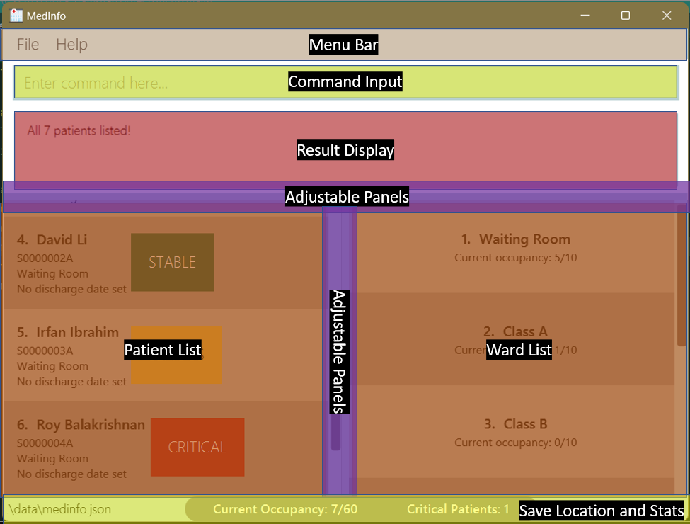
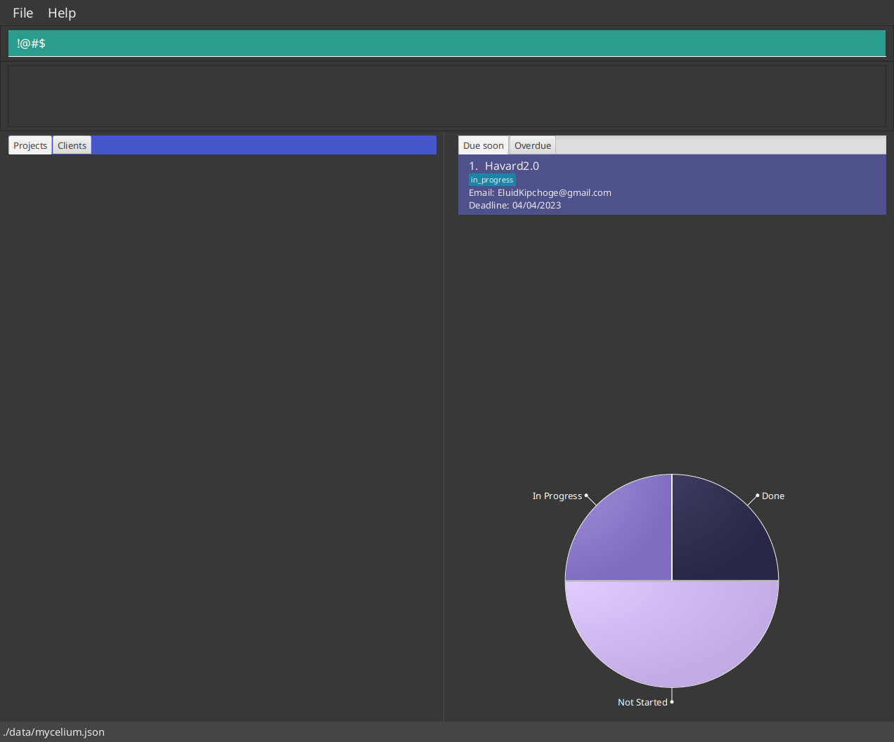

**Mycelium** is a desktop application aimed at helping **freelance web developers
manage clients and projects** from multiple online sources like [Upstack](https://upstackhq.com/),
[Fiverr](https://www.fiverr.com/), and [Toptal](https://www.toptal.com/). All interactions
with **Mycelium** are done through text commands or HotKeys, enabling one to efficiently
manipulate data while availing oneself to the convenience of viewing, offered by the
Graphical User Interface (GUI). You can expect to navigate its interface seamlessly and
access its functions with a mere keystroke or two.

## Using this Guide

If it is your first time here, the easiest way to get started is to head over
to [Quick Start](#quick-start), which will guide you through the installation
process and basic usage.

Alternatively, you may wish to use this guide as a reference for commands and
HotKeys. The three main parts of this guide contain descriptions on how to use
commands for managing [clients](#managing-clients) and
[projects](#managing-projects), as well as the available [HotKeys](#hotkeys).

### Icons and Conventions

The following typographical conventions are used in this guide.

* (KEYCAP) - Indicates a literal set of keys, e.g. (CTRL+F) refers to the
  combination of the 'Control' and 'F' keys.

<div markdown="span" class="alert alert-success">
:bulb: This signifies a tip or suggestion.
</div>

<div markdown="span" class="alert alert-info">
:information_source: This signifies a general note.
</div>

<div markdown="span" class="alert alert-danger">
:warning: This indicates a warning or caution.
</div>

## Table of Contents

* Table of Contents
{:toc}

## Quick Start

Mycelium runs on Java 11, so you should first head over to [Oracle's
website](https://www.oracle.com/java/technologies/downloads/) to install Java
11 if your system does not already have it installed. Alternatively, you might
be able to install Java 11 from your preferred package manager, such as
[Homebrew](https://formulae.brew.sh/formula/openjdk@11) for Mac or
[Pacman](https://archlinux.org/packages/extra/x86_64/jdk11-openjdk/) for Arch
Linux.

Once you have Java 11, we can get started with our first steps using Mycelium.

1. Download the latest release from our [releases
   page](https://github.com/AY2223S2-CS2103T-W14-1/tp/releases)
1. Place the `.jar` file in an *empty directory* of your choice
1. In a terminal, navigate to the directory, and run the following command

```bash
java -jar mycelium.jar
```

If you see a window like the one shown below, then you have successfully
installed and launched Mycelium! Notice that some mock data has been populated
to help you get a feel for the application. Feel free to delete them later.


You may resize the window to your liking. At this point, we recommend that you
jump over to the [UI Overview](#ui-overview) or [Command
Summary](#command-summary) sections to get an overview of the commands which
are the bread and butter of Mycelium. Alternatively, you may continue reading
the guide for a guided tour of how Mycelium is intended to be used.

## Glossary


| Term                                     | Definition                                                                                                                                                                                                                                       |
|------------------------------------------|--------------------------------------------------------------------------------------------------------------------------------------------------------------------------------------------------------------------------------------------------|
| Graphical User Interface (GUI)           | A form of user interface that allows users to interact with electronic devices through graphical icons                                                                                                                                           |
| User Interface (UI)                      | The point of human-computer interaction and communication in a device. This can include display screens, keyboards, a mouse and the appearance of a desktop. It is also the way through which a user interacts with an application or a website. |
| Integrated Development Environment (IDE) | A software application that helps programmers develop software code efficiently. It increases developer productivity by combining capabilities such as software editing, building, testing, and packaging in an easy-to-use application.         |

--------------------------------------------------------------------------------------------------------------------

## UI Overview

This screenshot below highlights the four main components in Mycelium's window.



1. **Command box:** box for text input. Can be for either running commands or
   fuzzy searching (more on this later).
1. **Output box:** After a command is entered, the result from that command
   will be displayed here. Note that the box is scrollable, and for large
   output messages, you may have to scroll both horizontally and vertically to
   see the full message.
1. **Entity panel:** Lists projects and clients in two separate tabs.
1. **Statistics panel:** Displays overview of projects.

You can find more details about the Entity and Statistics panels in the following sections.

### Entity Panel

The Entity panel is where you will be able to view your projects and clients. It is split into two tabs, one that lists all existing projects and the other that lists all existing clients.

#### Projects Tab

The Projects tab lists all the projects you have created. Each project block contains the project’s

- Name
- Status
- Client email
- Source, e.g. Fiverr
- Description
- Accepted date
- Deadline

#### Clients Tab

The Clients tab lists all the clients you have created. Each client block contains the client’s

- Name or username
- Email
- Year of birth
- Source, e.g. Fiverr
- Phone number

### Statistics Panel

The Statistics panel is where you will be able to view statistics about your projects. It is vertically split into 2 portions.

The top portion is composed of two tabs. One lists the projects that are due within this week or the next (Week starts from Sunday).
For example, if the current date is 11/04/2023, all projects with deadlines from 09/04/2023 to 22/04/2023 will appear on the **Due soon project list**.

The other tab lists projects that are overdue. For example, if the current date is 11/04/2023, projects with deadlines on 11/04/2023
will not appear in **Overdue project list**, but projects with deadlines on 10/04/2023 will appear in the **Overdue
project list**.

The bottom portion shows a pie chart that displays the relative proportions of projects that are not started, in progress, and done
(which corresponds to the statuses of projects in Mycelium).

--------------------------------------------------------------------------------------------------------------------

## Command Layout

Commands in Mycelium take the general form of `command_name [arguments...]`.
Arguments may be compulsory or optional. If you do not provide the optional
arguments, Mycelium will use sensible defaults in their place.

All arguments take the structure of `-arg_flag arg_data`; the argument flag is
always followed by a space. Some commands may also take multiple arguments, in
which case you may specify them in any order, delimited by whitespace.
Furthermore, if duplicate argument flags are provided, then only the *last one*
is used. Finally, note that `arg_data` can consist of multiple whitespace
separated tokens, but any leading or trailing whitespace will be trimmed.

As an example, the command below creates a new project with the name *Mycelium
Desktop*, for client *Spiderman*, and sourced from *fiverr.com*. (Don't worry
about what the arguments mean for now, this example is just meant to
demonstrate the layout.)

```bash
p -pn Mycelium Desktop -e spiderman@gmail.com -src fiverr.com
```

<div markdown="span" class="alert alert-success">
:bulb: You will also discover that all command names in Mycelium are at most
two characters long. This terseness is *intentional* to allow for faster
keystrokes. Also note that all commands and argument flags are case-sensitive.
</div>

<div markdown="span" class="alert alert-info">
:information_source: **A note on dates:** some arguments are in the form of
dates. For these, Mycelium only accepts input of the format dd/MM/yyyy. For
example, "14/03/2023" is okay, but "14/3/2023", or "14-03-2023" are not okay.

The range of valid years is from -9999 to 9999.
</div>

<div markdown="span" class="alert alert-danger">
:warning: Avoid having any argument flag appear literally in your argument's
data. For example, any attempts to create a project named *Mycelium -pn
Desktop* would fail.

```bash
p -pn Mycelium -pn Desktop -e spiderman@gmail.com
```

In the command above, *Desktop* is interpreted as another argument, actually
overrides *Mycelium*. So we end up with a project named *Desktop*.
</div>

--------------------------------------------------------------------------------------------------------------------

## Managing Clients

This user guide section outlines how to _create_, _update_, and _delete_ client contacts using command line arguments in Mycelium.

<div markdown="span" class="alert alert-success">
:bulb: After executing a command listed in this section, if you are currently
on the Projects tab, Mycelium will automatically display the Clients tab.
</div>

### Creating a client contact: `c`

To create a new client contact, you can use the **`c`** command followed by the client's name and email. 
The year of birth, platform source, and mobile number can also be added as optional arguments.
Once successfully created, the interface will display the new client's name and email.

**Compulsory Arguments**

- `-cn client_name`
    - The client’s name.
- `-e email`
    - The client’s email. Must be unique in Mycelium. Case sensitive.

**Optional Arguments**

- `-y year_of_birth`
    - The client’s year of birth. Any combination of four digits is acceptable.
    - **Default**: *null*
- `-src source`
    - The platform the client is sourced from, such as Fiverr. This can be any arbitrary non-empty string.
    - **Default:** *null*
- `-mn mobile_number`
    - The client’s mobile number.
    - **Default:** *null*

<div markdown="span" class="alert alert-danger">
:warning: Mycelium does not accommodate 'extreme' inputs (e.g., a client name or email with 1000 characters)
at this version. This will be added in a future version. Meanwhile, you can limit the characters of each field
to your screen size and resize if needed to see the full text. 
</div>

**Example**

The following command creates a new client with name *Alice Baker*, whose email is *alice_baker@bakers.com*, born in the year *2000*.

```bash
c -cn Alice Baker -e alice_baker@bakers.com -y 2000
```
You should see the following output if the client is created successfully.

```
New client added: Alice Baker (alice_baker@bakers.com)
```
<div markdown="span" class="alert alert-info">
:information_source: **A note on names:** There may be times when you only have access to a client's username and not their real name.
To accommodate this, Mycelium accepts all types of names.
For instance, names like "Alice Baker s/o Bob Baker" are valid names. In fact, unique names like "X Æ A-12" are also recognized as valid names in Mycelium.

:information_source: An error message will be shown with an attempt to create a
client with an existing email in Mycelium.
</div>

### Deleting a client contact: `dc`

To delete an existing client contact, you can use the **`dc`** command followed
by the client's email address. Once the contact is deleted, the interface will display the name and email of the deleted client.

**Compulsory Arguments**

- `-e email`
    - Email of the client to delete.

**Example**

The command `dc -e alice_baker@bakers.com`  deletes the contact with the corresponding email.

Once the client is deleted, you should see the following output.

```
Deleted Client: Alice Baker (alice_baker@bakers.com)
```

### Updating a client: `uc`

To update an existing client contact, you can use the **`uc`** command 
followed by the client's email address.
You can then add one or more optional arguments to specify the updated information such as the client's new name, email, year of birth, platform source, or mobile number.
The interface will display the updated client's name and email once the update is successful.

**Compulsory Arguments**
- `-e email`
  - Email of the client to update.

**Optional Arguments**

At least one of the following arguments must be provided:
- `-cn client_name`
  - The client’s new name.
  - **Default:** *null*
- `-e2 new email`
  - The client's new email. Must be unique in Mycelium. Case sensitive.
  - **Default:** *null*
- `-y year_of_birth`
  - The client’s new year of birth.
  - **Default:** *null*
- `-src source`
  - The client’s new digital service platform, e.g. Fiverr.
  - **Default:** *null*
- `-mn mobile_number`
  - The client’s new mobile number.
  - **Default:** *null*

**Example**

The command `uc -e alice_baker@bakers.com -cn Bobby Baker` updates the client with email *alice_baker@bakers.com* to have the name *Bobby Baker*.

You should see the following output if the client is updated successfully.

```
Updated Client: Bobby Baker (alice_baker@bakers.com)
```
--------------------------------------------------------------------------------------------------------------------

## Managing Projects

This section of the user guide explains how to _create_, _delete_, and _update_ a project using commands that allow you to manage your projects.

<div markdown="span" class="alert alert-success">
:bulb: After executing a command listed in this section, if you are currently
on the Clients tab, Mycelium will automatically display the Projects tab.
</div>

### Creating a project: `p`

Creating a project requires specifying the project's name, which must be unique, and the
email of the client who submitted the project.
There are several optional arguments available, such as the project's status,
source, description, accepted and deadline date.
If the project is added successfully, a message confirming the addition will be displayed.

**Compulsory Arguments**

* `-pn project_name`
    * The project’s name, which must be *unique*. Case-sensitive.
* `-e client_email`
    * The email of the client who submitted this project. Note that this client
      does not need to exist in Mycelium.

**Optional Arguments**

- `-s status`
    - Here `status` should be set, to one of `not_started`, `in_progress`, or
      `done`.
    - **Default:** `not_started`
- `-src source`
    - The platform the project is sourced from, such as Fiverr. This can be any
      arbitrary non-empty string.
    - **Default:** *null*
- `-d description`
    - A short description of the project.
    - **Default:** *null*
- `-ad accepted_date`
    - The date that the project was accepted, in the format dd/MM/yyyy.
    - **Default**: the current date
- `-dd deadline_date`
    - The deadline of the project, in the format dd/MM/yyyy.
    - **Default:** *null*

<div markdown="span" class="alert alert-danger">
:warning: Mycelium does not accommodate 'extreme' inputs (e.g., a project name or description with 1000 characters)
at this version. This will be added in a future version. Meanwhile, you can limit the characters of each field
to your screen size and resize if needed to see the full text. 
</div>


**Example**

The following command creates a new project whose name is *Mycelium Desktop*,
submitted from the client *spiderman@gmail.com* and sourced from *fiverr.com*,
with a deadline on *14 March 2075*.

```bash
p -pn Mycelium Desktop -e spiderman@gmail.com -src fiverr.com -dd 14/03/2075
```

If the project is added successfully, you should see the following message in
the output box:

```
New project added: Mycelium Desktop from client spiderman@gmail.com
```

<div markdown="span" class="alert alert-success">
:bulb: The project's status is not case-sensitive. Meaning you may key in
`not_started` as `NOT_STARTED` or `nOT_sTArtED`.
</div>

<div markdown="span" class="alert alert-info">
:information_source: The client specified by the `-e` argument does not need to
exist in Mycelium. You can add them later if you wish.
</div>

<div markdown="span" class="alert alert-info">
:information_source: If you attempt to create a project with a name which already exists
in Mycelium, an error will be displayed to block the operation.
</div>

### Deleting a project: `dp`

Deleting a project requires specifying the project's name, which is case-sensitive. If the project is deleted successfully,
a message confirming the deletion will be displayed.

**Compulsory Arguments**

- `-pn project_name`
    - Name of the project to delete. Case-sensitive.

**Example**

The following command deletes a project with name *Mycelium Desktop*.

```bash
dp -pn Mycelium Desktop
```

If the command is successful, you should see the following message in the output box. (In this
example, the project's client is *spiderman@gmail.com*.)

```
Deleted Project: Mycelium Desktop from client spiderman@gmail.com
```

<div markdown="span" class="alert alert-info">
:information_source: If you attempt to delete a project which does not exist in
Mycelium, an error will be displayed and no changes will be made to your data.
</div>

<div markdown="span" class="alert alert-danger">
:warning: Deletion is irreversible. Mycelium does not provide a mechanism to
undo deletions.
</div>

### Updating a project: `up`

Updating a project allows users to partially update the target project using optional arguments.
The user must specify the project name, and each argument, if specified,
will be used to partially update the project. The output will confirm the update's success.

**Compulsory Arguments**

* `-pn project_name`
    * Name of the project to update. Case-sensitive.

**Optional Arguments**

* `-pn2 new_project_name`
    * A new project name.
    * **Default:** *null*
* `-e client_email`
    * A new client email.
    * **Default:** *null*
* `-s status`
    * A new project status. Should be set, to one of `not_started`,
      `in_progress`, or `done`.
    * **Default:** *null*
* `-src source`
    * A new source for the project. Can be any arbitrary non-empty string.
    * **Default:** *null*
* `-d description`
    * A new description for the project.
    * **Default:** *null*
* `-ad accepted_date`
    * A new accepted-on date for the project.
    * **Default:** *null*
* `-dd deadline_date`
    * A new deadline for the project.
    * **Default:** *null*

Each of these arguments, if specified, will be used to (paritially) update the
target project.

<div markdown="span" class="alert alert-success">
:bulb: Notice that the arguments here are similar to that of creating a
project. You may refer to the section above on [creating a
project](#creating-a-project-p) for more details on what each argument means.
</div>

**Example**

Suppose we have a project named *Mycelium Desktop*, and wish to update

1. its name to *Mycelium Mobile*; and
1. its status to `in_progress`.

The following command will do the trick.

```bash
up -pn Mycelium Desktop -pn2 Mycelium Mobile -s in_progress
```

If the command is successful, you should see the following message in the output box. (Here we
assume the project came from client *foo@bar.com*.)

```
Updated project: Mycelium Mobile from client foo@bar.com
```

<div markdown="span" class="alert alert-info">
:information_source: If the project's name is updated, then it must be a unique
name. Suppose we currently have the projects *foo* and *bar*. An attempt to
update *foo*'s name to *bar* will result in an error, and the operation will be
blocked.
</div>

<div markdown="span" class="alert alert-info">
:information_source: The target project should already exist in Mycelium.
Otherwise, an error will be displayed and no changes are made to the data.
</div>

<div markdown="span" class="alert alert-danger">
:warning: It is not possible to "unset" an optional field. For example,
Mycelium allows projects to have deadlines. Suppose that you have a project,
which currently has a deadline. Then it is not possible to use the `up` command
to unset the deadline.
</div>

## Fuzzy Search

Fuzzy search allows us to find projects or clients which match *closely* to
some query, rather than *exactly*. This is useful if you are, for instance,
trying to find a project whose name you only remember partial bits of, or how
it sounds in your head.

Mycelium supports fuzzy finding for both projects and clients. For projects,
the query is matched against the project's name, while for clients, the query
is matched against the client's email. Furthermore, the search is
*interactive*. This means that the UI automatically updates as you type your
query into the command box.

Please take note of these details for fuzzy search:

* Closer matches will be placed at the top;
* Projects or clients which do not match at all will not be shown;
* Fuzzy search is *not* case-sensitive.

The following two sections will walk through performing fuzzy search on
projects and clients.

<div markdown="span" class="alert alert-success">
:bulb: Note that by "do not match at all", we refer to the case where literally
not a single character matches. As long as at least one character matches, the
project or client will be listed (although possibly ranked very low).
</div>

### Fuzzy searching projects

We will now demonstrate fuzzy searching through an example. Let us assume we
have the following projects in Mycelium:


<div markdown="span" class="alert alert-info">
:information_source: Recall that Mycelium supports fuzzy search for projects by
their *names* only.
</div>

1. First, press (CTRL+F) to toggle to **search mode** (if you are not already in
search mode). You should see the command box turn teal; now we can begin
searching. Suppose we wanted to search for *Clash of Clans* listed at the
bottom in the screenshot above. With the power of fuzzy matching, just typing
*coc* is enough, as shown below.


- If we queried a term which matches nothing at all, then no results will be
listed.



2. To exit search mode, press (CTRL+F) again. The command box should return to its original dark color.

<div markdown="span" class="alert alert-info">
:information_source: The example we have here is quite trivial. But you can
imagine having tens or hundreds of projects and clients; fuzzy search would be
quite a quality-of-life feature!
</div>

<div markdown="span" class="alert alert-success">
:bulb: Still confused about search mode? You may check out the [section
below](#ctrlf-search) on the (CTRL+F) HotKey for more information.
</div>

### Fuzzy searching clients

This works exactly the same as fuzzy searching projects, described above.
The only difference to note is that the query is matched against the clients'
emails, and not their names.

### Fuzzy search Gotchas

In general, fuzzy search in Mycelium should feel familiar to most developers,
since it is similar to, for example, finding files in IDEs, or the well known
[fzf](https://github.com/junegunn/fzf) tool. However, here are a few things you
might wish to note:

* Each fuzzy query will be applied to both clients and project. That is, when
  you query for something, say, "coc", this query is applied to both the Clients
  tab and the Projects tab, regardless of which tab is currently being displayed.
* You might experience some input lag while in search mode. This is expected to
  improve as we refine the implementation.

--------------------------------------------------------------------------------------------------------------------

## HotKeys

HotKeys are keyboard shortcuts supported by Mycelium to enable faster navigation and editing of commands with the keyboard. This allows for Mycelium to be fully keyboard driven. The following are the supported HotKeys:

### (F1) Help

This shortcut allows you to quickly access the help page.

### (CTRL+Q) Quit

This shortcut allows you to quickly quit Mycelium.

### (CTRL+W) Start of Line

This shortcut allows you to quickly navigate to the start of the line in the command box.

### (CTRL+E) End of Line

This shortcut allows you to quickly navigate to the end of the line in the command box.

### (CTRL+D) Clear line

This shortcut allows you to quickly clear the current line in the command box. The command also clears the command log found below the command box.

### (CTRL+S) Switch Panels

This shortcut allows you to quickly switch the focus between the Entity panel and the Statistics panel.
The panel in focus will be highlighted with a blue header.

### (CTRL+L) Switch Tabs

This shortcut allows you to quickly switch between the tabs of panel that is currently in focus.
If the left Entity panel is in focus, then the tabs will be the Projects tab and Clients tab.
If the right Statistics panel is in focus, then the tabs will be the Overdue and Due soon tabs.

### (CTRL+J) Select next

This shortcut allows you to quickly select the next item on the list in the currently selected tab
in the currently selected panel.
This could be either the Projects tab or Clients tab in the Entity panel or the Overdue tab or Due soon tab in the Statistics panel.

If the last item is selected, then the next item will be the first item in the list.
If there was no item originally selected, then the first item in the list will be selected.

### (CTRL+K) Select previous

This shortcut allows you to quickly select the previous item on the list in the currently selected tab
in the currently selected panel.
This could be either the Projects tab or Clients tab in the Entity panel or the Overdue tab or Due soon tab in the Statistics panel.

If the first item is selected, then the previous item will be the last item in the list.
If there was no item originally selected, then the last item in the list will be selected.

### (CTRL+F) Search

This shortcut allows you toggle the command box between **search mode** and **command mode** (default).

In **command mode**, the input in the command box is used to execute the command.

In **search mode**, the command box is highlighted light blue and the input is used to *interactively* search for the closest matching project or client by name in the **Entity panel only**. *Interactively* would mean that the search results are updated in the projects and client list as you type. On entering **search mode**, the Entity panel will be put into focus automatically.

If you have a project or client selected, pressing (ENTER) in **search mode** switches back to **command mode** and appends the name or email of the selected project or client to the command box respectively. This is useful if you want to quickly reference a project or client in your command.

To demonstrate this, let's assume you want to delete a project. You can type in `dp -pn ` as shown below


Instead of typing the full project name, you can press (CTRL+F) to enter **search mode** and search for the project you want to delete
and select the project as shown below.


You can then press (ENTER) to switch back to **command mode** and append the project name to the command box.


This way you can quickly reference a project or client in your command, without having to type out the full name or email.

<div markdown="span" class="alert alert-danger">
:warning: You cannot execute any commands while in **search mode**. Similarly,
no searching can be done while in **command mode**.
</div>

# Command summary

The table below summarizes the layout of all the commands in Mycelium. You may
read the statement `q -a foo [-b bar]` like so:

* `q` is the command,
* `-a foo` indicates a compulsory argument,
* `[-b bar]` indicates an optional argument.


Action | Format | Example
--------|------------------|------
[**Create new client**](#creating-a-client-contact-c) | `c -cn client_name -e email [-y year_of_birth] [-src source] [-mn mobile_number]` | `c -cn Alice Baker -e alice_baker@bakers.com -y 2000`
[**Delete an existing client** ](#deleting-a-client-contact-dc)| `dc -e email` | `dc -e alice_baker@bakers.com`
[**Update an existing client**](#updating-a-client-uc) | `uc -e email [-cn client_name] [-y year_of_birth] [-src source] [-mn mobile_number] [-e2 new_email]` | `uc -e alice_baker@bakers.com -y 2002 -mn 85090234`
[**Create a project**](#creating-a-project-p)| `p -pn project_name -e client_email [-s status] [-src source] [-d description] [-ad accepted_date] [-dd deadline_date]` | `p -pn Mycelium Desktop -e spiderman@gmail.com -src fiverr.com -dd 30/02/2075`
[**Delete a project**](#deleting-a-project-dp) | `dp -pn project_name` | `dp -pn Mycelium Desktop`
[**Update an existing project**](#updating-a-project-up) | `up -pn project_name [-e email] [-s status] [-src source] [-d description]  [-ad accepted_date] [-dd deadline_date] [-pn2 new_project_name]` | `up -pn Mycelium Desktop -e alice_baker@bakers.com -dd 30/03/2024`
