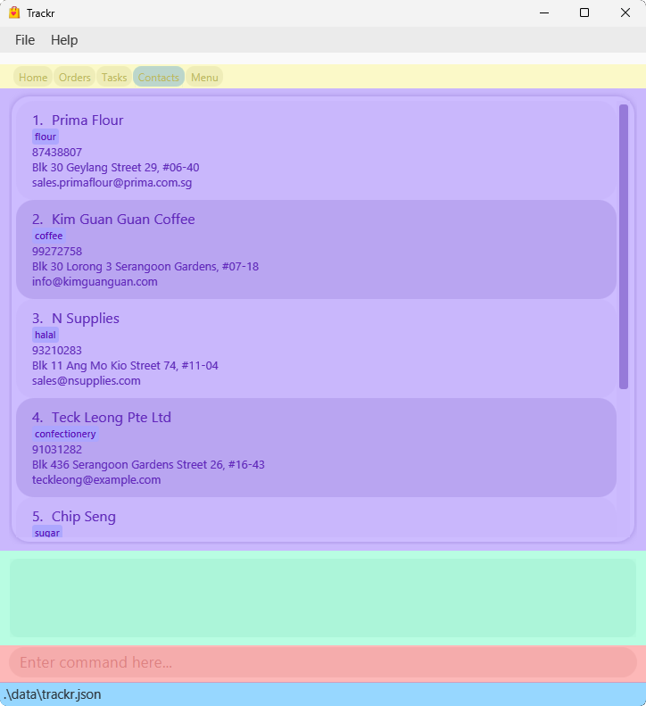

# Overview

Introducing **Trackr - the ultimate desktop application** designed to simplify the delivery management process for your home business!

With Trackr, you can seamlessly manage your suppliers, orders and tasks.

It utilizes a Command Line Interface (CLI), while still enjoying the benefits of a user-friendly Graphical User Interface (GUI).

Say goodbye to the hassle of Excel and the stress of time constraints! Whether you're a busy home business owner or simply looking for an efficient and streamlined solution, Trackr is the perfect fit for you.
Experience the convenience of delivery management like never before with Trackr.

# About This Guide

This guide shows you the relevant information for setting up and using Trackr to manage your suppliers, orders and tasks.

You can click on any of the links below to navigate to the respective sections for more information.

# Table of Contents

<!-- TOC -->
* [1 Quick start](#1-quick-start)
  * [1.1 Prerequisites](#11-prerequisites)
    * [1.1.1 Java](#111-java)
    * [1.1.2 Glossary](#112-glossary)
  * [1.2 Installation](#12-installation)
  * [1.3 Utilisation](#13-utilisation)
  * [1.4 Navigating the User Interface](#14-navigating-the-user-interface)
    * [1.4.1 Home Page](#141-home-page)
    * [1.4.2 Data Tab](#142-data-tab)
* [2 Commands](#2-commands)
  * [2.1 Add](#21-add)
    * [2.1.1 Adding a supplier: `add_supplier`](#211-adding-a-supplier-addsupplier)
    * [2.1.2 Adding an order: `add_order`](#212-adding-an-order-addorder)
    * [Adding a task: `add_task`](#adding-a-task-addtask)
    * [Adding a menu item: `add_item`](#adding-a-menu-item-additem)
  * [Edit](#edit)
    * [Editing a supplier: `edit_supplier`](#editing-a-supplier-editsupplier)
    * [Editing an order: `edit_order`](#editing-an-order-editorder)
    * [Editing a task: `edit_task`](#editing-a-task-edittask)
    * [Editing a menu item: `edit_item`](#editing-a-menu-item-edititem)
  * [Find](#find)
    * [Finding a supplier: `find_supplier`](#finding-a-supplier-findsupplier)
    * [Finding an order: `find_order`](#finding-an-order-findorder)
    * [Finding a task: `find_task`](#finding-a-task-findtask)
    * [Finding a menu item: `find_item`](#finding-a-menu-item-finditem)
  * [Delete](#delete)
    * [Deleting a supplier: `delete_supplier`](#deleting-a-supplier-deletesupplier)
    * [Deleting an order: `delete_order`](#deleting-an-order-deleteorder)
    * [Deleting a task: `delete_task`](#deleting-a-task-deletetask)
    * [Deleting a menu item: `delete_item`](#deleting-a-menu-item-deleteitem)
  * [Sort](#sort)
    * [Sorting a task: `sort_task`](#sorting-a-task-sorttask)
    * [Sorting a order: `sort_order`](#sorting-a-order-sortorder)
  * [List](#list)
    * [Listing all suppliers: `list_supplier`](#listing-all-suppliers-listsupplier)
    * [Listing all orders: `list_order`](#listing-all-orders-listorder)
    * [Listing all tasks: `list_task`](#listing-all-tasks-listtask)
    * [Listing all menu items: `list_menu`](#listing-all-menu-items-listmenu)
  * [Clear](#clear)
    * [Clear all supplier entries: `clear_supplier`](#clear-all-supplier-entries-clearsupplier)
    * [Clear all order entries: `clear_order`](#clear-all-order-entries-clearorder)
    * [Clear all task entries: `clear_task`](#clear-all-task-entries-cleartask)
    * [Clear all menu item entries: `clear_menu`](#clear-all-menu-item-entries-clearmenu)
  * [Switch](#switch)
    * [Switching tabs: `tab`](#switching-tabs-tab)
  * [Others](#others)
    * [Viewing help: `help`](#viewing-help-help)
    * [Uploading a csv file](#uploading-a-csv-file)
    * [Exiting the program: `exit`](#exiting-the-program-exit)
* [Data](#data)
    * [Saving the data](#saving-the-data)
    * [Editing the data file](#editing-the-data-file)
    * [Upcoming features `[coming soon]`](#upcoming-features-coming-soon)
* [FAQ](#faq)
* [5 Summary](#5-summary)
* [5.1 Prefix Summary](#51-prefix-summary)
  * [5.2 Command Summary](#52-command-summary)
<!-- TOC -->

--------------------------------------------------------------------------------------------------------------------
<div style="page-break-after: always;"></div>

# 1 Quick start

## 1.1 Prerequisites

### 1.1.1 Java

Ensure you have <ins>[Java `11`](https://www.oracle.com/sg/java/technologies/javase/jdk11-archive-downloads.html)</ins> or above installed.

<div markdown="block" class="alert alert-tip">

:bulb: **Tip**

**How to check your current Java version:**

**Step 1.** Open up **Command Prompt** (Windows) or **Terminal** (Mac and Linux).

**Step 2.** Type and run the command `java -version`.

**Step 3.** Check the version number provided (`xxx`) is at least `11`.

An example is shown below.

  ```
  > java -version
  java version "xxx" <Other information>
  ```

</div>

### 1.1.2 Glossary

* **Mainstream OS**: Windows, Linux, Unix, OS-X
* **CLI**: Command-Line Interface
* **GUI**: Graphical User Interface
* **Supplier**: Supplier refers to someone whom the user seasonally or frequently orders goods from
* **Customer**: Customer refers to someone whom the user receives an order from
* **Order**: Order refers to the customers' orders the user accepts
* **Task**: Task refers to any to-dos the user may have, it need not be related to suppliers or orders (For instance, it can be about tidying inventory)
* **Menu Item**: Menu Item refers to any inventory/ stock that the user is selling to customers.
* **Tag**: Tags are associated with suppliers, users can tag the supplier with any keyword they want, number of tags are not restricted
* **Status**: Statuses are associated with tasks and orders, one entry of task/order can only have one status and the type of status that can be added is restricted

## 1.2 Installation

**Step 1.** Download the latest `trackr.jar` from [here](https://github.com/AY2223S2-CS2103T-W15-2/tp/releases).

**Step 2.** Copy the file to the folder where you will use Trackr.

**Step 3.** Double-click on the `trackr.jar` file.

<div markdown="block" class="alert alert-tip">

:bulb: **Tip**

**Trackr does not open?**

**Step 1.** Open a command terminal.

**Step 2.** Type in `java -jar ` (Keep in mind of the space at the end).

**Step 3.** Drag and drop `trackr.jar` into the command terminal.

**Step 4.** Press enter and execute the command.

An example of the final command is displayed below.

  ```
  > java -jar xxxx/xxxx/trackr.jar
  ```

</div>

A GUI similar to the below should appear in a few seconds, with the following areas:

* <span style="background-color:rgba(252.4, 248.4, 124.1, 0.5)">Tabs</span>
* <span style="background-color:rgba(0.0, 255.0, 0.0, 0.5)">Sales (Total Revenue and Profit)</span>
* <span style="background-color:rgba(246.2, 149.6, 28.3, 0.5)">Simplified Orders</span>
* <span style="background-color:rgba(8.7, 68.0, 237.2, 0.5)">Simplified Tasks</span>
* <span style="background-color:rgba(237.2, 8.7, 176.5, 0.5)">Simplified Menu</span>
* <span style="background-color:rgba(0.0, 255.0, 197.0, 0.5)">Command Result Screen</span>
* <span style="background-color:rgba(255.0, 0.0, 0.0, 0.5)">Command Input Box</span>
* <span style="background-color:rgba(128.9, 0.0, 255.0, 0.5)">Data List</span>

For more information on how to navigate the User Interface (UI), you can go [here](#14-navigating-the-user-interface)

<p align="center">
  
  <br>Figure 1.2.1: Trackr Home Tab UI
</p>

<p align="center">
  
  <br>Figure 1.2.2: Trackr Data Tab UI
</p>

<div markdown="block" class="alert alert-warning">

:warning: **Warning**<br>

`Trackr` will create a `data` folder with `tracker.json` data file inside.

If you are a _new_ user, do not edit this file.

Otherwise, you can check out how to edit it [here](#editing-the-data-file)

</div>

## 1.3 Utilisation

**Step 1:** Enter your command into the <span style="background-color:rgba(255.0, 0.0, 0.0, 0.5)">Command Input Box</span>.

You can try the following commands to add a task:

* `tab TASKS`
* `add_task n/Buy eggs d/12/12/2040`

**Step 2:** Observe the changes, with the output of the command inside the <span style="background-color:rgba(0.0, 255.0, 197.0, 0.5)">Command Result Screen</span>.

<div markdown="block" class="alert alert-tip">

:bulb: **Tip**

You can find out all the usable commands [here](#2-commands) or return to the [Table of Contents](#table-of-contents) to find your desired command.

</div>

## 1.4 Navigating the User Interface

Here, we will explain how you can navigate around our application.

**<span style="background-color:rgba(255.0, 0.0, 0.0, 0.5)">Command Input Box</span>**

You can input your commands into the command input box, press **Enter** for your command to execute. A result message would be shown at the <span style="background-color:rgba(0.0, 255.0, 197.0, 0.5)">Command Result Screen</span>.

If there is an error with the command, the input would turn **<span style="color:red">red</span>** and you can refer to the <span style="background-color:rgba(0.0, 255.0, 197.0, 0.5)">Command Result Screen</span> for help.

**<span style="background-color:rgba(0.0, 255.0, 197.0, 1)">Command Result Screen</span>**

Command result screen shows the success message for your command that executed successfully.

Otherwise, it would show an error message with hints on what issues the command you entered has.

**<span style="background-color:rgba(252.4, 248.4, 124.1, 1)">Tabs</span>**

We provide multiple tabs for you to use. This includes the home page, with the data tabs that display your data for the respective information (i.e. Order, Tasks, Contacts, Menu).

You can navigate between them by clicking on the tab itself, or input the command `tab` with the respective tab.

For more information, you can go [here](#switching-tabs-tab).

### 1.4.1 Home Page

Upon starting the application, you will see a convenient dashboard with summarised information that you need for your business.

**<span style="background-color:rgba(0.0, 255.0, 0.0, 0.5)">Sales (Total Revenue and Profit)</span>**

Trackr keeps track of all orders submitted and automatically updates the total revenue and profit that your business has generated with us.

**<span style="background-color:rgba(246.2, 149.6, 28.3, 0.5)">Simplified Orders</span>**

Order list shows a condensed preview of your outstanding orders, with their relevant details (i.e. customer name, promised delivery date and your progress).

**<span style="background-color:rgba(8.7, 68.0, 237.2, 0.5)">Simplified Tasks</span>**

Task list shows all outstanding miscellaneous tasks that you may have for your current operations.

**<span style="background-color:rgba(237.2, 8.7, 176.5, 0.5)">Simplified Menu</span>**

Menu list shows all the items that you have up for sale currently, with their details (cost price, selling price and profit margin) at a glance.

### 1.4.2 Data Tab

**<span style="background-color:rgba(128.9, 0.0, 255.0, 0.5)">Data List</span>**

Data list contains all of your respective data labelled out in full. The layout of the respective data information can be seen below:

* Orders

< Labelled Order Card Figure Here >

* Tasks

< Labelled Task Card Figure Here >

* Contacts

< Labelled Contact Card Figure Here >

* Menu

< Labelled Menu Card Figure Here >

--------------------------------------------------------------------------------------------------------------------

# 2 Commands

<div markdown="block" class="alert alert-info">

**:information_source: Notes about the command format:**<br>

* All command keywords must be in lower-case and are case-sensitive.<br>
  e.g. For add supplier command:<br>
  :check_mark_button: `add_supplier` is valid.<br>
  :cross_mark: `ADD_SUPPLIER` and `Add_Supplier` are invalid.<br>

* Words in `UPPER_CASE` are the parameters to be supplied by you.<br>
  e.g. in `add_supplier n/NAME`, you fill in the `NAME` parameter with the supplier name (i.e. `add_supplier n/John Doe`).

* Prefixes of the parameters must be in lower-case and are case-sensitive.<br>
  e.g. `n/` in `add_s n/NAME` is case-sensitive (i.e. `N/` is an invalid prefix).

* Items in square brackets are optional.<br>
  e.g. `n/NAME [t/TAG]` can be used as `n/John Doe t/friend` or as `n/John Doe`.

* Items with `…​` after them can be used any number of times within the command.<br>
  e.g. `[t/TAG]…​` can be used as ` ` (omitted), `t/flour`, `t/flour t/sugar` etc.

* Parameters can be in any order.<br>
  e.g. if the command specifies `n/NAME p/PHONE_NUMBER`, `p/PHONE_NUMBER n/NAME` is also acceptable.

* If a parameter is expected only once in the command, but you specified it multiple times, only the **last** occurrence of the parameter will be taken.<br>
  e.g. if you specify `p/12341234 p/56785678`, only `p/56785678` will be taken.

* Extraneous parameters will be ignored.<br>
  e.g. if the command specifies `help 123`, it will be interpreted as `help`.

</div>

<div markdown="block" class="alert alert-tip">

:bulb: **Tip**

* General format of commands:<br>
  <div style="background-color:silver; font-weight:bold">
  <span style="color:darkblue">&lt;command&gt;</span>
  <span> </span>
  <span style="color:indigo">&lt;index&gt;</span>
  <span> </span>
  <span style="color:brown">&lt;prefix/paramater&gt; &lt;prefix/paramater&gt; ...</span>
  </div>
  
  * Index depends on the command.
  * Number of parameters depend on the command.

* All command keywords have shortcut alternatives. They are the command type and the first letter of the information type.<br>
  For example:<br>
  * `add_s` is the same as `add_supplier`
  * `edit_o` is the same as `edit_order`
  * `list_t` is the same as `list_task`

* You can find out the constraints for the parameters with their corresponding prefix [here](#51-prefix-summary).

</div>

## 2.1 Add

Adding of an information to the specific list.

### 2.1.1 Adding a supplier: `add_supplier`

Adds a supplier to the list of suppliers.

Syntax: `add_supplier n/NAME p/PHONE_NUMBER e/EMAIL a/ADDRESS [t/TAG]…​`

<div markdown="block" class="alert alert-example">

:clipboard: **Example 1: Standard command without tags**

* `add_supplier n/John Doe p/98765432 e/johnd@example.com a/John Street`<br>
  Adds a supplier with the following details:
  * Name: `John Doe`
  * Phone Number: `98765432`
  * Email: `johnd@example.com`
  * Address: `John Street`
  * Tags: Empty

:clipboard: **Example 2: Shortcut command with tags**

* `add_s n/Betsy Cow t/diary e/betsycow@example.com a/Betsy Street p/12345678 t/meat`<br>
  Adds a supplier with the following details:
  * Name: `Betsy Cow`
  * Phone Number: `12345678`
  * Email: `betsycow@example.com`
  * Address: `Betsy Street`
  * Tags: `Diary`, `Meat`

</div>

### 2.1.2 Adding an order: `add_order`

Adds an order into the list of orders.

Syntax: `add_order on/ORDER_ITEM q/QUANTITY d/DEADLINE n/CUSTOMER_NAME a/CUSTOMER_ADDRESS p/CUSTOMER_PHONE_NUMBER [s/STATUS]`

* An order can have any number of remarks.
* Either customer phone number or email address must be provided.
* Status available for setting are: Not Delivered, In Progress and Delivered.
* Key in `N` or `n` for Not Delivered, `I` or `i` for In Progress, and `D` or `d` for Delivered.
* If no status is provided, it is defaulted to Not Delivered.

Examples:

* `add_order n/John Doe a/John Street d/2023-12-12 q/10 on/Cupcakes p/91234567`
* `add_o on/Birthday Cake q/1 n/Betsy Cow a/Betsy Street d/2023-03-03 s/N`

### Adding a task: `add_task`

Adds a task to the list of tasks.

Syntax: `add_task n/TASK_DESCRIPTION d/DEADLINE [s/STATUS]`

* Status available for setting are: `N` / `n` (Not done), `D` / `d` (Done).
* If no status is provided, it is defaulted to `N` (Not done).

Examples:

* `add_task n/Buy cookie cutter d/2022-12-22`
* `add_t n/Buy a card d/2023-12-23 s/D`

### Adding a menu item: `add_item`

Adds a menu item to the menu.

Syntax: `add_item n/ITEM_NAME pr/PRICE c/COST`

* When entering price and cost data, you may only
  * input positive numbers.
    * For example, you can input the number 5, not -5.
  * choose to include number with a decimal point. A decimal point looks like this: `.` However, you can only key in up to 2 numbers after the decimal point.
    * For example, the number 5.75 but not 5.752.
* After you have add an item, note that the profit margin displayed can be positive or negative number.
  * For example, if you see `Profit Margin: $-0.50` and  `Profit Margin: $2.00`, both are correct. However, this means that you are making a lost on your menu item.

Examples:

* `add_item n/Chocolate cookie pr/5 c/2.50`
* `add_i n/Harley Davidson Shirt pr/40 c/8.50`

## Edit

### Editing a supplier: `edit_supplier`

Edit an existing supplier’s information.

Syntax: `edit_supplier INDEX [n/NAME] [p/PHONE] [e/EMAIL] [a/ADDRESS] [t/TAG]…​`

* Edits the supplier at the specified `INDEX`.
* The index refers to the number shown in the suppliers list displayed.
* The index **must be a positive integer** 1, 2, 3, …​
* You have to key in at least one of the optional fields.
* Existing values will be replaced with the new values given.
* When editing tags, the existing tags of the supplier will be removed and replaced with the given tag (editing of tags is not accumulative).
* Typing `t/` without any input will remove all the existing tags.
* To change status, use `N` or `n` for Not Delivered, `I` or `i` for In Progress, and `D` or `d` for Delivered.

Examples:

* `edit_supplier 1 n/Johnny p/90138482 t/` edits the 1st supplier's name to `Johnny`, phone number to `90138482` and removed all of its tags
* `edit_s 3 t/Supplies Flour e/mark@example.com` replaced the 3rd supplier's tags to `Supplies Flour` and edited its email to `mark@example.com`

### Editing an order: `edit_order`

Edits an order that is present in the order list.

Syntax: `edit_order INDEX [n/CUSTOMER_NAME] [l/CUSTOMER_LOCATION] [p/CUSTOMER_PHONE_NUMBER] [e/CUSTOMER_EMAIL] [d/DEADLINE] [q/QUANTITY] [on/ORDER_NAME] [s/STATUS]…​`

* Edits the order at the specific `INDEX`. The index refers to the number shown in the orders list displayed. The index must be a positive integer 1, 2, 3, …
* You have to key in at least one of the optional fields.
* Existing values will be replaced with the input values.
* When editing remarks, the existing remarks of the order will be removed and replaced with the given remarks (editing of tags is not accumulative).
* You can remove the remarks by typing r/ without specifying any remarks after it.

Examples:

* `edit_order 1 p/91234567 d/2023-05-05` edits the phone number of the 1st order to 91234567 and changes the deadline to be 2023-05-05
* `edit_o 3 q/20` edits the quantity of food for the 3rd order to 20 and clears all remarks

### Editing a task: `edit_task`

Edits a task present in the task list.

Syntax: `edit_task INDEX [n/TASK_DESCRIPTION] [d/DEADLINE] [s/STATUS]`

* Edits the task at the specific `INDEX`. The index refers to the number shown in the tasks list displayed. The index must be a positive integer 1, 2, 3, …
* You have to key in at least one of the optional fields.
* Existing values will be replaced with the input values.
* When editing status, the existing status of the order will be removed and replaced with the given status.

Examples:

* `edit_task 1 n/Get creamer` edits the 1st task description to be "Get creamer"
* `edit_t 3 d/2023-12-31 s/N` edits the 3rd task deadline to 2023-12-31 and sets the status as not done

### Editing a menu item: `edit_item`

Edits an item present in the menu.
Syntax: edit_item INDEX [n/ITEM_NAME] [pr/PRICE] [c/COST]

* Edits the item at the specific INDEX. The index refers to the number shown in the menu list displayed. The index must be a positive integer 1, 2, 3, …
* You have to key in at least one of the optional fields.
* Existing values will be replaced with the input values.
* Take note, when entering the price and cost, it cannot take negative numbers.
  * For example, `pr/2.40` is allowed but not `pr/-2.40`.

Examples:

* edit_item 1 n/Coffee pr/2.50 c/1.50 edits the name of the first menu item to "Coffee", sets the price to $2.50 and the cost to $1.50.
* edit_i 3 d/Our signature burger p/8.99 c/2 edits the description of the third menu item to "Our signature burger", sets the price to $8.99 and the cost to $2.

## Find

### Finding a supplier: `find_supplier`

Find suppliers whose information matches with any of the given parameters.

Syntax: `find_supplier [n/NAME] [t/TAG]…​`

* Search is case-insensitive, e.g. `mark` will match `Mark`.
* The order of the keywords does not matter, e.g. `n/Mark Lee` will match with `Lee Mark`.
* At least one of the optional fields must be keyed in.
* More than one tag can be given.
* Only full words will match e.g. `Mar` will not match with `Mark`.
* People matching with at least one keyword will be returned (i.e. `OR` search).
  e.g. `n/Mark Lee` will return `Mark Tan`, `Lee Chan`.

Examples:

* `find_task n/PHOON HUAT` returns supplier `Phoon Huat` and `John Phoon`
* `find_s n/PHOON t/eggs t/flour` returns supplier `Phoon Huat` that supplies both `eggs` and `flour`

### Finding an order: `find_order`

Find orders whose information matches with any of the given parameters.

Syntax: `find_order [on/ORDER_NAME] [q/QUANTITY] [s/STATUS] [d/DEADLINE] [n/CUSTOMER_NAME] [p/CUSTOMER_PHONE_NUMBER] [a/CUSTOMER_ADDRESS]…​`

* Search is case-insensitive, e.g. `mark` will match `Mark`.
* The order of the keywords does not matter, e.g. `n/Mark Lee` will match with `Lee Mark`.
* At least one of the optional fields must be keyed in.
* Only full words will match e.g. `Mar` will not match with `Mark`.
* People matching with at least one keyword will be returned (i.e. `OR` search).
  e.g. `n/Mark Lee` will return `Mark Tan`, `Lee Chan`.

Examples:

* `find_order on/Chocolate` returns orders `Chocolate Cake` and `Chocolate Cookies`
* `find_s on/Cake d/01/01/2023` returns order `Chocolate Cake` that has a delivery dateline of `01/01/2023`

### Finding a task: `find_task`

Find tasks with information that matches with any of the given parameters.

Syntax: `find_task [n/TASK_DESCRIPTION] [d/DEADLINE] [s/STATUS]`

* Search is case-insensitive, e.g. `match` will match `Match`.
* The order of the keywords does not matter, e.g. `n/Mark Lee` will match with `Lee Mark`.
* At least one of the optional fields must be keyed in.
* Only full words will match e.g. `Mar` will not match with `Mark`.
* Tasks matching with at least one keyword will be returned (i.e. `OR` search).
  e.g. `n/order flour` will match with `order sugar` and `order 10kg flour`.

Examples:

* `find_task n/order flour` returns `Order milk` and `mix flour`
* `find_t n/buy eggs d/2023-02-17` returns tasks with `buy` or `egg` with deadline of `2023-02-17`
* `find_t s/N` returns all tasks not done

### Finding a menu item: `find_item`

Find tasks with information that matches with any of the given parameters.

Syntax: `find_item [ITEM_NAME]`

* Search is case-insensitive, e.g. `match` will match `Match`.
* The order of the keywords does not matter, e.g. `n/Chocolate cookies` will match with `Cookies chocolate`.
* At least one of the optional fields must be keyed in.
* Only full words will match e.g. `Choco` will not match with `Chocolate`.
* Menu Items matching with at least one keyword will be returned (i.e. `OR` search).
  e.g. `n/chocolate cookies` will match with `chocolate cupcake` and `hot chocolate`.

Examples:

* `find_item n/vanilla cupcake` returns `vanilla ice cream` and `Disney cupcake`
* `find_i n/shirt d/2023-02-17` returns menu items with `shirt`

## Delete

### Deleting a supplier: `delete_supplier`

Deletes the specified supplier from the contact list.

Syntax: `delete_supplier INDEX`

* Deletes the task at the specified `INDEX`.
* The index refers to the number shown in the task list displayed.
* The index **must be a positive integer** 1, 2, 3, …

Examples:

* `delete_supplier 2` deletes the second supplier
* `find_s n/John` followed by `delete_s 3` deletes the 1st supplier in the results of the `find_s` command with name `John`

### Deleting an order: `delete_order`

Syntax: `delete_order INDEX`

* Deletes the order at the specified `INDEX`.
* The index refers to the index number shown in the displayed order list.
* The index **must be a positive integer** 1, 2, 3, …

Examples:

* `list` followed by `delete_order 2` deletes the 2nd order in Trackr.
* `find Cake` followed by `delete_order 1` deletes the 1st order in the results of the `find` command.

### Deleting a task: `delete_task`

Deletes the specified task from the task list.

Syntax: `delete_task INDEX`

* Deletes the task at the specified `INDEX`.
* The index refers to the number shown in the task list displayed.
* The index **must be a positive integer** 1, 2, 3, …

Examples:

* `delete_task 2` deletes the first task
* `find_t flour` followed by `delete_t 3` deletes the 1st task in the result of the `find_t` command

### Deleting a menu item: `delete_item`

Deletes the specified item from the menu.

Syntax: `delete_item INDEX`

* Deletes the item at the specified `INDEX`.
* The index refers to the number shown in the menu displayed.
* The index **must be a positive integer** 1, 2, 3, …

Examples:

* `delete_menu 2` deletes the first task
* `find_i cupcake` followed by `delete_m 3` deletes the 1st menu item in the result of the `find_i` command

## Sort

### Sorting a task: `sort_task`

Syntax: `sort_task [c/CRITERIA]`

* Sorts all the tasks according to a criteria.
* Criteria available are: `Time_added`, `Deadline`, `Status`, `Name` and `Status_and_deadline`.
* Criteria is case-insensitive (i.e. `time_added`, `TIME_ADDED` `Time_Added` are all valid).
* The default criteria (when no criteria is specified) is `Status_and_deadline`.

* Sorting by `Time_added` puts the tasks added first at the top and tasks added later below.
* Sorting by `Deadline` puts the tasks with the earlier deadlines on the top of tasks with further deadlines.
* Sorting by `Status` puts the tasks with "Not Done" status on top and tasks with "Done" status below.
* Sorting by `Name` sorts the tasks in a lexicographical order (ignoring-case)
  (i.e. A task with the task name "a" will be placed on top of a different task with the task name"B").
* Sorting by `Status_and_deadline` puts the tasks that are not done and have the earliest deadlines
  on top and tasks done and have the furthest deadlines below.<br>
  (i.e. The tasks will be sorted in the order:
  Not done and earliest deadline > Not done and latest deadline > Done and earliest deadline > Not Done and latest deadline)

Examples:

* `sort_t` sorts all tasks by their status and deadline
* `sort_task c/deadline` sorts all tasks by their deadlines
* `find_t s/N` followed by `sort_t` would sort all the tasks but only the sorted result of the `find_t` command will be displayed<br>
  (to get the sorted list of all the items, use the `list_t` command)

### Sorting a order: `sort_order`

Syntax: `sort_order [c/CRITERIA]`

* Sorts all the orders according to a criteria.
* Criteria available are: `Time_added`, `Deadline`, `Status`, `Name` and `Status_and_deadline`.
* Criteria is case-insensitive (i.e. `time_added`, `TIME_ADDED` `Time_Added` are all valid).
* The default criteria (when no criteria is specified) is `Status_and_deadline`.

* Sorting by `Time_added` puts the orders added first at the top and tasks added later below.
* Sorting by `Deadline` puts the orders with the earlier deadlines on the top of tasks with further deadlines.
* Sorting by `Status` puts the orders in the order of "Not Delivered" > "In Progress" > "Delivered" (with orders that are "Not Delivered" placed on top).
* Sorting by `Name` sorts the orders in a lexicographical order (ignoring-case)
  (i.e. A order with the order name "a" will be placed on top of a different order with the order name "B").
* Sorting by `Status_and_deadline` first sorts the orders using their status and then sort them with deadlines.<br>
  (i.e. The orders will first be sorted in the order of: Not delivered > In progress > Delivered,<br>
  then, among orders of the same status, they will be sorted in the order of: earliest deadline to furthest deadline)

Examples:

* `sort_o` sorts all orders by their status and deadline
* `sort_order c/status` sorts all orders by their deadlines
* `find_o s/N` followed by `sort_o` would sort all the orders but only the sorted result of the `find_o` command will be displayed<br>
  (to get the sorted list of all the orders, use the `list_o` command)

<p align="center">
  
  <br>Figure 2: `sort_o` Example
</p>

## List

### Listing all suppliers: `list_supplier`

Shows a list of all suppliers in the supplier list.

Syntax `list_supplier`

### Listing all orders: `list_order`

Shows a list of all orders in the order list.

Syntax `list_order`

### Listing all tasks: `list_task`

Shows a list of all tasks in the task list.

Syntax `list_task`

### Listing all menu items: `list_menu`

Shows a list of all menu items in the menu item list.

Syntax `list_menu`

## Clear

### Clear all supplier entries: `clear_supplier`

Clears all supplier entries from the supplier list.

Syntax: `clear_supplier`

### Clear all order entries: `clear_order`

Clears all order entries from the order list.

Syntax: `clear_order`

### Clear all task entries: `clear_task`

Clears all task entries from the task list.

Syntax: `clear_task`

### Clear all menu item entries: `clear_menu`

Clears all menu item entries from the menu item list.

Syntax: `clear_menu`

## Switch

### Switching tabs: `tab`

Switch to another tab.

Syntax: `tab t/TAB`

* The available tabs are: `Home`, `Orders`, `Contacts`, `Menu`

Examples:

* `tab t/HOME` switches the tab to the `Home` tab

## Others

### Viewing help: `help`

Shows a message explaining how to access the help page.


Syntax: `help`

### Uploading a csv file

Uploads a valid csv file onto Trackr and parses each add command for `Task`, `Order` and `Suppliers`, and adds them to their respective lists. It is important that a strict format is used in order for the commands to be parsed correctly.

* First indicate what item is to be added. (i.e. `Orders`)
* List out the item fields in the next row. (i.e. `OrderName`, `Quanity`, `Deadline`, etc.)
* Fill in the valid values for each field. (i.e. `Chocolate Cookies`, `10`, `10/01/2023`, etc.)
* If there are any optional fields (i.e. `Suppler`'s `Tag` field), indicate it with a '-' if you don't wish to put any values in that particular field.

<p align="center">
  
  <br>Figure 3: Valid csv file Example
</p>

### Exiting the program: `exit`

Exits the program.

Syntax: `exit`

# Data

### Saving the data

Save changes after any command executed successfully. There is no need to save manually.

### Editing the data file

Trackr data are saved as a JSON file `[JAR file location]/data/trackr.json`. Advanced users are welcome to update data directly by editing that data file.

<div markdown="span" class="alert alert-warning">
:exclamation: **Caution:**
If your changes to the data file makes its format invalid, Trackr will discard all data and start with an empty data file at the next run.
</div>

### Upcoming features `[coming soon]`

* Highlight overdue orders.
* View sales (tabulated or GUI) to track your business’s growth.

--------------------------------------------------------------------------------------------------------------------

# FAQ

**Q**: How do I transfer my data to another Computer?<br>
**A**: Install the app in the other computer and overwrite the empty data file it creates with the file that contains the data of your previous Trackr home folder.

--------------------------------------------------------------------------------------------------------------------

# 5 Summary

# 5.1 Prefix Summary

| Parameter | Prefix | Rules |
|-----------|--------|-------|
|           |        |       |
|           |        |       |
|           |        |       |


## 5.2 Command Summary

| Action     | Format, Examples                                                                                                                                                                                                                                                                                                                                                                               |
|------------|------------------------------------------------------------------------------------------------------------------------------------------------------------------------------------------------------------------------------------------------------------------------------------------------------------------------------------------------------------------------------------------------|
| **Add**    | `add_supplier / add_s` <br> e.g., `add_s n/Betsy Cow t/diary e/betsycow@example.com a/Betsy Street p/1234567 t/meat` <br> <br> `add_order / add_o` <br> e.g., `add_o n/John Doe l/John Street d/2023-12-12 q/10 on/Cupcakes` <br> <br> `add_task / add_t` <br> e.g., `add_t d/Buy a card d/2023-12-23 s/Completed` <br> <br> `add_item / add_i` <br> e.g., `add_i n/Chocolate Cake pr/30 c/10` |
| **Edit**   | `edit_supplier / edit_s` <br> e.g., `edit_s 3 t/Supplies Flour e/mark@example.com` <br> <br> `edit_order / edit_o` <br> e.g., `edit_o 3 q/20` <br> <br> `edit_task / edit_t` <br> e.g., `edit_t 1 s/` <br> <br> `edit_item / edit_i` <br> e.g., `edit_i 2 n/Chocolate Chip Cookie`                                                                                                             |
| **Delete** | `delete_supplier / delete_s` <br> e.g., `delete_s 2` <br> <br> `delete_order / delete_o` <br> e.g., `delete_o 1` <br> <br> `delete_task / delete_t` <br> e.g., `delete_t 4` <br> <br> `delete_item / delete_i` <br> e.g., `delete_i 2`                                                                                                                                                         |
| **Find**   | `find_supplier / find_s` <br> e.g., `find_s n/PHOON t/eggs` <br> <br> `find_order / find_o` <br> e.g., `find_order on/Chocolate` <br> <br> `find_task / find_t` <br> e.g., `find_t s/N` <br> <br> `find_item / find_i` <br> e.g., `find_i Chocolate`                                                                                                                                           |
| **Sort**   | `sort_task` / `sort_t` <br> e.g., `sort_t c/Deadline` <br> <br> `sort_order / sort_o` <br> e.g., `sort_order c/Deadline`                                                                                                                                                                                                                                                                       |
| **List**   | `list_supplier` <br> <br> `list_order` <br> <br> `list_task` <br> <br> `list_menu`                                                                                                                                                                                                                                                                                                             |
| **Clear**  | `clear_supplier` <br> <br> `clear_order` <br> <br> `clear_task` <br> <br> `clear_menu`                                                                                                                                                                                                                                                                                                         |
| **Tab**    | `tab` <br> e.g., `tab Home`                                                                                                                                                                                                                                                                                                                                                                    |
| **Help**   | `help`                                                                                                                                                                                                                                                                                                                                                                                         |
| **Exit**   | `exit`                                                                                                                                                                                                                                                                                                                                                                                         |
