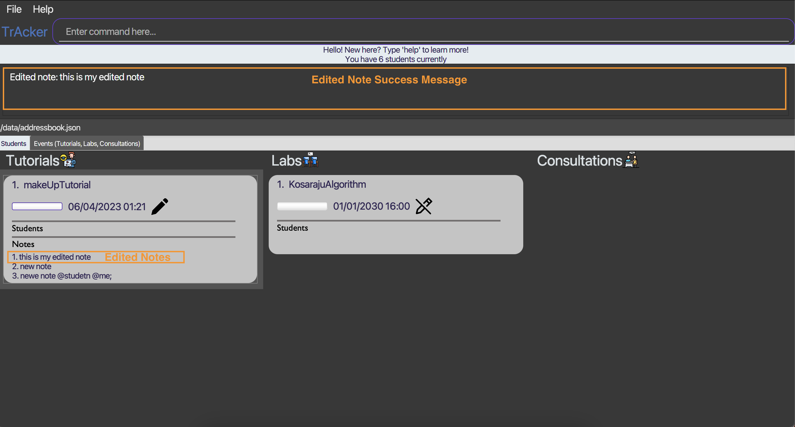
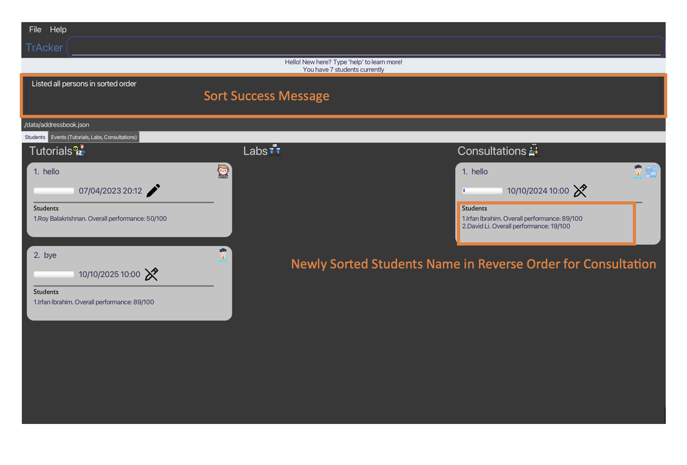
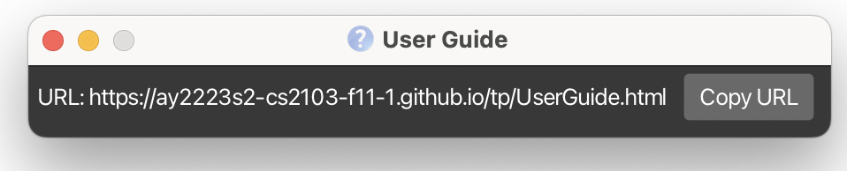

---
layout: page
title: User Guide
--------------------------------------------------------------------------------------------------------------------

# Table of Contents
- [Quick Start](#quick-start)
- [About TrAcker](#about-tracker)
- [User Guide Notations](#userguide-notations)
- [Event Features](#event-features)
    - [Add Tutorial](#add-tutorial)
    - [Add Lab](#add-lab)
    - [Add Consultation](#add-consultation)
    - [Edit An Event](#edit-event)
    - [Delete Event](#delete-event)
- [Student Features](#student-features)
    - [Add Student](#adding-student)
    - [Delete Student](#deleting-student)
    - [Add Student to Event](#add-student-to-event)
    - [Delete Student from Event](#delete-student-from-event)
- [Note Features](#note-features)
    - [Add Note For Event](#add-note-for-event)
    - [Delete Note From Event](#delete-note-from-event)
    - [Edit Note in Event](#edit-note-in-event)
- [Sort Features](#sort-students)
    - [Sort Students](#sort-students)
    - [Filter Students](#filter-students)
- [Help Features](#help-features)
- [Application Features](#application-features)
    - [Exit from TrAcker](#exit)
    - [Navigate Tabs](#switch-tabs)
- [Command Summary](#command-summary)

--------------------------------------------------------------------------------------------------------------------

## Quick start

1. Ensure you have Java `11` or above installed in your computer.

2. Download the latest `TrAcker.jar` from [here](https://github.com/AY2223S2-CS2103-F11-1/tp/releases/tag/v1.3.1).

3. Copy the file to the folder you want to use as the home folder for your TrAcker.

4. Open a command terminal, `cd` into the folder you put the jar file in, and use the `java -jar TrAcker.jar` command to run the application.<br>
   A GUI similar to below should appear in a few seconds. Note how the app contains some sample data.<br>
   

--------------------------------------------------------------------------------------------------------------------

<div id='about-tracker'></div>

## About TrAcker

TrAcker is a **desktop app for CS2040 Teaching Assistants (TAs) to centralise the CS2040 tasks involving them.
It is optimised for use via a Command Line Interface (CLI)** while still having benefits of a Graphical User Interface (GUI).
If you can type fast, TrAcker will aid the task management for CS2040 TAs. Commands are similar to vim / terminal commands rather than intuitive commands since
CS2040 TAs are familiar with it.

Let's clear a little confusion that might arise:
- Why are students not allowed to be added together with the creation of an event?
  - This is because the app is meant for an attendance taking for a CS2040 TA who plans ahead. So, if a student can be added with an event,
   it defeats the purpose of it being an attendance taking application.
- Why are overlapping event date and time not allowed to be added?
  - It is because TrAcker also functions as a schedule application for the CS2040 TA. So, if overlapping events
    can be added, the TA will be unsure if they are actually free during that period.
- Tutorial duration is fixed at 1 hour.
- Lab duration is fixed at 2 hours.
- Consultation duration is fixed at 1 hour.

----------------------------------------------------------------------

<div id='userguide-notations'></div>

## User Guide Notations

<div markdown="block" class="alert alert-info">

* Words in `UPPER_CASE` are the parameters to be supplied by you.
  * e.g. in `rm INDEX`, `INDEX` is a parameter which can be used as `rm 1`.
* Items in square brackets are optional.
  * e.g. `touch Tutorial/NAME [-date dd/MM/yyyy HH:mm]` can be used as `touch Tutorial/firstTutorial` or as `touch Tutorial/firstTutorial -date 10/10/2025 10:00`.
* Parameters, excluding index parameters, can be in any order.
  * e.g. if the command specifies `n/NAME telegram/TELEGRAM_HANDLE`, `telegram/TELEGRAM_HANDLE n/NAME` is also acceptable.
  * e.g. while `addStudent STUEDNT_INDEX Tutorial/TUTORIAL_INDEX` is acceptable, `addStudent Tutorial/TUTORIAL_INDEX STUEDNT_INDEX` is not acceptable.
  * If a parameter is expected only once in a command, but you specified it multiple times, TrAcker takes only the last occurrence of the parameter only, <b> other than `rm` and `delete` commands </b>.
    * e.g. if you specify `telegram/IAmGeorge telegram/IAmNotGeorge`, only `telegram/IAmNotGeorge` will be taken.
    * e.g. if you specify `addStudent 1 Tutorial/1 Tutorial/2`, TrAcker add the student whose index is 1 to Tutorial whose index is 2.
    * e.g. if you specify `rm 1 rm 2`, TrAcker will throw an error.
* Extraneous parameters for commands that do not take in parameters (such as `help`, `list`, `:wq`, and `clear`) are ignored by the parser.
  * e.g. if you specify `help 123`, the parser interprets it as `help`.
  * e.g. if you specify `:wq help`, the parser interprets it as `:wq`.
* Extraneous parameters for commands that do not expect such parameters may be parsed incorrectly, especially for date field.
  * e.g. if you specify `touch Tutorial/firstTutorial -date 10/10/2025 10:00 2025`, the parser interprets it as adding a tutorial with date 10/10/2025 10:00 2025, which is not a valid date. Hence, TrAcker throws an error.
* Visual images for successful commands have been shown for each feature. Not all commands have visual images to avoid clutter, and the visual images might not be the exact same as what you have.
</div>

--------------------------------------------------------------------

## Event Features

<div id='add-tutorial'></div>

### Add tutorial: `touch`

Adds a tutorial to the TA’s schedule.
<b> Tutorial is assumed to be 1 hour long (adhering to CS2040 tutorial timing) </b> and no modification of duration is allowed.

- Name need not be unique.
- Cannot have clashes in the time with any other events.
- dd/MM/yyyy HH:mm all in numbers.
- Tutorial name cannot have consultation or lab in it.
- Tutorial name cannot be just tutorial.
- Date is optional. Date will assume the current time if not specified.
- Name has a maximum of 20 characters.

Format: `touch Tutorial/NAME [-date dd/MM/yyyy HH:mm]`

:information_source: TrAcker only accepts the following 24-hour date format.
```
date format: dd/MM/yyyy HH:mm
```
:information_source: Maximum start year is 2099.

:information_source: TrAcker does not allow you to create events with historical dates. Due to an internal clock being used, accuracy of the TrAcker current time will be about 1 min off from the actual current time.


Examples:

* `touch Tutorial/makeUpTutorial`
* `touch Tutorial/examReview -date 01/01/2030 16:00`

`touch Tutorial/makeUpTutorial` visual. The labs and consultation are populated before-hand for a better visual depiction.TrAcker will not display the exact same for you if this is your first time running it.


<div id='add-lab'></div>

### Add lab: `vim`

Adds a lab to the TA’s schedule. 
<b> Lab is assumed to be 2 hour long (adhering to CS2040 lab timing) </b> and no modification of duration is allowed

- Name need not be unique.
- Cannot have clashes in the time with any other events.
- dd/MM/yyyy HH:mm all in numbers.
- Lab name cannot have tutorial or consultation in it.
- Lab name cannot be just lab.
- Date is optional. Date will assume the current time if not specified.
- Name has a maximum of 20 characters.

Format: `vim Lab/NAME [-date dd/MM/yyyy HH:mm]`

:information_source: TrAcker only accepts the following 24-hour date format.
```
date format: dd/MM/yyyy HH:mm
```
:information_source: Maximum start year is 2099.

:information_source: TrAcker does not allow you to create events with historical dates. Due to an internal clock being used, accuracy of the TrAcker current time will be about 1 min off from the actual current time.

Examples:

* `vim Lab/pancakeSort`
* `vim Lab/KosarajuAlgorithm -date 01/01/2031 16:00`

<div id='add-consultation'></div>

### Add consultation: `mkdir`

Adds a consultation to the TA’s schedule.
<b> Consultation is assumed to be 1 hour long (adhering to CS2040 consultation timing) </b> and no modification of duration is allowed

- Name need not be unique.
- Cannot have clashes in the time with any other events.
- dd/MM/yyyy all in numbers.
- Consultation name cannot have tutorial or lab in it.
- Consultation name cannot be just consultation.
- Date is optional. Date will assume the current time if not specified.
- Name has a maximum of 20 characters.

Format: `mkdir Consultation/NAME [-date dd/MM/yyyy HH:mm]`

:information_source: TrAcker only accepts the following date format
```
date format: dd/MM/yyyy HH:mm
```
:information_source: Maximum start year is 2099.

:information_source: TrAcker does not allow you to create events with historical dates. Due to an internal clock being used, accuracy of the TrAcker current time will be about 1 min off from the actual current time.

Examples:

* `mkdir Consultation/reviewGraphs`
* `mkdir Consultation/reviewDijsktra -date 01/01/2032 16:00`

<div id='edit-event'></div>

### Edit an event: `editEvent`

Edits an event current in the TA’s schedule.

- Name need not be unique.
- Cannot have clashes in the time with any other events.
- The EVENT_INDEX input refers to the index of the event within its own list (tutorial list/lab list/consultation list).
- The index input is 1-based.
- Valid index must be provided.
- EVENT_TYPE refers to the type of event (Tutorial/Lab/Consultation).
- Event type input must be valid and the first letter must be capitalized.
- Name has a maximum of 20 characters.

Format: `editEvent EVENT_INDEX EVENT_TYPE/EVENT_NAME [-date dd/MM/yyyy HH:mm]`

Examples:

* `editEvent 1 Lab/VisuAlgo`
* `editEvent 1 Tutorial/BellmanFord -date 10/10/2050 10:00`
* `editEvent 1 Consultation/ConsultEmily -date 10/10/2040 16:00`

<div id='delete-event'></div>

### Delete event: `delete`

:exclamation: You will not be able to undo the deletion

Deletes valid indexed events from TA's schedule.

- The index input is 1-based.
- Valid index must be provided.
- The EVENT_INDEX input refers to the index of the event within its own list (tutorial list/lab list/consultation list).
- As mentioned in the User Guide Notations, `delete` event parameters cannot be stacked. i.e. delete Tutorial/1 Tutorial/2 is an invalid command.
- EVENT_TYPE refers to the type of event (Tutorial/Lab/Consultation).
- Event type input must be valid and the first letter must be capitalized.

Format: `delete EVENT_TYPE/EVENT_INDEX`

Examples:

* `delete Tutorial/1`

--------------------------------------------------------------------
## Student Features

<div id='adding-student'></div>

### Add student: `add`

Adds a student to the student list.

- Duplicate nus email address is not allowed since each student has a unique nus email.
- Duplicate telegram handle is not allowed since each student has a
  unique telegram handle.
- Duplicate names, scores and addresses are allowed.
- Nus email must be e followed by 7 digits for the local name and have the domain name @u.nus.edu only.
- Telegram handle must be minimum 5 characters and maximum 32 characters. It can only contain alphanumeric characters and underscores.
- Name has a maximum of 70 characters.

Format: `add n/NAME telegram/TELEGRAM_HANDLE e/NUS_EMAIL score/SCORE a/ADDRESS`

Examples:

* `add n/Bellman telegram/IamBellmanFord e/e1234567@u.nus.edu score/100 a/311, Clementi Ave 2, #02-25`

<div id='deleting-student'></div>

### Delete student: `rm`

:exclamation: You will not be able to undo the deletion

Removes a student from the student list.

- The index input is 1-based.
- Valid index must be provided.
- The STUDENT_INDEX input refers to the index of the student in the student list.
- As mentioned in the User Guide Notations, `rm` event parameters cannot be stacked. i.e. rm 1 rm 2 is an invalid command.

Format: `rm STUDENT_INDEX`

Examples:

* `rm 1`

<div id='edit-student'></div>

### Edit student: `edit`

Edits a student from the student list.

- The index input is 1-based.
- Valid index must be provided.
- The STUDENT_INDEX input refers to the index of the student in the student list.
- NAME, PHONE, EMAIL, ADDRESS, SCORE are optional.
- At least one of the optional fields must be invoked.
- Name has a maximum of 70 characters.

Format: `edit STUDENT_INDEX [n/NAME] [telegram/TELEGRAM_HANDLE] [e/EMAIL] [a/ADDRESS] [score/SCORE]`

Examples:

* `edit 1 telegram/91234567 e/e0000000@u.nus.edu`
* `edit 2 score/100`

<div id='add-student-to-event'></div>

### Add student to event: `addStudent`

Add a student to an event.

- The STUDENT_INDEX input refers to the index of the student in the student list.
- The EVENT_INDEX input refers to the index of the event within its own list (tutorial list/lab list/consultation list).
- The index inputs are 1-based.
- Valid indexes must be provided.
- EVENT_TYPE refers to the type of event (Tutorial/Lab/Consultation).
- Event type input must be valid and the first letter must be capitalized.

Format: `addStudent STUDENT_INDEX EVENT_TYPE/EVENT_INDEX`

Examples:

* `addStudent 1 Tutorial/1`
* `addStudent 4 Lab/1`

`addStudent 1 Tutorial/1` visual. The labs and consultation are populated before-hand for a better visual depiction.TrAcker will not display the exact same for you if this is your first time running it.


<div id='delete-student-from-event'></div>

### Delete student from event: `deleteStudent`

Deletes a student from an event.

- The STUDENT_INDEX input refers to the index of the student in the student list.
- The EVENT_INDEX input refers to the index of the event within its own list (tutorial list/lab list/consultation list).
- The index inputs are 1-based and it is the index of the student in the event card.
- Valid indexes must be provided (TrAcker checks for valid event index first before checking for valid student index).
- EVENT_TYPE refers to the type of event (Tutorial/Lab/Consultation).
- Event type input must be valid and the first letter must be capitalized.

Format: `deleteStudent STUDENT_INDEX EVENT_TYPE/EVENT_INDEX`

Examples:

* `deleteStudent 1 Tutorial/1`
* `deleteStudent 1 Lab/1`

--------------------------------------------------------------------
## Note Features

<div id='add-note-for-event'></div>

### Add note for event: `AddNote`

Add notes for events, or for students in the classes this TA is in charge of. Mainly serves to help TAs take down notes and todos from meeting and student queries from classes.

There can be an unlimited amount of notes to be created for each event or student.

Each addition increases note index by one.

Adding a note content with just whitespaces will add "This note is empty" note.

Maximum of 200 characters.

:information_source: <b> You need to double-click the event to expand and view notes! </b>

Format: `addNote content/CONTENT type/EVENT_TYPE name/EVENT_NAME`

Examples:

* `addNote content/Bring pen type/Tutorial name/examReview`
* `addNote content/Bring laptop type/Lab name/VisuAlgo`
* `addNote content/ Prepare questions type/Consultation name/consultEmily`

`addNote content/remember to go through bellman ford type/Tutorial name/makeUpTutorial` visual. The labs and consultation are populated before-hand for a better visual depiction.TrAcker will not display the exact same for you if this is your first time running it.


<div id='delete-note-from-event'></div>

### Delete note from event: `deleteNote`

:exclamation: You will not be able to undo the deletion.

Delete notes for events, or for students in the classes this TA is in charge of.

Format: `deleteNote type/EVENT_TYPE name/EVENT_NAME index/NOTE_INDEX`

Examples:

* `deleteNote type/Tutorial name/Tut1 index/1`
* `deleteNote type/Lab name/Lab1 index/1`


<div id='edit-note-in-event'></div>

### Edit note in event: `editNote`

Update notes with the new note for events that are both normal and recurring, or for students in the classes this TA is in charge of.

Format:

* `editNote content/NEW_CONTENT type/EVENT_TYPE name/EVENT_NAME index/NOTE_INDEX`

Examples:


* `editNote content/Bring apple pencil type/Tutorial name/Tut1 index/1`
* `editNote content/Bring goggles and lab coat type/Lab name/Lab1 index/1`



--------------------------------------------------------------------

<div id='sort-students'></div>

## Sort / Filter features

### Sort students in recurring events: `sort-student`

- Sorts the students in events available in the order specified by the TA. The sorting method can either be alphabetical, participation level or urgency level. With each sorting method, the TA can also choose top down or bottom up order as well. If the TA wishes to sort all students under his supervision (regardless of type), he can specify type to be “all”.
- The master list in the student tab will only be sorted if the group selected is all.
- If the group selected is not all (i.e consultation, lab, or tutorial), the list of students in the event card in the event tab will be sorted, and not the master student list.
- The sorted list should be a secondary list and does not replace the existing, non-sorted one. Additional features to replace the existing one may be added in the future if deemed useful.

Format: `sort-student GROUP METRIC SORTING_ORDER`
For the GROUP, it can be only lab, tutorial, consultation, or all.
For the METRIC, it can be only name, address, email, performance or remark.

Examples:

* `sort-student lab name reverse`
* `sort-student tutorial performance nonreverse`
* `sort-student consultation email nonreverse`
* `sort-student all remark nonreverse`


`sort-student all name reverse` visual.


`sort-student consulation name reverse` visual.


<div id='filter-students'></div>

### Filter students in recurring events: `filter`

Filters all students depending on the metric specified by the TA. The metric can either be by a cut-off participation level (out of 100%) or minimum urgency level (out of 100).

The filtered list should be a secondary list and does not replace the existing, non-sorted one. Additional features to replace the existing one may be added in the future if deemed useful.

Format: `filter METRIC THRESHOLD`
For the METRIC, it can be only performance or urgency.
The THRESHOLD value must be an integer between 0 to 100 (inclusive).

Examples:

* `filter performance 60 `
* `filter performance 50`
* `filter urgency 20`
* `filter urgency 90`

--------------------------------------------------------------------
## Help Features

<div id='help-section'></div>

### Help for the application: `help`

Returns a list of instructions on what are the commands and also what input format is required to successfully execute certain functions.

This should help new TAs understand the syntax better and also reduces the need to memorise the syntax or refer to any external documentations.

Format: `help [TYPE] [EVENT_TYPE]`

Examples:
* `help`
* `help student`
* `help event`
* `help event lab`
* `help event tutorial`
* `help event consultation`
* `help organisation`

`help` visual.


Should you want to take a look at the User Guide in the repository, you can click on the "help" menu.
Then, you can click on "copy url" and paste it in your browser.

help url visual.


--------------------------------------------------------------------

## Application Features

<div id='exit'></div>

### Exit from application: `:wq`

Exits from TrAcker.

Format: `:wq`

Examples:

* `:wq`

<div id='switch-tabs'></div>

### Navigate tabs: `cd`

Navigates to the event or student tab.

Format: `cd_TAB_TYPE`

Examples:

* `cd_event`
* `cd_student`

--------------------------------------------------------------------------------------------------------------------
## Command Summary

<table>
   <tr>
      <td>Action
      </td>
      <td>Format
      </td>
      <td>Examples
      </td>
   </tr>
   <tr>
      <td><strong>Add Tutorial</strong>
      </td>
      <td><code>touch Tutorial/NAME [-date dd/MM/yyyy HH:mm]</code>
      </td>
      <td>
         <ul>
            <li><code>touch Tutorial/makeUpTutorial</code>
            <li><code>touch Tutorial/examReview -date 01/01/2030 16:00</code>
         </ul>
      </td>
   </tr>
   <tr>
      <td><strong>Add Lab</strong>
      </td>
      <td><code>vim Lab/NAME [-date dd/MM/yyyy HH:mm]</code>
      </td>
      <td>
         <ul>
            <li><code>vim Lab/pancakeSort</code>
            <li><code>vim Lab/KosarajuAlgorithm -date 01/01/2031 16:00</code>
            </li>
         </ul>
      </td>
   </tr>
   <tr>
      <td><strong>Add Consultation</strong>
      </td>
      <td><code>mkdir Consultation/NAME [-date dd/MM/yyyy HH:mm]</code>
      </td>
      <td>
         <ul>
            <li><code>mkdir Consultation/reviewGraphs</code>
            <li><code>mkdir Consultation/reviewDijsktra -date 01/01/2032 16:00</code>
            </li>
         </ul>
      </td>
   </tr>
   <tr>
      <td><strong>Edit event</strong>
      </td>
      <td><code>editEvent EVENT_INDEX EVENT_TYPE/EVENT_NAME [-date dd/MM/yyyy HH:mm]</code>
      </td>
      <td>
         <ul>
            <li><code>editEvent 1 Lab/VisuAlgo</code>
            <li><code>editEvent 1 Tutorial/BellmanFord -date 10/10/2050 10:00</code>
            <li><code>editEvent 1 Consultation/ConsultEmily -date 10/10/2040 16:00</code>
            </li>
         </ul>
      </td>
   </tr>
   <tr>
      <td><strong>Delete Event</strong>
      </td>
      <td><code>delete EVENT_TYPE/EVENT_INDEX</code>
      </td>
      <td>
         <ul>
            <li><code>delete Tutorial/1</code>
            </li>
         </ul>
      </td>
   </tr>
   <tr>
      <td><strong>Add Student</strong>
      </td>
      <td>
         <code>add n/NAME telegram/TELEGRAM_HANDLE e/NUS_EMAIL score/SCORE a/ADDRESS</code>
         </li>
      </td>
      <td>
         <ul>
            <li><code>add n/Bellman telegram/97482842 e/e1234567@u.nus.edu score/100 a/311, Clementi Ave 2, #02-25</code></li>
         </ul>
      </td>
   </tr>
   <tr>
      <td><strong>Delete Student</strong>
      </td>
      <td>
         <code>rm STUDENT_INDEX</code>
         </li>
      </td>
      <td>
         <ul>
            <li><code>rm 1</code></li>
         </ul>
      </td>
   </tr>
    <tr>
      <td><strong>Edit Student</strong>
      </td>
      <td>
         <code>edit STUDENT_INDEX [n/NAME] [telegram/TELEGRAM_HANDLE] [e/EMAIL] [a/ADDRESS] [score/SCORE]</code>
         </li>
      </td>
      <td>
         <ul>
            <li><code>edit 1 telegram/91234567 e/e0000000@u.nus.edu</code></li>
            <li><code>edit 2 score/100</code></li>
         </ul>
      </td>
   </tr>
   <tr>
      <td><strong>Add Student To Event</strong>
      </td>
      <td>
         <code>addStudent STUDENT_INDEX EVENT_TYPE/EVENT_INDEX</code>
         </li>
      </td>
      <td>
         <ul>
            <li><code>addStudent 1 Tutorial/1</code>
            <li><code>addStudent 4 Lab/1</code></li>
         </ul>
      </td>
   </tr>
   <tr>
      <td><strong>Delete Student From Event</strong>
      </td>
      <td><code>deleteStudent STUDENT_INDEX EVENT_TYPE/EVENT_INDEX</code>
      </td>
      <td>
         <ul>
            <li><code>deleteStudent 1 Tutorial/1</code>
            <li><code>deleteStudent 1 Lab/1</code></li>
         </ul>
      </td>
   </tr>
   <tr>
      <td><strong>Add Note To Event</strong>
      </td>
      <td><code>addNote content/CONTENT type/EVENT_TYPE name/EVENT_NAME</code>
      </td>
      <td>
         <ul>
            <li><code>addNote content/Bring pen type/Tutorial name/examReview</code>
            <li><code>addNote content/Bring laptop type/Lab name/VisuAlgo</code></li>
            <li><code>addNote content/ Prepare questions type/Consultation name/consultEmily</code></li>
         </ul>
      </td>
   </tr>
   <tr>
      <td><strong>Delete Note From Event</strong>
      </td>
      <td><code>deleteNote type/EVENT_TYPE name/EVENT_NAME index/NOTE_INDEX</code>
      </td>
      <td>
         <ul>
            <li><code>deleteNote type/Tutorial name/Tut1 index/1</code>
            <li><code>deleteNote type/Lab name/Lab1 index/1</code></li>
         </ul>
      </td>
   </tr>
   <tr>
      <td><strong>Edit Note In Event</strong>
      </td>
      <td><code>editNote content/NEW_CONTENT type/EVENT_TYPE name/EVENT_NAME index/NOTE_INDEX</code>
      </td>
      <td>
         <ul>
            <li><code>editNote content/Bring apple pencil type/Tutorial name/Tut1 index/1</code>
            <li><code>editNote content/Bring goggles and lab coat type/Lab name/Lab1 index/1</code></li>
         </ul>
      </td>
   </tr>
      <td><strong>Sort Students</strong>
      </td>
      <td><code>sort-student GROUP METRIC SORTING_ORDER</code>
      </td>
      <td>
         <ul>
            <li><code>sort-student lab name reverse</code>
            <li><code>sort-student tutorial performance nonreverse</code>
            <li><code>sort-student consultation email nonreverse</code>
            <li><code>sort-student all remark nonreverse</code>
            </li>
         </ul>
      </td>
   </tr>
   <tr>
      <td><strong>Filter Students</strong>
      </td>
      <td><code>filter METRIC THRESHOLD</code>
      </td>
      <td>
         <ul>
            <li><code>filter performance 60</code>
            <li><code>filter performance 50</code>
            <li><code>filter urgency 20</code>
            <li><code>filter urgency 90</code>
            </li>
         </ul>
      </td>
   </tr>
   <tr>
      <td><strong>Help</strong>
      </td>
      <td><code>help [TYPE] [EVENT_TYPE]</code>
      </td>
      <td>
         <ul>
            <li><code>help</code>
            <li><code>help student</code>
            <li><code>help event</code>
            <li><code>help event tutorial</code>
            <li><code>help event lab</code>
            <li><code>help event consultation</code>
            <li><code>help organisation</code>
            </li>
         </ul>
      </td>
   </tr>
   <tr>
   <tr>
      <td><strong>Navigate Tabs</strong>
      </td>
      <td><code>cd_TAB_TYPE</code>
      </td>
      <td>
         <ul>
            <li><code>cd_event</code>
            </li>
            <li><code>cd_student</code>
            </li>
         </ul>
      </td>
   </tr>
   <tr>
      <td><strong>Exit application</strong>
      </td>
      <td><code>:wq</code>
      </td>
      <td>
         <ul>
            <li><code>:wq</code>
            </li>
         </ul>
      </td>
   </tr>
</table>

-----------------------------------------------------------------
End of User Guide
-----------------------------------------------------------------
