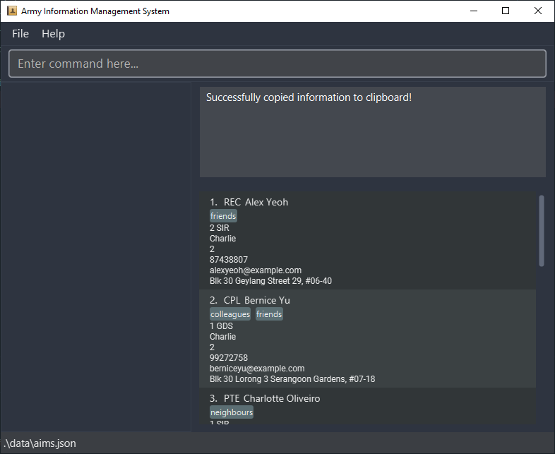

Army Information Management System (AIMS) is a **desktop app for managing the personal information of military
personnel, optimized for use via a Command Line Interface** (**CLI**) while still having the benefits of a Graphical
User Interface (**GUI**). If you can type fast, AIMS can get your contact management tasks done faster than traditional
GUI apps.

This user guide shows you how to get started using AIMS and how to make use of the features by following the easy-to-understand explanations and examples.

<!-- omit from toc -->
## Table of Contents

- [Quick start](#quick-start)
- [Legend](#legend)
- [Features](#features)
  - [Viewing help : `help`](#viewing-help--help)
  - [Adding a person : `add`](#adding-a-person--add)
  - [Importing multiple persons from a CSV file : `importcsv`](#importing-multiple-persons-from-a-csv-file--importcsv)
  - [Listing all persons : `list`](#listing-all-persons--list)
  - [Copying information to clipboard : `copy`](#copying-information-to-clipboard--copy)
  - [Editing a person : `edit`](#editing-a-person--edit)
  - [Locating persons by any field : `find`](#locating-persons-by-any-field--find)
  - [Locating persons using filters on fields : `filter`](#locating-persons-using-filters-on-fields--filter)
  - [Deleting a person : `delete`](#deleting-a-person--delete)
  - [Clearing all entries : `clear`](#clearing-all-entries--clear)
  - [Undoing last modification : `undo`](#undoing-last-modification--undo)
  - [Viewing command history](#viewing-command-history)
  - [Adding a person to favorites : `favorite`](#adding-a-person-to-favorites--favorite)
  - [Exiting the program : `exit`](#exiting-the-program--exit)
  - [Saving the data](#saving-the-data)
  - [Editing the data file](#editing-the-data-file)
- [FAQ](#faq)
- [Command summary](#command-summary)

---

## Legend

Here are some symbols used throughout the user guide to inform you of additional details.

:information_source: **Notes:** Notes aim to provide you with extra information.

:bulb: **Tip:** Tips are useful suggestions that you can follow.

:exclamation: **Caution:** Cautions are used as warnings for certain actions that may cause errors.

## Quick start

1. Ensure you have Java `11` or above installed in your computer.

2. Download the latest `aims.jar` from [here](https://github.com/AY2223S2-CS2103T-W10-3/tp/releases).

3. Copy the file to the folder you want to use as the *home folder* for AIMS.

4. Open a command terminal, `cd` into the folder you put the jar file in, and use the `java -jar aims.jar` command to
   run the application.<br>
   A GUI similar to the below should appear in a few seconds. Note how the app contains some sample data.<br>


5. Refer to the [Features](#features) below for details of each command.

---

## Features

<div markdown="block" class="alert alert-info">

**:information_source: Notes about the command format:**

- Words in `UPPER_CASE` are the parameters to be supplied by the user.<br>
  e.g. in `add n/NAME`, `NAME` is a parameter which can be used as `add n/John Doe`.

- Items in square brackets are **optional**.<br>
  e.g. `n/NAME [t/TAG]` can be used as `n/John Doe t/friend` or as `n/John Doe`.

- Items with `…` after them can be used multiple times including zero times.<br>
  e.g. `[t/TAG]…​` can be used as <code>&nbsp;</code> (i.e. 0 times), `t/friend`, `t/friend t/family` etc.

- Parameters can be in any order.<br>
  e.g. if the command specifies `n/NAME p/PHONE_NUMBER`, `p/PHONE_NUMBER n/NAME` is also acceptable.

- If a parameter is expected only once in the command, but you specified it multiple times, only the last occurrence of
  the parameter will be taken.<br>
  e.g. if you specify `p/12341234 p/56785678`, only `p/56785678` will be taken.

- Extraneous parameters for commands that do not take in parameters (such as `help`, `list`, `exit` and `clear`) will be
  ignored.<br>
  e.g. if the command specifies `help 123`, it will be interpreted as `help`.

</div>

### Viewing help : `help`

Shows a message explaining how to access the help page.

Format: `help`


[Return to Top](#table-of-contents)

### Adding a person : `add`

Adds a person to AIMS.

Format: `add r/RANK n/NAME [u/UNIT] [c/COMPANY] [pl/PLATOON] p/PHONE_NUMBER e/EMAIL a/ADDRESS [t/TAG]…​`

<div markdown="span" class="alert alert-info">

:information_source: **Note:** You can have any number of tags for a person (including 0).

</div>

Examples:

 `add r/3SG n/Lawrence Tay u/1 GDS e/lawrencetay@gmail.com a/124 Drummond Street p/91649723 t/PlatoonSergeant t/AllergySeafood`
  adds a new person `Lawrence Tay` to AIMS with the following information:


[Return to Top](#table-of-contents)

### Importing multiple persons from a CSV file : `importcsv`

Adds all persons from a given valid CSV file to AIMS.

Format: `importcsv PATH_TO_CSV_FILE`

The given CSV file must fulfill the following conditions:

1. File given must end with '.csv'.
2. Each row in the CSV File must have the same number of rows
3. The first row of the CSV file must be reserved for headers.
4. Each field, namely `rank, name, unit, phone, email, address, tags`, must appear as a header in this exact form (but
   in any order, except tag which has to be the last header).
5. Each person cannot have blank entries for any of the fields (except tag)
6. If a person has more than one tag, they are to be listed horizontally. (Additional tags cannot have a header)

Examples:

- example of a Google Sheet that would be valid once converted to CSV.


- valid CSV file:


- `importcsv C:\file\6coy_platoon_four_data.csv`


[Return to Top](#table-of-contents)

### Listing all persons : `list`

Shows a list of all persons in AIMS.

Format: `list`

[Return to Top](#table-of-contents)

### Copying information to clipboard : `copy`

Copies the information of a person to the user's clipboard.

Format: `copy INDEX [n/NAME] [p/PHONE_NUMBER] [e/EMAIL] [a/ADDRESS] [r/RANK] [u/UNIT] [c/COMPANY] [pl/PLATOON] [t/TAG]`

- Copies the required information of the person at the specified `INDEX` to the user's clipboard.
- The index refers to the index number shown in the displayed person list.
- The index **must be a positive integer** 1, 2, 3, …​
- If no fields are specified, all information will be copied.

<div markdown="span" class="alert alert-info">

:information_source: **Note:** If AIMS fails to access your clipboard, the information will be displayed in the result
display box instead. You can then highlight the text using your mouse and copy it to your clipboard by using `Ctrl + C`
on Windows/Linux or `Command + C` on Mac. The display window is extendable if you find that more space is required to
see all the text.

</div>

<div markdown="span" class="alert alert-primary">

:bulb: **Tip:** You can use `find`/`filter` to find a person first before using `copy`!

</div>

Examples:

- `copy 2` will show this when your clipboard is accessible.

    

    The following text will be copied into your clipboard.

    ```text
    Rank: CPL
    Name: Bernice Yu
    Unit: 1 GDS
    Company: Charlie
    Platoon: 2
    Phone: 99272758
    Email: berniceyu@example.com
    Address: Blk 30 Lorong 3 Serangoon Gardens, #07-18
    Tags: [colleagues][friends]
     ```

- `copy 2` will show this when your clipboard is not accessible.

  

[Return to Top](#table-of-contents)

### Editing a person : `edit`

Edits an existing person in AIMS.

Format: `edit INDEX [n/NAME] [p/PHONE] [e/EMAIL] [a/ADDRESS] [r/RANK] [u/UNIT] [c/COMPANY] [pl/PLATOON] [t/TAG]…​`

- Edits the person at the specified `INDEX`. The index refers to the index number shown in the displayed person list.
  The index **must be a positive integer** 1, 2, 3, …​
- At least one of the optional fields must be provided.
- Existing values will be updated to the input values.
- When editing tags, the existing tags of the person will be removed i.e. adding of tags is not cumulative.
- You can remove all the person's tags by typing `t/` without
  specifying any tags after it.

Examples:

- `edit 1 p/91234567 e/johndoe@example.com` Edits the phone number and email address of the 1st person to be `91234567`
  and `johndoe@example.com` respectively.
- `edit 2 n/Betsy Crower t/` Edits the name of the 2nd person to be `Betsy Crower` and clears all existing tags.

### Locating persons by any field : `find`

Finds persons who have any fields that contain any of the given keywords.

Format: `find KEYWORD [MORE_KEYWORDS]`

- The search is case-insensitive. e.g `hans` will match `Hans`
- Keywords cannot contain spaces. Instead, spaces are used to separate keywords.
- The order of the keywords does not matter. e.g. `Hans Bo` will match `Bo Hans`
- All fields (rank, name, unit, company, platoon, phone, email, address, tags) are searched.
- Only part of a field is needed for a successful match e.g. `tani` will match `Botanic Gardens`
- Persons matching at least one keyword will be returned (i.e. `OR` search).
  e.g. `Hans Bo` will return `Hans Gruber`, `Bo Yang` and `Bo Hans`

Examples:

- `find Jo` returns `john`, `John Doe`, `joseph moseph` and `anjolino`
- `find live delta` returns 3 persons in this example:
  - `Charlotte Oliveiro` (name matches `live`)
  - `Irfan Ibrahim` (email matches `live`)
  - `Roy Balakrishnan` (company matches `delta`)<br>


[Return to Top](#table-of-contents)

### Locating persons using filters on fields : `filter`

Filters all persons to only show those whose fields contain all the given keywords.

Format: `filter [n/NAME] [p/PHONE] [e/EMAIL] [a/ADDRESS] [r/RANK] [u/UNIT] [c/COMPANY] [p/PLATOON] [t/TAG]…​`

- The search is case-insensitive. e.g. `hanS` will match `Hans`
- The order of the keywords does not matter. e.g. `n/Hans r/3sg` will match `r/3sg n/Hans`
- Only persons matching all keywords will be returned (i.e. `AND` search).
- If multiple keywords for the same field are provided, only the last keyword for that field will be used (
  i.e. `r/3sg r/cpl` has the same result as `r/cpl`)
- Only part of a field is needed for a successful match e.g. `tanic g` will match `Botanic Gardens`
- At least one of the optional fields must be provided.

Examples:

- `filter n/Jo` returns `john`, `John Doe` and `joseph`
- `filter a/street r/sg` returns `David Li`, `S Lee Chong Wei`<br>
  

[Return to Top](#table-of-contents)

### Deleting a person : `delete`

Deletes the specified person from AIMS.

Format: `delete INDEX`

- Deletes the person at the specified `INDEX`.
- The index refers to the index number shown in the displayed person list.
- The index **must be a positive integer** 1, 2, 3, …​

Examples:

- `list` followed by `delete 2` deletes the 2nd person in AIMS.
- `find Betsy` followed by `delete 1` deletes the 1st person in the results of the `find` command.

[Return to Top](#table-of-contents)

### Clearing all entries : `clear`

Clears all entries from AIMS.

Format: `clear`

[Return to Top](#table-of-contents)

### Undoing last modification : `undo`

Undoes the last modification done to AIMS. Specifically, commands like `list`, `find` and `filter` that do not modify
AIMS are not recorded in the undo history.

<div markdown="block" class="alert alert-warning">

:exclamation: **Caution:** Once AIMS is closed, the undo history will be lost.

</div>

Format: `undo`

[Return to Top](#table-of-contents)

### Viewing command history

You can view the history of previously run commands and re-run them as needed -- this saves you from having to retype
the entire command again. To view the command history, in the command box, press the up arrow (`↑`) on your keyboard to
view an earlier command and the down arrow (`↓`) on your keyboard to view a later command.

- The command that you've entered into the command box before viewing the command history will be saved temporarily --
  you can navigate back to it by pressing the down arrow (`↓`) multiple times.
- If you're already at the *earliest* command, pressing the up arrow (`↑`) will move the cursor to the *beginning* of
  the text in the command box instead.
- If you're already at the *latest* command, pressing the down arrow (`↓`) will move the cursor to the *end* of the text
  in the command box instead.
- At any point in the command history, you can simply edit the command and re-run it. Note that once you navigate away
  from this point in the command history, the changes you've made to this current command in history will be lost.
- The command history file is located at `[JAR file location]/data/command_history.txt`. Whenever you run a command **successfully**, the command history file will be automatically updated. In other words, commands that fail to run due to syntax errors or otherwise will **not** be recorded in the command history.

[Return to Top](#table-of-contents)

### Adding a person to favorites : `favorite`

Favorites the specified person from AIMS.

Format: `favorite INDEX`

- Favorites the person at the specified `INDEX`.
- Running this command on a person who is already in the favorite list will remove him from the favorite list.
- The index refers to the index number shown in the displayed person list.
- The index **must be a positive integer** 1, 2, 3, …​

Example:

- `favorite 3` will pin the third person in the favorites panel.
  

[Return to Top](#table-of-contents)

### Exiting the program : `exit`

Exits the program.

Format: `exit`

[Return to Top](#table-of-contents)

### Saving the data

AIMS data is saved in the hard disk automatically after any command that changes the data. There is no need to save
manually.

[Return to Top](#table-of-contents)

### Editing the data file

AIMS data is saved as a JSON file `[JAR file location]/data/aims.json`. Advanced users are welcome to update data
directly by editing that data file.

<div markdown="span" class="alert alert-warning">

:exclamation: **Caution:** If your changes to the data file makes its format invalid, AIMS will discard all data and
start with an empty data file at the next run.

</div>

[Return to Top](#table-of-contents)

---

## FAQ

**Q**: How do I transfer my data to another computer?<br>
**A**: Install the app in the other computer and overwrite the empty data file it creates with the file that contains
the data of your previous AIMS home folder.

---

## Command summary

| Action              | Format, Examples                                                                                                                                                                                                                           |
|---------------------|--------------------------------------------------------------------------------------------------------------------------------------------------------------------------------------------------------------------------------------------|
| **Add**             | `add n/NAME p/PHONE_NUMBER e/EMAIL a/ADDRESS r/RANK [u/UNIT] [c/COMPANY] [pl/PLATOON] [t/TAG]…` <br> e.g., `add n/James Ho p/22224444 e/jamesho@example.com a/123, Clementi Rd, 1234665 r/3SG u/9 SIR c/Charlie pl/1 t/friend t/colleague` |
| **Clear**           | `clear`                                                                                                                                                                                                                                    |
| **Copy**            | `copy INDEX [n/NAME] [p/PHONE_NUMBER] [e/EMAIL] [a/ADDRESS] [r/RANK] [u/UNIT] [c/COMPANY] [pl/PLATOON] [t/TAG]`<br> e.g., `copy 1 n/ e/ t/`                                                                                                |
| **Delete**          | `delete INDEX`<br> e.g., `delete 3`                                                                                                                                                                                                        |
| **Edit**            | `edit INDEX [n/NAME] [p/PHONE_NUMBER] [e/EMAIL] [a/ADDRESS] [r/RANK] [u/UNIT] [c/COMPANY] [pl/PLATOON] [t/TAG]…`<br> e.g.,`edit 2 n/James Lee e/jameslee@example.com`                                                                      |
| **Find**            | `find KEYWORD [MORE_KEYWORDS]`<br> e.g., `find James Jake`                                                                                                                                                                                 |
| **Favorite**        | `favorite INDEX`<br> e.g., `favorite 3`                                                                                                                                                                                                    |
| **Undo**            | `undo`                                                                                                                                                                                                                                     |
| **Command history** | `↑` / `↓`                                                                                                                                                                                                                                  |
| **List**            | `list`                                                                                                                                                                                                                                     |
| **Help**            | `help`                                                                                                                                                                                                                                     |
[Return to Top](#table-of-contents)
