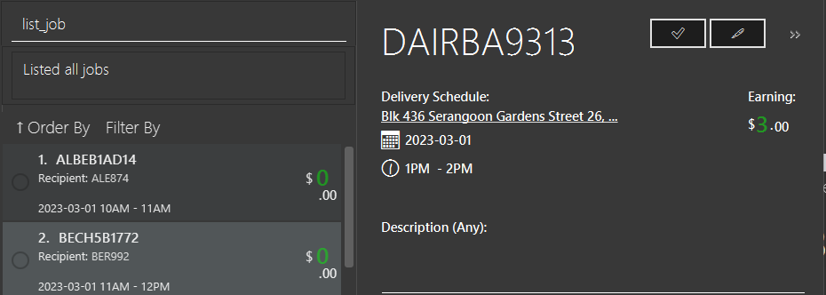
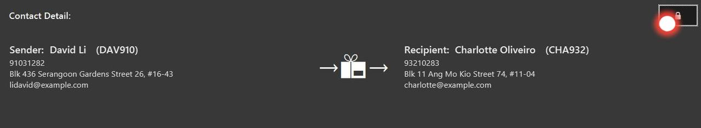
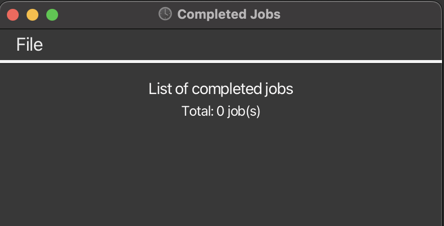
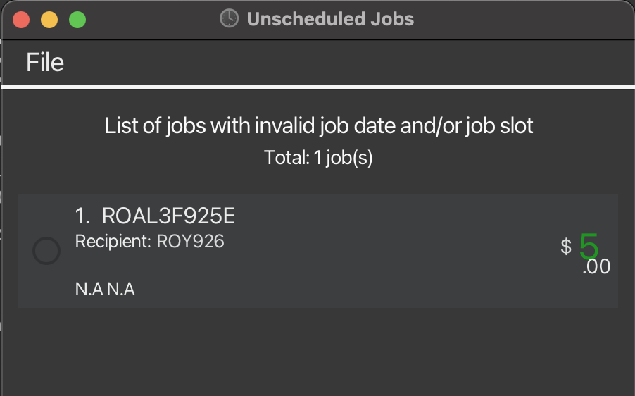

Duke Driver is a desktop app for managing delivery jobs and contacts. If you are looking to perform better at your delivery job, Duke Driver can assist you to finish your daily tasks more efficiently, according to your requirements.

## Table of Content 
* Table of Contents
{:toc}

--------------------------------------------------------------------------------------------------------------------
## How to use this guide?

This user guide is an in-depth documentation on all the features that Duke Driver has.

The [command summary](#command-summary) section allows you to quickly scan all the commands if you are an experienced user attempting to discover a specific command.

Look up the feature in the [Table of Contents](#table-of-contents) and navigate to the appropriate section to obtain a detailed description of Duke Driver's features.
Each section includes a thorough explanation of the function, its command syntax, some examples of potential applications, and information on expected results.

If you are a first-time user, you can begin by reading the [Quick Start](#quick-start) section!

## Quick start 

1. Ensure you have Java `11` or above installed in your Computer.

2. Download the latest `dukeDriver.jar` in the latest release from [here](https://github.com/AY2223S2-CS2103-F11-2/tp/releases).

3. Copy the file to the folder you want to use as the _home folder_ for your AddressBook.

4. Open a command terminal, `cd` into the folder you put the jar file in, and use the `java -jar dukeDriver.jar` command to run the application. 
   A GUI similar to the below should appear in a few seconds. Note how the app contains some sample data. 
   

5. Type the command in the command box and press Enter to execute it. e.g. typing **`help`** and pressing Enter will open the help window. 
   Some example commands you can try:

   * `list` : Lists all contacts.

   * `list_job` : Lists all jobs.

   * `add n/John Doe p/98765432 e/johnd@example.com a/John street, block 123, #01-01` : Adds a contact named `John Doe` to the Address Book.

   * `timetable` : Shows timetable of current week.

   * `exit` : Exits the app.

6. Refer to the [Windows and Features Overview](#windows-and-features-overview) and [Features](#features) below for details of each command.

## Windows and Features Overview
Duke Driver has 5 main windows: Delivery Job Window (Main Window), Customer Window (Window for customers' address book), Timetable Window, Reminder Window, Statistics Window.

All windows could be accessed from Main Window, simply by using these commands:
1. `list`: Lists all customers in Address Book, opens Customer Window, refer to [1. Features related to Customers](#1-features-related-to-customers) for more details.

2. `timetable` or `timetable_date date/YYYY-mm-DD`: Opens timetable window of appropriate week, refer to [4. Features available for Timetable](#4-features-available-for-timetable) for more details.
3. `stats`: Open Statistics Window, refer to [5. Features available for Statistics](#5-features-available-for-statistics) for more details.
4. `list_reminder`: Lists all reminders and opens Reminder Window, refer to [3. Features available for Reminders](#3-features-available-for-reminders) for more details.

Alternatively, you can simply click on the corresponding button to open the window you want.

--------------------------------------------------------------------------------------------------------------------

# Features

**:information_source: Notes about the command format:** 

* Words in `UPPER_CASE` are the parameters to be supplied by the user. 
  e.g. in `add n/NAME`, `NAME` is a parameter which can be used as `add n/John Doe`.

* Items in square brackets are optional. 
  e.g `n/NAME [t/TAG]` can be used as `n/John Doe t/friend` or as `n/John Doe`.

* Items with `…`​ after them can be used multiple times including zero times. 
  e.g. `[t/TAG]…​` can be used as ` ` (i.e. 0 times), `t/friend`, `t/friend t/family` etc.

* Parameters can be in any order. 
  e.g. if the command specifies `n/NAME p/PHONE_NUMBER`, `p/PHONE_NUMBER n/NAME` is also acceptable.

* If a parameter is expected only once in the command but you specified it multiple times, only the last occurrence of the parameter will be taken. 
  e.g. if you specify `p/12341234 p/56785678`, only `p/56785678` will be taken.

* Extraneous parameters for commands that do not take in parameters (such as `help`, `list_job`, `exit` and `clear`) will be ignored. 
  e.g. if the command specifies `help 123`, it will be interpreted as `help`.

## 1. Features related to Customers
### *Can only access from Customer Window*
To access the address book containing all customers from Main Window, please use command `list` to list all customers and open Customer Window. 

Alternatively, you can click on `Customers` in menu bar > `Address Book`.

### 1.1. Adding a person: `add`

Adds a person to the address book.

Format: `add n/NAME p/PHONE_NUMBER e/EMAIL a/ADDRESS [t/TAG]…​`

* Customers' name should only include Latin alphabet and/or numeric characters.

:bulb: **Tip:**
A person can have any number of tags (including 0)

Examples:
* `add n/John Doe p/98765432 e/johnd@example.com a/John street, block 123, #01-01`
* `add n/Betsy Crowe t/friend e/betsycrowe@example.com a/Newgate Prison p/1234567 t/criminal`

### 1.2. Listing all persons : `list`

Shows a list of all persons in the address book in Customer Window.

Format: `list`

### 1.3. Editing a person : `edit`

Edits an existing person in Customer Window.

Format: `edit INDEX [n/NAME] [p/PHONE] [e/EMAIL] [a/ADDRESS] [t/TAG]…​`

* Edits the person at the specified `INDEX`. The index refers to the index number shown in the displayed person list. The index **must be a positive integer** 1, 2, 3, …​
* At least one of the optional fields must be provided.
* Existing values will be updated to the input values.
* When editing tags, the existing tags of the person will be removed i.e adding of tags is not cumulative.
* You can remove all the person’s tags by typing `t/` without
    specifying any tags after it.

Examples:
*  `edit 1 p/91234567 e/johndoe@example.com` Edits the phone number and email address of the 1st person to be `91234567` and `johndoe@example.com` respectively.
*  `edit 2 n/Betsy Crower t/` Edits the name of the 2nd person to be `Betsy Crower` and clears all existing tags.

### 1.4. Locating persons by name: `find`

Finds and lists persons whose names contain any of the given keywords.

Format: `find KEYWORD [MORE_KEYWORDS]`

* The search is case-insensitive. e.g `hans` will match `Hans`
* The order of the keywords does not matter. e.g. `Hans Bo` will match `Bo Hans`
* Only the name is searched.
* Only full words will be matched e.g. `Han` will not match `Hans`
* Persons matching at least one keyword will be returned (i.e. `OR` search).
  e.g. `Hans Bo` will return `Hans Gruber`, `Bo Yang`

Examples:
* `find John` returns `john` and `John Doe`
* `find alex david` returns `Alex Yeoh`, `David Li` 
  

### 1.5. Deleting a person : `delete`

Deletes the specified person from the address book.

Format: `delete INDEX`

* Deletes the person at the specified `INDEX`.
* The index refers to the index number shown in the displayed person list.
* The index **must be a positive integer** 1, 2, 3, …​

Examples:
* `list` followed by `delete 2` deletes the 2nd person in the address book.
* `find Betsy` followed by `delete 1` deletes the 1st person in the results of the `find` command.

## 2. Features related to Delivery Jobs
### *Can only access from Main Window*
Commands are input in this text field and app response is printed below the text field.

### 2.1. Adding a job: `add_job`

Adds a delivery job to the delivery job system.

**Format**: `add_job si/SENDER_ID ri/RECEIPIENT_ID [date/DELIVERY_DATE] [slot/DELIVERY_SLOT] [earn/EARNING]`

**Alternative**: Click on `Delivery Job System` in menu bar > `Create Job`. Fill in relevant details and click `Create Job` button. (Click `Cancel` button to stop adding)

*Extra constraints with this alternative way of adding jobs:*
* Only allows adding jobs with either **valid slots** or **no slot** (i.e. slots within range 1 - 5)
* Only delivery date and slot are optional for alternative way of adding job. 
* Earning must not be left empty. User should identify earning as $0 instead, if necessary.

:bulb: **Tip:**
Description field is only available in GUI mode.

:bulb: **Tip:**
Delivery date, slot and earning are optional (for original way of adding job using `add_job` command - typing-preferred).

* Adds the job to delivery job system.
* `SENDER_ID` and `RECEIPIENT_ID` **must be valid IDs** (i.e. must exist in address book).
* Delivery date **must be in format YYYY-mm-DD**.
* Delivery slot **must be a positive integer** and valid slots should be within the range from 1 to 5 (example: `slot/1`).
* Slot 1: 10AM - 11AM, Slot 2: 11AM - 12PM, Slot 3: 1PM - 2PM, Slot 4: 2PM - 3PM, Slot 5: 3PM - 4PM.
* Delivery slots must start from `slot/1` (i.e. only starts from 10AM), however, could also be larger than 5 (i.e. `slot/6`).
* Delivery slots larger than 5 (outside valid range) will be classified as "Extra hours (4PM++)". However, these delivery slots are still considered invalid slots.
* Earning **must be a double**. 

Examples:
* `add_job si/ALE874 ri/DAV910 date/2023-03-01 slot/3`
* `add_job si/ALE874 ri/DAV910 date/2023-03-01 slot/3 earn/20`

### 2.2. Mass importing jobs

Format: Click on `Delivery Job System` in menu bar > `Import Jobs` > select a file containing all the jobs to be imported

* File **must be a CSV file**.
* There must be a header row as the first row will be skipped when file is parsed.
* These columns `Recipient`	`Sender` `Delivery date`	`Delivery slot`	`Price`	`Description`	`Recipient`	`Recipient's Name`	`Recipient's Phone`	`Recipient's Email`	`Recipient's Address`	`Recipient's Tag`	`Sender's	Name`	`Sender's Phone`	`Sender's Email`	`Sender's Address`	`Sender's Tag` must exist.
* The optional details may be empty cells. e.g. `Sender's Tag` may be empty.
* If recipient/ sender does not already exist in customer address book i.e. new customer, recipient/ sender will also be added into the address book.

### 2.3. Listing all jobs : `list_job`

Shows a list of all jobs in the delivery job system in Main Window.

Format: `list_job`

### 2.3.1. Sort and filter jobs
Simply click on the corresponding button to sort and filter jobs.

### 2.3.2. View details of a specific job
Simply double-click on the job card in job list to view its details in the right half of Main Window.

To hide/un-hide the contact details of the chosen job, simply click on the Lock Button.

### 2.4 Edit job : `edit_job`

Edit a selected job by Index or Job id.

Format: `edit_job INDEX [si/SENDER_ID] [ri/RECEIPIENT_ID] [date/DELIVERY_DATE] [slot/DELIVERY_SLOT] [earn/EARNING] [done/t | f]`

Alternative: Double-lick on the delivery job to view its detail > Click on the middle pen button  on top right hand corner > Make changes > Click on `Edit Job` button

* Existing values will be overwritten by the input values.
* Edits the delivery job at the specified `INDEX`.
* The index refers to the index number shown in the displayed job list.
* The index **must be a positive integer** 1, 2, 3, …​
* Refer to `list_job` for argument constrains.

Examples:
* `edit_job 1 slot/4`
* `edit_job 1 date/2023-03-01`
* `edit_job ji/<job_id> si/ALE874 ri/DAV910 date/2023-03-01 slot/3 earn/20`

### 2.5 Find job : `find_job`

Finds all jobs which contain any of the specified keywords and displays them as a list with index numbers.

Format: `find_job [ji/JOB_ID] [si/SENDER_ID] [ri/RECIPIENT_ID] [date/DELIVER_DATE] [slot/DELIVERY_SLOT] [earn/EARNING] [done/ t | f]`

* There can be multiple keywords.
* Keywords are case-sensitive.
* Keywords are optional, but there must be at least one keyword.
* Refer to `list_job` for argument constrains.

Examples:
* `find_job ji/<job_id>`
* `find_job date/2023-03-01 slot/4`
* `find_job ji/<job_id> si/ALE874 ri/DAV910 date/2023-03-01 slot/3 earn/20`

### 2.6 Delete job : `delete_job`

Deletes the job identified by the job ID. Support `del` key in job list.

Format: `delete_job JOB_ID`

Alternative: Double-lick on the delivery job you want to delete to view its detail > Click on the right bin button  on top right hand corner

* The job ID must be **valid**.

Example:
* `delete_job ALBE29E66F`

### 2.7 Mark job as completed/uncompleted : `com_job` / `uncom_job`

Marks the job identified by the job ID as completed or uncompleted.

Format: `com_job JOB_ID` / `uncom_job JOB_ID`

* The job ID **must be valid**.

Alternative 1: Scroll to the job and click on the circle on the left, which a tick will appear in to show completion. Click again to uncomplete the job.

Alternative 2: Double-click on the delivery job to view its details > Click on the left tick button  on top right hand corner. Click on the button again to uncomplete job.

Example:
* `com_job ALBE29E66F`
* `uncom_job ALBE29E66F`

## 3. Features available for Reminders
### *Can only access from Main Window*
### 3.1. Listing all reminders : `list_reminder`

Shows a list of all reminders in Reminder Window.

Opens Reminder Window.

Format: `list_reminder`

### 3.2. Adding a reminder : `add_reminder`

Adds a reminder into Duke Driver.

Format: `add_reminder [d/DESCRIPTION] time/YYYY-MM-DD HH:mm`

* Adds a reminder with the specified `DESCRIPTION`.
* The reminder will be reminded from the date time specified in `time/YYYY-MM-DD HH:mm`.
* Date must be valid.
* `DESCRIPTION` can be left empty (optional).
* `DESCRIPTION` is limited to 50 characters including space.

Examples:
* `add_reminder` followed by `d/Submit homework time/2023-12-12 12:00` adds a reminder that will remind the user to submit their homework. The reminder will occur at 12pm, 12 December 2023.

### 3.3. Deleting a reminder : `delete_reminder`

Deletes a reminder in Duke Driver.

Format: `delete_reminder INDEX`

* Deletes the reminder at the specified `INDEX`.
* The index refers to the index number shown beside the reminder.
* The index **must be a positive integer** 1, 2, 3, …​

Examples:
* `list_reminder` followed by `delete_reminder 2` deletes the 2nd reminder in the address book.

## 4. Features available for Timetable
### *Can only access from Main Window*

### 4.1. Showing timetable : `timetable`

Shows timetable of jobs, with the week shown being current week (LocalDate.now()).

Format: `timetable`

Alternative: Click on `Timetable` in menu bar > `Scheduled Jobs`

### 4.2. Showing timetable of week containing specific date: `timetable_date`

:bulb: **Tip:**
This is the only command that Timetable Window can access

Shows timetable of specific week containing a specific date

Format: `timetable_date date/YYYY-mm-DD`

* Shows timetable of the week containing the given date.
* Date must be valid.
* This is the one and only command that Timetable Window can access (identical format).

Examples:
* `timetable_date date/2023-03-16` shows timetable of jobs in week from 13th - 19th March 2023.

### 4.3. Showing list of completed jobs: `timetable_completed`
Shows list of completed jobs, sorted in increasing date and decreasing earning order.

Format: `timetable_completed`

Alternative: Click on `Timetable` in menu bar > `Completed Jobs`

### 4.4. Showing list of unscheduled jobs: `timetable_unscheduled`
Shows list of unscheduled jobs (i.e. jobs with invalid delivery dates and/or slots).
Jobs are sorted in increasing date and decreasing earning order.

Format: `timetable_unscheduled`

Alternative: Click on `Timetable` in menu bar > `Unscheduled Jobs`

## 5. Features available for Statistics
### *Can only access from Main Window*
### 5.1. Showing Statistics : `stats`

Shows a summary of statistics related to the jobs in the job list
* Total number of jobs in the job list
* Total earnings from all jobs in the job list
* Total number of completed jobs in the job list
* Total number of pending jobs in the job list

Similar statistics are shown for jobs in the previous week

## Other features

### Clearing all entries : `clear`

Clears all entries from the delivery job system and address book.

Format: `clear`

### Viewing help : `help`

Shows a message explaining how to access the help page.

Format: `help`

### Exiting the program : `exit`

Exits the program or current window.

Format: `exit`

Alternative: Click "File" in menu bar > "Exit"
* The alternative also applies for `Timetable` in menu bar > `Scheduled Jobs`/ `Completed Jobs` and `Customer` in menu bar > `Address book`

### Saving the data

Duke Driver data are saved in the hard disk automatically after any command that changes the data. There is no need to save manually.

### Editing the data file

Duke Driver data are saved as a JSON file `[JAR file location]/data/addressbook.json` and `[JAR file location]/data/deliveryjobsystem.json`. Advanced users are welcome to update data directly by editing that data file.

:exclamation: **Caution:**
If your changes to the data file makes its format invalid, AddressBook will discard all data and start with an empty data file at the next run.

--------------------------------------------------------------------------------------------------------------------

## FAQ

**Q**: How do I transfer my data to another Computer? 
**A**: Install the app in the other computer and overwrite the empty data file it creates with the file that contains the data of your previous AddressBook home folder.

--------------------------------------------------------------------------------------------------------------------

## Command summary
**:information_source: Notes about the command format:** 
* Commands that start with *(C)* could only be accessed from Customer Window
* Commands that start with *(M)* could only be accessed from Main Window
* Commands that start with *(T)* could only be accessed from Timetable Window
* Commands that start with *(B)* could be accessed from both Main and Customer Window
* Commands that start with *(A)* could be accessed from all 3 windows: Main, Customer and Timetable Window.

| Action                                        | Format, Examples                                                                                                                                                                                                                                                                                                                                                                                                                                                        |
|-----------------------------------------------|-------------------------------------------------------------------------------------------------------------------------------------------------------------------------------------------------------------------------------------------------------------------------------------------------------------------------------------------------------------------------------------------------------------------------------------------------------------------------|
| ***(C)* Add Customer**                        | Click on `Customers` in menu bar > `Address Book` then input `add n/NAME p/PHONE_NUMBER e/EMAIL a/ADDRESS [t/TAG]…​`   e.g., `add n/James Ho p/22224444 e/jamesho@example.com a/123, Clementi Rd, 1234665 t/friend t/colleague`                                                                                                                                                                                                                                 |
| ***(C)* Delete Customer**                     | Click on `Customers` in menu bar > `Address Book` then input `delete INDEX`  e.g., `delete 3`                                                                                                                                                                                                                                                                                                                                                                        |
| ***(C)* Edit Customer details**               | Click on `Customers` in menu bar > `Address Book` then input `edit INDEX [n/NAME] [p/PHONE_NUMBER] [e/EMAIL] [a/ADDRESS] [t/TAG]…​`   e.g.,`edit 2 n/James Lee e/jameslee@example.com`                                                                                                                                                                                                                                                                           |
| ***(C)* Find Customer**                       | Click on `Customers` in menu bar > `Address Book` then input `find KEYWORD [MORE_KEYWORDS]`  e.g., `find James Jake`                                                                                                                                                                                                                                                                                                                                                 |
| ***(B)* List Customer**                       | `list`  Or Click on `Customers` in menu bar > `Address Book` then input `list`                                                                                                                                                                                                                                                                                                                                                                                  |
| ***(M)* Add Job**                             | `add_job si/SENDER_ID ri/RECEIPIENT_ID [date/DELIVERY_DATE] [slot/DELIVERY_SLOT] [earn/EARNING]`   e.g., `add_job si/ALE874 ri/DAV910 date/2023-03-01 slot/3 earn/20`                                                                                                                                                                                                                                                                                                |
| ***(M)* Import Jobs**                         | click on `Delivery Job System` in menu bar > `Import Jobs` > select CSV file containing jobs to be imported > `open`                                                                                                                                                                                                                                                                                                                                                    |
| ***(M)* List Job**                            | `list_job`                                                                                                                                                                                                                                                                                                                                                                                                                                                              |
| ***(M)* Edit Job**                            | `edit_job INDEX [si/SENDER_ID] [ri/RECEIPIENT_ID] [date/DELIVERY_DATE] [slot/DELIVERY_SLOT] [earn/EARNING] [done/Complete]`  OR Click on the delivery job > Click on the middle pen button  on top right hand corner > Make changes > Click on `Edit Job` button    e.g., `add_job si/ALE874 ri/DAV910 date/2023-03-01 slot/3 earn/20`                                                                                        |
| ***(M)* Find Job**                            | `find_job [ji/JOB_ID] [si/SENDER_ID] [ri/RECIPIENT_ID] [date/DELIVER_DATE] [slot/DELIVERY_SLOT] [earn/EARNING]...`    e.g., `find_job si/ALE874`                                                                                                                                                                                                                                                                                                                 |
| ***(M)* Delete Job**                          | `delete_job ji/JOB_ID`  OR Alternative: Click on the delivery job > Click on the right bin button  on top right hand corner   e.g., `delete_job ALBE29E66F`                                                                                                                                                                                                                                                            |
| ***(M)* Complete Job**                        | `com_job ji/JOB_ID` / `uncom_job ji/JOB_ID` OR Alternative 1: Scroll to the job and click on the circle on the left, which a tick will appear in to show completion. Click again to uncomplete the job. OR Alternative 2: Click on the delivery job > Click on the left tick button  on top right hand corner. Click on the button again to uncomplete job.  e.g.,`com_job ALBE29E66F` / `uncom_job ALBE29E66F` |                                                                                                                                                                                                                                                                                                                                                                                  |
| ***(M)* List reminder**                       | `list_reminder`                                                                                                                                                                                                                                                                                                                                                                                                                                                         |
| ***(M)* Add reminder**                        | `add_reminder d/DESCRIPTION time/YYY-MM-DD HH:mm`   e.g.,`add_reminder d/Submit homework time/2023-12-12 12:00`                                                                                                                                                                                                                                                                                                                                                      |
| ***(M)* Delete reminder**                     | `delete_reminder INDEX`   e.g., `delete_reminder 3`                                                                                                                                                                                                                                                                                                                                                                                                                  |
| ***(M)* Show Timetable**                      | `timetable` OR Click on `Timetable` in menu bar > `Scheduled Jobs`                                                                                                                                                                                                                                                                                                                                                                                              |
| ***(M) (T)* Show Timetable of Specific Week** | `timetable_date date/YYYY-mm-DD` OR Click on `Timetable` in menu bar > `Scheduled Jobs` > input `timetable_date date/YYYY-mm-DD` e.g., `timetable_date date/2023-03-30`                                                                                                                                                                                                                                                                                     |
| ***(M)* Show List of Completed Jobs**         | `timetable_completed` OR Click on `Timetable` in menu bar > `Completed Jobs`                                                                                                                                                                                                                                                                                                                                                                                    |
| ***(M)* Show List of Unscheduled Jobs**       | `timetable_unscheduled` OR Click on `Timetable` in menu bar > `Unscheduled Jobs`                                                                                                                                                                                                                                                                                                                                                                                |
| ***(M)* Show Statistics**                     | `stats` OR Click on `Statistics` in menu bar > `Display Statistics`                                                                                                                                                                                                                                                                                                                                                                                             |
| ***(B)* Clear all entries**                   | `clear`                                                                                                                                                                                                                                                                                                                                                                                                                                                                 |
| ***(A)* Help**                                | `help` Or Click on `Help` in menu bar > `Help`                                                                                                                                                                                                                                                                                                                                                                                                                  |
| ***(A)* Exit**                                | `exit` Or Click on `Exit` in menu bar > `Exit`                                                                                                                                                                                                                                                                                                                                                                                                                  |

