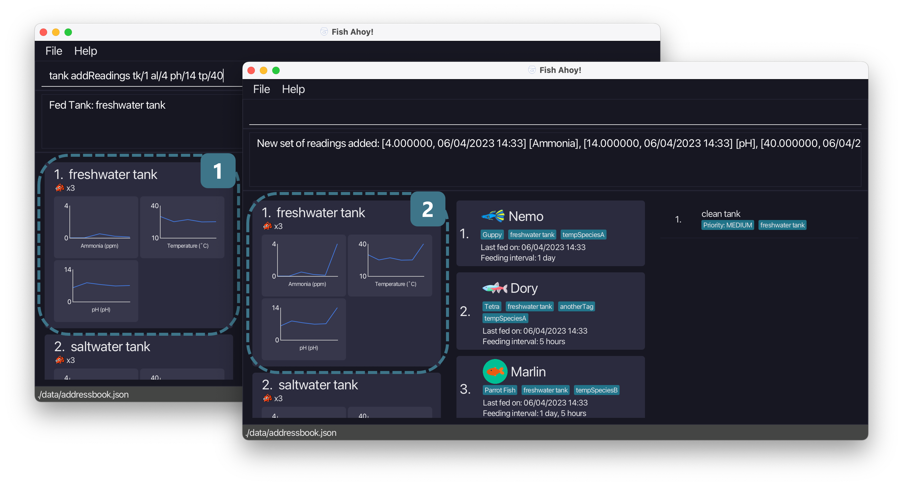

--------------------------------------------------------------------------------------------------------------------

# Table of Contents
  * [Introduction](#introduction)
  * [Using this guide](#using-this-guide)
  * [Glossary](#glossary)
  * [Quickstart](#quick-start)
  * [About the interface](#about-the-interface)
  * [*Fish Ahoy!* commands](#fish-ahoy-commands)
  * [Features](#features)
    * [Tanks](#tanks)
    * [Tank readings](#tank-readings)
      * [Adding a tank `tank add`](#adding-a-tank-tank-add)
      * [Deleting a tank `tank delete`](#deleting-a-tank-tank-delete)
      * [Editing a tank `tank edit`](#editing-a-tank-tank-edit)
      * [Feeding a tank `tank feed`](#feeding-a-tank-tank-feed)
      * [Viewing a tank `tank view`](#viewing-a-tank-tank-view)
      * [Adding a set of readings `tank addReadings`](#adding-a-set-of-readings-tank-addreadings)
      * [Deleting a most recent set of readings `tank delLastReadings`](#deleting-the-most-recent-set-of-readings-tank-dellastreadings)
    * [Fishes](#fishes)
      * [Adding a fish `fish add`](#adding-a-fish-fish-add)
      * [Deleting a fish `fish delete`](#deleting-a-fish-fish-delete)
      * [Editing a fish `fish edit`](#editing-a-fish-fish-edit)
      * [Sorting fishes `fish sort`](#sorting-fishes-fish-sort)
      * [Viewing fishes `fish view`](#viewing-a-fish-fish-view)
      * [Listing fishes `list fishes`](#listing-fishes-list-fishes)
    * [Tasks](#tasks)
      * [Adding a task `task add`](#adding-a-task-task-add)
      * [Deleting a task `task delete`](#deleting-a-task-task-delete)
      * [Editing a task `task edit`](#editing-a-task-task-edit)
      * [Listing tasks `list task`](#listing-tasks-list-task)
      * [Feeding reminders](#feeding-reminders)
    * [Storage](#storage)
    * [Help](#help)
    * [FAQ](#faq)
    * [Summary of commands](#command-summary)
    * [Summary of prefixes in commands](#command-prefix-summary)

--------------------------------------------------------------------------------------------------------------------

# Introduction

Welcome to the *Fish Ahoy! User Guide*!  

*Fish Ahoy!* Is a **desktop app for managing your fish, fish tanks, and relevant tasks, optimized for use via a Command
Line Interface** (CLI) while still having the benefits of a Graphical User Interface (GUI).  

*Fish Ahoy!* **streamlines** the fish keeping experience by helping you keep track of your many **fishes**, **tanks** and 
**weekly tasks**, such as feeding and cleaning. 

*Fish Ahoy!* **simplifies** commands to revolve around **fish**, **tank** and **task**. When you want to, for example,
perform an action on **tanks**, the commands all begin with `tank`.

--------------------------------------------------------------------------------------------------------------------

# Using this guide

This guide will explain how you can use *Fish Ahoy!* for your own fish keeping activities. It is designed to
cater to all levels of fish keeping expertise, from novice to expert fish keepers. It does not assume any prior
knowledge of fish keeping, only the simplest components of an aquarium such as a tank, fish, and basic fish keeping
equipment.

For **new users**, follow our [Quick Start Guide](#quick-start) below to get started with your fish-keeping journey with *Fish Ahoy!*.

For **amateur users**, choose a feature from our [table of contents](#table-of-contents) above to find answers and get step-by-step instructions on how to make
*Fish Ahoy!* work for you!

For **experienced users**, refer to our [command summary](#command-summary) or [prefix summary](#command-prefix-summary) to obtain information you might need at a glance.

These are the symbols employed in this user guide:

| Symbol               | Meaning                                                                                                      |
|----------------------|--------------------------------------------------------------------------------------------------------------|
| :information_source: | Additional information. More relevant to **amateur** and **experienced** users.                              |
| :bulb:               | Helpful tip from the developers.                                                                             |
| :exclamation:        | Warning. Attempting to perform an action with a warning will lead to an **error** or unintended consequences |

> :information_source: Additional information: These symbols will be housed in blockquotes like this

These are the special text formatting employed in this user guide: 

| Font                 | Meaning                                                                                                                                                                                                                                                   |
|----------------------|-----------------------------------------------------------------------------------------------------------------------------------------------------------------------------------------------------------------------------------------------------------|
| **Bold**             | You should pay closer attention to bolded words as they are more important                                                                                                                                                                                |
| `Code`               | Used for coding syntax. Parts of a *Fish Ahoy!* command will be in this format. Command Prompt commands and file names in the [Quick start](#quick-start) are also in this format                                                                         |
| [Links]()            | A link to a section in this user guide that will provide more in-depth information                                                                                                                                                                        |
| *Italics*            | The application name, *Fish Ahoy!* is in this format.                                                                                                                                                                                                     |
| `<COMMAND CONTENTS>` | Generalises a part of a [command](#glossary). You can choose the exact value of the content in these brackets   example: `<PARAMETERS>` mean that you need to specify the exact values of the parameters in *Fish Ahoy!*, subject to their constraints |

--------------------------------------------------------------------------------------------------------------------

# Glossary

These are the definitions to some technical terms: 

| Word           | Meaning                                                                                                                                                                                                 |
|----------------|---------------------------------------------------------------------------------------------------------------------------------------------------------------------------------------------------------|
| Command        | A series of words you type in the [Command Line](#about-the-interface) to perform an action                                                                                                             |
| Command type   | Identifies the type of information the command modifies.   Command types: `tank`, `fish`, `task`                                                                                                     |
| Command action | Specifies exactly what action the command performs.   Some command actions: `add`, `delete`, `edit`                                                                                                  |
| Parameter      | Part of a command. Provides the command the information it requires. Parameters are preceded with a prefix.                                                                                             |
| Prefix         | Part of a parameter. Specifies what type of information the parameter is providing.   [Prefixes:](#command-prefix-summary) `n/`, `lfd/`, `s/`, `fi/`, `tg/`, `by/`, `d/`, `al/`, `ph/`, `tp/`, `tk/` |
| GUI/ Interface | The visual and graphical components of *Fish Ahoy!* It is what you see when you open *Fish Ahoy!*                                                                                                       |
| Object         | An object is either a tank, fish or task. This term is used when all 3 types, tank, task and fish, are applicable.                                                                                      |

--------------------------------------------------------------------------------------------------------------------

# Quick start

1. Ensure you have [Java 11](https://www.oracle.com/sg/java/technologies/javase/jdk11-archive-downloads.html) or above installed in your Computer.

> :bulb: Tip: You can check by typing `java --version` in your Command Prompt for Windows or Terminal App for macOS

2. Download the latest `FishAhoy.jar` from [here](https://github.com/AY2223S2-CS2103T-T17-4/tp/releases).
3. Copy the file `FishAhoy.jar` to the folder you want to use as the home folder for *Fish Ahoy!*.

> :information_source: Additional information: Data files of *Fish Ahoy!* will be also stored in the folder you keep it in.

4. Double-click the file to open *Fish Ahoy!* 

A GUI similar to the below should appear in a few seconds. Note how the app contains some sample data.

> :bulb: Tip: There is sample data present when you first open *Fish Ahoy!*. Use `edit` or `delete` commands to show your own tanks! 

5. Type a command in the command box and press Enter to execute it.
   Some examples:
  * `fish add n/Bobby lfd/01/01/2023 15:00 s/Guppy fi/0d5h tk/1`: Add a fish named Bobby to your fish book. Its last fed date, species, feeding interval and tank are specified with the `lfd/`, `s/`, `fi/` and `tk/` prefixes respectively.
  * `fish delete 1`: Deletes the first fish shown in the [centre panel of the interface](#about-the-interface).
  * `tank view 1`: View all fishes and tasks regarding the first tank in the [left panel of the interface](#about-the-interface).

6. Refer to [About the Interface](#about-the-interface) below for details on the interface.
7. Refer to the [Features](#features) below for details of each command.

--------------------------------------------------------------------------------------------------------------------

# About the Interface

The *Fish Ahoy!* interface consists of three main components, the **Command Line**, **Alerts**, and **Panels**, 
and two buttons, **File** and **Help**.

The **Command Line** is where you can enter various commands to enter information into *Fish Ahoy!*. 
Refer to the [Features](#features) below for details of each command!

The **Alerts** will display the results of each command, and display additional help specific to the command.

> :bulb: Tip: If you are unsure of the command format, simply enter the command type you want to use, e.g. `fish`, followed by the command action
you would like to use, e.g. `add`. Information on prefixes will be displayed in the Alerts! 

The **Panels** will display all the information on your Tanks, Fishes and Tasks. The leftmost panel displays tanks, centre panel display fishes and the right panel displays tasks These panels will automatically update 
whenever you enter a command. Try it out!

The **File** button will present a menu where you can exit the application. Exiting from the application using 
Windows/Mac OS native close buttons are also fine.

The **Help** button will present a menu where you can display the *Fish Ahoy! User Guide*. If you require extra information,
do use this to redirect you to our user guide!

## Tank Interface

A sample Tank item is shown below. For each Tank you add in *Fish Ahoy!*, you have to add a 
[Description]((#description)). A [Tank Index](#index-parameters) is then automatically assigned to the tank. 
The **Number of fish** will be automatically updated whenever you add/delete a fish from this tank in *Fish Ahoy!* 
The [Ammonia](#tank-ammonia-level-reading-alammonia_level), [Temperature](#tank-temperature-reading-tptemperature)and
[pH](#tank-ph-reading-phph) are generated from [readings](#tank-readings) that you add to *Fish Ahoy!*

 

## Fish Interface

A sample Fish item is shown below. Each Fish you add in *Fish Ahoy!* has multiple [parameters](#parameters-br), such as 
[Name](#name-nname), [Species](#species-sspecies), [Last Fed Date](#last-fed-date-lfdlast_fed_date), 
[Feeding Interval](#feeding-interval-fifeeding_interval), which [Tank](#tank-tktank_index) it is in and what 
[Tags](#tags-tgtag) it has. There is also a [Fish Index](#index-parameters) which is automatically assigned to the fish. 
The **Fish Icon** is matched to the [Species](#species-sspecies) of the fish!

--------------------------------------------------------------------------------------------------------------------

# *Fish Ahoy!* Commands

In general, the command format is as follows: 
`<COMMAND TYPE> <COMMAND ACTION> <PARAMETERS>`
> :information_source: Additional information: `list` commands do not follow this format, but are of format `list <COMMAND TYPE>`

## Command types and actions
* Command types
  * There are 3 command types. They are the `tank`, `fish` and `task` command types
  * They specify what they modify. `tank` commands modify tanks, `fish` commands modify fish and `task` commands modify tasks
* Command actions
  * These specify what the command does. For example, `tank add` adds a tank to *Fish Ahoy!*.

## Parameters  

* Parameters are additional pieces of information a command needs to perform its action. 
  * For example, in the `tank add` command, a description parameter `d/<DESCRIPTION>` is needed

### Index parameters
* Used as parameters for commands with `delete`, `edit` and `view` actions
* Index parameters are **positive integers** (1, 2, 3...)
* Index parameters do not require a prefix. For example, the command is as follows: `tank delete 1`
* In the features section, index parameters will be as such: `<XXX_INDEX>`, and `XXX` can be `TANK`, `FISH` or `TASK`
> :exclamation: Warning: Ensure that the index you input corresponds to an existing item. 
>   Look at the [respective panels](#about-the-interface) for the index of the type of object you want to refer to.

### Prefix parameters
* Used as parameters for commands with `add`, `edit` and `addReadings` actions
* Prefix parameters require a prefix. For example, the command is as follows: `tank add d/<TANK_NAME>`
* In the features section, prefix parameters will be as such: `X/<CONTENT>` where `X` is a valid prefix and `<CONTENT>` is the content of this parameter, subject to its constraints
* You can only have multiple values for tag prefixes `tg/<TAG>`. All other prefixes can only have 1 value. 
> :information_source: Additional information: You can have multiple prefix parameters for the same prefix, but only the last one will be used.
>  For example: `tank add d/Tank 1 d/Tank 2` will create a tank called 'Tank 2'.

> :information_source: Additional information: For alphanumeric parameters, they are case-sensitive!
>  For Example: `d/Freshwater tank` is different from `d/freshwater tank`

> :bulb: Tip: Redundant spaces will be removed automatically for prefix parameters
>   For example: `d/ Tank 1` does not make the description ' Tank 1', but is the same as `d/Tank 1`.

> :bulb: Tip: The order you type distinct prefix parameters do not matter!
>   For example, `tank addReadings tk/1 al/1 ph/6 tp/23` is the same as `tank addReadings al/1 ph/6 tp/23 tk/1`

> :exclamation: Warning: Alphanumeric parameters like descriptions and names may be truncated it they are too long!
> Adjust the window size of *Fish Ahoy!* to better show such truncated fields. If it is still not fully showing,
> the name you picked might be too long! Consider adding the information of fish that cannot be displayed in tags!

#### Description `d/<DESCRIPTION>`
  * Type: `Tank`
  * `<DESCRIPTION>` should only contain alphanumeric characters and spaces
  * Prefix: `d/`
  * Example: `d/Tank 1`

#### Name `n/<NAME>`
* Type: `Fish`
* `<NAME>` should only contain alphanumeric characters and spaces
* Prefix: `n/`
* Example: `n/Nemo`

#### Last Fed Date `lfd/<LAST_FED_DATE>`
* Type: `Fish`
* `<LAST_FED_DATE>` should be in the format `DD/MM/YYYY HH:MM` where `DD` is the day of the month, `MM` is the month of the year and `YYYY` is the year. `HH` is the hour of the day and `MM` is the minute of the hour.
* Prefix: `lfd/`
* Example: `lfd/01/04/2023 12:00`
> :exclamation: Warning: Remember to input 2 digits for `DD` and `MM`. 
>   For example, `DD` and `MM` for the 9th of April should be `09` and `04` respectively.

> :bulb: Tip: *Fish Ahoy!* automatically corrects invalid dates like 30th February to the closest
> lower valid date. For example, 30th Feb becomes 29th Feb on leap years and 28th Feb on non leap years

#### Species `s/<SPECIES>`
* Type: `Fish`
* `<SPECIES>` should only contain alphanumeric characters and spaces
* Prefix: `s/`
* Example: `s/guppy`
> :bulb: Tip: Look out for the unique fish icons for different species of fishes!

#### Feeding interval `fi/<FEEDING_INTERVAL>`
* Type: `Fish`
* `<FEEDING_INTERVAL>` should be in the format `<DAYS>d<HOURS>h` where `<DAYS>` and `<HOURS>` specifies the days and hours of the feeding interval respectively
* Prefix: `fi/`
* Example: `fi/1d12h`

#### Tags `[tg/<TAG>]`
* Multiple tags allowed for one fish. A fish can also have no tags.
* Type: `Fish`
* `<TAG>` should only contain alphanumeric characters, with **no** spaces
* Prefix: `tg/`
* Example: `tg/sick tg/fat`

> :information_source: Additional information: the syntax we use for tags are enclosed in square brackets `[tg/<TAG>]`, to show that it can contain
> 0 or more tags.

#### Sorting `by/<PREFIX_PARAMETER>`
* Type: `Fish`
* `<PREFIX_PARAMETER>` `n`, `lfd`, `s`, `fi`, or `tk`. These correspond to the parameters in this section with the same prefix.
* Prefix: `by/`
* Example: `by/lfd`

#### Tank ammonia level reading `al/<AMMONIA_LEVEL>`
* Type: `Tank`
* `<AMMONIA_LEVEL>` A number, with or without decimal points.
* Prefix: `al/`
* Example: `al/2`

#### Tank pH reading `ph/<PH>`
* Type: `Tank`
* `<PH>` A number, with or without decimal points.
* Prefix: `ph/`
* Example: `al/7.1`

#### Tank temperature reading `tp/<TEMPERATURE>`
* Type: `Tank`
* `<TEMPERATURE>` A number, with or without decimal points.
* Prefix: `tp/`
* Example: `tp/28`

#### Tank `tk/<TANK_INDEX>`
* Type: `Task`, `Fish`
* `<TANK_INDEX>` Positive integer (1, 2, 3...) and is one of the tank indexes of the listed tanks in the [left tank panel](#about-the-interface)
* Prefix: `tk/`
* Example: `tk/1`

#### Priority `p/<PRIORITY>`
* Type: `Task`
* `<PRIORITY>` One of the following: low, medium, high
* Prefix: `p/`
* Example: `p/high`

--------------------------------------------------------------------------------------------------------------------

# Features

## Tanks

Tanks form the basis of *Fish Ahoy!*, as most, if not all our activities revolve around them. Aquarium tanks are the 
first requirement of fish keeping. (Can't have a fish without a tank!) Similarly, *Fish Ahoy!* also requires you to add
a tank first, before allowing you to add in any fishes. These tanks directly represent your tanks in real life, so 
customize them with their own names and add in their respective fishes!
In the list, each tank has an [index](#index-parameters). Use these indexes to perform certain operations on them.
 
## Tank readings

If the species of fish you are keeping require close monitoring of environmental conditions, this feature is for you. Each
tank keep tracks of 3 types of reading levels- ammonia level, pH and temperature. Use the following commands
to log down the respective readings.

Currently, there are seven command actions of type tank:
* [Adding a tank `tank add`](#adding-a-tank-tank-add)
* [Deleting a tank `tank delete`](#deleting-a-tank-tank-delete)
* [Editing a tank `tank edit`](#editing-a-tank-tank-edit)
* [Feeding a tank `tank feed`](#feeding-a-tank-tank-feed)
* [Viewing a tank `tank view`](#viewing-a-tank-tank-view)
* [Adding a set of readings to a tank `tank addReadings`](#adding-a-set-of-readings-tank-addreadings)
* [Deleting a most recent set of readings of a tank `tank delLastReadings`](#deleting-the-most-recent-set-of-readings-tank-dellastreadings)

### Adding a tank: `tank add`

You can add a tank to *Fish Ahoy!* with the `tank add` command.

Use this command to add your own tank with a customized name to *Fish Ahoy!* This will start your journey into managing 
your aquarium.

Format: `tank add d/<TANK_NAME>`

Parameters:
* Prefix parameters:
  * `d/<TANK_NAME>` - [Description prefix.](#description-ddescription) Specifies the name of the tank
    * `<TANK_NAME>` is alphanumeric and can contain spaces. It is case-sensitive

> :exclamation: Warning: You cannot add tanks with the same description to *Fish Ahoy!*

Example:
* `tank add d/Freshwater tank` adds a new tank with the following details:
  * Description: Freshwater tank

### Deleting a tank: `tank delete`

You can delete a tank entry from *Fish Ahoy!* with the `tank delete` command.

Use this command to remove tanks from the system, when you are retiring a tank.

Format: `tank delete <TANK_INDEX>`

Parameters:
* Index parameters:
  * `<TANK_INDEX>` - The tank [index.](#index-parameters) Specifies which tank to delete.
    * `<TANK_INDEX>` is a positive integer (1, 2, 3...) and must correspond to an actual tank.
  
> :exclamation: Warning: You can't delete a tank that has fishes and tasks attached to it. Remove those first before deleting the tank.

Example:
* `tank delete 2` deletes the second tank in the [tanks panel](#about-the-interface)

### Editing a tank: `tank edit`

You can edit the details of an existing tank with the `tank edit` command.

Use this command if you want to update the original sample tank names to match your tank names, or if you decide that you want to rename
an existing tank.

Format: `tank edit <TANK_INDEX> d/<DESCRIPTION>`

Parameters:
* Index parameters:
  * `<TANK_INDEX>` - The tank [index.](#index-parameters) Specifies which tank to delete.
    * `<TANK_INDEX>` is a positive integer (1, 2, 3...) and must correspond to an actual tank.
* Prefix parameters:
  * `d/<TANK_NAME>` - [Description prefix.](#description-ddescription) Specifies the name of the tank
    * `<TANK_NAME>` is alphanumeric and can contain spaces. It is case-sensitive

> :exclamation: Warning: For `edit` command actions, you must change **at least one** field! In this case, you must include
> a new tank description when you want to use `tank edit`.

Example:
* `tank edit 2 d/My new tank` changes the name of the second tank in the [tanks panel](#about-the-interface) to 'My new tank'.
    
### Feeding a tank: `tank feed`

You can feed all the fish in a tank, updating all the fishes' last fed date to the current date and time with the `tank feed` command.

Use this command when you feed your fishes in real life, so you can keep track of when you last fed your fishes in *Fish Ahoy!*

Format: `tank feed <TANK_INDEX>`

Parameters:
* Index parameters:
  * `<TANK_INDEX>` - The tank [index.](#index-parameters) Specifies which tank to delete.
    * `<TANK_INDEX>` is a positive integer (1, 2, 3...) and must correspond to an actual tank.

> :bulb: Tip: If you do not want to set the fishes' last fed date to the current date and time, you can manually update it with the
> `fish edit <FISH_INDEX> lfd/<LAST_FED_DATE>` command!

Example:
* It is currently the 6th of April, 2.31 pm. If you have a tank which index is 1, with 3 fishes, named 'Nemo', 'Dory' and 'Marlin'. `tank feed 1` sets the following details of all three fishes:
  * Last fed date: 06/04/2023 14:31

### Viewing a tank: `tank view`

You can view the specific tasks and fishes belonging to the specified tank with the `tank view` command.

Use this command when you want to inspect a particular tank, to check on its fishes and tasks!

Format: `tank view <TANK_INDEX>`

Parameters:
* Index parameters:
  * `<TANK_INDEX>` - The tank [index.](#index-parameters) Specifies which tank to delete.
    * `<TANK_INDEX>` is a positive integer (1, 2, 3...) and must correspond to an actual tank.

> :information_source: Additional information: After viewing a specific tank, use `list fishes` and `list tasks` to see
> the rest of the fishes and tasks belonging to other tanks again!

> :exclamation: Warning: Tasks that do not have a tank attached will not be shown when you view a tank! To see them
> again, use `list tasks`

Example:
* You have 2 tanks, 'Freshwater tank' with index 1 and 'Saltwater tank' with index 2. 'Freshwater tank' has a fish named 'Guppy' with a task named 'clean tank'.
'Saltwater tank' has a fish named 'Clown fish' and a task named 'change thermometer'. `tank view 1` lists the following information in the respective panels:
  * Tanks panel: tanks - 'Freshwater tank' and 'Saltwater tank'
  * Fish panel: fishes - 'Guppy'
  * Task panel: tasks - 'clean tank'

### Adding a set of readings: `tank addReadings`

You can add a set of ammonia level, pH and temperature readings to the specified tank with the `tank addReadings` command.

Use this command if you have the relevant equipment, and you want to log down the current readings!

Format: `tank addReadings tk/<TANK_INDEX> al/<AMMONIA_LEVEL> ph/<PH> tp/<TEMPERATURE>`

Parameters:
* Prefix parameters:
  * `tk/<TANK_INDEX>` - [Tank prefix.](#tank-tktank_index) Specifies the index of the tank to add readings to
    * `<TANK_INDEX>` is a positive integer (1, 2, 3...) and must correspond to an actual tank
  * `al/<AMMONIA_LEVEL>` - [Ammonia level prefix.](#tank-ammonia-level-reading-alammonia_level) Specifies the current ammonia level of the tank
    * `<AMMONIA_LEVEL>` is a number, with or without decimal points. The unit is in ppm (parts per million)
  * `ph/<PH>` - [pH prefix.](#tank-ph-reading-phph) Specifies the current pH of the tank
    * `<PH>` is a number, with or without decimal points. pH is between 0-14, with 7 being neutral
  * `tp/<TEMPERATURE>` - [Temperature prefix.](#tank-temperature-reading-tptemperature) Specifies the current temperature of the tank
    * `<TEMPERATURE>` is a number, with or without decimal points. The unit is in degrees celcius

> :information_source: Additional information: While adding readings, take note that you **cannot add more than 1 reading per minute**. Trying to do so
will replace the previous reading made in the same minute!

> :information_source: Additional information: The time associated with the readings you add is the time when you input your `tank addReadings` command!

> :bulb: Tip: If you do not have the relevant equipment to track certain readings, you can input 0 for the value of that type of reading!

> :bulb: Tip: Normal and realistic readings for ammonia levels, pH and temperature are as follows: 0-2 ppm, pH of 5-8 and 23-27 degrees celsius!

> :exclamation: Warning: **All 3 types of readings** must be logged at once. You must fill in all 3 prefix parameters!

Example:
* Scenario 1: It is currently the 3rd of April, 12 pm. `tank addReadings tk/1 al/0.2 ph/7 tp/27.2` adds the readings to the first tank in the [tanks panel](#about-the-interface) with the following details:
  * Ammonia level: 0.2 ppm
  * pH: 7
  * Temperature: 27.2 degrees celcius
  * Date and time associated with each reading: 03/04/2023 1200
* Scenario 2 (Screenshot below): On 6th April 2.33 pm, `tank addReadings tk/1 al/4 ph/14 tp/40` adds the following readings to the first tank in the [tanks panel](#about-the-interface) with the following details:
  * Ammonia level: 4 ppm
  * pH: 14
  * Temperature: 40 degrees celcius
  * Date and time associated with each reading: 06/04/2023 1433

### Deleting the most recent set of readings: `tank delLastReadings`

You can delete the most recent set of readings from the specified tank with the `tank delLastReadings` command.

Use this command if you accidentally keyed in the wrong set of readings. You can then add a new set of readings to correct the mistake!

Format: `tank delLastReadings <TANK_INDEX>`

Parameters:
* Index parameters:
  * `<TANK_INDEX>` - The tank [index.](#index-parameters) Specifies which tank to delete
    * `<TANK_INDEX>` is a positive integer (1, 2, 3...) and must correspond to an actual tank

> :exclamation: Warning: You must have at least one reading for the specified tank to use `tank delLastReadings` for that tank!

Example:
* Scenario 1: You have one tank, 'Freshwater tank' of index 1, with 2 sets of readings. One set made at 12pm and one set made at 3pm. `tank delLastReadings 1`
deletes the most recent readings, the set made at 3pm.
* Scenario 2 (Screenshot below) : You mistakenly add a set of readings to 'Freshwater tank' of index 1. 
  `tank delLastReadings 1` deletes the most recent set of readings.

## Fishes

Fishes are yet another core aspect of *Fish Ahoy!* This app is built around helping you keep these little guys healthy, 
so many important details such as species, last fed date, feeding intervals are being recorded. *Fish Ahoy!* features 
images for common species of fish currently, and aims to expand to include more fishes in the future!
In the list, each fish has an [index](#index-parameters). Use these indexes to perform certain operations on them.
 

Currently, there are six command actions of type fish:
* [Adding a fish `fish add`](#adding-a-fish-fish-add)
* [Deleting a fish `fish delete`](#deleting-a-fish-fish-delete)
* [Editing a fish `fish edit`](#editing-a-fish-fish-edit)
* [Sorting fishes `fish sort`](#sorting-fishes-fish-sort)
* [Viewing fishes `fish view`](#viewing-a-fish-fish-view)
* [Listing fishes `list fishes`](#listing-fishes-list-fishes)

### Adding a fish: `fish add`

You can add a fish to a specified tank in *Fish Ahoy!* with the `fish add` command.

Use this command to add your fishes to tanks. By adding fishes in tanks that you own, you can easily categorise them by tanks and store
important information about them.

Format: `fish add n/<FISH_NAME> lfd/<LAST_FED_DATE> s/<SPECIES> fi/<FEEDING_INTERVAL> tk/<TANK_INDEX> [tg/<TAG>]...`

Parameters:
* Prefix parameters:
  * `n/<FISH_NAME>` - [Name prefix.](#name-nname) Specifies the name of this fish you want to add
    * `<FISH_NAME>` is is alphanumeric and can contain spaces. It is case-sensitive
  * `lfd/<LAST_FED_DATE>` - [Last fed date prefix.](#last-fed-date-lfdlast_fed_date) Specifies the date and time this fish was last fed
    * `<LAST_FED_DATE>` should be in the format `DD/MM/YYYY HH:MM`
  * `s/<SPECIES>` - [Species prefix.](#species-sspecies) Specifies the species of this fish
    * `<SPECIES>` should only contain alphanumeric characters and spaces.
  * `fi/<FEEDING_INTERVAL>` - [Feeding interval prefix](#feeding-interval-fifeeding_interval) Specifies how often this fish needs to be fed
    * `<FEEDING_INTERVAL>` should be in the format `<DAYS>d<HOURS>h`
  * `tk/<TANK_INDEX>` - [Tank prefix.](#tank-tktank_index) Specifies the index of the tank to add readings to.
    * `<TANK_INDEX>` is a positive integer (1, 2, 3...) and must correspond to an actual tank.
  * `[tg/<TAG>]...` - [Tags prefix.](#tags-tgtag) Specifies the additional tags of this fish
    * `<TAG>` should only contain alphanumeric characters, with **no** spaces
    * Optional, or can have multiple
    
> :information_source: Additional information: A fish **must** belong in a tank.

> :information_source: Additional information: syntax we use for tags are enclosed in square brackets followed by '...' `[tg/<TAG>]...`, to show that a fish can contain 0 or more tags.

> :exclamation: Warning: You **cannot** add two fishes of the same name to *Fish Ahoy!*

> :bulb: Tip: See what happens to [invalid last fed dates!](#last-fed-date-lfdlast_fed_date)

Example:
* `fish add n/Nemo s/Clown Fish lfd/04/04/2023 11:30 fi/2d0h tk/1` adds a new fish with the following details:
  * Name: Nemo
  * Species: Clown Fish
  * Last fed date: 4th April 2023, 1130 am
  * Feeding interval: 2 days 0 hours
  * Tank: Tank with index 1
  
### Deleting a fish: `fish delete`

You can delete a fish from *Fish Ahoy!* with the `fish delete` command.

Use this command if you no longer want to keep track of this fish, if it has died or otherwise!

Format: `fish delete <FISH_INDEX>`

Parameters:

* Index parameters:
  * `<FISH_INDEX>` - The fish index. Specifies which fish to delete
    * `<FISH_INDEX>` is a positive integer (1, 2, 3...) and must correspond to an actual fish

> :bulb: Tip: Deleting a fish is irreversible! Only delete a fish if you are sure!

Example:
* `fish delete 3` deletes the third fish **currently displayed** in the [fishes panel](#about-the-interface)

### Editing a fish: `fish edit`

You can edit the details of an existing fish with the `fish edit` command.

Use this command if you want to update the original sample fish names to match your fish names, or if you decide that you want to rename an existing fish.

Format: `fish edit <FISH_INDEX> [n/<FISH_NAME>] [lfd/<LAST_FED_DATE>] [s/<SPECIES>] [fi/<FEEDING_INTERVAL>] [tk/<TANK_INDEX>] [tg/<TAG>]...`

Parameters:
* Index parameters:
  * `<FISH_INDEX>` - The fish index. Specifies which fish to delete
    * `<FISH_INDEX>` is a positive integer (1, 2, 3...) and must correspond to an actual fish
* Prefix parameters:
  * `[n/<FISH_NAME>]` - [Name prefix.](#name-nname) Specifies the name of this fish you want to add
    * `<FISH_NAME>` is is alphanumeric and can contain spaces. It is case-sensitive
    * Optional. Include this to edit the name of a fish
  * `[lfd/<LAST_FED_DATE>]` - [Last fed date prefix.](#last-fed-date-lfdlast_fed_date) Specifies the date and time this fish was last fed
    * `<LAST_FED_DATE>` should be in the format `DD/MM/YYYY HH:MM`
    * Optional. Include this to edit the last fed date of a fish
  * `[s/<SPECIES>]` - [Species prefix.](#species-sspecies) Specifies the species of this fish
    * `<SPECIES>` should only contain alphanumeric characters and spaces
    * Optional. Include this to edit the species of a fish
  * `[fi/<FEEDING_INTERVAL>]` - [Feeding interval prefix](#feeding-interval-fifeeding_interval) Specifies how often this fish needs to be fed
    * `<FEEDING_INTERVAL>` should be in the format `<DAYS>d<HOURS>h`
    * Optional. Include this to edit the feeding interval of a fish
  * `[tk/<TANK_INDEX>]` - [Tank prefix.](#tank-tktank_index) Specifies the index of the tank to add readings to
    * `<TANK_INDEX>` is a positive integer (1, 2, 3...) and must correspond to an actual tank
    * Optional. Include this to edit the tank of a fish
  * `[tg/<TAG>]...` - [Tags prefix.](#tags-tgtag) Specifies the additional tags of this fish
    * `<TAG>` should only contain alphanumeric characters, with **no** spaces
    * Optional, or can have multiple

> :information_source: Additional information: Editing tags will cause the tags to be set to your input!
>   For example: If a fish with index 1 has no tags, and you use `fish edit 1 tg/Fat tg/Sick`, that fish
> will have the tags 'Fat' and 'Sick'!

> :exclamation: Warning: Even though all parameters are listed as optional, you still need to edit
> at least 1 parameter!

Example:
* You have a fish named 'Nemo' with index 1. Using `fish edit 1 n/Found nemo` will result the fish to have the 
following details:
  * Name: 'Found nemo'
  * Other details: same as before

### Sorting fishes: `fish sort`

You can sort the fishes in *Fish Ahoy!* by a specified parameter with the `fish sort` command.

Use this command to view the fish at once by the attribute you want. This can be helpful if you need to see which fish
has not been fed in a long time, or see which fish you need to attend to first. It can also be used to organize the
results to your liking.  

Format: `fish sort by/<PREFIX_PARAMETER> [tk/<TANK_INDEX>]`

Parameters:
* Prefix parameters:
  * `by/<PREFIX_PARAMETER>` - [Sorting prefix.](#sorting-byprefix_parameter) Specifies how you want to sort your fishes by
    * `<PREFIX_PARAMETER>` is one of the following: 
      * `n` - Fish name, sorted lexicographically
      * `lfd` - Fish last fed date, sorted from earliest to latest
      * `s` - Fish species, sorted lexicographically 
      * `fi` - Feeding interval, sorted by days first, then by hours
      * `tk` - Tank name, sorted lexicographically
  * `[tk/<TANK_INDEX>]` - [Tank prefix.](#tank-tktank_index) Specifies which tank's fishes you want to sort and display
    * `<TANK_INDEX>` is a positive integer (1, 2, 3...) and must correspond to an actual tank
    * Optional. Include this to sort and display fishes from the specified tank. Don't include this to sort all fishes

> :information_source: Additional information: After sorting, a new set of indexes will appear for each fish. Refer to 
> these updated indexes for future fish indexes use!

> :information_source: Additional information: Note that `fish sort` only sorts the fishes that are present in the fish panel!
>   For example, `fish view` would result in only 1 fish in the fish panel, and `fish sort` after will not show more fish. You can use `list fishes` before
> using `fish sort` instead.

> :information_source: Additional information: The tank prefix is enclosed in square brackets `[tk/<TANK_INDEX>]` because it is optional,

> :bulb: Tip: Subsequent fishes added will be given an index according to previous `fish sort` commands!

> :exclamation: Warning: If you have feeding intervals with hours greater than 23, `fish sort by/fi` may not work
> as you thought it would! A fish with feeding interval `0d26h` will appear before one with `1d0h`!

Example:
* There are 3 fishes, 'Nemo', 'Dory' and 'Marlin' in the tank with index 1. There is a fish named 'Crush' in the tank with index 2.
Using `tank view 1` followed by `tank sort by/n tk/1` will result in the following fishes displayed in the fish panel in the order:
  * 1 - 'Dory'
  * 2 - 'Marlin'
  * 3 - 'Nemo'

### Viewing a fish: `fish view`

You can view a specific with in *Fish Ahoy!*, specified by the given fish index.

Use this command to display a single fish, making it easier for you to see its information.

Format: `fish view <FISH_INDEX>`

Parameters:
* Index parameters:
  * `<FISH_INDEX>` - The fish index. Specifies which fish to view
    * `<FISH_INDEX>` is a positive integer (1, 2, 3...) and must correspond to an actual fish

> :bulb: Tip: Calling this command will change the indexes of your fish. To view other fishes again, use `list fishes` or `tank view`

Example:
* The fish panel is currently showing fish from 'freshwater tank'. There are 2 fishes in the fish panel, 'guppy' with index 1 and 'goldfish' with index 2.
`fish view 2` shows only 'goldfish' in the fish panel. Other panels are unchanged

### Listing fishes: `list fishes`

You can list all fishes you own with the `list fishes` command.

Use this command to see all the fishes you own across all tanks, or to list all fishes again after a `tank view` or `fish view` command.

Format: `list fishes`

Parameters: No parameters

Example:
* You have 3 fishes, 'fish 1', 'fish 2' and 'fish 3' with indexes 1, 2 and 3 respectively. You use the `fish view 1` command.
Only 'fish 1' is displayed in the fish panel. Using `list fishes` will display all 3 fishes in the fish panel again

## Tasks
These are the routine tasks that all fish keepers have to undertake to keep their fish bright and healthy. Create tasks 
to remind you and help you in your fish keeping. *Fish Ahoy!* will automatically generate feeding reminders for you 
based off your fishes' last fed date. These will have a **high** priority to remind you to feed them!
In the list, each task has an [index](#index-parameters). Use these indexes to perform certain operations on them.

> :bulb: Tip: Tasks are sorted by highest priority to the lowest priority in the task panel!
> A task with no priority is of the lowest level, and `high` is the highest.

Currently, there are four command actions of type task:
* [Adding a task `task add`](#adding-a-task-task-add)
* [Deleting a task `task delete`](#deleting-a-task-task-delete)
* [Editing a task `task edit`](#editing-a-task-task-edit)
* [Listing tasks `list tasks`](#listing-tasks-list-tasks)

### Adding a task: `task add`

You can add a task to *Fish Ahoy!* with the `task add` command.

Use this command to add your weekly tasks into *Fish Ahoy!* such as tank cleaning and equipment maintenance.

Format: `task add d/<TASK_NAME> [tk/<TANK_INDEX>] [p/<PRIORITY_LEVEL>]`

Parameters:
* Prefix parameters:
  * `d/<TASK_NAME>` - [Description prefix.](#description-ddescription) Specifies the name of the task
    * `<TASK_NAME>` is alphanumeric and can contain spaces. It is case-sensitive
  * `[tk/<TANK_INDEX>]` - [Tank prefix.](#tank-tktank_index) Specifies the index of the tank to add this task to.
    * `<TANK_INDEX>` is a positive integer (1, 2, 3...) and must correspond to an actual tank.
    * Optional. Include this to attach this task to a tank
  * `[p/<PRIORITY_LEVEL>]` - [Priority prefix.](#priority-ppriority) Specifies the priority of this task
    * `<PRIORITY>` is one of the following: low, medium, high
    * Optional. Include this to attach a priority to a task

> :information_source: Additional information: The tank and priority prefix are enclosed in square brackets `[tk/<TANK_INDEX>]`, `[p/<PRIORITY_LEVEL>]` because they are is optional

> :information_source: Additional information: Can't seem to see your newly added tasks? Ensure you are not limiting
> your tasks to a specific tank with the `list tasks` command!

> :exclamation: Warning: Within the same tank (two tasks that both do not have a tank attached are considered to be in the same tank)
>, you cannot have tasks with the same name!

Example:
* You have 'Clean tank' with no priority in your task panel. `task add d/Feed fish p/high` will display the
following tasks in your task panel:
  * 1 - 'Feed fish' with high priority
  * 2 - 'Clean tank' with no priority

### Deleting a task: `task delete`

You can delete a task entry from *Fish Ahoy!* with the `task delete` command.

Use this command to delete a task from *Fish Ahoy!*, when you have completed the task.

Format: `task delete <TASK_INDEX>`

Parameters:
* Index parameters:
  * `<TASK_INDEX>` - The task [index](#index-parameters). Specifies which task to delete
    * `<TASK_INDEX>` is a positive integer (1, 2, 3...) and must correspond to an actual task

Example:
* `task delete 1` deletes the first task listed in the [tasks panel](#about-the-interface)

### Editing a task: `task edit`

You can edit the details of an existing task with the `task edit` command.

Use this command if you want to update the original sample task descriptions to match your task descriptions, or if you decide that you want to rename an existing task or update its priority or tank.

Format: `task edit <TASK_INDEX> [d/<TASK_DESCRIPTION>] [tk/<TANK_INDEX>] [p/<PRIORITY>]`

Parameters:
* Index parameters:
  * `<TASK_INDEX>` - The task [index](#index-parameters). Specifies which task to delete
    * `<TASK_INDEX>` is a positive integer (1, 2, 3...) and must correspond to an actual task
* Prefix parameters:
  * `[d/<TASK_NAME>]` - [Description prefix.](#description-ddescription) Specifies the name of the task
    * `<TASK_NAME>` is alphanumeric and can contain spaces. It is case-sensitive
    * Optional. Include this to edit the name of a task
  * `[tk/<TANK_INDEX>]` - [Tank prefix.](#tank-tktank_index) Specifies the index of the tank to add this task to.
    * `<TANK_INDEX>` is a positive integer (1, 2, 3...) and must correspond to an actual tank.
    * Optional. Include this to edit the tank of a task
  * `[p/<PRIORITY_LEVEL>]` - [Priority prefix.](#priority-ppriority) Specifies the priority of this task
    * `<PRIORITY>` is one of the following: low, medium, high
    * Optional. Include this to edit the priority of a task
    
> :exclamation: Warning: Even though all parameters are listed as optional, you still need to edit at least 1 parameter!

> :exclamation: Warning: Feeding reminders are automated and managed by *Fish Ahoy!* so you cannot
> edit a feeding reminder

> :exclamation: Warning: As mentioned, you cannot have 2 tasks of the same name, with the same tank as they are duplicates. You cannot edit
> a task's tank if it will cause a duplicate task!

Example:
* You have a task with description 'Clean tank' of index 1, and it is attached to 'freshwater tank'. `task edit 1 d/clean tank again` will change the task to have the following details:
  * Description: 'clean tank again'
  * Tank: 'freshwater tank'

### Listing tasks: `list tasks`

You can list all tasks you have with the `list tasks` command.

Use this command to list all tasks of all tanks, after filtering the tasks with the `tank view` command.

Format: `list tasks`

Parameters: No parameters

Example:
* You have 2 tanks, 'freshwater tank' of index 1 and 'saltwater tank' of index 2. The 'clean tank' task is attached to 'freshwater tank'
and the 'feed fish' task is attached to 'saltwater tank'. You use `tank view 1` and can only see 'clean tank'
in the tasks panel. `list tasks` will display both tasks in the task panel again

### Feeding reminders

You do not use commands to create feeding reminders, they are automatically created when you open *Fish Ahoy!*

If you see these reminders, it might be time to feed your fish!

Format: You cannot make these in the command line, they are made when you open *Fish Ahoy!*

Parameters: No parameters

> :information_source: Additional information: These reminders are only updated when you open *Fish Ahoy!*

> :information_source: Additional information: Each tank can have up to 1 feeding reminder, consolidating all hungry
> fish in that tank

> :bulb: Tip: Get rid of this reminder and feed your fish at the same time with the [`tank feed` command!](#feeding-a-tank-tank-feed)

> :bulb: Tip: Feeding reminders have a high priority! They will appear at the top of the tasks panel

> :exclamation: Warning: Feeding reminders are automated and managed by *Fish Ahoy!* so you cannot
> edit a feeding reminder

Example:
* It is the 6th of April 2023, 11am. You have fishes named 'Dory', 'Nemo' and 'Marlin' in 'freshwater tank' with a last fed date of 28/03/2023 13:00, 12:00 and 23:00 respectively. When you open *Fish Ahoy!*, you will see the following task in the task panel:
  * Description: Tank feeding reminder
                Nemo last fed on 28-Mar-2023 12:00
                    Dory last fed on 28-Mar-2023 13:00
                    Marlin last fed on 28-Mar-2023 23:00
  * Priority: high
  * Tank: freshwater tank

## Storage
### Saving the data

App data is saved in the hard disk automatically after any command that changes the data. There is no need to save manually.

### Editing the data file

> :bulb: Tip: You might want to use this only if you are an experienced user with a large collection of fish

App data are saved as a JSON file `[JAR file location]/data/fishahoy.json`. Advanced users are welcome to update data directly by editing that data file.

> :bulb: Tip: If you have a set of ammonia, pH and temperature readings you want to input in bulk,
you might want to insert it directly in the `readings.json` file!

> :exclamation: Warning: If your changes to the data file makes its format invalid, *Fish Ahoy!* will discard all data and start with an empty data file at the next run.
> This will result in a completely empty interface. Delete your `data` folder, containing `addressbook.json` and so on
> to revert back to the default *Fish Ahoy!*

## Help
### Viewing help : `help`

Opens up a web-viewer showing this user guide!

> :bulb: Tip: If you do not have internet connection, an offline version will still be loaded!

Format: `help`

--------------------------------------------------------------------------------------------------------------------

## FAQ

**Q**: How do I transfer my data to another Computer? 
**A**: Install *Fish Ahoy!*  in the other computer and overwrite the empty data file it creates with the file that contains the data of your previous *Fish Ahoy!* home folder.

--------------------------------------------------------------------------------------------------------------------

## Command summary

| Action     | Format, Examples                                                                                                        |
|------------|-------------------------------------------------------------------------------------------------------------------------|
| **Add**    | `fish add` `tank add` `task add`  `tank addReadings`                                                                 |                                                                                                |
| **Delete** | `fish delete INDEX` `tank delete INDEX` `task delete INDEX`  `tank delLastReadings INDEX`   e.g., `tank delete 3` |
| **Edit**   | `fish edit INDEX` `tank edit INDEX` `task edit INDEX`                                                                   |                                                                    |
| **Sort**   | `fish sort KEYWORD [TANK]`  e.g., `fish sort by/n tk/2`                                                              |
| **List**   | `list tasks` `list fishes`                                                                                              |
| **Help**   | `help`                                                                                                                  |

## Command prefix summary

| Type              | Attribute                 | Prefix   |
|-------------------|---------------------------|----------|
| **Fish**          | **Name**                  | **n/**   |
| **Fish**          | **Last fed date**         | **lfd/** |
| **Fish**          | **Species**               | **s/**   |
| **Fish**          | **Feeding Interval**      | **fi/**  |
| **Fish**          | **Tag**                   | **tg/**  |
| **Fish**          | **Sorting**               | **by/**  |
| **Tank**/**Task** | **Description**           | **d/**   |
| **Tank**          | **Ammonia level reading** | **al/**  |
| **Tank**          | **PH reading**            | **ph/**  |
| **Tank**          | **Temperature reading**   | **tp/**  |
| **Task**          | **Priority**              | **p/**   |
| **All**           | **Tank**                  | **tk/**  |
