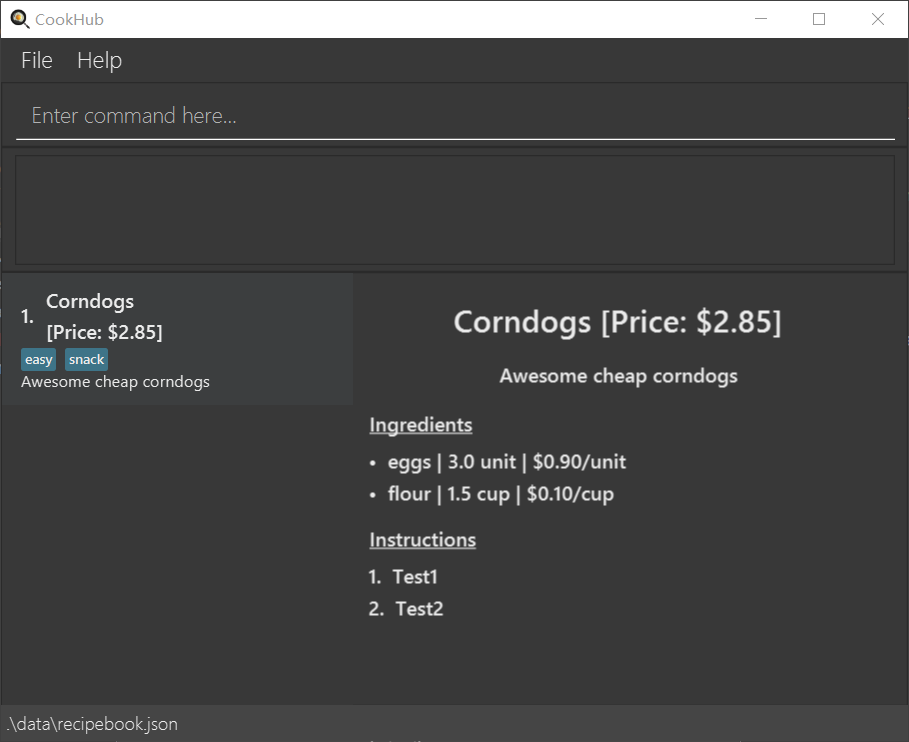
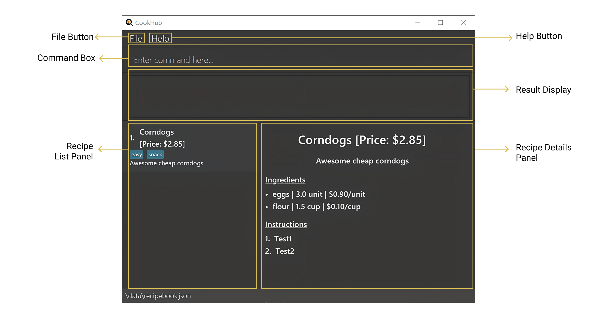
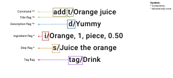
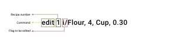
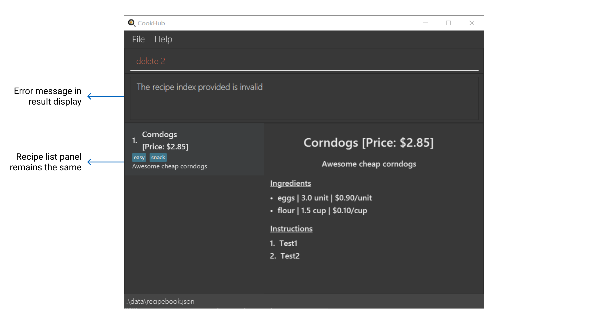
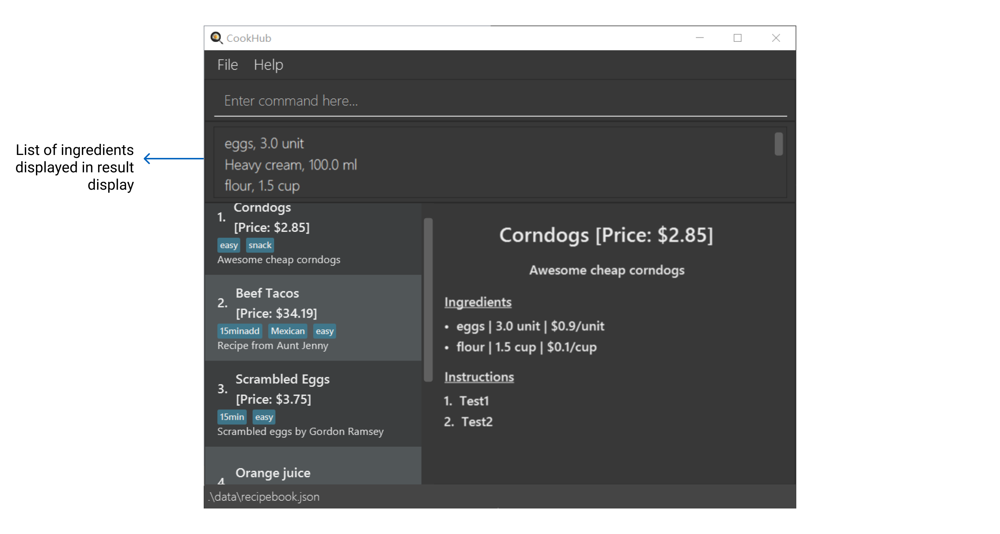
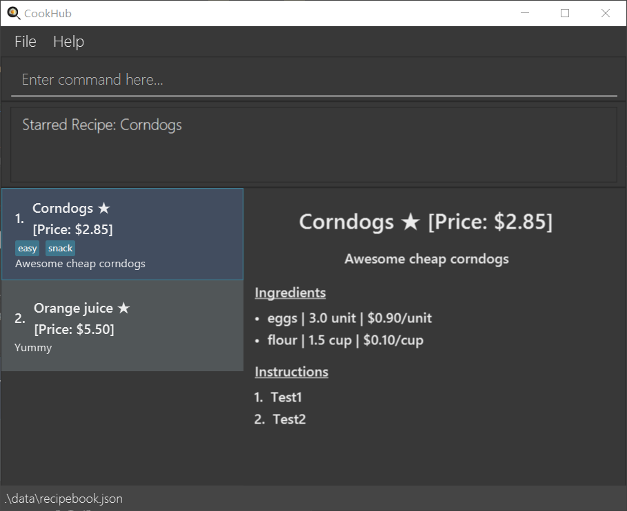

<p align="center" width="100%">
    
</p>

## Greetings from CookHub!

How many times have you jotted down a recipe on a slip of paper, only to lose it when you actually need it? How many times have you 
searched through your cookbook, in hopes of finding a recipe with a short-enough cooking time, so that you can cook yourself healthy meal despite your busy university schedule?
If you are a student cook whose cookbook is stuffed with tons of sticky notes, loose-leaf papers, and old family recipes, **CookHub** is the app for you!

**CookHub** is a powerful, but lightweight application for your recipe management needs.
It sports a sleek and minimalist design that allows you to clearly view all your personal recipes at a glance!

**CookHub** mainly uses the [command line interface](#glossary) that is optimised for fast typists who aim to manage their recipes quickly, while still 
enjoying the benefits of a [Graphical User Interface(GUI)](#glossary).

**CookHub** excels in its simplicity and optimisation for the student cook's recipe management needs. 
It supports management via recipe ingredients and price. Having a gentle learning curve and requiring 
minimal setup, it is perfect for the contemporary student cook!

Here is a short overview of the features and capabilities of **CookHub**:
* Creating recipes with specified titles, ingredients, steps, and tags.
* [Starring](#glossary) and [unstarring](#glossary) each recipe.
* Getting all your [favourite](#glossary) recipes. 
* Finding recipes by titles, ingredients, steps, or tags.
* Sorting or filtering by price.
* Getting all the combined ingredients for a set of recipes. 

|   If you are   |                                         You should                                         |
|:--------------:|:------------------------------------------------------------------------------------------:|
|   a new user   | proceed to our [quick start](#quick-start) section to set up CookHub and try its features |
| returning user |       skip to our [command summary](#command-summary) for a summary of our features!       |

* Table of Contents
{:toc}

<hr style="border:2px solid gray">

## Quick start

1. Ensure you have Java `11` or above installed in your Computer.

2. Download the latest `cookhub.jar` from [here](https://github.com/AY2223S2-CS2103T-W09-1/tp/releases).

3. Copy the file to the folder you want to use as the _home folder_ for your CookHub.

4. Open a command terminal, `cd` into the folder you put the jar file in, and use the `java -jar cookhub.jar` command to run the application.<br>

   A GUI similar to the below should appear in a few seconds. Note how the app contains some sample data.<br>
   <p align="center" width="100%">
    
   </p>

    Learn more about CookHub's GUI [here](#understanding-the-graphical-user-interface-gui).
   

5. Type the command in the command box and press Enter to execute it. e.g. typing **`help`** and pressing Enter will open the help window.<br>

   To get you familiarised, here are some example commands you can try:
   * `add t/Watermelon juice d/Quick and easy watermelon juice i/Watermelon, 3, Slices, 0.10 s/Juice the watermelon` : Add a new recipe titled `Watermelon juice` that has a description `Quick and easy watermelon juice`, an ingredient of `Watermelon, 3, Slices, 0.10`, and a step of `Juice the watermelon`
   * `delete 1 ` : Delete a recipe at index 1
   * `list` : Lists all recipes
   * `exit`: Exits the app

6. Refer to the [Features](#features) below for details of each command.

[Back to top](#top)

<hr style="border:2px solid gray">

## Understanding the Graphical User Interface (GUI)
In order to make the most out of your experience in CookHub, let us understand the application's GUI better.

<p align="center" width="100%">
    
</p>


| Part of CookHub's GUI | Description                                                                                                                     |
|-----------------------|---------------------------------------------------------------------------------------------------------------------------------|
| Help Button           | A button that opens the help menu.                                                                                              |
| File Button           | A button that allows you to exit the application.                                                                               |
| Command Box           | A text field that allows you to enter a command that CookHub executes.                                                          |
| Result Display        | A text display that displays any information regarding command inputs, such as success or errors.                               |
| Recipe Details Panel  | A panel that displays information on the recipe that is clicked in `Recipe List Panel`.                                         |
| Recipe List Panel     | A panel that displays a list of all saved recipes. <br/>Click on each recipe to view its details in the `Recipe Details Panel`. |

[Back to top](#top)

<hr style="border:2px solid gray">

## Command Line Interface (CLI) Tutorial
The CLI is a medium in which the application interacts with the user, through text-based inputs. 
As **CookHub** mainly uses the CLI, this tutorial will equip you with the CLI fundamentals required for **CookHub**. However, if you are already familiar with the CLI, you can skip to the [Features](#features)
section to get started with our features.
This tutorial will give walk through the most fundamental commands to equip you with basic understanding of our command format.
First, let's look at the most basic command, the `add` command. A sample `add` command is shown below: <br>
```
add t/Cookies d/Yummy s/Mix the batter i/Flour, 30, grams, 0.20 
```
The first word of the command, `add`, tells **CookHub** that you have the intention of adding a recipe. Subsequently, the `t/` command flag
tells **CookHub** that the following words make up the *title* of the recipe. Hence, **CookHub** will recognise that the title of the recipe is 'Cookies'.
Then, the `d/` command flag signifies that 'Yummy' is the *description* of the recipe, and the `s/` command flag signifies that the sentences 'Mix the batter' is a *step* in the recipe. 
Lastly, the `i/` flag signifies that the recipe has *ingredient* 'Flour, 30, grams, 0.20'. 'Flour, 30, grams, 0.20' is to be interpreted as
30 grams of flour, in which it costs $0.20 for each gram of flour.

Another fundamental command is the `edit` command. A sample `edit` command is shown below: <br>
```
edit 1 d/Disgusting
```
This command has a similar format to the above `add` command, except that the `edit` is followed by a number. The number `1` signifies that 
you want to edit the first recipe in **CookHub**. Similarly to the `add` command, the `d/` flag signifies that the *description* of the recipe should be 'Disgusting'.
In essence, this command edits the description of the first recipe in **CookHub** to 'Disgusting'.

[Back to top](#top)

<hr style="border:2px solid gray">

## Features

<div markdown="block" class="alert alert-info">

**:information_source: Notes about the command format:**<br>

* Words in `lower_case` are commands or flags that must be typed literally.
* Words in `UPPER_CASE` are placeholder texts that are to be replaced by the user.
* Command flags (e.g. `t/`, `d/`) can be typed in any order
  - For example, the two commands below are the same, despite the swapped order of the command flags `t/` and `d/`
    - `add t/Corndogs d/Delicious i/Flour, 3.5, Cup, 0.30 s/Mix batter` 
    - `add d/Delicious t/Corndogs i/Flour, 3.5, Cup, 0.30 s/Mix batter`

* Items in square brackets are optional.
  - e.g  For the [add command](#add-a-recipe--add), `add t/Corndogs d/Delicious i/Flour, 3.5, Cup, 0.30 s/Mix batter` is a valid command, even though the command flag `tag/` is missing. 

* Items with `...` after them can be used multiple times, including zero times.
  - e.g. For the [add command](#add-a-recipe--add)`add t/Corndogs d/Delicious i/Flour, 3.5, Cup, 0.30 s/Mix batter s/Fry` is a valid command that has two `s/` flags

* *TITLE*, *DESCRIPTION*, *STEP*, *TAG* must be a word or sentence.
  - e.g. *TITLE* can be `I am a title`
  - e.g. *TAG* can be `Tag`

* *INGREDIENT* is of the format `INGREDIENT_NAME, QUANTITY, UNIT_OF_MEASUREMENT, PRICE_PER_UNIT`
  - *INGREDIENT_NAME*, *QUANTITY*, *UNIT_OF_MEASUREMENT*, *PRICE_PER_UNIT* are placeholder text meant to be replaced by the user following the below rules:
    - *INGREDIENT_NAME*, *UNIT_OF_MEASUREMENT* must be a word or sentence
    - *QUANTITY*, *PRICE_PER_UNIT* must be numeric
  - e.g. *INGREDIENT* can be `White wine vinegar, 2, tbsp, 0.10`
  - e.g. *INGREDIENT* can be `Large egg, 4, unit, 0.80`

</div>

[Back to top](#top)

<hr style="border:2px solid gray">

### Beginners' commands

#### Add a recipe : `add`

This command adds a recipe to your recipe book.

Format: `add t/TITLE d/DESCRIPTION i/INGREDIENT... s/STEP... [tag/TAG]...`<br>

<div markdown="span" class="alert alert-primary">:bulb: **Tips:** <br/>
- A recipe can have one or more ingredients, and one or more steps. <br/>
- A recipe can also have zero or more tags.
</div>

Below shows how you can add an *Orange juice* recipe.
<p align="center" width="100%">
    
</p>


Examples:
- `add t/Orange juice d/Yummy i/Orange, 1, piece, 0.50 s/Juice the orange` is valid and a recipe similar to the image
shown below will be added to the recipe book:

<p align="center" width="100%">
    
</p>


- `add t/Orange juice d/Yummy i/Orange, 1, piece, 0.50 i/Sugar, 50, g, 0.10 s/Juice the orange` is valid as 
multiple `i/` command flags are allowed. A recipe similar to the image shown below will be added to the recipe book:
<p align="center" width="100%">
    
</p>
- `add t/Orange juice d/Yummy i/Orange, 1, piece, 0.50` is not valid because the command flag `s/` is compulsory. An error message will appear, similar to the one shown below:
<p align="center" width="100%">
    
</p>

[Back to top](#top)

---
#### Edit a recipe: `edit RECIPE_NUMBER`
This command edits a recipe in your recipe book.

Format: `edit RECIPE_NUMBER [t/TITLE] [d/DESCRIPTION] [i/INGREDIENT] [s/STEP] [tag/TAG]...`

<div markdown="span" class="alert alert-warning">:warning: **WARNING:** <br/>
- At least one of the command flags need to be present.
</div>

- The *RECIPE_NUMBER* should refer to the index number shown in the displayed recipe book
- The *RECIPE_NUMBER* must be a positive integer starting from 1 and must exist in the recipe book

Below shows how you can edit the ingredients of the first recipe with CookHub.
<p align="center" width="100%">
    
</p>

Example:

- `edit 1 t/Corndog` is valid and the recipe will be edited like the image shown below:

<p align="center" width="100%">
    
</p>

- `edit 1 t/Corndogs i/flour, 200, g, 0.05` is valid as multiple flags are accepted. The recipe will be edited as shown below:

<p align="center" width="100%">
    
</p>

- `edit 1` is not valid as at least one flag is required and you will see an error message similar to that of the one shown below:
<p align="center" width="100%">
    
</p>

[Back to top](#top)

---
#### Delete a recipe : `delete RECIPE_NUMBER`
This command deletes the recipe at the specified *recipe number* from your recipe book.


Format: `delete RECIPE_NUMBER`

- The *RECIPE_NUMBER* refers to the index number shown in the displayed recipe book
- The *RECIPE_NUMBER* must be a positive integer starting from 1 and must exist in the recipe book

- Below shows how you can delete the first recipe in CookHub.
<p align="center" width="100%">
    
</p>


Examples:

Our initial recipe book:
<p align="center" width="100%">
    
</p>

- `delete 1` will result in a recipe book as shown below:


<p align="center" width="100%">

</p>

- `delete 2` is invalid. When there is currently only one recipe in the recipe book, you will see an error message as shown below:

<p align="center" width="100%">

</p>

[Back to top](#top)

---
#### List recipe : `list`

This command lists out all the recipes that you have added to the recipe book

Format: `list`

Example: `list` will list all the recipes similar to the image shown below:
<p align="center" width="100%">
    
</p>

[Back to top](#top)

---
#### Clear recipe : `clear`

This command clears your recipe book of all its recipes.

Format: `clear`

Example: `clear` will clear all recipes similar to the image shown below:

<p align="center" width="100%">
    
</p>


[Back to top](#top)

---
### Advanced commands

#### Find recipe : `find`

This command finds the recipes in your recipe book according to what you are looking for.

Format: `find [r/RECIPE] [t/TITLE] [s/STEP] [i/INGREDIENT] [tag/TAG]`

<div markdown="span" class="alert alert-warning">:warning: **WARNING:** <br/>
- Only one command flag can be present!
</div>

- the flag `r/` searches through the entire recipe and its components
- the flag `t/` searches only through the recipe's title
- the flag `s/` searches only through the recipe's steps
- the flag `i/` seaches only through the recipe's ingredient names
- the flag `tag/` searches only through the recipe's tags

<div markdown="span" class="alert alert-warning">:exclamation: **Constraint:** <br/>
- *find i/INGREDIENT* should only be used to find the name of the ingredients, and not its quantity, unit of measurement, or price per unit. e.g. *find i/lemons* is OK, but *find i/30g* should not be used!
</div>


Below shows how you can find for eggs in your recipe book with CookHub.
<p align="center" width="100%">
    
</p>

Examples:

Our initial recipe book:

<p align="center" width="100%">
    
</p>

- `find r/eggs` is valid and the result of the recipe book is as shown below:

<p align="center" width="100%">
    
</p>

- `find r/eggs s/fry the egg` is not valid as only one command flag is allowed. You should see an error message similar to
  the one in the image shown below:

<p align="center" width="100%">
    
</p>

- `find` is not valid as at least one flag is required. You should see an error message like the one in the image
shown below:

<p align="center" width="100%">
    
</p>

[Back to top](#top)

---
#### Search recipe with limited ingredients: `only`

This command searches for recipes that can be made with only those ingredients.

Format: `only INGREDIENT...`

<div markdown="span" class="alert alert-primary">:bulb: **Tips:** <br/>
- One or more ingredients can be provided. e.g. *only egg cheese*
</div>

Examples:

Our initial recipe book:

<p align="center" width="100%">
    
</p>

- e.g. `only eggs` is valid, and will search for recipes that have ingredients that at most contain eggs, and nothing more. The result of the command is as shown below:

<p align="center" width="100%">
    
</p>

- e.g. `only eggs flour` will search for recipes that have ingredients that at most contains eggs and flour.
A recipe that only needs eggs will also be valid. The result of the command is shown below:

<p align="center" width="100%">
    
</p>

- e.g. `only` is not valid as at least one parameter is needed. You should see an error message similar to the one in the image shown
  below:

<p align="center" width="100%">

</p>

[Back to top](#top)

---
#### Sort recipe by cost: `sort ORDER`

This command sorts the recipes in your recipe book by price in the order specified. 

Format: `sort ORDER`
- *ORDER* can only be `asc` or `desc`.
- `asc` is used for ascending order, and `desc` is used for descending order
- The price of a recipe is determined by cost of all ingredients required.

<div markdown="span" class="alert alert-warning">:exclamation: **Constraint:** <br/>
- You can only sort recipes in ascending or descending order of price.
</div>

Below shows how you can sort your recipe book in ascending order.
<p align="center" width="100%">
    
</p>
Example: 

Our initial recipe book:

<p align="center" width="100%">
    
</p>

- `sort desc` will display your sorted recipe book similar to the image shown below:

<p align="center" width="100%">
    
</p>

[Back to top](#top)

---
#### Get list of groceries: `groceries RECIPE_NUMBER, ...`

Given one or more recipes, displays a list of all the groceries the user needs to cook these recipes.

Format: `groceries RECIPE_NUMBER, ...`
- If two or more recipes share ingredients, their quantities will be automatically added together.
- The `indices` have to be separated by a comma (`,`).

<div markdown="span" class="alert alert-primary">:bulb: **Tips:** <br/>
- The ellipses means you can input multiple recipe numbers! 
</div>

Below shows how you can get a list of groceries to cook for recipes 1, 3 and 4.
<p align="center" width="100%">
    
</p>

Example: 

Our initial recipe book:
<p align="center" width="100%">
    
</p>

Expected outcome: A list of ingredients for recipes with index 1, 3 and 4, will be displayed in the result 
display along with their quantities.
<p align="center" width="100%">
    
</p>

[Back to top](#top)

---

#### Filter recipe by price: `fp COMPARATOR PRICE`

This command filters the recipes in your recipe book by price according to the comparator specified. 

Format: `fp COMPARATOR PRICE`

- *COMPARATOR* can only be `<` or `>`.
- `<` is used to represent "less than"
- `>` is used to represent "more than"
- *PRICE* can take on any positive real number
- The price of a recipe is determined by cost of all ingredients required.

<div markdown="span" class="alert alert-primary">:bulb: **Tips:** <br/>
- The only comparators are < or >. If you really want to search for recipes that are exactly a certain price, e.g. $4.44, you can use *fp > 4.43* and look at the first few results!
</div>

Below shows how you can filter for all recipes with prices *less than 4.50*.
<p align="center" width="100%">
    
</p>

Example: 

Our initial recipe book:
<p align="center" width="100%">

</p>

- `fp < 4.50` will display all recipes that have a lower price than $4.50, as shown in the image below:
<p align="center" width="100%">

</p>

[Back to top](#top)

---
#### Add recipe to favorites: `star RECIPE_NUMBER`

This command adds the recipe at the specified *recipe number* into your favorites, which include all recipes 
you like the most!

Format: `star RECIPE_NUMBER`

- The *RECIPE_NUMBER* refers to the index number shown in the displayed recipe book
- The *RECIPE_NUMBER* must be a positive integer starting from 1 and must exist in the recipe book

<div markdown="span" class="alert alert-primary">:bulb: **Tips:** <br/>
- Make sure to refresh the recipe list by either clicking on the recipe in the left panel or calling the *list* command to see the star added to the recipe!
</div>

Below shows how you can add the first recipe to your favourites.
<p align="center" width="100%">
    
</p>

Examples:

Our initial recipe book:
<p align="center" width="100%">

</p>

- `star 2` will star the second recipe, as shown in the image below:

<p align="center" width="100%">

</p>

[Back to top](#top)

---
#### Remove recipe from favorites: `unstar RECIPE_NUMBER`

This command removes the recipe at the specified *recipe number* from your favorites.

Format: `unstar RECIPE_NUMBER`

- The *recipe number* refers to the index number shown in the displayed recipe book
- The *recipe number* must be a positive integer starting from 1 and must exist in the recipe book

<div markdown="span" class="alert alert-primary">:bulb: **Tips:** <br/>
- Make sure to refresh the recipe list by either clicking on the recipe in the left panel or calling the *list* command to see the star removed from the recipe!
</div>

Below shows you can remove the first recipe from your favourites.
<p align="center" width="100%">
    
</p>

Examples:

Our initial recipe book:
<p align="center" width="100%">
    
</p>

- `unstar 2` will remove the star of the second recipe, as shown in the image below:

<p align="center" width="100%">
    
</p>

[Back to top](#top)

---

#### List recipes in favorites : `favorites`

This command lists out all the recipes that you have added to your favorites (*all recipes with a star*).

Format: `favorites`

Example:

Our initial recipe book:

<p align="center" width="100%">
    
</p>

- `favorites` will display all your starred recipes, as shown in the image below:

<p align="center" width="100%">
    
</p>

[Back to top](#top)

---

#### Provide link to user guide : `help`

This command generates a link to our user guide.

- A window should pop up, and it should look like the one in the image below:


Format: `help`

[Back to top](#top)

<hr style="border:2px solid gray">

### Saving the data

CookHub data are saved in the hard disk automatically after any command that changes the data. There is no need to save manually.

---

### Editing the data file

CookHub data are saved as a JSON file `[JAR file location]/data/cookhub.json`. Advanced users are welcome to 
update data directly by editing that data file.

<div markdown="span" class="alert alert-warning">:exclamation: **Caution:**
If your changes to the data file makes its format invalid, CookHub will discard all data and start with an empty data file at the next run.
</div>

---

### Archiving data files `[coming in v2.0]`

_Details coming soon ..._

[Back to top](#top)

<hr style="border:2px solid gray">

## FAQ

**Q**: How do I transfer my data to another Computer?<br>
**A**: Install the app in the other computer and overwrite the empty data file it creates with the file that contains the data of your previous CookHub home folder.

[Back to top](#top)

<hr style="border:2px solid gray">

## Command summary
Format meanings:

- Words in lower_case are commands or flags to be typed as-is
- Words in UPPER_CASE are values of parameters to be supplied by the user
- Words in [Square brackets] are optional parameters (Note:ls can stack filters)
- Words that are followed by * are parameters that can be used multiple times


| Action                         | Format                  | Examples  |
|--------------------------------|-------------------------|-----------|
| Add Recipe                     | `add t/TITLE d/DESCRIPTION i/INGREDIENT... s/STEP... [tag/TAG]...`    | `add t/Orange juice d/Yummy i/Orange, 1, piece, 0.50 s/Juice the orange`  |
| Edit Recipe                    | `edit RECIPE_NUMBER [t/TITLE] [d/DESCRIPTION] [i/INGREDIENT] [s/STEP] [tag/TAG]...`    | `edit 1 t/Corndog`  |
| Delete Recipe                  | `delete RECIPE_NUMBER`   | `delete 1`  |
| List Recipe                    | `list`   | `list`  |
| Clear Recipe                   | `clear`   | `clear`  |
| Find Recipe                    | `find [r/RECIPE] [t/TITLE] [s/STEP] [i/INGREDIENT] [tag/TAG]`   | `find r/eggs`  |
| Search Recipe with limited ingredients | `only INGREDIENT...`   | `only eggs flour`  |
| Sort Recipes by price          | `sort ORDER`             | `sort asc`  |
| Get list of groceries          | `groceries RECIPE_NUMBER, ...` | `groceries 1, 3, 4` |
| Filter Recipes by price        | `filter COMPARATOR PRICE` | `fp < 4.20` |
| Add Recipe to favorites        | `star RECIPE_NUMBER` | `star 1` |
| Remove Recipe from favorites   | `unstar RECIPE_NUMBER` | `unstar 1` |
| List Recipes in favorites      | `favorites` | `favorites` |
| Provide link to User Guide     | `help` | `help` |


[Back to top](#top)

<hr style="border:2px solid gray">

## Glossary

| Term	                              | Definition                                                               |
|------------------------------------|--------------------------------------------------------------------------|
| **Command Line Interface (CLI)**   | 	A program that mainly uses typed commands to interact with the app.     | 
| **Graphical User Interface (GUI)** | 	What the user sees when interacting with the app.                       |
| Alphanumeric                       | A combination of both letters and numbers without space.                 |
| Terminal                           | A text-based interface for the computer.                                 |
| Favorites                          | All your starred recipes                                                 |
| Starring                           | Adding a star to your recipe                                             |
| Unstarring                         | Removing a star from your recipe                                         |


[Back to top](#top)
