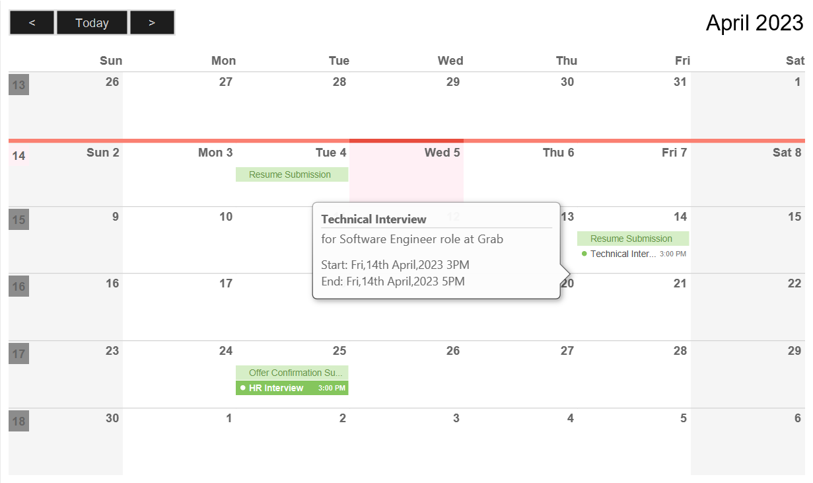
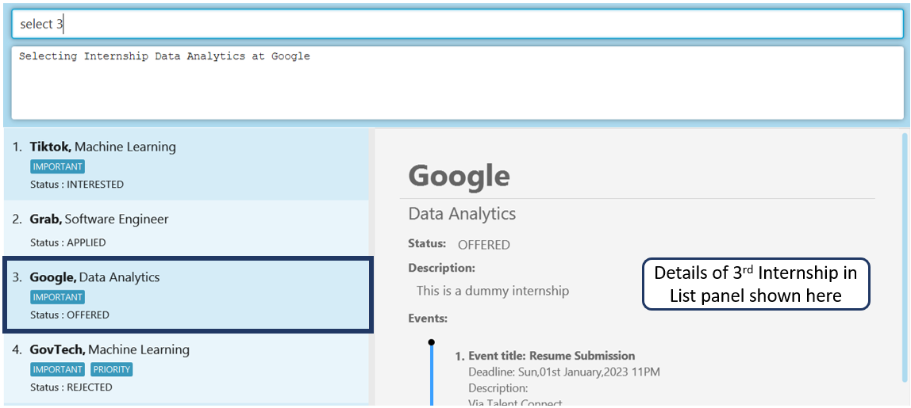
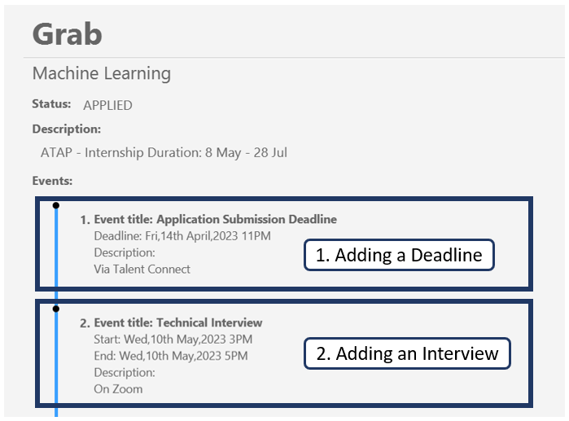

## **Table of Contents**
* Table of Contents
{:toc}

<h1 align="center">
    <b>The Intern's Ship - User Guide</b>
</h1>

     

## **Introduction**
Designed with **internship-seeking university students** in mind, **The Intern’s Ship (TinS)** aims to make
managing your internship applications fuss-free. Despite being optimised for use via the keyboard,
you will still be able to enjoy the benefits of having a visual display.

With TinS, you can conveniently and efficiently manage, coordinate and keep track of your internship applications
all in one place.

**Notable Features**
  * Finding a particular internship application in TinS using keywords: [`find`](#finding-internships-find)
  * Finding a particular event in TinS using keywords: [`event find`](#finding-a-particular-event--event-find)
  * Calendar View: [`calendar`](#opens-the-calendar-page--calendar)
  * Finding all clashing events: [`clash`](#finding-all-clashing-events--clash)

## **About the User Guide**

### Objective of User Guide

The Objective of this User Guide is to provide you with useful instructions on how to navigate the TinS application.
To ensure a smooth on-boarding process to The Intern's Ship, this User Guide will include detailed
step-by-step instructions on how to install the TinS application into your device, as well as how to use the various
features of TinS. If you are a frequent user of TinS, this User Guide will also include useful tips on how you can use
TinS in a more efficient way.

### How the User Guide is Formatted

#### Additional Tips and Comments

**Information Box**

    :information_source: **Info:** Provides you with additional information that might be useful

**Tip Box**

    :bulb: **Tip:**  Suggestions on how you can make better use of TinS

**Warning Box**

    :warning: **Warning:**  Warns of a dangerous action that you should be aware of when using TinS

#### Syntax Highlighting

Commands, fields, prefixes and file paths are highlighted in the User Guide.

Example: `list`, `POSTIION`, `data/internshipcatalogue.json`

### How to use the User Guide
* If you **have not installed TinS** or **are new to TinS**, [Quick Start](#quick-start) will guide you through the
  process of installing TinS and provide you with a brief introduction to TinS.
* If you are **a more advanced user of TinS**, the [Features](#features) section contains detailed information of what
  features TinS has to offer. Embedded in this section is also tips on how you can maximize your efficiency while using
  TinS.

## **Quick Start**

1. Ensure you have Java `11` or above installed in your Computer.

   

   :bulb: **Tip:**  If you have not installed Java `11` in your computer, here are some useful online tutorials, which
   can guide you in the installation process. 
   ([MacOS](https://java.tutorials24x7.com/blog/how-to-install-java-11-on-mac) /
    [Windows](https://java.tutorials24x7.com/blog/how-to-install-java-11-on-windows) /
    [Linux](https://javahelps.com/install-oracle-jdk-11-on-linux))
   

2. Download the latest `tins.jar` from [here](https://github.com/AY2223S2-CS2103T-W11-2/tp/releases/tag/v1.4).

3. Copy the file to the folder you want to use as the _home folder_ for your TinS.

   

   :information_source: **Info:** A _home folder_ is the folder you would like TinS to use to store all your internship
   application data and relevant files to TinS. You can choose to use any existing folder you have or create a new
   empty folder.
   

4. Double-click on the file `tins.jar` to launch TinS.
   A TinS Application Interface similar to the one below should appear in a few seconds.
   

   

        :bulb: **Tip:** The default TinS application contains some sample data. If you are new to TinS, these sample
        data can be useful for trying out the various commands of TinS. To remove all sample data, use the 
        <code>deleteall</code>.
   

5. Type your command into the Command Box, then press <button>Enter</button> to instruct TinS to execute your command.
   Here are some basic commands you can try:
    * `list` : List all internships in the List Panel
    * `add p/Data Analyst c/Google s/0 d/NA t/IMPORTANT t/PRIORITY` : Add an internship to TinS
    * `delete 1` : Delete the first internship in the List Panel from TinS

6. Refer to the [Command Summary](#command-summary) below for your desired TinS Commands. More details on each specific
TinS command can be found [here](#features).

## **About TinS**

### About TinS Application's Interface

1. **Command Box**: This is where you would input your commands.
2. **Program Response**: This box displays the program's feedback to your inputted commands. 
   Types of Program Response Messages:
   * Success Message: indicating that TinS has successfully executed your command
   * Error Message: indicating the reason why TinS was not about to execute your command and tips on what you can do to
   correct the error
3. **List Panel**: This panel displays your internships listings stored in TinS (including Position, Company, Status
   and Tags).
4. **Display Panel**: This panel is used to display more details. Depending on your given command, the Details could be
   any one of the following:
   * More details pertaining to a Specific Internship
   * Pages: Home, Calendar View, Statistics
   * Results of Commands, like `clash` or `event find`
5. **Location Bar**: This location bar states the location in which your TinS data file is currently stored on your
   local device

### How your Internship Application Data is Organised in TinS

#### Internships

In TinS, an internship application is stored as an **Internship**. An Internship has the following fields:

* `POSITION`: The Name of the Internship Position.
* `COMPANY` : The Name of the Hiring Company.

:information_source: **Info:** Each Internship is **uniquely identifiable** by a **combination** of its `POSITION` and
`COMPANY`. `POSITION` and `COMPANY` fields are **case-insensitive**.   

Example: An Internship with `POSITION` as `Software Engineer` and `COMPANY` as `Grab` will be identified to be the
same internship as an Internship with `POSITION` as `Software ENGINEER` and `COMPANY` as `GRAB`.

* `STATUS` : The Status of your Application. This is an **Integer value** from **0 to 3**. Here are the statuses for the
  corresponding integer values:
   * `0` : Interested
   * `1` : Applied
   * `2` : Offered
   * `3` : Rejected

* `DESCRIPTION` : Additional details about the Internship (E.g. Contact Details of Hiring Manager, Link to Internship
  Webpage, Requirements of Internship). This field is optional.

* `TAG` : Customised Tag (E.g. `IMPORTANT`, `PRIORITY`). An Internship can have zero or more tags. All tags in
  TinS are displayed in capitalised letters.
  * `TAG` must be alphanumeric (i.e. a `TAG` should not contain any blank-spaces, hyphens, colons, dashes etc).

    :bulb: **Tip:** It is recommanded that your entries for `POSITION`, `COMPANY` and `TAG` have a maximum
    of **40 characters**. While TinS will still allow the addition of entries with more than 40 characters, without
    giving a warning, the addition of these fields could affect the visual display of TinS (i.e. truncated fields).

An Internship can also store **zero or more** **Event**.

#### Events

In TinS, an **Event** can be used to represent a **Deadline** or an **Interview** associated to an Internship. An Event
has the following fields:

* `EVENT_NAME`: The Name of the Event. The Name of an Event is case-sensitive.

    :bulb: **Tip:** It is recommanded that your entry for `EVENT_NAME` have a maximum of **40 characters**.
    While TinS will still allow the addition of entries with more than 40 characters, without giving a warning, the
    addition of this field could affect the visual display of TinS (i.e. truncated field).

* `START_DATETIME`: The Starting Time of an Event (in the format: DD/MM/YYYY HHMM).
* `END_DATETIME`: The Ending Time of an Event (in the format: DD/MM/YYYY HHMM).
  * If the Event is a **Deadline**, the `START_DATETIME` will be the same as the `END_DATETIME`.
* `EVENT_DESCRIPTION`: Description of the Event (e.g. Venue, Things to take note of). This field is optional.

### Information about Crafting Your Command
This section contains information on how to craft your command.

#### Prefixes and Fields
TinS differentiates between the various fields in your command by its preceding prefix. The Prefixes are designed to be
short, to enable you to quickly indicate which field your information is associated to. Here is the list of fields and
their associated prefixes.

<table>

<tr>
<th>Field</th>
<th>Prefix</th>
</tr>

<tr>
<td><code>POSITION</code></td>
<td><code>p/</code></td>
</tr>

<tr>
<td><code>COMPANY</code></td>
<td><code>c/</code></td>
</tr>

<tr>
<td><code>STATUS</code></td>
<td><code>s/</code></td>
</tr>

<tr>
<td><code>DESCRIPTION</code></td>
<td><code>d/</code></td>
</tr>

<tr>
<td><code>TAG</code></td>
<td><code>t/</code></td>
</tr>

<tr>
<td><code>EVENT_NAME</code></td>
<td><code>na/</code></td>
</tr>

<tr>
<td><code>START_DATETIME</code></td>
<td><code>st/</code></td>
</tr>

<tr>
<td><code>END_DATETIME</code></td>
<td><code>en/</code></td>
</tr>

<tr>
<td><code>EVENT_DESCRIPTION</code></td>
<td><code>de/</code></td>
</tr>

</table>

:warning: **Warning:**  The sequence of a blackspace and a prefix should be reserved solely for indicating information
pertaining to the associated field.   

Example: If you input a `DESCRIPTION` field as `d/This is a my description p/field`, TinS would recognise the 
sequence <code> p/</code> as an indicator for the `POSITION` field. Hence, the above input would be recognised as an input with
two fields, a `DESCRIPTION` field - `d/This is a description` and a `POSITION` field - `p/field`.

#### Notes about the Command Format

* Command words are case-insensitive.

  Example: The command `LIST` is the same as the command `list`.

* Prefixes are case-sensitive.

  Example: Entering the prefix `P/` will not be recognised by TinS as `p/`

* Words in `UPPER_CASE` are the fields to be supplied by you.

  Example: in `add p/POSITION c/COMPANY s/STATUS [d/DESCRIPTION] [t/TAGS]...`, `POSITION` is a parameter which can be
  used as `add p/Software Engineer c/Grab s/1 d/Requires python t/IMPORTANT`.

* Items in square brackets are optional.

  Example: `[d/DESCRIPTION]` means in `add p/POSITION c/COMPANY s/STATUS [d/DESCRIPTION] [t/TAG]...` means the commands
  `add p/Software Engineer c/Grab s/0` and `add p/Software Engineer c/Grab s/0 d/This is a description` are both
  valid.

* Items with `...` after them can be used multiple times including zero times.

  Example: `[t/TAG]...` in `add p/POSITION c/COMPANY s/STATUS [d/DESCRIPTION] [t/TAG]...` means the command
  `add p/Software Engineer c/Grab s/0 d/This is a description` and 
  `add p/Software Engineer c/Grab s/0 d/This is a description t/IMPORTANT t/PRIORITY` are valid.

* Items without `...` after them should only be used **once**.

  

  :warning: **Warning:**  If an item without `...` after it is used more than once, TinS will identify the last
  occurrence of that item as the input for that field.   

  Example: `add p/POSITION c/COMPANY s/STATUS [d/DESCRIPTION] [t/TAG]...` means that the item, `p/POSITION` should only
  be used once. Hence, if 
  `add p/Software Engineer c/Grab s/0 d/This is a description t/IMPORTANT p/Data Analyst p/Machine Learning` is
  entered, TinS would identify the input for the field `POSITION` as `Machine Learning`.
  

* Fields can be in any order.

  Example: `add p/POSITION c/COMPANY s/STATUS [d/DESCRIPTION] [t/TAG]...` is the same as
  `add c/COMPANY s/STATUS [d/DESCRIPTION] p/POSITION [t/TAG]...`

* If the command does not require you to input a field, any extra field/values enter after the identified
  command is ignored.

  The commands in TinS that do not require additional input of fields from user are `list`, `clash`, `home`, `calendar`,
  `stats`, `help` and `exit`.

  Example: If `clash help` is entered, TinS will identify your command as a `clash` command, ignoring all the extra
  fields/values found after `clash`, and execute the command `clash`.

## **Features**

### Opens the Home Page : `home`

Opens the Home Page in the Display Panel.

    :bulb: **Tip:**  The `home` command can also be used to refresh the Home Page in the Display Panel.

* Home Page reminds you of your upcoming deadlines and interviews, occurring either today or tomorrow, and the command
  format for useful commands, by conveniently displaying them in the Display Panel.

Example: `home`

### Opens the Statistics Page : `stats`

Calculates statistics based on your current internship applications and displays personalized statistics in the
Display Panel.

    :bulb: **Tip:**  The `stats` command can also be used to refresh the Statistic Page in the Display Panel.

* Statistics Page shows you a summary of how your internship-seeking journey has been. The pie chart provides you with a
  visual representation of the current status of your internship applications.

Example: `stats`

### Opens the Calendar Page : `calendar`

Displays a calendar view of all your events in the Display Panel.

    :bulb: **Tip:**  The `calendar` command can also be used to refresh the Calendar Page in the Display Panel.

* Clicking on an event displayed in the calendar view shows you more details about the event.

    :bulb: **Tip:**  If there are too many events on one day, you can use the `event find` function to find events by
    their start and end timings.

Example: `calendar`

### Adding an Internship Application : `add`

Adds an internship and its details to TinS.

Format: `add p/POSITION c/COMPANY_NAME s/APPLICATION_STATUS [d/DESCRIPTION] [t/TAG] ...`

    :information_source: **Info:** In TinS, each internship stored must be unique (no duplicates). Since an internships
    is uniquely identified by the combination of `POSITION` and `COMPANY` fields, you would not be able to `add` an
    internship application to TinS, if there is a pre-existing internship in TinS with the same `POSITION` and `COMPANY`
    (comparison is case-insensitive).   
 
    Example: If TinS contains an Internship with `POSITION` as `Software Engineer` and `COMPANY` as `Grab`, the commands
    `add p/Software Engineer c/Grab s/0` and `add p/SOFTWARE engineer c/Grab s/3` are not allowed.

:information_source: **Info:** In TinS, Tags are standardised to be all in capitalised letters. If you enter
`t/important`, TinS will automatically save it as `t/IMPORTANT` for you.

Example: `add p/Software Engineer c/Grab s/1 d/Requires knowledge of Python and Java t/Important t/Priority`

### Listing all Internships Applications : `list`

List all the internships in List panel.

* After keying in the `list` command, TinS displays **all** the Internships stored in TinS in the List panel.
* Only the `POSITION`, `COMPANY`, `STATUS` and `TAG` are display in the List Panel for each Internship.

Example: `list`

### Finding Internships: `find`

Finds an Internships by their fields (`POSITION`, `COMPANY`, `STATUS`, `TAG`).

Format: `find [p/POSITION] [c/COMPANY] [s/STATUS] [t/TAG]...`

* Choose the fields you would like to filter the Internship Catalogue by. At least one field must be chosen, but more
  than one field can be chosen.
* If your chosen field is `POSITION` or `COMPANY`, TinS will find all internship containing your given keyword in
  the `POSITION` or `COMPANY` field. This search is case-insensitive.
* If your chosen field is `STATUS`, TinS will find all internships with the `STATUS` indicated in your command.
* If your chosen field is `TAG`, TinS will find all internships with all the `TAG` fields indicated in your command.
  This search is case-insensitive.

    :information_source: **Info:** If your command is `find t/`, TinS will return all internships with no `TAG` field.

* After keying in your `find` command, TinS will find internships that fulfil all your requirements given,
  displaying them in the List Panel.
* To view all Internship in TinS again, simply enter the `list` command.

Example: TinS has 7 internship listings. `find c/tech t/important` would return the list of internships with `COMPANY`
containing the word "gov" and `TAG` as `IMPORTANT`.

### Viewing Details of a Particular Internship Application : `select`

View more details of the internship application selected by ID.

Format: `select ID`

* `ID`: The number of the selected internship in the List Panel.
* After keying in the `select` command, TinS will return the all details of the selected internship in the Display
  Panel.

Example: `select 2`

### Editing Details of Internship Application : `edit`

Edit details of the internship application selected by ID.

Format: `edit ID [p/POSITION] [c/COMPANY] [s/STATUS] [d/DESCRIPTION] [t/TAG] ...`

* `ID`: The number of the selected internship in the List Panel.
* Choose one or more fields to edit.
* After keying in the `edit` command, along with your new edited fields, TinS will update the corresponding fields of
  the internship application accordingly.

Example:

After keying in the `edit` command followed by an existing `ID` and the fields `STATUS` and `DESCRIPTION`,
TinS will update the `STATUS` and `DESCRIPTION` fields of the internship application with the specified
`ID`, then display the newly updated internship application. The command `edit 1 s/1 d/Learn C++` will return the
following results.

### Deleting an Internship Application : `delete`

Deletes an internship along with its details by ID.

Format: `delete ID`

* `ID`: The number of the selected internship in the List Panel.
* Deletes the internship application at the specified `ID` in the List Panel.

Example: `delete 3` deletes the 3rd internship listed in the List Panel. In this example, the
internship application with `POSITION` as `Data Analytics` and `COMPANY` as `Google` is removed.

### Event Commands
This section contains commands to manage your [events](#events) associated with each internship application.

#### Adding an Event to an Internship Application : `event add`

Adds an Event along with its details to the selected internship.

:information_source: **Info:** Before adding an event, you have to select an internship using `select ID`.

:information_source: **Info:** Add event does not allow you to add duplicate events. Two events are considered
duplicates if they have the same `EVENT_NAME`, `START_DATETIME` and `END_DATETIME`. `EVENT_NAME` is
case-sensitive.

Format: `event add na/EVENT_NAME [st/START_DATETIME] en/END_DATETIME [de/EVENT_DESCRIPTION]`

* `START_DATETIME` and `END_DATETIME` fields need to be in the format : DD/MM/YYYY HHMM

:information_source: **Info:** `event add` enables you to add events even if the events occurred in the past.

Examples:
1. If you would like to add an Internship Application Submission Deadline:
  `event add na/Application Submission Deadline en/14/04/2023 2359 de/Via Talent Connect`
2. If you would like to add an Interview:
  `event add na/Technical Interview st/10/05/2023 1500 en/10/05/2023 1700 de/On Zoom`

#### Deleting an Event from an Internship Application : `event delete`

Deletes selected Event along with its details from the selected internship.

:information_source: **Info:** Before deleting an event, you have to select an internship using `select ID`.

Format: `event delete ID`
* `ID`: The ID of the selected event in the list

Examples: `event delete 1` entered after `select 1` deletes the first event in the first internship.

#### Finding a particular Event : `event find`

Finds events based on certain filters.

Format: `event add [na/EVENT_NAME] [st/START_DATETIME] [en/END_DATETIME]`

* Choose the fields you would like to filter the events by. At least one field must be chosen, but more
  than one field can be chosen.
* If your chosen field is `EVENT_NAME` field, TinS will find all events containing your given keyword in the 
  `EVENT_NAME` field. This search case-insensitive.
* If your chosen field is `START_DATETIME` and `END_DATETIME`, enter a `DATETIME` in the format DD/MM/YYYY HHMM. 
  TinS will find events with the corresponding `START_DATETIME` or `END_DATETIME`.
* After keying in your `event find` command, TinS will find events that fulfil all your requirements given,
  displaying them in the Display Panel.

Example: `event find na/interview st/14/04/2023 1400` returns a list of events with `EVENT_NAME` containing the keyword
"interview" and starting time 14 April 2023, 2pm.

### Finding all Clashing Events : `clash`

Displays all events with clashing timings in the Display Panel.

* Clashing Event are arranged by date.
* Two events are clashing if they are **Interview** events and have overlapping start and end timings.
* Clicking on a particular date, you will be able to see all events with clashing timings occuring on that date.

Format: `clash`

Example:

### Clearing all Internship Applications in TinS : `deleteall`

Deletes all existing Internship Applications and Events in TinS.

* When you enter the command `deleteall`, TinS will prompt you to double confirm that you would like to delete **all**
  Internship Applications and Events currently stored in TinS.
* To proceed with executing the command, enter `deleteall confirm`.

:bulb: **Tip:**  The `deleteall` command can come in handy if you need to delete all the dummy data initially stored in
TinS or to reset the data in TinS in preparation for your next Internship Application season.

:warning: **Warning:** This command is irreversible. Only use it when you would like to clear **all** internship
applications and events in TinS.

:warning: **Warning:** If you enter `deleteall confirm` directly, without first entering `deleteall`, TinS will delete
all internship application and events in TinS immediately. Hence, you are advised to avoid entering the command
`deleteall confirm` directly.

Format: `deleteall`

### Getting Help : `help`

Provides you with a link to helpful instructions on how to use TinS.

Format: `help`

### Exiting the program : `exit`

Exits and closes the TinS application.

Format: `exit`

### Saving the data

The Intern Ship’s data is saved in the hard disk automatically after any command that changes the data.
There is no need to save manually.

--------------------------------------------------------------------------------------------------------------------

## **Command Summary**

<table>

<tr>
<th>Action</th>
<th>Format</th>
</tr>

<tr>
<td><b>Home Page</b></td>
<td><code>home</code></td>
</tr>

<tr>
<td><b>Statistics Page</b></td>
<td><code>stats</code></td>
</tr>

<tr>
<td><b>Calendar View</b></td>
<td><code>calendar</code></td>
</tr>

<tr>
<td><b>Add</b></td>
<td><code>add p/POSITION c/COMPANY s/STATUS [d/DESCRIPTION] [t/TAG]...</code> 
E.g. <code>add p/Software Engineer c/Grab s/1 d/Requires knowledge of Python t/Important t/Priority</code></td>
</tr>

<tr>
<td><b>List</b></td>
<td><code>list</code></td>
</tr>

<tr>
<td><b>Find</b></td>
<td><code>find [p/POSITION] [c/COMPANY] [s/STATUS] [d/DESCRIPTION] [t/TAG]...</code> 
E.g. <code>find c/tech t/important</code> would return the list of internships with <code>COMPANY</code> containing the
word “gov” and <code>TAG</code> as <code>IMPORTANT</code></td>
</tr>

<tr>
<td><b>Select</b></td>
<td><code>select ID</code> 
E.g. <code>select 1</code> selects the first internship in the List Panel</td>
</tr>

<tr>
<td><b>Edit</b></td>
<td><code>edit ID [p/POSITION] [c/COMPANY] [s/STATUS] [d/DESCRIPTION] [t/TAG]...</code> 
E.g. <code>edit 1 p/Data Analyst</code> edits the <code>POSITION</code> of first internship in the List Panel
to <code>Data Analyst</code></td>
</tr>

<tr>
<td><b>Delete</b></td>
<td><code>delete ID</code> 
E.g. <code>delete 1</code> deletes the first internship in the List Panel</td>
</tr>

<tr>
<td><b>Add Event</b></td>
<td><code>select ID</code>, then <code>event add na/EVENT_NAME [st/START_DATETIME] en/END_DATETIME
[de/EVENT_DESCRIPTION]</code> 
E.g. <code>select 1</code>, then <code>event add na/Technical Interview st/10/09/2023 1500 en/10/09/2023 1700
de/On Zoom</code> adds the event to the first internship in List Panel</td>
</tr>

<tr>
<td><b>Delete Event</b></td>
<td><code>select ID</code>, then <code>event delete ID</code> 
E.g. <code>select 1</code>, then <code>event delete 1</code> deletes the first event from the first internship</td>
listed in the List Panel
</tr>

<tr>
<td><b>Find Event</b></td>
<td><code>event add [na/EVENT_NAME] [st/START_DATETIME] [en/END_DATETIME]</code> 
E.g. <code>event find na/Technical Interview st/20/03/2023 1400</code></td>
</tr>

<tr>
<td><b>Clash</b></td>
<td><code>clash</code></td>
</tr>

<tr>
<td><b>Delete All</b></td>
<td><code>delete</code>, followed by <code>deleteall confirm</code></td>
</tr>

<tr>
<td><b>Help</b></td>
<td><code>help</code></td>
</tr>

<tr>
<td><b>Exit</b></td>
<td><code>exit</code></td>
</tr>

</table>

## **Acknowledgements**
* The Intern's Ship is written in Java 11.
* The Intern's Ship uses the following libraries: [JavaFX](https://openjfx.io/),
  [Jackson](https://github.com/FasterXML/jackson), [Junit5](https://github.com/junit-team/junit5),
  [CalendarFX](https://github.com/dlsc-software-consulting-gmbh/CalendarFX)
* The Intern's Ship is adapted from [addressbook-level3](https://github.com/se-edu/addressbook-level3)
* The Intern's Ship - User Guide references the following projects:
  [addressbook-level4](https://github.com/se-edu/addressbook-level4),
  [InternBuddy](https://github.com/AY2223S2-CS2103T-T14-3/tp/blob/master/docs/UserGuide.md) (for Markdown Formatting of
  the Information, Tip and Warning Box)
