## About TeachMeSenpai

TeachMeSenpai is a **desktop app targeted at NUS teaching assistants who have many students to keep track of.** It is tailored to assist you in monitoring your students' progress, and details.

As a teaching assistant, you can add all your students' particulars, make notes about them, quickly navigate through your long list of students and so much more!
If using our app seems daunting to you at first, don't worry, we even have an [autocomplete feature](#autocompletion) to guide you through every step of the way!
Tailored to fast-typist, TeachMeSenpai is built around a **Command Line Interface (CLI)**, complete with an **autocomplete** feature
to help you manage your students quicker than a traditional point-and-click app can.

## About this User Guide
This user guide provides everything you need to know to get started with TeachMeSenpai and how to use its features.
Head over to the [Quick Start](#quick-start) section to get started with setting up, or the [Features](#features) section
to learn more about what TeachMeSenpai can do for you! If at any point there are any unfamiliar terms, you may head over to the [Glossary](#glossary) where
for an explanation.

### Navigating the User Guide
**Note Box**

**:bulb: Note:** Provides information that is useful to know.

**Tip Box**

**:information_source: Tip:** Provides information that can help enhance the user experience but is not necessary to know.

**Warning Box**

**:exclamation: Warning:** Important information to take note of to avoid any unintended effects!

**Hyperlinks**

[Links](#navigating-the-user-guide): Words highlighted in blue are clickable and will direct you to a relevant section within
this user guide for more information, or to external websites to learn more!

---

## **Table of Contents**
{:.no_toc}

* Table of Contents
{:toc}

---

## Quick start

TeachMeSenpai has been designed to work for all Operating Systems/computers!

    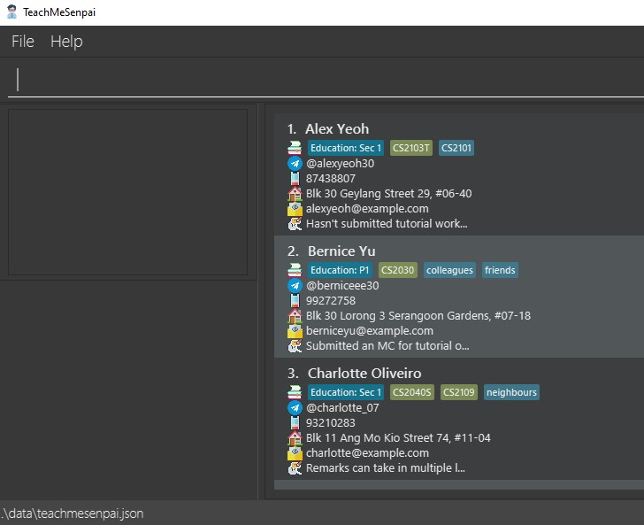

1. Ensure you have `Java 11` or above installed in your computer (you may refer to [Java Help Resources](https://www.java.com/en/download/help/version_manual.html) if you're not sure how to do so).
2. Download the latest `teachmesenpai.jar` from [here](https://github.com/AY2223S2-CS2103T-W12-2/tp/releases/latest).
3. Copy or move the file to the folder you want to use as the home folder for your application.
4. Double-click the file to start the app.

[↑ Back to top](#table-of-contents)

---

## Guide on TeachMeSenpai's GUI

TeachMeSenpai has several important components as part of its display. Here is a quick walk-through each component.

  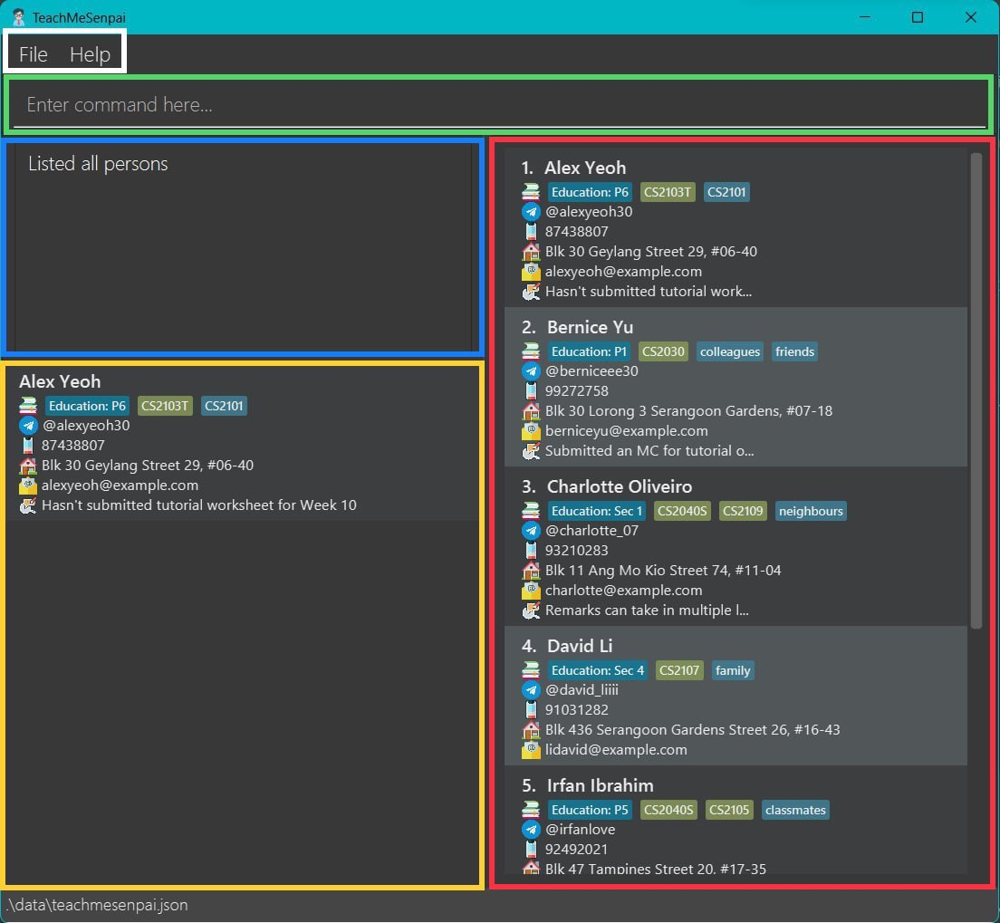

<h3 style="color:Gray"><b>Menu bar</b></h3>
* Clicking `FILE` will give you the option to exit the app
* Clicking `HELP` will show `HELP F1`, clicking it will provide you a link to this User Guide!

<h3 style="color:MediumSeaGreen"><b>Command line</b></h3>
* This is where you will be typing all the commands for TeachMeSenpai! To learn more about the commands TeachMeSenpai has, head over
to [Features](#features).

<h3 style="color:DodgerBlue"><b>Feedback Box</b></h3>
* This is where TeachMeSenpai will provide you with feedback for your commands! Whether they were successfully done or not.
You will see more examples of the feedback TeachMeSenpai provides in the [Features](#features) section.

<h3 style="color:gold"><b>Result Box</b></h3>
* This is where the results for commands like [`show`](#showing-a-students-remark-show) and [`edit`](#editing-a-student-edit) will show up!
* This section is scrollable when necessary.

<h3 style="color:red"><b>Student List</b></h3>
* This is where you can view all your student entries and their details!
* This section is scrollable as well.

### Adjusting the size of TeachMeSenpai

  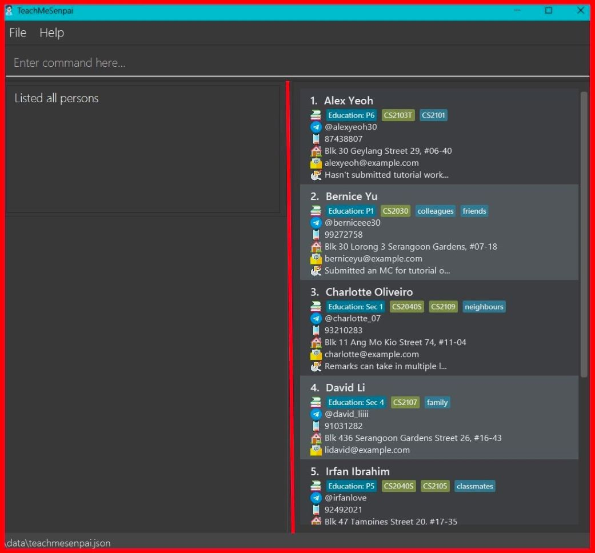

**:bulb: Note:** If the app is too small for your liking, you may resize it by dragging the sides of the window with your cursor! The red lines in the image above are moveable
so feel free to adjust the app however you like!

[↑ Back to top](#table-of-contents)

---

## Guide on using Features

:bulb: **Notes about the command format:**

- Words in `UPPER_CASE` are the parameters to be supplied by the user. \\
  _(eg. in `add n/NAME`, `NAME` is a parameter which can be used as `add n/John Doe`)_

- Items in square brackets are optional. \\
  _(eg. `n/NAME [t/TAG]` can be used as `n/John Doe t/friend` or as `n/John Doe`)_

- Items with `...` after them can be used multiple times including zero times. \\
  _(eg. `[t/TAG]...` can be excluded completely, or once `t/friend`, or twice `t/friend t/family`, etc.)_

- Parameters can be in any order. \\
  _(eg. if the command specifies `n/NAME p/PHONE_NUMBER`, `p/PHONE_NUMBER n/NAME` is also acceptable)_

- If a parameter is expected only once in the command but you specified it multiple times, only the last occurrence of the parameter will be taken. \\
  _(eg. if you specify `p/12341234 p/56785678`, only `p/56785678` will be taken)_

- Extraneous words for commands that do not take in parameters (such as `help`, `list`, `redo`, `undo`, `show`, `exit` and `clear`) will be ignored. \\
  _(eg. if the command specifies `help 123`, it will be interpreted as `help`)_

## Parameter descriptions

Firstly, parameters are the inputs/information you have to fill in together with their respective commands in the command line when using TeachMeSenpai!

Here is an exhaustive table for you to refer to if you're unsure of what to input when using the various [features](#features) below this section!

| Parameter         | Meaning                                                                              | Notes                                                                                                                                                                                                                                |
|-------------------|--------------------------------------------------------------------------------------|--------------------------------------------------------------------------------------------------------------------------------------------------------------------------------------------------------------------------------------|
| `ADDRESS`         | Address of the student                                                               | Can contain numbers, symbols and multiple letters/words                                                                                                                                                                              |
| `EDUCATION_LEVEL` | Education level of the student                                                       | Can contain numbers and multiple letters/words                                                                                                                                                                                       |
| `EMAIL`           | Email address of the student                                                         | 1. Follow the format local-part@domain   2. Must contains `@` symbol   3. Must not start with a non-alphanumeric character (eg. . , ' " @)   4. Can contain letters and numbers   5. Should not contain any spacings |
| `INDEX`           | The number next to the student entry upon using [`list`](#listing-all-students-list) | Must be a positive number (eg. 1, 2, 3...)                                                                                                                                                                                           |
| `KEYWORD`         | The word you would like to [`find`](#findfilter-students-find) by                    | Can only contain letters and/or numbers                                                                                                                                                                                              |
| `MODULE`          | The module you're teaching the student                                               | 1. Can only contains alphanumeric characters and/or spaces   2. Any whitespaces in front of the module given will be removed by the app                                                                                          |
| `PHONE_NUMBER`    | Phone number of the student                                                          | 1. Must only contain numbers    2. Must be at least 3 numbers long                                                                                                                                                               |
| `REMARK`          | Your notes or remarks on the student                                                 | Can contain any combination of words, numbers and special characters                                                                                                                                                                 |
| `STUDENT_NAME`    | Name of the student                                                                  | 1. Can only contain alphanumeric characters and/or spaces   2. Any whitespaces in front of the name given will be removed by the app                                                                                             |
| `TAG`             | Qualities of the student you'd like to be shown as a [tag](#adding-a-student-add)    | Must be a single word containing alphanumeric characters only                                                                                                                                                                        |
| `TELEGRAM`        | Telegram handle of the student                                                       | 1. Must begin with "@"  2. Can only contain uppercase and lowercase alphabets, digits (0-9), and underscores  3. Minimum length is 5 characters                                                                              |

:bulb: **Note:** The description for a valid Telegram handle has been shortened for brevity and thus might not cover all cases.
* For example, one might think that "@hello__world" is allowed but it isn't due to having consecutive underscores.
* TeachMeSenpai does validate handles according to Telegram specifications, but do check on the Telegram application for whether a handle is valid!

[↑ Back to top](#table-of-contents)

---

## Features

### Autocompletion

TeachMeSenpai has a lot of features for you to experiment with, however we understand that it might take some getting used to. Hence, we've
included an autocompletion feature!
Start typing the first letters of a command to get shadow-like autocomplete suggestions. 
The format of the suggested parameters are as described in the [**Guide on using Features**](#guide-on-using-features).

**:information_source: Tip:** You can press the `TAB` to fill in the next suggested word!

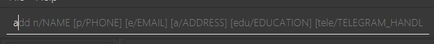

 

For the `module`, `tag`, `education` fields, it will also suggest all the existing values to you.

:bulb: **Note:** The `|` seen above are not part of the commands TeachMeSenpai accepts! They simply indicate the existing
modules/education/tags in the current list.

### Viewing help: `help`

Shows a URL to the `User Guide` page.

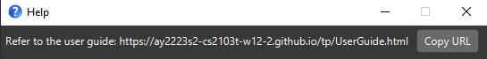

[↑ Back to top](#table-of-contents)

---

### Exiting the program: `exit`

Exits the program.

> Format: `exit`

:bulb: **Note:** This is the same as closing the app via the top-right `x` button.

[↑ Back to top](#table-of-contents)

---

### Listing all students: `list`

Shows a list of all students. This is useful for displaying the full list after using commands that modifies the list _(eg. [`find`](#findfilter-students-findfilter))_.

> Format: `list`

[↑ Back to top](#table-of-contents)

---

### Adding a student: `add`

Adds a student to the list, along with their education level and any student-specific notes.

> Format: `add n/STUDENT_NAME [a/ADDRESS] [p/PHONE_NUM] [e/EMAIL] [edu/EDUCATION_LEVEL] [tele/TELEGRAM] [r/REMARK] [t/TAG]... [m/MODULE]...`

:bulb: **Note:** `EDUCATION_LEVEL`, `TAG`,  and  `MODULE` will be displayed as blue tags.
* Only the name ie. `n/` is compulsory. You can add details for other fields using commands that we will explore later!

Examples:

- `add n/Shaun a/123 NUS Street r/Good in Japanese t/submitted`
- `add n/Shao Hong edu/Bachelors y2 r/Good in German m/CS2101`
- `add n/Wen Li e/e07123456@u.nus.edu p/91234567 a/Kent Ridge PGPR tele/wenlisan r/Very hardworking :)`

    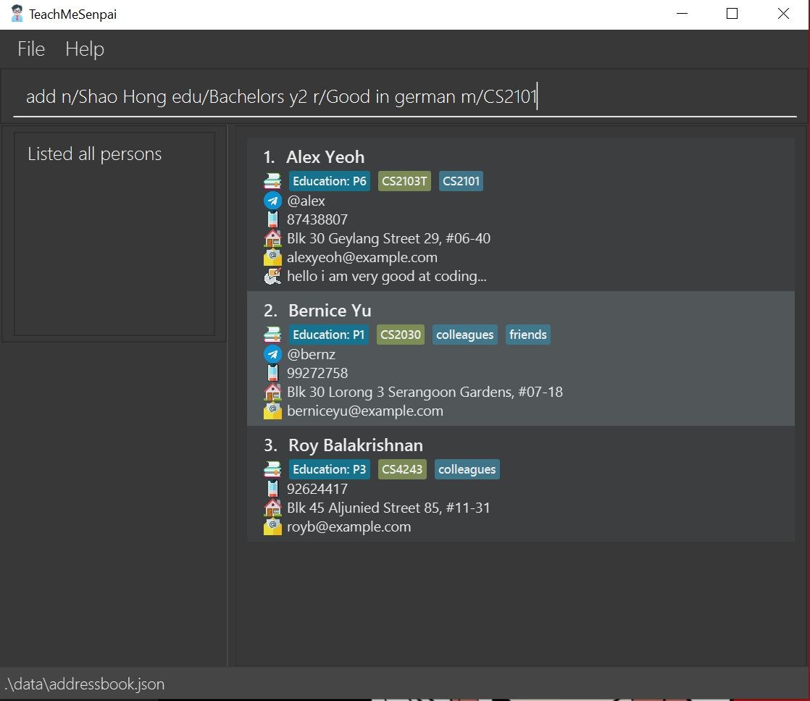
     <i><b>Above:</b> Before entering <code>add</code> command</i>

    
     <i><b>Above:</b> After entering <code>add</code> command</i>

[↑ Back to top](#table-of-contents)

---

### Editing a student: `edit`

Edits a student's info _(all info except remark)_. To remove a student's field, leave the value after the prefix blank _(eg. `a/ p/` to remove address & phone number)_.

> Format: `edit INDEX [n/STUDENT_NAME] [a/ADDRESS] [p/PHONE_NUM] [e/EMAIL] [edu/EDUCATION_LEVEL] [tele/TELEGRAM] [t/TAG]... [m/MODULE]...`

:bulb: **Note:** `edit` command cannot edit the remark field of students. Use the [`remark`](#editing-remark-of-student-remark) command for editing remarks.

Examples:

- `edit 2 n/Shaun Tan r/Not good in Japanese`
- `edit 1 n/Lao Hong`
- `edit 3 a/ p/` _(removes student's address & phone number)_

    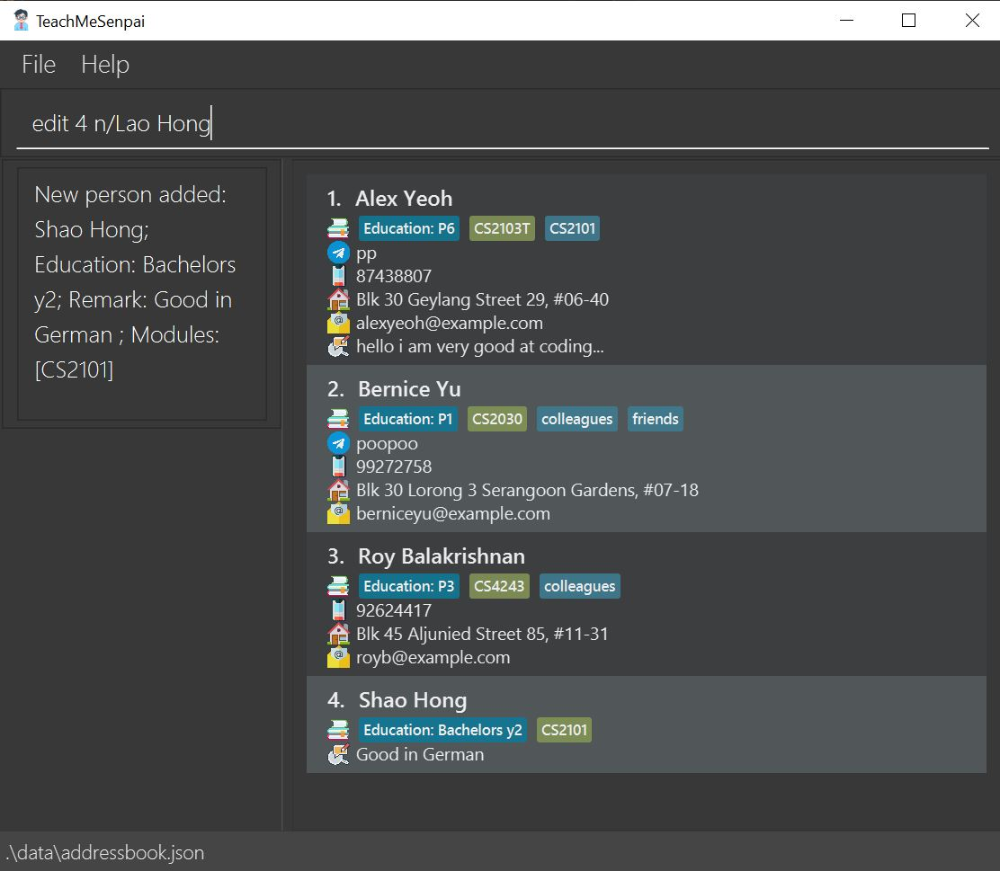
     <i><b>Above:</b> Before entering <code>edit</code> command</i>

    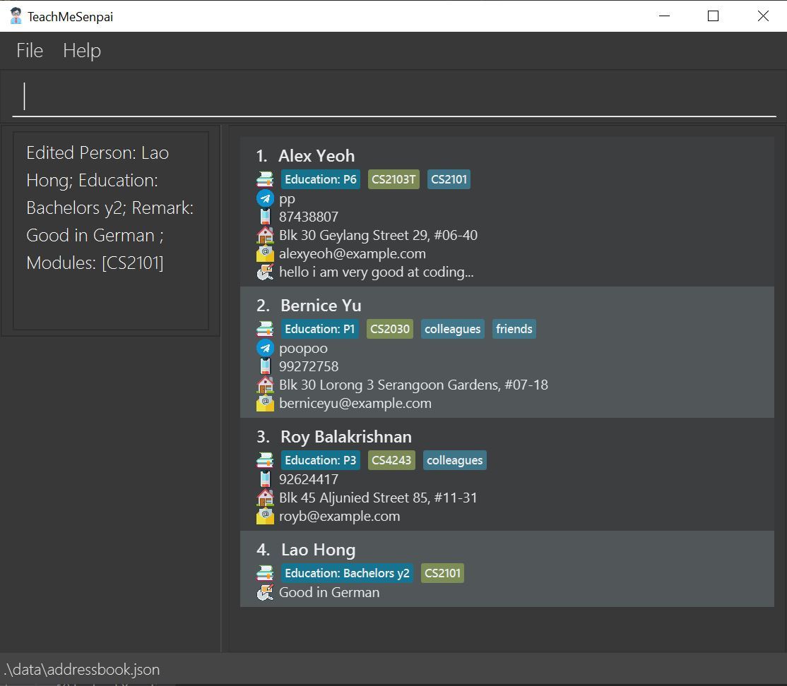
     <i><b>Above:</b> After entering <code>edit</code> command</i>

[↑ Back to top](#table-of-contents)

---

### Editing remark of student: `remark`

Edits a student's remarks.

> Format: `remark INDEX`

With `remark` you can type your desired remarks and notes into the popup text box! The text box can take in 
multiple sentences, paragraphs etc. When you are done, you can simply press `Ctrl` + `S`
and your remarks will be saved once the text box closes.

:bulb: **Note:** Do not edit or type commands into the command line of TeachMeSenpai while the remark text box is open!
The current version of TeachMeSenpai requires you to close the remark text box before you continue with other commands :)

Examples:

- `remark 2'

    
     <i><b>Above:</b> Before entering <code>remark</code> command</i>

    
     <i><b>Above:</b> After pressing Ctrl + S <code>remark</code> command</i>

    
     <i><b>Above:</b> After entering <code>remark</code> command</i>

:bulb: **Note:** Notice that remarks on the student list panel (right panel) are truncated to make your student list more succinct :)
To view the remarks in detail, you may use the [`show`](#showing-a-students-remark-show) feature!

[↑ Back to top](#table-of-contents)

---

### Showing a student's remark: `show`

Displays all the details, including the full remark of a specified student. This is useful for when the remark is too long to be displayed fully in the student list panel.

> Format: `show INDEX`

Examples:

- `show 2`

    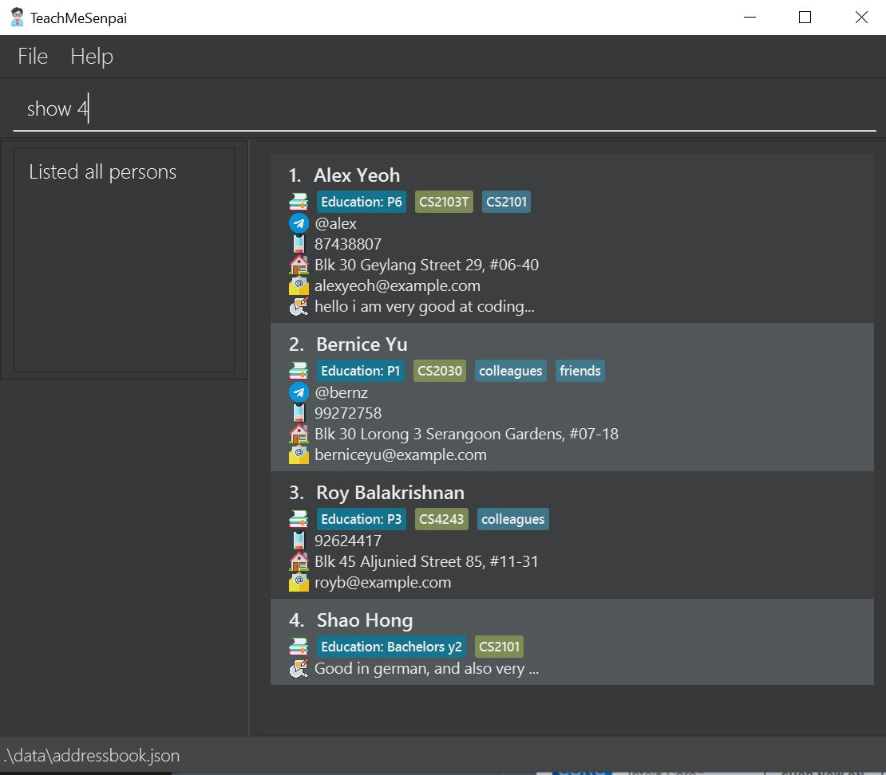
     <i><b>Above:</b> Before entering <code>show</code> command</i>

    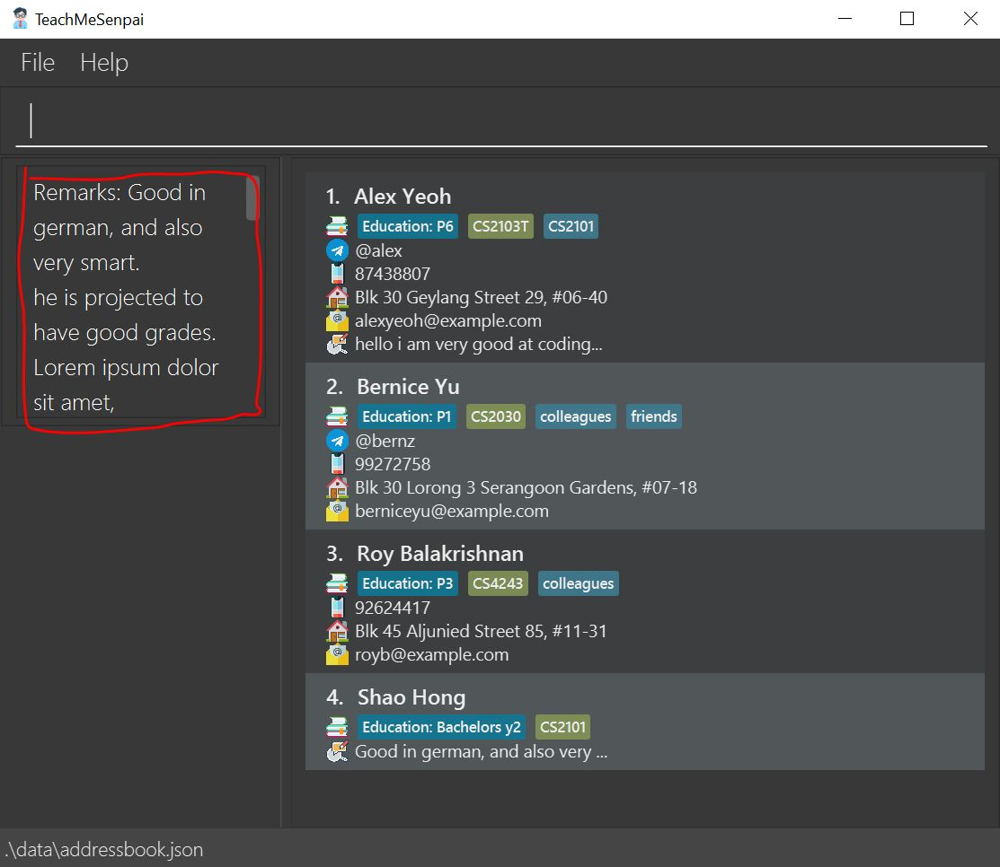
     <i><b>Above:</b> After entering <code>show</code> command</i>

[↑ Back to top](#table-of-contents)

---

### Find/filter students: `find`/`filter`

Finds students based on a keyword in the field that you want.

The `find` and `filter` commands allow you to match keywords or partial keywords with the entries, for example:

`find n/Sh` displays the students with names which contain `Sh` (case-insensitive) in them, such as `Shaun` or `Amresh`. This applies to all fields EXCEPT tags and modules, where you will have to enter the keywords in full.

The `find` command allows you to zoom in on an entry that matches **all** your `FIELD` and `KEYWORDS`, but `filter` will also show you those who match with **at least one** of the criteria.

> Format: \\
> `find FIELD... KEYWORDS...` \\
> `filter FIELD... KEYWORDS...`

* `FIELD` refers to the type of details such as name, address, email and so on.
* Input the field like so:
  * Name: `n/`
  * Address: `a/`
  * Email: `e/`
  * Phone No.: `p/`
  * Education: `edu/`
  * Telegram Handle: `tele/`
  * Remark: `r/`
  * Tags: `t/`
  * Modules: `m/`

**:information_source: Tip:** Using `find` without any `FIELDS` has the same outcome as `list`! TeachMeSenpai will simply display the list of all your students.

Examples:

- `find n/Sh` will display the students named "Shao Hong" & "Shaun"
- `find a/ pas` will display students who stay at places which names that contain `pas` such as `Pasir Ris`
- `find t/ URGENT` will display students who have the exact tag `URGENT`
- `find m/ CS2101` will display students who have the exact module `CS2101`

**Using the following input fields `find n/a m/CS2103T`:**

    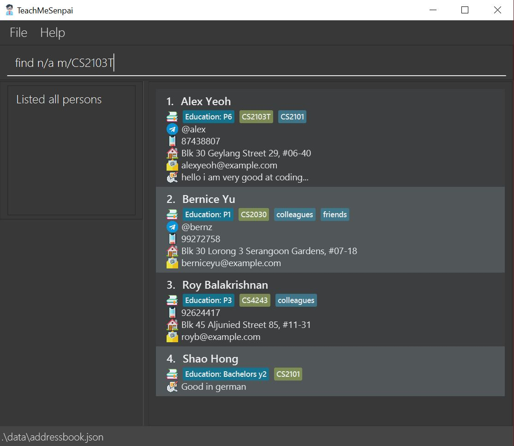
     <i><b>Above:</b> Before entering <code>find</code> command</i>

    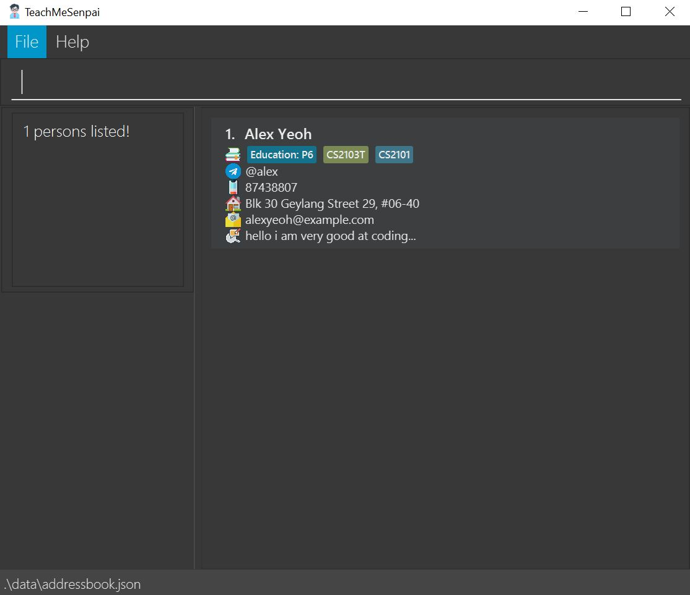
     <i><b>Above:</b> After entering <code>find</code> command</i>

:bulb: **Note:** Here find shows only `Alex Yeoh` as his entry matches all criteria.

    
     <i><b>Above:</b> Before entering <code>filter</code> command</i>

    
     <i><b>Above:</b> After entering <code>filter</code> command</i>

:bulb: **Note:** Here, other entries that match some criteria like `Roy Balakrishnan`
are shown too.

[↑ Back to top](#table-of-contents)

---

### Delete a student: `delete`

Deletes the specified student from the address book.

> Format: `delete INDEX [INDEX]...`

- Deletes the student at the specified `INDEX`.
- More than 1 `INDEX` can be specified, then all of them will be deleted.
- The index refers to the index number shown in the displayed student list.
- The index **must be a positive integer** 1, 2, 3, ...

Examples:

- `list` followed by `delete 2` deletes the 2nd student in the address book.

    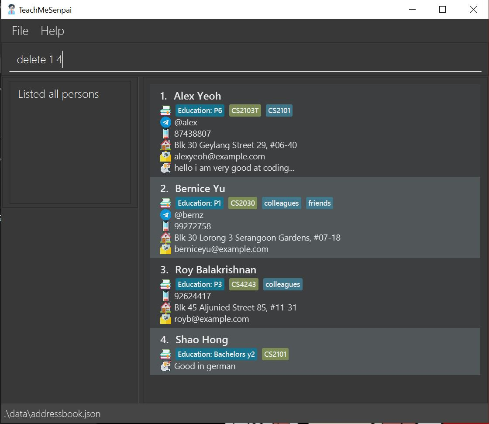
     <i><b>Above:</b> Before entering <code>delete</code> command</i>

    
     <i><b>Above:</b> After entering <code>delete</code> command</i>

:information_source: **Tip:** You can combine `find` and `delete` when you have a very long list of students.
 For instance, you can `find` the student(s) you want gone, and then `delete` using the index from the list displayed!

---

### Undo a previous command: `undo`

Did you make a mistake with a command? Don't worry, simply `undo` it!

You can `undo` as many times as required, as long as the previous commmand is **undoable**.

> Format: `undo`

Example: `delete 1 4` followed by `undo`.

### Redo a previous `undo`: `redo`

Did you `undo` a command on accident? Fret not, you may use `redo` to reverse the changes done by `undo`!

:bulb: **Note:** You can only redo an `undo` command. Trying to `redo` without ANY prior `undo` command will simply cause TeachMeSenpai to give you an error message.

>Format: `redo`

Example: `delete 1 4`, followed by `undo`, then `redo`.

[↑ Back to top](#table-of-contents)

---

### Clearing all entries: `clear`

Need to clear all your entries? Simply use `clear` to help you delete all your entries at once!

>Format: `clear`

:bulb: **Note:** Don't worry if you cleared all your entries by accident, simply use `undo` to reverse the change! Do note that if you exit the app immediately after `clear`, using `undo` upon relaunching the app can't retrieve your data anymore :(

### Saving the data

TeachMeSenpai data are saved in the hard disk automatically after any command that changes the data. There is no need to save manually 🙂

[↑ Back to top](#table-of-contents)

---

### Editing the data file

**:exclamation: Warning:** If your changes to the data file makes its format invalid, TeachMeSenpai will discard all data and start with an empty data file the next time you launch it.

[↑ Back to top](#table-of-contents)

---

## Glossary

| Term             | Details                                                                               | Examples                                                                                                                                                                                                                                                  |
|------------------|---------------------------------------------------------------------------------------|-----------------------------------------------------------------------------------------------------------------------------------------------------------------------------------------------------------------------------------------------------------|
| Command          | Instructions for TeachMeSenpai to execute/carry out                                   | [Features](#features) like [`add`](#adding-a-student-add), are all commands TeachMeSenpai can execute                                                                                                                                                     |
| Index            | The number displayed next to the student entry's name after `list` is used            | 1. Alex Yeoh, 1 would be the index for Alex Yeoh                                                                                                                                                                                                          |
| Operating System | Also known as (OS) of the computer, managers the software and hardware on the computer | 
 - 
                                                                                                                                                                                                                               |
| Parameter        | Parameters are information TeachMeSenpai requires you to fill in                  | `STUDENT_NAME`, `PHONE_NUMBER` are parameters you have to fill in. Relevant information to fill in could be Shaun and 999 respectively.   You may refer to the [Parameter descriptions](#parameter-descriptions) for more specifications and examples | 
| Prefix           | Indicators for commands. Always ends with a slash `/` and comes before a paramter     | `n/` is the prefix for parameter `STUDENT_NAME` which could be a name like Shaun.                                                                                                                                                                         |
| Remark           | Notes or things to take note of for a student                                         | "Not good in Japanese", "Has not submitted MC" etc.                                                                                                                                                                                                       |

# Command summary

| Action | Format, Examples                                                                                                                                                                                                                                                      |
|--------|-----------------------------------------------------------------------------------------------------------------------------------------------------------------------------------------------------------------------------------------------------------------------|
| Add    | `add n/STUDENT_NAME [a/ADDRESS] [p/PHONE_NUM] [e/EMAIL] [edu/EDUCATION_LEVEL] [tele/TELEGRAM] [r/REMARK] [t/TAG]... [m/MODULE]...` eg. `add n/Shaun a/123 NUS Street e/shaun123@gmail.com edu/Year 1 r/Good in Japanese t/active t/hardworking m/CS2103T m/CS2101` |
| Clear  | `clear`                                                                                                                                                                                                                                                                |
| Delete | `delete INDEX [INDEX]...` eg. `delete 3` or `delete 1 2 3 4`                                                                                                                                                                                                       |
| Edit   | `edit INDEX [n/STUDENT_NAME] [a/ADDRESS] [p/PHONE_NUM] [e/EMAIL] [edu/EDUCATION_LEVEL] [tele/TELEGRAM] [t/TAG]... [m/MODULE]...`  eg. `edit 1 n/Wen Li edu/Year 2`                                                                                                |
| Exit   | `exit`                                                                                                                                                                                                                                                                |
| Find   | `find PREFIX/KEYWORD1 [PREFIX/KEYWORD2]`  eg. `find n/Sh`                                                                                                                                                                                                     |                                                                                                                                                                                           |
| List   | `list`                                                                                                                                                                                                                                                                |
| Redo   | `redo`                                                                                                                                                                                                                                                                |
| Remark | `remark INDEX [r/REMARK]`  eg. `remark 2 r/Not good in Japanese`                                                                                                                                                                                                  |
| Undo   | `undo`                                                                                                                                                                                                                                                                |
| Show   | `show INDEX`  eg. `show 1`                                                                                                                                                                                                                                        |

[↑ Back to top](#table-of-contents)

---

# Prefix summary

| Prefix | Meaning                                 | Example                               |
|--------|-----------------------------------------|---------------------------------------|
| n/     | Name of student                         | `n/Shao Hong`                         |
| p/     | Phone number of student                 | `p/81234567`                          |
| e/     | Email of student                        | `e/e07123456@u.edu.sg`                |
| a/     | Address of student                      | `a/16 Bukit Timah Road, S156213`      |
| edu/   | Education level of student              | `edu/P6`                              |
| r/     | Remark for student                      | `r/Good in German`                    |
| t/     | Tag of student                          | `t/active` or `t/hardworking ...`     |
| m/     | Module that the student is being taught | `m/CS2101` or `m/CS2101 m/CS4243 ...` |
| tele/  | Telegram handle of the student          | `tele/@chuuchuu` or `tele/@sO_m4nY`   |

[↑ Back to top](#table-of-contents)
