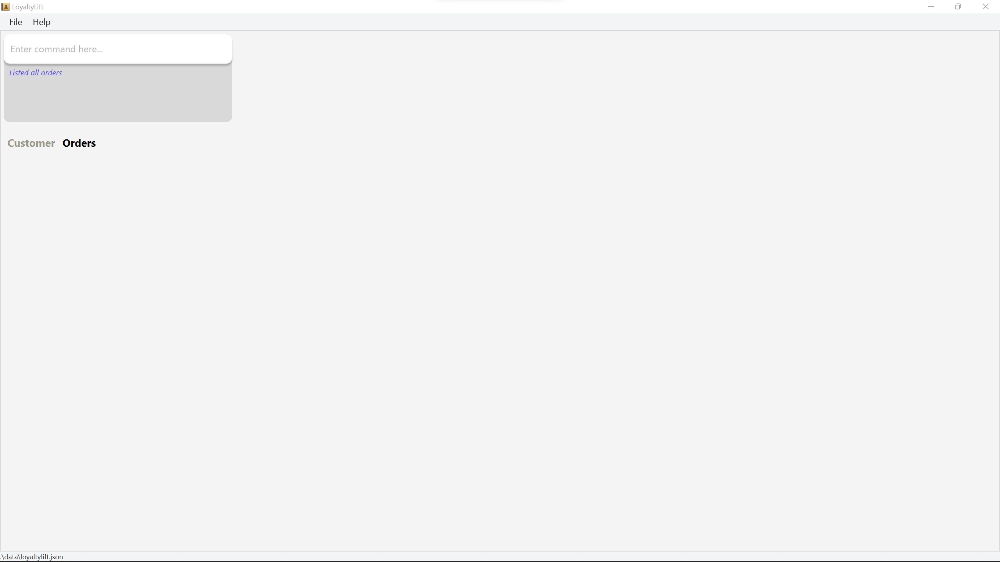
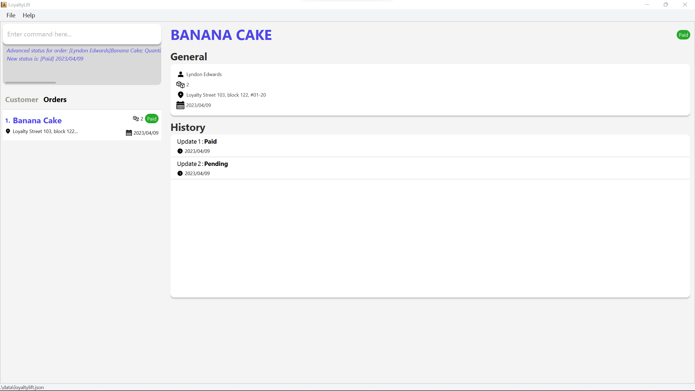
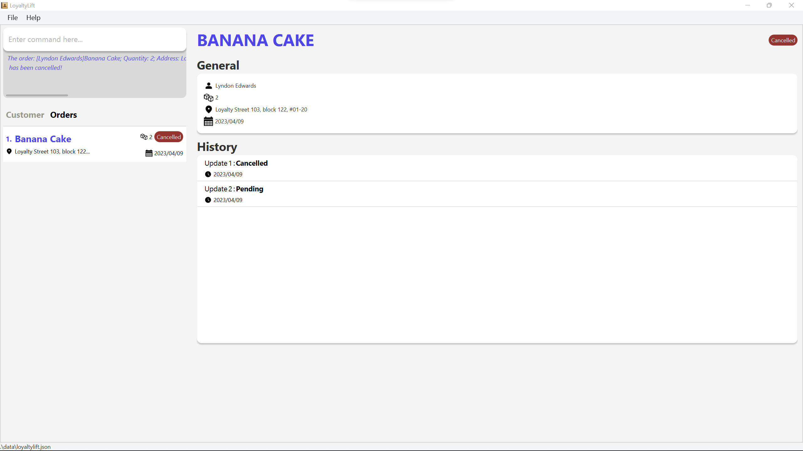
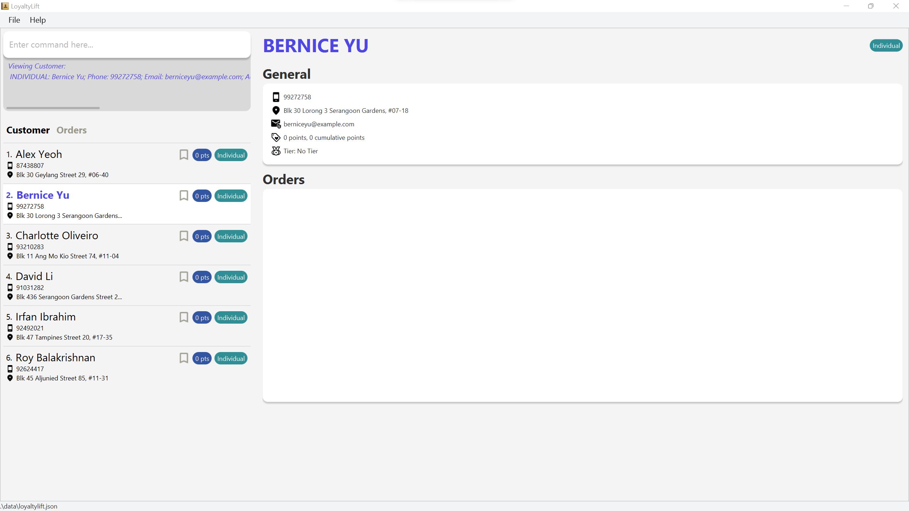

<b style="font-size: 20px">_LoyaltyLift_</b> is a desktop application designed for small business owners to manage their customers and orders efficiently, allowing you to **improve customer relations** and **increase customer loyalty**.
It is optimized for use via a **Command Line Interface** (CLI) while still having the benefits of a Graphical User Interface (GUI).

With LoyaltyLift, you can easily keep track of your customers' preferences, purchase history, and contact information, enabling you to provide personalized service that will keep them coming back. 
Our application makes it easy to manage orders and provide rewards, helping you grow your business while delivering an exceptional customer experience. 

This user guide provides in-depth documentation on LoyaltyLift installation process, command features and common questions that you might have. 
In addition, the quick start guide provides an end-to-end setup process to get you started.

Are you excited yet? Let's get started!

----------------------------------------------------------------------------------------------------------------------

## Table of contents
{: .no_toc}

* Table of Contents
{:toc}

--------------------------------------------------------------------------------------------------------------------

## Quick start

1. Ensure you have Java `11` or above installed in your Computer.

1. Download the latest `loyaltylift.jar` from [here](https://github.com/AY2223S2-CS2103T-T09-3/tp/releases).

1. Copy the file to the folder you want to use as the _home folder_ for LoyaltyLift.

1. Open a command terminal, `cd` into the folder you put the jar file in, and use the `java -jar loyaltylift.jar` command to run the application. 
   A GUI similar to the below should appear in a few seconds. Note how the app contains some sample data. 
   

1. Type the command in the command box and press Enter to execute it. e.g. typing **`help`** and pressing Enter will open the help window. 
   Some example commands you can try:

   * `listc` : Lists all customers.

   * `addc n/John Doe p/98765432 e/johnd@example.com a/John street, block 123, #01-01` : Adds a customer named `John Doe` to the Address Book.

   * `deletec 3` : Deletes the 3rd customer shown in the current list.

   * `clear` : Deletes all customers and orders.

   * `exit` : Exits the app.

1. Refer to the [Features](#features) below for details of each command.

--------------------------------------------------------------------------------------------------------------------

## Basics

This section is designed to help new users get started with using LoyaltyLift.
In this section, you will learn how to perform essential tasks such as adding customers, creating orders, and setting up rewards. 
By the end of these tutorials, you will have a solid understanding of the fundamental features of LoyaltyLift and how to use them effectively to improve your business operations.

So, let's dive in and get started!

### Navigating around LoyaltyLift

Before starting your journey with LoyaltyLift, let's take a quick look at the layout of LoyaltyLift.

It comprises 3 panels, the Information Panel, Command Panel and Table Panel. 
The table panel displays either the **customers** or **orders**. 
This can be configured by selecting the corresponding tab in the Table Tabs area.

The components are summarised below.

|         Component | Purpose                                                           |
|------------------:|:------------------------------------------------------------------|
|     Command Panel | Input area to submit your command to LoyaltyLift                  |
| Information Panel | Displays details of a specific customer or order                  |
|       Table Panel | Displays list of customers or orders                              |
|        Table Tabs | Switch between displaying customers and orders in the Table Panel |

#### Using the CLI
{: .no_toc}

The Command Panel is where you type your commands and submit them.
LoyaltyLift then processes your request and performs them if it is successful.

If LoyaltyLift understands your request, it will perform it and display feedback that it has succeeded, as seen below.

Otherwise, the input font will turn red instead as seen below. 
The feedback will assist you in correcting the command as much as possible. 

Now that you are familiar with the layout of LoyaltyLift, you are ready to jump right into using the application! 

### Add your first customer and order

In this tutorial, you will learn how to add your first customer _Lyndon Edwards_ and his order of 2 of his favourite _Banana Cake_.
Finally, you will learn to remove a customer and observe that **all orders belonging to a customer will be removed as well**.

:bulb: **Tip:**
If you have not done so, use the `clear` command to remove the sample data!

#### Your first customer, Lyndon Edwards
{: .no_toc}

Adding your first customer is effortless on LoyaltyLift using [`addc`](#adding-a-customer--addc). 
Enter the following command to insert a new customer _Lyndon Edwards_ along with some basic contact information.

    addc n/Lyndon Edwards p/93015612 e/lyndon@example.com a/Loyalty Street 103, block 122, #01-20

The application should already have your customer displayed by this step.
Nonetheless, you can always type the following commands to list all customers and view the first customer in our address book, which corresponds to _Lyndon Edwards_.

    listc
    viewc 1

#### Your first order, 2 of Banana Cakes
{: .no_toc}

Now that _Lyndon Edwards_ is in our address book, we can add an order for him.
This can be with the [`addo`](#adding-an-order--addo) command like the following.

    addo 1 n/Banana Cake q/2 

Likewise, the application should already have the order opened for your convenience. 
To do this manually, you can list all your orders and view the first order's information by performing the following commands.  

    listo
    viewo 1

#### Clear application data again
{: .no_toc}

Before ending this tutorial, let us clear our application data by removing both _Lyndon Edwards_ and his _Banana Cake_ order.

While [`clear`](#clearing-all-entries--clear) command achieves this easily, we can also simply remove _Lyndon Edwards_ from our address book with the [`deletec`](#deleting-a-customer--deletec) command.

    deletec 1

:exclamation: **Caution:**
Note that in addition to removing `Lyndon Edwards` from the application, all of his orders are also removed!

Hence, you will notice that the order list is now empty, and our application is back to a clean slate.

    listo

### Following your order to completion

By following this tutorial, you'll learn how to update your order's status in LoyaltyLift, which will help you to better understand and manage the process of orders in your own business.

#### The order's status
{: .no_toc}

In LoyaltyLift, an order can have the following status.
* Pending
* Paid
* Shipped
* Completed
* Cancelled

LoyaltyLift assumes that your order will follow a process similar to the order of status stated above (excluding 'cancelled').

Before we start, head over to [_Add your first customer and order_](#add-your-first-customer-and-order) to include _Lyndon Edwards_ and the _Banana Cake_ order.
However, do not clear the application data as we will be using the order for this tutorial.

#### Advancing an order's status
{: .no_toc}

Let's take a look at our current list of orders, which should only consist of the order of _Banana Cake_.

    listo

Notice that the order's status is now 'Pending'.
To advance an order's status, the [`advo`]() command will come in handy, which takes the order index as its only parameter.

    advo 1

Now, the status of the order should be 'Paid'. Doing this multiple times will eventually update the order's status to 'Completed'.
Further attempts to advance the order status will return an error!

#### Reverting an order's status
{: .no_toc}

To revert an order's status, the [`revo`]() command is similar to `advo` but has the inverse effect. 

    revo 1

Now, the status of the order should be 'Pending'. 
As expected, trying to revert the status when it is already 'Pending', will be met with an error!

#### Cancelling an order
{: .no_toc}

An order can be cancelled at any stage of the order. This can be performed with the [`cancelo`]() command.

    cancelo 1

Looking at the order status, it is now reflected as 'Cancelled'.

:exclamation: **Caution:**
Once an order is cancelled, the action is irreversible, and the order can no longer revert nor advance!  

### Rewarding your customers

This tutorial will teach you the rewards system in LoyaltyLift and how you can apply it to boost your business' customer loyalty.

    SECTION TODO

### Extra remarks

While these tutorials covers a simplified situation of adding a customer and order,
you may find yourself in need of more complex control/tasks, and LoyaltyLift is ready for it!

Here are some recommended features to explore after this tutorial.

* Editing a customer or order's information with [`editc`](#editing-a-customer--editc) or [`edito`](#editing-an-order--edito)
* Assigning a customer as an individual or enterprise with [`addc`](#adding-a-customer--addc) or [`editc`](#editing-a-customer--editc)
* Set or adding rewards points for the customer with [`setpoints`](#setting-reward-points-for-a-customer--setpoints) or [`addpoints`](#adding-points-for-a-customer--removing-points-from-a-customer--addpoints)

--------------------------------------------------------------------------------------------------------------------

## Features

**:information_source: Notes about the command format:** 

* Words in `UPPER_CASE` are the parameters to be supplied by the user. 
  e.g. in `add n/NAME`, `NAME` is a parameter which can be used as `add n/John Doe`.

* Items in square brackets are optional. 
  e.g `n/NAME [t/TAG]` can be used as `n/John Doe t/friend` or as `n/John Doe`.

* Items in curly brackets are an indication to use one of the given options, separated by the character `|`.
* e.g. `ct/{ind|ent}` is a parameter that should be used as `ct/ind` or `ct/ent` exactly.

* Items with `…`​ after them can be used multiple times including zero times. 
  e.g. `[t/TAG]…​` can be used as ` ` (i.e. 0 times), `t/friend`, `t/friend t/family` etc.

* Parameters can be in any order. 
  e.g. if the command specifies `n/NAME p/PHONE_NUMBER`, `p/PHONE_NUMBER n/NAME` is also acceptable.

* If a parameter is expected only once in the command but you specified it multiple times, only the last occurrence of the parameter will be taken. 
  e.g. if you specify `p/12341234 p/56785678`, only `p/56785678` will be taken.

* Extraneous parameters for commands that do not take in parameters (such as `help`, `listc`, `exit` and `clear`) will be ignored. 
  e.g. if the command specifies `help 123`, it will be interpreted as `help`.

### Customer

#### Adding a customer : `addc`

Adds a customer to the current list.

Format: `addc [ct/{ind/ent}] n/NAME p/PHONE_NUMBER e/EMAIL a/ADDRESS`

:bulb: **Tip:**
Customers are 'individiuals' by default!  
ind - Individuals  
ent - Enterprise

Examples:
* `addc ct/ind n/John Doe p/98765432 e/johnd@example.com a/John street, block 123, #01-01`
* `addc ct/ent n/The Potato Farm e/thepotatofarm@example.com a/South street, block 983, #02-01 p/1234567`
* `addc n/Mary Jane p/93130151 e/maryjane@example.com a/Mary Lamb Street, block 23, #01-12`

#### Listing all customers : `listc`

Shows a list of all customers.

Format: `listc [s/{name|points}] [f/{marked|ind|ent}]`

* Lists all customer with the specified sorting option.
* By default, customers are sorted by name
* If `f/marked` is provided, then shows only bookmarked customers.
* If `f/ind` or `f/ent` is provided, then shows only individual or enterprise customers respectively.

Examples:
* `listc` lists all customers sorted by name
* `listc s/points` lists all customers sorted by points
* `listc f/marked` lists all bookmarked customers. 

#### Locating customers by name : `findc`

Finds customers whose names contain any of the given keywords.

Format: `findc KEYWORD [MORE_KEYWORDS]`

* The search is case-insensitive. e.g `hans` will match `Hans`
* The order of the keywords does not matter. e.g. `Hans Bo` will match `Bo Hans`
* Only the name is searched.
* Only full words will be matched e.g. `Han` will not match `Hans`
* Customers matching at least one keyword will be returned (i.e. `OR` search).
  e.g. `Hans Bo` will return `Hans Gruber`, `Bo Yang`

Examples:
* `findc John` returns `john` and `John Doe`
* `findc alex david` returns `Alex Yeoh`, `David Li` 

  

#### View a customer : `viewc`

Display a customer's information in the information panel.

Format: `viewc INDEX`

* Displays the customer's information at the specified `INDEX`.
* The index refers to the index number shown in the displayed customer list.
* The index **must be a positive integer** 1, 2, 3, …​

:bulb: **Tip:**
You can click on the customer in the table directly for the same effect!

Examples:
* `listc` and `viewc 2` opens `Bernice Yu` on the information panel on the right
  

#### Editing a customer : `editc`

Edits an existing customer in the address book.

Format: `editc INDEX [ct/{ind|env}] [n/NAME] [p/PHONE] [e/EMAIL] [a/ADDRESS]`

* Edits the customer at the specified `INDEX`. 
* The index refers to the index number shown in the displayed customer list. 
* The index **must be a positive integer** 1, 2, 3, …​
* At least one of the optional fields must be provided.
* Existing values will be updated to the input values.

Examples:
*  `editc 1 p/91234567 e/johndoe@example.com` Edits the phone number and email address of the 1st customer to be `91234567` and `johndoe@example.com` respectively.
*  `editc 2 ct/ind n/Betsy Crower t/` Edits the name of the 2nd customer to be `Betsy Crower` and clears all existing tags.

#### Deleting a customer : `deletec`

Delete a customer from the list.

Format: `deletec INDEX`

* Deletes the customer at the specified `INDEX`.
* The index refers to the index number shown in the displayed customer list.
* The index **must be a positive integer** 1, 2, 3, …​

Examples:
* `listc` followed by `deletec 2` deletes the 2nd customer in the address book.
* `findc Betsy` followed by `deletec 1` deletes the 1st customer in the results of the `findc` command.

#### Marking a customer : `markc`

Bookmarks a customer from the list of customers.

Format: `markc INDEX`

* Bookmarks the customer at the specified `INDEX`.
* The index refers to the index number shown in the displayed customer list.
* The index **must be a positive integer** 1, 2, 3, …​

Examples:
* `listc` followed by `markc 2` bookmarks the 2nd customer in the address book.
* `findc Betsy` followed by `markc 1` bookmarks the 1st customer in the results of the `findc` command.

#### Unmarking a customer : `unmarkc`

Un-bookmarks a customer from the list of customers.

Format: `unmarkc INDEX`

* Un-bookmarks the customer at the specified `INDEX`.
* The index refers to the index number shown in the displayed customer list.
* The index **must be a positive integer** 1, 2, 3, …​

Examples:
* `listc` followed by `unmarkc 2` un-bookmarks the 2nd customer in the address book.
* `findc Betsy` followed by `unmarkc 1` bookmarks the 1st customer in the results of the `findc` command.

#### Setting a customer's note : `setnotec`

Sets a customer's note.

Format: `setnotec INDEX nt/NOTE`

* Sets the note of the customer at the specified `INDEX` to `NOTE`.
* Customers, by default, have a blank note.
* The index refers to the index number shown in the displayed customer list.
* The index **must be a positive integer** 1, 2, 3, …​
* The note refers to the customer's new note.
* Any existing note will be overwritten.
* A customer's note can be removed by setting an empty note.

Examples:
* `listc` followed by `setnotec 2 nt/Very friendly!` sets the 2nd customer's note as "Very friendly!".
* `listc` followed by `setnotec 2 nt/` removes the 2nd customer's note.
* `findc Betsy` followed by `setnotec 1 nt/Vegetarian` sets the 1st customer's note as "Vegetarian" in the results of the `findc` command.

#### Appending a customer's note : `appendnotec`

Adds more text to a customer's note.

Format: `appendnotec INDEX nt/NOTE`

* Adds `NOTE` to any existing note of the customer at the specified `INDEX`.
* The index refers to the index number shown in the displayed customer list.
* The index **must be a positive integer** 1, 2, 3, …​
* The note refers to the new text that will be added to the end of the customer's existing note.

Examples:
* `listc` followed by `appendnotec 2 nt/Very friendly!` will add "Very friendly!" to the 2nd customer's existing note.
* `findc Betsy` followed by `appendnotec 1 nt/Vegetarian` adds "Vegetarian" to the note of the 1st customer in the results of the `findc` command.

### Rewards

#### Setting reward points for a customer : `setpoints`

Sets a customer's reward points.

Format: `setpoints INDEX pt/POINTS`

* Sets the points of the customer at the specified `INDEX` to `POINTS`.
* Customers by default, have 0 points initially.
* The index refers to the index number shown in the displayed customer list.
* The index **must be a positive integer** 1, 2, 3, …​
* The points refers to the reward points of the customer
* The points **must be a positive integer** 1, 2, 3, ​​…
* The points can only range from 0 to 999999
* Setting points will also set cumulative points to the same amount, if you wish to keep the current cumulative points,
  use the `addpoints` command instead.

Examples:
* `listc` followed by `setpoints 2 pt/100` sets the 2nd customer points as 100.
* `findc Betsy` followed by `setpoints 1 pt/300` sets the 1st customer points as 300 in the results of the `findc` command.

#### Adding points for a customer / Removing points from a customer : `addpoints`

Edits a customer's reward points by adding or removing from it.

Format: `addpoints INDEX pt/[+/-]POINTS`

* Add or subtract the points of the customer at the specified `INDEX` to `POINTS`.
* If the points subtracted is greater than what the user has, the command will not be executed
* If + or - is not explictly stated, the command will default to an addition of `POINTS`.
* The index refers to the index number shown in the displayed customer list.
* The index **must be a positive integer** 1, 2, 3, …​
* The +/- refers to whether you wish to add or subtract from the reward points of the customer, + to add, - to subtract
* The points refers to how much you wish to add or subtract the reward points of the customer
* The points **must be a positive integer** 1, 2, 3, ​​…
* Addition will also result in an addition of cumulative points, subtraction will not change cumulative points.

Examples:
* `listc` followed by `addpoints 2 pt/100` adds 100 reward points to the 2nd customer.
* `findc Betsy` followed by `addpoints 1 pt/-300` deducts 300 reward points from
  the 1st customer in the results of the `findc` command.

#### Setting tiers for your reward system : `settier`

Sets a tier for your reward system with a point threshold. Customers above the point threshold are automatically in this tier, and the tiers below it.

Format: `settier TIER_NUM POINT_THRESHOLD`

* There are 3 tiers by default, tiers 1, 2 and 3 will be initially set to 999997 999998 and 999999 respectively.
* The points threshold of tiers must go in the following order, 1 < 2 < 3
* The tier_num refers to the particular tier that you want to set the point_threshold
* The tier_num **must be 1, 2 or 3**
* The point_threshold refers to how much points you want a customer to accmulate before he is in the tier, tier_num
* The points **must be a positive integer** 1, 2, 3, ​​…

Examples:
* `settier 1 500` Sets tier 1 with a point threshold of 500, any customer above 500 points will automatically be
  in tier 1.
* `settier 1 500` followed by `settier 2 450` will not be allowed as tier 1 must have a lower point threshold
  than tier 2.

### Orders

#### Adding an order : `addo`

Adds an order tagged to a customer, to the current order list.

Format: `addo INDEX n/NAME [q/QUANTITY] [a/ADDRESS]`

* Adds an order, tagged to INDEX.
* The index refers to the index number shown in the displayed customer list.
* The index **must be a positive integer** 1, 2, 3, …​
* ADDRESS is optional and will be set to the customer's address by default
* QUANTITY is optional and will be set to 1 by default. Otherwise, it must be a positive integer (e.g. 1, 2, 3...999)

Examples:
* `addo 1 n/Banana Cake 1 q/2 a/Changi Airport`
  * Adds the order, 2 x Banana cakes to the list, tags it to customer at index 1, and status is "pending", address is "Changi Airport".
* `addo 4 n/Strawberry ice cream`
  * Adds the order 1 x Strawberry ice cream, tags it to customer 4, and sets status to "pending", address is the customer's address.

#### Listing all customers : `listo`

Shows a list of all orders, with an optional filter and sort option.

Format: `listo [s/{created|name|status}] [f/STATUS]`

* Lists all orders with the specified sorting option.
* By default, orders are sorted by their created date.
* If `f/STATUS` is provided, then show only the given status.
* `STATUS` is case-insensitive and can be one of: pending, paid, shipped, completed, cancelled.

Examples:
* `listo` lists all orders sorted by created date.
* `listo s/status` lists all orders sorted by status.
* `listo f/pending` lists all orders with "pending" status.

#### Locating orders by name : `findo`

Find orders whose names contain any of the given keywords.

Format: `findo KEYWORD [MORE_KEYWORDS]`

* The search is case-insensitive. e.g `chocolate` will match `Chocolate`
* The order of the keywords does not matter. e.g. `chocolate cake` will match ` cake chocolate`.
* Only the order name is searched.
* Only full words will be matched e.g. `chocolate` will not match `chocolatey`
* Orders matching at least one keyword will be returned (i.e. `OR` search).
  e.g. `chocolate cake` will return `chocolate muffin`, `crepe cake`

Examples:
* `findo chocolate` returns `chocolate cake` and `chocolate muffin`
* `findo banana muffin` returns `banana cake`, `chocolate muffin` 

#### View an order : `viewo`

Display an order's information in the information panel.

Format: `viewo INDEX`

* Displays the order's information at the specified `INDEX`.
* The index refers to the index number shown in the displayed order list.
* The index **must be a positive integer** 1, 2, 3, …​

:bulb: **Tip:**
You can click on the order in the table directly for the same effect!

#### Editing an order : `edito`

Edits an existing order in LoyaltyLift.

Format: `edito ORDER_INDEX [n/PRODUCT_NAME] [q/QUANTITY] [a/ADDRESS]`

* Edits the order at the specified `ORDER_INDEX`. The index refers to the index number shown in the displayed order list. The index **must be a positive integer** 1, 2, 3, …​
* At least one of the optional fields must be provided.
* Existing values will be updated to the input values.

Examples:
*  `edito 1 q/100 a/Gardens by the Bay` Edits order quantity to 100, and changes the address to Gardens by the Bay.
*  `edito 2 n/Brownies q/10` Edits the name of the 2nd order in the list to be `Brownies` and the quantity to 10.

#### Advancing an order status: `advo`

Advances the order status.

Format: `advo ORDER_INDEX`

* Advances the order at the specified `ORDER_INDEX`. The index refers to the index number shown in the displayed order list. The index **must be a positive integer** 1, 2, 3, …​
* If the order is completed, the status cannot be advanced further

Examples:
*  `advo 1`: The status that it advances to, follows this sequence: "Pending", "Paid", "Shipped", "Completed".

#### Reverting an order status: `revo`

Reverts the order status to its previous status. 

Format: `revo ORDER_INDEX`

* Edits the order at the specified `ORDER_INDEX`. The index refers to the index number shown in the displayed order list. The index **must be a positive integer** 1, 2, 3, …​
* If the order is "Pending", the status cannot be reverted further.
* If the order is "Cancelled", `revo` will revert the status back to just before it was cancelled.

Examples:
*  `revo 1`: The status that it reverts to, follows this sequence: "Completed", "Shipped", "Paid", "Pending".
* `revo 2`: If 2 was "Pending", before being cancelled, revo will revert back to "Pending"

#### Cancel an order: `cancelo`

Changes the order status to "Cancelled"

Format: `cancelo ORDER_INDEX`

* Cancels the order at the specified `ORDER_INDEX`. The index refers to the index number shown in the displayed order list. The index **must be a positive integer** 1, 2, 3, …​

Examples:
*  `cancelo 1`: Changes the status of the order at index 1 to "Cancelled"

#### Deleting an order : `deleteo`

Deletes the specified order from the address book.

Format: `deleteo ORDER_INDEX`

* Deletes the order at the specified `ORDER_INDEX`.
* The index refers to the index number shown in the displayed order list.
* The index **must be a positive integer** 1, 2, 3, …​

Examples:
* `listo` followed by `deleteo 2` deletes the 2nd order on the displayed order list.
* `findo chocolate` followed by `deleteo 1` deletes the 1st order in the results of the `findo` command.

#### Setting an order's note : `setnoteo`

Sets an order's note.

Format: `setnoteo INDEX nt/NOTE`

* Sets the note of the order at the specified `INDEX` to `NOTE`.
* Orders, by default, have a blank note.F
* The index refers to the index number shown in the displayed order list.
* The index **must be a positive integer** 1, 2, 3, …​
* The note refers to the order's new note.
* Any existing note will be overwritten.
* An order's note can be removed by setting an empty note.

Examples:
* `listo` followed by `setnoteo 2 nt/Keep cool` sets the 2nd order's note as "Keep cool".
* `listc` followed by `setnoteo 2 nt/` removes the 2nd order's note.
* `findo Brownies` followed by `setnoteo 1 nt/Vegan-friendly` sets the 1st order's note as "Vegan-friendly" in the results of the `findo` command.

#### Appending an order's note : `appendnoteo`

Adds more text to an order's note.

Format: `appendnoteo INDEX nt/NOTE`

* Adds `NOTE` to any existing note of the order at the specified `INDEX`.
* The index refers to the index number shown in the displayed order list.
* The index **must be a positive integer** 1, 2, 3, …​
* The note refers to the new text that will be added to the end of the order's existing note.

Examples:
* `listo` followed by `appendnoteo 2 nt/Keep cool` will add "Keep cool" to the 2nd order's existing note.
* `findo Brownies` followed by `appendnoteo 1 nt/Vegan-friendly` adds "Vegan-friendly" to the note of the 1st order in the results of the `findo` command.

### Miscellaneous

#### Clearing all entries : `clear`

Clears all customers and orders from the address book.

Format: `clear`

#### Exiting the program : `exit`

Exits the program.

Format: `exit`

#### Viewing help : `help`

Shows a message explaning how to access the help page.

Format: `help`

### Saving the data

Customer and order data are saved in the hard disk automatically after any command that changes the data. There is no need to save manually.

### Editing the data file

All data are saved as a JSON file `[JAR file location]/data/addressbook.json`. Advanced users are welcome to update data directly by editing that data file.

:exclamation: **Caution:**
If your changes to the data file makes its format invalid, AddressBook will discard all data and start with an empty data file at the next run.

--------------------------------------------------------------------------------------------------------------------

## FAQ

**Q**: How do I transfer my data to another Computer? 
**A**: Install the app in the other computer and overwrite the empty data file it creates with the file that contains the data of your previous AddressBook home folder.

**Q**: Why are orders deleted or missing after deleting a customer with `deletec`?  
**A**: Orders are closely tied to a customer in LoyaltyLift. Once a customer has been removed, all of his/her orders needs to be cleared. 
If this is not ideal, we recommend to avoid deleting any customers.

**Q**: Can my orders have a different address than the customer's address?  
**A**: Yes! When you create an order using `addo`, you can specify the new address with the parameter `a/`. If this is not specified, the customer's address is used instead for your convenience.

--------------------------------------------------------------------------------------------------------------------

## Command summary

### Customer

|                       Action | Format, Examples                                                                                                                                                                             |
|-----------------------------:|----------------------------------------------------------------------------------------------------------------------------------------------------------------------------------------------|
|             **Add Customer** | <code>addc [ct/{ind&#124;ent}] n/NAME p/PHONE_NUMBER e/EMAIL a/ADDRESS`   e.g., `addc n/James Ho p/22224444 e/jamesho@example.com a/123, Clementi Rd, 1234665 t/friend t/colleague</code> |
|            **List Customer** | `listc`                                                                                                                                                                                   |
|            **Find Customer** | `findc KEYWORD [MORE_KEYWORDS]`   e.g., `findc Hans Bo`                                                                                                                                   |
|            **View Customer** | `viewc INDEX`   e.g. `viewc 2`                                                                                                                                                            |
|            **Edit Customer** | <code>editc INDEX [ct/{ind&#124;env}] [n/NAME] [p/PHONE] [e/EMAIL] [a/ADDRESS]`   e.g. `editc 1 p/91234567 e/johndoe@example.com</code>                                                   |
|          **Delete Customer** | `deletec INDEX`  e.g., `deletec 3`                                                                                                                                                        |
|            **Mark Customer** | `markc INDEX`   e.g., `markc 1`                                                                                                                                                           |
|          **Unmark Customer** | `unmarkc INDEX`   e.g., `unmarkc 1`                                                                                                                                                       |                                                                                                                                      |
|    **Set Note for Customer** | `setnotec INDEX nt/NOTE`   e.g., `setnotec 2 nt/Very friendly!`                                                                                                                           |
| **Append Note for Customer** | `appendnotec INDEX nt/NOTE`   e.g., `appendnotec 2 nt/Very friendly!`                                                                                                                     |

### Rewards

|              Action | Format, Examples                                                                       |
|--------------------:|----------------------------------------------------------------------------------------|
|      **Set Points** | `setpoints INDEX pt/POINTS`   e.g., `setpoints 2 pt/100`                            |
|      **Add Points** | `addpoints INDEX pt/[+/-]POINTS`   e.g., `addpoints 2 pt/100`, `addpoints 1 pt/-50` |
| **Set Reward Tier** | `settier TIER_NUM POINT_THRESHOLD`   e.g., `settier 1 500`                          |

### Order

| Action                    | Format, Examples                                                                                   |
|---------------------------|----------------------------------------------------------------------------------------------------|
| **Add Order**             | `addo CUSTOMER_INDEX n/NAME [q/QUANTITY] [a/ADDRESS]`   e.g., `addo 1 n/Banana Cake 1 q/2`      |
| **List Order**            | `listo`                                                                                         |
| **Find Order**            | `findo KEYWORD [MORE_KEYWORDS]`   e.g., `findo banana muffin`                                   |
| **View Order**            | `viewo INDEX`   e.g. `viewo 2`                                                                  |
| **Edit Order**            | `edito ORDER_INDEX [n/PRODUCT_NAME] [q/QUANTITY] [a/ADDRESS]`   e.g., `edito 2 n/Brownies q/10` |
| **Advance Order**         | `advo INDEX`  e.g., `advo 1`                                                                    |
| **Revert Order**          | `revo INDEX`  e.g., `revo 2`                                                                    |
| **Cancel Order**          | `cancelo INDEX`  e.g., `cancelo 3`                                                              |
| **Delete Order**          | `deleteo INDEX`  e.g., `deletec 3`                                                              |                                                                                                                                     |
| **Set Note for Order**    | `setnoteo INDEX nt/NOTE`   e.g., `setnoteo 2 nt/Very friendly!`                                 |
| **Append Note for Order** | `appendnoteo INDEX nt/NOTE`   e.g., `appendnoteo 2 nt/Very friendly!`                           |

### Miscellaneous

|    Action | Format, Examples |
|----------:|------------------|
| **Clear** | `clear`          |
|  **Exit** | `exit`           |
|  **Help** | `help`           |
