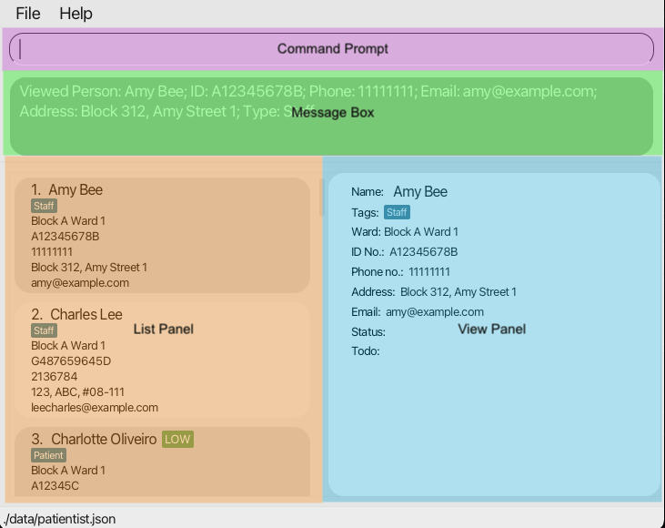
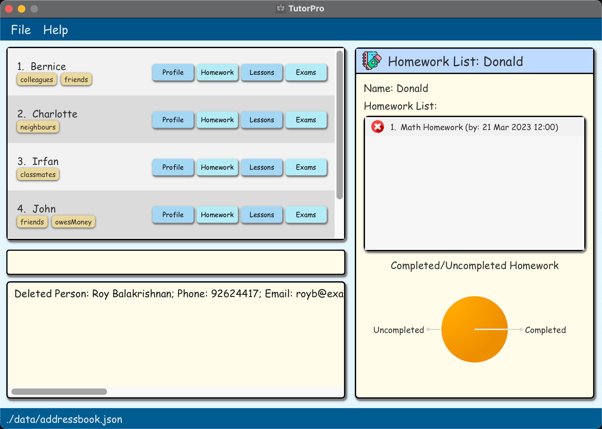

Patientist is command-line interface (CLI) based desktop app that is designed to streamline patient and staff management for 
small clinics and hospitals. Its intuitive interface is easy to navigate, and its command-based system is straightforward
and efficient. With just a few keystrokes, you can access patient records, add todos and manage your staff, making it
easy for you to get tasks done faster and more reliably than traditional GUI based apps.

<u>The GUI displayed after the app is launched.</u>

---

## Using this guide
{: .no_toc}

* If you are setting up for the first time, please have a look at our [Quick Start](#quick-start) section.
* If you are unsure how to use Patientist, the [Features](#features) section might be a good place to start.
* For ease of navigation, clicking the hyperlinks at the bottom of each section to go back to the table of contents.
* If there are any terms that are unfamiliar to you, do check out our [Glossary](#glossary) for a brief description of those terms.

### Components of Patientist
{: .no_toc}

Throughout the User Guide, we may refer to certain components of the application, so we have labelled them in the
image below for you to reference easily.

<u>Components of Patientist</u>

 

| Component           | Location(with respect to the above image) | What it does                                                                                                                      |
|---------------------|-------------------------------------------|-----------------------------------------------------------------------------------------------------------------------------------|
| Command Prompt      | Purple                                    | This is where you type the commands to be executed                                                                                |
| Message Box         | Green                                     | This is where Patienist gives you messages, usually pertaining to whether a certain command has been executed successfully or not |
| List Panel          | Orange                                    | This is where you can view information in a list; will be a list of people or wards                                               |
| View panel          | Blue                                      | This is where you can view all the detailed information in relation to a specific person                                          |
| Help button         | Top of screen                             | Allows you to access the help command without having to type the command                                                          |
| Exit button         | Top of screen                             | Similarly allows you to exit the program without having to type the command                                                       |
| Saved File Location | Bottom of screen                          | Displays the current location that the Patientist data is being saved to                                                          |

### Overview of symbols
{: .no_toc}

We will be using certain symbols throughout the User Guide, so here is a quick summary of what the symbols mean:

:information_source: Information that is good for you to know.

:bulb: Tips and tricks to upgrade your experience using Patienist.

:warning: Warnings to heed so that Patientist works as intended.

---

## Table of Contents
{: .no_toc}

* Table of Contents
{:toc}

---

## Quick start

1. Ensure you have Java 11 installed on your computer. If you are unsure you can download it from [here](https://www.oracle.com/sg/java/technologies/javase/jdk11-archive-downloads.html).
2. Download the latest release of Patientist from [here](https://github.com/AY2223S2-CS2103T-T12-1/tp/releases/latest).
3. Copy the file to the folder you'd like to use as the _home folder_ for your Patientist app.
4. Double-click the Patientist.jar file to open the app. There will be some sample data to play around with.
5. Type in commands and press ENTER to execute the command. [`help`](#help) would be a good first command to use to get a sensing of how to use this app.
6. Refer to the [Features](#features) or [Command Summary](#command-summary) sections to see summary of commands.

--------------------------------------------------------------------------------------------------------------------

# Features

:information_source: **Notes about formatting** 

* Words in UPPER_CASE are user supplied _arguments_, e.g. `addpat n/NAME`: `NAME` is an _argument_, and the command can be used as add `n/John Doe`
* Items in square brackets are optional _arguments_, e.g. `addpat n/NAME [t/TAG]` can be used as `addpat n/John Doe t/urgent` or simply as `addpat n/John Doe`
* Items with … after them can be specified 0 or more times, e.g. `[t/TAG]...` means it is valid to not include a tag, or you can include 1 or more `t/TAG` expressions
* Extra _arguments_ for commands that take in exactly 0 _arguments_ will be ignored, e.g. `help 0` will bring up the help window as with just `help`

---

## Adding/Removing Wards
Patientist allows you to reflect the physical state of your hospital.

Let's say the hospital has just added a new ward, with the name "Block B Ward 3", and you would like to add it to Patientist.

**Command entered**: [`addward n/Block B Ward 3`](#addward)

<u>Message shown after entering addward</u>

 

This means that the ward "Block B Ward 3" has been added to Patientist.

Now let's say you accidentally added the wrong ward, and it should have been "Block 3 Ward A" instead.
Well, its just as simple to remove the ward. Simply use the [`delward`](#delward) command with the name of the ward to be removed.
A similar looking message should appear indicating that the ward was successfully removed. Thereafter, the correct ward can be added to Patientist.

[Go back to [Table of Contents](#table-of-contents)]

---

### Adding a ward to the system: addward
{: #addward}

Creates an empty ward with the specified `WARD_NAME`.

:warning: **`WARD_NAME` is case-sensitive.** `block B ward 2` will refer to a different ward from `Block b Ward 2`

**Format: `addward n/WARD_NAME`**
`WARD_NAME` must be unique and cannot be the same as any existing name. This field is case-sensitive.

**Examples:**
**`addward n/block B ward 2`** will create a new empty ward called block B ward 2\
**`addward n/block C ward 1`** will create a new empty ward called block C ward 1

[Go back to [Table of Contents](#table-of-contents)]

---

### Deleting a ward from the system: delward
{: #delward}

This deletes the `WARD_NAME` specified from the system. The ward being deleted must be empty for this command to be successfully executed.

:information_source: The specified ward needs to be empty before deletion.

:warning: **`WARD_NAME` is case-sensitive.** `block B ward 2` will refer to a different ward from `Block b Ward 2`

**Format: `delward n/WARD_NAME`**

**Examples:**
**`delward n/block B ward 2`** will remove block B ward 2 from the system. The ward must have been empty before deletion.

[Go back to [Table of Contents](#table-of-contents)]

---

## Adding People
Now that Patientist has all the wards entered into the system, we can start to add the people to the system.

Consider that a new patient, John Doe, has just been admitted into ward "Block B Ward 2". 

**Command entered**: [`addpat n/John Doe id/A12345B w/Block B Ward 2 p/98765432 e/johnd@example.com a/311, Clementi Ave 2, #02-25 pr/LOW`](#addpat)

This will the message that you should see:

<u>Message shown when successfully adding patient.</u>

 

A similar command can also be used to add staff members, to make it easier to keep track of the staff as well.
All that you need to do is enter the command [`addstf`](#addstf) with the staff's details to add them to the system.
The message shown will similarly reflect the staff member added along with their entered details.

:warning: The ward specified must exist first. If it has not been added, perhaps you might want to check out [`addward`](#addward) first.

[Go back to [Table of Contents](#table-of-contents)]

___

### Adding a patient: addpat
{: #addpat}

Adds a new patient to the system, and places them in the `WARD_NAME` assigned.
Tags attached to a user are meant to be short notes that do not fit into any other category of patient details that can be added.

:information_source:
`PRIORITY` can take values of either `LOW`, `MEDIUM` or `HIGH`. Please only enter one of these 3 values (case-sensitive).
 
`ID_NUMBER` should be unique to each patient. This is not case-sensitive. A123456789B is identical to a123456789b.
**This input will be capitalised automatically.**
 
`PATIENT_NAME` need not be unique.

:warning: **`WARD_NAME` is case-sensitive.** `block B ward 2` will refer to a different ward from `Block b Ward 2`.

**Format: `addpat n/PATIENT_NAME id/ID_NUMBER p/PHONE_NO e/EMAIL a/ADDRESS w/WARD_NAME pr/PRIORITY [t/TAG]...`**

**Examples:**
**`addpat n/John Doe id/A12345B w/Block B Ward 2 p/98765432 e/johnd@example.com a/Clementi Ave 2, #02-25 pr/LOW`**

[Go back to [Table of Contents](#table-of-contents)]

---

### Adding a staff member: addstf
{: #addstf}

Assigns specified `STAFF_NAME` to the specified `WARD_NAME`.
The STAFF_NAME will be displayed in the list of personnel in charge of the ward.

:information_source:
`ID_NUMBER` should be unique to each staff member. This is not case-sensitive. A123456789B is identical to a123456789b.
**This input will be capitalised automatically.**
 
`STAFF_NAME` need not be unique.

:warning: **`WARD_NAME` is case-sensitive.** `block B ward 2` will refer to a different ward from `Block b Ward 2`

**Format: `addstf n/STAFF_NAME id/ID_NUMBER p/PHONE_NO e/EMAIL a/ADDRESS w/WARD_NAME`**

**Examples:**
**`addstf n/Dr Mallory Wong id/A987654321H p/97365482 e/mwong@example.com a/390 Geylang Rd w/block B ward 2`**\
**`addstf n/Nurse Joy id/A345678Z p/81623753 e/nurse.joy@example.com a/900 Still Rd w/block B ward 2`**

[Go back to [Table of Contents](#table-of-contents)]

---

## Deleting people
Now let's imagine that a patient is being discharged from the hospital, and you would like to remove this patient from the system.
As it turns out, this can be done rather easily. If the patient to be deleted can be viewed in the GUI, we can use this command.

**Command entered**: [`delete 11`](#delete)

A message looking like this should be shown, indicating that the patient has been removed from the system.

<u>The message shown when a person is successfully deleted.</u>

 

However, it is easy to imagine if this could be quite difficult to do when there are many people in the system. Well not to worry! 
You can simply remove patients using [`delpat`](#delpat), and remove staff members using [`delstf`](#delstf), by just specifying their unique ID numbers.
Both of these commands would result in a similar success message as the [`delete`](#delete) command shown above.

[Go back to [Table of Contents](#table-of-contents)]

---

### Deleting a person from the system based on list on GUI: delete
{: #delete}

This deletes the person specified by `INDEX`. 

:warning: `delete` does not work with ward, will show an error message if called when wards are shown.

**Format: `delete INDEX`**

**Examples: `delete 3`**

[Go back to [Table of Contents](#table-of-contents)]

---

### Deleting a patient from the system: delpat
{: #delpat}

This removes the patient from the system as specified by `ID_NUMBER`.
This will remove the patient from his or her assigned ward as well.

**Format: `delpat id/ID_NUMBER`**

**Examples:**
**`delpat id/A0123456789B`** will delete all records of patient with ID number A0123456789B from the system.

[Go back to [Table of Contents](#table-of-contents)]

---

### Deleting a staff member from the system: delstf
{: #delstf}

This removes the staff from the system as specified by `ID_NUMBER`.
This will remove the staff from his or her assigned ward as well.

**Format: `delstf id/ID_NUMBER`**

**Examples:**
**`delstf id/A12345B`** will delete all records of staff with ID number A12345B from the system.

[Go back to [Table of Contents](#table-of-contents)]

---

## Listing information
Sometimes, you may want to have a look at all the staff, or all the wards currently stored in the system. This is also easily done using the list commands.

If you would like to view all the people, patients or staff, you can use [`list`](#list), [`lspat`](#lspat), or [`lsstf`](#lsstf) respectively.

All three commands would show a message that looks like this, and update the GUI accordingly.

<u>Message shown upon listing people.</u>

 

If you would like to have an overview of the wards, that is also possible using [`lsward`](#lsward), which will display the GUI as shown below.

<u>Message shown and GUI update upon listing wards.</u>

 

If perhaps you would like to see all the people in a particular ward, then the ward specific list commands, 
[`lswardpat`](#lswardpat) and [`lswardstf`](#lswardstf) can be used for patients and staff respectively.

:bulb: List updates the GUI, which can affect index-based commands such as [`delete`](#delete), e.g. index-based 
commands for people will not work if the wards are being shown from [`lsward`](#lsward)

 

[Go back to [Table of Contents](#table-of-contents)]

---

### Listing all persons: list
{: #list}

Lists all the peoples’ names and corresponding ID, displaying any tags attached to them and showing the ward they are in.

**Format: `list`**

[Go back to [Table of Contents](#table-of-contents)]

---

### Listing all patients: lspat
{: #lspat}

Lists all the patients’ names and corresponding patient ID, displaying any tags attached to them and showing the ward they are in.

**Format: `lspat`**

**Examples:**
**`lspat`** will list all patients in each ward on the GUI. Every ward will be displayed in order, with all patients in each ward.

[Go back to [Table of Contents](#table-of-contents)]

---

### Listing staff members: lsstf
{: #lsstf}

Lists staff members’ names and the name of the ward they are assigned to.

**Format: `lsstf`**

**Examples:**
**`lsstf`** will list all staff assigned to each ward on the GUI. The lists will be grouped according to ward, and each staff
can appear more than once if they are assigned to more than 1 ward.

[Go back to [Table of Contents](#table-of-contents)]

---

### Listing the names of all wards: lsward
{: #lsward}

Lists all existing wards on the GUI. Only ward names will be displayed.

**Format: `lsward`**

[Go back to [Table of Contents](#table-of-contents)]

---

### Listing all patients in a particular ward: lswardpat
{: #lswardpat}

Lists all the patients found in the given `WARD_NAME`.

**Format: `lswardpat WARD_NAME`**

**Examples: `lswardpat Block A Ward 1`** will list all patients in Block A Ward 1.

[Go back to [Table of Contents](#table-of-contents)]

---

### Listing all staff in a particular ward: lswardstf
{: #lswardstf}

Lists all the staff found in the given `WARD_NAME`.

**Format: `lswardstf WARD_NAME`**

**Examples: `lswardstf Block A Ward 1`** will list all staff in Block A Ward 1.

[Go back to [Table of Contents](#table-of-contents)]

---

## Finding people
Okay, but what if you are looking for one person in particular? To make things easier for you, we have added the find functionality, 
which allows you to find people based on name or ID number. The [`find`](#find) command will bring up a list of people whose name matches the keywords given.

**Command entered**: [`find Alex Irfan`](#find)

<u>Message and GUI shown after finding Alex and Irfan.</u>

 

If this find is too general, or if you only remember the ID numbers, we also offer the commands [`findpat`](#findpat) and [`findstf`](#findstf), which allow you 
to find either patients or staff using their name or their ID numbers.

[Go back to [Table of Contents](#table-of-contents)]

---

### Finding a person: find
{: #find}

Finds all persons with names containing any of the specified keywords and displays them on the GUI.

:information_source: `find` will list any person whose name matches the given keywords.\
You can enter any number of arguments for this command.

:bulb: **`NAME` is case-insensitive.** Using an argument `Alice` will match names `aLice`, `alice`, `ALICE` etc.

**Format: `find NAME`**

**Examples: `find Alice Tan`** will display all persons with `Alice` or `Tan` in their name.

[Go back to [Table of Contents](#table-of-contents)]

---

### Finding a patient by ID number: findpat
{: #findpat}

Finds all patients with names containing any of the specified keywords or id matching the specified keyword and displays
them on the GUI.

:information_source: Either NAME or ID_NUMBER must be present.

**Format: `findpat [n/NAME] [id/ID_NUMBER]`**

**Examples:**
**`findpat n/Alex Bob Charles`** Finds all patients with names containing Alex, Bob or Charles.\
**`findpat id/A12345B`** Finds all patients with IDs matching A12345B.

[Go back to [Table of Contents](#table-of-contents)]

---

### Finding a staff by ID number: findstf
{: #findstf}

Finds all staff with names containing any of the specified keywords or id matching the specified keyword and displays
them on the GUI.

:information_source: Either NAME or ID_NUMBER must be present.

**Format: `findstf [n/NAME] [id/ID_NUMBER]`**

**Examples:**
**`findstf n/Alex Bob Charles`** Finds all staff with names containing Alex, Bob or Charles.\
**`findstf id/A12345B`** Finds all staff with IDs matching A12345B.

[Go back to [Table of Contents](#table-of-contents)]

---

## Editing a person's information
Now imagine that a person's information has been keyed incorrectly, or if a person has been transferred to another ward, 
it would be pretty cumbersome to have to retype all that information. Luckily, we can use the editing commands to easily remedy this.

Let's imagine that Alex Yeo's name had been mistakenly spelt as Alex Yeoh. To change it to the correct spelling, we can make use 
of the [`edit`](#edit) command, with the index of the person, and the information to change.

**Command entered**: [`edit 3 n/Alex Yeo`](#edit)

<u>Message shown upon editing a person's details.</u>

 

Now let's say that the same patient Alex Yeo is being transferred to another ward, Block B Ward 2. To make this change, 
we can use the [`trfward`](#trfward) command.

**Command entered**: [`trfward 3 w/Block B Ward 2`](#trfward)

<u>Message shown upon transferring a person to another ward.</u>

 

[Go back to [Table of Contents](#table-of-contents)]

---

### Update particulars of a person: edit
{: #edit}

This overwrites the specified person’s particulars with new particulars. This command works on both patients and staff.

**Format: `edit INDEX [n/PATIENT_NAME] [t/TAG] [p/PHONE_NUMBER] [a/ADDRESS] [e/EMAIL]`**

**Examples:**
**`edit 1 p/81234567`**\
**`edit 2 n/Bob Tan p/91234567`**

[Go back to [Table of Contents](#table-of-contents)]

---

### Transferring a patient between wards: trfward
{: #trfward}

This moves the patient at `INDEX` position on the list to the specified `WARD_NAME`. `WARD_NAME` must already exist.

:warning: **`WARD_NAME` is case-sensitive.** `block B ward 2` will refer to a different ward from `Block b Ward 2`

**Format: `trfward INDEX w/WARD_NAME`**

**Examples:**
**`trfward 2 w/Block C Ward 1`** will transfer the second person on the main list to Block C Ward 1, if the ward exists.

[Go back to [Table of Contents](#table-of-contents)]

---

## Adding/removing todos to a patient
As hospital staff, I imagine that you will have to keep track of certain tasks to be done with regards to certain patients, so 
we have also added support for personal todo lists for each patient. You can use the [`addpattodo`](#addpattodo) command, 
along with the index and the task to be done to add to a patient's todo list.

**Command entered**: [`addpattodo 3 td/Dialysis at 2pm`](#addpattodo)

<u>Message shown upon adding a todo for a patient.</u>

 

Similarly, once the todo has been completed, you can remove the todo using [`delpattodo`](#delpattodo) with the index of the patient 
and the todo as shown in the todo list.

[Go back to [Table of Contents](#table-of-contents)]

---

### Adding patient todo: addpattodo
{: #addpattodo}

Adds an entry to the list of patient todos. This list of todos can be viewed by the [view](#view)
command.

:information_source: The person indicated by the INDEX must be a `Patient`.\
You can enter any number of todo arguments for this command.

**Format: `addpattodo INDEX td/TODO [td/TODO]...`**

**Examples: `addpattodo 1 td/Take medicine td/physio at 2`**

[Go back to [Table of Contents](#table-of-contents)]

---

### Deleting patient todo: delpattodo
{: #delpattodo}

Deletes the specified entry in the list of patient todos. This list of todos can be viewed by the [view](#view)
command.

:information_source: The person indicated by the PATIENT_INDEX must be a `Patient`.

**Format: `delpattodo PATIENT_INDEX TODO_INDEX`**

**Examples: `delpattodo 1 1`** will delete the first todo of the patient at the top of the patient list.

[Go back to [Table of Contents](#table-of-contents)]

---

## Adding/removing a patient's status
Patients are also bound to have some status details which may be important for staff to view. You can add a status detail 
to a patient using the [`addpatstatus`](#addpatstatus) command, with the status detail you would like to add.

**Command entered**: [`addpatstatus 3 s/Fall risk`](#addpatstatus)

<u>Message shown upon adding a status detail to a patient.</u>

 

Conversely, if a patient's status is no longer relevant, then we can just as easily remove the status detail using
[`delpatstatus`](#delpatstatus), along with the index of the patient and the index of the status to be removed.

[Go back to [Table of Contents](#table-of-contents)]

---

### Adding patient status: addpatstatus
{: #addpatstatus}

Adds an entry to the list of patient statuses. This list of statuses can be viewed by the [view](#viewing-the-details-of-a-specific-person--view)
command.

:information_source: The person indicated by the PATIENT_INDEX must be a `Patient`.\
You can enter any number of status arguments for this command.

**Format: `addpatstatus INDEX s/STATUS [s/STATUS]...`**

**Examples: `addpatstatus 1 s/Feeling alright s/Eating well`**

[Go back to [Table of Contents](#table-of-contents)]

---

### Deleting patient status: delpatstatus
{: #delpatstatus}

Deletes the specified entry in the list of patient statuses. This list of statuses can be viewed by the [view](#viewing-the-details-of-a-specific-person--view)
command.

:information_source: The person indicated by the PATIENT_INDEX must be a `Patient`.

**Format: `delpatstatus PATIENT_INDEX STATUS_INDEX`**

**Examples: `delpatstatus 1 1`** will delete the first status of the patient at the top of the patient list.

[Go back to [Table of Contents](#table-of-contents)]

---

## Viewing all details of a person
So far, we have only been using the list to view information pertaining to certain people, but what if you want to view 
all the details of a person? Well fret not, because we can use the [`view`](#view) command to see all the data related to a person 
in the system, say for instance, a patient by the name of Roy.

**Command entered**: [`view 10`](#view)

<u>Message and UI shown after using view</u>

 

As seen from the image above, the details of the person are shown in the secondary viewing panel on the right side, 
thereby making it more convenient to look up the full details of a person.

[Go back to [Table of Contents](#table-of-contents)]

---

### Viewing the details of a specific person: view
{: #view}

Lists the full detail of a specific person, including their name, patient ID and tags in the main window.

**Format: `view INDEX`**

**Examples:**
**`view 1`** will display all the information associated with the 1st person shown on the GUI.

[Go back to [Table of Contents](#table-of-contents)]

---

## Clearing the patientist: clear
{: #clear}

Clears the current session of patientist and restores it to empty state.

**Format: `clear`**

[Go back to [Table of Contents](#table-of-contents)]

---

## Exiting the program: exit
{: #exit}

Exits the program.

**Format: `exit`**

[Go back to [Table of Contents](#table-of-contents)]

---

## Viewing help: help
{: #help}

Shows a popup explaining how to access the user guide, which is the help page.

**Format: `help`**

[Go back to [Table of Contents](#table-of-contents)]

--------------------------------------------------------------------------------------------------------------------
# FAQ

**Q**: How do I transfer my data to another Computer? 
**A**: Install the app in the other computer and overwrite the empty data file it creates with the file that contains the data of your previous Patientist home folder.

**Q**: How do I ensure that I have Java 11 on my computer? 
**A**: Check how to find the Java version in your computer [here](https://www.java.com/en/download/help/version_manual.html).

[Go back to [Table of Contents](#table-of-contents)]

--------------------------------------------------------------------------------------------------------------------

# Command Summary

| Action                                                | Format                                                                                               | Examples                                                                                                       |
|-------------------------------------------------------|------------------------------------------------------------------------------------------------------|----------------------------------------------------------------------------------------------------------------|
| **[View help](#help)**                                | `help`                                                                                               |                                                                                                                |
| **[Clear patientist](#clear)**                        | `clear`                                                                                              |                                                                                                                |
| **[Add patient](#addpat)**                            | `addpat n/PATIENT_NAME id/ID_NUMBER p/PHONE_NO e/EMAIL a/ADDRESS w/WARD_NAME pr/PRIORITY [t/TAG]...` | `addpat n/John Doe id/A12345B w/Block B Ward 2 p/98765432 e/johnd@example.com a/Clementi Ave 2, #02-25 pr/LOW` |
| **[Add staff](#addstf)**                              | `addstf n/STAFF_NAME id/ID_NUMBER p/PHONE_NO e/EMAIL a/ADDRESS w/WARD_NAME`                          | `addstf n/Dr Mallory Wong id/A987654321H p/97365482 e/mwong@example.com a/390 Geylang Rd w/block B ward 2`     |
| **[Add ward](#addward)**                              | `addward n/WARD_NAME`                                                                                | `addward n/block B ward 2`                                                                                     |
| **[List patients](#lspat)**                           | `lspat`                                                                                              |                                                                                                                |
| **[List staff members](#lsstf)**                      | `lsstf`                                                                                              |                                                                                                                |
| **[Find person](#find)**                              | `find NAME`                                                                                          | `find Alice Tan`                                                                                               |
| **[Find patient by ID](#findpat)**                    | `findpat [n/NAME] [id/ID_NUMBER]`                                                                    | `findpat n/Alex Bob Charles`, `findpat id/A12345B`                                                             |
| **[Find staff by ID](#findstf)**                      | `findstf [n/NAME] [id/ID_NUMBER]`                                                                    | `findstf n/Alex Bob Charles`, `findstf id/A12345B`                                                             |
| **[Add patient status](#addpatstatus)**               | `addpatstatus INDEX s/STATUS [s/STATUS]... `                                                         | `addpatstatus 1 s/Feeling alright s/Eating well`                                                               |
| **[Delete patient status](#delpatstatus)**            | `delpatstatus PATIENT_INDEX STATUS_INDEX`                                                            | `delpatstatus PATIENT_INDEX STATUS_INDEX`                                                                      |
| **[Add patient todo](#addpattodo)**                   | `addpattodo INDEX td/TODO [td/TODO]...`                                                              | `addpattodo 1 td/Take medicine td/physio at 2`                                                                 |
| **[Delete patient todo](#delpattodo)**                | `delpattodo PATIENT_INDEX TODO_INDEX`                                                                | `delpattodo 1 1`                                                                                               |
| **[View details of a person](#view)**                 | `view INDEX`                                                                                         | `view 1`                                                                                                       |
| **[List wards](#lsward)**                             | `lsward`                                                                                             |                                                                                                                |
| **[List patients in a ward](#lswardpat)**             | `lswardpat WARD_NAME`                                                                                | `lswardpat Block A Ward 1`                                                                                     |
| **[List staff in a ward](#lswardstf)**                | `lswardstf WARD_NAME`                                                                                | `lswardstf Block A Ward 1`                                                                                     |
| **[Update person's particulars](#edit)**              | `edit INDEX [n/PATIENT_NAME] [t/TAG] [p/PHONE_NUMBER] [a/ADDRESS] [e/EMAIL]`                         | `edit 2 n/Bob Tan p/91234567`                                                                                  |
| **[Delete person from system based on GUI](#delete)** | `delete INDEX`                                                                                       | `delete 2`                                                                                                     |
| **[Delete patient from system](#delpat)**             | `delpat id/ID_NUMBER`                                                                                | `delpat id/A0123456789B`                                                                                       |
| **[Delete staff member from system](#delstf)**        | `delstf id/ID_NUMBER`                                                                                | `delstf id/A12345B`                                                                                            |
| **[Delete ward from system](#delward)**               | `delward n/WARD_NAME`                                                                                | `delward n/block B ward 2`                                                                                     |
| **[Transferring patient between wards](#trfward)**    | `trfward INDEX w/WARD_NAME`                                                                          | `trfward 2 w/Block C Ward 1`                                                                                   |
| **[Exit the program](#exit)**                         | `exit`                                                                                               |                                                                                                                |

[Go back to [Table of Contents](#table-of-contents)]

---

# Glossary

| Term        | Definition                                                                                                                                                      | 
|-------------|-----------------------------------------------------------------------------------------------------------------------------------------------------------------|
| Person      | Relating to either a patient or staff member                                                                                                                    |
| Index       | The number specifying the position of the person, status, or todo. Is shown explicitly next to the corresponding item.                                          |
| Command     | A specific instruction given to the Patientist appication to perform some task                                                                                  |
| Argument    | A means of providing more information to a command, e.g. Using the command `view 9`, `9` is considered the argument has it provides the context to the command. |
| Home Folder | The directory that contains the Patientist.jar file, usually defaults to Downloads right after downloading the file.                                            |
| Java        | A widely-used programming language for coding applications, and the language used to make Patientist                                                            |
| CLI         | Command Line Interface, a text-based user interface used to execute commands                                                                                    |
| GUI         | Graphical User Interface, the point of contact between users and the Patientist application, displayed in a visual format                                       |

[Go back to [Table of Contents](#table-of-contents)]

---

# Planned Enhancements

1. Currently, the `addward` command is case-sensitive, so `addward n/Block A Ward 1` and `addward n/block A ward 1`
would result in two different wards being added, even though it is likely that they should refer to the same ward.
We plan to make this command case-insensitive to ensure duplicate wards are not added by accident.
2. The commands that add or delete todos and statuses from patients, `addpattodo`, `delpattodo`, `addpatstatus`, `delpatstatus`,
currently change the order of patients in the list of patients. We plan to change this behaviour such that the index and
position of patients is preserved when using these commands, so users would have an easier time tracking the patients.
3. The `view` command currently does not update in real time, so if a change is made using a command lke `addpattodo`,
the change will not be visible until the `view` command is used again. We plan to change it such that the `view` command updates
the information shown in the GUI after every change so that the correct information is always reflected in the view panel. 
4. The `lsward` command also does not update in real time like `view`. Commands that change state of the ward like `addpat` 
may not have their changes reflected until `lsward` is called again. We plan to change this in the future such that the information
shown in ward list always reflects the internal state of Patientist.
5. Currently, `help` only links the URL to this User Guide. We plan to change it in the future to show a command summary as well 
to simplify the process of finding the syntax for a certain command.

[Go back to [Table of Contents](#table-of-contents)]

---
