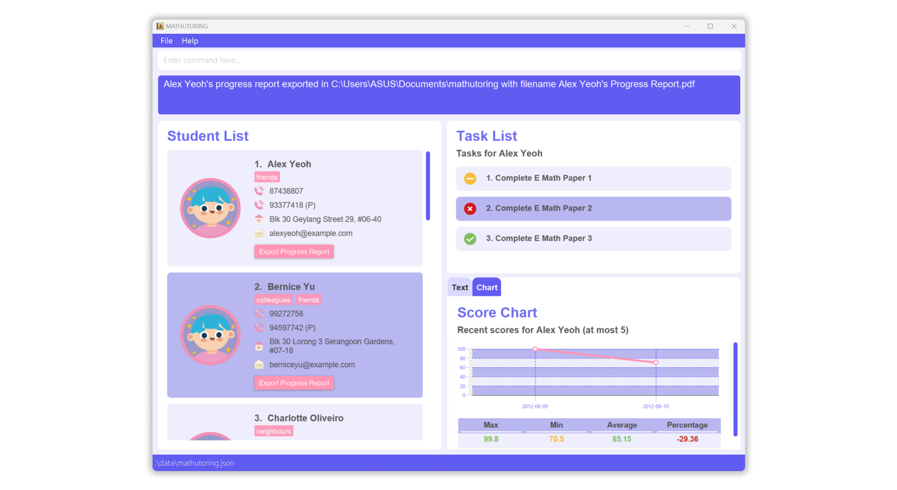

**MATHUTORING is a desktop application for private Math tuition teachers to manage their student contact details and performance.** While it has a GUI, most of the user interactions happen using a CLI (Command Line Interface).

* If you are interested in using MATHUTORING, head over to the [_Quick Start_ section of the **User Guide**](UserGuide.html#quick-start).
* If you are interested about developing MATHUTORING, the [**Developer Guide**](DeveloperGuide.html) is a good place to start.

**Acknowledgements**

* This project is based on the AddressBook-Level3 project created by the [SE-EDU initiative](https://se-education.org).
* Libraries used: [JavaFX](https://openjfx.io/), [Jackson](https://github.com/FasterXML/jackson), [JUnit5](https://github.com/junit-team/junit5), [Mockito](https://site.mockito.org/), [Apache PDFBox](https://pdfbox.apache.org/)
