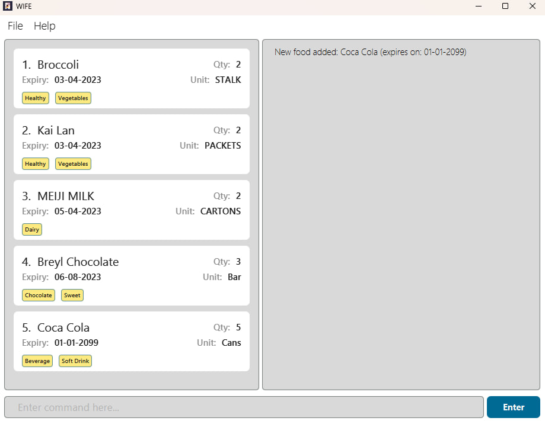

Enhance life with WIFE! Our product **Well Informed Fridge Environment &lt;WIFE/&gt;** helps users to **manage their
items** in the fridge. With this, one never has to worry about **optimizing storage** and **organisation of food items** in their
refrigerator!

* If you are interested in using WIFE, head over to the [_Quick Start_ section of the **User Guide**](UserGuide.html#quick-start).
* If you are interested about developing WIFE, the [**Developer Guide**](DeveloperGuide.html) is a good place to start.

**Acknowledgements**

Java dependencies:
* [Jackson](https://github.com/FasterXML/jackson) for JSON-related operations
* [JavaFX](https://openjfx.io/) for GUI
* [JUnit 5](https://github.com/junit-team/junit5) for testing

Documentation dependencies:
* [Jekyll](https://jekyllrb.com/) for conversion of .md files to .html files for rendering of website
* [PlantUML](https://plantuml.com/) for UML diagrams
