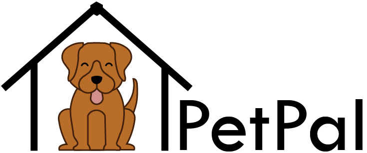

PetPal is your **furry and dependable assistant** who **reminds you of deadlines** and **consolidates crucial information** like pet names, tags dietary needs all in an **aesthetically pleasing** GUI! You can now focus on spend quality time with your furry friends without having to worry about things accidentally slipping your mind.

**PetPal is optimized for a Pet DayCare owner to use via the GUI (Graphical user interface)** while still having the benefits of a Command Line Interface (CLI). PetPal can help get your pet management tasks done without being tech-savvy and good at typing in the CLI.

This user guide will help you get started and understand how PetPal can **seamlessly streamline your pet caring duties**.

* If you are interested in using PetPal, head over to the [_Quick Start_ section of the **User Guide**](UserGuide.html#quick-start).
* If you are interested about developing PetPal, the [**Developer Guide**](DeveloperGuide.html) is a good place to start.

  

**Acknowledgements**

* Libraries used: [JavaFX](https://openjfx.io/), [Jackson](https://github.com/FasterXML/jackson), [JUnit5](https://github.com/junit-team/junit5)
* This project is based on the AddressBook-Level3 project created by the [SE-EDU initiative](https://se-education.org)
