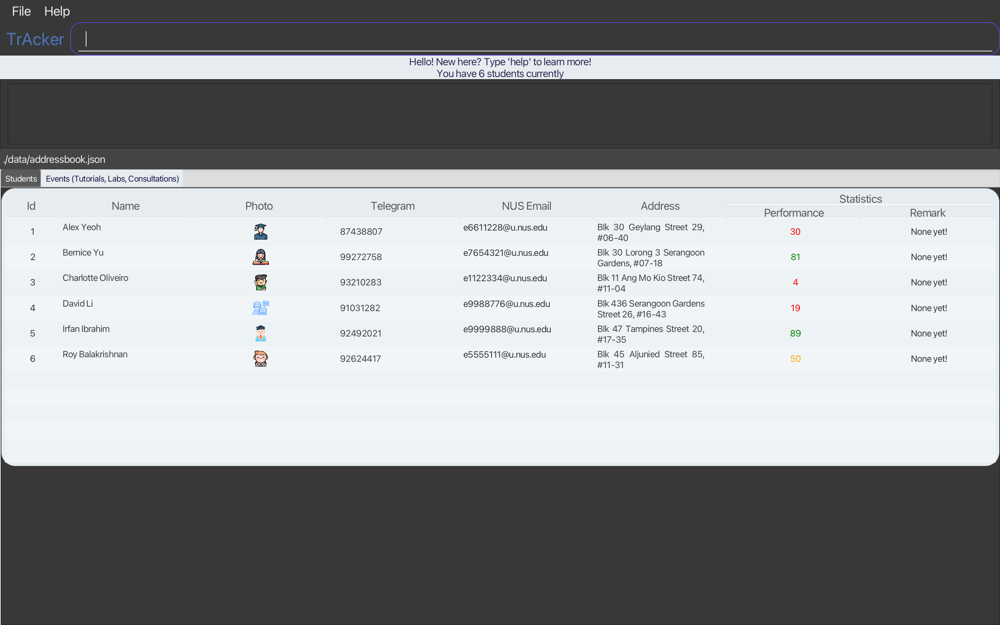

**TrAcker is a desktop application for CS2040 TAs to manage their schedule and students.** While it has a GUI, most of the user interactions happen using a CLI (Command Line Interface).

* If you are interested in using TrAcker, head over to the [_Quick Start_ section of the **User Guide**](UserGuide.md#quick-start).
* If you are interested about developing TrAcker, the [**Developer Guide**](DeveloperGuide.md) is a good place to start.

**Acknowledgements**

* Libraries used: [JavaFX](https://openjfx.io/), [Jackson](https://github.com/FasterXML/jackson), [JUnit5](https://github.com/junit-team/junit5)
