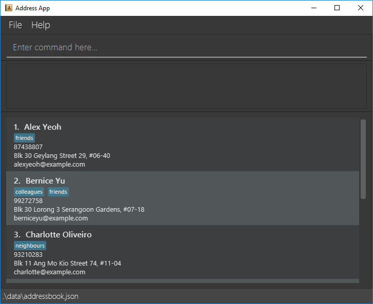

### Project: Fish Ahoy!

*Fish Ahoy!* Is a **desktop app for managing your fish, fish tanks, and relevant tasks, optimized for use via a Command
Line Interface** (CLI) while still having the benefits of a Graphical User Interface (GUI).  

*Fish Ahoy!* **streamlines** the fish keeping experience by helping you keep track of your many **fishes**, **tanks** and
**weekly tasks**, such as feeding and cleaning.

Given below are my major contributions to the project.

* **New Feature**: Added the ability to view the fishes in a tank and tasks associated with it
  * What it does: allows the user to see just the fishes that are in a specified tank
  * Justification: This feature improves the product significantly because a user can view the fishes in a tank without having to scroll through the entire list of fishes and having to manually sort by tank in their head.

* **New Feature**: Ability to list all fishes
  * What it does: allows to user to see all the fishes across all of their tanks
  * Justification: This feature was needed in conjunction with the previous one to allow the user to see all the fishes in their tanks.

* **Code contributed**: [RepoSense link](https://nus-cs2103-ay2223s2.github.io/tp-dashboard/?search=diamondroxxx&sort=groupTitle%20dsc&sortWithin=title&since=2023-02-17&timeframe=commit&mergegroup=&groupSelect=groupByRepos&breakdown=false)

* **Project management**:
  * Set up the initial repo and team on GitHub with all of the required CIs.

* **Enhancements to existing features**:

I was in charge of designing and implementing the user interface. I used JavaFX to create the GUI and used CSS to style the GUI. 
As such I had to redesign the Tank and Fish cards to fit the new GUI design. I also had to create Task cards from scratch. 

Shown below are the starting UI and the final UI respectively.

Working on the UI was challenging for me as most of my experience before this was with purely CLI applications.
I got a good chance to learn about JavaFX and CSS and how to use them to create a GUI. I also had to look up a lot of
UI design principles to make sure that the UI was intuitive and easy to use. There was also a lot of tweaking and trial and error required to make things look good.

I am most proud of the Tank Readings graphs as I think they present the required information in a clean and intuitive manner.
In the future, I would like to learn more about UI design so that I can show more information in a way that doesn't feel overwhelming.
In this current version of the UI I had to make certain compromises on the amount of information displayed to keep everything clean.

* **Documentation**:
  * User Guide:
    * Added FAQ section and small tweaks to add fish-keeping specific terminology.
    * Fixed some typos and formatting issues.
  * Developer Guide:
    * Added the implementation of the `UI` component.
    
