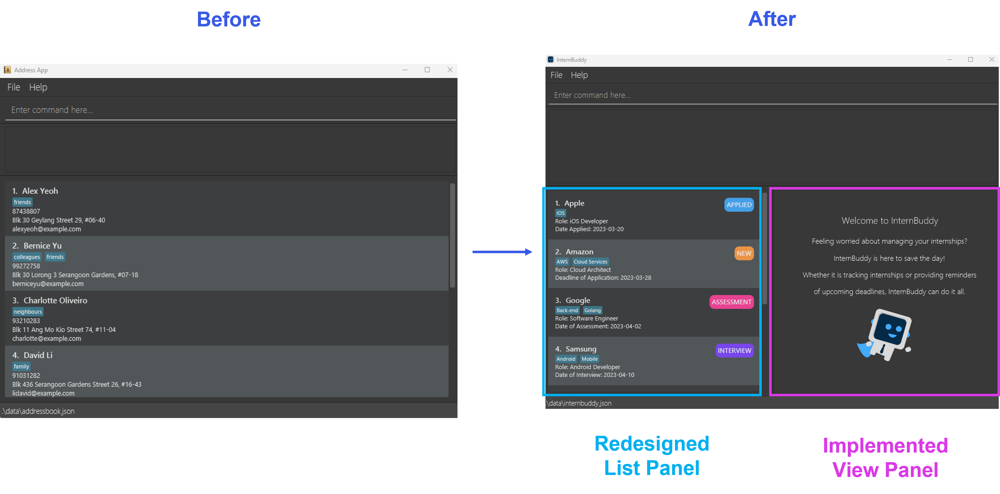

## About InternBuddy
InternBuddy is a desktop application for Computing undergraduates to manage their internship applications. It is
optimized for typing where it allows you to complete internship management tasks much more efficiently via
the keyboard as compared to using traditional Graphical User Interface (GUI) applications. If you are a fast
typist who is seeking for a one-stop platform to systematically organise your internship applications,
then InternBuddy is the perfect buddy to accompany you during your internship hunt.

## Project Contributions
Given below are my contributions to InternBuddy:

### Role
**1. UI Lead**
* Responsible for the aesthetics of InternBuddy
* Led UI development with the usage of JavaFX

**2. Documentation Lead**
* Oversaw the quality and adherence to standards for User and Developer Guides
* Conducted final checks on the documentation

### Code Contribution
[View it on RepoSense](https://nus-cs2103-ay2223s2.github.io/tp-dashboard/?search=eugenetangkj&breakdown=true&sort=groupTitle&sortWithin=title&since=2023-02-17&timeframe=commit&mergegroup=&groupSelect=groupByRepos&checkedFileTypes=docs~functional-code~test-code~other)

### Features and Enhancement
- **Refactored code to adapt the content of AddressBook-Level 3 to the context of InternBuddy**
  [\#13](https://github.com/AY2223S2-CS2103T-T14-3/tp/pull/13)
  * Renamed classes and packages, such as from `Person` to `Internship`
  * Renamed variables.
  * Redefined test cases to suit the context of internships instead of persons.

- **Redesigned the GUI of InternBuddy**
  [\#37](https://github.com/AY2223S2-CS2103T-T14-3/tp/pull/37)
  * Created a new look for the List Panel
  * Implemented a new View Panel for the viewing of internship information

- **Implement feature to add optional parameter, `COMMENT`**
  [\#79](https://github.com/AY2223S2-CS2103T-T14-3/tp/pull/79)
  * Users can now add an optional comment to an internship entry via the `add` command.
  * Editing of comments is made possible via the `edit` command.
  * If the user did not include a value for the comment, the comment will have a default value of `NA`.
  * Added test cases accordingly, such as in the class `CommentTest`.

- **Implemented the `view` command**
  [\#78](https://github.com/AY2223S2-CS2103T-T14-3/tp/pull/78)
  * Users can now view the detailed information of a selected internship entry.
  * Details are displayed in the View Panel.
  * Apart from showing the internship information, I added a tips box that will appear
    below the internship information. The contents of the tips box will change depending
    on the status of the internship entry.
  * Added test cases accordingly, such as in the class `InternshipDetailsCardTest`.

- **Redesigned the Help Window**
  [\#81](https://github.com/AY2223S2-CS2103T-T14-3/tp/pull/81)
  * Inserted the command summary and hyperlink to InternBuddy's user guide in the Help Window.
  * Created a new look for the Help Window.
  

- **Co-implemented GUI testing for InternBuddy**
  [\#52](https://github.com/AY2223S2-CS2103T-T14-3/tp/pull/52)
  * With code references from [AddressBook Level 4](https://github.com/se-edu/addressbook-level4)
    and [Please Hire Us](https://github.com/AY2223S1-CS2103T-W17-4/tp), I managed to implement
    test cases for UI components such as in the class `InternshipCardTest`.
  * Worked with my teammate, Christopher, to implement this.
  * GUI testing allows for better code coverage for InternBuddy.

### Documentation
- **Updated README**
  [\#13](https://github.com/AY2223S2-CS2103T-T14-3/tp/pull/13)
  * Removed AB3-related content and added InternBuddy-related content.

- **Updated Landing Page**
  * Removed AB3-related content and added InternBuddy-related content.

- **Contributed to User Guide**
  [\#21](https://github.com/AY2223S2-CS2103T-T14-3/tp/pull/21),
  [\#34](https://github.com/AY2223S2-CS2103T-T14-3/tp/pull/34),
  [\#102](https://github.com/AY2223S2-CS2103T-T14-3/tp/pull/102),
  [\#109](https://github.com/AY2223S2-CS2103T-T14-3/tp/pull/109)
  * Documented the explanation for the different parts in InternBuddy's GUI, accompanied by a graphic.
  * Wrote up the command information, explaining the format and constraints of commands and
    parameters in InternBuddy.
  * Responsible for the write-up of the `list`, `add`, `view`, `help` and `exit` commands,
    as well as on the sections on `Saving Internship Data` and `Loading the Data`.
  * Created the appendices to explain to users how to install Java 11 and manually edit the `internbuddy.json` file.
- **Contributed to Developer Guide**
  [\#23](https://github.com/AY2223S2-CS2103T-T14-3/tp/pull/23),
  [\#82](https://github.com/AY2223S2-CS2103T-T14-3/tp/pull/82),
  [\#84](https://github.com/AY2223S2-CS2103T-T14-3/tp/pull/84),
  [\#86](https://github.com/AY2223S2-CS2103T-T14-3/tp/pull/86),
  [\#119](https://github.com/AY2223S2-CS2103T-T14-3/tp/pull/119)
  * Explained implementation and design considerations for `add` and `view` commands, supplementing the explanations with sequence diagrams
  * Defined product scope by identifying InternBuddy's target audience and value proposition.
  * Drafted user stories on how Computing undergraduates would use InternBuddy.
  * Added test cases for instructions on manual testing, such as for the `add` and `view` commands.

### Code Review
- **Provided non-trivial comments for**
  [\#47](https://github.com/AY2223S2-CS2103T-T14-3/tp/pull/47),
  [\#80](https://github.com/AY2223S2-CS2103T-T14-3/tp/pull/80),
  [\#100](https://github.com/AY2223S2-CS2103T-T14-3/tp/pull/100)

### Others
- **Designed the logo for InternBuddy**

 

  

