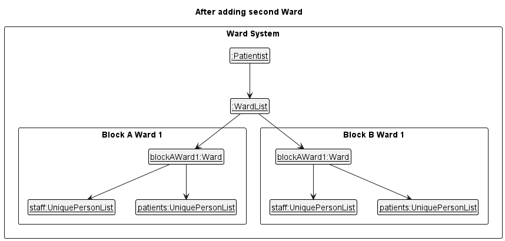

### Project: Patientist - hospital management system

Patientist is a patient management system that seeks to unify data management in medical facilities.
Admin and medical staff alike will find this application useful due to the myriad of features available,
yet being fast and lightweight to use due to its optimisation for Command Line Interface (CLI) interaction.

Given below are my contributions to the project.

* **New Feature**: Adds Patient's todo list
  * Add a todo field to patient on the UI display when viewing the patient's details
  * Add relevant commands to logic to support adding and deleting todo for patients
  * Add relevant components to store todos in Storage
  * Add relevant fields to model for patient to keep track of their todo list

* **Enhancements to existing features**:
  * Extended the existing functionality in AB-3's model for storing contacts such that it can support multiple wards
    * Adds `uniqueWardList` to maintain the uniqueness of wards in the patientist, each of which contain their own `uniquePersonList` for staff and patients respectively
  * Extended the types of `Person` in AB-3 such that `Person` is abstract, and the Model manages `Patient` and `Staff` instead
    * Changes the concept of uniqueness of identity for a `Person` to be based on ID number field, rather than name
  * Redefined the API `Model` to conform with new operations involving `Wards`
    * Operations now require a ward and a person type to be included, requiring reworking of all existing API functionality
    * Uniqueness of person being added now needs to be enforced across multiple wards, instead of just one `uniquePersonList`

* **Code contributed**: [RepoSense link](https://nus-cs2103-ay2223s2.github.io/tp-dashboard/?search=&sort=groupTitle&sortWithin=title&timeframe=commit&mergegroup=&groupSelect=groupByRepos&breakdown=true&checkedFileTypes=docs~functional-code~test-code~other&since=2023-02-17&tabOpen=true&tabType=authorship&tabAuthor=euph00&tabRepo=AY2223S2-CS2103T-T12-1%2Ftp%5Bmaster%5D&authorshipIsMergeGroup=false&authorshipFileTypes=docs~functional-code~test-code~other&authorshipIsBinaryFileTypeChecked=false&authorshipIsIgnoredFilesChecked=false)

* **Project management**:
  * Performed the initial refactoring of the codebase to rename AB-3 to Patientist
  * Set up assertions in team gradle
  * Maintained majority of the issue tracker (creating/organising issues etc.)
  * Created v1.2 and v1.3 releases

* **Documentation**:
    * User Guide:
      * Decided on and implemented new formatting style for UG 
      * Rewrote the AB-3 UG to set direction for Patientist implementation 
        * This draft decided the general direction of the first implementation in v1.2.
        * All subsequent work on the UG focused on modifying details in the UG to fit with the actual product implementation, based on implementation that would require the minimum changes to make a useable product.
      * Wrote product summary for UG
    * Developer Guide:
      * Created table for User Stories in DG
      * Wrote section for target user profile in DG
      * Wrote section for value proposition in DG
      * Responsible for updating DG section for Model component
        * Update Class diagram for the overall implementation of Model component
        * Update description of Model component to include newly implemented Ward system
        * 
      * Responsible for updating DG section for documenting the wards feature
        * Created Object diagrams such as, but not limited to
        * 

* **Community**:

* **Tools**:
