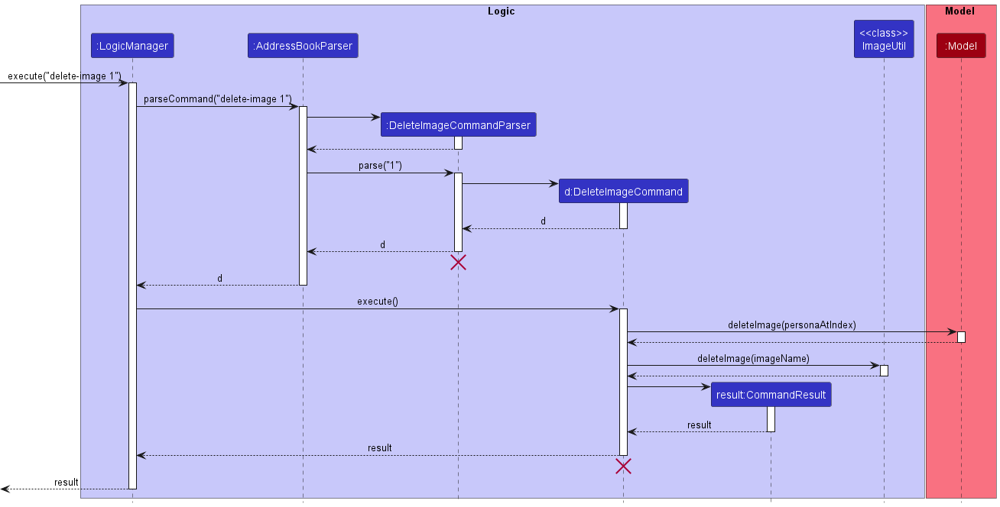

# Project: BookFace

## Overview

BookFace is an NUS-centered contacts management system that allows students
of NUS to organise their list of friends and acquaintances that they have
met in their various classes, CCAs, project groups etc. The application aims
to provide NUS students a means to keep track of the contact details of th
numerous people they have met during their time in NUS in hopes of facilitating
better communication among peers, as well as provide a centralised channel for
students to obtain relevant administrative contact information of the various
departments and faculties that are in the school.

## Summary of Contributions

### Code Contributed

[Here](https://nus-cs2103-ay2223s2.github.io/tp-dashboard/?search=&sort=groupTitle&sortWithin=title&timeframe=commit&mergegroup=&groupSelect=groupByRepos&breakdown=true&checkedFileTypes=docs~functional-code~test-code~other&since=2023-02-17&tabOpen=true&tabType=authorship&tabAuthor=hongshenggg&tabRepo=AY2223S2-CS2103-F11-4%2Ftp%5Bmaster%5D&authorshipIsMergeGroup=false&authorshipFileTypes=docs~functional-code~test-code&authorshipIsBinaryFileTypeChecked=false&authorshipIsIgnoredFilesChecked=false)
is a link to view the code that has been contributed to the team project.
The section below will provide a brief overview on what key features have
been implemented.

### Enhancements implemented

Main contributions revolved around two key features:
1. Delete-image
2. Find

{Todo: Add summary}

### Contributions to the UG

The following are the list of sections that have been contributed to the UG:

- Table of contents located at the top of the UG
- Quick Start
- Features: 
  - Delete user contacts: `delete`
  - Locating persons by keywords: `find`
  - Delete an image for contacts: `delete-image`

### Contributions to the DG

The following are the list of sections that have been contributed to the DG:

- Creation of the main skeletal structure of the DG to facilitate team members contributions.
- Table of contents located at the top of the DG
- Acknowledgements
- Implementation:
  - Delete Image Feature
  - Find Feature

The diagrams contributed to the DG are reproduced below.

    
    
<i>Figure 1: Delete image sequence diagram</i>

    
    
<i>Figure 2: Delete image activity diagram</i>

### Contributions to team-based tasks

The following are the list of team-based tasks accomplished:
- Maintaining the issue tracker
- Adding non-feature related sections to the UG and DG

### Review/mentoring contributions:

Main contributions in this aspect revolve around reviewing and approving of
teammate's Pull Requests, as well as sharing technical opinions through
informal channels, such as team meetings and group chat with team members.

### Contributions beyond the project team:

Participated in the Practical Exam Dry Run and performed bug testing on
the [CareFlow](https://github.com/AY2223S2-CS2103T-W09-3/tp) application.
