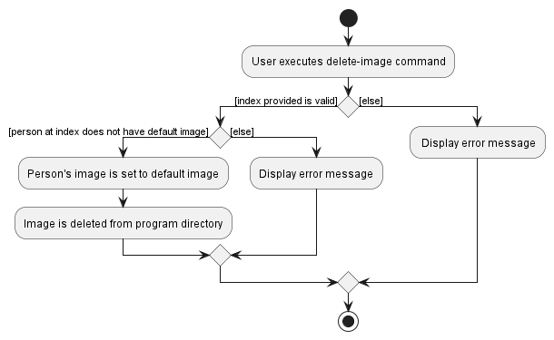

### Overview

BookFace is an NUS-centered contacts management system that allows students of NUS to organise their list of friends and acquaintances that they have met in their various classes, CCAs, project groups etc. The application aims to provide NUS students a means to keep track of the contact details of the numerous people they have met in school, as well as provide a centralised channel for students to obtain school staff contact information.

### Summary of Contributions

**Code Contributed:** [RepoSense link](https://nus-cs2103-ay2223s2.github.io/tp-dashboard/?search=&sort=groupTitle&sortWithin=title&timeframe=commit&mergegroup=&groupSelect=groupByRepos&breakdown=true&checkedFileTypes=docs~functional-code~test-code~other&since=2023-02-17&tabOpen=true&tabType=authorship&tabAuthor=hongshenggg&tabRepo=AY2223S2-CS2103-F11-4%2Ftp%5Bmaster%5D&authorshipIsMergeGroup=false&authorshipFileTypes=docs~functional-code~test-code&authorshipIsBinaryFileTypeChecked=false&authorshipIsIgnoredFilesChecked=false)

**Features implemented**

**New feature:** `delete-image`

* What it does: `delete-image` allows users to delete the contact image that they have 
set on a contact in their list of contacts. Once executed, the contact image of the 
contact of interest will be replaced with a default image. This feature is to be used
as a counterpart to the `add-image` feature.
* Justification: As `add-image` allows users to add an image to their contacts, `delete-image`
allows them to remove the image that they added if they wish to do so. This feature thus
enables them to undo any mistakes that they have done when performing the initial
`add-image` command, or simply just to remove the image for any other reason that they have.

**Feature enhancement:** `find`
* What it does: The original `find` function inherited from AddressBook3 was only able to filter out contacts based on an exact matching with the input argument and contact names. The `find` function has since been improved to be able to filter based on any of the attributes that a contact has (i.e., name, status, phone, email, address, and tags). An exact matching for the keywords in the different attributes will also no longer be required. 
* Justification: This improvement was made as it delivers one of the most significant function promised by the BookFace application, which was to help our users manage their contacts based on the several classes and clubs that they belong to. Allowing users to filter by the attribute prefixes also grants a great flexibility in searching for their desired contacts. This flexibility is further improved by removing the restrictions on requiring an exact matching in the keywords. For instance, if a user wanted to find all of his contacts that he met in his Computer Science classes, he could enter `find t/cs` to get a filtered list of all his contacts that contains "cs" in their tags, despite him having added the contacts based on the specific classes that he met them in (e.g., CS2103, CS2106, CS2105, etc). The inherited version of `find` from AddressBook3 will fail in this scenario as none of the tags have an exact match to "cs" (not to mention that the original `find` could only filter by contact names).
* Highlights: The main challenge involved in implementing this enhancement was understanding the existing codebase to figure out how prefixes and keywords were parsed and extracted from the user input. After getting a sound understand of the underlying architecture in place to facilitate this, the next challenge involved handling `Predicate` classes. As this was an unfamiliar class, additional study on the documentation was required to properly implement this feature enhancement.

**Contributions to the UG**

The following are the list of sections that have been contributed to the UG:

- Table of contents located at the top of the UG
- Quick Start
- Features: 
  - Delete user contacts: `delete`
  - Locating persons by keywords: `find`
  - Delete an image for contacts: `delete-image`

**Contributions to the DG**

The following are the list of sections that have been contributed to the DG:

- Creation of the main skeletal structure of the DG to facilitate team members contributions.
- Table of contents located at the top of the DG
- Acknowledgements
- Implementation:
  - The introduction paragraph under implementation that introduces readers to the section, and more importantly provide a note to the reader on the limitations of PlantUML
    regarding the class lifelines and destroy marker.
  - Delete Feature
  - Delete Image Feature
  - Find Feature

**Contributions to team-based tasks**

The following are the list of team-based tasks accomplished:
- Maintaining the issue tracker
- Adding non-feature related sections to the UG and DG

**Review/mentoring contributions**

Main contributions in this aspect revolve around reviewing and approving of teammate's Pull Requests, as well as sharing technical opinions through informal channels, such as team meetings and group chat with team members.

**Contributions beyond the project team**

Participated in the Practical Exam Dry Run and performed bug testing on the [CareFlow](https://github.com/AY2223S2-CS2103T-W09-3/tp) application.

### Contributions to the Developer Guide (Extracts)

The diagrams contributed to the DG are reproduced below.

    
    
<i>Figure 1: Delete image sequence diagram</i>

    
    
<i>Figure 2: Delete image activity diagram</i>

    
    
<i>Figure 3: Find sequence diagram</i>

    
    
<i>Figure 4: Find activity diagram</i>

