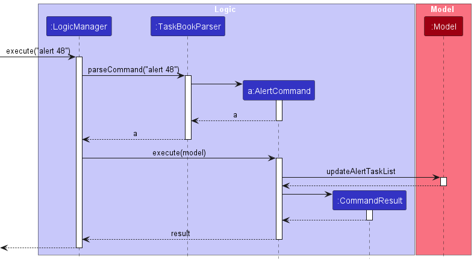
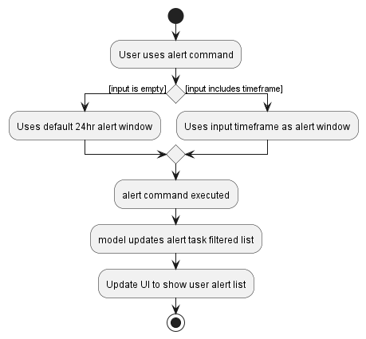

### Project: Clock-Work

Clock-Work is a desktop application for managing tasks and assignments, optimised for use via a Command Line Interface
(CLI) while still having the benefits of a Graphical User Interface (GUI). If you can type fast, Clock-Work can get your
assignment management tasks done faster than traditional GUI applications.

Given below are my contributions to the project.

* **Code contributed**: [RepoSense link](https://nus-cs2103-ay2223s2.github.io/tp-dashboard/?search=huggenguggen)

* **Enhancements to existing features**:
    * `find` command enhancement [PR#48](https://github.com/AY2223S2-CS2103T-W13-3/tp/pull/48)
      * Previously, `find` only by name
      * Now it will find by most attributes
      * The aim was to make the find command complete
        * This means that a user should be able to find by most attributes
        * This has major implications for future attributes if we choose to add them
    * Add support for different types of `Tasks` [PR#59](https://github.com/AY2223S2-CS2103T-W13-3/tp/pull/59)
      * Added 3 subclasses, SimpleTask, Deadline, and Event.
      * Add support in addCommandParser to add different type of tasks dynamically.
      * Change representation in JsonAdaptedTask such that it can represent new types of task and still parse them.
    * `alert` command [PR#78](https://github.com/AY2223S2-CS2103T-W13-3/tp/pull/78)
      * Adding `alert` command
      * The `alert` command was inspired by the reminder systems on phones.
      * Setting an alert for `Deadlines` and `Events` felt like a natural function.
      * With alert, we thought a pop-up UI similar to `help` made sense.
      * We realized this gets in the way of users who want to continue typing and was counter to CLI restraint.
      * I then remade the UI so that `alerts` would appear on the right instead. [PR#155](https://github.com/AY2223S2-CS2103T-W13-3/tp/pull/155)
      * This made it unobtrusive but still useful.
      * A challenge faced was for alerts to be persistent over app usage.
        * I decided on making alert a attribute of tasks that users cannot directly access.
        * When setting an alert window, the user implicitly sets the alertWindow attribute of all tasks.
        * This way on load I can immediately check if any task is due + if the user calls alert it will be
based on the last call.
      * Implement GUI for alert

* **Documentation**:
    * Contributions to the User Guide:
        * GUI screenshot

        * Fix typos
        * `find` command section

        * `alert` command section

    * Contributions to the Developer Guide:
        * Updating of the UI component

        * Write-up for `find` command
          * This includes the sequence diagram and activity diagram.

        * Write-up for `alert` command
          * This includes the sequence diagram and the activity diagram.

        * Write-up for Use Case: add a task

* **Community**:
    * Review/mentoring contributions
      * Reviewed 27/69 Pull Requests
      * Frequently at least 1 comment if not more

