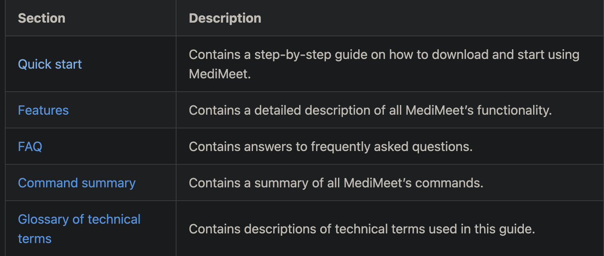
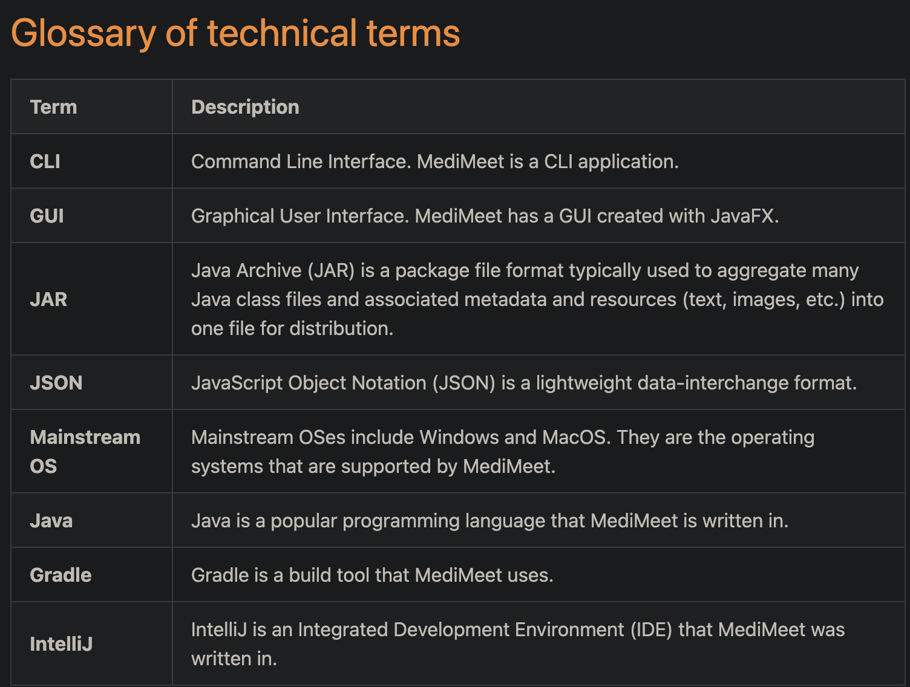
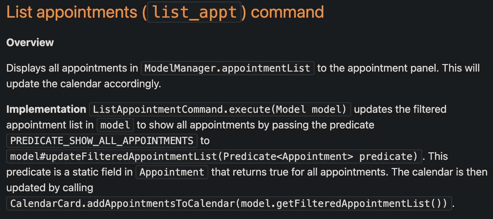

## Project: MediMeet

**MediMeet** is a desktop application that enables doctors to effectively manage patient details and appointments. It saves costs by reducing the need for personal assistants or appointment managers.
Given below are my contributions to the project.

### New Features implemented:
1. `Appointment`, `AppointmentList`, `ReadOnlyAppointmentList`: Components of the appointment model.
   * **What it does**: model to store appointment details such as date, time, patient name and appointment description.
   * **Justification**: This feature is necessary to store appointment details entered by the user. It was implemented in a similar fashion to AB3's `Person` and `PersonList`.
   * **Highlights**: This feature was a significant undertaking, as it involved creating a new model component, and updating the existing `Model` and `ModelManager` classes to support the new component, coming to 400+ lines of code.
   !
2. `AppointmentCard` and `AppointmentListPanel`: UI for displaying appointment details.
   * **What it does**: displays appointment details as a list in the UI.
   * **Justification**: This feature is necessary to display appointment details to the user. It was implemented in a similar fashion to AB3's `PersonCard` and `PersonListPanel`.
   
3. `CalendarCard`: Calendar panel to display appointments visually.
   * **What it does**: displays appointments in a calendar format, with the ability to click on a date to view appointments for that date.
   * **Justification**: This feature is a nice-to-have and makes it easier for the user to see at a glance what appointments on a particular date.
   * **Highlights**: This feature was implemented using the [CalendarFX](https://dlsc.com/products/calendarfx/) library.
   
>>>>>>> 6d31dc90 (Add images of work to PPP)
* **Code contributed**: [RepoSense link](https://nus-cs2103-ay2223s2.github.io/tp-dashboard/?search=Jayanth-Balasubramanian&sort=groupTitle&sortWithin=title&timeframe=commit&mergegroup=&groupSelect=groupByRepos&breakdown=true&checkedFileTypes=docs~functional-code~test-code~other&since=2023-02-17&tabOpen=true&tabType=authorship&tabAuthor=Jayanth-Balasubramanian&tabRepo=AY2223S2-CS2103T-W12-4%2Ftp%5Bmaster%5D&authorshipIsMergeGroup=false&authorshipFileTypes=&authorshipIsBinaryFileTypeChecked=false&authorshipIsIgnoredFilesChecked=false)

### Enhancements implemented:
* Command aliases to make the syntax more user-friendly for first time users.

### Documentation:
* User Guide:
  * Made the language more user-friendly.
  * Added section on how to best use the guide, and a description of each section of the guide with links for easy navigation.
  
  
  * Added tip on how the user can check their default Java version.
  * Added information on aliases for commands.
  * Added a glossary for technical terms for less technical users.
  
* Developer Guide:
  * Added value proposition, user stories and non-functional requirements for the application.
  * Documented the implementation of `list_patient`, `list_appt`, `clear` and `exit` commands.
  
  * Updated UI related UML diagrams.
  
  * Added section detailing known feature flaws and proposals for fixing them in the future.
  
### Contributions to team-based tasks:
* Refactored AB3 codebase, changing class names and attributes to suit MediMeet.
* This was a massive undertaking that involved changing 81 files, with 1300+ lines of code changed.

### Reviewing/mentoring contributions:
* Reviewed 8 PRs, including all appointment related functionality like editing, finding and deleting appointments.
