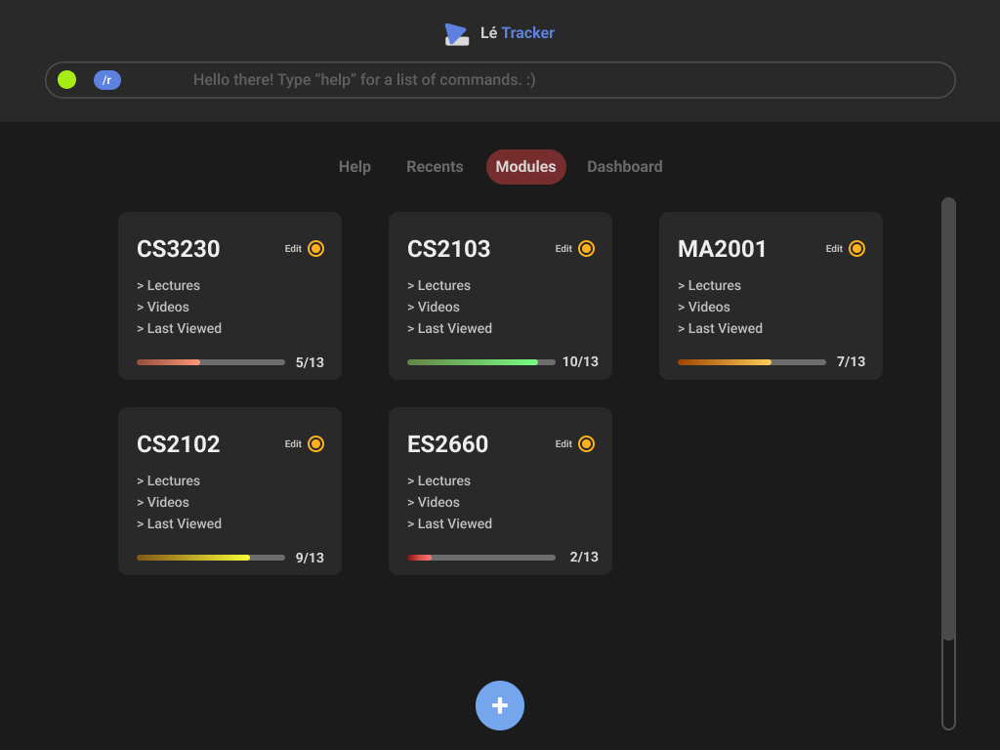

#### Table of Contents

- [Project: Le Tracker](#project-le-tracker)
- [Summary of Contributions](#summary-of-contributions)
  - [Code Contribution](#code-contribution)
  - [User Interface](#user-interface)
  - [Navigation](#navigation)
  - [User Guide](#user-guide)
  - [Developer Guide](#developer-guide)
  - [Team-Based Tasks](#team-based-tasks)
  - [Review / Mentoring](#review--mentoring)

### Project: Le Tracker

**Le Tracker** makes it easy to measure your overall study progress by tracking how much lecture content you have covered across various modules.

**More** than just a simple to-do list app, **Le Tracker** blends the **efficiency** of a command line interface with the **elegance** of modern graphical user interface.

### Summary of Contributions

#### Code Contribution
You can refer to my individual code contribution at this [link](https://nus-cs2103-ay2223s2.github.io/tp-dashboard/?search=jedidiahc&breakdown=true).

#### User Interface

As I was taking the course CS3240 (Interaction Design) concurrently, the team decided that I would handle responsibilities related to user interface design and implementation.

Earlier in the project, I also developed a mockup for the user interface using Figma to explore potential interface solutions as well as develop a suitable look and feel for the product.

#### Navigation

I implemented and integrated the navigation feature. The navigation feature includes:

- A Navigation component which tracks the current working context and enforces navigation between the layers in the module-lecture-video hierarchy.
- Navigation commands `nav`, `navb` that allow the user to navigate relatively or directly to a target.
- A command preprocessing system `NavigatorInjector` that injects the necessary arguments `/mod` `/lec` based on the current working context into the user's commands before the parsing stage. Transforming input like `add` into context-specific commands like `add /mod CS2040S /lec Week 1`.
- UI Indicator for current working context.
    

#### User Guide

- Contributed to the introduction of user guide
- Added navigation-related sections
  - Brief Guide to Navigation
  - Navigation

#### Developer Guide

- Updated
  - UI component
  - Logic component

- Added
  - Navigation component
  - Navigation feature

- Contributed to
  - User stories
  - Use cases
  - Glossary
  - Instructions for manual testing

#### Team-Based Tasks

- Created issues for the v1.2 iteration for the team repo on GitHub

#### Review / Mentoring

- Reviewed / approved multiple PRs on GitHub including
  - [PR #157](https://github.com/AY2223S2-CS2103-F10-2/tp/pull/157) On incorrect usage of Navigation API

- Developed a convention for commands to make context specification consistent `/mod`, `/lec`
