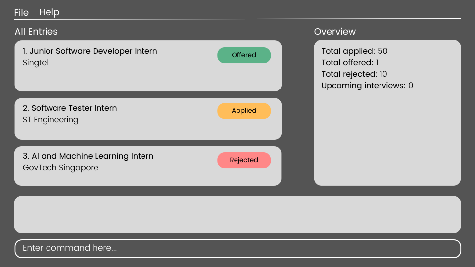

### Project: Le Tracker

**Le Tracker** makes it easy to measure your overall study progress by tracking how much lecture content you have covered across various modules.

**More** than just a simple to-do list app, **Le Tracker** blends the **efficiency** of a command line interface with the **elegance** of modern graphical user interface.

### Summary of Contributions

#### Table of Contents

- [Project: Le Tracker](#project-le-tracker)
- [Summary of Contributions](#summary-of-contributions)
  - [Table of Contents](#table-of-contents)
  - [User Interface](#user-interface)
  - [Navigation](#navigation)
  - [User Guide](#user-guide)
  - [Developer Guide](#developer-guide)
  - [Team-Based Tasks](#team-based-tasks)
  - [Review/Mentoring](#reviewmentoring)
  - [Misc](#misc)

#### User Interface

As I was taking the course CS3240 (Interaction Design) concurrently, the team decided that I would handle responsibilities related to user interface design and implementation.

I developed mockup for the user interface using Figma to explore potential interface solutions as well as developing a look and feel for the product.

#### Navigation
I implemented and integrated the navigation feature. The navigation feature includes:

- A Navigation component which tracks the current working context and enforces navigation between the layers in the module-lecture-video hierarchy.
- Navigation commands `nav`, `navb` that allow the user to navigate relatively or directly to a target.
- A command preprocessing system `NavigatorInjector` that injects the necessary arguments `/mod` `/lec` based on the current working command into the user's commands before the parsing stage. Transforming input like `add` into context-specific commands like `add /mod CS2040S /lec Week 1`.

#### User Guide

#### Developer Guide
to be added soon

#### Team-Based Tasks

#### Review/Mentoring
to be added soon

#### Misc
to be added soon
